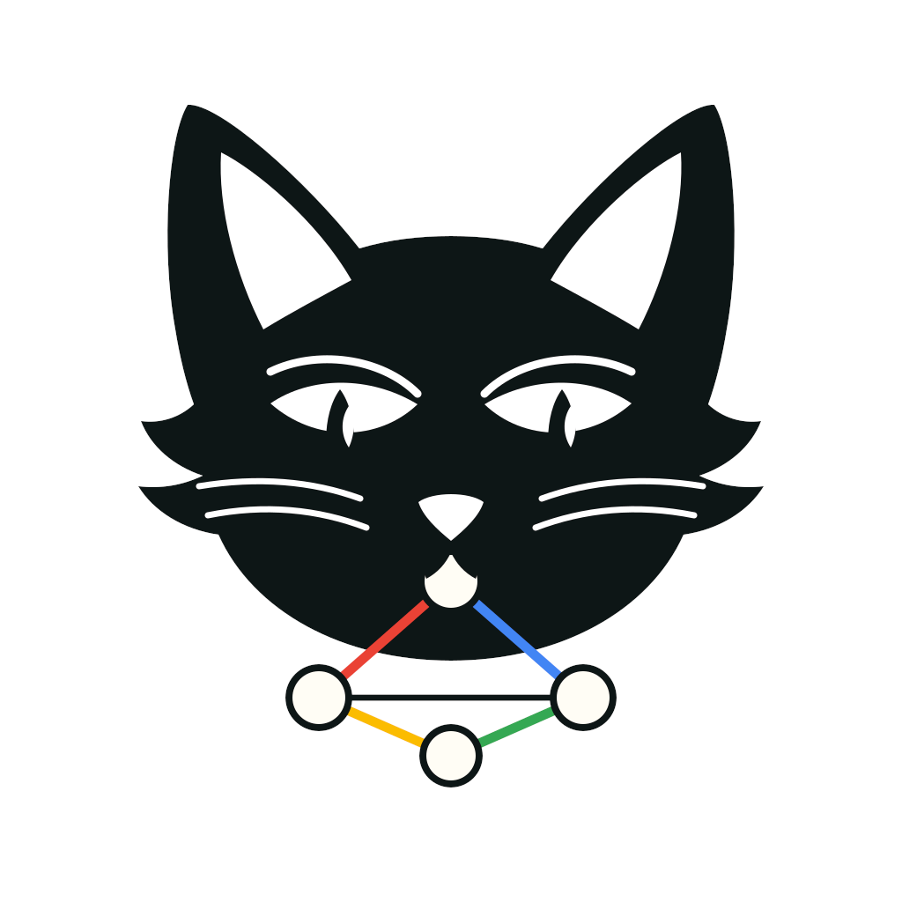

<p align="center">
  
</p>

# GMEOW — Global Metadata and Entity Ontology for the Web

> **An LLM output is a claim, not a truth.**

<p align="center">
  <a href="https://github.com/Blackcat-Informatics/gmeow-ontology/actions/workflows/ci.yml"></a>
  <a href="https://github.com/Blackcat-Informatics/gmeow-ontology/actions/workflows/codeql.yml"></a>
  <a href="./LICENSE"></a>
  <a href="./LICENSE-ontology"></a>
  <a href="https://doi.org/10.67342/26w4o"></a>
</p>

GMEOW is an ontology engine for machine and human minds that treats every mental act as an
*attributed, revisable claim* rather than a stored truth — a formal place to put not just
what an agent (or a person) believes, but **who held it, from what vantage, with what
confidence, on what evidence, by which kind of reasoning, in what state of awareness, and
whether it has since been defeated.** Its flagship use is **grounded agent memory** — store
/ recall / revise — that can tell a recalled fact from a confabulated one and surfaces
disagreement as coexisting standpoints instead of overwriting the loser.

- **One claim construct, reused everywhere.** A single reified *vantage × feature × result*
  observation does the work of a measurement, a date, a categorization, an inference
  conclusion, *and* a standpoint assertion — so new capabilities add almost no new primitives.
- **Truth is never a bit.** No `isTrue`, no factive "knows." Belief is a flat lattice
  (`believes` / `doubts` / `suspends` / `accepts`) with one entailment, `knowsThat ⊑ believes`;
  truth rides a per-frame modality (□ / ◊ / refuted / "bullshit"), so contradictory claims
  coexist rather than being ranked.
- **A full model of mind.** Endurant **states** (belief, the knowing-spectrum, intention,
  emotion, metacognition) and occurrent **processes** (perceiving, reasoning, learning,
  imagining, dreaming) over **content** typed by direction-of-fit (propositions, goals,
  questions, concepts, imagined) — every faculty given a human face *and* a machine face
  (belief↔logits, memory↔context, inference↔chain-of-thought).
- **Reasoning as a first-class, inspectable act.** Deduction / induction / abduction /
  analogy, where a deduction's substrate is a real proof trace; calibration and
  reality-monitoring (over/under-confidence, known-unknowns, an `originGenerated`
  confabulation flag) are modeled directly.
- **Revision is suppression, never deletion.** A fired defeater marks the old conclusion
  `displayable false` and closes its tenure while keeping the inference as audit — which
  *is* the memory's `revise()` operation.
- **Authored once, then projected and linked widely.** Every fact is stated once across
  GMEOW's **self-contained slices** and generated outward as lossy projections — OWL,
  SHACL, JSON-LD, schema.org, citation and Crossref-deposit forms — while every term is
  maximally aligned to **85 external vocabularies** and authority identifiers (schema.org,
  Wikidata, PROV-O, FOAF, ORCID, DOI…), so a GMEOW graph is a first-class node in the
  linked-data and persistent-identifier web.
- **Friendly front, rigorous engine.** Flat JSON / Pydantic / MCP tools are the front door
  (no one learns RDF); reasoned RDF is the engine room.

**One engine, three products** ([v0.2.0 realignment](./docs/REALIGNMENT-v0.2.0.md)):

| Product | What it is | Status |
|---|---|---|
| **`gmeow` (native Rust CLI)** | The five-minute client and repo-free consumer CLI: inspect the bundled ontology, describe terms, verify bundles, transpile RDF, project profiles, and run the MCP server. Built from source (`make cli-build` → `dist/bin/gmeow`) or obtained as a GitHub release binary | shipped |
| **Grounded-memory MCP server** | `store_claim` / `recall` / `revise_belief` tool-calls for agents, backed by the claim, standpoint, evidence, and suppression model | shipped |
| **GTS `ai-package`** | A content-addressed, append-only, signable **single-file agent memory** — belief revision as suppression frames; portable across sessions, models, and vendors ([spec](https://github.com/Blackcat-Informatics/gmeow-gts/blob/main/docs/GTS-SPEC.md)) | shipped with Python, Rust, Go, and TypeScript engines plus signing/verification |

**Verifiable release builds.** The `gmeow` CLI binary and the `gmeow.gts` artifact are
built in GitHub Actions and signed with GitHub artifact attestations. After downloading a
release artifact, verify it with:

```bash
gh attestation verify <path-to-artifact> --repo Blackcat-Informatics/gmeow-ontology
```

SPDX SBOMs are also generated for each release and attached as workflow artifacts.

**The engine** underneath is a reasoning-centric, RDF 1.2-native, `logic:`-grounded
super-vocabulary for modelling *digital existence* — people, organizations, documents,
agreements, contacts, observations, measurements, locations, rights, identity, and
contested facts — grounded comprehensively from `logic:`, `math:`, and `lang:` to **gUFO**,
**BFO/OBO**, **DUL**, **YAMATO**, **OpenCyc**, **SUMO**, **OWL/RDFS**, **SHACL**,
**Data Cube/STATO/OBCS**, and **OntoLex/WordNet/NIF/Web Annotation**, and **projected** down to 15+ consumer vocabularies
(schema.org, FOAF, GeoSPARQL, vCard, iCalendar, OWL-Time, ODRL, …) and **aligned by
reference** to dozens more (PROV-O, ORG, OntoLex-Lemon, Wikidata, BFO, QUDT, FALDO, IVOA,
CIDOC-CRM, …) — see the [projection](#projection-targets) and
[alignment](#aligned-by-reference) tables below. No consumer is ever required to learn RDF
to benefit ([Principle 13](./CONSTITUTION.md)); the deep model is there when you need it —
typically the first time two models disagree about a fact. The full guide set is indexed in
the [documentation map](#documentation-map).

**Why does this exist?** Because LLM and RAG outputs are stored as *truth* — no provenance,
no evidence, no confidence, no time, no way to disagree — and that is a category error with
compounding costs. See [`docs/RATIONALE.md`](./docs/RATIONALE.md) for the long form, and
the position paper *"An LLM Output Is a Claim, Not a Truth: A Substrate for Grounded Agent
Memory."*

**Principles.** Every design decision and pull request is measured against
[`CONSTITUTION.md`](./CONSTITUTION.md) — nineteen normative principles (claim-not-truth,
the-product-is-a-tool, RDF-1.2-first, one-canonical-source, maximal bridging, greenfield,
verified-by-construction, frame-relativity, suppression-never-erasure, logic-is-canonical,
the-grounding-layer-triad, …).
Cite them by number in issues and PRs.

- **Canonical IRI:** <https://blackcatinformatics.ca/gmeow> (slash namespace, term IRIs
  like `…/gmeow/Person`)
- **Vocabulary license:** [CC BY 4.0](./LICENSE-ontology) (dual-licensed — see [Licensing](#licensing))
- **Tooling license:** [AGPL-3.0-only](./LICENSE) (dual-licensed — see [Licensing](#licensing))
- **Copyright:** © 2026 Blackcat Informatics® Inc.

**Four things GMEOW does that no agent-memory store does:**

- **Statement-level provenance & confidence.** RDF 1.2 / RDF\*-first: every fact is an
  attributed, confidence-weighted, time-scoped claim, downcast losslessly to OWL axiom
  annotations for reasoners ([Principles 2–3](./CONSTITUTION.md); see *RDF 1.2* below).
  A sensor reading, a human assertion, and a model output are the *same reified construct*.
- **Contested facts without a winner.** Disputed facts — including two models disagreeing —
  are recorded as coexisting, standpoint-indexed claims, never collapsed to a preferred,
  ranked, or latest value ([`docs/standpoints.md`](./docs/standpoints.md)).
- **Forgetting with an audit trail.** Belief revision is supersession + suppression
  (`gmeow:displayable false`), never deletion: the superseded belief is withheld from every
  projection and recall path, and retained — with when, on whose say-so, and why — forever
  ([Principle 10](./CONSTITUTION.md)).
- **Identity, naming & display safety — for human *and* digital subjects.** Names and
  identity are reified, co-equal and self-asserted — no `primaryName`/`preferredGender`,
  deadnames suppressed-not-deleted, a 7-axis orthogonality matrix (pronouns ⟂ honorifics ⟂
  gender identity ⟂ expression ⟂ sex ⟂ sexual ⟂ romantic orientation) **enforced by
  tests** — and self-assertion outranks any inference, for people and for AI entities alike
  ([Principles 9 & 16](./CONSTITUTION.md); [`slices/core/names/docs.md`](./slices/core/names/docs.md),
  [`docs/identity-mapping.md`](./docs/identity-mapping.md)). Identity and deception
  epistemics ship in the **core**, by commitment — a memory substrate that makes "what is a
  person" an optional add-on has already answered the question, badly.

> **Status.** GMEOW now ships with **slices**, each with a full guide; slice
> examples exercise the model and feed the full GTS bundle. The current surface covers
> identity (entities, names, gender, sexuality, languages), social/contact/email/account
> data, content/evidence/software, trust/attestation/crypto, skills, cognition,
> epistemics, agreements, rights, norms, risk, place/time/events, music, narrative,
> research objects, and the frame-relative observation/measurement spine. The logic layer
> is native RDF 1.2 first: OWL, Datalog, N3, Prolog, probabilistic, counterfactual, and
> profile-certified forms are projections of the same `logic:` source. The full
> toolchain (validate → reason → regenerate → transpile acceptance → docs → publish)
> is registry-gated and source-derived, with no hand-edited generated artifacts.

## Documentation map

Every guide under [`docs/`](./docs/) (plus the two root governance documents). **Doctrine**
docs explain a cross-cutting design commitment; **domain guides** (`*-mapping.md`) teach one
slice's model *and* how it aligns/projects.

| Guide | Kind | What it covers |
|---|---|---|
| [`CONSTITUTION.md`](./CONSTITUTION.md) | Governance | The nineteen normative principles every design decision and PR is measured against |
| [`docs/REALIGNMENT-v0.2.0.md`](./docs/REALIGNMENT-v0.2.0.md) | Governance | The v0.2.0 realignment: one engine, three products — positioning, recast inventory, deliverables D1–D7 |
| [`docs/RATIONALE.md`](./docs/RATIONALE.md) | Doctrine | Why GMEOW exists — the nine challenges of digital existence and the architectural answers |
| [`docs/mcp-server.md`](./docs/mcp-server.md) | Product | The MCP server: the grounded-memory triad (`store_claim`/`recall`/`revise_belief`) + the ontology toolchain tools; one-line install |
| [`docs/hallucination-resistant-kg.md`](./docs/hallucination-resistant-kg.md) | Doctrine | The claim-extraction spine done right — fixture, prompt, audit gates, `gmeow audit`; scored across models on the [eval leaderboard](./generated/evals/leaderboard.md) |
| [`docs/GTS-SPEC.md`](https://github.com/Blackcat-Informatics/gmeow-gts/blob/main/docs/GTS-SPEC.md) | Specification | The Graph Transport Substrate — the content-addressed, append-only single-file format behind the `ai-package` memory and the narrow-waist exports |
| [`docs/VERIFY-EXAMPLE.md`](./docs/VERIFY-EXAMPLE.md) | Reference | Sample signed `gmeow.gts` verification output: signature counts, transport-key fingerprint, emoji hash, randomart, and bundled ontology checks |
| [`docs/cli-extensions.md`](./docs/cli-extensions.md) | Specification | The `gmeow` CLI extension roll-up — subcommand discovery from slice manifests, GTS profile gating, and solver-layer transforms |
| [`docs/validation-thresholds.md`](./docs/validation-thresholds.md) | Reference | The four blocking validation gate floors — SHACL, vendored-entity coverage, slice-example, transpile recall — their measured values, where each floor lives, and the ratchet rule |
| [`docs/i18n.md`](./docs/i18n.md) | Process | The compiled PO translation layer: `.po` layout, extract/merge/export/sync commands, translator workflow, and i18n quality gates |
| [`slices/grounding/logic/design/LOGIC.md`](./slices/grounding/logic/design/LOGIC.md) | Doctrine | The native RDF 1.2 `logic:` layer: canonical logic source, projection profiles, conformance, runtime, and migration — the design-set entrypoint |
| [`slices/grounding/logic/design/LOGIC-CORRESPONDENCE.md`](./slices/grounding/logic/design/LOGIC-CORRESPONDENCE.md) | Doctrine | The correspondence calculus — cross-ontology alignment as the ninth `logic:` node kind; the law-spine, mnemomorphism, and section/retraction ("perfectly subsume V" as a CI-checkable law); rationale in [`docs/APPLIED_CATEGORY_THEORY/`](./docs/APPLIED_CATEGORY_THEORY/) |
| [`slices/grounding/math/docs.md`](./slices/grounding/math/docs.md) | Doctrine | The shipped `math:` grounding layer: exact structure, computational topology, sheaves/Hodge, Hamiltonian systems, reduction and information measures, vector-symbolic operations, Clifford algebras, external bridges, and native calculation seams |
| [`docs/reasoning.md`](./docs/reasoning.md) | Doctrine | The OWL-infers / SHACL-validates split, the four verification lanes, and why OWL cardinality is avoided |
| [`docs/four-boxes.md`](./docs/four-boxes.md) | Doctrine | ABox/TBox/RBox/CBox as explicit graph roles for docs, validation diagnostics, GTS/package surfaces, and RDF 1.2 statement context |
| [`docs/projections.md`](./docs/projections.md) | Doctrine | The generated alignment lowerings (SSSOM / EDOAL / FnO / SPARQL) of `logic:Correspondence`, and how lossy down-projection works |
| [`docs/PIPELINE_SPINE.md`](./docs/PIPELINE_SPINE.md) | Specification | The build dataflow — the in-memory carrier spine, the single `gmeow.gts` terminal, and the post-pipeline fanout; every `generated/` file is a projection of the bundle |
| [`docs/transpile.md`](./docs/transpile.md) | Doctrine | The full transpile — consumer RDF → pure-GMEOW draft → MAXIMAL multi-vocab; `gmeow transpile`, stdin streaming, and the draft as a first-class artifact |
| [`docs/okf.md`](./docs/okf.md) | Doctrine | The Open Knowledge Format agent surface — bidirectional Markdown-per-concept export (`gmeow okf`) + lift (`gmeow transpile <okf-dir>`); a lossy projection consuming the Rust `gts from-okf` codec |
| [`docs/foundational-bridging.md`](./docs/foundational-bridging.md) | Doctrine | The shipped `logic:` grounding correspondence catalogs for gUFO, BFO, OBO/RO, SUMO, OWL/RDFS, and SHACL, with explicit bridge and preservation policy |
| [`docs/import-provenance.md`](./docs/import-provenance.md) | Doctrine | How external vocabularies are sourced; the IMPORT_OK vs reference-only license policy and carrier-time |
| [`docs/CITATIONS.md`](./docs/CITATIONS.md) | Doctrine | The canonical citation ledger, generated bibliography exports, and agent maintenance rule |
| [`docs/standpoints.md`](./docs/standpoints.md) | Doctrine | Contested facts as coexisting, standpoint-indexed claims — no privileged winner |
| [`docs/rights.md`](./docs/rights.md) | Doctrine | Rights / IP / licensing as reified, temporally-bound, machine-readable claims (ODRL superset) |
| [`docs/temporal-queries.md`](./docs/temporal-queries.md) | Reference | TQL — the parameterized temporal query algebra (Allen relations) over the events/temporal model |
| [`slices/core/names/docs.md`](./slices/core/names/docs.md) | Domain guide | Names as reified, co-equal, anti-colonial relationships; pronouns & honorifics as first-class facets |
| [`docs/identity-mapping.md`](./docs/identity-mapping.md) | Domain guide | Gender & sexuality as orthogonal, self-asserted, co-equal facets (the 7-axis matrix) |
| [`slices/extensions/languages/docs.md`](./slices/extensions/languages/docs.md) | Domain guide | Languages as registry-independent first-class entities; co-mingled writing systems; proficiency |
| [`slices/extensions/email/docs.md`](./slices/extensions/email/docs.md) | Domain guide | Email message/header structure, participants, and RFC 5322 mapping; time-scoped address tenure |
| [`docs/location-mapping.md`](./docs/location-mapping.md) | Domain guide | The universal reference-frame: 13+ realms, RCC-8 topology, pose/trajectory, frame-relativity |
| [`docs/music-mapping.md`](./docs/music-mapping.md) | Domain guide | Music as frame-relative content: WEMI, tuning/time frames, notation as declared-loss projection, performance, timbre, genre, and analysis standpoints |
| [`slices/core/attestation/docs.md`](./slices/core/attestation/docs.md) | Domain guide | Signed-claim envelopes, verification results, and append-only transparency logs (cross-cutting) |
| [`slices/core/rights/docs.md`](./slices/core/rights/docs.md) | Domain guide | Alignment/projection companion to `rights.md` — ODRL, CC REL, Dublin Core, SPDX, schema.org |
| [`slices/core/standpoint/docs.md`](./slices/core/standpoint/docs.md) | Domain guide | Alignment/projection companion to `standpoints.md` — CRMinf, PROV-O, Web Annotation, schema:Claim |
| [`slices/core/versions/docs.md`](./slices/core/versions/docs.md) | Domain guide | Versions as standpoint-scoped claims (latest / stable / yanked / canonical are not intrinsic) |
| [`docs/wikidata-mapping.md`](./docs/wikidata-mapping.md) | Domain guide | The Wikidata integration policy — `wd:` / `wdt:` / `ps:` / `pq:` semantics; QID/PID syntax gates |
| [`docs/BRAND.md`](./docs/BRAND.md) | Brand | Logo usage and trademark guidelines |

## Quick start

**Using GMEOW** (no source checkout required):

```bash
# Build the CLI from source (or download the release binary from GitHub):
make cli-build       # produces dist/bin/gmeow

dist/bin/gmeow info
dist/bin/gmeow describe gmeow:StandpointClaim
dist/bin/gmeow transpile source.ttl --profiles all -o out/
dist/bin/gmeow mcp
```

The public `gmeow` CLI is a native Rust binary backed by the bundled
`generated/dist/gmeow.gts` snapshot, so description, verification, transpile,
projection, export, CrossRef metadata, and GTS conversion run from the binary alone.
Documentation projections are regenerated from canonical sources with `make check-sync SYNC_MODE=update SYNC_OUTPUTS=docs`;
they are intentionally not embedded in the logical bundle.
Repository maintenance stays on `gmeow-dev`:
if a command needs `dsl/`, `slices/`, `generated/`, Docker, or dev fixtures, it is a
developer command.

**Working on the engine** (the ontology, compilers, and gates):

```bash
make install         # build the Rust CLIs and configure repo-local Git merge drivers
make check           # synchronize generated outputs, then run the local gate DAG
make reason-verify   # one fresh native closure feeding reasoned-graph verify (native, Docker-free)
make reason-verify   # native reasoning + reasoned-graph verify (consistency), one closure (Docker-free)
```

`make check` is the normal local gate and the normal synchronization entry point:
it updates only byte-changed generated outputs, then runs fully Java/Docker-free
validation (native EL/DL reasoning and native reasoned-graph verify). A clean
manifest makes its sync stage effectively free. CI uses the read-only
`make check-sync` form so drift cannot be silently repaired. Every task in the gate
DAG executes on every run — there is no reuse profile — but the tasks run under their
*accurate* dependencies, so the ones that read no generated artifact start immediately
rather than queueing behind synchronization. The native `logic:` engine is the single
reasoning authority; the aggregate `make reason-verify` computes one complete
native closure and shares it with reasoned-graph verification, so `make check`
never repeats the chase.
Routine development and required CI therefore need no JVM or container.

## The `gmeow.gts` bundle

GTS exists because grounded memory cannot be just an RDF dump, a database export, or a
tarball. A useful agent-memory package has to move as one file, preserve RDF 1.2
statement metadata, carry the binary evidence and docs the graph references, survive
append-only revision, compose without reserialization, and be mechanically verifiable
offline. GTS is that narrow waist: the ontology, claim layer, evidence blobs, projection
surface, and verification trail travel together, while readers remain small enough to
implement independently in Python, Rust, Go, and TypeScript.

GMEOW is the primary package. GTS is the transport utility we also ship, and the same
conformance corpus gates its four reader implementations:

| Runtime | Distribution | Install |
|---|---|---|
| Python | [PyPI `gmeow-gts`](https://pypi.org/project/gmeow-gts/) | `pip install gmeow-gts` |
| Rust | [crates.io `gmeow-gts`](https://crates.io/crates/gmeow-gts) | `cargo install gmeow-gts` |
| TypeScript | [npm `@blackcatinformatics/gmeow-gts`](https://www.npmjs.com/package/@blackcatinformatics/gmeow-gts) | `npm install @blackcatinformatics/gmeow-gts` |
| Go | [pkg.go.dev `go.blackcatinformatics.ca/gts`](https://pkg.go.dev/go.blackcatinformatics.ca/gts) | `go install go.blackcatinformatics.ca/gts/cmd/gts@latest` |

The committed [`generated/dist/gmeow.gts`](./generated/dist/gmeow.gts) artifact is the
repo-free GMEOW distribution snapshot. It is the file embedded in the `gmeow` binary and used by
`gmeow info`, `describe`, `docs`, `verify`, `transpile`, `project`, and the GTS export
paths when no source checkout is present. The current dist snapshot folds as one
`dist`-profile segment with 18,207 terms, 33,142 quads, 116 RDF 1.2 reifiers, 324
statement annotations, and 68 content-addressed blobs.

What rides inside that single file:

- The import-free authored GMEOW graph as the default graph, plus the vendored gUFO/import
  closure and self-description metadata as named graphs.
- The RDF 1.2 statement layer, so provenance, confidence, time scope, standpoints, and
  suppression metadata survive transport rather than collapsing into flat triples.
- The alignment and transform surface: SSSOM mappings, projection CONSTRUCT queries,
  mapping cells, and the denied-cell ledger needed by repo-free transpile/projection.
- The docs surface: every slice guide, the project `docs/` tree, and the generated
  ontology-docs site as content-addressed blobs that `gmeow docs` can extract from the
  installed package.

The Graph Transport Substrate underneath is deliberately small and mechanical: a CBOR
append-only segment log; deterministic BLAKE3 frame IDs and `prev` chains; a four-table
RDF 1.2 fold (`terms`, `quads`, `reifies`, `annot`); content-addressed binary blobs;
suppression frames for belief revision; literal byte concatenation (`cat 2.gts >> 1.gts`),
with `gts cat` as the validating composer; files-profile pack/unpack/diff; N-Quads,
SQLite, and DuckDB transforms; and robust reader diagnostics for torn appends, damaged
frames, broken chains, unknown codecs, missing keys, conflicting reifiers, and position
constraints.

Verification has two layers. `gts verify generated/dist/gmeow.gts` verifies the GTS chain
and reports the composition ledger. `gmeow verify <bundle.gts>` adds source-free ontology
checks over the folded graph: namespace, term catalog, missing labels/definitions, reader
diagnostics, and documentation blobs. Signed release bundles also carry COSE signatures and
an embedded OpenPGP transport key; `gmeow verify` displays the grouped fingerprint, emoji
hash, text labels, randomart, and valid/invalid/unverified signature counts. See
[`docs/VERIFY-EXAMPLE.md`](./docs/VERIFY-EXAMPLE.md) for the expected signed-output shape.

## The pipeline

| Command | What it does |
|---|---|
| `make validate` | Turtle syntax + term-annotation lint + SHACL |
| `make reason` | Native Docker-free EL/DL reasoning authority |
| `make reason-verify` | Native reasoning + reasoned-graph verify (consistency), one closure (Docker-free) |
| `make verify` | Reasoned-graph SPARQL QC (native EL/DL closure over `queries/verify/`, Java/Docker-free) — the closed-world half of the [OWL-infers / SHACL-validates split](./docs/reasoning.md) |
| `make check` | THE entry point: run the single producer (materializing `generated/` + the bundle), then the whole local gate DAG — one host-locked pass |
| `make check-sync` | The single producer, standalone: read-only drift + orphan + internal-tag-leak gate by default; `SYNC_MODE=update` materializes, `SYNC_OUTPUTS={generated,docs,all}` scopes the fanout, `SYNC_VERBOSE=1` streams live phases |
| `make mappings` | SSSOM → OWL/SKOS alignment axioms + VoID linksets; validates Wikidata QID syntax |
| `make wikidata` / `make maint-wikidata-live` | Wikidata QID/PID syntax gate (offline) / + existence check (network) |
| `make crossref` | Generate the CrossRef DOI deposit XML (deposit schema 5.4.0) |
| `make acceptance` | Score full transpile on real external RDF snapshots; hard gates plus honest coverage scoreboard |
| `make check-sync SYNC_MODE=update SYNC_OUTPUTS=docs` | Regenerate the external site, book, print, snippet, and generated-model documentation projections |
| `make build` | All serializations (`ttl`/`rdf`/`nt`/`jsonld`) + JSON-LD context → `dist/` (ephemeral) |
| `make maint-quality` | OOPS! pitfall scan (network, best-effort) |
| `make release` | Regenerate + native reasoning closure + build + compliance report + CrossRef deposit |

Any remaining Java tools (ROBOT `extract`, WIDOCO) run as **pinned Docker images** from the
`gmeow-dev` maintainer lanes. Containers run as the invoking user, so generated files are never
owned by root. Native reasoning needs none of them — the `logic:` engine runs entirely
in-process, Docker-free.

## Architecture

**The one rule:** under `generated/`, a registered generator owns it; under
`dist/`, it is ephemeral; everything else is authored. The unit of the ontology is
the **slice** — identical anatomy for core and extensions, with the manifest as the
sole source of identity and tier (Principles 15–16).

```text
slices/<group>/<name>/    A slice: manifest.ttl (IRI + tier + deps + consumer),
                          module.ttl, shapes.ttl, mappings/, queries/, tests/,
                          docs.md. The <group> dir (core/, extensions/) is human
                          organization only — the build reads manifests.
slices/vocabulary.ttl     The slice-manifest authoring vocabulary (spec layer)
ontology/gmeow.ttl        Root ontology: metadata + owl:imports for slices
dsl/mappings/             Shared mapping vocabulary, cross-cutting sets,
                          shared equivalences, transforms.fno.ttl
dsl/statements/           The canonical RDF 1.2 / RDF* statement-metadata source
shapes/                   Authored SHACL (incl. the slice-manifest shapes)
queries/                  Authored SPARQL: competency/, verify/, qc/, codecs/
imports/                  Vendored gUFO + validation-only axiom snapshots
catalog-v001.xml          Offline IRI→file resolution for ROBOT/Protégé
crates/                   The Rust core: logic/ + logic-compile/ (the native logic:
                          engine + typed IR), rdf/ + rdf-core/ (RDF 1.2 kernel),
                          pipeline/ (the in-memory carrier spine → one gmeow.gts
                          terminal), shacl/, validate/, docs/, conformance/, …
crates/gmeow-cli/         The native Rust `gmeow` consumer CLI; gmeow-dev-cli/ is
                          the repository-maintenance CLI (`gmeow-dev`)

generated/                EVERY committed generated artifact — one root, every
                          path owned by a registered generator (drift-, orphan-,
                          and internal-tag-leak-gated):
                          mappings/ (SSSOM) · projections/ (EDOAL+FnO ·
                          lang/ EBNF/ABNF/GBNF/Lark grammars + the GMN-1
                          ecosystem under gmn1/v*/) ·
                          queries/ (projection CONSTRUCTs) · statements/
                          (RDF 1.2 lead + OWL downcast) · schemas/ · lpg/ ·
                          metadata/ (VoID+DCAT) · apache/ · module-status.md
dist/                     Ephemeral build products (never committed)
generated/dist/gmeow.gts  The single canonical terminal — a content-addressed,
                          signable bundle every generated/ artifact is a
                          projection of (docs/PIPELINE_SPINE.md)
slices/grounding/logic/design/      Canonical design sets — the logic: layer +
docs/APPLIED_CATEGORY_THEORY/  the correspondence-calculus rationale; read in
                          full before working in those areas
```

The per-slice audit state — tier, dependencies, term counts, documentation
status — is the generated [`generated/module-status.md`](./generated/module-status.md).

### Reasoning: native authority, single source of truth

The **native `logic:` engine is the reasoning authority** (`make reason`, Docker-free) — forward
materialization + backward goal-resolution over the RDF-1.2 canonical form, with per-triple
derivation provenance. There is no live second reasoner on-gate: the retired
in-process `purrdf::entail` comparison has been replaced by committed,
engine-independent goldens — the frozen `dl_oracle_gold` corpus and the native
gap-zero DL⊇EL crosscheck ledger — that preserve coverage without running a
second engine on every build.

### Grounding and upper-ontology spine

- **`logic:` is canonical.** Formal and upper-ontology grounding is authored in
  `slices/grounding/logic/`; external vocabularies are target views, never the source from which
  GMEOW derives meaning.
- **gUFO** (MIT) remains vendored as a transition/conformance input and generated projection
  surface. The complete class catalog is oriented `logic:` → gUFO, including explicit
  `Unsupported` rows where the richer canonical model must not be flattened.
- **UMBEL** (CC-BY-3.0) is intended as a *curated, extracted* reference-concept layer — never
  imported whole (it is too large for DL reasoning). Extraction is via ROBOT `extract` (SLME).
- **DOLCE/DUL** is linked by reference, never imported; its six shipped rows are
  commitment-shifting views, not equivalence axioms.
- **The shipped logic bridge reaches outward.** BFO 2020, OBO/RO, SUMO, DUL, IAO, OBI, PATO,
  YAMATO, and OpenCyc are explicit
  `BridgeView` + `CommitmentShiftingBridge` correspondences, so no equivalence can be fabricated.
  BFO IRIs and labels are verified against `imports/targets/bfo.ttl`; BFO/OBO/SUMO target axioms
  stay outside object-level closure. OWL/RDFS is a `SoundUnderApproximation` compiler dialect and
  SHACL Core/AF is `ValidationOnly`. The 140-row core and 25-row additive sources are
  `slices/grounding/logic/mappings/grounding-bridges.ttl` and
  `slices/grounding/logic/mappings/foundation-bridges.ttl`; the 37-row process-model
  catalog (P-Plan, PROV-O, schema.org HowTo/Recipe, OPMW, BPMN, RO-Crate Workflow-Run,
  Airflow/CWL/WDL/Temporal/Nextflow, openEHR Task Planning) is
  `slices/grounding/logic/mappings/plan-enactment-bridges.ttl`; full guide:
  [`docs/foundational-bridging.md`](./docs/foundational-bridging.md).
- **The peer grounding slices ship their laws too.** `math:` owns reusable mathematical structure
  (including computational topology, sheaves/Hodge, Hamiltonian systems, reduction/information,
  vector-symbolic operations, and Clifford algebras) plus Data Cube, STATO, OBCS, SIO/OBI, QUDT,
  OpenMath, and mathematical identifier correspondences; `lang:` owns
  OntoLex-Lemon, LexInfo, Global WordNet schema, NIF, Web Annotation, and linguistic identifier
  correspondences. Domain slices consume the grounding terms and do not re-author these links.

### Linking & the license policy

Alignments are canonical `logic:Correspondence` objects (authored via the mapping-DSL frontend
in the owning slice's `mappings/` directory, or in `dsl/mappings/` when genuinely cross-cutting),
from which SSSOM + EDOAL + FnO + SPARQL are generated lowerings — see
[§ The correspondence calculus](#the-correspondence-calculus--alignment-as-a-first-class-logical-construct). Asserting a link (`owl:equivalentClass`,
`skos:exactMatch`, …) to any external term is always permitted — it copies nothing.
**Copying** axioms in (via `owl:imports` / ROBOT `extract`) is license-gated: a
reference-only source (NC/ND/share-alike/copyleft/proprietary) is **refused**
(`gmeow-dev extract --target …`). The policy is classified by license family by the
native Rust classifier in [crates/license](./crates/license), so new targets are classified correctly by default.

### The correspondence calculus — alignment as a first-class logical construct

Cross-ontology alignment is not a set of hand-maintained files; it is the **ninth node kind of
the canonical `logic:` IR** ([Principle 17](./CONSTITUTION.md)). A `logic:Correspondence` wraps a
`logic:Lens` (its executable `get`/`put` core) and carries a *morphism class* on a seven-rung
ordered law-spine (isomorphism → **section/retraction** → well-behaved lens → lossy lens → prism
→ affine → bridge view), the four separated quantitative axes (confidence, evidence, weight,
probability), a determinacy axis, standpoint indexing, and FOL/SOL caveats. From that one
canonical object, **SSSOM (term links), EDOAL (complex cells), FnO (transform functions), and
SPARQL CONSTRUCT (executors) are generated *lowerings*** — each carrying an honest preservation
judgment in the loss ledger, under an *overclaim gate* that fails the build if a bridge view emits
equivalence or a caveated overlap emits `exactMatch`. The mapping DSL (`dsl/mappings/`) is the
ergonomic authoring frontend (moving toward deriving correspondences directly from slice linkage).

The keystone is the **mnemomorphism** — a `get` that carries a witness of its source, so the
inverse (`put`, up-projection) is *recovery*, not reconstruction — which turns "GMEOW perfectly
subsumes vocabulary V" into a **CI-checkable section/retraction law** (`u ∘ d = id`) rather than a
slogan. It is *proven*, not asserted: the openEHR blood-pressure archetype round-trips through an
in-band complement and passes a real (Archie RM) validator. Design + rationale:
[`LOGIC-CORRESPONDENCE.md`](./slices/grounding/logic/design/LOGIC-CORRESPONDENCE.md) and
[`docs/APPLIED_CATEGORY_THEORY/`](./docs/APPLIED_CATEGORY_THEORY/); the projection reference:
[`docs/projections.md`](./docs/projections.md).

### Projection targets

GMEOW **projects down** to the vocabularies people actually consume — a deliberately lossy,
directional export that downgrades the rich canonical model into a target consumer's terms
without corrupting it ([Principle 4](./CONSTITUTION.md)). Each target below is a
`logic:Correspondence` (authored via the frontend in `dsl/mappings/projections/`), lowered to an
EDOAL spec (`generated/projections/*.edoal.ttl`) + a SPARQL CONSTRUCT executor
(`generated/queries/*.rq`), and run by `gmeow project` / `make project`. The full set with worked
examples lives in
[`docs/projections.md`](./docs/projections.md).

| Target | Spec | GMEOW exports… |
|---|---|---|
| **schema.org** | <https://schema.org> | The flat contact-card surface: `Person`/`Organization`/`Place`, reconstructed `name`/`birthDate`/`jobTitle`/`gender` from reified structures, plus `accessibilityFeature`/`accessibilityHazard` from the accessibility facet layer |
| **FOAF** | <http://xmlns.com/foaf/0.1/> | The lowest-common-denominator person/agent graph: `name`, `nick`, `homepage`, `mbox`, `knows` |
| **vCard (RDF)** | <https://www.w3.org/TR/vcard-rdf/> | Contact cards: `fn`, `given-name`/`family-name`, `nickname`, `bday`, `title`, `hasAddress`, `hasURL`, `hasGeo`, and free-text `vcardx:pronouns` (RFC 9554) |
| **GeoSPARQL** | <https://www.ogc.org/standard/geosparql/> | `geo:asWKT` geometry literals and topology from `Place`/`Location` + frame-relative coordinates |
| **iCalendar (RDF)** | <https://www.w3.org/TR/rdfcal/> | Calendar projections of events — `Vevent`, `dtstart`/`dtend`, summary |
| **OWL-Time** | <https://www.w3.org/TR/owl-time/> | `time:Instant`/`Interval` and Allen relations from the temporal model |
| **ODRL** | <https://www.w3.org/TR/odrl-model/> | Pure ODRL policies — `Permission`/`Prohibition`/`Duty`, the action vocabulary + constraint algebra |
| **Creative Commons REL** | <https://creativecommons.org/ns> | `cc:license`/`cc:permits`/`cc:prohibits`/`cc:requires` from rights statements |
| **SPDX** | <https://spdx.org/rdf/terms/> | SPDX license identifiers and licensing facts for software/data artifacts |
| **Dublin Core Terms** | <https://www.dublincore.org/specifications/dublin-core/dcmi-terms/> | `dcterms:` metadata — title, creator, date, rights, license |
| **BOT** | <https://w3id.org/bot> | Building-topology projection of indoor places — `bot:Zone`/`Element`/`hasSpace` |
| **RDF Data Cube** | <https://www.w3.org/TR/vocab-data-cube/> | Well-formed `qb:Observation` + `qb:DataSet` + `qb:DataStructureDefinition` — a statistical-cube projection of spatial aggregations (IC-1, IC-2) |
| **OntoLex-Lemon** | <https://www.w3.org/2016/05/ontolex/> | `ontolex:LexicalEntry`/`Form`/`writtenRep` from appellations and language data |
| **GMN-1** (token-compact model notation) | [`docs/projections.md`](./docs/projections.md#gmn-1--the-token-compact-model-notation-projection) | The `lang:` token-compact serialization for LLM producers + constrained decoding: EBNF/ABNF + GBNF/Lark grammars, a token-metric 7-vector, GMN↔NL verbalizations, and a proof-carrying training corpus, version-keyed under `generated/projections/lang/gmn1/v*/**` |
| **W3C Web Annotation** | <https://www.w3.org/TR/annotation-vocab/> | `oa:Annotation` body/target projection (tags, standpoints) |
| **Standpoint projections** | [`docs/standpoints.md`](./docs/standpoints.md) | Five frame-preserving exports of contested claims: **CRMinf**, **PROV-O**, **schema:Claim**, **Web Annotation**, **Standpoint-OWL 2** — never one that picks a winner |

### Aligned by reference

Beyond what it projects, GMEOW **aligns by reference** (`skos:exactMatch` / `closeMatch` /
`owl:equivalentClass`, copying no axioms — [Principle 5](./CONSTITUTION.md)) to dozens more
vocabularies, so data already published elsewhere is covered without rewriting. The
**exhaustive, authoritative list is the SSSOM output set** under
[`generated/mappings/`](./generated/mappings/) (one table per slice/domain); this is a
representative, grouped sample:

| Domain | Aligned vocabularies (by reference) |
|---|---|
| **Foundational** | gUFO, **BFO 2020** (ISO/IEC 21838-2), OBO/RO, SUMO; DOLCE/YAMATO refinement lineage |
| **Logic & validation** | OWL/RDFS, SHACL Core/AF, Datalog, N3, Prolog, Common Logic dialects |
| **Hub & coreference** | **Wikidata**, schema.org, FOAF, ORG, PROV-O |
| **Identity & language** | GSSO, Homosaurus, FHIR, FOAF, OntoLex-Lemon, LIME, Glottolog, CEFR/ILR/ACTFL |
| **Geospatial & place** | GeoSPARQL, CIDOC-CRM + CRMgeo, BOT/ifcOWL, LADM, INSPIRE, AIXM, UNCLOS, MRGID, OGC GeoPose, OGC Moving Features |
| **Scientific & measurement** | **QUDT**, SOSA/SSN + SensorThings, **IVOA**/UAT/SWEET (astronomy), **FALDO**/Sequence Ontology/GFF3 (genomics), IEEE 1872-2015 (robotics), OpenMath/MEX (mathematics), W3C DQV + ISO 19157 (data quality) |
| **Rights & provenance** | ODRL, CC REL, Dublin Core, SPDX, RightsStatements.org (all 12), PREMIS 3, WIPO, W3C Media Resources |
| **Trust & attestation** | PROV-O, in-toto, SLSA, DSSE, Sigstore/Rekor, SCITT, nanopublications |
| **Privacy & content** | W3C DPV, SKOS, MOAT, Web Annotation, RDF Data Cube |
| **Finance** | FIBO (by reference), schema.org, Dublin Core, provenance and rights surfaces |

### RDF 1.2 / RDF\* — the canonical statement-level model

GMEOW is **RDF 1.2 / RDF\*-first** ([Principles 2–3](./CONSTITUTION.md)): statement-level
metadata — provenance, confidence, temporal scope — is **authored once** as native RDF 1.2 /
RDF\* content in `dsl/statements/`, the canonical source. From it `gmeow-dev sync --mode update --outputs generated`
generates two verified artifacts: the **RDF 1.2 / RDF\* serialization** (the lead form, written
natively by the `gmeow-rdf` Rust codec — no Java, no Docker) and the **OWL 2 axiom-annotation
form** (`owl:Axiom` + `owl:annotatedSource/Property/Target`) — the *generated,
reasoning-lossless downcast* that the OWL 2 DL reasoners GMEOW gates on actually consume. The
OWL form is the **downgrade for legacy tooling** — the same lossy-compatibility-as-projection
principle GMEOW applies to schema.org / vCard / FOAF ([Principle 4](./CONSTITUTION.md)), not a
competing source of truth — and it recedes as RDF-1.2-native reasoners and stores arrive. Both
downcasts are guarded by `make check-sync`
([Principle 7](./CONSTITUTION.md)). The **canonical logical core is the RDF-1.2-native `logic:`
layer** (see *Native logic*, below); the OWL 2 DL form is one generated projection of it — a
decidable downcast for today's reasoners, never a ceiling on what the canonical model may say.

GMEOW makes the surrounding graph roles explicit with
`gmeow:graphBoxRole`: ABox for asserted data and examples, TBox for schema and
shape vocabulary, RBox for property/role behavior, and CBox for contextual
assertion metadata such as RDF 1.2 reifiers. The four-box terminology is a
documentation and validation aid over the same canonical sources; it is not a
new source-of-truth layer. See [`docs/four-boxes.md`](./docs/four-boxes.md).

### Native logic: `logic:` is canonical; OWL / SHACL / … are projections

GMEOW's logical core is a maximally expressive, RDF-1.2-native `logic:` layer
([Principle 17](./CONSTITUTION.md)) — a full-FOL, Turing-complete typed IR, not an OWL syntax with
a new namespace. **Every prior formalism is a generated, lossy projection of it**, and the
relations are kept distinct on one lattice
([`LOGIC-META-SEMANTICS.md`](./slices/grounding/logic/design/LOGIC-META-SEMANTICS.md)): `logic:` is
*built atop* RDF 1.2; it provides typed correspondences to the definitional formalisms (OWL, RDFS,
SKOS, gUFO, UFO) with preservation stated per construct rather than presumed; it *down-projects lossily to* the
closed-world validation surfaces (**SHACL Core + ShEx**, derived from a `logic:` validation-shape
node kind — [`LOGIC-VALIDATION.md`](./slices/grounding/logic/design/LOGIC-VALIDATION.md)); and it
*derives, via the correspondence layer,* the alignment surfaces (SSSOM/EDOAL/FnO). OWL DL/EL,
Datalog, N3, Prolog, and the Common Logic dialects (CLIF/CGIF/XCL) are further generated surfaces;
BFO/DOLCE/SUMO/YAMATO are bridge views.

A **native, Docker-free execution engine** (`crates/logic` + `crates/logic-compile`) is the
reasoning authority: forward materialization and backward goal-resolution over a relational-core
dialect (semi-naive + magic-sets), per-triple derivation provenance, and a typed five-field
`ReasoningResult`. The retired external substrates have been removed, including the
live in-process `purrdf::entail` cross-check; the native restricted chase is the sole
production forward authority, with engine-independent coverage retained via the frozen
`dl_oracle_gold` corpus and the native gap-zero DL⊇EL ledger. Every
lowering carries a preservation judgment (exact
/ under- / over-approximation / validation-only / unsupported), and any reasoning-contract
combination with no defined semantics surfaces as an explicit `unsupported` — never a silent
approximation. Design set: [`slices/grounding/logic/design/`](./slices/grounding/logic/design/) (entrypoint
[`LOGIC.md`](./slices/grounding/logic/design/LOGIC.md)).

### Names: first-class, multi-culture, inclusive

Most vocabularies treat a name as a flat string (`familyName`). GMEOW models it as a
**reified, time-bounded, context-scoped, source-attributed relationship** — a
`gmeow:Appellation` borne by an entity, with the `gmeow:NameUsage` relator binding *who is
named × which name × toward whom × in what register × over what period*. That makes naming
non-standard in deliberate, useful ways (full rationale in
[`slices/core/names/docs.md`](./slices/core/names/docs.md)):

- **Co-equal, anti-colonial.** A person's names in different languages/scripts (e.g.
  *Patrick Colm Audley* and *欧德理*) are **co-equal full names** — neither is the other's
  alternate or romanization, and **there is no `primaryName`/`preferredForDisplay` term**.
  Display selection is locale-relative and symmetric; self-asserted names are top authority.
- **Genuinely multi-cultural.** Name parts are an open value vocabulary — patronymic, Arabic
  *ism/kunya/nasab/laqab/nisba*, Spanish double surname, East-Asian generation & clan names,
  Balinese birth-order, Roman *nomina*, mononyms — with **no forced given+family order**.
- **Contextual & temporal.** "Aunt Genny" (family) vs "Mrs Smith" (students) coexist via
  `NameUsage`; name changes, and deadnames are recorded yet suppressed from display.
- **Pronouns & honorifics** are first-class, contextual, and **independent of sex/gender**.
  Pronoun sets are a **maximal, source-cited anchor inventory** (21 stably-declinable English
  sets — she/her … fae/faer, ze/zir, thon, xe/xem, …; declensions verified against
  [pronouns.page](https://en.pronouns.page)) plus an explicit **name-only / no-pronouns** value,
  with open minting for anything unseeded. They link to Wikidata's *personal pronoun set*
  (`wd:Q65067284`/`wdt:P6553`) and **project** to the vCard 4 PRONOUNS property (RFC 9554). Appellations subclass OntoLex-Lemon `ontolex:LexicalEntry` (`gmeow:fullName` close-matches `ontolex:writtenRep`), projecting to OntoLex Form/writtenRep structures.

### Languages: registry-independent, conlang- & AI-ready

Most vocabularies treat a language as an opaque tag (`inLanguage "ja"`) — *a language **is**
its ISO/BCP-47 code*. GMEOW inverts that: a **`gmeow:Language` has a self-minted IRI**,
registry codes are optional alignments (never identity), and **internal string literals use private-use BCP-47 tags (e.g., `@x-gmeow-japanese`)** to isolate GMEOW graphs from external registries. Standard BCP-47 tags are reconstructed on-demand during down-projection. Full rationale is in
[`slices/extensions/languages/docs.md`](./slices/extensions/languages/docs.md):

- **Registry-independent.** A code-less conlang (**Ithkuil**), a fast-versioning AI-minted
  interlingua, an under-coded sign/minority language, and a programming language are all
  **co-equal first-class languages**. BCP-47/ISO/Glottolog/Wikidata attach *when they exist*,
  as `gmeow:authorityLink`/`skos:exactMatch` — and standard BCP-47 tags are **reconstructed on demand**
  by the projection layer (`ja`+`Hani` → `ja-Hani`). Properties like `gmeow:nameLanguage` close-match LIME's metadata property `lime:language` to map first-class language objects to standard tags on demand.
- **Co-mingled writing systems.** A language uses many co-equal scripts at once: Japanese
  interleaves kanji, hiragana, katakana and rōmaji, each in a distinct *role*, via the reified
  `gmeow:WritingSystemUsage` relator (which also models script changes over time). Bespoke and
  non-linear conlang scripts are first-class.
- **First-class version lineage** (Ithkuil 1993/2011/New; AI v1→v2), **AI/software creators**,
  and **reified per-skill proficiency** (CEFR/ILR/ACTFL — "native overall" and "B2 writing"
  coexist).
- **Transformations are functions.** Transliteration/transcription/translation (Hepburn,
  Pinyin, IPA, …) are declarative **FnO functions**, so a romanization records *how* it was
  derived. Flat "First Last" / `schema:knowsLanguage` renderings are **downcast projections**,
  never canonical clutter.

### Gender & sexuality: orthogonal, self-asserted, inclusive

Most data models cram a person into one `gender` string — conflating things that are
*independent* and erasing self-determination and change. GMEOW models gender and
sexuality as **reified, self-asserted, co-equal facets** on a shared
`gmeow:IdentityFacet` (a `gufo:Relator`, the `NameUsage` idiom), across two modules
(full rationale in [`docs/identity-mapping.md`](./docs/identity-mapping.md)):

- **Orthogonal axes, proven.** Address (pronouns/honorifics — in the names module),
  **gender identity**, **gender expression**, **sex assigned at birth**, and — split
  apart — **sexual** and **romantic** orientation are independent. A 7-axis
  **orthogonality matrix is enforced by tests**: no axis is inferred from another.
  *What you want to be called ≠ what you are; sex ≠ gender; asexual yet biromantic is
  expressible.*
- **Self-assertion is the top authority**, and identities are **co-equal** — bigender
  is two facets, neither primary. There is no `primaryGender`; a superseded label
  (a former gender, like a deadname) is kept with `gmeow:displayable false` —
  recorded yet **never displayed, never deleted**.
- **Inclusive without overtyping.** Gender and orientation are **open value
  vocabularies of individuals** (woman, non-binary, agender, Two-Spirit, …;
  bi/pan/ace/aro/…) — never per-value `Person` subclasses, never a forced enum. An
  identity not yet seeded is a **fresh value individual with a label**, the single
  path — no flat-literal shortcut.
- **Honestly interoperable.** Values align (lossily) to GSSO, Homosaurus, Wikidata
  (`P21`/`P91`), schema.org, FOAF and FHIR — every identifier verified against the
  source. Displayable gender projects to `schema:gender`/`foaf:gender`; suppressed
  labels never leak, and orientation is a documented lossy drop.

### Standpoints: contested facts that coexist, no winner

A flat model gives a disputed fact **one slot** two parties must both own — so they
edit-war over it. GMEOW records a contested fact as **several standpoint-indexed
claims that coexist, none privileged** (full rationale in
[`docs/standpoints.md`](./docs/standpoints.md)):

- **Three orthogonal axes.** `gmeow:accordingTo` (*whose frame* — the standpoint) is
  held apart from `gmeow:wasAttributedTo` (*which source* recorded it) and
  `gmeow:confidence` (*how sure* we are); a neutral source can record a partisan
  claim. The axis is an annotation property, so the OWL downcast stays OWL 2 DL.
- **Two clocks.** Fact-time (`validFrom`/`validUntil`, when the fact holds) is kept
  distinct from standpoint-time (a `gmeow:StandpointTenure`, when the frame held the
  position — recognition granted then withdrawn, suppressed not deleted).
- **No single slot to win.** There is no `preferredRank`/`primary*` — refused three
  ways (a SHACL shape, a statement-DSL lint, and a term-absence test). Crimea
  contained-in Russia *and* Ukraine coexist, neither privileged, and the reasoned
  graph stays consistent.
- **At least as expressive as CRMinf, formally grounded, projected losslessly.** The
  facility realises **Standpoint Logic** (`gmeow:standpointModality` spans □/◊ *and*
  the CRMinf belief value true/probable/possible/**false**, so a standpoint's *denial*
  is first-class; `gmeow:sharpens` = the standpoint poset; `gmeow:universalStandpoint`
  = the universal `*`). Five projections — **Standpoint-OWL 2** (`standpointLabel`,
  for a standpoint reasoner), **CRMinf** (the CIDOC-CRM argumentation/belief model),
  **PROV-O** (qualified attribution), **W3C Web Annotation**, and **schema.org Claim**
  — each preserve every frame. There is deliberately **no** projection that selects
  one standpoint: collapsing a contested fact to a chosen frame is picking a winner.

### Rights & IP: instance-level, machine-readable, temporally bound

Most vocabularies record rights as a flat `license` URL or a `rights` string. GMEOW
models the rights of *any* instance — a work, image, brand, dataset, software project —
as a **reified, attributed, temporally-bound, machine-readable** facility, distinct from
the build-time `LinkPolicy` that governs copying axioms *into* GMEOW (full rationale in
[`docs/rights.md`](./docs/rights.md)):

- **A licence *is* an agreement, a holder *is* an agent.** `gmeow:License ⊑
  gmeow:Agreement` reuses `gmeow:hasParty`; `gmeow:copyrightHolder` / `trademarkHolder`
  specialise `gmeow:wasAttributedTo` — no parallel models. A reified `gmeow:Copyright`,
  `gmeow:Trademark` (mark × holder × registration × ™/®/status) and `gmeow:RightsStatement`
  carry the structure; flat `gmeow:hasLicense` / `hasCopyright` covers the 80 % case.
- **The deontic logic, not just the structure.** `gmeow:RightsStatement` is an
  ODRL-superset policy: `gmeow:Permission` / `gmeow:Prohibition` / `gmeow:Duty` over the
  **full ODRL action vocabulary**, the **constraint algebra** (atomic *dateTime ≤ 2036* /
  *spatial = EU* + logical and/or/xone), conflict-resolution strategy and consequence/
  remedy chaining. Licences are **temporally bound** (`validFrom`/`validUntil` + dateTime
  constraints); claims carry **provenance/confidence/standpoint** (the RDF-1.2 layer);
  expired rights are suppressed, never deleted.
- **Maximal superset, by reference.** One canonical term per concept, aligned to **ODRL,
  CC REL, Dublin Core, schema.org, SPDX, RightsStatements.org (all 12), PREMIS 3, W3C
  Media Resources, WIPO/Wikidata** (every QID curl-validated) — and **projected** to pure
  ODRL, CC REL, schema.org, Dublin Core and SPDX. IPROnto and MPEG-21 REL are bridged by
  reference (no fabricated IRIs). Foundational: the Images and Employment blocks build on it.

### Locations: universal reference-frame

Most vocabularies model location as a flat geographic point (`latitude`, `longitude`).
GMEOW treats **Location as a relationship between an entity and a reference frame** — one
kernel locates a coffee cup, a satellite, a neural embedding, a gene on a genome, and a
wizard's tower (full rationale in [`docs/location-mapping.md`](./docs/location-mapping.md)):

- **Universal reference-frame kernel.** `gmeow:Location` is the umbrella; structural kinds
  (`Place`, `VirtualLocation`, `StorageLocation`, `CelestialLocation`, `BiologicalSequenceLocation`)
  are subclasses where structure differs. Kinds within each kind are open value vocabularies
  (`placeType`, `celestialObjectType`, `sequenceFeatureType`), not subclasses — any granularity
  from country to room, from star to galaxy cluster, or from chromosome to SNP, can be a
  first-class entity.
- **Frame-relativity by construction (Principle 11).** Every coordinate, measurement, or pose
  is expressed in an explicit `gmeow:ReferenceFrame` — a self-describing Profile with closed
  descriptors (`frameRealm`, `frameKind`, `hasAxis`, `dimensionCount`, `hasMetricKind`,
  `determinacyModel`) and open values. Seed frames span terrestrial (WGS-84), indoor (Cartesian
  grid), celestial (ICRS, FK5, Galactic), virtual/network (IP/DNS topology), robotic (C-space,
  TF), mathematical/n-D (Hilbert, latent vector, phase space), biological-sequence (GRCh38),
  geocoding (Plus Codes, what3words), psychological/cognitive, and fictional/narrative realms.
  A new realm is *data*, never a schema change.
- **Time-scoped, contested, never a winner.** A place's name, jurisdiction, boundary, and
  parent containment are time-indexed and disputed. `JurisdictionTenure` and `ContainmentTenure`
  reify sovereignty and border changes as `gufo:SituationType` relators; contested claims
  (Crimea-class) coexist as standpoint-indexed instances, none privileged (Principle 9).
  Superseded places (Constantinople → Istanbul) are retained with `gmeow:displayable false`,
  never deleted (Principle 10).
- **Pose, motion, and trajectories.** A `gmeow:Pose` carries position + orientation as peers
  (quaternion, Euler angles, heading/bearing, or homogeneous matrix). `LocationState` captures
  position, velocity, and pose at an instant; `Trajectory` chains states into a space-time path.
  Interpolation and frame transforms live in the solver layer (Principle 12).
- **Topology, proximity, and aggregation.** RCC-8 relations (`rcc8po`, `rcc8tpp`, `rcc8ntpp`,
  `rcc8ec`, `rcc8dc`, `rcc8eq`) model qualitative spatial topology. `ProximityMeasurement`
  records frame-relative distance with an explicit `MetricKind` (geodesic, Euclidean, cosine,
  graph-hops). `SpatialAggregation` computes count, density, centroid, and k-anonymity over a
  region — all in the solver layer.
- **Cross-cutting facets.** Regulatory overlays (zoning, airspace, maritime zones, sanctions)
  bind a place, authority, regulation type, and optional 3D bounds. Accessibility features and
  barriers are orthogonal facets over places and routes. Privacy coarsening (`coarsenTo` +
  `GranularityLevel`) withholds or generalizes sensitive locations at projection time.
- **Maximal bridging, by reference.** Aligned to GeoSPARQL, BOT, CIDOC-CRM+CRMgeo, IVOA, UAT,
  SWEET, FALDO, Sequence Ontology, LADM, AIXM, UNCLOS, IEEE 1872-2015, OGC GeoPose, schema.org,
  vCard, WGS84, Wikidata — all by reference, never imported (Principle 5).

### Scientific & measurement utility

What began as a person-and-document vocabulary has, over the recent Location/Observation
epics, become a genuine **frame-relative observation and measurement ontology** — GMEOW can
now carry scientific data as first-class, attributed, frame-aware claims, not afterthoughts.
This is the fastest-growing edge of the project, and it composes cleanly with the
provenance/confidence/standpoint layer every other slice already uses:

- **Observation as a top-level claim-from-a-vantage.** `gmeow:Observation` (aligned to
  **SOSA/SSN** and **SensorThings**) makes every measurement an attributed claim with a
  result, a procedure, a time, and a vantage — so a sensor reading, a survey, and a model
  output are all first-class and comparable. Standpoint-indexed claims are themselves a
  *specialization* of observation (claim-from-a-vantage), unifying the epistemics spine.
- **Quantities carry their units and their uncertainty.** The universal `math:Quantity`
  (dimension × value × unit/frame × determinacy × provenance) aligns to **QUDT**, so "5 nm" and
  "5 µm" are never confused, and `SpatialMeasurement` + `CoordinateObservation` capture
  position *in an explicit reference frame*.
- **Frame-relativity is the law, not a convention ([Principle 11](./CONSTITUTION.md)).** Every
  coordinate, date, price, colour, or measurement is expressed against an explicit
  `gmeow:ReferenceFrame` (CRS, calendar + timescale, currency, colourspace, unit system),
  and heavy conversion is delegated to an external solver, never asserted into the logic
  ([Principle 12](./CONSTITUTION.md)). The reasoned graph stays decidable while the data stays
  honest about its frame.
- **Two orthogonal uncertainty axes.** Ontic **`gmeow:Determinacy`** (the thing itself is
  vague/indeterminate) is held apart from epistemic **`gmeow:confidence`** (how sure the
  recorder is) — a distinction scientific data needs and most vocabularies collapse.
- **Quality is measured, not assumed.** A data-quality layer aligned to **W3C DQV** and
  **ISO 19157** records completeness, accuracy, and lineage as structured, queryable claims.
- **Domain realms for real disciplines.** The reference-frame kernel now spans
  **astronomy** (celestial frames ICRS/FK5/Galactic; IVOA/UAT/SWEET), **genomics**
  (biological-sequence locations on GRCh38; FALDO/Sequence Ontology/GFF3, with liftover left
  to the solver), **robotics** (C-space, TF transform trees, SLAM occupancy grids;
  IEEE 1872-2015), and **mathematics/n-D** (Hilbert spaces, latent vectors, phase spaces;
  OpenMath/MEX) — each *data over the same kernel*, never a schema fork. Domain-specific
  observation surfaces for archaeology, astronomy, media, sensory environments, and research
  objects extend the same model rather than forking it.

## Publishing

GMEOW publication is generated from the graph and the release commit, not maintained as a
parallel metadata file.

1. **DOI/PID graph.** `gmeow-dev crossref` generates `dist/crossref-deposit.xml` (CrossRef
   deposit schema 5.4.0) from the canonical self-description for manual submission. The model is
   **single-anchor**: one concept DOI ([`10.67342/26w4o`](https://doi.org/10.67342/26w4o),
   always-latest) plus an optional per-release version DOI — granularity and provenance ride the
   content-addressed identifier triangle (`owl:versionIRI` ↔ SWHID / GTS head id /
   `gmeow:contentDigest`), not minted DOIs. The deposit maximally uses the schema (license,
   contributors + ORCID, institution, `hasFormat` relations to every serialization, and
   graph-projected alignment relations) and pairs with FAIR Signposting. See
   [`docs/dois.md`](./docs/dois.md).
2. **LOD and content negotiation.** `generated/metadata/void.ttl`, `generated/metadata/dcat.ttl`,
   and `generated/apache/gmeow.conf` are registered generated artifacts. The Apache config
   negotiates Turtle / RDF-XML / JSON-LD / HTML, handles profile and slice IRIs, and keeps
   release snapshots immutable ([Principle 6](./CONSTITUTION.md)).
3. **Verifiable packages and bundles.** The `gmeow` release binary and `gmeow.gts` bundle, the
   `gmeow-gts` PyPI/npm/Cargo/Go release surfaces, signed
   GTS bundles, SBOMs, GitHub attestations, emoji verification fingerprints, and rsyncable GTS
   payloads are part of the publication contract.

## Current surface

The issue backlog is represented here as current capability:

- **Products.** The native `gmeow` CLI and the `gmeow-gts` package surface, grounded-memory MCP triad, claim spine,
  hallucination-resistant extraction pattern, eval leaderboard, GTS `ai-package`, signed
  verification, and multi-language GTS engines are the public adoption path.
- **Compliance-by-construction.** The generator registry, single `generated/` root, slice
  manifests, constitution-as-code, annotation-driven co-equal/suppression/frame guards,
  `owl:sameAs` hard gates, and RDF compliance report make constitutional drift a build failure.
- **Docs-from-the-ontology.** Every slice has a full guide; `gmeow describe` works from the
  bundled logical graph, while `make check-sync SYNC_MODE=update SYNC_OUTPUTS=docs` source-renders every external documentation
  projection; the citation ledger lives in `metadata/references.ttl` and exports to
  CSL, BibTeX, Markdown, and generated docs.
- **Transpile and projection.** `gmeow transpile` lifts consumer RDF to a pure-GMEOW draft,
  then emits the MAXIMAL multi-vocabulary family with honest gap reports, real-data acceptance
  scores, consumer-clean language tags, single-vocabulary GTS views, and context-aware
  up-projection over graph position, structural inverses, SKOS identity, QID concept bridges,
  and polymorphic literal guards.
- **Logic.** The native `logic:` layer is the canonical reasoning core: a full-FOL typed IR from
  which OWL DL/EL, Datalog, **SHACL Core + ShEx**, N3, Prolog, and the Common Logic dialects
  (CLIF/CGIF/XCL) are generated projections with per-lowering preservation ledgers; a Docker-free
  native execution engine (relational-core + magic-sets, forward + backward, proof traces); the
  **correspondence calculus** — cross-ontology alignment as the ninth node kind, with SSSOM/EDOAL/
  FnO as lowerings, the mnemomorphism keystone, and section/retraction *proven* against openEHR —
  plus reasoning contracts, profile certification, counterfactual revision, and probabilistic weights.
- **Cognition and epistemics.** Objectual cognition (`isAwareOf` → `knowsAbout` →
  `understands` → `hasMastered`), mental moments, cognitive states, attention/interest/memory,
  propositional epistemics, doxastic state/tenure, credence, justification, defeaters, Gettier
  structure, and standpointed belief claims form the agent-memory mental-state spine.
- **Music and notation.** The music extension covers WEMI, pitch/tuning/time frames, structure,
  form/process/indeterminacy, performance participation, instruments/configurations, genre,
  oral tradition, timbre/sensory observations, notation projection profiles with declared loss,
  stress fixtures, and the GTS `music-package` render/import toolchain.
- **Domain breadth.** Email, calendars, organizations, employment, contacts, accounts, images,
  software provenance, research objects, finance, notes, genealogy, places, temporal data,
  accessibility, sensory environments, norms, risk, registers, rubrics, affect, narrative,
  archaeological evidence, language/lexicon/notation, rights, trust, attestation, evidence, and
  quality are modelled as slices with examples and projection/alignment surfaces.

## Licensing

GMEOW is **dual-licensed**. Blackcat Informatics® Inc. is the sole copyright holder
(© 2026) and makes the work available under open-source terms **and** reserves the right
to grant separate commercial/proprietary licenses.

- **Tooling code & Rust core** (this repository, excluding the vocabulary):
  [AGPL-3.0-only](./LICENSE).
- **GMEOW vocabulary** (the ontology in `ontology/`, the slices and mappings, and its
  published serializations) and the **documentation**: [CC BY 4.0](./LICENSE-ontology).
- **GTS engine.** The GTS format engine is a separate repository,
  [`gmeow-gts`](https://github.com/Blackcat-Informatics/gmeow-gts), licensed
  Apache-2.0 OR MIT, and is not covered by the AGPL terms here.
- **Proprietary licensing.** The open licenses above are offered *in addition to* — not in
  place of — Blackcat Informatics®' right to license either part under separate commercial
  terms. Contact `licensing@blackcatinformatics.ca`.

**Trademarks.** "BLACKCAT INFORMATICS" (word mark, CIPO TMA1066935) and the
black-cat-silhouette & Sierpinski-triangle design mark (CIPO TMA1233860) are registered
trademarks of Blackcat Informatics® Inc.; "GMEOW" is not a trademark. Neither open license
grants any right to use these marks or logos (the AGPL-3.0 grants no trademark rights;
CC BY 4.0 §2(b)).

**Contributions** to tooling/code are accepted under AGPL-3.0-only, to the vocabulary and
docs under CC-BY-4.0, and to `gmeow-gts` under Apache-2.0 OR MIT — in each case, under the
project CLA, on terms permitting Blackcat Informatics® Inc. to relicense under separate
proprietary/commercial terms. See [`CONTRIBUTING.md`](./CONTRIBUTING.md).

**Third-party.** `imports/gufo.ttl` (gUFO) is vendored under the MIT License; its copyright
and permission notice are preserved in that file.

Full terms are in [`LICENSING.md`](./LICENSING.md); the propagating attribution and
trademark notice are in [`NOTICE`](./NOTICE).

## Conventions

Cargo for deps, `cargo fmt` (rustfmt) and `cargo clippy` (warnings as errors) for
format + lint, the pre-commit hygiene suite, and the Makefile as the canonical task runner. Missing required tools
fail loudly; the license guard and Wikidata validator error rather than silently degrade.

**AI and Agentic Development.** This ontology and its toolchain are developed and maintained with the assistance of AI coding agents (such as Google Antigravity and Claude Code). Workspace-specific rules and skills ([`AGENTS.md`](./AGENTS.md)) are defined to ensure agents strictly adhere to GMEOW's Constitution and compile pipelines.
