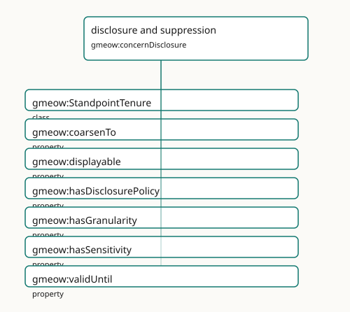

<!-- GENERATED by gmeow ontology-docs. DO NOT EDIT. Source hash: c99d8d50c0344040. -->

# disclosure and suppression

- **IRI:** <https://blackcatinformatics.ca/gmeow/concernDisclosure>
- **CURIE:** [`gmeow:concernDisclosure`](../reference/individuals/gmeow-concernDisclosure.md)

Projection-time withholding, coarsening, sensitivity, and display control.

## Participating Slices

- [kernel](../slices/kernel.md) - GMEOW Core Module
- [names](../slices/names.md) - GMEOW Names Module
- [standpoint](../slices/standpoint.md) - GMEOW [`Standpoint`](../reference/classes/gmeow-Standpoint.md) Module
- [temporal](../slices/temporal.md) - GMEOW Temporal — intervals, instants, temporal frames, time-scoped relations

## Terms

| Term | Category | Definition |
|---|---|---|
| [`gmeow:StandpointTenure`](../reference/classes/gmeow-StandpointTenure.md) | class | The reified, time-scoped fact that a standpoint held a particular position over an interval — recognition granted in 2008 and withdrawn in 2030 is an opened-then-closed tenure, nev |
| [`gmeow:coarsenTo`](../reference/properties/gmeow-coarsenTo.md) | property | Disclosure control: marks a value/relator so that at projection time it is generalized to no finer than the named [`gmeow:GranularityLevel`](../reference/classes/gmeow-GranularityLevel.md) — a coarser ancestor is emitted instead of |
| [`gmeow:displayable`](../reference/properties/gmeow-displayable.md) | property | Whether a name or identity facet may be shown in interfaces and reports. The ONLY display control in the model — across naming ([`gmeow:Appellation`](../reference/classes/gmeow-Appellation.md)) and identity ([`gmeow:IdentityFacet`](../reference/classes/gmeow-IdentityFacet.md) |
| [`gmeow:hasDisclosurePolicy`](../reference/properties/gmeow-hasDisclosurePolicy.md) | property | Relates a value, entity, or claim to its disclosure policy — the explicit *what* facet of disclosure control. Domain-free (universal, like hasGranularity and hasSensitivity). NOT f |
| [`gmeow:hasGranularity`](../reference/properties/gmeow-hasGranularity.md) | property | Relates a value, place, period, coordinate or measurement to its own resolution level — the explicit 'no silent precision' facet, queryable independently of any disclosure control. |
| [`gmeow:hasSensitivity`](../reference/properties/gmeow-hasSensitivity.md) | property | Relates a value, entity, or claim to its privacy-sensitivity level — the explicit facet that drives disclosure-control decisions (coarsenTo / displayable) at projection time under |
| [`gmeow:validUntil`](../reference/properties/gmeow-validUntil.md) | property | The instant until which the annotated statement is asserted to hold. |
