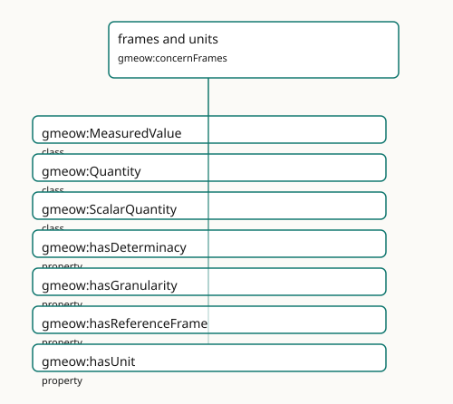

<!-- GENERATED by gmeow ontology-docs. DO NOT EDIT. -->

# frames and units

- **IRI:** <https://blackcatinformatics.ca/gmeow/concernFrames>
- **CURIE:** [`gmeow:concernFrames`](../reference/individuals/gmeow-concernFrames.md)

Reference frames, units, determinacy, granularity, and frame-relative values.

## Participating Slices

- [kernel](../slices/kernel.md) - GMEOW Core Module
- [observations](../slices/observations.md) - GMEOW Observations Module
- [places](../slices/places.md) - GMEOW Locations Module

## Terms

| Term | Category | Definition |
|---|---|---|
| [`gmeow:MeasuredValue`](../reference/classes/gmeow-MeasuredValue.md) | class | An alias for [`gmeow:Quantity`](../reference/classes/gmeow-Quantity.md) — the measured-value perspective on the same value×unit/frame×determinacy×provenance bundle. Equivalent to [`gmeow:Quantity`](../reference/classes/gmeow-Quantity.md) and [`gmeow:ScalarQuantity`](../reference/classes/gmeow-ScalarQuantity.md) |
| [`gmeow:Quantity`](../reference/classes/gmeow-Quantity.md) | class | A universal scalar numeric value bundled with unit/frame, determinacy, and provenance — the synthesis of FRAME-GEN + DET-GEN + OBS. Equivalent to [`gmeow:ScalarQuantity`](../reference/classes/gmeow-ScalarQuantity.md); the do |
| [`gmeow:ScalarQuantity`](../reference/classes/gmeow-ScalarQuantity.md) | class | A scalar numeric value with a unit, determinacy model, and granularity — the entity-valued wrapper for literal observation results (temperatures, distances, counts, probabilities). |
| [`gmeow:hasDeterminacy`](../reference/properties/gmeow-hasDeterminacy.md) | property | Relates a value, entity, or claim to its ontic determinacy model — the explicit facet recording whether the value is crisp, vague, fuzzy, probabilistic, or disputed. Domain-free (u |
| [`gmeow:hasGranularity`](../reference/properties/gmeow-hasGranularity.md) | property | Relates a value, place, period, coordinate or measurement to its own resolution level — the explicit 'no silent precision' facet, queryable independently of any disclosure control. |
| [`gmeow:hasReferenceFrame`](../reference/properties/gmeow-hasReferenceFrame.md) | property | Relates an entity or value to the reference frame in which it is expressed. |
| [`gmeow:hasUnit`](../reference/properties/gmeow-hasUnit.md) | property | Relates a quantitative value or measurement to its QUDT unit (by reference, never imported). Domain-free: used by temporal measurements, spatial measurements, and any other quantif |
