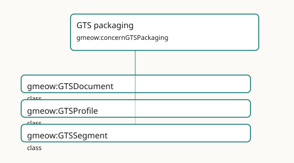

<!-- GENERATED by gmeow ontology-docs. DO NOT EDIT. -->

# GTS packaging

- **IRI:** <https://blackcatinformatics.ca/gmeow/concernGTSPackaging>
- **CURIE:** [`gmeow:concernGTSPackaging`](../reference/individuals/gmeow-concernGTSPackaging.md)

The single-file Graph Transport Substrate and bundled documentation distribution.

## Participating Slices

- [gts](../slices/gts.md) - GMEOW GTS Transport Module

## Terms

| Term | Category | Definition |
|---|---|---|
| [`gmeow:GTSDocument`](../reference/classes/gmeow-GTSDocument.md) | class | A single-file Graph Transport Substrate artifact ([`docs/GTS-SPEC.md`](https://github.com/Blackcat-Informatics/gmeow-ontology/blob/main/docs/GTS-SPEC.md)): a CBOR Sequence of one or more append-only segments carrying an RDF 1.2 graph and any content-addressed binarie |
| [`gmeow:GTSProfile`](../reference/classes/gmeow-GTSProfile.md) | class | A named GTS profile (spec §13) — a purpose and requirement set a segment declares. An OPEN value vocabulary (individuals, never subclasses): extensions add their own profiles (e.g. |
| [`gmeow:GTSSegment`](../reference/classes/gmeow-GTSSegment.md) | class | One complete header-plus-frames log inside a GTS document — the unit of independent integrity (spec §3.1): a segment has its own genesis hash, its own id/prev chain, its own profil |
