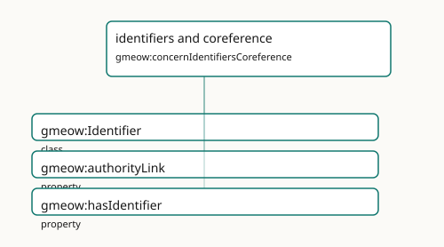

<!-- GENERATED by gmeow ontology-docs. DO NOT EDIT. Source hash: c99d8d50c0344040. -->

# identifiers and coreference

- **IRI:** <https://blackcatinformatics.ca/gmeow/concernIdentifiersCoreference>
- **CURIE:** [`gmeow:concernIdentifiersCoreference`](../reference/individuals/gmeow-concernIdentifiersCoreference.md)

External authority links, identifier records, and reference-only bridging.

## Participating Slices

- [coreference](../slices/coreference.md) - GMEOW Coreference Module
- [organization](../slices/organization.md) - GMEOW [`Organization`](../reference/classes/gmeow-Organization.md) Module

## Terms

| Term | Category | Definition |
|---|---|---|
| [`gmeow:Identifier`](../reference/classes/gmeow-Identifier.md) | class | A reified external-identifier record bundling a scheme-local value with its scheme, and optionally the authority URL that resolves it and a human-readable name — an ORCID, a geni p |
| [`gmeow:authorityLink`](../reference/properties/gmeow-authorityLink.md) | property | Links a GMEOW entity to a record in an external authority, registry, database, gazetteer, or catalogue by IRI. It is a see-also authority pointer, not an OWL identity merge; assert |
| [`gmeow:hasIdentifier`](../reference/properties/gmeow-hasIdentifier.md) | property | Relates an entity to a reified external-identifier record (an ORCID, geni id, nip05, LEI, industry code, …). Domain is [`gmeow:Entity`](../reference/classes/gmeow-Entity.md): persons, organizations, works and places all ca |
