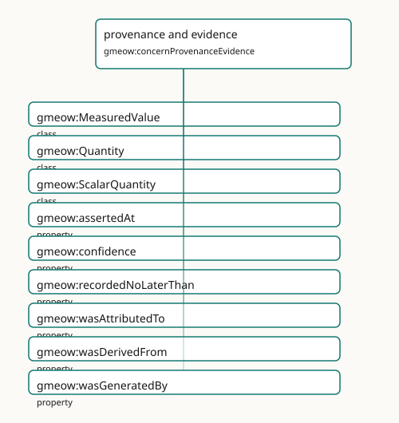

<!-- GENERATED by gmeow ontology-docs. DO NOT EDIT. -->

# provenance and evidence

- **IRI:** <https://blackcatinformatics.ca/gmeow/concernProvenanceEvidence>
- **CURIE:** [`gmeow:concernProvenanceEvidence`](../reference/individuals/gmeow-concernProvenanceEvidence.md)

Attribution, derivation, confidence, evidence, and source lineage.

## Participating Slices

- [observations](../slices/observations.md) - GMEOW Observations Module
- [provenance](../slices/provenance.md) - GMEOW Provenance Module
- [temporal](../slices/temporal.md) - GMEOW Temporal — intervals, instants, temporal frames, time-scoped relations

## Terms

| Term | Category | Definition |
|---|---|---|
| [`gmeow:MeasuredValue`](../reference/classes/gmeow-MeasuredValue.md) | class | An alias for [`gmeow:Quantity`](../reference/classes/gmeow-Quantity.md) — the measured-value perspective on the same value×unit/frame×determinacy×provenance bundle (ScalarQuantity alias precedent). Equivalent to gmeow:Quanti |
| [`gmeow:Quantity`](../reference/classes/gmeow-Quantity.md) | class | A universal scalar numeric value bundled with unit/frame, determinacy, and provenance — the synthesis of FRAME-GEN + DET-GEN + OBS (ScalarQuantity alias precedent). Equivalent to g |
| [`gmeow:ScalarQuantity`](../reference/classes/gmeow-ScalarQuantity.md) | class | A scalar numeric value with a unit, determinacy model, and granularity — the entity-valued wrapper for literal observation results (temperatures, distances, counts, probabilities). |
| [`gmeow:assertedAt`](../reference/properties/gmeow-assertedAt.md) | property | The instant an agent observed or asserted the annotated claim (e.g. an email Date header or a vCard REV) — a witness that the fact held at that instant. Distinct from validity (val |
| [`gmeow:confidence`](../reference/properties/gmeow-confidence.md) | property | Confidence in a claim, in the closed interval [0,1], attached to the statement it qualifies. |
| [`gmeow:recordedNoLaterThan`](../reference/properties/gmeow-recordedNoLaterThan.md) | property | A DERIVED upper bound (terminus ante quem) on when the annotated claim was committed to a record — typically taken from the modification time of its source carrier (gmeow:sourceMod |
| [`gmeow:wasAttributedTo`](../reference/properties/gmeow-wasAttributedTo.md) | property | Ascribes responsibility for an enduring entity to an agent — authorship, ownership, or accountability. The endurant counterpart of [`gmeow:wasAssociatedWith`](../reference/properties/gmeow-wasAssociatedWith.md) (which ties an activity t |
| [`gmeow:wasDerivedFrom`](../reference/properties/gmeow-wasDerivedFrom.md) | property | Relates a derived thing to the thing it was derived from — e.g. a text extraction, summary, or embedding to its source; a commit to its parent commit; a trajectory to its sample st |
| [`gmeow:wasGeneratedBy`](../reference/properties/gmeow-wasGeneratedBy.md) | property | Relates an entity to the activity that produced it — the generation link from an enduring product back to its occurrent cause. The performing agent is reached transitively through |
