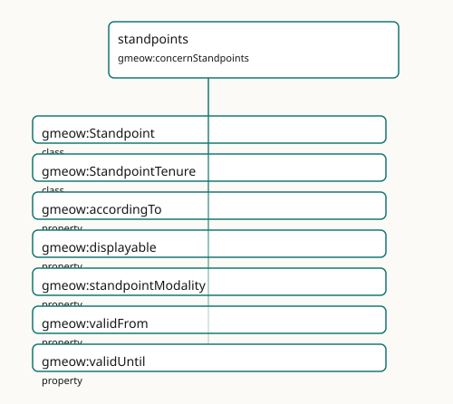

<!-- GENERATED by gmeow ontology-docs. DO NOT EDIT. -->

# standpoints

- **IRI:** <https://blackcatinformatics.ca/gmeow/concernStandpoints>
- **CURIE:** [`gmeow:concernStandpoints`](../reference/individuals/gmeow-concernStandpoints.md)

Perspective-indexed claims without primary, preferred, or winner slots.

## Participating Slices

- [names](../slices/names.md) - GMEOW Names Module
- [standpoint](../slices/standpoint.md) - GMEOW [`Standpoint`](../reference/classes/gmeow-Standpoint.md) Module
- [temporal](../slices/temporal.md) - GMEOW Temporal — intervals, instants, temporal frames, time-scoped relations

## Terms

| Term | Category | Definition |
|---|---|---|
| [`gmeow:Standpoint`](../reference/classes/gmeow-Standpoint.md) | class | A named perspective / frame within which claims are held true — a state's official position, a community's usage, an editorial or historiographic point of view. Minted only when th |
| [`gmeow:StandpointTenure`](../reference/classes/gmeow-StandpointTenure.md) | class | The reified, time-scoped fact that a standpoint held a particular position over an interval — recognition granted in 2008 and withdrawn in 2030 is an opened-then-closed tenure, nev |
| [`gmeow:accordingTo`](../reference/properties/gmeow-accordingTo.md) | property | The standpoint / frame within which the annotated statement is asserted true — *according to whom*. DISTINCT from [`gmeow:wasAttributedTo`](../reference/properties/gmeow-wasAttributedTo.md) (which source RECORDED the claim) and gmeow: |
| [`gmeow:displayable`](../reference/properties/gmeow-displayable.md) | property | Whether a name or identity facet may be shown in interfaces and reports. The ONLY display control in the model — across naming ([`gmeow:Appellation`](../reference/classes/gmeow-Appellation.md)) and identity ([`gmeow:IdentityFacet`](../reference/classes/gmeow-IdentityFacet.md) |
| [`gmeow:standpointModality`](../reference/properties/gmeow-standpointModality.md) | property | The belief value a standpoint assigns the annotated proposition — *how* the standpoint holds it, not merely *that* it holds it. This single axis is at least as expressive as BOTH t |
| [`gmeow:validFrom`](../reference/properties/gmeow-validFrom.md) | property | The instant from which the annotated statement is asserted to hold. |
| [`gmeow:validUntil`](../reference/properties/gmeow-validUntil.md) | property | The instant until which the annotated statement is asserted to hold. |
