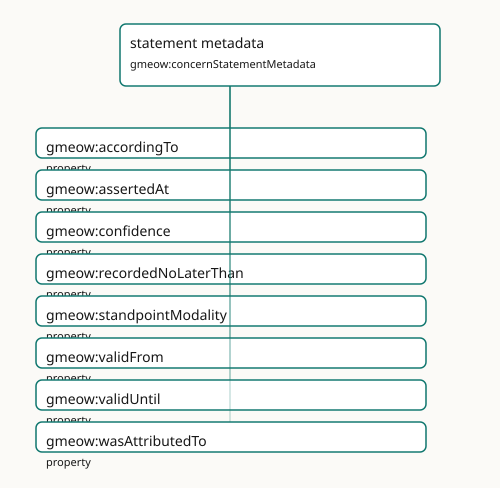

<!-- GENERATED by gmeow ontology-docs. DO NOT EDIT. Source hash: c99d8d50c0344040. -->

# statement metadata

- **IRI:** <https://blackcatinformatics.ca/gmeow/concernStatementMetadata>
- **CURIE:** [`gmeow:concernStatementMetadata`](../reference/individuals/gmeow-concernStatementMetadata.md)

Native RDF 1.2 reifiers, statement annotations, confidence, provenance, and temporal scope.

## Participating Slices

- [provenance](../slices/provenance.md) - GMEOW Provenance Module
- [standpoint](../slices/standpoint.md) - GMEOW [`Standpoint`](../reference/classes/gmeow-Standpoint.md) Module
- [temporal](../slices/temporal.md) - GMEOW Temporal — intervals, instants, temporal frames, time-scoped relations

## Terms

| Term | Category | Definition |
|---|---|---|
| [`gmeow:accordingTo`](../reference/properties/gmeow-accordingTo.md) | property | The standpoint / frame within which the annotated statement is asserted true — *according to whom*. DISTINCT from [`gmeow:wasAttributedTo`](../reference/properties/gmeow-wasAttributedTo.md) (which source RECORDED the claim) and gmeow: |
| [`gmeow:assertedAt`](../reference/properties/gmeow-assertedAt.md) | property | The instant an agent observed or asserted the annotated claim (e.g. an email Date header or a vCard REV) — a witness that the fact held at that instant. Distinct from validity (val |
| [`gmeow:confidence`](../reference/properties/gmeow-confidence.md) | property | Confidence in a claim, in the closed interval [0,1], attached to the statement it qualifies. |
| [`gmeow:recordedNoLaterThan`](../reference/properties/gmeow-recordedNoLaterThan.md) | property | A DERIVED upper bound (terminus ante quem) on when the annotated claim was committed to a record — typically taken from the modification time of its source carrier (gmeow:sourceMod |
| [`gmeow:standpointModality`](../reference/properties/gmeow-standpointModality.md) | property | The belief value a standpoint assigns the annotated proposition — *how* the standpoint holds it, not merely *that* it holds it. This single axis is at least as expressive as BOTH t |
| [`gmeow:validFrom`](../reference/properties/gmeow-validFrom.md) | property | The instant from which the annotated statement is asserted to hold. |
| [`gmeow:validUntil`](../reference/properties/gmeow-validUntil.md) | property | The instant until which the annotated statement is asserted to hold. |
| [`gmeow:wasAttributedTo`](../reference/properties/gmeow-wasAttributedTo.md) | property | Ascribes responsibility for an entity to an agent. |
