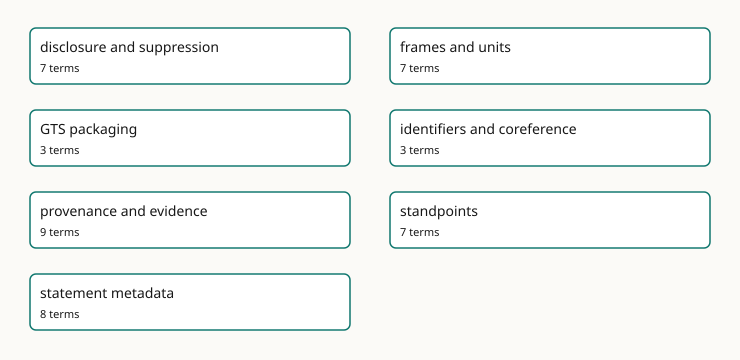

<!-- GENERATED by gmeow ontology-docs. DO NOT EDIT. Source hash: c99d8d50c0344040. -->

# Cross-Cutting Concerns

These pages are generated from [`gmeow:docsConcern`](../reference/properties/gmeow-docsConcern.md) annotations in the ontology.

- [disclosure and suppression](gmeow-concernDisclosure.md) - Projection-time withholding, coarsening, sensitivity, and display control.
- [frames and units](gmeow-concernFrames.md) - Reference frames, units, determinacy, granularity, and frame-relative values.
- [GTS packaging](gmeow-concernGTSPackaging.md) - The single-file Graph Transport Substrate and bundled documentation distribution.
- [identifiers and coreference](gmeow-concernIdentifiersCoreference.md) - External authority links, identifier records, and reference-only bridging.
- [provenance and evidence](gmeow-concernProvenanceEvidence.md) - Attribution, derivation, confidence, evidence, and source lineage.
- [standpoints](gmeow-concernStandpoints.md) - Perspective-indexed claims without primary, preferred, or winner slots.
- [statement metadata](gmeow-concernStatementMetadata.md) - Native RDF 1.2 reifiers, statement annotations, confidence, provenance, and temporal scope.
