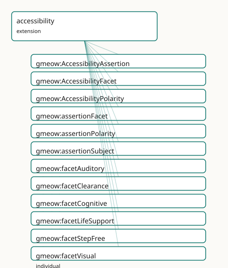

<!-- GENERATED by gmeow ontology-docs. DO NOT EDIT. -->

# GMEOW Accessibility Module

- **IRI:** <https://blackcatinformatics.ca/gmeow/slices/accessibility>
- **Tier:** extension
- **[`Group`](../reference/classes/gmeow-Group.md):** extensions

## What This Slice Covers

This slice owns 19 terms and contributes 16 mapping or projection rows. Use it when its terms match the native fact you want to preserve; use the linkage tables to see how those facts leave GMEOW for consumer vocabularies.

## Dependencies

- [`gmeow:slices/kernel`](kernel.md)
- [`gmeow:slices/places`](places.md)

## Consumers

- Accessibility facets over places and routes; the schema.org accessibility projection.

## Local Map

## Terms

### Classes

| Term | Label | Definition |
|---|---|---|
| [`gmeow:AccessibilityAssertion`](../reference/classes/gmeow-AccessibilityAssertion.md) | Accessibility Assertion | A reified claim that a location or connection has a positive accessibility feature, a barrier, or a limited status for a given facet. Bears provenance (vantage... |
| [`gmeow:AccessibilityFacet`](../reference/classes/gmeow-AccessibilityFacet.md) | Accessibility Facet | The dimension of accessibility being asserted — wheelchair, step-free, visual, auditory, cognitive, clearance, life-support. An open value vocabulary (individu... |
| [`gmeow:AccessibilityPolarity`](../reference/classes/gmeow-AccessibilityPolarity.md) | Accessibility Polarity | The polarity of an accessibility assertion — feature (positive), barrier (negative), or limited (partial). |

### Properties

| Term | Label | Definition |
|---|---|---|
| [`gmeow:assertionFacet`](../reference/properties/gmeow-assertionFacet.md) | assertion facet | The accessibility facet being asserted. Functional per relator: one facet per AccessibilityAssertion. |
| [`gmeow:assertionPolarity`](../reference/properties/gmeow-assertionPolarity.md) | assertion polarity | Whether the assertion is a positive feature, a negative barrier, or a limited/partial status. Functional per relator: one polarity per AccessibilityAssertion. |
| [`gmeow:assertionSubject`](../reference/properties/gmeow-assertionSubject.md) | assertion subject | The location or connection being assessed. Functional per relator: one subject per AccessibilityAssertion. |
| [`gmeow:hasAccessibilityFeature`](../reference/properties/gmeow-hasAccessibilityFeature.md) | has accessibility feature | Relates a location to an accessibility facet it positively provides. Non-functional: a location may support many facets. A location MAY simultaneously carry ha... |
| [`gmeow:hasAccessibilityNeed`](../reference/properties/gmeow-hasAccessibilityNeed.md) | has accessibility need | Relates an entity to an accessibility facet it requires in order to reach or use a location. Non-functional: needs are co-equal facets ([Principle 9](https://github.com/Blackcat-Informatics/gmeow-ontology/blob/main/CONSTITUTION.md#principle-9)). There is... |
| [`gmeow:hasBarrier`](../reference/properties/gmeow-hasBarrier.md) | has barrier | Relates a location to an accessibility facet it impedes. Non-functional: a location may have multiple barriers. A location MAY simultaneously carry hasAccessib... |

### Individuals

| Term | Label | Definition |
|---|---|---|
| [`gmeow:facetAuditory`](../reference/individuals/gmeow-facetAuditory.md) | auditory access | Access for people with auditory impairments — visual alarms, induction loops, sign language. |
| [`gmeow:facetClearance`](../reference/individuals/gmeow-facetClearance.md) | physical clearance | Sufficient physical space for passage — doorway width, corridor width, turning radius, vertical clearance. |
| [`gmeow:facetCognitive`](../reference/individuals/gmeow-facetCognitive.md) | cognitive access | Access for people with cognitive impairments — clear signage, simple wayfinding, sensory-quiet spaces. |
| [`gmeow:facetLifeSupport`](../reference/individuals/gmeow-facetLifeSupport.md) | life-support access | Access for people who require life-support equipment — power outlets, oxygen, climate control, emergency protocols. |
| [`gmeow:facetStepFree`](../reference/individuals/gmeow-facetStepFree.md) | step-free access | Access without steps or stairs — ramps, lifts, level entrances. |
| [`gmeow:facetVisual`](../reference/individuals/gmeow-facetVisual.md) | visual access | Access for people with visual impairments — tactile paving, audio signals, high contrast, braille. |
| [`gmeow:facetWheelchair`](../reference/individuals/gmeow-facetWheelchair.md) | wheelchair access | Access for wheelchair users — level surfaces, ramps, elevators, wide doorways. |
| [`gmeow:polarityBarrier`](../reference/individuals/gmeow-polarityBarrier.md) | barrier | A negative accessibility barrier — the subject impedes the facet. |
| [`gmeow:polarityFeature`](../reference/individuals/gmeow-polarityFeature.md) | feature | A positive accessibility feature — the subject provides the facet. |
| [`gmeow:polarityLimited`](../reference/individuals/gmeow-polarityLimited.md) | limited | A partial or limited accessibility status — the subject provides the facet under some conditions but not all. |

## Linkages

- **Rows:** 16
- **Projection profiles:** `schema-org`
- **External vocabularies:** `fhir`, `schema`, `sosa`

| Source | Kind | Profile | Predicate/Relation | Target | Evidence |
|---|---|---|---|---|---|
| [`gmeow:AccessibilityAssertion`](../reference/classes/gmeow-AccessibilityAssertion.md) | equivalence | `-` | [skos:closeMatch](http://www.w3.org/2004/02/skos/core#closeMatch) | [sosa:Observation](http://www.w3.org/ns/sosa/Observation) | `gmeow-accessibility.sssom.tsv`; `gmeow:eqA11y003`; confidence 0.7 |
| [`gmeow:facetAuditory`](../reference/individuals/gmeow-facetAuditory.md) | equivalence | `-` | [skos:closeMatch](http://www.w3.org/2004/02/skos/core#closeMatch) | fhir:sid/icf#b2 | `gmeow-accessibility.sssom.tsv`; `gmeow:eqA11y015`; confidence 0.8 |
| [`gmeow:facetAuditory`](../reference/individuals/gmeow-facetAuditory.md) | equivalence | `-` | [skos:closeMatch](http://www.w3.org/2004/02/skos/core#closeMatch) | fhir:sid/icf#e125 | `gmeow-accessibility.sssom.tsv`; `gmeow:eqA11y016`; confidence 0.8 |
| [`gmeow:facetClearance`](../reference/individuals/gmeow-facetClearance.md) | equivalence | `-` | [skos:closeMatch](http://www.w3.org/2004/02/skos/core#closeMatch) | fhir:sid/icf#d4 | `gmeow-accessibility.sssom.tsv`; `gmeow:eqA11y020`; confidence 0.7 |
| [`gmeow:facetCognitive`](../reference/individuals/gmeow-facetCognitive.md) | equivalence | `-` | [skos:closeMatch](http://www.w3.org/2004/02/skos/core#closeMatch) | fhir:sid/icf#b1 | `gmeow-accessibility.sssom.tsv`; `gmeow:eqA11y017`; confidence 0.8 |
| [`gmeow:facetCognitive`](../reference/individuals/gmeow-facetCognitive.md) | equivalence | `-` | [skos:closeMatch](http://www.w3.org/2004/02/skos/core#closeMatch) | fhir:sid/icf#e140 | `gmeow-accessibility.sssom.tsv`; `gmeow:eqA11y018`; confidence 0.7 |
| [`gmeow:facetLifeSupport`](../reference/individuals/gmeow-facetLifeSupport.md) | equivalence | `-` | [skos:closeMatch](http://www.w3.org/2004/02/skos/core#closeMatch) | fhir:sid/icf#e5 | `gmeow-accessibility.sssom.tsv`; `gmeow:eqA11y019`; confidence 0.7 |
| [`gmeow:facetStepFree`](../reference/individuals/gmeow-facetStepFree.md) | equivalence | `-` | [skos:closeMatch](http://www.w3.org/2004/02/skos/core#closeMatch) | fhir:sid/icf#d4 | `gmeow-accessibility.sssom.tsv`; `gmeow:eqA11y012`; confidence 0.8 |
| [`gmeow:facetVisual`](../reference/individuals/gmeow-facetVisual.md) | equivalence | `-` | [skos:closeMatch](http://www.w3.org/2004/02/skos/core#closeMatch) | fhir:sid/icf#b2 | `gmeow-accessibility.sssom.tsv`; `gmeow:eqA11y013`; confidence 0.8 |
| [`gmeow:facetVisual`](../reference/individuals/gmeow-facetVisual.md) | equivalence | `-` | [skos:closeMatch](http://www.w3.org/2004/02/skos/core#closeMatch) | fhir:sid/icf#e135 | `gmeow-accessibility.sssom.tsv`; `gmeow:eqA11y014`; confidence 0.8 |
| [`gmeow:facetWheelchair`](../reference/individuals/gmeow-facetWheelchair.md) | equivalence | `-` | [skos:closeMatch](http://www.w3.org/2004/02/skos/core#closeMatch) | fhir:sid/icf#d4 | `gmeow-accessibility.sssom.tsv`; `gmeow:eqA11y010`; confidence 0.8 |
| [`gmeow:facetWheelchair`](../reference/individuals/gmeow-facetWheelchair.md) | equivalence | `-` | [skos:closeMatch](http://www.w3.org/2004/02/skos/core#closeMatch) | fhir:sid/icf#e115 | `gmeow-accessibility.sssom.tsv`; `gmeow:eqA11y011`; confidence 0.8 |
| [`gmeow:hasAccessibilityFeature`](../reference/properties/gmeow-hasAccessibilityFeature.md) | equivalence | `-` | [skos:closeMatch](http://www.w3.org/2004/02/skos/core#closeMatch) | [schema:accessibilityFeature](https://schema.org/accessibilityFeature) | `gmeow-accessibility.sssom.tsv`; `gmeow:eqA11y001`; confidence 0.8 |
| [`gmeow:hasBarrier`](../reference/properties/gmeow-hasBarrier.md) | equivalence | `-` | [skos:closeMatch](http://www.w3.org/2004/02/skos/core#closeMatch) | [schema:accessibilityHazard](https://schema.org/accessibilityHazard) | `gmeow-accessibility.sssom.tsv`; `gmeow:eqA11y002`; confidence 0.75 |
| [`gmeow:hasAccessibilityFeature`](../reference/properties/gmeow-hasAccessibilityFeature.md) | projection | `schema-org` | projects to / <= | [schema:accessibilityFeature](https://schema.org/accessibilityFeature) | `gmeow:mapSchemaAccessibilityFeature`; confidence 0.7; lossy: GMEOW AccessibilityFacet individuals are emitted as IRIs; schema.org expects specific text tokens (wheelchairAccessible, stepFreeAccess, etc.). The consumer must map IRIs to tokens. |
| [`gmeow:hasBarrier`](../reference/properties/gmeow-hasBarrier.md) | projection | `schema-org` | projects to / <= | [schema:accessibilityHazard](https://schema.org/accessibilityHazard) | `gmeow:mapSchemaAccessibilityHazard`; confidence 0.7; lossy: GMEOW AccessibilityFacet individuals are emitted as IRIs; schema.org expects specific text tokens (flashingHazard, motionSimulationHazard, soundHazard, etc.). The consumer must map IRIs to tokens. |

## Guide

<!-- SPDX-FileCopyrightText: 2026 Blackcat Informatics® Inc. <paudley@blackcatinformatics.ca> -->
<!-- SPDX-License-Identifier: CC-BY-4.0 -->

# Accessibility — features, barriers, and needs as co-equal facets

> **Slice:** `https://blackcatinformatics.ca/gmeow/slices/accessibility` · **tier: extension**
> Whether an entity can reach or use a location under constraints — said honestly, per facet.

Most vocabularies flatten accessibility to a boolean (`wheelchairAccessible true`). GMEOW
refuses the collapse: accessibility is a *family of orthogonal dimensions* — wheelchair,
step-free, visual, auditory, cognitive, clearance, life-support — and each dimension is an
open value facet ([Principle 9](https://github.com/Blackcat-Informatics/gmeow-ontology/blob/main/CONSTITUTION.md#principle-9): individuals, never subclasses; a new facet is data, not a
schema change). Features, barriers, and needs are co-equal: there is no "primary need", and
a location may honestly carry *both* a feature and a barrier for the same facet (a ramp at
the front entrance, stairs at the side). The flat shortcuts cover the 80 % case; promote to
a reified [`AccessibilityAssertion`](../reference/classes/gmeow-AccessibilityAssertion.md) when provenance, confidence, temporal scope, or
suppression matter ([Principle 10](https://github.com/Blackcat-Informatics/gmeow-ontology/blob/main/CONSTITUTION.md#principle-10): suppression is `displayable false`, never deletion).
The slice is part of the Location-as-reference-frame epic.

Its Principle-15 consumer, declared in the manifest: **accessibility facets over places and
routes, and the schema.org accessibility projection** — every term here either drives
accessible-route solving or down-projects to [`schema:accessibilityFeature`](https://schema.org/accessibilityFeature) and kin.

## The value vocabularies

### [`gmeow:AccessibilityFacet`](../reference/classes/gmeow-AccessibilityFacet.md)

The dimension being asserted — the seeds are [`facetWheelchair`](../reference/individuals/gmeow-facetWheelchair.md), [`facetStepFree`](../reference/individuals/gmeow-facetStepFree.md),
[`facetVisual`](../reference/individuals/gmeow-facetVisual.md), [`facetAuditory`](../reference/individuals/gmeow-facetAuditory.md), [`facetCognitive`](../reference/individuals/gmeow-facetCognitive.md), [`facetClearance`](../reference/individuals/gmeow-facetClearance.md), [`facetLifeSupport`](../reference/individuals/gmeow-facetLifeSupport.md).
An open vocabulary ([Principle 9](https://github.com/Blackcat-Informatics/gmeow-ontology/blob/main/CONSTITUTION.md#principle-9)): a facet not among the seeds is a fresh individual with a
label, never a subclass. Facets are the shared currency of all three shortcut properties
and of the reified assertion.

### [`gmeow:AccessibilityPolarity`](../reference/classes/gmeow-AccessibilityPolarity.md)

The sign of a reified claim: [`polarityFeature`](../reference/individuals/gmeow-polarityFeature.md) (the subject provides the facet),
[`polarityBarrier`](../reference/individuals/gmeow-polarityBarrier.md) (it impedes it), or [`polarityLimited`](../reference/individuals/gmeow-polarityLimited.md) (it provides it under some
conditions but not all). Polarity exists *only* on the reified form — the flat shortcuts
encode polarity in the property name.

## The flat shortcuts (the 80 % case)

### [`gmeow:hasAccessibilityFeature`](../reference/properties/gmeow-hasAccessibilityFeature.md)

[`Location`](../reference/classes/gmeow-Location.md) → [`AccessibilityFacet`](../reference/classes/gmeow-AccessibilityFacet.md): the location positively provides the facet.
Non-functional — a location may support many facets, and may simultaneously carry
[`hasBarrier`](../reference/properties/gmeow-hasBarrier.md) for the *same* facet under different local conditions. The properties are
deliberately **not** disjoint; disambiguation belongs to the reified form, not to schema
exclusions.

### [`gmeow:hasBarrier`](../reference/properties/gmeow-hasBarrier.md)

[`Location`](../reference/classes/gmeow-Location.md) → [`AccessibilityFacet`](../reference/classes/gmeow-AccessibilityFacet.md): the location impedes the facet. The honest negative —
a barrier is asserted data, not the mere absence of a feature (open world: silence means
*unknown*, [`hasBarrier`](../reference/properties/gmeow-hasBarrier.md) means *known impediment*).

### [`gmeow:hasAccessibilityNeed`](../reference/properties/gmeow-hasAccessibilityNeed.md)

[`Entity`](../reference/classes/gmeow-Entity.md) → [`AccessibilityFacet`](../reference/classes/gmeow-AccessibilityFacet.md): what an entity requires in order to reach or use a
location. Needs are co-equal facets ([Principle 9](https://github.com/Blackcat-Informatics/gmeow-ontology/blob/main/CONSTITUTION.md#principle-9)) — all asserted needs coexist. This is
the demand side that the solver matches against the supply side (features/barriers) when
computing accessible routes.

## The reified form (promote when metadata matters)

### [`gmeow:AccessibilityAssertion`](../reference/classes/gmeow-AccessibilityAssertion.md)

A [`gufo:Relator`](../external/terms.md#gufo-relator)-grounded claim that a location *or connection* (the connectivity slice's
[`Connection`](../reference/classes/gmeow-Connection.md) is an admissible subject) has a feature, barrier, or limited status for a
facet. Bears vantage, confidence, temporal scope, and suppression (`displayable false` —
[Principle 10](https://github.com/Blackcat-Informatics/gmeow-ontology/blob/main/CONSTITUTION.md#principle-10)). Promote here whenever the claim itself must be a node — "accessible
according to the 2024 city audit, disputed by the user survey".

### [`gmeow:assertionSubject`](../reference/properties/gmeow-assertionSubject.md) · [`gmeow:assertionFacet`](../reference/properties/gmeow-assertionFacet.md) · [`gmeow:assertionPolarity`](../reference/properties/gmeow-assertionPolarity.md)

The three functional role properties of the relator: one subject, one facet, one polarity
per assertion. Relator mediation is axiomatized (`someValuesFrom` restrictions, EL-safe)
so ELK sees the doctrine; closed-world cardinality is SHACL's job.

## Solver layer & bridges

Accessible *routes* are computed, never asserted ([Principle 12](https://github.com/Blackcat-Informatics/gmeow-ontology/blob/main/CONSTITUTION.md#principle-12)): the connectivity slice
declares the [`routeKindAccessible`](../reference/individuals/gmeow-routeKindAccessible.md) route kind, and the solver layer walks the connection
graph matching [`hasAccessibilityNeed`](../reference/properties/gmeow-hasAccessibilityNeed.md) against features and barriers to produce a path. The
OWL core only models the inputs.

## Dependencies

Depends on `kernel` and `places` (the [`Location`](../reference/classes/gmeow-Location.md) domain of the shortcuts). Sibling to
`connectivity` — mutually independent extensions joined only at the solver layer and at
[`routeKindAccessible`](../reference/individuals/gmeow-routeKindAccessible.md) (surgery keeps that value individual beside its value
class, in connectivity).
