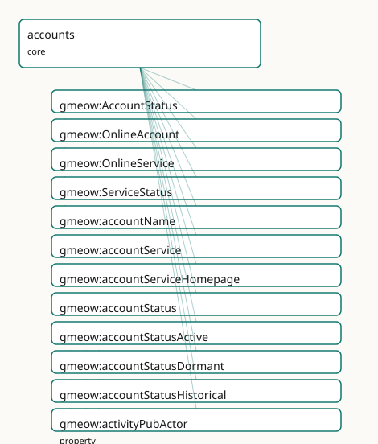

<!-- GENERATED by gmeow ontology-docs. DO NOT EDIT. -->

# GMEOW Accounts Module

- **IRI:** <https://blackcatinformatics.ca/gmeow/slices/accounts>
- **Tier:** core
- **[`Group`](../reference/classes/gmeow-Group.md):** core

## What This Slice Covers

This slice owns 19 terms and contributes 11 mapping or projection rows. Use it when its terms match the native fact you want to preserve; use the linkage tables to see how those facts leave GMEOW for consumer vocabularies.

## Dependencies

- [`gmeow:slices/kernel`](kernel.md)

## Consumers

- Online accounts for the mail corpus, email delivery, and finance.

## Local Map



## Examples

### Online Presence

- **Source:** [`slices/core/accounts/examples/online-presence.ttl`](https://github.com/Blackcat-Informatics/gmeow-ontology/blob/main/slices/core/accounts/examples/online-presence.ttl)
- **GMEOW terms:** [`gmeow:OnlineAccount`](../reference/classes/gmeow-OnlineAccount.md), [`gmeow:OnlineService`](../reference/classes/gmeow-OnlineService.md), [`gmeow:Person`](../reference/classes/gmeow-Person.md), [`gmeow:accountName`](../reference/properties/gmeow-accountName.md), [`gmeow:accountService`](../reference/properties/gmeow-accountService.md), [`gmeow:accountServiceHomepage`](../reference/properties/gmeow-accountServiceHomepage.md), [`gmeow:accountStatus`](../reference/properties/gmeow-accountStatus.md), [`gmeow:accountStatusActive`](../reference/individuals/gmeow-accountStatusActive.md), [`gmeow:accountStatusHistorical`](../reference/individuals/gmeow-accountStatusHistorical.md), [`gmeow:activityPubActor`](../reference/properties/gmeow-activityPubActor.md)
- **External prefixes:** `xsd`

```turtle
# SPDX-FileCopyrightText: 2026 Blackcat Informatics® Inc. <paudley@blackcatinformatics.ca>
# SPDX-License-Identifier: CC-BY-4.0
#
# Worked example: online accounts, decentralized identity, and P10 . An
# agent gmeow:holdsAccount one or more gmeow:OnlineAccounts, each on a
# gmeow:OnlineService. Decentralized identities are first-class: a Mastodon
# account carries its gmeow:activityPubActor URI, a Nostr account its
# gmeow:nostrPubkey and gmeow:nip05 handle. P10 (suppression, never deletion):
# when a service shuts down, its account is kept as gmeow:accountStatusHistorical
# — the record persists, it is not erased.
@prefix gmeow: <https://blackcatinformatics.ca/gmeow/> .
@prefix ex:    <https://blackcatinformatics.ca/gmeow/examples/accounts/> .
@prefix xsd:   <http://www.w3.org/2001/XMLSchema#> .

ex:dana a gmeow:Person ;
    gmeow:name "Dana Reyes"@en ;
    gmeow:holdsAccount ex:fediAccount , ex:nostrAccount , ex:oldAccount .

# --- A live service and a fediverse (ActivityPub) account on it.
ex:mastodon a gmeow:OnlineService ;
    gmeow:name          "mastodon.social"@en ;
    gmeow:serviceStatus gmeow:serviceStatusLive .

ex:fediAccount a gmeow:OnlineAccount ;
    gmeow:accountName            "@dana@mastodon.social" ;
    gmeow:accountService         ex:mastodon ;
    gmeow:accountServiceHomepage <https://mastodon.social> ;
    gmeow:activityPubActor       "https://mastodon.social/users/dana"^^xsd:anyURI ;
    gmeow:accountStatus          gmeow:accountStatusActive .

# --- A serverless Nostr identity: the key IS the account, with a NIP-05 handle.
ex:nostrAccount a gmeow:OnlineAccount ;
    gmeow:accountName   "dana" ;
    gmeow:nostrPubkey   "npub1dana0exampleexampleexampleexampleexampleexampleexa" ;
    gmeow:nip05         "dana@example.org" ;
    gmeow:accountStatus gmeow:accountStatusActive .

# --- P10: a shut-down service keeps its account as historical, never deleted.
ex:defunct a gmeow:OnlineService ;
    gmeow:name                "old.example.net"@en ;
    gmeow:serviceStatus       gmeow:serviceStatusShutDown ;
    gmeow:serviceShutdownDate "2023-06-30T00:00:00Z"^^xsd:dateTime .

ex:oldAccount a gmeow:OnlineAccount ;
    gmeow:accountName   "dana_old" ;
    gmeow:accountService ex:defunct ;
    gmeow:accountStatus gmeow:accountStatusHistorical .
```

## Terms

### Classes

| Term | Label | Definition |
|---|---|---|
| [`gmeow:AccountStatus`](../reference/classes/gmeow-AccountStatus.md) | Account Status | The usage status of an account from its holder's standpoint — a VALUE vocabulary (active, dormant, historical, …); open set. |
| [`gmeow:OnlineAccount`](../reference/classes/gmeow-OnlineAccount.md) | Online Account | An account an agent holds with an online service — a social profile, code-forge account, or decentralized identity. |
| [`gmeow:OnlineService`](../reference/classes/gmeow-OnlineService.md) | Online Service | An online service or platform an account is held with — a social network, code forge, email provider, or federated instance. Carries the service's liveness (gm... |
| [`gmeow:ServiceStatus`](../reference/classes/gmeow-ServiceStatus.md) | Service Status | The liveness status of an online service — a VALUE vocabulary (live, shut-down, …); open set. |

### Properties

| Term | Label | Definition |
|---|---|---|
| [`gmeow:accountName`](../reference/properties/gmeow-accountName.md) | account name | The handle or user name identifying the account on its service. |
| [`gmeow:accountService`](../reference/properties/gmeow-accountService.md) | account service | The online service an account is held with. Functional — an account is on one service. |
| [`gmeow:accountServiceHomepage`](../reference/properties/gmeow-accountServiceHomepage.md) | account service homepage | The homepage of the service an account is held with — the [foaf:accountServiceHomepage](http://xmlns.com/foaf/0.1/accountServiceHomepage) of FOAF's OnlineAccount idiom. Range open (an IRI). |
| [`gmeow:accountStatus`](../reference/properties/gmeow-accountStatus.md) | account status | The holder's usage status of an account — a [`gmeow:AccountStatus`](../reference/classes/gmeow-AccountStatus.md) value (active / dormant / historical). A retired account is status 'historical' with validUntil... |
| [`gmeow:activityPubActor`](../reference/properties/gmeow-activityPubActor.md) | ActivityPub actor | The ActivityPub actor IRI of a federated-social account. |
| [`gmeow:holdsAccount`](../reference/properties/gmeow-holdsAccount.md) | holds account | Relates an agent to an online account it holds. |
| [`gmeow:nip05`](../reference/properties/gmeow-nip05.md) | NIP-05 identifier | A Nostr NIP-05 identifier (user@domain) verifying a Nostr account against a domain. |
| [`gmeow:nostrPubkey`](../reference/properties/gmeow-nostrPubkey.md) | Nostr public key | The Nostr public key (npub / hex) identifying a decentralized-identity account. |
| [`gmeow:serviceShutdownDate`](../reference/properties/gmeow-serviceShutdownDate.md) | service shutdown date | The date a historical online service shut down (Yahoo 360: 2009-07-13). The flat shortcut for service liveness; projects to [schema:dissolutionDate.](https://schema.org/dissolutionDate.) Promote to... |
| [`gmeow:serviceStatus`](../reference/properties/gmeow-serviceStatus.md) | service status | The liveness status of a service — a [`gmeow:ServiceStatus`](../reference/classes/gmeow-ServiceStatus.md) value (live / shut-down). |

### Individuals

| Term | Label | Definition |
|---|---|---|
| [`gmeow:accountStatusActive`](../reference/individuals/gmeow-accountStatusActive.md) | active | An account in current use. |
| [`gmeow:accountStatusDormant`](../reference/individuals/gmeow-accountStatusDormant.md) | dormant | An account retained but not actively used. |
| [`gmeow:accountStatusHistorical`](../reference/individuals/gmeow-accountStatusHistorical.md) | historical | A retired account, kept for the record (P10): the holder no longer uses it. |
| [`gmeow:serviceStatusLive`](../reference/individuals/gmeow-serviceStatusLive.md) | live | The service is currently operating. |
| [`gmeow:serviceStatusShutDown`](../reference/individuals/gmeow-serviceStatusShutDown.md) | shut down | The service has ceased operation (its [`gmeow:serviceShutdownDate`](../reference/properties/gmeow-serviceShutdownDate.md) records when). |

## Linkages

- **Rows:** 11
- **Projection profiles:** `foaf`, `schema-org`, `sioc`
- **External vocabularies:** `foaf`, `rdf`, `schema`, `sioc`

| Source | Kind | Profile | Predicate/Relation | Target | Evidence |
|---|---|---|---|---|---|
| [`gmeow:OnlineAccount`](../reference/classes/gmeow-OnlineAccount.md) | equivalence | `-` | [owl:equivalentClass](http://www.w3.org/2002/07/owl#equivalentClass) | [foaf:OnlineAccount](http://xmlns.com/foaf/0.1/OnlineAccount) | `gmeow-classes.sssom.tsv`; `gmeow:eqClasses013`; confidence 1 |
| [`gmeow:OnlineAccount`](../reference/classes/gmeow-OnlineAccount.md) | equivalence | `-` | [rdfs:subClassOf](http://www.w3.org/2000/01/rdf-schema#subClassOf) | [sioc:UserAccount](http://rdfs.org/sioc/ns#UserAccount) | `gmeow-classes.sssom.tsv`; `gmeow:eqClasses014`; confidence 0.9 |
| [`gmeow:accountName`](../reference/properties/gmeow-accountName.md) | equivalence | `-` | [owl:equivalentProperty](http://www.w3.org/2002/07/owl#equivalentProperty) | [foaf:accountName](http://xmlns.com/foaf/0.1/accountName) | `gmeow-properties.sssom.tsv`; `gmeow:eqProperties032`; confidence 1 |
| [`gmeow:accountServiceHomepage`](../reference/properties/gmeow-accountServiceHomepage.md) | equivalence | `-` | [skos:closeMatch](http://www.w3.org/2004/02/skos/core#closeMatch) | [foaf:accountServiceHomepage](http://xmlns.com/foaf/0.1/accountServiceHomepage) | `gmeow-properties.sssom.tsv`; `gmeow:eqProperties092`; confidence 0.95 |
| [`gmeow:holdsAccount`](../reference/properties/gmeow-holdsAccount.md) | equivalence | `-` | [owl:equivalentProperty](http://www.w3.org/2002/07/owl#equivalentProperty) | [foaf:account](http://xmlns.com/foaf/0.1/account) | `gmeow-properties.sssom.tsv`; `gmeow:eqProperties031`; confidence 1 |
| [`gmeow:accountName`](../reference/properties/gmeow-accountName.md) | projection | `foaf` | projects to / <= | [foaf:OnlineAccount](http://xmlns.com/foaf/0.1/OnlineAccount), [foaf:account](http://xmlns.com/foaf/0.1/account), [foaf:accountName](http://xmlns.com/foaf/0.1/accountName), [foaf:accountServiceHomepage](http://xmlns.com/foaf/0.1/accountServiceHomepage), [rdf:type](http://www.w3.org/1999/02/22-rdf-syntax-ns#type) | `gmeow:mapFoafAccount`; confidence 0.9; lossy: decentralized-identity detail (nostr/activitypub/nip05) and account status/validity drop; FOAF carries the OnlineAccount idiom |
| [`gmeow:accountName`](../reference/properties/gmeow-accountName.md) | projection | `sioc` | projects to / <= | [sioc:name](http://rdfs.org/sioc/ns#name) | `gmeow:mapSiocName`; confidence 0.85 |
| [`gmeow:accountServiceHomepage`](../reference/properties/gmeow-accountServiceHomepage.md) | projection | `foaf` | projects to / <= | [foaf:OnlineAccount](http://xmlns.com/foaf/0.1/OnlineAccount), [foaf:account](http://xmlns.com/foaf/0.1/account), [foaf:accountName](http://xmlns.com/foaf/0.1/accountName), [foaf:accountServiceHomepage](http://xmlns.com/foaf/0.1/accountServiceHomepage), [rdf:type](http://www.w3.org/1999/02/22-rdf-syntax-ns#type) | `gmeow:mapFoafAccount`; confidence 0.9; lossy: decentralized-identity detail (nostr/activitypub/nip05) and account status/validity drop; FOAF carries the OnlineAccount idiom |
| [`gmeow:holdsAccount`](../reference/properties/gmeow-holdsAccount.md) | projection | `foaf` | projects to / <= | [foaf:OnlineAccount](http://xmlns.com/foaf/0.1/OnlineAccount), [foaf:account](http://xmlns.com/foaf/0.1/account), [foaf:accountName](http://xmlns.com/foaf/0.1/accountName), [foaf:accountServiceHomepage](http://xmlns.com/foaf/0.1/accountServiceHomepage), [rdf:type](http://www.w3.org/1999/02/22-rdf-syntax-ns#type) | `gmeow:mapFoafAccount`; confidence 0.9; lossy: decentralized-identity detail (nostr/activitypub/nip05) and account status/validity drop; FOAF carries the OnlineAccount idiom |
| [`gmeow:holdsAccount`](../reference/properties/gmeow-holdsAccount.md) | projection | `sioc` | projects to / <= | [rdf:type](http://www.w3.org/1999/02/22-rdf-syntax-ns#type), [sioc:UserAccount](http://rdfs.org/sioc/ns#UserAccount), [sioc:account_of](http://rdfs.org/sioc/ns#account_of) | `gmeow:mapSiocUserAccount`; confidence 0.85; lossy: every held online account over-types as a SIOC user account |
| [`gmeow:serviceShutdownDate`](../reference/properties/gmeow-serviceShutdownDate.md) | projection | `schema-org` | projects to / <= | [schema:dissolutionDate](https://schema.org/dissolutionDate) | `gmeow:mapSchemaServiceDissolution`; confidence 0.9 |

## Guide

<!-- SPDX-FileCopyrightText: 2026 Blackcat Informatics® Inc. <paudley@blackcatinformatics.ca> -->
<!-- SPDX-License-Identifier: CC-BY-4.0 -->

# Accounts — online accounts, centralized and decentralized, as peers

> **Slice:** `https://blackcatinformatics.ca/gmeow/slices/accounts` · **tier: core**
> The FOAF [`OnlineAccount`](../reference/classes/gmeow-OnlineAccount.md) superset plus the decentralized-identity layer: handles,
> Nostr keys, ActivityPub actors, and domain-verified identifiers.

FOAF gave the web [`foaf:OnlineAccount`](http://xmlns.com/foaf/0.1/OnlineAccount) and then the web moved on: today an agent's online
presence spans platform accounts (a code forge, a social service) *and* decentralized
identities (a Nostr keypair, a federated ActivityPub actor) that have no "service provider"
in the FOAF sense. GMEOW models both in one class, as **co-equal accounts** ([Principle 9](https://github.com/Blackcat-Informatics/gmeow-ontology/blob/main/CONSTITUTION.md#principle-9)'s
co-equality stance applied to digital presence): a self-sovereign key-based identity is not
an exotic footnote to a platform handle, and a platform handle is not less real for being
custodial. There is no primary-account slot, for the same reason names has no primary name
— an agent holds many accounts via [`holdsAccount`](../reference/properties/gmeow-holdsAccount.md), and selection is the consumer's
frame, never the graph's hierarchy.

An account is an [`InformationObject`](../reference/classes/gmeow-InformationObject.md), not the agent: the **account ≠ agent** distinction is
load-bearing exactly the way appellation ≠ person is in names. Accounts are *claimed* by
agents, get suspended, abandoned, and reused — facts about the account, not the person.
A defunct account is suppressed or time-scoped, never deleted ([Principle 10](https://github.com/Blackcat-Informatics/gmeow-ontology/blob/main/CONSTITUTION.md#principle-10)): account
history is provenance for everything the mail corpus and the memory products ingest. The
slice is deliberately slim ([Principle 16](https://github.com/Blackcat-Informatics/gmeow-ontology/blob/main/CONSTITUTION.md#principle-16)'s small-core discipline) with named consumers —
the mail corpus, email delivery, and finance ([Principle 15](https://github.com/Blackcat-Informatics/gmeow-ontology/blob/main/CONSTITUTION.md#principle-15)).

## The core pair

### [`gmeow:OnlineAccount`](../reference/classes/gmeow-OnlineAccount.md)

An account an agent holds with an online service — a social profile, a code-forge account,
or a decentralized identity. An [`InformationObject`](../reference/classes/gmeow-InformationObject.md) under `kernel`, so it bears the shared
machinery: external identifiers, [`wasAttributedTo`](../reference/properties/gmeow-wasAttributedTo.md) provenance, and statement-level clocks
([`validFrom`](../reference/properties/gmeow-validFrom.md)/[`validUntil`](../reference/properties/gmeow-validUntil.md)) for the holding period — flat-first, like the contacts slice's
tenures.

### [`gmeow:holdsAccount`](../reference/properties/gmeow-holdsAccount.md)

[`Agent`](../reference/classes/gmeow-Agent.md) → account. Non-functional in both directions by design: an agent holds many accounts,
and (honestly modelled) a shared or transferred account relates to more than one agent over
time — disambiguate with the statement clocks. No inference runs from an account's display
name back to the agent's identity facets: handles are *address*, not identity (the
seven-axis matrix's address ≠ identity tenet, applied to the digital realm).

## Identifiers on the account

### [`gmeow:accountName`](../reference/properties/gmeow-accountName.md)

The handle or user name identifying the account *on its service* — a service-scoped string,
meaningful only paired with the service, and never a name of the *person* (a person's names
are co-equal [`gmeow:PersonName`](../reference/classes/gmeow-PersonName.md)s in the names slice; an account handle never outranks or
implies them).

### [`gmeow:nostrPubkey`](../reference/properties/gmeow-nostrPubkey.md)

The Nostr public key (npub / hex) identifying a key-based, self-sovereign account. The key
*is* the account's identity on the protocol — no provider exists to ask — which is exactly
why decentralized accounts needed first-class modelling rather than a stretched FOAF
[`accountServiceHomepage`](../reference/properties/gmeow-accountServiceHomepage.md).

### [`gmeow:activityPubActor`](../reference/properties/gmeow-activityPubActor.md)

The ActivityPub actor IRI of a federated-social account — a dereferenceable identity in
fediverse space. Carried as [`xsd:anyURI`](http://www.w3.org/2001/XMLSchema#anyURI) data, not conflated with the account's own GMEOW
IRI: the actor IRI is what the *protocol* calls the account, an alignment in the same
spirit as language's registry codes — never identity within the graph.

### [`gmeow:nip05`](../reference/properties/gmeow-nip05.md)

A Nostr NIP-05 identifier (`user@domain`) verifying a Nostr account against a DNS domain —
the protocol's own claim-verification bridge. [`Recording`](../reference/classes/gmeow-Recording.md) it lets the trust module (keys,
certifications, owner-trust live there, not here) weigh a domain-backed account above an
unverified key without this slice ever ranking accounts itself.

```turtle
ex:kit a gmeow:Person ;
    gmeow:holdsAccount ex:forgeAcct , ex:nostrAcct .   # co-equal

ex:forgeAcct a gmeow:OnlineAccount ;
    gmeow:accountName "kit-dev" .

ex:nostrAcct a gmeow:OnlineAccount ;
    gmeow:nostrPubkey "npub1examplekey…" ;
    gmeow:nip05 "kit@example.ca" .
```

## Seams, solver, and alignment

The contacts slice joins in through [`gmeow:deliversToAccount`](../reference/properties/gmeow-deliversToAccount.md) (an email *address* delivers
to an *account* — the seam the mail corpus walks from address book to mailbox), and finance
reaches accounts for service relationships. Key verification — checking a NIP-05 document,
resolving an ActivityPub actor, proving control of a key — is solver-layer work
([Principle 12](https://github.com/Blackcat-Informatics/gmeow-ontology/blob/main/CONSTITUTION.md#principle-12)): the graph records the identifiers and the trust module records the
attestations; nothing here computes or asserts verification outcomes. Alignment is by
reference ([Principle 5](https://github.com/Blackcat-Informatics/gmeow-ontology/blob/main/CONSTITUTION.md#principle-5)): [`OnlineAccount`](../reference/classes/gmeow-OnlineAccount.md)/[`holdsAccount`](../reference/properties/gmeow-holdsAccount.md)/[`accountName`](../reference/properties/gmeow-accountName.md) map to FOAF's
[`OnlineAccount`](../reference/classes/gmeow-OnlineAccount.md)/`account`/[`accountName`](../reference/properties/gmeow-accountName.md), with the decentralized-identity properties as
GMEOW's canonical superset — FOAF-bound projections drop them as documented lossy drops
([Principle 4](https://github.com/Blackcat-Informatics/gmeow-ontology/blob/main/CONSTITUTION.md#principle-4)).

## Dependencies

Depends only on `kernel` — accounts sit near the bottom of the core stack so that contacts
([`deliversToAccount`](../reference/properties/gmeow-deliversToAccount.md)), the email extension, and finance can all build on them without
cycles. Consumers: the mail corpus, email delivery, and finance ([Principle 15](https://github.com/Blackcat-Informatics/gmeow-ontology/blob/main/CONSTITUTION.md#principle-15), named in the
manifest).

## Online-presence history

### [`gmeow:OnlineService`](../reference/classes/gmeow-OnlineService.md) · [`gmeow:accountService`](../reference/properties/gmeow-accountService.md) · [`gmeow:accountServiceHomepage`](../reference/properties/gmeow-accountServiceHomepage.md) · [`gmeow:serviceShutdownDate`](../reference/properties/gmeow-serviceShutdownDate.md) · [`gmeow:serviceStatus`](../reference/properties/gmeow-serviceStatus.md)

The **service** an account is held with is a first-class [`gmeow:OnlineService`](../reference/classes/gmeow-OnlineService.md)
([`gmeow:accountService`](../reference/properties/gmeow-accountService.md), functional). Its liveness rides the flat
[`gmeow:serviceStatus`](../reference/properties/gmeow-serviceStatus.md) (live / shut-down) and [`gmeow:serviceShutdownDate`](../reference/properties/gmeow-serviceShutdownDate.md) — so a
historical service (Yahoo 360, shut 2009-07-13) stays first-class with its shutdown
recorded (→ [`schema:dissolutionDate`](https://schema.org/dissolutionDate)). [`gmeow:accountServiceHomepage`](../reference/properties/gmeow-accountServiceHomepage.md) is FOAF's
[`accountServiceHomepage`](../reference/properties/gmeow-accountServiceHomepage.md) idiom.

### [`gmeow:AccountStatus`](../reference/classes/gmeow-AccountStatus.md) · [`gmeow:accountStatus`](../reference/properties/gmeow-accountStatus.md)

The holder's usage status of an account — an **open value vocabulary** (active /
dormant / historical). A retired account is [`accountStatusHistorical`](../reference/individuals/gmeow-accountStatusHistorical.md) with
[`validUntil`](../reference/properties/gmeow-validUntil.md) in the past, retained for the record (P10), never deleted.
