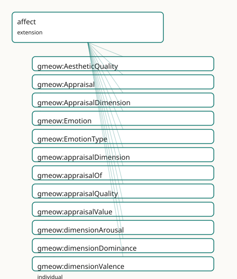

<!-- GENERATED by gmeow ontology-docs. DO NOT EDIT. -->

# GMEOW Affect Module

- **IRI:** <https://blackcatinformatics.ca/gmeow/slices/affect>
- **Tier:** extension
- **[`Group`](../reference/classes/gmeow-Group.md):** extensions

## What This Slice Covers

This slice owns 25 terms and contributes 0 mapping or projection rows. Use it when its terms match the native fact you want to preserve; use the linkage tables to see how those facts leave GMEOW for consumer vocabularies.

## Dependencies

- [`gmeow:slices/kernel`](kernel.md)
- [`gmeow:slices/observations`](observations.md)

## Consumers

- The lbox principia importer (EPIC: affect/aesthetic annotations) and the narrative arc samples (: [`sampleState`](../reference/properties/gmeow-sampleState.md) draws on [`EmotionType`](../reference/classes/gmeow-EmotionType.md) by soft reference, never dependency). DELIBERATELY THIN (P15): growth requires a new consumer; the size budget and expansion bar are recorded in docs.md.

## Local Map



## Examples

### Two Critics

- **Source:** [`slices/extensions/affect/examples/two-critics.ttl`](https://github.com/Blackcat-Informatics/gmeow-ontology/blob/main/slices/extensions/affect/examples/two-critics.ttl)
- **GMEOW terms:** [`gmeow:Appraisal`](../reference/classes/gmeow-Appraisal.md), [`gmeow:BookRelease`](../reference/classes/gmeow-BookRelease.md), [`gmeow:Emotion`](../reference/classes/gmeow-Emotion.md), [`gmeow:Expression`](../reference/classes/gmeow-Expression.md), [`gmeow:Person`](../reference/classes/gmeow-Person.md), [`gmeow:Work`](../reference/classes/gmeow-Work.md), [`gmeow:appraisalDimension`](../reference/properties/gmeow-appraisalDimension.md), [`gmeow:appraisalOf`](../reference/properties/gmeow-appraisalOf.md), [`gmeow:appraisalQuality`](../reference/properties/gmeow-appraisalQuality.md), [`gmeow:appraisalValue`](../reference/properties/gmeow-appraisalValue.md)

```turtle
# SPDX-FileCopyrightText: 2026 Blackcat Informatics® Inc. <paudley@blackcatinformatics.ca>
# SPDX-License-Identifier: CC-BY-4.0
# Worked example : the slice's whole doctrine in one scene — an
# emotion inhering in an agent (blended type, P9), and the same work
# appraised by two critics whose readings disagree and COEXIST: one finds
# sublimity (with high arousal), the other kitsch. No winner exists.

@prefix gmeow: <https://blackcatinformatics.ca/gmeow/> .
@prefix ex:    <https://blackcatinformatics.ca/gmeow/examples/> .
@prefix rdfs:  <http://www.w3.org/2000/01/rdf-schema#> .

ex:reader a gmeow:Person ; rdfs:label "the reader"@en .

ex:awe a gmeow:Emotion ;
    rdfs:label "the reader's awe"@en ;
    gmeow:emotionBearer ex:reader ;
    gmeow:emotionType gmeow:emotionFear , gmeow:emotionSurprise .

# The minimal WEMI spine the shapes demand (the gts example precedent).
ex:novelWork a gmeow:Work ; rdfs:label "the appraised work"@en .
ex:novelExpression a gmeow:Expression ;
    rdfs:label "the appraised text"@en ;
    gmeow:realizes ex:novelWork .
ex:novel a gmeow:BookRelease ;
    rdfs:label "the appraised release"@en ;
    gmeow:embodies ex:novelExpression .
ex:criticA a gmeow:Person ; rdfs:label "critic A"@en .
ex:criticB a gmeow:Person ; rdfs:label "critic B"@en .

ex:sublimeReading a gmeow:Appraisal ;
    gmeow:vantage ex:criticA ;
    gmeow:appraisalOf ex:novel ;
    gmeow:appraisalQuality gmeow:qualitySublimity .

ex:arousalReading a gmeow:Appraisal ;
    gmeow:vantage ex:criticA ;
    gmeow:appraisalOf ex:novel ;
    gmeow:appraisalDimension gmeow:dimensionArousal ;
    gmeow:appraisalValue 0.9 .

ex:kitschReading a gmeow:Appraisal ;
    gmeow:vantage ex:criticB ;
    gmeow:appraisalOf ex:novel ;
    gmeow:appraisalQuality gmeow:qualityKitsch .
```

## Terms

### Classes

| Term | Label | Definition |
|---|---|---|
| [`gmeow:AestheticQuality`](../reference/classes/gmeow-AestheticQuality.md) | Aesthetic Quality | A qualitative aesthetic reading — an OPEN vocabulary seeded with elegance, sublimity, kitsch. No AestheticQuality hierarchy exists or ever will ([Principle 9](https://github.com/Blackcat-Informatics/gmeow-ontology/blob/main/CONSTITUTION.md#principle-9)):... |
| [`gmeow:Appraisal`](../reference/classes/gmeow-Appraisal.md) | Appraisal | An affective or aesthetic reading of something, as an observation: vantage = the appraiser. Dimensional (PAD: a valence/arousal/dominance value) or qualitative... |
| [`gmeow:AppraisalDimension`](../reference/classes/gmeow-AppraisalDimension.md) | Appraisal Dimension | A dimensional axis of affective appraisal — an OPEN vocabulary seeded with the PAD triad: valence (pleasant ↔ unpleasant), arousal (activated ↔ calm), dominanc... |
| [`gmeow:Emotion`](../reference/classes/gmeow-Emotion.md) | Emotion | An emotion as an intrinsic mode inhering in one agent (the Desire/Intention grounding). Episodic temporal scope rides validFrom/validUntil on the stateme... |
| [`gmeow:EmotionType`](../reference/classes/gmeow-EmotionType.md) | Emotion Type | The kind of an emotion — an OPEN value vocabulary seeded with Plutchik's primary eight (the EmotionML standard set). Registry-independent and contestable, neve... |

### Properties

| Term | Label | Definition |
|---|---|---|
| [`gmeow:appraisalDimension`](../reference/properties/gmeow-appraisalDimension.md) | appraisal dimension | The dimension a dimensional appraisal reads. At most one per appraisal (SHACL — one cell, one reading; a PAD triple is three Appraisals sharing a vantage). Ope... |
| [`gmeow:appraisalOf`](../reference/properties/gmeow-appraisalOf.md) | appraisal of | What is appraised — an agent's state, a work, an event, an emotion (⊑ observedFeature, the bridge idiom). Range intentionally open. Functional: one apprais... |
| [`gmeow:appraisalQuality`](../reference/properties/gmeow-appraisalQuality.md) | appraisal quality | The aesthetic quality a qualitative appraisal reads. NOT functional: one cell may attribute several coexisting qualities. Open vocabulary (sh:nodeKind sh:IRI). |
| [`gmeow:appraisalValue`](../reference/properties/gmeow-appraisalValue.md) | appraisal value | The dimensional reading, on whatever scale the appraising tradition declares (a rubric's ScoreScale when the rubrics facility is loaded; plain decimals otherwi... |
| [`gmeow:emotionBearer`](../reference/properties/gmeow-emotionBearer.md) | emotion bearer | The agent in whom this emotion inheres. Functional and mandatory (SHACL): an intrinsic mode has exactly one bearer (the intentBearer pattern). |
| [`gmeow:emotionType`](../reference/properties/gmeow-emotionType.md) | emotion type | The kind(s) of this emotion. NOT functional: blended emotions carry several types, and classifications from different traditions coexist ([Principle 9](https://github.com/Blackcat-Informatics/gmeow-ontology/blob/main/CONSTITUTION.md#principle-9)). At leas... |

### Individuals

| Term | Label | Definition |
|---|---|---|
| [`gmeow:dimensionArousal`](../reference/individuals/gmeow-dimensionArousal.md) | arousal | The arousal dimension — activated versus calm. |
| [`gmeow:dimensionDominance`](../reference/individuals/gmeow-dimensionDominance.md) | dominance | The dominance dimension — in control versus controlled. |
| [`gmeow:dimensionValence`](../reference/individuals/gmeow-dimensionValence.md) | valence | The valence dimension — pleasant versus unpleasant. |
| [`gmeow:emotionAnger`](../reference/individuals/gmeow-emotionAnger.md) | anger | The anger emotion type (Plutchik primary). |
| [`gmeow:emotionAnticipation`](../reference/individuals/gmeow-emotionAnticipation.md) | anticipation | The anticipation emotion type (Plutchik primary). |
| [`gmeow:emotionDisgust`](../reference/individuals/gmeow-emotionDisgust.md) | disgust | The disgust emotion type (Plutchik primary). |
| [`gmeow:emotionFear`](../reference/individuals/gmeow-emotionFear.md) | fear | The fear emotion type (Plutchik primary). |
| [`gmeow:emotionJoy`](../reference/individuals/gmeow-emotionJoy.md) | joy | The joy emotion type (Plutchik primary). |
| [`gmeow:emotionSadness`](../reference/individuals/gmeow-emotionSadness.md) | sadness | The sadness emotion type (Plutchik primary). |
| [`gmeow:emotionSurprise`](../reference/individuals/gmeow-emotionSurprise.md) | surprise | The surprise emotion type (Plutchik primary). |
| [`gmeow:emotionTrust`](../reference/individuals/gmeow-emotionTrust.md) | trust | The trust emotion type (Plutchik primary). |
| [`gmeow:qualityElegance`](../reference/individuals/gmeow-qualityElegance.md) | elegance | The elegance aesthetic quality. |
| [`gmeow:qualityKitsch`](../reference/individuals/gmeow-qualityKitsch.md) | kitsch | The kitsch aesthetic quality. |
| [`gmeow:qualitySublimity`](../reference/individuals/gmeow-qualitySublimity.md) | sublimity | The sublimity aesthetic quality. |

## Guide

<!-- SPDX-FileCopyrightText: 2026 Blackcat Informatics® Inc. <paudley@blackcatinformatics.ca> -->
<!-- SPDX-License-Identifier: CC-BY-4.0 -->

# affect

> **Slice:** `https://blackcatinformatics.ca/gmeow/slices/affect` · **tier: extension**

Emotions and appraisals (EPIC) — **the thinnest slice in the
repo, by commitment**.

## The thinness budget

This slice ships exactly: [`Emotion`](../reference/classes/gmeow-Emotion.md) ⊑ [`gufo:IntrinsicMode`](../external/terms.md#gufo-intrinsicmode) (the
[`Desire`](../reference/classes/gmeow-Desire.md)/Intention pattern), an open Plutchik-seeded [`EmotionType`](../reference/classes/gmeow-EmotionType.md) vocabulary,
and [`Appraisal`](../reference/classes/gmeow-Appraisal.md) ⊑ [`Observation`](../reference/classes/gmeow-Observation.md) with the PAD dimensions and an open
[`AestheticQuality`](../reference/classes/gmeow-AestheticQuality.md) vocabulary. **Nothing else.** [Principle 15](https://github.com/Blackcat-Informatics/gmeow-ontology/blob/main/CONSTITUTION.md#principle-15) discipline:
growth requires a *new consumer*, not modeling pleasure. The bar for
expansion: a sensory-environment or narrative consumer demanding (e.g.) an
emotion-tenure class, appraisal provenance structure, or a cognitive
appraisal-theory layer. Until then, requests to grow this slice should be
declined with a pointer here.

## What deliberately does NOT exist

- **No emotion tenure class** — episodic scope rides [`validFrom`](../reference/properties/gmeow-validFrom.md)/[`validUntil`](../reference/properties/gmeow-validUntil.md)
 on the statement; promote to the [`StandpointTenure`](../reference/classes/gmeow-StandpointTenure.md) idiom only on consumer
 demand.
- **No attributed-vs-self-report machinery** — that's the vantage axis
 (self-report is top authority for the subject's own standpoint, the
 [`facetVantage`](../reference/properties/gmeow-facetVantage.md) precedent).
- **No emotion or aesthetic hierarchies** — open value vocabularies,
 contested by design (P9): traditions disagree about the inventory, and
 the disagreement is data.
- **No hard rubrics dependency** — [`appraisalValue`](../reference/properties/gmeow-appraisalValue.md) is read against a
 rubric [`ScoreScale`](../reference/classes/gmeow-ScoreScale.md) *when loaded*, plain decimals otherwise (soft
 reference).

## Deferred to the compiler-arc window

MFOEM rows (linkage-only — BFO lineage), EmotionML vocabulary IRIs,
WordNet-Affect closeMatch rows; the W3C EmotionML projection with declared
loss (vantage collapses to EmotionML's single-annotator model — flagged
loudly). Target list fixed in.
