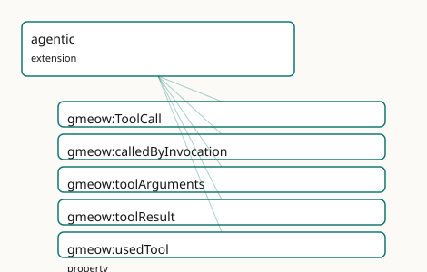

<!-- GENERATED by gmeow ontology-docs. DO NOT EDIT. -->

# GMEOW Agentic Module

- **IRI:** <https://blackcatinformatics.ca/gmeow/slices/agentic>
- **Tier:** extension
- **[`Group`](../reference/classes/gmeow-Group.md):** extensions

## What This Slice Covers

This slice owns 5 terms and contributes 2 mapping or projection rows. Use it when its terms match the native fact you want to preserve; use the linkage tables to see how those facts leave GMEOW for consumer vocabularies.

## Dependencies

- [`gmeow:slices/ai`](ai.md)
- [`gmeow:slices/entities`](entities.md)
- [`gmeow:slices/kernel`](kernel.md)
- [`gmeow:slices/provenance`](provenance.md)
- [`gmeow:slices/sources`](sources.md)
- [`gmeow:slices/temporal`](temporal.md)

## Consumers

- [`Project`](../reference/classes/gmeow-Project.md) Lillith's agentic mode (P15): tool-call trajectories audited in the same provenance graph as the agent's claims. First live producer: the gmeow memory MCP triad records its own store/revise calls as [`ToolCall`](../reference/classes/gmeow-ToolCall.md) provenance. DELIBERATELY THIN: growth requires a new consumer; the size budget is recorded in docs.md.

## Local Map



## Examples

### Agent Trajectory

- **Source:** [`slices/extensions/agentic/examples/agent-trajectory.ttl`](https://github.com/Blackcat-Informatics/gmeow-ontology/blob/main/slices/extensions/agentic/examples/agent-trajectory.ttl)
- **GMEOW terms:** [`gmeow:Document`](../reference/classes/gmeow-Document.md), [`gmeow:ModelInvocation`](../reference/classes/gmeow-ModelInvocation.md), [`gmeow:SoftwareAgent`](../reference/classes/gmeow-SoftwareAgent.md), [`gmeow:ToolCall`](../reference/classes/gmeow-ToolCall.md), [`gmeow:atTime`](../reference/properties/gmeow-atTime.md), [`gmeow:calledByInvocation`](../reference/properties/gmeow-calledByInvocation.md), [`gmeow:contentDigest`](../reference/properties/gmeow-contentDigest.md), [`gmeow:eventTemporalFrame`](../reference/properties/gmeow-eventTemporalFrame.md), [`gmeow:samplingTemperature`](../reference/properties/gmeow-samplingTemperature.md), [`gmeow:temporalFrameUTCGregorian`](../reference/individuals/gmeow-temporalFrameUTCGregorian.md)
- **External prefixes:** `xsd`

```turtle
# SPDX-FileCopyrightText: 2026 Blackcat Informatics® Inc. <paudley@blackcatinformatics.ca>
# SPDX-License-Identifier: CC-BY-4.0
#
# Worked example : one agent turn as auditable provenance — a model
# invocation requests two tool calls; the entity the second call produced
# links BACK via gmeow:wasGeneratedBy (P5: no forward output property).
# Large payloads ride as content digest literals (the verbatim-or-digest
# doctrine); ordering is temporal (gmeow:atTime), not a TBox link.

@prefix gmeow: <https://blackcatinformatics.ca/gmeow/> .
@prefix ex:    <https://blackcatinformatics.ca/gmeow/examples/> .
@prefix rdfs:  <http://www.w3.org/2000/01/rdf-schema#> .
@prefix xsd:   <http://www.w3.org/2001/XMLSchema#> .

ex:assistant a gmeow:SoftwareAgent ;
    rdfs:label "assistant model agent"@en .

ex:webSearch a gmeow:SoftwareAgent ;
    rdfs:label "web search tool"@en .

ex:storeClaim a gmeow:SoftwareAgent ;
    rdfs:label "memory store_claim tool"@en .

ex:invocation-7 a gmeow:ModelInvocation ;
    rdfs:label "turn 7 model invocation"@en ;
    gmeow:usedModel ex:assistant ;
    gmeow:samplingTemperature "0.2"^^xsd:decimal ;
    gmeow:atTime "2026-06-12T17:03:10Z"^^xsd:dateTime ;
    gmeow:eventTemporalFrame gmeow:temporalFrameUTCGregorian .

ex:call-7-1 a gmeow:ToolCall ;
    rdfs:label "turn 7, call 1: search"@en ;
    gmeow:calledByInvocation ex:invocation-7 ;
    gmeow:usedTool ex:webSearch ;
    gmeow:toolArguments "{\"query\": \"GTS deterministic encoding spec\"}" ;
    # Large result: the digest IS the value (gmeow:contentDigest convention).
    gmeow:toolResult "blake3:9f64a747e1b97f131fabb6b447296c9b6f0201e79fb3c5356e6c77e89b6a806a" ;
    gmeow:atTime "2026-06-12T17:03:11Z"^^xsd:dateTime ;
    gmeow:eventTemporalFrame gmeow:temporalFrameUTCGregorian .

ex:call-7-2 a gmeow:ToolCall ;
    rdfs:label "turn 7, call 2: store a memory note"@en ;
    gmeow:calledByInvocation ex:invocation-7 ;
    gmeow:usedTool ex:storeClaim ;
    gmeow:toolArguments "{\"text\": \"the GTS spec mandates RFC 8949 deterministic encoding\"}" ;
    gmeow:toolResult "{\"ok\": true}" ;
    gmeow:atTime "2026-06-12T17:03:14Z"^^xsd:dateTime ;
    gmeow:eventTemporalFrame gmeow:temporalFrameUTCGregorian .

# The produced entity links BACK to the call that wrote it (P5).
ex:note-2200 a gmeow:Document ;
    rdfs:label "stored memory note"@en ;
    gmeow:wasGeneratedBy ex:call-7-2 ;
    gmeow:wasAttributedTo ex:assistant .
```

## Terms

### Classes

| Term | Label | Definition |
|---|---|---|
| [`gmeow:ToolCall`](../reference/classes/gmeow-ToolCall.md) | Tool Call | One invocation of a tool by an agent: the tool agent ([`gmeow:usedTool`](../reference/properties/gmeow-usedTool.md)), the requesting model invocation when known ([`gmeow:calledByInvocation`](../reference/properties/gmeow-calledByInvocation.md)), and the verbatim... |

### Properties

| Term | Label | Definition |
|---|---|---|
| [`gmeow:calledByInvocation`](../reference/properties/gmeow-calledByInvocation.md) | called by invocation | The model invocation that requested this tool call. Functional: one requesting invocation per call. Optional: a recording harness may not expose the invocation... |
| [`gmeow:toolArguments`](../reference/properties/gmeow-toolArguments.md) | tool arguments | The verbatim arguments payload presented to the tool (typically JSON), byte-faithful. For large payloads store a content digest literal instead ('blake3:…' — t... |
| [`gmeow:toolResult`](../reference/properties/gmeow-toolResult.md) | tool result | The verbatim result payload the tool returned, byte-faithful — the PAYLOAD of the event, never a forward entity link: an entity the call produced links back vi... |
| [`gmeow:usedTool`](../reference/properties/gmeow-usedTool.md) | used tool | The tool that was called — a SoftwareAgent (an MCP tool, a search service, a code runner). Deliberately no Tool subclass: tool-ness is the role the agent plays... |

## Linkages

- **Rows:** 2
- **Projection profiles:** -
- **External vocabularies:** `schema`, `wd`

| Source | Kind | Profile | Predicate/Relation | Target | Evidence |
|---|---|---|---|---|---|
| [`gmeow:ToolCall`](../reference/classes/gmeow-ToolCall.md) | equivalence | `-` | [skos:relatedMatch](http://www.w3.org/2004/02/skos/core#relatedMatch) | [schema:Action](https://schema.org/Action) | `gmeow-agentic.sssom.tsv`; `gmeow:eqAg002`; confidence 0.6 |
| [`gmeow:ToolCall`](../reference/classes/gmeow-ToolCall.md) | equivalence | `-` | [skos:relatedMatch](http://www.w3.org/2004/02/skos/core#relatedMatch) | [wd:Q62270](https://www.wikidata.org/wiki/Q62270) | `gmeow-agentic.sssom.tsv`; `gmeow:eqAg001`; confidence 0.5 |

## Guide

<!--
SPDX-FileCopyrightText: 2026 Blackcat Informatics® Inc. <paudley@blackcatinformatics.ca>
SPDX-License-Identifier: CC-BY-4.0
-->

# The Agentic extension — the agent's actions as auditable provenance

The graphrag extension made the *pipeline* auditable; this slice makes the *agent's
actions* auditable. A tool call is an event in the same provenance graph as
the claims it produces: [`gmeow:ToolCall`](../reference/classes/gmeow-ToolCall.md) follows the [`ModelInvocation`](../reference/classes/gmeow-ModelInvocation.md) idiom exactly — a
[`gufo:EventType`](../external/terms.md#gufo-eventtype) under [`gmeow:Activity`](../reference/classes/gmeow-Activity.md) with one functional agent link and verbatim call
payloads — so "which tool, called by which invocation, with what arguments, at what
time?" is answerable after the fact, with no new provenance machinery ([Principle 4](https://github.com/Blackcat-Informatics/gmeow-ontology/blob/main/CONSTITUTION.md#principle-4)).

The named consumer is [`Project`](../reference/classes/gmeow-Project.md) Lillith's agentic mode ([Principle 15](https://github.com/Blackcat-Informatics/gmeow-ontology/blob/main/CONSTITUTION.md#principle-15)), and the first live
producer ships in this repo: the gmeow memory MCP triad records its own `store_claim`
and `revise_belief` calls as [`ToolCall`](../reference/classes/gmeow-ToolCall.md) provenance, so the P14 memory flagship's actions
are themselves grounded memory.

Deliberately thin: five terms. [`Trajectory`](../reference/classes/gmeow-Trajectory.md) aggregates (runs, episodes, plans) wait for a
consumer that needs them; growth requires a new consumer, not modeling pleasure.

## The call event

### [`gmeow:ToolCall`](../reference/classes/gmeow-ToolCall.md)

One invocation of a tool by an agent — the [`ModelInvocation`](../reference/classes/gmeow-ModelInvocation.md) idiom one level down. A
[`gufo:EventType`](../external/terms.md#gufo-eventtype) under [`gmeow:Activity`](../reference/classes/gmeow-Activity.md), so the temporal slice's clocks ([`gmeow:atTime`](../reference/properties/gmeow-atTime.md))
and the provenance slice's lineage ([`gmeow:wasGeneratedBy`](../reference/properties/gmeow-wasGeneratedBy.md), [`gmeow:wasAttributedTo`](../reference/properties/gmeow-wasAttributedTo.md))
apply unchanged. The doctrine that matters most is what [`ToolCall`](../reference/classes/gmeow-ToolCall.md) does **not** have: a
forward output entity property. An entity the call produced — a stored claim, a written
file, a minted node — links *back* via [`gmeow:wasGeneratedBy`](../reference/properties/gmeow-wasGeneratedBy.md) ([Principle 5](https://github.com/Blackcat-Informatics/gmeow-ontology/blob/main/CONSTITUTION.md#principle-5)), exactly as
a generated claim links back to its [`gmeow:ModelInvocation`](../reference/classes/gmeow-ModelInvocation.md). A multi-tool turn is
several ToolCalls, never one fat one (closed-world `sh:maxCount` twins gate every
functional property).

### [`gmeow:calledByInvocation`](../reference/properties/gmeow-calledByInvocation.md)

The model invocation that requested the call — the seam joining the action trajectory to
the generation trajectory. Functional, and deliberately **optional**: a recording
harness may not expose the invocation, and a [`ToolCall`](../reference/classes/gmeow-ToolCall.md) without one is still auditable
provenance. The call's result feeding a *later* invocation is temporal ordering
([`gmeow:atTime`](../reference/properties/gmeow-atTime.md)), not a TBox link.

### [`gmeow:usedTool`](../reference/properties/gmeow-usedTool.md)

The tool that was called, mirroring [`gmeow:usedModel`](../reference/properties/gmeow-usedModel.md). The range is [`gmeow:SoftwareAgent`](../reference/classes/gmeow-SoftwareAgent.md)
and there is deliberately **no Tool subclass**: tool-ness is the role the agent plays in
this call event, not an identity (roles classify, never reify — the [`Persona`](../reference/classes/gmeow-Persona.md) lesson). An
MCP tool, a search service, and a code runner are SoftwareAgents that happen to be
called. One tool per call, functional.

## The payloads

### [`gmeow:toolArguments`](../reference/properties/gmeow-toolArguments.md) · [`gmeow:toolResult`](../reference/properties/gmeow-toolResult.md)

The verbatim, byte-faithful payloads of the call — what was asked and what came back.
These record the **payload of the event**, never an entity link; [`gmeow:toolResult`](../reference/properties/gmeow-toolResult.md) is
the JSON the tool returned, not the thing it created. For large payloads the
verbatim-or-digest doctrine applies: store a content digest literal (`"blake3:…"` — the
[`gmeow:contentDigest`](../reference/properties/gmeow-contentDigest.md) convention from the sources slice) instead of the bytes; the
digest is the value, resolvable from a content-addressed store, and the self-describing
prefix keeps the two forms distinguishable. At most one arguments record and at most one
result record per call — both optional (functional, with closed-world twins).

## Cross-slice bridges

- **ai** — [`gmeow:calledByInvocation`](../reference/properties/gmeow-calledByInvocation.md) targets [`gmeow:ModelInvocation`](../reference/classes/gmeow-ModelInvocation.md); a claim's
 [`gmeow:wasGeneratedBy`](../reference/properties/gmeow-wasGeneratedBy.md) chain now reaches through the invocation *and* the calls it
 requested.
- **provenance** — produced entities link back via [`gmeow:wasGeneratedBy`](../reference/properties/gmeow-wasGeneratedBy.md); agent
 responsibility rides [`gmeow:wasAttributedTo`](../reference/properties/gmeow-wasAttributedTo.md), unchanged.
- **sources** — the digest-literal convention for large payloads is
 [`gmeow:contentDigest`](../reference/properties/gmeow-contentDigest.md)'s (`"blake3:…"`, `"sha256:…"`), reused verbatim.
- **temporal** — [`gmeow:atTime`](../reference/properties/gmeow-atTime.md) orders calls within a turn; no sequence machinery is
 minted here.

## Alignments

[`gmeow:ToolCall`](../reference/classes/gmeow-ToolCall.md) is [`prov:Activity`](http://www.w3.org/ns/prov#Activity) by inheritance through [`gmeow:Activity`](../reference/classes/gmeow-Activity.md) (the
provenance alignment set). Wikidata's nearest stable entity is the *mechanism*, not the
event ([`wd:Q62270`](https://www.wikidata.org/wiki/Q62270), remote procedure call — relatedMatch). OpenAI function-calling,
Anthropic `tool_use`, and MCP tool schemas are JSON specifications with no stable RDF
namespace: bridging them is a projection concern (Workflow Run Crate, the
OpenLineage precedent), recorded as REFUSED cells in the mapping trailer rather than
papered over.
