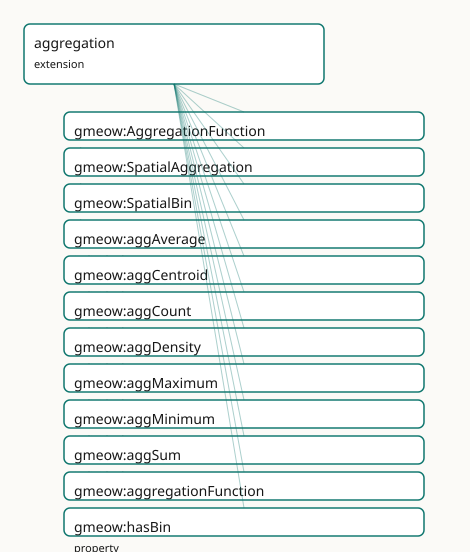

<!-- GENERATED by gmeow ontology-docs. DO NOT EDIT. -->

# GMEOW Spatial Aggregation Module

- **IRI:** <https://blackcatinformatics.ca/gmeow/slices/aggregation>
- **Tier:** extension
- **[`Group`](../reference/classes/gmeow-Group.md):** extensions

## What This Slice Covers

This slice owns 13 terms and contributes 4 mapping or projection rows. Use it when its terms match the native fact you want to preserve; use the linkage tables to see how those facts leave GMEOW for consumer vocabularies.

## Dependencies

- [`gmeow:slices/observations`](observations.md)
- [`gmeow:slices/places`](places.md)

## Consumers

- Spatial aggregation (count, density, k-anonymity) in the solver layer over places.

## Local Map



## Examples

### Spatial Bins

- **Source:** [`slices/extensions/aggregation/examples/spatial-bins.ttl`](https://github.com/Blackcat-Informatics/gmeow-ontology/blob/main/slices/extensions/aggregation/examples/spatial-bins.ttl)
- **GMEOW terms:** [`gmeow:Measurement`](../reference/classes/gmeow-Measurement.md), [`gmeow:Organization`](../reference/classes/gmeow-Organization.md), [`gmeow:Place`](../reference/classes/gmeow-Place.md), [`gmeow:ScalarQuantity`](../reference/classes/gmeow-ScalarQuantity.md), [`gmeow:SpatialAggregation`](../reference/classes/gmeow-SpatialAggregation.md), [`gmeow:SpatialBin`](../reference/classes/gmeow-SpatialBin.md), [`gmeow:aggAverage`](../reference/individuals/gmeow-aggAverage.md), [`gmeow:aggregationFunction`](../reference/properties/gmeow-aggregationFunction.md), [`gmeow:hasBin`](../reference/properties/gmeow-hasBin.md), [`gmeow:hasUnit`](../reference/properties/gmeow-hasUnit.md)
- **External prefixes:** `xsd`

```turtle
# SPDX-FileCopyrightText: 2026 Blackcat Informatics® Inc. <paudley@blackcatinformatics.ca>
# SPDX-License-Identifier: CC-BY-4.0
#
# Worked example: spatial aggregation IS a measurement, with a privacy floor
# . A gmeow:SpatialAggregation is a gmeow:Measurement (so it carries the
# observation bundle: observedFeature, vantage, observationMethod, result) that
# applies a gmeow:aggregationFunction (average / count / density …) over
# gmeow:SpatialBins. gmeow:minimumPopulation is the k-anonymity floor: bins with
# fewer than that many people are NOT reported, so the aggregate can be published
# without re-identifying individuals (P12 — the safe public projection).
@prefix gmeow: <https://blackcatinformatics.ca/gmeow/> .
@prefix ex:    <https://blackcatinformatics.ca/gmeow/examples/aggregation/> .
@prefix rdfs:  <http://www.w3.org/2000/01/rdf-schema#> .
@prefix xsd:   <http://www.w3.org/2001/XMLSchema#> .

ex:censusBureau a gmeow:Organization ; gmeow:name "Regional Census Bureau"@en .
ex:metro        a gmeow:Place ; gmeow:name "Metro statistical area"@en .

# --- The aggregation: average household size over the region, by survey, with a
#     1000-person minimum-population floor for safe publication.
ex:householdAgg a gmeow:SpatialAggregation ;
    gmeow:observedFeature     ex:metro ;
    gmeow:vantage             ex:censusBureau ;
    gmeow:observationMethod   gmeow:methodSurvey ;
    gmeow:aggregationFunction gmeow:aggAverage ;
    gmeow:minimumPopulation   "1000"^^xsd:nonNegativeInteger ;
    gmeow:hasBin              ex:downtownBin ;
    gmeow:observationResult   ex:avgHouseholdSize .

# The result is a scalar with its unit (a Quantity must declare exactly one unit,
# P11); a count of persons-per-household is the dimensionless QUDT number unit.
ex:avgHouseholdSize a gmeow:ScalarQuantity ;
    gmeow:quantityValue "2.4"^^xsd:decimal ;
    gmeow:hasUnit       <http://qudt.org/vocab/unit/NUM> .

ex:downtownBin a gmeow:SpatialBin ;
    rdfs:label "Downtown census tract"@en .
```

## Terms

### Classes

| Term | Label | Definition |
|---|---|---|
| [`gmeow:AggregationFunction`](../reference/classes/gmeow-AggregationFunction.md) | Aggregation Function | The kind of statistical aggregation applied to a spatial region — a value vocabulary (individuals, never subclasses). |
| [`gmeow:SpatialAggregation`](../reference/classes/gmeow-SpatialAggregation.md) | Spatial Aggregation | A measurement that aggregates entities located within a spatial region, yielding a scalar result such as a count, density, or average. The aggregation region i... |
| [`gmeow:SpatialBin`](../reference/classes/gmeow-SpatialBin.md) | Spatial Bin | A place that serves as a spatial bin in an aggregation grid — a generated region used to partition space for statistical summarisation. Its geometry defines th... |

### Properties

| Term | Label | Definition |
|---|---|---|
| [`gmeow:aggregationFunction`](../reference/properties/gmeow-aggregationFunction.md) | aggregation function | The statistical function applied to the entities in the aggregation region — count, sum, average, density, minimum, maximum, or centroid. |
| [`gmeow:hasBin`](../reference/properties/gmeow-hasBin.md) | has bin | Links a spatial aggregation to one of its constituent spatial bins. Non-functional: a bin may participate in multiple aggregations. |
| [`gmeow:minimumPopulation`](../reference/properties/gmeow-minimumPopulation.md) | minimum population | The minimum population size (k) required for the aggregation result to be disclosed — the k-anonymity parameter. A result failing this check is suppressed at p... |

### Individuals

| Term | Label | Definition |
|---|---|---|
| [`gmeow:aggAverage`](../reference/individuals/gmeow-aggAverage.md) | average | The arithmetic mean of a numeric property over entities within the aggregation region. |
| [`gmeow:aggCentroid`](../reference/individuals/gmeow-aggCentroid.md) | centroid | The geometric centre of the aggregation region or of the entities within it. Computed by the solver layer ([Principle 12](https://github.com/Blackcat-Informatics/gmeow-ontology/blob/main/CONSTITUTION.md#principle-12)). |
| [`gmeow:aggCount`](../reference/individuals/gmeow-aggCount.md) | count | The number of entities within the aggregation region. |
| [`gmeow:aggDensity`](../reference/individuals/gmeow-aggDensity.md) | density | The number of entities per unit area within the aggregation region. Computed by the solver layer ([Principle 12](https://github.com/Blackcat-Informatics/gmeow-ontology/blob/main/CONSTITUTION.md#principle-12)). |
| [`gmeow:aggMaximum`](../reference/individuals/gmeow-aggMaximum.md) | maximum | The largest value of a numeric property over entities within the aggregation region. |
| [`gmeow:aggMinimum`](../reference/individuals/gmeow-aggMinimum.md) | minimum | The smallest value of a numeric property over entities within the aggregation region. |
| [`gmeow:aggSum`](../reference/individuals/gmeow-aggSum.md) | sum | The arithmetic sum of a numeric property over entities within the aggregation region. |

## Linkages

- **Rows:** 4
- **Projection profiles:** `qb`
- **External vocabularies:** `qb`, `rdf`

| Source | Kind | Profile | Predicate/Relation | Target | Evidence |
|---|---|---|---|---|---|
| [`gmeow:AggregationFunction`](../reference/classes/gmeow-AggregationFunction.md) | equivalence | `-` | [skos:closeMatch](http://www.w3.org/2004/02/skos/core#closeMatch) | [qb:MeasureProperty](http://purl.org/linked-data/cube#MeasureProperty) | `gmeow-aggregation.sssom.tsv`; `gmeow:eqAgg003`; confidence 0.8 |
| [`gmeow:SpatialAggregation`](../reference/classes/gmeow-SpatialAggregation.md) | equivalence | `-` | [skos:closeMatch](http://www.w3.org/2004/02/skos/core#closeMatch) | [qb:Observation](http://purl.org/linked-data/cube#Observation) | `gmeow-aggregation.sssom.tsv`; `gmeow:eqAgg001`; confidence 0.8 |
| [`gmeow:SpatialAggregation`](../reference/classes/gmeow-SpatialAggregation.md) | projection | `qb` | projects to / <= | [`gmeow:observedFeature`](../reference/properties/gmeow-observedFeature.md), [qb:ComponentSpecification](http://purl.org/linked-data/cube#ComponentSpecification), [qb:DataSet](http://purl.org/linked-data/cube#DataSet), [qb:DataStructureDefinition](http://purl.org/linked-data/cube#DataStructureDefinition), [qb:DimensionProperty](http://purl.org/linked-data/cube#DimensionProperty), [qb:MeasureProperty](http://purl.org/linked-data/cube#MeasureProperty), [qb:Observation](http://purl.org/linked-data/cube#Observation), [qb:component](http://purl.org/linked-data/cube#component), [qb:dataSet](http://purl.org/linked-data/cube#dataSet), [qb:dimension](http://purl.org/linked-data/cube#dimension), [qb:measure](http://purl.org/linked-data/cube#measure), [qb:measureType](http://purl.org/linked-data/cube#measureType), [qb:obsValue](http://purl.org/linked-data/cube#obsValue), [qb:structure](http://purl.org/linked-data/cube#structure), [rdf:type](http://www.w3.org/1999/02/22-rdf-syntax-ns#type) | `gmeow:mapQbObservation`; lossy: vantage, confidence, temporal scope, granularity, determinacy, and k-anonymity metadata are dropped in pure QB; only the measure type (function), observation value (scalar), and spatial context (observedFeature) are retained. A well-formed [qb:DataSet](http://purl.org/linked-data/cube#DataSet) and [qb:DataStructureDefinition](http://purl.org/linked-data/cube#DataStructureDefinition) are emitted per observation. Suppressed when displayable=false ([Principle 10](https://github.com/Blackcat-Informatics/gmeow-ontology/blob/main/CONSTITUTION.md#principle-10)). |
| [`gmeow:aggregationFunction`](../reference/properties/gmeow-aggregationFunction.md) | projection | `qb` | projects to / <= | [`gmeow:observedFeature`](../reference/properties/gmeow-observedFeature.md), [qb:ComponentSpecification](http://purl.org/linked-data/cube#ComponentSpecification), [qb:DataSet](http://purl.org/linked-data/cube#DataSet), [qb:DataStructureDefinition](http://purl.org/linked-data/cube#DataStructureDefinition), [qb:DimensionProperty](http://purl.org/linked-data/cube#DimensionProperty), [qb:MeasureProperty](http://purl.org/linked-data/cube#MeasureProperty), [qb:Observation](http://purl.org/linked-data/cube#Observation), [qb:component](http://purl.org/linked-data/cube#component), [qb:dataSet](http://purl.org/linked-data/cube#dataSet), [qb:dimension](http://purl.org/linked-data/cube#dimension), [qb:measure](http://purl.org/linked-data/cube#measure), [qb:measureType](http://purl.org/linked-data/cube#measureType), [qb:obsValue](http://purl.org/linked-data/cube#obsValue), [qb:structure](http://purl.org/linked-data/cube#structure), [rdf:type](http://www.w3.org/1999/02/22-rdf-syntax-ns#type) | `gmeow:mapQbObservation`; lossy: vantage, confidence, temporal scope, granularity, determinacy, and k-anonymity metadata are dropped in pure QB; only the measure type (function), observation value (scalar), and spatial context (observedFeature) are retained. A well-formed [qb:DataSet](http://purl.org/linked-data/cube#DataSet) and [qb:DataStructureDefinition](http://purl.org/linked-data/cube#DataStructureDefinition) are emitted per observation. Suppressed when displayable=false ([Principle 10](https://github.com/Blackcat-Informatics/gmeow-ontology/blob/main/CONSTITUTION.md#principle-10)). |

## Guide

<!-- SPDX-FileCopyrightText: 2026 Blackcat Informatics® Inc. <paudley@blackcatinformatics.ca> -->
<!-- SPDX-License-Identifier: CC-BY-4.0 -->

# Aggregation — spatial summarisation as honest measurement

> **Slice:** `https://blackcatinformatics.ca/gmeow/slices/aggregation` · **tier: extension**
> Count, sum, average, density, centroid, and binning over places — every summary a claim.

A statistic is not a fact about the world; it is a *measurement* somebody made of a region.
This slice therefore adds almost nothing — and that is its doctrine. Every aggregation is a
[`gmeow:Measurement`](../reference/classes/gmeow-Measurement.md) in the universal observation stack, so vantage, observed feature,
result, confidence, granularity, and temporal scope are inherited without duplication
([Principle 4](https://github.com/Blackcat-Informatics/gmeow-ontology/blob/main/CONSTITUTION.md#principle-4): one observation spine, reused everywhere). The aggregation region is the
[`observedFeature`](../reference/properties/gmeow-observedFeature.md); the result is a [`gmeow:ScalarQuantity`](../reference/classes/gmeow-ScalarQuantity.md). The actual arithmetic —
counting, density, centroid, binning — is performed by the solver layer ([Principle 12](https://github.com/Blackcat-Informatics/gmeow-ontology/blob/main/CONSTITUTION.md#principle-12)),
never materialised as asserted triples in the OWL core. The slice realises the the design
Location-as-reference-frame design and the centroid shortcut cross-cutting aggregation concern.

Its Principle-15 consumer, declared in the manifest: **spatial aggregation (count,
density, k-anonymity) in the solver layer over places** — the slice exists so the solver
has typed, provenance-bearing nodes to hang its computed summaries on.

Privacy is the projection layer's job, not a parallel mechanism: [`gmeow:coarsenTo`](../reference/properties/gmeow-coarsenTo.md),
[`gmeow:displayable`](../reference/properties/gmeow-displayable.md) false, and [`gmeow:hasSensitivity`](../reference/properties/gmeow-hasSensitivity.md) govern whether and at what
granularity a result may be published ([Principle 10](https://github.com/Blackcat-Informatics/gmeow-ontology/blob/main/CONSTITUTION.md#principle-10) — suppress or coarsen at projection
time, never delete). The k-anonymity *check* itself is a solver computation.

## The aggregation node

### [`gmeow:SpatialAggregation`](../reference/classes/gmeow-SpatialAggregation.md)

A [`Measurement`](../reference/classes/gmeow-Measurement.md) subkind whose [`observedFeature`](../reference/properties/gmeow-observedFeature.md) is a [`Place`](../reference/classes/gmeow-Place.md) and whose [`observationResult`](../reference/properties/gmeow-observationResult.md)
is a [`ScalarQuantity`](../reference/classes/gmeow-ScalarQuantity.md). Because it *is* a measurement, a published census count and a rival
survey estimate over the same region are two coexisting, vantage-bearing aggregations —
no privileged figure ([Principle 9](https://github.com/Blackcat-Informatics/gmeow-ontology/blob/main/CONSTITUTION.md#principle-9)). Pair with [`gmeow:hasReferenceFrame`](../reference/properties/gmeow-hasReferenceFrame.md) (the spatial
frame, [Principle 11](https://github.com/Blackcat-Informatics/gmeow-ontology/blob/main/CONSTITUTION.md#principle-11)) and [`gmeow:hasGranularity`](../reference/properties/gmeow-hasGranularity.md) from the reused core spine.

### [`gmeow:aggregationFunction`](../reference/properties/gmeow-aggregationFunction.md)

Functional pointer from a [`SpatialAggregation`](../reference/classes/gmeow-SpatialAggregation.md) to the statistical function applied —
exactly one function per aggregation node; a region summarised two ways is two
aggregations.

### [`gmeow:AggregationFunction`](../reference/classes/gmeow-AggregationFunction.md)

The open value vocabulary of functions ([Principle 9](https://github.com/Blackcat-Informatics/gmeow-ontology/blob/main/CONSTITUTION.md#principle-9) — individuals, never subclasses):
seeds [`aggCount`](../reference/individuals/gmeow-aggCount.md), [`aggSum`](../reference/individuals/gmeow-aggSum.md), [`aggAverage`](../reference/individuals/gmeow-aggAverage.md), [`aggDensity`](../reference/individuals/gmeow-aggDensity.md), [`aggCentroid`](../reference/individuals/gmeow-aggCentroid.md), [`aggMinimum`](../reference/individuals/gmeow-aggMinimum.md),
[`aggMaximum`](../reference/individuals/gmeow-aggMaximum.md). Density and centroid are explicitly solver-computed; the others summarise a
numeric property over the entities in the region. A new function is a fresh individual,
not a schema change.

## Binning

### [`gmeow:SpatialBin`](../reference/classes/gmeow-SpatialBin.md)

A [`Place`](../reference/classes/gmeow-Place.md) subkind: a generated region that partitions space for summarisation — a grid
cell, a hex bin, a census tract. Its geometry (from the places slice) defines the bin
boundary; being a [`Place`](../reference/classes/gmeow-Place.md), it participates in RCC-8, reference frames, and granularity like
any other region. Bins are infrastructure, not discoveries.

### [`gmeow:hasBin`](../reference/properties/gmeow-hasBin.md)

Links a [`SpatialAggregation`](../reference/classes/gmeow-SpatialAggregation.md) to its constituent bins. Non-functional in both directions:
an aggregation may span many bins, and a bin may serve many aggregations (the same hex
grid reused across years of data).

## The privacy gate

### [`gmeow:minimumPopulation`](../reference/properties/gmeow-minimumPopulation.md)

The k-anonymity parameter, carried on the aggregation itself: the minimum population size
(k) required for the result to be disclosed. A result failing the check is suppressed at
projection time — coarsened via [`coarsenTo`](../reference/properties/gmeow-coarsenTo.md) or withheld via `displayable false`
([Principle 10](https://github.com/Blackcat-Informatics/gmeow-ontology/blob/main/CONSTITUTION.md#principle-10)) — never deleted. The threshold comparison ("publish only if count >= k")
is evaluated by the solver layer ([Principle 12](https://github.com/Blackcat-Informatics/gmeow-ontology/blob/main/CONSTITUTION.md#principle-12)); the OWL core records the policy, not the
verdict.

## Reuse, not redefinition

The slice deliberately redeclares nothing: [`observedFeature`](../reference/properties/gmeow-observedFeature.md), [`observationResult`](../reference/properties/gmeow-observationResult.md), and
`vantage` come from observations; [`hasReferenceFrame`](../reference/properties/gmeow-hasReferenceFrame.md) from places; [`hasGranularity`](../reference/properties/gmeow-hasGranularity.md),
[`hasSensitivity`](../reference/properties/gmeow-hasSensitivity.md), and [`coarsenTo`](../reference/properties/gmeow-coarsenTo.md) from core; `displayable` from names. The module lists
them as a documentation-only reuse block — duplication would violate [Principle 4](https://github.com/Blackcat-Informatics/gmeow-ontology/blob/main/CONSTITUTION.md#principle-4).

## Dependencies

Depends on `observations` (the [`Measurement`](../reference/classes/gmeow-Measurement.md) spine) and `places` ([`Place`](../reference/classes/gmeow-Place.md), geometry, frames).
Consumed by the solver layer; no other slice depends on it — aggregation is a terminal
extension by design.
