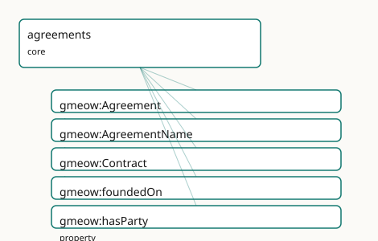

<!-- GENERATED by gmeow ontology-docs. DO NOT EDIT. -->

# GMEOW Agreements Module

- **IRI:** <https://blackcatinformatics.ca/gmeow/slices/agreements>
- **Tier:** core
- **[`Group`](../reference/classes/gmeow-Group.md):** core

## What This Slice Covers

This slice owns 5 terms and contributes 1 mapping or projection rows. Use it when its terms match the native fact you want to preserve; use the linkage tables to see how those facts leave GMEOW for consumer vocabularies.

## Dependencies

- [`gmeow:slices/kernel`](kernel.md)
- [`gmeow:slices/names`](names.md)

## Consumers

- Licences-as-agreements (rights), employment terms, and calendar RSVPs.

## Local Map



## Examples

### Employment Contract

- **Source:** [`slices/core/agreements/examples/employment-contract.ttl`](https://github.com/Blackcat-Informatics/gmeow-ontology/blob/main/slices/core/agreements/examples/employment-contract.ttl)
- **GMEOW terms:** [`gmeow:Agreement`](../reference/classes/gmeow-Agreement.md), [`gmeow:AgreementName`](../reference/classes/gmeow-AgreementName.md), [`gmeow:Contract`](../reference/classes/gmeow-Contract.md), [`gmeow:Membership`](../reference/classes/gmeow-Membership.md), [`gmeow:Organization`](../reference/classes/gmeow-Organization.md), [`gmeow:Person`](../reference/classes/gmeow-Person.md), [`gmeow:foundedOn`](../reference/properties/gmeow-foundedOn.md), [`gmeow:fullName`](../reference/properties/gmeow-fullName.md), [`gmeow:hasAgreementName`](../reference/properties/gmeow-hasAgreementName.md), [`gmeow:hasParty`](../reference/properties/gmeow-hasParty.md)
- **External prefixes:** `gufo`

```turtle
# SPDX-FileCopyrightText: 2026 Blackcat Informatics® Inc. <paudley@blackcatinformatics.ca>
# SPDX-License-Identifier: CC-BY-4.0
#
# Worked example: an agreement as a relator . A gmeow:Agreement (here a
# gmeow:Contract, the legally-enforceable specialization) is a gufo:Relator that
# binds its parties via gmeow:hasParty — the agreement IS the relationship, not a
# property of either party. It bears a structured gmeow:AgreementName (an
# Appellation, so multilingual co-equal titles are first-class). Other relators
# can be gmeow:foundedOn it: the employment Membership below exists BECAUSE of the
# contract, so its grounding is recorded rather than assumed.
@prefix gmeow: <https://blackcatinformatics.ca/gmeow/> .
@prefix ex:    <https://blackcatinformatics.ca/gmeow/examples/agreements/> .

ex:acme a gmeow:Organization ; gmeow:name "Acme Robotics Inc."@en .
ex:dana a gmeow:Person ; gmeow:name "Dana Reyes"@en .

# --- The contract: a relator binding the two parties, bearing a formal name.
#     (Validity bounds — gmeow:validFrom/validUntil — are statement-level RDF-1.2
#     annotations, carried in the statement layer rather than as A-box triples.)
ex:contract a gmeow:Contract ;
    gmeow:hasParty         ex:acme , ex:dana ;
    gmeow:hasAgreementName ex:contractName .

ex:contractName a gmeow:AgreementName ;
    gmeow:fullName "Acme Robotics — Reyes Employment Agreement (2026)"@en .

# --- The employment Membership is FOUNDED ON the contract: it exists because of
#     it, so the grounding relator points at the agreement rather than assuming it.
ex:employment a gmeow:Membership ;
    gmeow:membershipMember       ex:dana ;
    gmeow:membershipOrganization ex:acme ;
    gmeow:foundedOn              ex:contract .
```

## Terms

### Classes

| Term | Label | Definition |
|---|---|---|
| [`gmeow:Agreement`](../reference/classes/gmeow-Agreement.md) | Agreement | A mutual understanding between two or more agents that creates obligations or rights, reified as a relator connecting its parties. |
| [`gmeow:AgreementName`](../reference/classes/gmeow-AgreementName.md) | Agreement Name | An appellation borne by an agreement — a formal title, short name, or multilingual version of a contract or legal instrument. Carries its own gmeow:nameLanguag... |
| [`gmeow:Contract`](../reference/classes/gmeow-Contract.md) | Contract | A legally enforceable agreement. |

### Properties

| Term | Label | Definition |
|---|---|---|
| [`gmeow:foundedOn`](../reference/properties/gmeow-foundedOn.md) | founded on | The agreement or contract that grounds this relator — in UFO terms, the set of commitments on which the relator is founded. Reusable across any relator (Member... |
| [`gmeow:hasParty`](../reference/properties/gmeow-hasParty.md) | has party | Relates an agreement to an agent that is bound by it. |

## Linkages

- **Rows:** 1
- **Projection profiles:** -
- **External vocabularies:** `schema`

| Source | Kind | Profile | Predicate/Relation | Target | Evidence |
|---|---|---|---|---|---|
| [`gmeow:AgreementName`](../reference/classes/gmeow-AgreementName.md) | equivalence | `-` | [skos:broadMatch](http://www.w3.org/2004/02/skos/core#broadMatch) | [schema:name](https://schema.org/name) | `gmeow-names.sssom.tsv`; `gmeow:eqNames052`; confidence 0.6 |

## Guide

<!-- SPDX-FileCopyrightText: 2026 Blackcat Informatics® Inc. <paudley@blackcatinformatics.ca> -->
<!-- SPDX-License-Identifier: CC-BY-4.0 -->

# Agreements — the relator that grounds every binding

> **Slice:** `https://blackcatinformatics.ca/gmeow/slices/agreements` · **tier: core**
> Mutual understandings reified as relators — and the [`foundedOn`](../reference/properties/gmeow-foundedOn.md) hook that lets every other relator say *why it binds*.

A flat `partyA contractsWith partyB` triple cannot carry a date, a clause, a name, or a
dispute. GMEOW therefore models an agreement the way UFO says it should be modelled: as a
**relator** ([`gufo:Relator`](../external/terms.md#gufo-relator)) — a first-class truthmaker that *binds* its parties rather than
a predicate that merely connects them. The agreement node owns its identity, its
appellations, its temporal scope (statement-layer clocks), and its provenance; the parties
hang off it via [`gmeow:hasParty`](../reference/properties/gmeow-hasParty.md).

The slice is deliberately small because its real surface is everything else: in UFO, a
relator is *founded on* a set of commitments, and [`gmeow:foundedOn`](../reference/properties/gmeow-foundedOn.md) makes that foundation
explicit and reusable. A [`Membership`](../reference/classes/gmeow-Membership.md), a [`KinRelationship`](../reference/classes/gmeow-KinRelationship.md) by adoption, an employment
tenure, a licence — any relator anywhere in the graph can declare the agreement that grounds
it, instead of duplicating contractual structure per slice. Legal enforceability is a
*specialization*, not a property flag: [`gmeow:Contract`](../reference/classes/gmeow-Contract.md) is the SubKind for agreements a
legal system will enforce, and the handshake deal stays an honest [`gmeow:Agreement`](../reference/classes/gmeow-Agreement.md).

## The relator core

### [`gmeow:Agreement`](../reference/classes/gmeow-Agreement.md)

A mutual understanding between two or more agents that creates obligations or rights,
reified as a [`gufo:Kind`](../external/terms.md#gufo-kind) relator connecting its parties. Anything from a treaty to a verbal
promise; when the terms themselves need deontic structure, link a [`RightsStatement`](../reference/classes/gmeow-RightsStatement.md) (rights
slice) rather than widening this class.

### [`gmeow:Contract`](../reference/classes/gmeow-Contract.md)

The legally enforceable SubKind of [`gmeow:Agreement`](../reference/classes/gmeow-Agreement.md). Enforceability is the identity-bearing
distinction — not a boolean on [`Agreement`](../reference/classes/gmeow-Agreement.md) — so contract-specific machinery (governing law,
execution, breach events) has a typed home without burdening informal agreements.

### [`gmeow:hasParty`](../reference/properties/gmeow-hasParty.md)

Binds the agreement to each [`gmeow:Agent`](../reference/classes/gmeow-Agent.md) it obligates. Non-functional and repeated: one
statement per party, any arity. Roles within the agreement (licensor/licensee,
employer/employee) belong to the consuming relator or a [`Participation`](../reference/classes/gmeow-Participation.md), not to new
subproperties here.

### [`gmeow:AgreementName`](../reference/classes/gmeow-AgreementName.md)

An [`gmeow:Appellation`](../reference/classes/gmeow-Appellation.md) SubKind for the formal title, short name, or multilingual version of
an instrument ("CETA", "Comprehensive Economic and Trade [`Agreement`](../reference/classes/gmeow-Agreement.md)"). Each name is a
first-class object carrying its own [`gmeow:nameLanguage`](../reference/properties/gmeow-nameLanguage.md) and [`gmeow:nameScript`](../reference/properties/gmeow-nameScript.md), so co-equal
multilingual names coexist instead of fighting over one literal ([Principle 9](https://github.com/Blackcat-Informatics/gmeow-ontology/blob/main/CONSTITUTION.md#principle-9) — no
`primaryName`).

### [`gmeow:foundedOn`](../reference/properties/gmeow-foundedOn.md)

The cross-cutting hook: any [`gufo:Relator`](../external/terms.md#gufo-relator) → the [`gmeow:Agreement`](../reference/classes/gmeow-Agreement.md) that grounds it — UFO's
foundation-on-commitments made a queryable edge. This is how licences-as-agreements (rights
slice), employment terms, and calendar RSVPs all resolve to one contractual spine instead of
three parallel ones.

## Worked shape

```turtle
ex:ceta a gmeow:Contract ;
    gmeow:hasParty ex:canada, ex:europeanUnion ;
    gmeow:hasAppellation ex:cetaShortName .

ex:membership-ca-ceta a gmeow:Membership ;
    gmeow:foundedOn ex:ceta .
```

The membership relator carries the tenure; the contract carries the binding; neither
duplicates the other.

## Solver layer & deferred alignment

The ontology asserts who is bound and on what foundation — nothing more. Obligation
fulfillment, breach detection, term expiry, and clause interpretation are solver-layer
computations over the relator plus its rights statements and statement-layer clocks
([Principle 12](https://github.com/Blackcat-Informatics/gmeow-ontology/blob/main/CONSTITUTION.md#principle-12)); the graph never carries an `isInBreach` flag for the same reason the
deception slice carries no `isFalse`. No mapping profile ships yet: alignment by reference
(schema.org's agreement-adjacent terms, [FIBO](../external/ontologies.md#target-fibo-fnd-pas-ps) contracts) is deliberately deferred to the
alignment window, where it lands as SSSOM rows rather than imported axioms.

## Dependencies

Depends on `kernel` ([`Agent`](../reference/classes/gmeow-Agent.md), the relator grounding) and `names` ([`Appellation`](../reference/classes/gmeow-Appellation.md), for
[`AgreementName`](../reference/classes/gmeow-AgreementName.md)). Consumed by `rights` (licences are agreements), `employment` (terms of
engagement), and `calendar` (RSVPs as lightweight agreements) — each via [`gmeow:foundedOn`](../reference/properties/gmeow-foundedOn.md),
never by re-modelling the contract.
