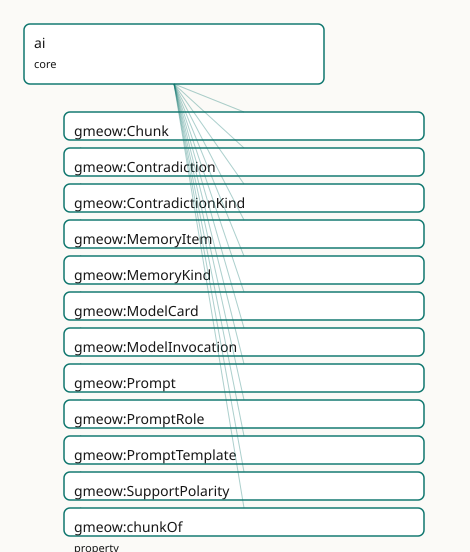

<!-- GENERATED by gmeow ontology-docs. DO NOT EDIT. -->

# GMEOW AI Claim Module

- **IRI:** <https://blackcatinformatics.ca/gmeow/slices/ai>
- **Tier:** core
- **[`Group`](../reference/classes/gmeow-Group.md):** core

## What This Slice Covers

This slice owns 51 terms and contributes 23 mapping or projection rows. Use it when its terms match the native fact you want to preserve; use the linkage tables to see how those facts leave GMEOW for consumer vocabularies.

## Dependencies

- [`gmeow:slices/entities`](entities.md)
- [`gmeow:slices/evidence`](evidence.md)
- [`gmeow:slices/kernel`](kernel.md)
- [`gmeow:slices/observations`](observations.md)
- [`gmeow:slices/provenance`](provenance.md)

## Consumers

- The flagship (P14): the gmeow PyPI client's Memory store, the MCP store/recall/revise triad, the hallucination-resistant KG pattern + gmeow audit, the claim-extraction eval suite, and [`Project`](../reference/classes/gmeow-Project.md) Lillith via extensions/graphrag.

## Local Map



## Examples

### Grounded Claim

- **Source:** [`slices/core/ai/examples/grounded-claim.ttl`](https://github.com/Blackcat-Informatics/gmeow-ontology/blob/main/slices/core/ai/examples/grounded-claim.ttl)
- **GMEOW terms:** [`gmeow:Chunk`](../reference/classes/gmeow-Chunk.md), [`gmeow:Contradiction`](../reference/classes/gmeow-Contradiction.md), [`gmeow:Document`](../reference/classes/gmeow-Document.md), [`gmeow:EvidenceSpan`](../reference/classes/gmeow-EvidenceSpan.md), [`gmeow:Goal`](../reference/classes/gmeow-Goal.md), [`gmeow:MemoryItem`](../reference/classes/gmeow-MemoryItem.md), [`gmeow:ModelCard`](../reference/classes/gmeow-ModelCard.md), [`gmeow:ModelInvocation`](../reference/classes/gmeow-ModelInvocation.md), [`gmeow:Prompt`](../reference/classes/gmeow-Prompt.md), [`gmeow:PromptTemplate`](../reference/classes/gmeow-PromptTemplate.md)
- **External prefixes:** `owl`, `xsd`

```turtle
# SPDX-FileCopyrightText: 2026 Blackcat Informatics® Inc. <paudley@blackcatinformatics.ca>
# SPDX-License-Identifier: CC-BY-4.0
#
# Worked example: LLM output as claim-not-truth, on the EXISTING machinery.
# A grounded claim and an ungrounded one (the flagged hallucination), both
# StandpointClaims whose vantage is the model agent (the unified observation
# stance, P9); their conflict SURFACED by a Contradiction; the grounded claim
# remembered (MemoryItem role); the verdicts about the hallucination expressed
# with the standpoint slice's bullshit modality and the deception slice's
# veridicality — from an auditor vantage, like every other claim.
@prefix gmeow: <https://blackcatinformatics.ca/gmeow/> .
@prefix ex:    <https://blackcatinformatics.ca/gmeow/examples/ai/> .
@prefix owl:   <http://www.w3.org/2002/07/owl#> .
@prefix rdfs:  <http://www.w3.org/2000/01/rdf-schema#> .
@prefix xsd:   <http://www.w3.org/2001/XMLSchema#> .

# --- The source and its retrieval segment (the spine's left half).
ex:handbook a gmeow:Document ;
    rdfs:label "facilities handbook, 2026 edition"@en ;
    gmeow:contentDigest "blake3:9f8e7d6c5b4a39281706f5e4d3c2b1a09f8e7d6c5b4a39281706f5e4d3c2b1a0" .

ex:chunk-042 a gmeow:Chunk ;
    gmeow:chunkOf ex:handbook ;
    gmeow:spanStart "18200"^^xsd:nonNegativeInteger ;
    gmeow:spanEnd "18950"^^xsd:nonNegativeInteger ;
    gmeow:contentDigest "blake3:1a2b3c4d5e6f708192a3b4c5d6e7f8091a2b3c4d5e6f708192a3b4c5d6e7f809" .

# --- The model, its card, and the invocation (the provenance anchor).
ex:assistant a gmeow:SoftwareAgent ;
    rdfs:label "facilities assistant model"@en ;
    # Teleology: the agent's goal, asserted like any attributed claim.
    gmeow:hasGoal ex:goal-answer-faithfully .

ex:goal-answer-faithfully a gmeow:Goal ;
    rdfs:label "answer facilities questions faithfully to the handbook"@en .

ex:card-assistant a gmeow:ModelCard ;
    gmeow:describesModel ex:assistant ;
    gmeow:modelProvider "Example Labs" ;
    gmeow:modelVersionTag "assistant-2026-05-01" ;
    gmeow:modelContextWindow "200000"^^xsd:positiveInteger ;
    gmeow:modelTrainingCutoff "2026-01-31"^^xsd:date .

ex:prompt-extract a gmeow:Prompt ;
    gmeow:promptRole gmeow:promptRoleSystem ;
    gmeow:filledFrom ex:template-extract-v1 ;
    gmeow:contentDigest "blake3:00112233445566778899aabbccddeeff00112233445566778899aabbccddeeff" .

ex:template-extract-v1 a gmeow:PromptTemplate ;
    rdfs:label "claim-extraction template v1"@en ;
    gmeow:promptRole gmeow:promptRoleSystem .

ex:invocation-19 a gmeow:ModelInvocation ;
    gmeow:usedModel ex:assistant ;
    gmeow:hasPrompt ex:prompt-extract ;
    gmeow:samplingTemperature 0.0 ;
    gmeow:atTime "2026-05-15T10:00:00Z"^^xsd:dateTime ;
    gmeow:eventTemporalFrame gmeow:temporalFrameUTCGregorian .

# --- The claims: reified statements observed from the MODEL's vantage.
# (The RDF 1.2 source authors these as statement annotations; the owl:Axiom
# form here is the generated downcast idiom, P3.)
ex:east-wing gmeow:validUntil "2026-12-31T22:00:00Z"^^xsd:dateTime .

ex:stmt-2200 a owl:Axiom ;
    owl:annotatedSource   ex:east-wing ;
    owl:annotatedProperty gmeow:validUntil ;
    owl:annotatedTarget   "2026-12-31T22:00:00Z"^^xsd:dateTime .

ex:stmt-2300 a owl:Axiom ;
    owl:annotatedSource   ex:east-wing ;
    owl:annotatedProperty gmeow:validUntil ;
    owl:annotatedTarget   "2026-12-31T23:00:00Z"^^xsd:dateTime .

# The GROUNDED claim: generated by the invocation, attributed to the model,
# pinned to the exact evidentiary bytes. ALSO remembered (MemoryItem role).
ex:claim-close-2200 a gmeow:StandpointClaim, gmeow:MemoryItem ;
    gmeow:vantage ex:assistant ;
    gmeow:observedFeature ex:stmt-2200 ;
    gmeow:observationMethod gmeow:methodLlmExtraction ;
    gmeow:claimModality gmeow:probable ;
    gmeow:wasGeneratedBy ex:invocation-19 ;
    gmeow:wasAttributedTo ex:assistant ;
    gmeow:groundedIn ex:span-close-2200 ;
    gmeow:memoryOf ex:assistant ;
    gmeow:memoryKind gmeow:memoryKindSemantic .

ex:span-close-2200 a gmeow:EvidenceSpan ;
    gmeow:spanOfChunk ex:chunk-042 ;
    gmeow:spanStart "310"^^xsd:nonNegativeInteger ;
    gmeow:spanEnd "366"^^xsd:nonNegativeInteger ;
    gmeow:supportPolarity gmeow:polaritySupports .

# The UNGROUNDED claim: no groundedIn span — the flagged hallucination,
# retained, never deleted (P10).
ex:claim-close-2300 a gmeow:StandpointClaim ;
    gmeow:vantage ex:assistant ;
    gmeow:observedFeature ex:stmt-2300 ;
    gmeow:observationMethod gmeow:methodLlmExtraction ;
    gmeow:claimModality gmeow:probable ;
    gmeow:wasGeneratedBy ex:invocation-19 ;
    gmeow:wasAttributedTo ex:assistant .

# --- The conflict, SURFACED and attributed — never resolved by rank (P9).
ex:contradiction-close a gmeow:Contradiction ;
    gmeow:contradictsClaim ex:claim-close-2200, ex:claim-close-2300 ;
    gmeow:contradictionKind gmeow:contradictionKindNumeric ;
    gmeow:detectedBy ex:auditor .

# --- The auditor's VERDICT about the hallucination: itself a claim from a
# vantage, using the standpoint slice's bullshit modality (Frankfurt:
# asserted without regard to truth) and the deception slice's veridicality.
ex:auditor a gmeow:SoftwareAgent ; rdfs:label "grounding auditor"@en .

ex:stmt-2300-is-claimed a owl:Axiom ;
    owl:annotatedSource   ex:claim-close-2300 ;
    owl:annotatedProperty gmeow:claimModality ;
    owl:annotatedTarget   gmeow:probable .

ex:verdict-2300 a gmeow:StandpointClaim ;
    gmeow:vantage ex:auditor ;
    gmeow:observedFeature ex:stmt-2300-is-claimed ;
    gmeow:observationMethod gmeow:methodNliDerivation ;
    gmeow:claimModality gmeow:bullshit ;
    gmeow:claimVeridicality gmeow:veridicalityUntrue .
```

## Terms

### Classes

| Term | Label | Definition |
|---|---|---|
| [`gmeow:Chunk`](../reference/classes/gmeow-Chunk.md) | Chunk | A contiguous segment of a source information object, produced by a chunking step for retrieval — the unit a retrieval returns, a model reads, and an evidence s... |
| [`gmeow:Contradiction`](../reference/classes/gmeow-Contradiction.md) | Contradiction | A reified conflict between two or more claim nodes — surfaced, attributed ([`gmeow:detectedBy`](../reference/properties/gmeow-detectedBy.md)), kind-classified ([`gmeow:contradictionKind`](../reference/properties/gmeow-contradictionKind.md)), and NEVER resolved by... |
| [`gmeow:ContradictionKind`](../reference/classes/gmeow-ContradictionKind.md) | Contradiction Kind | An open value vocabulary of contradiction flavours. |
| [`gmeow:MemoryItem`](../reference/classes/gmeow-MemoryItem.md) | Memory Item | An observation/claim in the role of an agent's remembered belief ([`gmeow:memoryOf`](../reference/properties/gmeow-memoryOf.md) the remembering agent; [`gmeow:memoryKind`](../reference/properties/gmeow-memoryKind.md) the cognitive register). A [gufo:Role](../external/terms.md#gufo-role) o... |
| [`gmeow:MemoryKind`](../reference/classes/gmeow-MemoryKind.md) | Memory Kind | An open value vocabulary of agent-memory registers. |
| [`gmeow:ModelCard`](../reference/classes/gmeow-ModelCard.md) | Model Card | A structured description of a model agent ([`gmeow:describesModel`](../reference/properties/gmeow-describesModel.md)): provider, version tag, context window, training cutoff. Aligns Model Cards / ML-Schema / SPDX... |
| [`gmeow:ModelInvocation`](../reference/classes/gmeow-ModelInvocation.md) | Model Invocation | One call to a generative model: the model agent ([`gmeow:usedModel`](../reference/properties/gmeow-usedModel.md)), the prompts presented ([`gmeow:hasPrompt`](../reference/properties/gmeow-hasPrompt.md)), and the sampling parameters. The provenance anchor... |
| [`gmeow:Prompt`](../reference/classes/gmeow-Prompt.md) | Prompt | A concrete prompt presented to a model in an invocation — content-addressable ([`gmeow:contentDigest`](../reference/properties/gmeow-contentDigest.md)), role-tagged ([`gmeow:promptRole`](../reference/properties/gmeow-promptRole.md)), optionally instantiating a... |
| [`gmeow:PromptRole`](../reference/classes/gmeow-PromptRole.md) | Prompt Role | An open value vocabulary of conversational prompt roles. |
| [`gmeow:PromptTemplate`](../reference/classes/gmeow-PromptTemplate.md) | Prompt Template | A reusable, versioned prompt with unfilled variables — the published artifact (ships the claim-extraction template as data, not code). Concrete prompts lin... |
| [`gmeow:SupportPolarity`](../reference/classes/gmeow-SupportPolarity.md) | Support Polarity | The closed three-value polarity of an evidence span toward its claim. |

### Properties

| Term | Label | Definition |
|---|---|---|
| [`gmeow:chunkOf`](../reference/properties/gmeow-chunkOf.md) | chunk of | The source information object this chunk segments. Functional: a chunk is cut from exactly one source; re-chunking produces new Chunk individuals, never a re-p... |
| [`gmeow:contradictionKind`](../reference/properties/gmeow-contradictionKind.md) | contradiction kind | The flavour of conflict (open vocabulary): factual, temporal, numeric, framing. |
| [`gmeow:contradictsClaim`](../reference/properties/gmeow-contradictsClaim.md) | contradicts claim | Relates a contradiction to one of the claim nodes in conflict — at least two per contradiction (SHACL; the OWL existential documents the relator's relata for t... |
| [`gmeow:describesModel`](../reference/properties/gmeow-describesModel.md) | describes model | The model agent this card describes. |
| [`gmeow:detectedBy`](../reference/properties/gmeow-detectedBy.md) | detected by | The agent (a person, an NLI model, an evaluation run's judge) that surfaced this contradiction. Attributed because detection is contestable. Not [`gmeow:vantage`](../reference/properties/gmeow-vantage.md),... |
| [`gmeow:filledFrom`](../reference/properties/gmeow-filledFrom.md) | filled from | The template this concrete prompt instantiates. |
| [`gmeow:groundedIn`](../reference/properties/gmeow-groundedIn.md) | grounded in | Ties a claim node to a pinned evidence span supporting (or refuting — [`gmeow:supportPolarity`](../reference/properties/gmeow-supportPolarity.md)) it. DOMAIN-FREE on purpose: a claim node is a gmeow:StandpointClai... |
| [`gmeow:hasPrompt`](../reference/properties/gmeow-hasPrompt.md) | has prompt | A prompt presented in this invocation. Non-functional: a chat invocation carries several prompts in conversational roles ([`gmeow:promptRole`](../reference/properties/gmeow-promptRole.md)). |
| [`gmeow:memoryKind`](../reference/properties/gmeow-memoryKind.md) | memory kind | The cognitive register of this memory item (open vocabulary): episodic, semantic, working, procedural. |
| [`gmeow:memoryOf`](../reference/properties/gmeow-memoryOf.md) | memory of | The agent whose memory holds this item. |
| [`gmeow:modelContextWindow`](../reference/properties/gmeow-modelContextWindow.md) | model context window | The context-window size, in tokens, the card declares. |
| [`gmeow:modelProvider`](../reference/properties/gmeow-modelProvider.md) | model provider | The organization providing the model, as named on the card. |
| [`gmeow:modelTrainingCutoff`](../reference/properties/gmeow-modelTrainingCutoff.md) | model training cutoff | The training-data cutoff date the card declares — staleness context for everything the model asserts. |
| [`gmeow:modelVersionTag`](../reference/properties/gmeow-modelVersionTag.md) | model version tag | The provider's wire-level version identifier for the described snapshot. Citation-grade version identity rides 's DOI machinery. |
| [`gmeow:promptRole`](../reference/properties/gmeow-promptRole.md) | prompt role | The conversational role this prompt occupies (open vocabulary: system, user, assistant, tool). |
| [`gmeow:samplingMaxTokens`](../reference/properties/gmeow-samplingMaxTokens.md) | sampling max tokens | The output-length ceiling of this invocation. |
| [`gmeow:samplingTemperature`](../reference/properties/gmeow-samplingTemperature.md) | sampling temperature | The temperature parameter of this invocation. Sampling parameters are claim provenance: the same prompt at temperature 0 and 1.2 are different epistemic acts. |
| [`gmeow:samplingTopP`](../reference/properties/gmeow-samplingTopP.md) | sampling top-p | The nucleus-sampling parameter of this invocation. |
| [`gmeow:spanEnd`](../reference/properties/gmeow-spanEnd.md) | span end | The ending character offset (unicode code points, zero-based, exclusive) of a span. Pairs with [`gmeow:spanStart`](../reference/properties/gmeow-spanStart.md). |
| [`gmeow:spanOfChunk`](../reference/properties/gmeow-spanOfChunk.md) | span of chunk | The retrieved chunk this evidence span pins into — the retrieval-substrate seam of the existing evidence layer. With gmeow:spanStart/spanEnd (and the citations... |
| [`gmeow:spanStart`](../reference/properties/gmeow-spanStart.md) | span start | The starting character offset (unicode code points, zero-based, inclusive) of a span — a Chunk within its source, or an EvidenceSpan within a chunk. Domain-fre... |
| [`gmeow:supportPolarity`](../reference/properties/gmeow-supportPolarity.md) | support polarity | Whether this evidence span supports, refutes, or is neutral toward the claim it grounds — the NLI/AIS verdict as data, orthogonal to the citations slice's gmeo... |
| [`gmeow:usedModel`](../reference/properties/gmeow-usedModel.md) | used model | The model agent this invocation called. The model is a first-class [`gmeow:SoftwareAgent`](../reference/classes/gmeow-SoftwareAgent.md) (P9: machine subjects are attributable, and capable of self-assertion),... |

### Individuals

| Term | Label | Definition |
|---|---|---|
| [`gmeow:contradictionKindFactual`](../reference/individuals/gmeow-contradictionKindFactual.md) | factual | The claims assert incompatible facts. |
| [`gmeow:contradictionKindFraming`](../reference/individuals/gmeow-contradictionKindFraming.md) | framing | The claims presuppose incompatible framings of the same matter — often standpoint difference rather than factual conflict. |
| [`gmeow:contradictionKindNumeric`](../reference/individuals/gmeow-contradictionKindNumeric.md) | numeric | The claims carry incompatible quantities. |
| [`gmeow:contradictionKindTemporal`](../reference/individuals/gmeow-contradictionKindTemporal.md) | temporal | The claims disagree about timing or ordering. |
| [`gmeow:memoryKindEpisodic`](../reference/individuals/gmeow-memoryKindEpisodic.md) | episodic | A memory of a specific experienced event. |
| [`gmeow:memoryKindProcedural`](../reference/individuals/gmeow-memoryKindProcedural.md) | procedural | A how-to: a learned procedure or skill description. |
| [`gmeow:memoryKindSemantic`](../reference/individuals/gmeow-memoryKindSemantic.md) | semantic | A general fact or belief, detached from its acquisition episode. |
| [`gmeow:memoryKindWorking`](../reference/individuals/gmeow-memoryKindWorking.md) | working | A short-horizon item held for the current task. |
| [`gmeow:methodLlmExtraction`](../reference/individuals/gmeow-methodLlmExtraction.md) | LLM extraction | The claim was extracted from source material by a generative model invocation — pair with [`gmeow:wasGeneratedBy`](../reference/properties/gmeow-wasGeneratedBy.md) the [`gmeow:ModelInvocation`](../reference/classes/gmeow-ModelInvocation.md) for the full provenanc... |
| [`gmeow:methodNliDerivation`](../reference/individuals/gmeow-methodNliDerivation.md) | NLI derivation | The claim (typically a support/refute verdict) was derived by a natural-language-inference judgment over existing text. |
| [`gmeow:polarityNeutral`](../reference/individuals/gmeow-polarityNeutral.md) | neutral | The span is topically related but neither entails nor contradicts the claim. |
| [`gmeow:polarityRefutes`](../reference/individuals/gmeow-polarityRefutes.md) | refutes | The span contradicts the claim. |
| [`gmeow:polaritySupports`](../reference/individuals/gmeow-polaritySupports.md) | supports | The span entails or substantiates the claim. |
| [`gmeow:promptRoleAssistant`](../reference/individuals/gmeow-promptRoleAssistant.md) | assistant | The assistant-turn role (a prior model output replayed as context). |
| [`gmeow:promptRoleSystem`](../reference/individuals/gmeow-promptRoleSystem.md) | system | The system-instruction role. |
| [`gmeow:promptRoleTool`](../reference/individuals/gmeow-promptRoleTool.md) | tool | The tool-result role (a tool output replayed as context). |
| [`gmeow:promptRoleUser`](../reference/individuals/gmeow-promptRoleUser.md) | user | The user-turn role. |

## Linkages

- **Rows:** 23
- **Projection profiles:** `schema-org`, `web-annotation`
- **External vocabularies:** `cito`, `mls`, `oa`, `prov`, `rdf`, `schema`, `wd`

| Source | Kind | Profile | Predicate/Relation | Target | Evidence |
|---|---|---|---|---|---|
| [`gmeow:Chunk`](../reference/classes/gmeow-Chunk.md) | equivalence | `-` | [skos:relatedMatch](http://www.w3.org/2004/02/skos/core#relatedMatch) | [oa:TextPositionSelector](http://www.w3.org/ns/oa#TextPositionSelector) | `gmeow-ai.sssom.tsv`; `gmeow:eqAi015`; confidence 0.5 |
| [`gmeow:Contradiction`](../reference/classes/gmeow-Contradiction.md) | equivalence | `-` | [skos:closeMatch](http://www.w3.org/2004/02/skos/core#closeMatch) | [wd:Q363948](https://www.wikidata.org/wiki/Q363948) | `gmeow-ai.sssom.tsv`; `gmeow:eqAi014`; confidence 0.75 |
| [`gmeow:ModelCard`](../reference/classes/gmeow-ModelCard.md) | equivalence | `-` | [skos:closeMatch](http://www.w3.org/2004/02/skos/core#closeMatch) | [mls:Model](http://www.w3.org/ns/mls#Model) | `gmeow-ai.sssom.tsv`; `gmeow:eqAi006`; confidence 0.6 |
| [`gmeow:ModelInvocation`](../reference/classes/gmeow-ModelInvocation.md) | equivalence | `-` | [skos:closeMatch](http://www.w3.org/2004/02/skos/core#closeMatch) | [mls:Run](http://www.w3.org/ns/mls#Run) | `gmeow-ai.sssom.tsv`; `gmeow:eqAi005`; confidence 0.75 |
| [`gmeow:Prompt`](../reference/classes/gmeow-Prompt.md) | equivalence | `-` | [skos:relatedMatch](http://www.w3.org/2004/02/skos/core#relatedMatch) | [prov:Entity](http://www.w3.org/ns/prov#Entity) | `gmeow-ai.sssom.tsv`; `gmeow:eqAi007`; confidence 0.6 |
| [`gmeow:Prompt`](../reference/classes/gmeow-Prompt.md) | equivalence | `-` | [skos:relatedMatch](http://www.w3.org/2004/02/skos/core#relatedMatch) | [wd:Q108941486](https://www.wikidata.org/wiki/Q108941486) | `gmeow-ai.sssom.tsv`; `gmeow:eqAi008`; confidence 0.55 |
| [`gmeow:groundedIn`](../reference/properties/gmeow-groundedIn.md) | equivalence | `-` | [skos:relatedMatch](http://www.w3.org/2004/02/skos/core#relatedMatch) | [oa:hasTarget](http://www.w3.org/ns/oa#hasTarget) | `gmeow-ai.sssom.tsv`; `gmeow:eqAi009`; confidence 0.6 |
| [`gmeow:groundedIn`](../reference/properties/gmeow-groundedIn.md) | equivalence | `-` | [skos:relatedMatch](http://www.w3.org/2004/02/skos/core#relatedMatch) | [schema:appearance](https://schema.org/appearance) | `gmeow-ai.sssom.tsv`; `gmeow:eqAi016`; confidence 0.5 |
| [`gmeow:modelVersionTag`](../reference/properties/gmeow-modelVersionTag.md) | equivalence | `-` | [skos:closeMatch](http://www.w3.org/2004/02/skos/core#closeMatch) | [schema:softwareVersion](https://schema.org/softwareVersion) | `gmeow-ai.sssom.tsv`; `gmeow:eqAi017`; confidence 0.85 |
| [`gmeow:polarityRefutes`](../reference/individuals/gmeow-polarityRefutes.md) | equivalence | `-` | [skos:relatedMatch](http://www.w3.org/2004/02/skos/core#relatedMatch) | [cito:disputes](http://purl.org/spar/cito/disputes) | `gmeow-ai.sssom.tsv`; `gmeow:eqAi013`; confidence 0.6 |
| [`gmeow:polaritySupports`](../reference/individuals/gmeow-polaritySupports.md) | equivalence | `-` | [skos:relatedMatch](http://www.w3.org/2004/02/skos/core#relatedMatch) | [cito:supports](http://purl.org/spar/cito/supports) | `gmeow-ai.sssom.tsv`; `gmeow:eqAi012`; confidence 0.6 |
| [`gmeow:spanEnd`](../reference/properties/gmeow-spanEnd.md) | equivalence | `-` | [skos:closeMatch](http://www.w3.org/2004/02/skos/core#closeMatch) | [oa:end](http://www.w3.org/ns/oa#end) | `gmeow-ai.sssom.tsv`; `gmeow:eqAi011`; confidence 0.85 |
| [`gmeow:spanStart`](../reference/properties/gmeow-spanStart.md) | equivalence | `-` | [skos:closeMatch](http://www.w3.org/2004/02/skos/core#closeMatch) | [oa:start](http://www.w3.org/ns/oa#start) | `gmeow-ai.sssom.tsv`; `gmeow:eqAi010`; confidence 0.85 |
| [`gmeow:ModelCard`](../reference/classes/gmeow-ModelCard.md) | projection | `schema-org` | projects to / <= | [rdf:type](http://www.w3.org/1999/02/22-rdf-syntax-ns#type), [schema:SoftwareApplication](https://schema.org/SoftwareApplication), [schema:name](https://schema.org/name), [schema:softwareVersion](https://schema.org/softwareVersion) | `gmeow:mapSchemaModelCard`; confidence 0.75; lossy: provider (string, no faithful Organization node), context window, and training cutoff dropped; the card/agent distinction collapses onto the agent |
| [`gmeow:chunkOf`](../reference/properties/gmeow-chunkOf.md) | projection | `schema-org` | projects to / <= | [rdf:type](http://www.w3.org/1999/02/22-rdf-syntax-ns#type), [schema:Claim](https://schema.org/Claim), [schema:appearance](https://schema.org/appearance), [schema:author](https://schema.org/author), [schema:text](https://schema.org/text) | `gmeow:mapSchemaGeneratedClaim`; confidence 0.8; lossy: modality, veridicality, confidence, standpoint poset, and the reified statement content dropped; verdicts ride as per-review ClaimReview nodes (mapSchemaClaimReview) preserving the data's epistemic shape — attributed stays authored, anonymous stays anonymous, nothing computed; appearance only when the evidence spine is complete |
| [`gmeow:describesModel`](../reference/properties/gmeow-describesModel.md) | projection | `schema-org` | projects to / <= | [rdf:type](http://www.w3.org/1999/02/22-rdf-syntax-ns#type), [schema:SoftwareApplication](https://schema.org/SoftwareApplication), [schema:name](https://schema.org/name), [schema:softwareVersion](https://schema.org/softwareVersion) | `gmeow:mapSchemaModelCard`; confidence 0.75; lossy: provider (string, no faithful Organization node), context window, and training cutoff dropped; the card/agent distinction collapses onto the agent |
| [`gmeow:groundedIn`](../reference/properties/gmeow-groundedIn.md) | projection | `schema-org` | projects to / <= | [rdf:type](http://www.w3.org/1999/02/22-rdf-syntax-ns#type), [schema:Claim](https://schema.org/Claim), [schema:appearance](https://schema.org/appearance), [schema:author](https://schema.org/author), [schema:text](https://schema.org/text) | `gmeow:mapSchemaGeneratedClaim`; confidence 0.8; lossy: modality, veridicality, confidence, standpoint poset, and the reified statement content dropped; verdicts ride as per-review ClaimReview nodes (mapSchemaClaimReview) preserving the data's epistemic shape — attributed stays authored, anonymous stays anonymous, nothing computed; appearance only when the evidence spine is complete |
| [`gmeow:groundedIn`](../reference/properties/gmeow-groundedIn.md) | projection | `web-annotation` | projects to / <= | [oa:Annotation](http://www.w3.org/ns/oa#Annotation), [oa:SpecificResource](http://www.w3.org/ns/oa#SpecificResource), [oa:TextPositionSelector](http://www.w3.org/ns/oa#TextPositionSelector), [oa:end](http://www.w3.org/ns/oa#end), [oa:hasBody](http://www.w3.org/ns/oa#hasBody), [oa:hasSelector](http://www.w3.org/ns/oa#hasSelector), [oa:hasSource](http://www.w3.org/ns/oa#hasSource), [oa:hasTarget](http://www.w3.org/ns/oa#hasTarget), [oa:start](http://www.w3.org/ns/oa#start), [rdf:type](http://www.w3.org/1999/02/22-rdf-syntax-ns#type) | `gmeow:mapOaGroundedClaim`; confidence 0.85; lossy: supportPolarity dropped (no faithful oa motivation — assessing would imply a verdict); claim epistemics (confidence, standpoint, modality, clocks) dropped; the quote selector half joins when the citations selectors project |
| [`gmeow:modelVersionTag`](../reference/properties/gmeow-modelVersionTag.md) | projection | `schema-org` | projects to / <= | [rdf:type](http://www.w3.org/1999/02/22-rdf-syntax-ns#type), [schema:SoftwareApplication](https://schema.org/SoftwareApplication), [schema:name](https://schema.org/name), [schema:softwareVersion](https://schema.org/softwareVersion) | `gmeow:mapSchemaModelCard`; confidence 0.75; lossy: provider (string, no faithful Organization node), context window, and training cutoff dropped; the card/agent distinction collapses onto the agent |
| [`gmeow:spanEnd`](../reference/properties/gmeow-spanEnd.md) | projection | `web-annotation` | projects to / <= | [oa:Annotation](http://www.w3.org/ns/oa#Annotation), [oa:SpecificResource](http://www.w3.org/ns/oa#SpecificResource), [oa:TextPositionSelector](http://www.w3.org/ns/oa#TextPositionSelector), [oa:end](http://www.w3.org/ns/oa#end), [oa:hasBody](http://www.w3.org/ns/oa#hasBody), [oa:hasSelector](http://www.w3.org/ns/oa#hasSelector), [oa:hasSource](http://www.w3.org/ns/oa#hasSource), [oa:hasTarget](http://www.w3.org/ns/oa#hasTarget), [oa:start](http://www.w3.org/ns/oa#start), [rdf:type](http://www.w3.org/1999/02/22-rdf-syntax-ns#type) | `gmeow:mapOaGroundedClaim`; confidence 0.85; lossy: supportPolarity dropped (no faithful oa motivation — assessing would imply a verdict); claim epistemics (confidence, standpoint, modality, clocks) dropped; the quote selector half joins when the citations selectors project |
| [`gmeow:spanOfChunk`](../reference/properties/gmeow-spanOfChunk.md) | projection | `schema-org` | projects to / <= | [rdf:type](http://www.w3.org/1999/02/22-rdf-syntax-ns#type), [schema:Claim](https://schema.org/Claim), [schema:appearance](https://schema.org/appearance), [schema:author](https://schema.org/author), [schema:text](https://schema.org/text) | `gmeow:mapSchemaGeneratedClaim`; confidence 0.8; lossy: modality, veridicality, confidence, standpoint poset, and the reified statement content dropped; verdicts ride as per-review ClaimReview nodes (mapSchemaClaimReview) preserving the data's epistemic shape — attributed stays authored, anonymous stays anonymous, nothing computed; appearance only when the evidence spine is complete |
| [`gmeow:spanOfChunk`](../reference/properties/gmeow-spanOfChunk.md) | projection | `web-annotation` | projects to / <= | [oa:Annotation](http://www.w3.org/ns/oa#Annotation), [oa:SpecificResource](http://www.w3.org/ns/oa#SpecificResource), [oa:TextPositionSelector](http://www.w3.org/ns/oa#TextPositionSelector), [oa:end](http://www.w3.org/ns/oa#end), [oa:hasBody](http://www.w3.org/ns/oa#hasBody), [oa:hasSelector](http://www.w3.org/ns/oa#hasSelector), [oa:hasSource](http://www.w3.org/ns/oa#hasSource), [oa:hasTarget](http://www.w3.org/ns/oa#hasTarget), [oa:start](http://www.w3.org/ns/oa#start), [rdf:type](http://www.w3.org/1999/02/22-rdf-syntax-ns#type) | `gmeow:mapOaGroundedClaim`; confidence 0.85; lossy: supportPolarity dropped (no faithful oa motivation — assessing would imply a verdict); claim epistemics (confidence, standpoint, modality, clocks) dropped; the quote selector half joins when the citations selectors project |
| [`gmeow:spanStart`](../reference/properties/gmeow-spanStart.md) | projection | `web-annotation` | projects to / <= | [oa:Annotation](http://www.w3.org/ns/oa#Annotation), [oa:SpecificResource](http://www.w3.org/ns/oa#SpecificResource), [oa:TextPositionSelector](http://www.w3.org/ns/oa#TextPositionSelector), [oa:end](http://www.w3.org/ns/oa#end), [oa:hasBody](http://www.w3.org/ns/oa#hasBody), [oa:hasSelector](http://www.w3.org/ns/oa#hasSelector), [oa:hasSource](http://www.w3.org/ns/oa#hasSource), [oa:hasTarget](http://www.w3.org/ns/oa#hasTarget), [oa:start](http://www.w3.org/ns/oa#start), [rdf:type](http://www.w3.org/1999/02/22-rdf-syntax-ns#type) | `gmeow:mapOaGroundedClaim`; confidence 0.85; lossy: supportPolarity dropped (no faithful oa motivation — assessing would imply a verdict); claim epistemics (confidence, standpoint, modality, clocks) dropped; the quote selector half joins when the citations selectors project |

## Guide

<!-- SPDX-FileCopyrightText: 2026 Blackcat Informatics® Inc. <paudley@blackcatinformatics.ca> -->
<!-- SPDX-License-Identifier: CC-BY-4.0 -->

# How GMEOW already models AI claims

GMEOW did not need an AI claim model bolted on — the constitution's unified
observation stance (P9) **is** one: *"a measurement, a standpoint-indexed claim,
and a sensory perception are the same reified construct (a claim made from a
vantage)."* This slice mints only the genuinely missing pieces (the retrieval
segment, the prompt artifact, the invocation activity, the model card, the
surfaced contradiction, the memory role) and documents how the EXISTING
machinery does the rest. Each pattern below is existing-terms-only unless
marked.

## 1. A generated claim is a query, not a class

An LLM output is a [`gmeow:StandpointClaim`](../reference/classes/gmeow-StandpointClaim.md) (⊑ [`gmeow:Observation`](../reference/classes/gmeow-Observation.md)) whose
[`gmeow:vantage`](../reference/properties/gmeow-vantage.md) is the model [`gmeow:SoftwareAgent`](../reference/classes/gmeow-SoftwareAgent.md) and which
[`gmeow:wasGeneratedBy`](../reference/properties/gmeow-wasGeneratedBy.md) its [`gmeow:ModelInvocation`](../reference/classes/gmeow-ModelInvocation.md) (new) — a direct triple on
the claim individual. On the reified RDF 1.2 statement form, confidence /
[`accordingTo`](../reference/properties/gmeow-accordingTo.md) / the clocks ride statement annotations, and the invocation link
is [`gmeow:mappedFrom`](../reference/properties/gmeow-mappedFrom.md) (the machine-derivation AnnotationProperty), because
axiom annotations stay AnnotationProperty-clean for the DL downcast (P3) — see
`dsl/statements/ai.ttl`.
"GeneratedClaim" needs no class: it is the query *claims whose vantage is a
[`SoftwareAgent`](../reference/classes/gmeow-SoftwareAgent.md) and which were generated by an invocation*. The same claim
re-asserted by a person sheds nothing but that provenance.

## 2. Hallucination: flagged, never deleted — and named honestly

A claim node with no [`gmeow:groundedIn`](../reference/properties/gmeow-groundedIn.md) span (new) is a flagged hallucination
(P10: retained, surfaced by 's audit gates). The VERDICT about it is itself a
claim from a vantage:

- the auditor's [`gmeow:claimModality`](../reference/properties/gmeow-claimModality.md) [`gmeow:bullshit`](../reference/individuals/gmeow-bullshit.md) — Frankfurt's category is
 already in the standpoint slice: asserted without regard to truth;
- or [`gmeow:claimVeridicality`](../reference/properties/gmeow-claimVeridicality.md) [`gmeow:veridicalityUntrue`](../reference/individuals/gmeow-veridicalityUntrue.md) (deception slice) when
 the standpoint holds it settled-false;
- declared fiction/roleplay output is [`gmeow:veridicalityLicensedFalsehood`](../reference/individuals/gmeow-veridicalityLicensedFalsehood.md) —
 the licensed-falsehood safety property separates harmless fictional assertion
 from deception, for model outputs exactly as for human ones.

## 3. Evaluation is the norms extension's Assessment

[`gmeow:Assessment`](../reference/classes/gmeow-Assessment.md) ⊑ [`gmeow:Observation`](../reference/classes/gmeow-Observation.md) (norms): *an LLM judge is just a
vantage*; two judges disagreeing are two coexisting cells with no winner. The
RAGAS/AIS metric family ships as a published [`gmeow:Rubric`](../reference/classes/gmeow-Rubric.md) with [`Criterion`](../reference/classes/gmeow-Criterion.md)
individuals in the eval suite — instance data, never TBox. This core
slice deliberately mints NO evaluation machinery.

## 4. Hallucination as hazard (risk extension, instance data)

[`gmeow:Hazard`](../reference/classes/gmeow-Hazard.md) borne by a deployment, [`gmeow:manifestedAsType`](../reference/properties/gmeow-manifestedAsType.md) a hallucination
event type, grounding gates as [`gmeow:Mitigation`](../reference/classes/gmeow-Mitigation.md) — zero new TBox; see the
`ai-normative` fixture.

## 5. System prompts and personas (norms extension, doctrine)

A system [`gmeow:Prompt`](../reference/classes/gmeow-Prompt.md) (new) enacting a voice is the norms extension's
[`gmeow:Persona`](../reference/classes/gmeow-Persona.md) (registers, activation [`Condition`](../reference/classes/gmeow-Condition.md), [`StyleGuide`](../reference/classes/gmeow-StyleGuide.md)) applied at
prompt-assembly time. The seam stays instance-level until the projection that
assembles prompts from personas lands extension-side.

## 6. Memory is claims, not vectors

[`gmeow:MemoryItem`](../reference/classes/gmeow-MemoryItem.md) (new [gufo:Role](../external/terms.md#gufo-role) ⊑ [`Observation`](../reference/classes/gmeow-Observation.md)): any claim can be remembered;
revision is supersession + [`gmeow:displayable`](../reference/properties/gmeow-displayable.md) false (P10); salience rides the
EXISTING statement-level [`gmeow:importanceLevel`](../reference/properties/gmeow-importanceLevel.md); recency rides the statement
clocks. Recall is a retrieval (extensions/graphrag's [`RetrievalEvent`](../reference/classes/gmeow-RetrievalEvent.md)). This is
the substrate under the `gmeow` client and the MCP store/recall/revise triad.

## 7. Teleology

Agents have [`gmeow:hasGoal`](../reference/properties/gmeow-hasGoal.md); an [`gmeow:Intention`](../reference/classes/gmeow-Intention.md) [`gmeow:motivates`](../reference/properties/gmeow-motivates.md) a
[`gmeow:ModelInvocation`](../reference/classes/gmeow-ModelInvocation.md) (an [`Activity`](../reference/classes/gmeow-Activity.md) ⊑ [`Event`](../reference/classes/gmeow-Event.md)) — whose reading of the motive it
is rides [`accordingTo`](../reference/properties/gmeow-accordingTo.md) on the statement, like every attributed-motive claim.

## The spine (preview)

```text
source ─(chunkOf)─ Chunk ─(spanOfChunk)─ EvidenceSpan ─(groundedIn⁻¹, polarity)─ claim node
                                                       (StandpointClaim, vantage = model,
                                                        wasGeneratedBy = ModelInvocation)
```

Pipeline observability around this spine — corpus, embeddings, indexes,
retrievals, the GraphRAG entity graph — is `extensions/graphrag` (consumer:
[`Project`](../reference/classes/gmeow-Project.md) Lillith).
