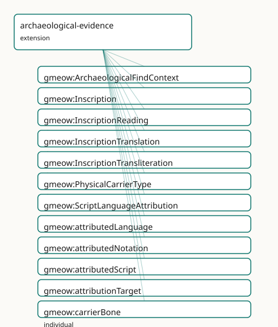

<!-- GENERATED by gmeow ontology-docs. DO NOT EDIT. Source hash: c99d8d50c0344040. -->

# GMEOW Archaeological Evidence Module

- **IRI:** <https://blackcatinformatics.ca/gmeow/slices/archaeological-evidence>
- **Tier:** extension
- **[`Group`](../reference/classes/gmeow-Group.md):** extensions

## What This Slice Covers

This slice owns 37 terms and contributes 15 mapping or projection rows. Use it when its terms match the native fact you want to preserve; use the linkage tables to see how those facts leave GMEOW for consumer vocabularies.

## Dependencies

- [`gmeow:slices/events`](events.md)
- [`gmeow:slices/kernel`](kernel.md)
- [`gmeow:slices/language`](language.md)
- [`gmeow:slices/observations`](observations.md)
- [`gmeow:slices/places`](places.md)
- [`gmeow:slices/temporal`](temporal.md)

## Consumers

- [`Inscription`](../reference/classes/gmeow-Inscription.md) readings and find contexts; the languages stress corpus.

## Local Map



## Terms

### Classes

| Term | Label | Definition |
|---|---|---|
| [`gmeow:ArchaeologicalFindContext`](../reference/classes/gmeow-ArchaeologicalFindContext.md) | Archaeological Find Context | A reified find context binding a physical carrier to its stratigraphic unit, find-spot, excavation or documentation event, and dating evidence. A single carrie... |
| [`gmeow:Inscription`](../reference/classes/gmeow-Inscription.md) | Inscription | The sign-bearing content or mark on a physical carrier — a text, sequence of signs, or symbolic marking that is informationally distinct from the material obje... |
| [`gmeow:InscriptionReading`](../reference/classes/gmeow-InscriptionReading.md) | Inscription Reading | A scholarly reading of an inscription — the Observation that produces a LexicalForm from a sign-bearing feature. The reading is a standpoint-scoped claim, not... |
| [`gmeow:InscriptionTranslation`](../reference/classes/gmeow-InscriptionTranslation.md) | Inscription Translation | A translation of an inscription into another language — an Observation that produces a LexicalForm representing the meaning of the source inscription in a targ... |
| [`gmeow:InscriptionTransliteration`](../reference/classes/gmeow-InscriptionTransliteration.md) | Inscription Transliteration | A transliteration of an inscription into another script — an Observation that maps sign sequences from one writing system to another, producing a LexicalForm.... |
| [`gmeow:PhysicalCarrierType`](../reference/classes/gmeow-PhysicalCarrierType.md) | Physical Carrier Type | The archaeological or cultural-heritage classification of a physical object that bears inscriptions, marks, or signs — a value vocabulary (individuals, never s... |
| [`gmeow:ScriptLanguageAttribution`](../reference/classes/gmeow-ScriptLanguageAttribution.md) | Script Language Attribution | A standpoint-scoped claim assigning a language, writing system, or notation system to an inscription. Handles disputed, uncertain, and undeciphered cases: an u... |

### Properties

| Term | Label | Definition |
|---|---|---|
| [`gmeow:attributedLanguage`](../reference/properties/gmeow-attributedLanguage.md) | attributed language | The language assigned to an inscription by a script/language attribution. Non-functional: competing language assignments from different standpoints coexist (Pr... |
| [`gmeow:attributedNotation`](../reference/properties/gmeow-attributedNotation.md) | attributed notation | The notation system assigned to an undeciphered or symbol-classified inscription. Non-functional: used when the inscription is not yet linked to a known langua... |
| [`gmeow:attributedScript`](../reference/properties/gmeow-attributedScript.md) | attributed script | The writing system assigned to an inscription by a script/language attribution. Non-functional: competing script assignments coexist ([Principle 9](https://github.com/Blackcat-Informatics/gmeow-ontology/blob/main/CONSTITUTION.md#principle-9)). |
| [`gmeow:attributionTarget`](../reference/properties/gmeow-attributionTarget.md) | attribution target | The inscription being classified by a script/language attribution. Functional per relator: one target inscription per ScriptLanguageAttribution. |
| [`gmeow:carrierInscription`](../reference/properties/gmeow-carrierInscription.md) | carrier inscription | The inscription(s) borne by a physical carrier. Non-functional: a carrier may bear multiple inscriptions (e.g. a tablet with text on both sides, or a wall with... |
| [`gmeow:carrierType`](../reference/properties/gmeow-carrierType.md) | carrier type | The archaeological or cultural-heritage classification of a physical carrier — a value vocabulary individual from [`gmeow:PhysicalCarrierType`](../reference/classes/gmeow-PhysicalCarrierType.md). Non-functional: a... |
| [`gmeow:findContextDating`](../reference/properties/gmeow-findContextDating.md) | find context dating | The temporal measurement(s) assigned to a carrier's find context — radiocarbon, stratigraphic correlation, terminus post quem, etc. Non-functional: multiple da... |
| [`gmeow:findContextEvent`](../reference/properties/gmeow-findContextEvent.md) | find context event | The excavation, survey, or documentation event during which a carrier was discovered or recorded. Non-functional: a carrier may be rediscovered or re-documente... |
| [`gmeow:findContextPlace`](../reference/properties/gmeow-findContextPlace.md) | find context place | The find-spot or locus where a carrier was discovered. Non-functional: a carrier may be associated with multiple place claims (e.g. ancient find-spot vs modern... |
| [`gmeow:findContextStratigraphy`](../reference/properties/gmeow-findContextStratigraphy.md) | find context stratigraphy | The stratigraphic unit or layer associated with a carrier's find context. Range is [`gmeow:Entity`](../reference/classes/gmeow-Entity.md) (opaque reference) because general stratigraphic domain modelin... |
| [`gmeow:findContextTarget`](../reference/properties/gmeow-findContextTarget.md) | find context target | The physical carrier whose find context is being described. Functional per relator: one target carrier per ArchaeologicalFindContext. |
| [`gmeow:inscriptionCarrier`](../reference/properties/gmeow-inscriptionCarrier.md) | inscription carrier | The physical object that bears an inscription. Functional: an inscription is borne by exactly one carrier (if a copy exists on another carrier, it is a distinc... |
| [`gmeow:readingOf`](../reference/properties/gmeow-readingOf.md) | reading of | The inscription that a reading observes. Functional per relator: one source inscription per InscriptionReading. |
| [`gmeow:readingResult`](../reference/properties/gmeow-readingResult.md) | reading result | The lexical form(s) produced by a reading. Non-functional: a single reading may yield multiple coexisting forms (e.g. ambiguous or damaged signs interpreted di... |
| [`gmeow:translationOf`](../reference/properties/gmeow-translationOf.md) | translation of | The inscription that a translation renders into another language. Functional per relator: one source inscription per InscriptionTranslation. |
| [`gmeow:translationResult`](../reference/properties/gmeow-translationResult.md) | translation result | The lexical form(s) produced by a translation. Non-functional: competing translations of the same inscription coexist without privilege ([Principle 9](https://github.com/Blackcat-Informatics/gmeow-ontology/blob/main/CONSTITUTION.md#principle-9)). |
| [`gmeow:transliterationOf`](../reference/properties/gmeow-transliterationOf.md) | transliteration of | The inscription that a transliteration maps into another script. Functional per relator: one source inscription per InscriptionTransliteration. |
| [`gmeow:transliterationResult`](../reference/properties/gmeow-transliterationResult.md) | transliteration result | The lexical form(s) produced by a transliteration. Non-functional: competing transliteration schemes may produce different forms for the same inscription, and... |

### Individuals

| Term | Label | Definition |
|---|---|---|
| [`gmeow:carrierBone`](../reference/individuals/gmeow-carrierBone.md) | bone | A bone object or fragment bearing carved or inked signs. |
| [`gmeow:carrierCoin`](../reference/individuals/gmeow-carrierCoin.md) | coin | A metallic disc bearing stamped legends, symbols, or portraits. |
| [`gmeow:carrierManuscript`](../reference/individuals/gmeow-carrierManuscript.md) | manuscript | A handwritten document on parchment, papyrus, paper, or other flexible support. |
| [`gmeow:carrierMetal`](../reference/individuals/gmeow-carrierMetal.md) | metal | A metal object or fragment bearing inscribed, cast, or stamped text. |
| [`gmeow:carrierOstracon`](../reference/individuals/gmeow-carrierOstracon.md) | ostracon | A potsherd or stone flake bearing ink or incised writing. |
| [`gmeow:carrierPapyrus`](../reference/individuals/gmeow-carrierPapyrus.md) | papyrus | A sheet of papyrus bearing written or drawn content. |
| [`gmeow:carrierPotterySherd`](../reference/individuals/gmeow-carrierPotterySherd.md) | pottery sherd | A fragment of ceramic vessel, often bearing painted or incised marks. |
| [`gmeow:carrierSeal`](../reference/individuals/gmeow-carrierSeal.md) | seal | A stamped or engraved object used to impress a design or text into clay or wax. |
| [`gmeow:carrierStela`](../reference/individuals/gmeow-carrierStela.md) | stela | An upright stone slab or pillar bearing inscribed text or relief. |
| [`gmeow:carrierTablet`](../reference/individuals/gmeow-carrierTablet.md) | tablet | A flat slab of clay, stone, or wax bearing inscribed text. |
| [`gmeow:carrierWallInscription`](../reference/individuals/gmeow-carrierWallInscription.md) | wall inscription | Text or signs carved, painted, or affixed to a wall or other architectural surface. |
| [`gmeow:carrierWood`](../reference/individuals/gmeow-carrierWood.md) | wood | A wooden object or fragment bearing inscribed, painted, or burned text. |

## Linkages

- **Rows:** 15
- **Projection profiles:** -
- **External vocabularies:** `crm`, `crmarc`, `crminf`, `crmsci`, `oa`, `prov`

| Source | Kind | Profile | Predicate/Relation | Target | Evidence |
|---|---|---|---|---|---|
| [`gmeow:ArchaeologicalFindContext`](../reference/classes/gmeow-ArchaeologicalFindContext.md) | equivalence | `-` | [skos:closeMatch](http://www.w3.org/2004/02/skos/core#closeMatch) | [crmarc:A2_Stratigraphic_Volume_Unit](http://www.cidoc-crm.org/crmarchaeo/A2_Stratigraphic_Volume_Unit) | `gmeow-archaeological-evidence.sssom.tsv`; `gmeow:eqArch005`; confidence 0.7 |
| [`gmeow:Inscription`](../reference/classes/gmeow-Inscription.md) | equivalence | `-` | [skos:closeMatch](http://www.w3.org/2004/02/skos/core#closeMatch) | [crm:E34_Inscription](http://www.cidoc-crm.org/cidoc-crm/E34_Inscription) | `gmeow-archaeological-evidence.sssom.tsv`; `gmeow:eqArch001`; confidence 0.95 |
| [`gmeow:InscriptionReading`](../reference/classes/gmeow-InscriptionReading.md) | equivalence | `-` | [skos:closeMatch](http://www.w3.org/2004/02/skos/core#closeMatch) | [crmsci:S4_Observation](http://www.cidoc-crm.org/extensions/crmsci/S4_Observation) | `gmeow-archaeological-evidence.sssom.tsv`; `gmeow:eqArch007`; confidence 0.85 |
| [`gmeow:InscriptionReading`](../reference/classes/gmeow-InscriptionReading.md) | equivalence | `-` | [skos:closeMatch](http://www.w3.org/2004/02/skos/core#closeMatch) | [oa:Annotation](http://www.w3.org/ns/oa#Annotation) | `gmeow-archaeological-evidence.sssom.tsv`; `gmeow:eqArch014`; confidence 0.75 |
| [`gmeow:InscriptionReading`](../reference/classes/gmeow-InscriptionReading.md) | equivalence | `-` | [skos:closeMatch](http://www.w3.org/2004/02/skos/core#closeMatch) | [prov:Activity](http://www.w3.org/ns/prov#Activity) | `gmeow-archaeological-evidence.sssom.tsv`; `gmeow:eqArch012`; confidence 0.85 |
| [`gmeow:InscriptionTranslation`](../reference/classes/gmeow-InscriptionTranslation.md) | equivalence | `-` | [skos:closeMatch](http://www.w3.org/2004/02/skos/core#closeMatch) | [crmsci:S4_Observation](http://www.cidoc-crm.org/extensions/crmsci/S4_Observation) | `gmeow-archaeological-evidence.sssom.tsv`; `gmeow:eqArch009`; confidence 0.85 |
| [`gmeow:InscriptionTranslation`](../reference/classes/gmeow-InscriptionTranslation.md) | equivalence | `-` | [skos:closeMatch](http://www.w3.org/2004/02/skos/core#closeMatch) | [oa:Annotation](http://www.w3.org/ns/oa#Annotation) | `gmeow-archaeological-evidence.sssom.tsv`; `gmeow:eqArch016`; confidence 0.75 |
| [`gmeow:InscriptionTransliteration`](../reference/classes/gmeow-InscriptionTransliteration.md) | equivalence | `-` | [skos:closeMatch](http://www.w3.org/2004/02/skos/core#closeMatch) | [crmsci:S4_Observation](http://www.cidoc-crm.org/extensions/crmsci/S4_Observation) | `gmeow-archaeological-evidence.sssom.tsv`; `gmeow:eqArch008`; confidence 0.85 |
| [`gmeow:InscriptionTransliteration`](../reference/classes/gmeow-InscriptionTransliteration.md) | equivalence | `-` | [skos:closeMatch](http://www.w3.org/2004/02/skos/core#closeMatch) | [oa:Annotation](http://www.w3.org/ns/oa#Annotation) | `gmeow-archaeological-evidence.sssom.tsv`; `gmeow:eqArch015`; confidence 0.75 |
| [`gmeow:ScriptLanguageAttribution`](../reference/classes/gmeow-ScriptLanguageAttribution.md) | equivalence | `-` | [skos:closeMatch](http://www.w3.org/2004/02/skos/core#closeMatch) | [crminf:I1_Argumentation](http://www.ics.forth.gr/isl/CRMinf/I1_Argumentation) | `gmeow-archaeological-evidence.sssom.tsv`; `gmeow:eqArch010`; confidence 0.9 |
| [`gmeow:ScriptLanguageAttribution`](../reference/classes/gmeow-ScriptLanguageAttribution.md) | equivalence | `-` | [skos:closeMatch](http://www.w3.org/2004/02/skos/core#closeMatch) | [crminf:I5_Inference_Making](http://www.ics.forth.gr/isl/CRMinf/I5_Inference_Making) | `gmeow-archaeological-evidence.sssom.tsv`; `gmeow:eqArch011`; confidence 0.8 |
| [`gmeow:carrierInscription`](../reference/properties/gmeow-carrierInscription.md) | equivalence | `-` | [skos:closeMatch](http://www.w3.org/2004/02/skos/core#closeMatch) | [crm:P128_carries](http://www.cidoc-crm.org/cidoc-crm/P128_carries) | `gmeow-archaeological-evidence.sssom.tsv`; `gmeow:eqArch004`; confidence 0.9 |
| [`gmeow:findContextStratigraphy`](../reference/properties/gmeow-findContextStratigraphy.md) | equivalence | `-` | [skos:closeMatch](http://www.w3.org/2004/02/skos/core#closeMatch) | [crmarc:A2_Stratigraphic_Volume_Unit](http://www.cidoc-crm.org/crmarchaeo/A2_Stratigraphic_Volume_Unit) | `gmeow-archaeological-evidence.sssom.tsv`; `gmeow:eqArch006`; confidence 0.75 |
| [`gmeow:inscriptionCarrier`](../reference/properties/gmeow-inscriptionCarrier.md) | equivalence | `-` | [skos:closeMatch](http://www.w3.org/2004/02/skos/core#closeMatch) | [crm:P128i_is_carried_by](http://www.cidoc-crm.org/cidoc-crm/P128i_is_carried_by) | `gmeow-archaeological-evidence.sssom.tsv`; `gmeow:eqArch003`; confidence 0.9 |
| [`gmeow:readingResult`](../reference/properties/gmeow-readingResult.md) | equivalence | `-` | [skos:closeMatch](http://www.w3.org/2004/02/skos/core#closeMatch) | [prov:generated](http://www.w3.org/ns/prov#generated) | `gmeow-archaeological-evidence.sssom.tsv`; `gmeow:eqArch013`; confidence 0.8 |

## Guide

<!-- SPDX-FileCopyrightText: 2026 Blackcat Informatics® Inc. <paudley@blackcatinformatics.ca> -->
<!-- SPDX-License-Identifier: CC-BY-4.0 -->

# Archaeological & Cultural-Heritage Evidence — modelling & interoperability guide

Archaeological objects are **evidence carriers**, not language facts by themselves.
The physical carrier, the visible marks, the observation/documentation event, the
reading, the transliteration, the translation, the dating evidence, the
stratigraphic / find context, and the linguistic interpretation must remain
**separable claims** ([Principle 9](https://github.com/Blackcat-Informatics/gmeow-ontology/blob/main/CONSTITUTION.md#principle-9)).

This guide explains the language-facing hooks that connect GMEOW's lexicon,
attestation, and etymology layers to archaeological and cultural-heritage evidence.
General archaeological domain modeling (excavation units, stratigraphic interfaces,
artifact typology) is deferred to.

---

## The layer stack

| Layer | GMEOW construct | Example |
|-------|-----------------|---------|
| **Physical carrier** | [`gmeow:PhysicalObject`](../reference/classes/gmeow-PhysicalObject.md) + [`gmeow:carrierType`](../reference/properties/gmeow-carrierType.md) | A clay tablet, an ostracon, a seal impression |
| **Sign-bearing feature** | [`gmeow:Inscription`](../reference/classes/gmeow-Inscription.md) | The cuneiform text on the tablet |
| **Documentation event** | [`gmeow:Observation`](../reference/classes/gmeow-Observation.md) (universal stack) | The excavation, photography, or museum cataloguing |
| **Reading** | [`gmeow:InscriptionReading`](../reference/classes/gmeow-InscriptionReading.md) → [`gmeow:LexicalForm`](../reference/classes/gmeow-LexicalForm.md) | "𒀭" read as the sign AN |
| **Transliteration** | [`gmeow:InscriptionTransliteration`](../reference/classes/gmeow-InscriptionTransliteration.md) → [`gmeow:LexicalForm`](../reference/classes/gmeow-LexicalForm.md) | "an" in Latin script |
| **Translation** | [`gmeow:InscriptionTranslation`](../reference/classes/gmeow-InscriptionTranslation.md) → [`gmeow:LexicalForm`](../reference/classes/gmeow-LexicalForm.md) | "god" in English |
| **Dating evidence** | [`gmeow:TemporalMeasurement`](../reference/classes/gmeow-TemporalMeasurement.md) | Stratigraphic correlation, 3200 ± 100 BP |
| **Find context** | [`gmeow:ArchaeologicalFindContext`](../reference/classes/gmeow-ArchaeologicalFindContext.md) | Trench 3, Layer 7, Uruk site |
| **Linguistic interpretation** | [`gmeow:ScriptLanguageAttribution`](../reference/classes/gmeow-ScriptLanguageAttribution.md) | Sumerian language, cuneiform script |

Each layer is a **distinct node** in the graph. No single layer asserts truth for
another. A [`PhysicalObject`](../reference/classes/gmeow-PhysicalObject.md) does not "have a language"; an [`Inscription`](../reference/classes/gmeow-Inscription.md) does not
"have a date"; a `Reading` does not "have a find-spot". These are all mediated by
reified [`Observation`](../reference/classes/gmeow-Observation.md) subclasses that carry [`gmeow:vantage`](../reference/properties/gmeow-vantage.md), [`gmeow:confidence`](../reference/properties/gmeow-confidence.md),
[`gmeow:hasDeterminacy`](../reference/properties/gmeow-hasDeterminacy.md), and [`gmeow:accordingTo`](../reference/properties/gmeow-accordingTo.md).

---

## Critical anti-pattern

**Never assert "this object is in language X" as unqualified truth when the
evidence is actually "scholar/team Y reads this mark as X, with confidence Z, in
context C."**

Bad (flat, truth-asserting):

```turtle
# WRONG — collapses carrier, inscription, and interpretation into one claim
ex:tablet1 ex:claimedLanguage ex:sumerian .
```

Good (layered, standpoint-scoped):

```turtle
ex:tablet1 a gmeow:PhysicalObject ;
    gmeow:carrierType gmeow:carrierTablet .

ex:inscription1 a gmeow:Inscription ;
    gmeow:inscriptionCarrier ex:tablet1 .

ex:attribution1 a gmeow:ScriptLanguageAttribution ;
    gmeow:attributionTarget ex:inscription1 ;
    gmeow:attributedLanguage ex:sumerian ;
    gmeow:attributedScript ex:cuneiform ;
    gmeow:vantage ex:scholarA ;
    gmeow:confidence 0.85 ;
    gmeow:hasDeterminacy gmeow:determinacyCrisp .
```

The first form is a **category error**: a physical object does not have a language.
The second form keeps every claim **attributed, dated, and confidence-weighted**
([Principle 9](https://github.com/Blackcat-Informatics/gmeow-ontology/blob/main/CONSTITUTION.md#principle-9)).

---

## Competing claims coexist

Two scholars may read the same inscription differently, assign it to different
languages, or date it to different periods. In GMEOW, these are **co-existing
observations**, not edit-war candidates.

```turtle
ex:readingA a gmeow:InscriptionReading ;
    gmeow:readingOf ex:inscription1 ;
    gmeow:readingResult ex:formA ;
    gmeow:vantage ex:scholarA ;
    gmeow:confidence 0.75 .

ex:readingB a gmeow:InscriptionReading ;
    gmeow:readingOf ex:inscription1 ;
    gmeow:readingResult ex:formB ;
    gmeow:vantage ex:scholarB ;
    gmeow:confidence 0.60 .
```

Both readings are retained. Projection layers may **select** one for a specific
consumer, but the canonical source never erases the other ([Principle 10](https://github.com/Blackcat-Informatics/gmeow-ontology/blob/main/CONSTITUTION.md#principle-10):
suppression via [`gmeow:displayable`](../reference/properties/gmeow-displayable.md) false, never deletion).

---

## Undeciphered and uncertain cases

An inscription in an undeciphered script (Linear A, Rongorongo, proto-cuneiform)
carries a [`gmeow:ScriptLanguageAttribution`](../reference/classes/gmeow-ScriptLanguageAttribution.md) with [`gmeow:attributedNotation`](../reference/properties/gmeow-attributedNotation.md) but
no [`gmeow:attributedLanguage`](../reference/properties/gmeow-attributedLanguage.md) or [`gmeow:attributedScript`](../reference/properties/gmeow-attributedScript.md). Its determinacy is
[`gmeow:determinacyDisputed`](../reference/individuals/gmeow-determinacyDisputed.md) and its confidence is low.

```turtle
ex:linearA a gmeow:NotationSystem .

ex:undecipheredAttribution a gmeow:ScriptLanguageAttribution ;
    gmeow:attributionTarget ex:inscription2 ;
    gmeow:attributedNotation ex:linearA ;
    gmeow:hasDeterminacy gmeow:determinacyDisputed ;
    gmeow:vantage ex:scholarC ;
    gmeow:confidence 0.40 .
```

There is **no canonical winner** and no requirement to assign a language. The
notation system stands on its own as a first-class [`gmeow:NotationSystem`](../reference/classes/gmeow-NotationSystem.md).

---

## Hooks into the lexicon layer

### UsageAttestation → PhysicalObject

The [`gmeow:attestedOnCarrier`](../reference/properties/gmeow-attestedOnCarrier.md) property links a [`gmeow:UsageAttestation`](../reference/classes/gmeow-UsageAttestation.md) to a
[`gmeow:PhysicalObject`](../reference/classes/gmeow-PhysicalObject.md), creating the bridge from lexical evidence to
archaeological evidence.

```turtle
ex:attestation a gmeow:UsageAttestation ;
    gmeow:attestedForm ex:lexicalForm ;
    gmeow:attestedInSource ex:publishedEdition ;
    gmeow:attestedOnCarrier ex:tablet1 ;
    gmeow:confidence 0.90 .
```

### EtymologicalDerivation → inscription evidence

An etymological claim may cite a [`gmeow:UsageAttestation`](../reference/classes/gmeow-UsageAttestation.md) (or the
[`gmeow:InscriptionReading`](../reference/classes/gmeow-InscriptionReading.md) directly) as [`gmeow:derivationEvidence`](../reference/properties/gmeow-derivationEvidence.md).

```turtle
ex:derivation a gmeow:EtymologicalDerivation ;
    gmeow:derivationSource ex:ancestorWord ;
    gmeow:derivationTarget ex:descendantWord ;
    gmeow:derivationKind gmeow:derivationBorrowing ;
    gmeow:derivationEvidence ex:attestation ;
    gmeow:confidence 0.65 .
```

### LanguageState → inscription

A [`gmeow:LanguageState`](../reference/classes/gmeow-LanguageState.md) may describe the language of an inscription at a
particular historical moment, reusing the existing language-state machinery.

---

## Projection lossy drops

When projecting the archaeological evidence stack to surface vocabularies,
the following information is **deliberately dropped** ([Principle 4](https://github.com/Blackcat-Informatics/gmeow-ontology/blob/main/CONSTITUTION.md#principle-4)):

| Target vocabulary | What is lost |
|-------------------|--------------|
| **[CIDOC-CRM](../external/ontologies.md#target-crm)** | Standpoint, confidence, determinacy, and competing claims collapse to a single E13 Attribute Assignment or E34 Inscription. The [`gmeow:Inscription`](../reference/classes/gmeow-Inscription.md) → E34 mapping loses the separation between InformationObject and PhysicalObject when the consumer does not distinguish them. |
| **CRMarchaeo** | Stratigraphic detail below the A2 level is dropped; excavation events lose their observer standpoints. |
| **CRMsci** | S4 Observation loses the reified relator structure; the result is flattened to `s15:has_result`. |
| **[CRMinf](../external/ontologies.md#target-crminf)** | I1 Argumentation preserves the dispute structure, but the temporal scope and find context are lost. I2 Belief carries the confidence, but not the stratigraphic provenance. |
| **[PROV-O](../external/ontologies.md#target-prov)** | [`prov:Activity`](http://www.w3.org/ns/prov#Activity) flattens the Observation relator; [`prov:Entity`](http://www.w3.org/ns/prov#Entity) for the inscription loses its carrier link. The standpoint becomes [`prov:wasAssociatedWith`](http://www.w3.org/ns/prov#wasAssociatedWith) without the modal force. |
| **Web Annotation** | [`oa:Annotation`](http://www.w3.org/ns/oa#Annotation) preserves target + body, but drops confidence, determinacy, dating, find context, and competing claims (only one annotation per target→body pair). |
| **AO-Cat / ARIADNE** | Archaeological object typology is preserved, but language/script attribution, transliteration, and translation are out of scope for these catalogues. |
| **schema.org** | No suitable target for inscription, reading, or transliteration. The closest is [`schema:CreativeWork`](https://schema.org/CreativeWork) for the published edition, which loses all archaeological context. |

---

## Alignment summary

| GMEOW term | Closest external term | Confidence | Note |
|------------|----------------------|------------|------|
| [`gmeow:Inscription`](../reference/classes/gmeow-Inscription.md) | [`crm:E34_Inscription`](http://www.cidoc-crm.org/cidoc-crm/E34_Inscription) | 0.95 | GMEOW is broader (marks, symbols, non-linguistic signs) |
| [`gmeow:PhysicalObject`](../reference/classes/gmeow-PhysicalObject.md) | [`crm:E19_Physical_Object`](http://www.cidoc-crm.org/cidoc-crm/E19_Physical_Object) | 0.90 | E24 is narrower (human-made only) |
| [`gmeow:inscriptionCarrier`](../reference/properties/gmeow-inscriptionCarrier.md) | [`crm:P128_carries`](http://www.cidoc-crm.org/cidoc-crm/P128_carries) | 0.90 | Inverse: [`crm:P128i_is_carried_by`](http://www.cidoc-crm.org/cidoc-crm/P128i_is_carried_by) |
| [`gmeow:InscriptionReading`](../reference/classes/gmeow-InscriptionReading.md) | [`crmsci:S4_Observation`](http://www.cidoc-crm.org/extensions/crmsci/S4_Observation) | 0.85 | Also close to [`crm:E13_Attribute_Assignment`](http://www.cidoc-crm.org/cidoc-crm/E13_Attribute_Assignment) |
| [`gmeow:ScriptLanguageAttribution`](../reference/classes/gmeow-ScriptLanguageAttribution.md) | [`crminf:I1_Argumentation`](http://www.ics.forth.gr/isl/CRMinf/I1_Argumentation) | 0.90 | I5 Inference Making when inferred from evidence |
| [`gmeow:ArchaeologicalFindContext`](../reference/classes/gmeow-ArchaeologicalFindContext.md) | [`crmarc:A2_Stratigraphic_Volume_Unit`](http://www.cidoc-crm.org/crmarchaeo/A2_Stratigraphic_Volume_Unit) | 0.70 | Loose: A2 is spatial, FindContext is a claim |
| [`gmeow:InscriptionReading`](../reference/classes/gmeow-InscriptionReading.md) | [`prov:Activity`](http://www.w3.org/ns/prov#Activity) | 0.85 | Reading generates [`prov:Entity`](http://www.w3.org/ns/prov#Entity) (LexicalForm) |
| [`gmeow:InscriptionReading`](../reference/classes/gmeow-InscriptionReading.md) | [`oa:Annotation`](http://www.w3.org/ns/oa#Annotation) | 0.75 | Lossy: drops confidence, determinacy, context |

---

## Tests

- `tests/test_archaeological_evidence.py` — structural and DL-safety guards.
- `tests/fixtures/shapes/archaeological-evidence.ttl` — SHACL-valid instance data.
- `tests/fixtures/coverage/archaeological-evidence.ttl` — competency-test coverage data.
