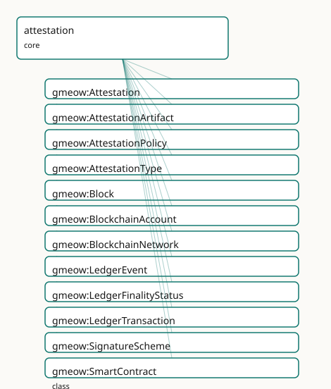

<!-- GENERATED by gmeow ontology-docs. DO NOT EDIT. -->

# GMEOW Attestation Module

- **IRI:** <https://blackcatinformatics.ca/gmeow/slices/attestation>
- **Tier:** core
- **[`Group`](../reference/classes/gmeow-Group.md):** core

## What This Slice Covers

This slice owns 75 terms and contributes 20 mapping or projection rows. Use it when its terms match the native fact you want to preserve; use the linkage tables to see how those facts leave GMEOW for consumer vocabularies.

## Dependencies

- [`gmeow:slices/events`](events.md)
- [`gmeow:slices/kernel`](kernel.md)
- [`gmeow:slices/observations`](observations.md)
- [`gmeow:slices/provenance`](provenance.md)
- [`gmeow:slices/trust`](trust.md)

## Consumers

- Signed-claim envelopes for trust, software releases (SLSA/Sigstore), and GTS COSE signing.

## Local Map



## Examples

### Software Release

- **Source:** [`slices/core/attestation/examples/software-release.ttl`](https://github.com/Blackcat-Informatics/gmeow-ontology/blob/main/slices/core/attestation/examples/software-release.ttl)
- **GMEOW terms:** [`gmeow:Attestation`](../reference/classes/gmeow-Attestation.md), [`gmeow:AttestationArtifact`](../reference/classes/gmeow-AttestationArtifact.md), [`gmeow:CreativeWork`](../reference/classes/gmeow-CreativeWork.md), [`gmeow:CryptographicSignature`](../reference/classes/gmeow-CryptographicSignature.md), [`gmeow:SoftwareAgent`](../reference/classes/gmeow-SoftwareAgent.md), [`gmeow:VerificationResult`](../reference/classes/gmeow-VerificationResult.md), [`gmeow:artifactMediaType`](../reference/properties/gmeow-artifactMediaType.md), [`gmeow:attestationArtifact`](../reference/properties/gmeow-attestationArtifact.md), [`gmeow:attestationType`](../reference/properties/gmeow-attestationType.md), [`gmeow:attestationTypeSLSAProvenance`](../reference/individuals/gmeow-attestationTypeSLSAProvenance.md)
- **External prefixes:** `xsd`

```turtle
# SPDX-FileCopyrightText: 2026 Blackcat Informatics® Inc. <paudley@blackcatinformatics.ca>
# SPDX-License-Identifier: CC-BY-4.0
#
# Worked example: a supply-chain attestation . A gmeow:Attestation binds an
# gmeow:attester (who vouches) to an gmeow:attestedSubject (what is vouched for)
# under an gmeow:attestationType drawn from the open vocabulary of real formats
# (SLSA provenance, in-toto, DSSE, C2PA, verifiable credential, …). Here a CI
# pipeline issues a SLSA-provenance attestation over a release bundle, carries
# the signed artifact, and a relying party records a gmeow:VerificationResult —
# the attestation is a claim; verifying it is a separate, recorded act.
@prefix gmeow: <https://blackcatinformatics.ca/gmeow/> .
@prefix ex:    <https://blackcatinformatics.ca/gmeow/examples/attestation/> .
@prefix xsd:   <http://www.w3.org/2001/XMLSchema#> .

ex:ciSystem a gmeow:SoftwareAgent ; gmeow:name "Acme CI pipeline"@en .
ex:relyingParty a gmeow:SoftwareAgent ; gmeow:name "Production deploy gate"@en .

ex:release a gmeow:CreativeWork ;
    gmeow:title         "myapp 1.0.0 release bundle"@en ;
    gmeow:contentDigest "sha256:abc123def4567890abc123def4567890abc123def4567890abc123def4567890" .

# --- The attestation: the CI system vouches for the release as SLSA provenance.
ex:slsaAttestation a gmeow:Attestation ;
    gmeow:attester           ex:ciSystem ;
    gmeow:attestedSubject    ex:release ;
    gmeow:attestationType    gmeow:attestationTypeSLSAProvenance ;
    gmeow:issuedAt           "2026-06-14T12:00:00Z"^^xsd:dateTime ;
    gmeow:attestationArtifact ex:artifact ;
    gmeow:hasSignature       ex:sig ;
    gmeow:verificationResult ex:verifyResult .

ex:artifact a gmeow:AttestationArtifact ;
    gmeow:artifactMediaType "application/vnd.in-toto+json" ;
    gmeow:contentDigest     "sha256:def456abc1237890def456abc1237890def456abc1237890def456abc1237890" .

ex:sig a gmeow:CryptographicSignature ;
    gmeow:signatureAlgorithm "ecdsa-p256" ;
    gmeow:signedBy           ex:ciSystem .

# --- Verification is its own recorded act: the deploy gate checked the chain.
ex:verifyResult a gmeow:VerificationResult ;
    gmeow:hasVerificationStatus gmeow:verificationStatusVerified ;
    gmeow:verifiedBy            ex:relyingParty .
```

## Terms

### Classes

| Term | Label | Definition |
|---|---|---|
| [`gmeow:Attestation`](../reference/classes/gmeow-Attestation.md) | Attestation | A reified assertion envelope that an attester vouches for a claim, artifact, identity binding, process, quality report, or ledger claim under a specific policy... |
| [`gmeow:AttestationArtifact`](../reference/classes/gmeow-AttestationArtifact.md) | Attestation Artifact | A concrete carrier of an attestation — in-toto JSON, SLSA provenance, W3C Verifiable Credential, DSSE envelope, C2PA manifest, EAT token, signed RDF graph, SCI... |
| [`gmeow:AttestationPolicy`](../reference/classes/gmeow-AttestationPolicy.md) | Attestation Policy | The policy or framework under which an attestation was issued — a value vocabulary (individuals, never subclasses). Open-ended; specific policies are minted as... |
| [`gmeow:AttestationType`](../reference/classes/gmeow-AttestationType.md) | Attestation Type | The kind of attestation being made — a value vocabulary (individuals, never subclasses). Distinguishes SLSA provenance, in-toto attestation, VC, DSSE envelope,... |
| [`gmeow:Block`](../reference/classes/gmeow-Block.md) | Block | A block of transactions on a distributed ledger or blockchain. |
| [`gmeow:BlockchainAccount`](../reference/classes/gmeow-BlockchainAccount.md) | Blockchain Account | An address-controlled account on a blockchain or distributed ledger — the entity that holds assets, signs transactions, or controls a smart contract. Aligns to... |
| [`gmeow:BlockchainNetwork`](../reference/classes/gmeow-BlockchainNetwork.md) | Blockchain Network | A blockchain network identified by a chain identifier (e.g. CAIP-2 chainId). |
| [`gmeow:LedgerEvent`](../reference/classes/gmeow-LedgerEvent.md) | Ledger Event | An event emitted by a smart contract or recorded on a ledger — a log entry, oracle callback, or bridge message. |
| [`gmeow:LedgerFinalityStatus`](../reference/classes/gmeow-LedgerFinalityStatus.md) | Ledger Finality Status | The finality state of a ledger transaction or block — a value vocabulary (individuals, never subclasses). |
| [`gmeow:LedgerTransaction`](../reference/classes/gmeow-LedgerTransaction.md) | Ledger Transaction | A transaction recorded on a distributed ledger or blockchain — the information-object representation of the payload, not the on-chain bytes themselves. |
| [`gmeow:SignatureScheme`](../reference/classes/gmeow-SignatureScheme.md) | Signature Scheme | The cryptographic signature scheme used — a value vocabulary (individuals, never subclasses). Distinct from [`gmeow:KeyScheme`](../reference/classes/gmeow-KeyScheme.md): a key scheme names the key format... |
| [`gmeow:SmartContract`](../reference/classes/gmeow-SmartContract.md) | Smart Contract | A deployed program on a blockchain or distributed ledger, identified by a contract address. |
| [`gmeow:TransparencyLogEntry`](../reference/classes/gmeow-TransparencyLogEntry.md) | Transparency Log Entry | An append-only registry evidence record such as a Rekor entry, SCITT receipt, certificate-transparency log entry, or timestamp/notary log entry. Proves inclusi... |
| [`gmeow:VerificationActivity`](../reference/classes/gmeow-VerificationActivity.md) | Verification Activity | An activity that checks a signature, attestation, artifact, or ledger inclusion proof — performed by a verifier agent or software. The outcome is a gmeow:Verif... |
| [`gmeow:VerificationResult`](../reference/classes/gmeow-VerificationResult.md) | Verification Result | An information object recording the outcome of a verification activity — verified, failed, unverified, expired, revoked, policy-failed, finality-pending, etc.... |
| [`gmeow:VerificationStatus`](../reference/classes/gmeow-VerificationStatus.md) | Verification Status | The outcome status of a verification result — a value vocabulary (individuals, never subclasses). |

### Properties

| Term | Label | Definition |
|---|---|---|
| [`gmeow:artifactMediaType`](../reference/properties/gmeow-artifactMediaType.md) | artifact media type | The media type of the attestation artifact's serialization (e.g. application/vnd.in-toto+json, application/vc+ld+json). |
| [`gmeow:attestationArtifact`](../reference/properties/gmeow-attestationArtifact.md) | attestation artifact | The concrete carrier (in-toto JSON, VC, DSSE envelope, C2PA manifest, etc.) that embodies an attestation. Non-functional: an attestation may be carried by mult... |
| [`gmeow:attestationPolicy`](../reference/properties/gmeow-attestationPolicy.md) | attestation policy | The policy under which an attestation was issued — a value vocabulary individual naming the rules or framework the attester followed. Non-functional: competing... |
| [`gmeow:attestationType`](../reference/properties/gmeow-attestationType.md) | attestation type | The type of attestation being made — a value vocabulary individual from [`gmeow:AttestationType`](../reference/classes/gmeow-AttestationType.md). Non-functional: an attestation may carry multiple type tags (e.g... |
| [`gmeow:attestedClaim`](../reference/properties/gmeow-attestedClaim.md) | attested claim | The observation or claim that an attestation vouches for, when the subject of the attestation is itself a claim rather than a bare entity. Non-functional: an a... |
| [`gmeow:attestedSubject`](../reference/properties/gmeow-attestedSubject.md) | attested subject | The entity that an attestation is about — the thing being vouched for. Non-functional: an attestation may concern multiple subjects (e.g. a key↔identity bindin... |
| [`gmeow:attester`](../reference/properties/gmeow-attester.md) | attester | The agent that issued an attestation — the vouching party. Functional within the relator: one attester per Attestation (co-authorship is modelled as multiple A... |
| [`gmeow:blockHash`](../reference/properties/gmeow-blockHash.md) | block hash | The hash of a ledger block. |
| [`gmeow:blockNumber`](../reference/properties/gmeow-blockNumber.md) | block number | The sequential number of a ledger block. |
| [`gmeow:chainId`](../reference/properties/gmeow-chainId.md) | chain id | The chain identifier of a blockchain network (e.g. CAIP-2 chainId, eip155:1). |
| [`gmeow:confirmationDepth`](../reference/properties/gmeow-confirmationDepth.md) | confirmation depth | The number of blocks confirming a transaction or log entry since its inclusion. Domain-free. |
| [`gmeow:contractAddress`](../reference/properties/gmeow-contractAddress.md) | contract address | The address at which a smart contract is deployed. |
| [`gmeow:finalityStatus`](../reference/properties/gmeow-finalityStatus.md) | finality status | The finality status of a ledger transaction or block. Domain-free. |
| [`gmeow:hasAttestation`](../reference/properties/gmeow-hasAttestation.md) | has attestation | Relates an entity to an attestation about it — the inverse of [`gmeow:attestedSubject`](../reference/properties/gmeow-attestedSubject.md). Non-functional: an entity may have many co-existing attestations from diff... |
| [`gmeow:hasSignature`](../reference/properties/gmeow-hasSignature.md) | has signature | Relates an entity, attestation, or artifact to a cryptographic signature over it. Domain-free (universal spine): anything may carry a signature. The message-sp... |
| [`gmeow:hasVerificationStatus`](../reference/properties/gmeow-hasVerificationStatus.md) | has verification status | The categorical outcome of a verification result. Non-functional: a single result may carry multiple status interpretations (e.g. 'verified but expired'). |
| [`gmeow:issuedAt`](../reference/properties/gmeow-issuedAt.md) | issued at | The instant an attestation was issued. Functional: the issue time is constitutive of the attestation's identity. |
| [`gmeow:ledgerInclusionProof`](../reference/properties/gmeow-ledgerInclusionProof.md) | ledger inclusion proof | A cryptographic inclusion proof for a transaction, event, or transparency log entry. Domain-free: applies to LedgerTransaction, LedgerEvent, TransparencyLogEnt... |
| [`gmeow:logEntryIndex`](../reference/properties/gmeow-logEntryIndex.md) | log entry index | The sequential index of the entry within its transparency log. |
| [`gmeow:logEntryUrl`](../reference/properties/gmeow-logEntryUrl.md) | log entry URL | A URL at which the transparency log entry can be retrieved. Non-functional: multiple mirrors may exist. |
| [`gmeow:logIndex`](../reference/properties/gmeow-logIndex.md) | log index | The index of a ledger event within its containing block or transaction. |
| [`gmeow:signatureOf`](../reference/properties/gmeow-signatureOf.md) | signature of | The entity, attestation, or artifact that a cryptographic signature is over — the inverse of [`gmeow:hasSignature`](../reference/properties/gmeow-hasSignature.md). |
| [`gmeow:signatureRecoveryAddress`](../reference/properties/gmeow-signatureRecoveryAddress.md) | signature recovery address | The blockchain address recovered from a signature's recovery data. Domain-free: may apply to CryptographicSignature or BlockchainAccount. |
| [`gmeow:transactionHash`](../reference/properties/gmeow-transactionHash.md) | transaction hash | The hash of a ledger transaction. |
| [`gmeow:transparencyLogEntry`](../reference/properties/gmeow-transparencyLogEntry.md) | transparency log entry | A transparency log entry associated with an attestation. Non-functional: an attestation may have entries in multiple logs. |
| [`gmeow:verificationActivity`](../reference/properties/gmeow-verificationActivity.md) | verification activity | The verification activity performed on an attestation. Non-functional: an attestation may be verified multiple times by different verifiers. |
| [`gmeow:verificationResult`](../reference/properties/gmeow-verificationResult.md) | verification result | The result of a verification activity applied to an attestation. Non-functional: multiple verification results may coexist from different verifiers or at diffe... |
| [`gmeow:verifiedBy`](../reference/properties/gmeow-verifiedBy.md) | verified by | The agent that produced a verification result. Non-functional: joint verification by multiple agents is valid. |

### Individuals

| Term | Label | Definition |
|---|---|---|
| [`gmeow:attestationTypeAIOutput`](../reference/individuals/gmeow-attestationTypeAIOutput.md) | AI output attestation | An attestation about the provenance, generation parameters, or content characteristics of an AI-generated output. |
| [`gmeow:attestationTypeBlockchainClaim`](../reference/individuals/gmeow-attestationTypeBlockchainClaim.md) | blockchain claim | A claim recorded on a distributed ledger or blockchain, whose existence and ordering are verifiable by network consensus. |
| [`gmeow:attestationTypeC2PA`](../reference/individuals/gmeow-attestationTypeC2PA.md) | C2PA manifest | C2PA manifest attestation for media content provenance and authenticity, per the Coalition for Content Provenance and Authenticity. |
| [`gmeow:attestationTypeDSSE`](../reference/individuals/gmeow-attestationTypeDSSE.md) | DSSE envelope | Dead Simple Signing Envelope (DSSE) — a lightweight, payload-agnostic envelope for authenticated messages. |
| [`gmeow:attestationTypeEAT`](../reference/individuals/gmeow-attestationTypeEAT.md) | EAT token | Entity Attestation Token (EAT) — a claim about device or hardware state, typically encoded as a CBOR Web Token. |
| [`gmeow:attestationTypeGitSignedTag`](../reference/individuals/gmeow-attestationTypeGitSignedTag.md) | git signed tag | A Git tag signed with OpenPGP, SSH, or X.509 to assert source-code integrity. |
| [`gmeow:attestationTypeInToto`](../reference/individuals/gmeow-attestationTypeInToto.md) | in-toto attestation | in-toto attestation about a step in a software supply chain, used to verify the integrity of a build or distribution pipeline. |
| [`gmeow:attestationTypeNanopublication`](../reference/individuals/gmeow-attestationTypeNanopublication.md) | nanopublication | A nanopublication — a small, citable, signed RDF publication with assertion, provenance, and publication-info graphs. |
| [`gmeow:attestationTypeQualityReport`](../reference/individuals/gmeow-attestationTypeQualityReport.md) | quality report attestation | An attestation about quality-assessment results, test outcomes, or conformance metrics for an artifact or process. |
| [`gmeow:attestationTypeReleaseManifest`](../reference/individuals/gmeow-attestationTypeReleaseManifest.md) | release manifest | A software-release manifest listing the artifacts, checksums, and metadata that constitute a release. |
| [`gmeow:attestationTypeSCITT`](../reference/individuals/gmeow-attestationTypeSCITT.md) | SCITT signed statement | SCITT signed statement — a transparency-service-registered attestation for supply-chain integrity. |
| [`gmeow:attestationTypeSLSAProvenance`](../reference/individuals/gmeow-attestationTypeSLSAProvenance.md) | SLSA provenance | SLSA provenance attestation describing how a software artifact was produced, per the Supply-chain Levels for Software Artifacts framework. |
| [`gmeow:attestationTypeSignedRDF`](../reference/individuals/gmeow-attestationTypeSignedRDF.md) | signed RDF graph | An RDF graph or dataset signed as a whole, often using RDF Dataset Canonicalization and detached signatures. |
| [`gmeow:attestationTypeVerifiableCredential`](../reference/individuals/gmeow-attestationTypeVerifiableCredential.md) | verifiable credential | W3C Verifiable Credential — a cryptographically verifiable claim about a subject, typically issued by a trusted entity. |
| [`gmeow:finalityStatusConfirmed`](../reference/individuals/gmeow-finalityStatusConfirmed.md) | confirmed | The transaction has been included in a block and seen by the network, but may still be reorged. |
| [`gmeow:finalityStatusFinalized`](../reference/individuals/gmeow-finalityStatusFinalized.md) | finalized | The transaction has reached ledger-specific finality and is considered irreversible under consensus rules. |
| [`gmeow:finalityStatusOrphaned`](../reference/individuals/gmeow-finalityStatusOrphaned.md) | orphaned | The block containing the transaction was abandoned by the canonical chain. |
| [`gmeow:finalityStatusPending`](../reference/individuals/gmeow-finalityStatusPending.md) | pending | The ledger transaction has been submitted but not yet included in a block or confirmed. |
| [`gmeow:finalityStatusReorged`](../reference/individuals/gmeow-finalityStatusReorged.md) | reorged | The transaction was affected by a chain reorganization and is no longer in the canonical chain. |
| [`gmeow:signatureSchemeBls12381`](../reference/individuals/gmeow-signatureSchemeBls12381.md) | BLS12-381 | BLS signature over the pairing-friendly BLS12-381 curve, supporting signature aggregation. The local name is hyphen-free by design — it is the repo's one IRI t... |
| [`gmeow:signatureSchemeECDSAP256`](../reference/individuals/gmeow-signatureSchemeECDSAP256.md) | ECDSA-P256 | ECDSA over the NIST P-256 curve — widely used in TLS, government, and enterprise identity systems. |
| [`gmeow:signatureSchemeECDSASecp256k1`](../reference/individuals/gmeow-signatureSchemeECDSASecp256k1.md) | ECDSA-secp256k1 | ECDSA over the secp256k1 curve — common in Bitcoin, Ethereum, and other blockchain systems. |
| [`gmeow:signatureSchemeEd25519`](../reference/individuals/gmeow-signatureSchemeEd25519.md) | Ed25519 | Ed25519 — Edwards-curve Digital Signature Algorithm over Curve25519, compact and fast. |
| [`gmeow:signatureSchemeRSASHA256`](../reference/individuals/gmeow-signatureSchemeRSASHA256.md) | RSA-SHA256 | RSA signature with SHA-256 — widely used in X.509 certificates, JWTs, and S/MIME. |
| [`gmeow:verificationStatusExpired`](../reference/individuals/gmeow-verificationStatusExpired.md) | expired | The claim's declared validity period has ended, regardless of whether it was previously verified. |
| [`gmeow:verificationStatusFailed`](../reference/individuals/gmeow-verificationStatusFailed.md) | failed | The claim failed verification — signature invalid, evidence insufficient, or assertion contradicted. |
| [`gmeow:verificationStatusFinalityPending`](../reference/individuals/gmeow-verificationStatusFinalityPending.md) | finality pending | Awaiting distributed-ledger finality before the claim can be considered settled. |
| [`gmeow:verificationStatusPolicyFailed`](../reference/individuals/gmeow-verificationStatusPolicyFailed.md) | policy failed | The claim did not satisfy one or more policy requirements, even if cryptographically valid. |
| [`gmeow:verificationStatusRevoked`](../reference/individuals/gmeow-verificationStatusRevoked.md) | revoked | The claim has been explicitly revoked by its issuer or an authorized revoking party. |
| [`gmeow:verificationStatusUnverified`](../reference/individuals/gmeow-verificationStatusUnverified.md) | unverified | The claim has not yet been verified; no verification result is available. |
| [`gmeow:verificationStatusVerified`](../reference/individuals/gmeow-verificationStatusVerified.md) | verified | The claim has successfully passed verification against the required policy and signature checks. |

## Linkages

- **Rows:** 20
- **Projection profiles:** `intoto`, `sigstore`, `slsa`
- **External vocabularies:** `dqv`, `https`, `prov`, `rdf`, `schema`, `vc`, `wot`

| Source | Kind | Profile | Predicate/Relation | Target | Evidence |
|---|---|---|---|---|---|
| [`gmeow:Attestation`](../reference/classes/gmeow-Attestation.md) | equivalence | `-` | [skos:closeMatch](http://www.w3.org/2004/02/skos/core#closeMatch) | [prov:Entity](http://www.w3.org/ns/prov#Entity) | `gmeow-attestation.sssom.tsv`; `gmeow:eqAttestation001`; confidence 0.8 |
| [`gmeow:Attestation`](../reference/classes/gmeow-Attestation.md) | equivalence | `-` | [skos:relatedMatch](http://www.w3.org/2004/02/skos/core#relatedMatch) | [schema:ClaimReview](https://schema.org/ClaimReview) | `gmeow-deception.sssom.tsv`; `gmeow:eqDeception001`; confidence 0.5 |
| [`gmeow:Attestation`](../reference/classes/gmeow-Attestation.md) | equivalence | `-` | [skos:closeMatch](http://www.w3.org/2004/02/skos/core#closeMatch) | [vc:VerifiableCredential](https://www.w3.org/2018/credentials#VerifiableCredential) | `gmeow-attestation.sssom.tsv`; `gmeow:eqAttestation008`; confidence 0.7 |
| [`gmeow:Attestation`](../reference/classes/gmeow-Attestation.md) | equivalence | `-` | [skos:relatedMatch](http://www.w3.org/2004/02/skos/core#relatedMatch) | [wot:Endorsement](http://xmlns.com/wot/0.1/Endorsement) | `gmeow-attestation.sssom.tsv`; `gmeow:eqAttestation013`; confidence 0.6 |
| [`gmeow:AttestationArtifact`](../reference/classes/gmeow-AttestationArtifact.md) | equivalence | `-` | [skos:closeMatch](http://www.w3.org/2004/02/skos/core#closeMatch) | [prov:Entity](http://www.w3.org/ns/prov#Entity) | `gmeow-attestation.sssom.tsv`; `gmeow:eqAttestation003`; confidence 0.8 |
| [`gmeow:VerificationActivity`](../reference/classes/gmeow-VerificationActivity.md) | equivalence | `-` | [skos:relatedMatch](http://www.w3.org/2004/02/skos/core#relatedMatch) | [dqv:QualityAssessment](http://www.w3.org/ns/dqv#QualityAssessment) | `gmeow-attestation.sssom.tsv`; `gmeow:eqAttestation014`; confidence 0.5 |
| [`gmeow:VerificationActivity`](../reference/classes/gmeow-VerificationActivity.md) | equivalence | `-` | [skos:closeMatch](http://www.w3.org/2004/02/skos/core#closeMatch) | [prov:Activity](http://www.w3.org/ns/prov#Activity) | `gmeow-attestation.sssom.tsv`; `gmeow:eqAttestation002`; confidence 0.9 |
| [`gmeow:VerificationResult`](../reference/classes/gmeow-VerificationResult.md) | equivalence | `-` | [skos:closeMatch](http://www.w3.org/2004/02/skos/core#closeMatch) | [schema:Rating](https://schema.org/Rating) | `gmeow-deception.sssom.tsv`; `gmeow:eqDeception002`; confidence 0.6 |
| [`gmeow:VerificationResult`](../reference/classes/gmeow-VerificationResult.md) | equivalence | `-` | [skos:closeMatch](http://www.w3.org/2004/02/skos/core#closeMatch) | [vc:VerifiablePresentation](https://www.w3.org/2018/credentials#VerifiablePresentation) | `gmeow-attestation.sssom.tsv`; `gmeow:eqAttestation012`; confidence 0.5 |
| [`gmeow:attestedSubject`](../reference/properties/gmeow-attestedSubject.md) | equivalence | `-` | [skos:closeMatch](http://www.w3.org/2004/02/skos/core#closeMatch) | [vc:credentialSubject](https://www.w3.org/2018/credentials#credentialSubject) | `gmeow-attestation.sssom.tsv`; `gmeow:eqAttestation010`; confidence 0.75 |
| [`gmeow:attester`](../reference/properties/gmeow-attester.md) | equivalence | `-` | [skos:closeMatch](http://www.w3.org/2004/02/skos/core#closeMatch) | [prov:wasAttributedTo](http://www.w3.org/ns/prov#wasAttributedTo) | `gmeow-attestation.sssom.tsv`; `gmeow:eqAttestation004`; confidence 0.7 |
| [`gmeow:attester`](../reference/properties/gmeow-attester.md) | equivalence | `-` | [skos:closeMatch](http://www.w3.org/2004/02/skos/core#closeMatch) | [vc:issuer](https://www.w3.org/2018/credentials#issuer) | `gmeow-attestation.sssom.tsv`; `gmeow:eqAttestation009`; confidence 0.8 |
| [`gmeow:issuedAt`](../reference/properties/gmeow-issuedAt.md) | equivalence | `-` | [skos:closeMatch](http://www.w3.org/2004/02/skos/core#closeMatch) | [vc:issuanceDate](https://www.w3.org/2018/credentials#issuanceDate) | `gmeow-attestation.sssom.tsv`; `gmeow:eqAttestation011`; confidence 0.85 |
| [`gmeow:Attestation`](../reference/classes/gmeow-Attestation.md) | projection | `intoto` | projects to / <= | https://in-toto.io/Statement/v1#Statement, https://in-toto.io/Statement/v1#predicateType, https://in-toto.io/Statement/v1#subject, [rdf:type](http://www.w3.org/1999/02/22-rdf-syntax-ns#type) | `gmeow:mapInTotoStatement`; lossy: attestation artifact, attester, policy, verification result, transparency log, temporal scope |
| [`gmeow:Attestation`](../reference/classes/gmeow-Attestation.md) | projection | `slsa` | projects to / <= | https://slsa.dev/provenance/v1#buildLevel | `gmeow:mapSlsaLevel`; confidence 0.7; lossy: attester identity, attestation artifact, verification result |
| [`gmeow:TransparencyLogEntry`](../reference/classes/gmeow-TransparencyLogEntry.md) | projection | `sigstore` | projects to / <= | https://sigstore.dev/rekor/v1#logEntry, https://sigstore.dev/rekor/v1#logIndex, https://sigstore.dev/rekor/v1#logIndexURL, [rdf:type](http://www.w3.org/1999/02/22-rdf-syntax-ns#type) | `gmeow:mapSigstoreLogEntry`; lossy: attestation body, inclusion proof, confirmation depth, finality status |
| [`gmeow:attestationType`](../reference/properties/gmeow-attestationType.md) | projection | `intoto` | projects to / <= | https://in-toto.io/Statement/v1#Statement, https://in-toto.io/Statement/v1#predicateType, https://in-toto.io/Statement/v1#subject, [rdf:type](http://www.w3.org/1999/02/22-rdf-syntax-ns#type) | `gmeow:mapInTotoStatement`; lossy: attestation artifact, attester, policy, verification result, transparency log, temporal scope |
| [`gmeow:attestedSubject`](../reference/properties/gmeow-attestedSubject.md) | projection | `intoto` | projects to / <= | https://in-toto.io/Statement/v1#Statement, https://in-toto.io/Statement/v1#predicateType, https://in-toto.io/Statement/v1#subject, [rdf:type](http://www.w3.org/1999/02/22-rdf-syntax-ns#type) | `gmeow:mapInTotoStatement`; lossy: attestation artifact, attester, policy, verification result, transparency log, temporal scope |
| [`gmeow:logEntryIndex`](../reference/properties/gmeow-logEntryIndex.md) | projection | `sigstore` | projects to / <= | https://sigstore.dev/rekor/v1#logEntry, https://sigstore.dev/rekor/v1#logIndex, https://sigstore.dev/rekor/v1#logIndexURL, [rdf:type](http://www.w3.org/1999/02/22-rdf-syntax-ns#type) | `gmeow:mapSigstoreLogEntry`; lossy: attestation body, inclusion proof, confirmation depth, finality status |
| [`gmeow:logEntryUrl`](../reference/properties/gmeow-logEntryUrl.md) | projection | `sigstore` | projects to / <= | https://sigstore.dev/rekor/v1#logEntry, https://sigstore.dev/rekor/v1#logIndex, https://sigstore.dev/rekor/v1#logIndexURL, [rdf:type](http://www.w3.org/1999/02/22-rdf-syntax-ns#type) | `gmeow:mapSigstoreLogEntry`; lossy: attestation body, inclusion proof, confirmation depth, finality status |

## Guide

<!-- SPDX-FileCopyrightText: 2026 Blackcat Informatics® Inc. <paudley@blackcatinformatics.ca> -->
<!-- SPDX-License-Identifier: CC-BY-4.0 -->

# Attestation, verification, and transparency — modelling & interoperability guide

GMEOW models **attestation** as [`gmeow:Attestation`](../reference/classes/gmeow-Attestation.md), a [`gufo:Relator`](../external/terms.md#gufo-relator) that reifies a
signed claim envelope. The module is intentionally **cross-cutting**: it is not tied to
any single domain (identity, messaging, supply chain, or publishing) and is designed to
be used as a common substrate for any scenario that needs provenance-bearing assertions,
verification activities, and append-only transparency logs.

The design follows GMEOW [Principle 12](https://github.com/Blackcat-Informatics/gmeow-ontology/blob/main/CONSTITUTION.md#principle-12) (solver boundary): the model gives you *what to
assert* and *how to record verification*, not a decision procedure for whether an
assertion is true.

## Core classes

| GMEOW class | [gUFO](../external/ontologies.md#target-gufo) kind | What it represents |
|---|---|---|
| [`gmeow:Attestation`](../reference/classes/gmeow-Attestation.md) | [`gufo:Relator`](../external/terms.md#gufo-relator) | The reified assertion envelope (who said what, when, with what evidence). |
| [`gmeow:AttestationArtifact`](../reference/classes/gmeow-AttestationArtifact.md) | [`gufo:InformationObject`](http://purl.org/nemo/gufo#InformationObject) | A document or payload that carries the attestation (credential, certificate, signed statement, VC, etc.). |
| [`gmeow:AttestationPolicy`](../reference/classes/gmeow-AttestationPolicy.md) | [`gufo:AbstractIndividualType`](../external/terms.md#gufo-abstractindividualtype) | Rules under which an attestation was issued (open value vocabulary). |
| [`gmeow:VerificationActivity`](../reference/classes/gmeow-VerificationActivity.md) | [`gmeow:Activity`](../reference/classes/gmeow-Activity.md) | The act of checking an attestation against its policy. |
| [`gmeow:VerificationResult`](../reference/classes/gmeow-VerificationResult.md) | [`gufo:InformationObject`](http://purl.org/nemo/gufo#InformationObject) | The outcome of a verification activity, including the final status. |
| [`gmeow:TransparencyLogEntry`](../reference/classes/gmeow-TransparencyLogEntry.md) | [`gufo:InformationObject`](http://purl.org/nemo/gufo#InformationObject) | A single append-only record in a transparency log (Rekor entry, SCITT receipt, CT inclusion proof, etc.). |

## Value vocabularies

| Vocabulary | Purpose |
|---|---|
| [`gmeow:AttestationType`](../reference/classes/gmeow-AttestationType.md) | What kind of attestation this is (`slsaProvenance`, `inToto`, `verifiableCredential`, `c2pa`, `eat`, `signedRdf`, `scitt`, `nanopublication`, `blockchainClaim`, `gitSignedTag`, `releaseManifest`, `qualityReport`, `aiOutput`). |
| [`gmeow:SignatureScheme`](../reference/classes/gmeow-SignatureScheme.md) | The cryptographic algorithm (`rsaSha256`, `ed25519`, `ecdsaSecp256k1`, `ecdsaP256`, `bls12-381`). |
| [`gmeow:VerificationStatus`](../reference/classes/gmeow-VerificationStatus.md) | Outcome of verification (`verified`, `failed`, `unverified`, `expired`, `revoked`, `policyFailed`, `finalityPending`). |
| [`gmeow:LedgerFinalityStatus`](../reference/classes/gmeow-LedgerFinalityStatus.md) | Finality state of a ledger transaction/block (`pending`, `confirmed`, `finalized`, `orphaned`, `reorged`). |

## Key properties

### Attestation → world

| Property | Domain | Range | Meaning |
|---|---|---|---|
| [`gmeow:attestationType`](../reference/properties/gmeow-attestationType.md) | [`Attestation`](../reference/classes/gmeow-Attestation.md) | [`AttestationType`](../reference/classes/gmeow-AttestationType.md) | What kind of assertion envelope this is. |
| [`gmeow:attestedSubject`](../reference/properties/gmeow-attestedSubject.md) | [`Attestation`](../reference/classes/gmeow-Attestation.md) | [`Entity`](../reference/classes/gmeow-Entity.md) | What the attestation is *about*. |
| [`gmeow:attestedClaim`](../reference/properties/gmeow-attestedClaim.md) | [`Attestation`](../reference/classes/gmeow-Attestation.md) | [`Observation`](../reference/classes/gmeow-Observation.md) | The specific claim being asserted. |
| [`gmeow:attester`](../reference/properties/gmeow-attester.md) | [`Attestation`](../reference/classes/gmeow-Attestation.md) | [`Agent`](../reference/classes/gmeow-Agent.md) | Who issued the attestation (functional). |
| [`gmeow:issuedAt`](../reference/properties/gmeow-issuedAt.md) | [`Attestation`](../reference/classes/gmeow-Attestation.md) | [`xsd:dateTime`](http://www.w3.org/2001/XMLSchema#dateTime) | When the attestation was issued (functional). |
| [`gmeow:attestationArtifact`](../reference/properties/gmeow-attestationArtifact.md) | [`Attestation`](../reference/classes/gmeow-Attestation.md) | [`AttestationArtifact`](../reference/classes/gmeow-AttestationArtifact.md) | The carrying document/serialization. |
| [`gmeow:attestationPolicy`](../reference/properties/gmeow-attestationPolicy.md) | [`Attestation`](../reference/classes/gmeow-Attestation.md) | [`AttestationPolicy`](../reference/classes/gmeow-AttestationPolicy.md) | Rules governing this attestation. |
| [`gmeow:hasAttestation`](../reference/properties/gmeow-hasAttestation.md) | [`Entity`](../reference/classes/gmeow-Entity.md) | [`Attestation`](../reference/classes/gmeow-Attestation.md) | Inverse of [`attestedSubject`](../reference/properties/gmeow-attestedSubject.md). |
| [`gmeow:hasSignature`](../reference/properties/gmeow-hasSignature.md) | *(universal)* | [`CryptographicSignature`](../reference/classes/gmeow-CryptographicSignature.md) | Cross-cutting signature pointer (also used by messages, documents, etc.). |

### Artifact

| Property | Domain | Range | Meaning |
|---|---|---|---|
| [`gmeow:artifactMediaType`](../reference/properties/gmeow-artifactMediaType.md) | [`AttestationArtifact`](../reference/classes/gmeow-AttestationArtifact.md) | [`rdfs:Literal`](http://www.w3.org/2000/01/rdf-schema#Literal) | Media type of the serialization (e.g. `application/vc+ld+json`, `application/vnd.in-toto+json`). |

### Verification

| Property | Domain | Range | Meaning |
|---|---|---|---|
| [`gmeow:verificationActivity`](../reference/properties/gmeow-verificationActivity.md) | [`Attestation`](../reference/classes/gmeow-Attestation.md) | [`VerificationActivity`](../reference/classes/gmeow-VerificationActivity.md) | The verification activity performed on an attestation. |
| [`gmeow:verificationResult`](../reference/properties/gmeow-verificationResult.md) | [`Attestation`](../reference/classes/gmeow-Attestation.md) | [`VerificationResult`](../reference/classes/gmeow-VerificationResult.md) | The result of a verification activity. |
| [`gmeow:verifiedBy`](../reference/properties/gmeow-verifiedBy.md) | [`VerificationResult`](../reference/classes/gmeow-VerificationResult.md) | [`Agent`](../reference/classes/gmeow-Agent.md) | The agent that produced the verification result. |
| [`gmeow:hasVerificationStatus`](../reference/properties/gmeow-hasVerificationStatus.md) | [`VerificationResult`](../reference/classes/gmeow-VerificationResult.md) | [`VerificationStatus`](../reference/classes/gmeow-VerificationStatus.md) | Final categorical outcome. |

### Transparency & ledger

| Property | Domain | Range | Meaning |
|---|---|---|---|
| [`gmeow:transparencyLogEntry`](../reference/properties/gmeow-transparencyLogEntry.md) | [`Attestation`](../reference/classes/gmeow-Attestation.md) | [`TransparencyLogEntry`](../reference/classes/gmeow-TransparencyLogEntry.md) | A transparency log entry associated with an attestation. |
| [`gmeow:logEntryUrl`](../reference/properties/gmeow-logEntryUrl.md) | [`TransparencyLogEntry`](../reference/classes/gmeow-TransparencyLogEntry.md) | [`rdfs:Literal`](http://www.w3.org/2000/01/rdf-schema#Literal) | URL at which the entry can be retrieved. |
| [`gmeow:logEntryIndex`](../reference/properties/gmeow-logEntryIndex.md) | [`TransparencyLogEntry`](../reference/classes/gmeow-TransparencyLogEntry.md) | [`xsd:integer`](http://www.w3.org/2001/XMLSchema#integer) | Sequential index within its log (functional). |
| [`gmeow:ledgerInclusionProof`](../reference/properties/gmeow-ledgerInclusionProof.md) | *(universal)* | [`rdfs:Literal`](http://www.w3.org/2000/01/rdf-schema#Literal) | Cryptographic inclusion proof (domain-free). |
| [`gmeow:confirmationDepth`](../reference/properties/gmeow-confirmationDepth.md) | *(universal)* | [`xsd:integer`](http://www.w3.org/2001/XMLSchema#integer) | Number of confirming blocks (domain-free). |
| [`gmeow:finalityStatus`](../reference/properties/gmeow-finalityStatus.md) | *(universal)* | [`LedgerFinalityStatus`](../reference/classes/gmeow-LedgerFinalityStatus.md) | Finality state (domain-free). |

### Signature (reused from the trust module)

| Property | Domain | Range | Meaning |
|---|---|---|---|
| [`gmeow:signedBy`](../reference/properties/gmeow-signedBy.md) | [`CryptographicSignature`](../reference/classes/gmeow-CryptographicSignature.md) | [`Agent`](../reference/classes/gmeow-Agent.md) | The signing identity. |
| [`gmeow:signingKey`](../reference/properties/gmeow-signingKey.md) | [`CryptographicSignature`](../reference/classes/gmeow-CryptographicSignature.md) | [`rdfs:Literal`](http://www.w3.org/2000/01/rdf-schema#Literal) | The key that produced the signature. |
| [`gmeow:signatureAlgorithm`](../reference/properties/gmeow-signatureAlgorithm.md) | [`CryptographicSignature`](../reference/classes/gmeow-CryptographicSignature.md) | [`rdfs:Literal`](http://www.w3.org/2000/01/rdf-schema#Literal) | Algorithm identifier. |

### Cross-cutting reuse (not redefined in this module)

The attestation module reuses existing cross-cutting properties rather than minting
new IRIs ([Principle 4](https://github.com/Blackcat-Informatics/gmeow-ontology/blob/main/CONSTITUTION.md#principle-4)):

| What you need | Use |
|---|---|
| Expiry / validity window | [`gmeow:validFrom`](../reference/properties/gmeow-validFrom.md) / [`gmeow:validUntil`](../reference/properties/gmeow-validUntil.md) (temporal module) |
| Content identity | [`gmeow:contentDigest`](../reference/properties/gmeow-contentDigest.md) (sources module) |
| Version fingerprint | [`gmeow:versionFingerprint`](../reference/properties/gmeow-versionFingerprint.md) (versions module) |
| Confidence | [`gmeow:confidence`](../reference/properties/gmeow-confidence.md) (provenance module) |
| Standpoint | [`gmeow:accordingTo`](../reference/properties/gmeow-accordingTo.md) / [`gmeow:standpointModality`](../reference/properties/gmeow-standpointModality.md) (standpoint module) |
| Suppression | [`gmeow:displayable`](../reference/properties/gmeow-displayable.md) false (core module, [Principle 10](https://github.com/Blackcat-Informatics/gmeow-ontology/blob/main/CONSTITUTION.md#principle-10)) |
| Activity provenance | [`gmeow:wasGeneratedBy`](../reference/properties/gmeow-wasGeneratedBy.md) / [`gmeow:wasAttributedTo`](../reference/properties/gmeow-wasAttributedTo.md) (provenance module) |

## Signature model

[`gmeow:hasSignature`](../reference/properties/gmeow-hasSignature.md) is intentionally **domain-free** (no [`rdfs:domain`](http://www.w3.org/2000/01/rdf-schema#domain)). Anything that
can carry a cryptographic signature — a message, a document, an attestation artifact, a
transparency-log entry — uses the same property. The *kind* of signature is expressed
through the range class:

- [`gmeow:CryptographicSignature`](../reference/classes/gmeow-CryptographicSignature.md) — abstract superclass.
- [`gmeow:DKIMSignature`](../reference/classes/gmeow-DKIMSignature.md) — email domain-key signature (lives in the email slice; specializes trust's [`CryptographicSignature`](../reference/classes/gmeow-CryptographicSignature.md)).
- [`gmeow:SMIMESignature`](../reference/classes/gmeow-SMIMESignature.md) — S/MIME email signature.
- [`gmeow:PGPSignature`](../reference/classes/gmeow-PGPSignature.md) — OpenPGP signature.

Signature metadata (signer key, algorithm) is on the signature object itself via
[`gmeow:signedBy`](../reference/properties/gmeow-signedBy.md), [`gmeow:signingKey`](../reference/properties/gmeow-signingKey.md), and [`gmeow:signatureAlgorithm`](../reference/properties/gmeow-signatureAlgorithm.md).

## What Attestation is **not**

- **Not a truth guarantee.** [`Attestation`](../reference/classes/gmeow-Attestation.md) records *who asserted what*; truth is a
 standpoint-indexed claim ([`gmeow:StandpointClaim`](../reference/classes/gmeow-StandpointClaim.md)) handled by the coreference module.
- **Not a replacement for [`Certification`](../reference/classes/gmeow-Certification.md).** [`gmeow:Certification`](../reference/classes/gmeow-Certification.md) (trust module) binds a
 public key to an identity via a [`gmeow:certifier`](../reference/properties/gmeow-certifier.md); its property shape is different from
 [`Attestation`](../reference/classes/gmeow-Attestation.md) (which uses `attester`/[`attestedSubject`](../reference/properties/gmeow-attestedSubject.md)/[`attestedClaim`](../reference/properties/gmeow-attestedClaim.md)). [`Certification`](../reference/classes/gmeow-Certification.md) is
 documented as a *specialisation* of attestation via [`skos:scopeNote`](http://www.w3.org/2004/02/skos/core#scopeNote), not a subclass.
- **Not a trust score.** Verification yields a discrete status (`verified`/`failed`/
 `revoked`/`expired`/`unverified`), not a numeric confidence. Confidence values, when
 needed, are attached to the underlying [`Observation`](../reference/classes/gmeow-Observation.md) or [`StandpointClaim`](../reference/classes/gmeow-StandpointClaim.md).

## Example: a self-issued verifiable credential

```turtle
@prefix gmeow: <https://blackcatinformatics.ca/gmeow/> .
@prefix xsd:   <http://www.w3.org/2001/XMLSchema#> .
@prefix ex:    <https://example.org/id/> .

ex:vcOver18 a gmeow:Attestation ;
    gmeow:attestationType    gmeow:attestationTypeVerifiableCredential ;
    gmeow:attestedSubject    ex:alice ;
    gmeow:attestedClaim      ex:claimAliceOver18 ;
    gmeow:attester           ex:alice ;
    gmeow:issuedAt           "2025-06-01T00:00:00Z"^^xsd:dateTime ;
    gmeow:validUntil         "2026-06-01T00:00:00Z"^^xsd:dateTime ;
    gmeow:attestationArtifact ex:vcArtifact ;
    gmeow:hasSignature       ex:sigAlice .

ex:vcArtifact a gmeow:AttestationArtifact ;
    gmeow:artifactMediaType "application/vc+ld+json" .

ex:sigAlice a gmeow:CryptographicSignature ;
    gmeow:signedBy           ex:alice ;
    gmeow:signingKey         "did:example:alice#keys-1" ;
    gmeow:signatureAlgorithm "ed25519" .

ex:slsaVerify a gmeow:VerificationActivity .

ex:slsaVerifyResult a gmeow:VerificationResult ;
    gmeow:verifiedBy         ex:verifierAgent ;
    gmeow:hasVerificationStatus gmeow:verificationStatusVerified .
```

## Example: certificate-transparency inclusion

```turtle
ex:ctEntry a gmeow:TransparencyLogEntry ;
    gmeow:logEntryUrl       "https://ct.example/entries/42" ;
    gmeow:logEntryIndex     42 ;
    gmeow:ledgerInclusionProof "base64:proofData…" .
```

## Interoperability layers

1. **Term alignment** — `mappings/gmeow-attestation.sssom.tsv` maps to [PROV-O](../external/ontologies.md#target-prov), W3C
 Verifiable Credentials, W3C DID, W3C Web of Things, and W3C DQV.
2. **SSSOM + EDOAL** — generated from `mapping-dsl/equivalences/attestation.ttl`.
 [PROV-O](../external/ontologies.md#target-prov) [`Entity`](../reference/classes/gmeow-Entity.md) ↔ [`AttestationArtifact`](../reference/classes/gmeow-AttestationArtifact.md), [`Activity`](../reference/classes/gmeow-Activity.md) ↔ [`VerificationActivity`](../reference/classes/gmeow-VerificationActivity.md),
 [`wasGeneratedBy`](../reference/properties/gmeow-wasGeneratedBy.md) ↔ [`hasSignature`](../reference/properties/gmeow-hasSignature.md) / [`signedBy`](../reference/properties/gmeow-signedBy.md), etc.
3. **Refused mappings** — in-toto, SLSA, DSSE, Sigstore, SCITT, C2PA, RATS/EAT, and
 nanopublications are acknowledged as related but **not** aligned because their
 granularity or property shapes differ from GMEOW's relator-based model. Users who
 need those vocabularies should bridge at the application layer or via custom
 projection mappings.
4. **Round-trip** — VC `credentialSubject` maps to [`attestedSubject`](../reference/properties/gmeow-attestedSubject.md);
 `issuanceDate`/`expirationDate` map to [`issuedAt`](../reference/properties/gmeow-issuedAt.md)/[`validUntil`](../reference/properties/gmeow-validUntil.md);
 `proof` maps to [`hasSignature`](../reference/properties/gmeow-hasSignature.md) → [`CryptographicSignature`](../reference/classes/gmeow-CryptographicSignature.md).
5. **Contested / revoked** — a revoked attestation does not disappear. It gains a
 [`VerificationResult`](../reference/classes/gmeow-VerificationResult.md) with [`verificationStatusRevoked`](../reference/individuals/gmeow-verificationStatusRevoked.md), and the original
 [`Attestation`](../reference/classes/gmeow-Attestation.md) remains in the graph with its history intact. For suppression of
 superseded labels (e.g. a corrected issuer name), use [`gmeow:displayable`](../reference/properties/gmeow-displayable.md) false.

## See also

- `ontology/modules/attestation.ttl` — canonical module source.
- `mapping-dsl/equivalences/attestation.ttl` — mapping DSL alignments.
- `tests/test_attestation.py` — structural and negative tests.
- [`slices/extensions/email/docs.md`](https://github.com/Blackcat-Informatics/gmeow-ontology/blob/main/slices/extensions/email/docs.md) — how [`hasSignature`](../reference/properties/gmeow-hasSignature.md) is used for DKIM / S/MIME / PGP in email.
- `ontology/modules/trust.ttl` — [`gmeow:Certification`](../reference/classes/gmeow-Certification.md), the key-to-identity specialisation.
