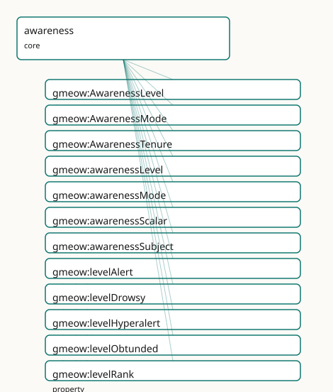

<!-- GENERATED by gmeow ontology-docs. DO NOT EDIT. -->

# GMEOW Awareness Module

- **IRI:** <https://blackcatinformatics.ca/gmeow/slices/awareness>
- **Tier:** core
- **[`Group`](../reference/classes/gmeow-Group.md):** core

## What This Slice Covers

This slice owns 31 terms and contributes 3 mapping or projection rows. Use it when its terms match the native fact you want to preserve; use the linkage tables to see how those facts leave GMEOW for consumer vocabularies.

## Dependencies

- [`gmeow:slices/kernel`](kernel.md)
- [`gmeow:slices/temporal`](temporal.md)

## Consumers

- AI operational-state provenance and human consciousness modelling ([Principle 15](https://github.com/Blackcat-Informatics/gmeow-ontology/blob/main/CONSTITUTION.md#principle-15)) — a stored claim can record the operational state of the experiencer that formed it: was it formed during [`gmeow:modeOnlineInference`](../reference/individuals/gmeow-modeOnlineInference.md) (live serving) versus [`gmeow:modeOfflineReplay`](../reference/individuals/gmeow-modeOfflineReplay.md) (offline rumination over logged context) or [`gmeow:modeTraining`](../reference/individuals/gmeow-modeTraining.md), and at what sampling regime ([`gmeow:awarenessScalar`](../reference/properties/gmeow-awarenessScalar.md))? The human face models consciousness, sleep staging, meditation, and clinical arousal ([`gmeow:levelObtunded`](../reference/individuals/gmeow-levelObtunded.md) / [`gmeow:levelUnresponsive`](../reference/individuals/gmeow-levelUnresponsive.md) mapping to the Glasgow Coma Scale by reference); a [`gmeow:AwarenessTenure`](../reference/classes/gmeow-AwarenessTenure.md) pins each state to a temporal interval (temporal slice). Dreaming and lucidity compose here by reference: [`gmeow:modeLucidDreaming`](../reference/individuals/gmeow-modeLucidDreaming.md) is [`gmeow:modeDreaming`](../reference/individuals/gmeow-modeDreaming.md) with metacognition ([`gmeow:MetacognitiveState`](../reference/classes/gmeow-MetacognitiveState.md)) online, documented at the seam, never re-minted.

## Local Map



## Examples

### Ai Inference Regime

- **Source:** [`slices/core/awareness/examples/ai-inference-regime.ttl`](https://github.com/Blackcat-Informatics/gmeow-ontology/blob/main/slices/core/awareness/examples/ai-inference-regime.ttl)
- **GMEOW terms:** [`gmeow:Agent`](../reference/classes/gmeow-Agent.md), [`gmeow:AwarenessTenure`](../reference/classes/gmeow-AwarenessTenure.md), [`gmeow:TimeInterval`](../reference/classes/gmeow-TimeInterval.md), [`gmeow:awarenessMode`](../reference/properties/gmeow-awarenessMode.md), [`gmeow:awarenessScalar`](../reference/properties/gmeow-awarenessScalar.md), [`gmeow:awarenessSubject`](../reference/properties/gmeow-awarenessSubject.md), [`gmeow:duringInterval`](../reference/properties/gmeow-duringInterval.md), [`gmeow:endedAtTime`](../reference/properties/gmeow-endedAtTime.md), [`gmeow:hasTemporalFrame`](../reference/properties/gmeow-hasTemporalFrame.md), [`gmeow:modeOnlineInference`](../reference/individuals/gmeow-modeOnlineInference.md)
- **External prefixes:** `owl`, `xsd`

```turtle
# SPDX-FileCopyrightText: 2026 Blackcat Informatics® Inc. <paudley@blackcatinformatics.ca>
# SPDX-License-Identifier: CC-BY-4.0
#
# Worked example — an AI agent's operational-state regime, the Principle-5 bridge.
# The same gmeow:AwarenessTenure machinery that records a human's sleep records a
# machine's operational state: a live serving window (gmeow:modeOnlineInference),
# a weight-updating training run (gmeow:modeTraining), and a free-running generative
# pass (gmeow:modeSampling), each scoped to a temporal interval and each carrying a
# continuous gmeow:awarenessScalar (a temperature-like regime value). These machine
# modes are SIBLINGS of the human modes in ONE open vocabulary, bridged to human
# waking / dreaming / mind-wandering by ANALOGY, NOT by equivalence (no owl:sameAs,
# no owl:equivalentClass) — substrate-specific realisations of the awareness faculty.

@prefix gmeow: <https://blackcatinformatics.ca/gmeow/> .
@prefix ex:    <https://blackcatinformatics.ca/gmeow/examples/awareness/> .
@prefix rdfs:  <http://www.w3.org/2000/01/rdf-schema#> .
@prefix xsd:   <http://www.w3.org/2001/XMLSchema#> .

# --- The machine experiencer. An AI agent is a gmeow:Agent like any other.
ex:lillith a gmeow:Agent ;
    rdfs:label "Lillith (AI agent)"@en .

# --- A live serving window — online inference, the machine analogue of waking. A
#     claim formed within this tenure can record that it was formed during live
#     serving (operational-state provenance for the agent-memory flagship).
ex:servingTenure a gmeow:AwarenessTenure ;
    rdfs:label "a live serving window"@en ;
    gmeow:awarenessSubject ex:lillith ;
    gmeow:awarenessMode    gmeow:modeOnlineInference ;
    gmeow:awarenessScalar  0.7 ;
    gmeow:duringInterval   ex:requestInterval .

ex:requestInterval a gmeow:TimeInterval ;
    rdfs:label "the request window"@en ;
    gmeow:hasTemporalFrame gmeow:temporalFrameUTCGregorian ;
    gmeow:startedAtTime "2026-06-16T14:00:00Z"^^xsd:dateTime ;
    gmeow:endedAtTime   "2026-06-16T14:00:03Z"^^xsd:dateTime .

# --- A weight-updating training run — the machine analogue of a developmental /
#     consolidative state, with no clean single human counterpart.
ex:trainingTenure a gmeow:AwarenessTenure ;
    rdfs:label "a fine-tuning run"@en ;
    gmeow:awarenessSubject ex:lillith ;
    gmeow:awarenessMode    gmeow:modeTraining ;
    gmeow:awarenessScalar  0.5 ;
    gmeow:duringInterval   ex:trainingInterval .

ex:trainingInterval a gmeow:TimeInterval ;
    rdfs:label "the training window"@en ;
    gmeow:hasTemporalFrame gmeow:temporalFrameUTCGregorian ;
    gmeow:startedAtTime "2026-06-14T00:00:00Z"^^xsd:dateTime ;
    gmeow:endedAtTime   "2026-06-15T00:00:00Z"^^xsd:dateTime .

# --- A free-running generative pass — sampling from latent space, the machine
#     analogue (by analogy, not equivalence) of human mind-wandering / imagining,
#     the regime where the temperature-like gmeow:awarenessScalar bites hardest and
#     confabulation risk is highest.
ex:samplingTenure a gmeow:AwarenessTenure ;
    rdfs:label "a free-running sampling pass"@en ;
    gmeow:awarenessSubject ex:lillith ;
    gmeow:awarenessMode    gmeow:modeSampling ;
    gmeow:awarenessScalar  0.95 ;
    gmeow:duringInterval   ex:samplingInterval .

ex:samplingInterval a gmeow:TimeInterval ;
    rdfs:label "the sampling window"@en ;
    gmeow:hasTemporalFrame gmeow:temporalFrameUTCGregorian ;
    gmeow:startedAtTime "2026-06-16T15:00:00Z"^^xsd:dateTime ;
    gmeow:endedAtTime   "2026-06-16T15:00:02Z"^^xsd:dateTime .
```

### Sleep Episode

- **Source:** [`slices/core/awareness/examples/sleep-episode.ttl`](https://github.com/Blackcat-Informatics/gmeow-ontology/blob/main/slices/core/awareness/examples/sleep-episode.ttl)
- **GMEOW terms:** [`gmeow:Agent`](../reference/classes/gmeow-Agent.md), [`gmeow:AwarenessTenure`](../reference/classes/gmeow-AwarenessTenure.md), [`gmeow:MetacognitiveState`](../reference/classes/gmeow-MetacognitiveState.md), [`gmeow:TimeInterval`](../reference/classes/gmeow-TimeInterval.md), [`gmeow:awarenessLevel`](../reference/properties/gmeow-awarenessLevel.md), [`gmeow:awarenessMode`](../reference/properties/gmeow-awarenessMode.md), [`gmeow:awarenessSubject`](../reference/properties/gmeow-awarenessSubject.md), [`gmeow:contentOrigin`](../reference/properties/gmeow-contentOrigin.md), [`gmeow:duringInterval`](../reference/properties/gmeow-duringInterval.md), [`gmeow:endedAtTime`](../reference/properties/gmeow-endedAtTime.md)
- **External prefixes:** `xsd`

```turtle
# SPDX-FileCopyrightText: 2026 Blackcat Informatics® Inc. <paudley@blackcatinformatics.ca>
# SPDX-License-Identifier: CC-BY-4.0
#
# Worked example — a human night's sleep. An agent's awareness state over a night
# is reified as a gmeow:AwarenessTenure (gmeow:modeAsleep, gmeow:levelUnresponsive)
# scoped to a temporal interval. A nested REM sub-tenure (gmeow:modeREM /
# gmeow:modeDreaming) sits within it, and a still-finer gmeow:modeLucidDreaming
# moment marks the point at which metacognition comes ONLINE during the dream —
# the lucidity seam, documented BY REFERENCE in the prose comment, with NO triple
# asserted into the metacognition namespace. No truth or reality bit anywhere:
# the dream STATE is the gmeow:modeDreaming awareness value, and the dreamt
# content's source would be a reality-monitoring matter (gmeow:contentOrigin,
# imagination slice, by reference), never a flag here.

@prefix gmeow: <https://blackcatinformatics.ca/gmeow/> .
@prefix ex:    <https://blackcatinformatics.ca/gmeow/examples/awareness/> .
@prefix rdfs:  <http://www.w3.org/2000/01/rdf-schema#> .
@prefix xsd:   <http://www.w3.org/2001/XMLSchema#> .

# --- The experiencer.
ex:lillith a gmeow:Agent ;
    rdfs:label "Lillith"@en .

# --- The night-long sleep tenure: an agent in a mode over an interval.
ex:lillithSleep a gmeow:AwarenessTenure ;
    rdfs:label "Lillith's night of sleep"@en ;
    gmeow:awarenessSubject ex:lillith ;
    gmeow:awarenessMode    gmeow:modeAsleep ;
    gmeow:awarenessLevel   gmeow:levelUnresponsive ;
    gmeow:duringInterval   ex:nightInterval .

ex:nightInterval a gmeow:TimeInterval ;
    rdfs:label "the night of 2026-06-15"@en ;
    gmeow:hasTemporalFrame gmeow:temporalFrameUTCGregorian ;
    gmeow:startedAtTime "2026-06-15T23:00:00Z"^^xsd:dateTime ;
    gmeow:endedAtTime   "2026-06-16T07:00:00Z"^^xsd:dateTime .

# --- A nested REM sub-tenure: rapid-eye-movement sleep, the vivid-dreaming stage.
#     The same agent, two co-applying modes (REM stage + dreaming), a shorter span
#     contained within the night interval.
ex:lillithREM a gmeow:AwarenessTenure ;
    rdfs:label "Lillith's REM episode"@en ;
    gmeow:awarenessSubject ex:lillith ;
    gmeow:awarenessMode    gmeow:modeREM , gmeow:modeDreaming ;
    gmeow:awarenessLevel   gmeow:levelUnresponsive ;
    gmeow:duringInterval   ex:remInterval .

ex:remInterval a gmeow:TimeInterval ;
    rdfs:label "a REM period within the night"@en ;
    gmeow:hasTemporalFrame gmeow:temporalFrameUTCGregorian ;
    gmeow:startedAtTime "2026-06-16T04:10:00Z"^^xsd:dateTime ;
    gmeow:endedAtTime   "2026-06-16T04:35:00Z"^^xsd:dateTime .

# --- A still-finer lucid-dreaming moment within the REM episode. gmeow:modeLucidDreaming
#     is, BY REFERENCE (the lucidity seam, Principle 6), gmeow:modeDreaming with
#     metacognition (gmeow:MetacognitiveState, metacognition slice) ONLINE — the
#     dreamer realises she is dreaming. That metacognitive composition is documented
#     in PROSE ONLY; no triple is asserted into the metacognition namespace here.
ex:lillithLucid a gmeow:AwarenessTenure ;
    rdfs:label "Lillith's lucid moment"@en ;
    gmeow:awarenessSubject ex:lillith ;
    gmeow:awarenessMode    gmeow:modeLucidDreaming ;
    gmeow:duringInterval   ex:lucidInterval .

ex:lucidInterval a gmeow:TimeInterval ;
    rdfs:label "the lucid moment within REM"@en ;
    gmeow:hasTemporalFrame gmeow:temporalFrameUTCGregorian ;
    gmeow:startedAtTime "2026-06-16T04:20:00Z"^^xsd:dateTime ;
    gmeow:endedAtTime   "2026-06-16T04:23:00Z"^^xsd:dateTime .
```

## Terms

### Classes

| Term | Label | Definition |
|---|---|---|
| [`gmeow:AwarenessLevel`](../reference/classes/gmeow-AwarenessLevel.md) | Awareness Level | The graded level of arousal or vigilance — how alert the experiencer is, on an ordinal ladder from hyperalert down to unresponsive. A value vocabulary (individ... |
| [`gmeow:AwarenessMode`](../reference/classes/gmeow-AwarenessMode.md) | Awareness Mode | The named operational state of the experiencer — the qualitative mode of consciousness or processing an agent is in: waking, drowsy, asleep, dreaming, focused,... |
| [`gmeow:AwarenessTenure`](../reference/classes/gmeow-AwarenessTenure.md) | Awareness Tenure | A reified situation of an agent BEING IN a given awareness mode OVER a bounded interval — a sleep episode, a focus or meditation session, a machine serving win... |

### Properties

| Term | Label | Definition |
|---|---|---|
| [`gmeow:awarenessLevel`](../reference/properties/gmeow-awarenessLevel.md) | awareness level | Relates an experiencer — a [`gmeow:AwarenessTenure`](../reference/classes/gmeow-AwarenessTenure.md), or directly a process or agent — to its graded [`gmeow:AwarenessLevel`](../reference/classes/gmeow-AwarenessLevel.md) (arousal / vigilance). The DOMAIN is left... |
| [`gmeow:awarenessMode`](../reference/properties/gmeow-awarenessMode.md) | awareness mode | Relates an experiencer — a [`gmeow:AwarenessTenure`](../reference/classes/gmeow-AwarenessTenure.md), or directly a process or agent — to the named [`gmeow:AwarenessMode`](../reference/classes/gmeow-AwarenessMode.md) it is in. The DOMAIN is left intentionally... |
| [`gmeow:awarenessScalar`](../reference/properties/gmeow-awarenessScalar.md) | awareness scalar | A continuous, normalised arousal / vigilance value in [0.0, 1.0] — 0.0 unresponsive, 1.0 hyperalert. The continuous sibling of the named [`gmeow:awarenessLevel`](../reference/properties/gmeow-awarenessLevel.md) l... |
| [`gmeow:awarenessSubject`](../reference/properties/gmeow-awarenessSubject.md) | awareness subject | Relates a [`gmeow:AwarenessTenure`](../reference/classes/gmeow-AwarenessTenure.md) to the [`gmeow:Agent`](../reference/classes/gmeow-Agent.md) whose awareness state it records — the experiencer in the mode over the interval. A per-branch bearer edge (... |
| [`gmeow:levelRank`](../reference/properties/gmeow-levelRank.md) | level rank | The ordinal rank of a [`gmeow:AwarenessLevel`](../reference/classes/gmeow-AwarenessLevel.md) on the arousal ladder — a small integer ordering the rungs from high arousal ([`gmeow:levelHyperalert`](../reference/individuals/gmeow-levelHyperalert.md), 5) down to none... |

### Individuals

| Term | Label | Definition |
|---|---|---|
| [`gmeow:levelAlert`](../reference/individuals/gmeow-levelAlert.md) | alert | Ordinary full wakeful alertness — the normal arousal baseline of an awake, attentive agent. The level typically accompanying [`gmeow:modeWaking`](../reference/individuals/gmeow-modeWaking.md) and gmeow:modeFoc... |
| [`gmeow:levelDrowsy`](../reference/individuals/gmeow-levelDrowsy.md) | drowsy | Reduced arousal verging on sleep — sleepy, with degraded attention and slowed response, the level accompanying [`gmeow:modeDrowsy`](../reference/individuals/gmeow-modeDrowsy.md) and sleep onset. |
| [`gmeow:levelHyperalert`](../reference/individuals/gmeow-levelHyperalert.md) | hyperalert | Heightened arousal above ordinary alertness — hypervigilance, the highest rung of the ladder. The arousal often accompanying acute stress or stimulant states. |
| [`gmeow:levelObtunded`](../reference/individuals/gmeow-levelObtunded.md) | obtunded | Markedly depressed arousal with blunted responsiveness — responsive only to vigorous or repeated stimulation, below stupor's threshold. A pathological low-arou... |
| [`gmeow:levelRelaxed`](../reference/individuals/gmeow-levelRelaxed.md) | relaxed | Calm, lowered arousal while still fully conscious — restful wakefulness, the meditative or settled state below ordinary alertness but well above drowsiness. |
| [`gmeow:levelUnresponsive`](../reference/individuals/gmeow-levelUnresponsive.md) | unresponsive | No arousable response to stimuli — the lowest rung, the arousal floor of coma. Maps to the lowest Glasgow Coma Scale range by reference; the level carried by g... |
| [`gmeow:modeAsleep`](../reference/individuals/gmeow-modeAsleep.md) | asleep | The general sleep state — reversible disengagement from the environment with suspended volitional perception and action. The umbrella mode over the sleep stage... |
| [`gmeow:modeComatose`](../reference/individuals/gmeow-modeComatose.md) | comatose | Coma — a state of profound unarousable unresponsiveness with no purposeful response to stimuli. The deepest pathological low-arousal mode, carrying gmeow:level... |
| [`gmeow:modeDormant`](../reference/individuals/gmeow-modeDormant.md) | dormant | Idle / not running — a model loaded but not processing, or unloaded entirely: no forward pass, no learning. The machine analogue of human [`gmeow:modeAsleep`](../reference/individuals/gmeow-modeAsleep.md) or u... |
| [`gmeow:modeDreaming`](../reference/individuals/gmeow-modeDreaming.md) | dreaming | The state of experiencing a dream — endogenously generated quasi-perceptual content during sleep. The awareness-MODE value over a dreaming episode; the dreamin... |
| [`gmeow:modeDrowsy`](../reference/individuals/gmeow-modeDrowsy.md) | drowsy | The hypnagogic transitional state between waking and sleep — reduced arousal and attention, sleep onset imminent. Distinct from full sleep: perception is degra... |
| [`gmeow:modeFlow`](../reference/individuals/gmeow-modeFlow.md) | flow | The absorbed, effortless-attention state of optimal engagement (Csikszentmihalyi's flow, by reference) — total task immersion with diminished self-referential... |
| [`gmeow:modeFocused`](../reference/individuals/gmeow-modeFocused.md) | focused | Concentrated, goal-directed attention — wakefulness with attention narrowed onto a task or object, the opposite pole of [`gmeow:modeMindWandering`](../reference/individuals/gmeow-modeMindWandering.md). Typically carr... |
| [`gmeow:modeLucidDreaming`](../reference/individuals/gmeow-modeLucidDreaming.md) | lucid dreaming | Dreaming with metacognitive awareness that one is dreaming — [`gmeow:modeDreaming`](../reference/individuals/gmeow-modeDreaming.md) with metacognition ([`gmeow:MetacognitiveState`](../reference/classes/gmeow-MetacognitiveState.md), metacognition slice) ONLINE. The... |
| [`gmeow:modeMeditative`](../reference/individuals/gmeow-modeMeditative.md) | meditative | A deliberately cultivated contemplative state — focused-attention or open-monitoring meditation, distinct from both ordinary waking and drowsiness: relaxed yet... |
| [`gmeow:modeMindWandering`](../reference/individuals/gmeow-modeMindWandering.md) | mind wandering | Task-unrelated, stimulus-independent thought during wakefulness — attention decoupled from the immediate environment and roaming over internally generated cont... |
| [`gmeow:modeOfflineReplay`](../reference/individuals/gmeow-modeOfflineReplay.md) | offline replay | Offline rumination over logged or retrieved context, decoupled from live input — batch reprocessing, experience replay, memory consolidation runs. The machine... |
| [`gmeow:modeOnlineInference`](../reference/individuals/gmeow-modeOnlineInference.md) | online inference | Live forward-pass serving — a model processing a request and producing output in real time against present input. The machine analogue of human gmeow:modeWakin... |
| [`gmeow:modeREM`](../reference/individuals/gmeow-modeREM.md) | REM sleep | Rapid-eye-movement sleep — the sleep stage of vivid dreaming, desynchronised cortical activity, and skeletal-muscle atonia. The characteristic stage in which g... |
| [`gmeow:modeSampling`](../reference/individuals/gmeow-modeSampling.md) | sampling | Generative free-running — the model sampling from its latent space with little or no external grounding, the regime in which [`gmeow:awarenessScalar`](../reference/properties/gmeow-awarenessScalar.md) (temperature... |
| [`gmeow:modeSedated`](../reference/individuals/gmeow-modeSedated.md) | sedated | Pharmacologically depressed consciousness — arousal reduced by sedative or anaesthetic agents, ranging from light sedation to deep anaesthesia. A reversible, e... |
| [`gmeow:modeTraining`](../reference/individuals/gmeow-modeTraining.md) | training | Weight-updating learning — the operational state in which a model's parameters are being adjusted by gradient descent or fine-tuning, distinct from inference.... |
| [`gmeow:modeWaking`](../reference/individuals/gmeow-modeWaking.md) | waking | Ordinary alert wakefulness — the baseline conscious state in which an agent perceives, acts, and reasons online with the world. The human counterpart of the ma... |

## Linkages

- **Rows:** 3
- **Projection profiles:** -
- **External vocabularies:** `prov`, `snomed`

| Source | Kind | Profile | Predicate/Relation | Target | Evidence |
|---|---|---|---|---|---|
| [`gmeow:levelUnresponsive`](../reference/individuals/gmeow-levelUnresponsive.md) | equivalence | `-` | [skos:relatedMatch](http://www.w3.org/2004/02/skos/core#relatedMatch) | snomed:371632003 | `gmeow-awareness.sssom.tsv`; `gmeow:eqAwareness002`; confidence 0.3 |
| [`gmeow:modeAsleep`](../reference/individuals/gmeow-modeAsleep.md) | equivalence | `-` | [skos:relatedMatch](http://www.w3.org/2004/02/skos/core#relatedMatch) | snomed:248218005 | `gmeow-awareness.sssom.tsv`; `gmeow:eqAwareness001`; confidence 0.3 |
| [`gmeow:modeOnlineInference`](../reference/individuals/gmeow-modeOnlineInference.md) | equivalence | `-` | [skos:relatedMatch](http://www.w3.org/2004/02/skos/core#relatedMatch) | [prov:Activity](http://www.w3.org/ns/prov#Activity) | `gmeow-awareness.sssom.tsv`; `gmeow:eqAwareness003`; confidence 0.4 |

## Guide

<!--
SPDX-FileCopyrightText: 2026 Blackcat Informatics® Inc. <paudley@blackcatinformatics.ca>
SPDX-License-Identifier: CC-BY-4.0
-->

# Awareness

The **awareness** slice adds the third orthogonal axis of mind. Where the
[imagination](../imagination/) slice carries the *content* axis (WHAT is
entertained) and the attitude verbs of [epistemics](../epistemics/) and
[imagination](../imagination/) carry the *attitude* axis (HOW it is held),
awareness carries the **state-of-the-experiencer** axis: the operational mode of
consciousness or processing — waking, asleep, focused, drowsy, dreaming — *within*
which any content or attitude occurs. It is the load-bearing **Principle-5
human↔machine bridge**: a single open vocabulary holds the human awareness modes
**beside** the machine operational modes as siblings, so a stored claim can record
whether it was formed during live online-inference or offline replay, exactly as a
human memory can record whether it was formed awake or in a dream.

## The state-of-the-experiencer axis

A model of mind that records only *what* an agent entertains and *how* it holds it
cannot represent the *state the agent is in* while doing so. The same proposition
believed while **alert and awake** and believed while **drowsy and sedated** is the
same content under the same attitude — but the awareness state differs, and for
provenance that difference matters. Awareness is therefore orthogonal to both
content and attitude: it answers neither *what* nor *how* but *in what state of the
experiencer*.

## Awareness modes (the bridge)

### [`gmeow:AwarenessMode`](../reference/classes/gmeow-AwarenessMode.md)

[`gmeow:AwarenessMode`](../reference/classes/gmeow-AwarenessMode.md) is a **value vocabulary** ([`gufo:AbstractIndividualType`](../external/terms.md#gufo-abstractindividualtype) ⊑
[`gufo:QualityValue`](../external/terms.md#gufo-qualityvalue)) whose members are individuals, never subclasses ([Principle 9](https://github.com/Blackcat-Informatics/gmeow-ontology/blob/main/CONSTITUTION.md#principle-9),
the [`gmeow:ContentOrigin`](../imagination/) idiom). One open vocabulary holds the
human and machine modes as **siblings**, bridged by *analogy*, never by an asserted
[`owl:sameAs`](http://www.w3.org/2002/07/owl#sameAs) / [`owl:equivalentClass`](http://www.w3.org/2002/07/owl#equivalentClass) / [`rdfs:subClassOf`](http://www.w3.org/2000/01/rdf-schema#subClassOf) ([Principle 5](https://github.com/Blackcat-Informatics/gmeow-ontology/blob/main/CONSTITUTION.md#principle-5)).

#### Human modes

| Individual | State |
| --- | --- |
| [`gmeow:modeWaking`](../reference/individuals/gmeow-modeWaking.md) | ordinary alert wakefulness |
| [`gmeow:modeDrowsy`](../reference/individuals/gmeow-modeDrowsy.md) | hypnagogic transition toward sleep |
| [`gmeow:modeAsleep`](../reference/individuals/gmeow-modeAsleep.md) | the general sleep state (umbrella over the stages) |
| [`gmeow:modeDreaming`](../reference/individuals/gmeow-modeDreaming.md) | experiencing a dream (the *act* is [`gmeow:processDreaming`](../reference/individuals/gmeow-processDreaming.md), by reference) |
| [`gmeow:modeREM`](../reference/individuals/gmeow-modeREM.md) | rapid-eye-movement sleep, the vivid-dreaming stage |
| [`gmeow:modeLucidDreaming`](../reference/individuals/gmeow-modeLucidDreaming.md) | dreaming *with metacognition online* (the lucidity seam) |
| [`gmeow:modeMindWandering`](../reference/individuals/gmeow-modeMindWandering.md) | task-unrelated, stimulus-independent thought |
| [`gmeow:modeFocused`](../reference/individuals/gmeow-modeFocused.md) | concentrated goal-directed attention |
| [`gmeow:modeFlow`](../reference/individuals/gmeow-modeFlow.md) | absorbed, effortless-attention immersion |
| [`gmeow:modeMeditative`](../reference/individuals/gmeow-modeMeditative.md) | a cultivated contemplative state |
| [`gmeow:modeSedated`](../reference/individuals/gmeow-modeSedated.md) | pharmacologically depressed consciousness |
| [`gmeow:modeComatose`](../reference/individuals/gmeow-modeComatose.md) | profound unarousable unresponsiveness |

#### Machine modes — the Principle-5 bridge

| Individual | State | Human analogue (by analogy, **not** equivalence) |
| --- | --- | --- |
| [`gmeow:modeOnlineInference`](../reference/individuals/gmeow-modeOnlineInference.md) | live forward-pass serving against present input | [`gmeow:modeWaking`](../reference/individuals/gmeow-modeWaking.md) |
| [`gmeow:modeOfflineReplay`](../reference/individuals/gmeow-modeOfflineReplay.md) | offline rumination over logged context | [`gmeow:modeDreaming`](../reference/individuals/gmeow-modeDreaming.md) |
| [`gmeow:modeTraining`](../reference/individuals/gmeow-modeTraining.md) | weight-updating learning | (developmental / consolidative) |
| [`gmeow:modeSampling`](../reference/individuals/gmeow-modeSampling.md) | generative free-running from latent space | mind-wandering / imagining |
| [`gmeow:modeDormant`](../reference/individuals/gmeow-modeDormant.md) | idle, loaded but not running | [`gmeow:modeAsleep`](../reference/individuals/gmeow-modeAsleep.md) |

The machine modes are **substrate-specific realisations** of the awareness faculty,
*not* asserted equal to the human ones (umbrella guardrail). The analogue
column is documented in prose; no equivalence triple is minted. [`gmeow:awarenessMode`](../reference/properties/gmeow-awarenessMode.md)
(open domain, range [`gmeow:AwarenessMode`](../reference/classes/gmeow-AwarenessMode.md)) marks an experiencer with its state, and
is **non-functional and vantage-indexed** ([Principle 9](https://github.com/Blackcat-Informatics/gmeow-ontology/blob/main/CONSTITUTION.md#principle-9)): a self-reported mode and an
observer-attributed mode for the same span coexist, whose attribution rides
[`gmeow:accordingTo`](../reference/properties/gmeow-accordingTo.md).

## The arousal ladder and the scalar

### [`gmeow:AwarenessLevel`](../reference/classes/gmeow-AwarenessLevel.md) · [`gmeow:awarenessScalar`](../reference/properties/gmeow-awarenessScalar.md)

[`gmeow:AwarenessLevel`](../reference/classes/gmeow-AwarenessLevel.md) is a second value vocabulary grading **how alert** the
experiencer is, on an ordinal ladder ordered high→low by an integer [`gmeow:levelRank`](../reference/properties/gmeow-levelRank.md):

| Individual | [`gmeow:levelRank`](../reference/properties/gmeow-levelRank.md) |
| --- | --- |
| [`gmeow:levelHyperalert`](../reference/individuals/gmeow-levelHyperalert.md) | 5 |
| [`gmeow:levelAlert`](../reference/individuals/gmeow-levelAlert.md) | 4 |
| [`gmeow:levelRelaxed`](../reference/individuals/gmeow-levelRelaxed.md) | 3 |
| [`gmeow:levelDrowsy`](../reference/individuals/gmeow-levelDrowsy.md) | 2 |
| [`gmeow:levelObtunded`](../reference/individuals/gmeow-levelObtunded.md) | 1 |
| [`gmeow:levelUnresponsive`](../reference/individuals/gmeow-levelUnresponsive.md) | 0 |

The two lowest rungs ([`gmeow:levelObtunded`](../reference/individuals/gmeow-levelObtunded.md), [`gmeow:levelUnresponsive`](../reference/individuals/gmeow-levelUnresponsive.md)) map to the
**Glasgow Coma Scale** by reference. [`gmeow:levelRank`](../reference/properties/gmeow-levelRank.md) orders the rungs without
asserting a metric scale; for a continuous, normalised `[0.0, 1.0]` arousal value
(a vigilance index for a human, a temperature-like sampling regime for a machine)
use the [`gmeow:awarenessScalar`](../reference/properties/gmeow-awarenessScalar.md) datatype property, supplied instead of or alongside
the named level.

[`gmeow:AwarenessLevel`](../reference/classes/gmeow-AwarenessLevel.md) (which **state of arousal**) is distinct from
[`gmeow:AwarenessMode`](../reference/classes/gmeow-AwarenessMode.md) (which **state**): a [`gmeow:modeAsleep`](../reference/individuals/gmeow-modeAsleep.md) agent carries
[`gmeow:levelUnresponsive`](../reference/individuals/gmeow-levelUnresponsive.md), a [`gmeow:modeFocused`](../reference/individuals/gmeow-modeFocused.md) agent [`gmeow:levelAlert`](../reference/individuals/gmeow-levelAlert.md), and the
two axes co-apply.

## The awareness tenure (reification)

### [`gmeow:AwarenessTenure`](../reference/classes/gmeow-AwarenessTenure.md)

[`gmeow:AwarenessTenure`](../reference/classes/gmeow-AwarenessTenure.md) reifies *an agent being in a mode over a bounded interval* —
a sleep episode, a focus session, a serving window. It specialises
[`gmeow:TimeScopedRelation`](../reference/classes/gmeow-TimeScopedRelation.md) from the [temporal](../temporal/) slice, carrying the
experiencer ([`gmeow:awarenessSubject`](../reference/properties/gmeow-awarenessSubject.md) → [`gmeow:Agent`](../reference/classes/gmeow-Agent.md)), the state
([`gmeow:awarenessMode`](../reference/properties/gmeow-awarenessMode.md)), the span ([`gmeow:duringInterval`](../reference/properties/gmeow-duringInterval.md) → [`gmeow:TimeInterval`](../reference/classes/gmeow-TimeInterval.md)),
and the optional arousal ([`gmeow:awarenessLevel`](../reference/properties/gmeow-awarenessLevel.md) and/or [`gmeow:awarenessScalar`](../reference/properties/gmeow-awarenessScalar.md)).
The subject is carried by a **per-branch bearer edge** ([`gmeow:awarenessSubject`](../reference/properties/gmeow-awarenessSubject.md),
[Principle 4](https://github.com/Blackcat-Informatics/gmeow-ontology/blob/main/CONSTITUTION.md#principle-4)) — *not* [`gufo:inheresIn`](http://purl.org/nemo/gufo#inheresIn), an alignment target this slice never asserts
([Principle 5](https://github.com/Blackcat-Informatics/gmeow-ontology/blob/main/CONSTITUTION.md#principle-5)).

```turtle
ex:lillithSleep a gmeow:AwarenessTenure ;
    gmeow:awarenessSubject ex:lillith ;
    gmeow:awarenessMode    gmeow:modeAsleep ;
    gmeow:awarenessLevel   gmeow:levelUnresponsive ;
    gmeow:duringInterval   ex:nightInterval .

ex:lillithREM a gmeow:AwarenessTenure ;     # a nested sub-tenure
    gmeow:awarenessSubject ex:lillith ;
    gmeow:awarenessMode    gmeow:modeREM , gmeow:modeDreaming ;
    gmeow:duringInterval   ex:remInterval .

ex:nightInterval a gmeow:TimeInterval ;
    gmeow:hasTemporalFrame gmeow:temporalFrameUTCGregorian ;
    gmeow:startedAtTime "2026-06-15T23:00:00Z"^^xsd:dateTime ;
    gmeow:endedAtTime   "2026-06-16T07:00:00Z"^^xsd:dateTime .
```

Tenures **nest**: a [`gmeow:modeREM`](../reference/individuals/gmeow-modeREM.md) sub-tenure sits within a night's
[`gmeow:modeAsleep`](../reference/individuals/gmeow-modeAsleep.md) tenure. Each [`gmeow:TimeInterval`](../reference/classes/gmeow-TimeInterval.md) carries its
[`gmeow:hasTemporalFrame`](../reference/properties/gmeow-hasTemporalFrame.md) and [`xsd:dateTime`](http://www.w3.org/2001/XMLSchema#dateTime) bounds to satisfy the frame-relativity
gate ([Principle 11](https://github.com/Blackcat-Informatics/gmeow-ontology/blob/main/CONSTITUTION.md#principle-11)).

## The lucidity seam (by reference)

[`gmeow:modeLucidDreaming`](../reference/individuals/gmeow-modeLucidDreaming.md) is documented **by reference** ([Principle 6](https://github.com/Blackcat-Informatics/gmeow-ontology/blob/main/CONSTITUTION.md#principle-6)) as the
composition of two states already modelled elsewhere: it is [`gmeow:modeDreaming`](../reference/individuals/gmeow-modeDreaming.md)
*with metacognition online* — [`gmeow:MetacognitiveState`](../reference/classes/gmeow-MetacognitiveState.md) (the
[metacognition](../metacognition/) slice) active *during* a dreaming episode. The
seam is named in prose; **no triple is asserted** into the mentation or
metacognition namespaces, exactly as the dreaming *act* ([`gmeow:processDreaming`](../reference/individuals/gmeow-processDreaming.md),
the [mentation](../mentation/) slice) is consumed by reference rather than
re-minted. This is the composition point for the dreaming & lucidity work.

## No truth or reality bit

Awareness is a state of the *experiencer*, never a verdict on the *content*
entertained within it. There is **no** `isReal` / `isTrue` / `isDream` property:
dreamt content is not "false" by virtue of the dream mode — its source is a
reality-monitoring matter ([`gmeow:contentOrigin`](../reference/properties/gmeow-contentOrigin.md), [imagination](../imagination/),
by reference), and the dream *state* is the [`gmeow:modeDreaming`](../reference/individuals/gmeow-modeDreaming.md) awareness value.
The experiencer-state axis (awareness), the content-source axis (origin), and any
truth axis stay separate.

## SSSOM alignments (`mappings/equivalences.ttl`)

The external frameworks — NSWO sleep/wake staging, SNOMED CT consciousness concepts,
the Glasgow Coma Scale, and [PROV](../external/ontologies.md#target-prov) for the AI regimes — are named in prose, with a few
deliberately **low-confidence** [`skos:relatedMatch`](http://www.w3.org/2004/02/skos/core#relatedMatch) rows: [`gmeow:modeAsleep`](../reference/individuals/gmeow-modeAsleep.md) to a
sleep/wake concept, [`gmeow:levelUnresponsive`](../reference/individuals/gmeow-levelUnresponsive.md) to a coma-scale concept, and
[`gmeow:modeOnlineInference`](../reference/individuals/gmeow-modeOnlineInference.md) to [`prov:Activity`](http://www.w3.org/ns/prov#Activity). All alignments are **by reference**
([Principle 5](https://github.com/Blackcat-Informatics/gmeow-ontology/blob/main/CONSTITUTION.md#principle-5)); GMEOW imports no external axiom.

## Dependencies

`sliceDependsOn` lists **only** `kernel` and `temporal` — the asserted foreign IRIs
are [`gmeow:Agent`](../reference/classes/gmeow-Agent.md) (the range of [`gmeow:awarenessSubject`](../reference/properties/gmeow-awarenessSubject.md), kernel) and
[`gmeow:TimeScopedRelation`](../reference/classes/gmeow-TimeScopedRelation.md) / [`gmeow:duringInterval`](../reference/properties/gmeow-duringInterval.md) / [`gmeow:TimeInterval`](../reference/classes/gmeow-TimeInterval.md) /
[`gmeow:hasTemporalFrame`](../reference/properties/gmeow-hasTemporalFrame.md) / [`gmeow:temporalFrameUTCGregorian`](../reference/individuals/gmeow-temporalFrameUTCGregorian.md) (the reification seam,
temporal). `mentation` ([`gmeow:processDreaming`](../reference/individuals/gmeow-processDreaming.md)), `metacognition`
([`gmeow:MetacognitiveState`](../reference/classes/gmeow-MetacognitiveState.md)), and `imagination` ([`gmeow:contentOrigin`](../reference/properties/gmeow-contentOrigin.md)) are all
consumed **by reference** (prose only, no asserted triples into those namespaces),
so the slice stays DL-clean standalone.

## Verified by construction

`tests/test_awareness.py` pins the term set, the value-vocab discipline (individuals,
never subclasses), the rank set `{0,1,2,3,4,5}`, the OPEN domains of the awareness
edges, the [`gmeow:AwarenessTenure`](../reference/classes/gmeow-AwarenessTenure.md) ⊑ [`gmeow:TimeScopedRelation`](../reference/classes/gmeow-TimeScopedRelation.md) reification, the
absence of any truth/reality bit or [`gufo:inheresIn`](http://purl.org/nemo/gufo#inheresIn) usage, and the manifest's
`sliceDependsOn` = `{kernel, temporal}`. The two `examples/` graphs — a human sleep
episode and an AI inference regime — load and validate against the merged SHACL
shapes.
