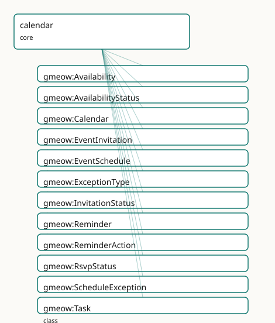

<!-- GENERATED by gmeow ontology-docs. DO NOT EDIT. -->

# GMEOW Calendar and Scheduling Module

- **IRI:** <https://blackcatinformatics.ca/gmeow/slices/calendar>
- **Tier:** core
- **[`Group`](../reference/classes/gmeow-Group.md):** core

## What This Slice Covers

This slice owns 61 terms and contributes 49 mapping or projection rows. Use it when its terms match the native fact you want to preserve; use the linkage tables to see how those facts leave GMEOW for consumer vocabularies.

## Dependencies

- [`gmeow:slices/agreements`](agreements.md)
- [`gmeow:slices/events`](events.md)
- [`gmeow:slices/kernel`](kernel.md)
- [`gmeow:slices/temporal`](temporal.md)

## Consumers

- Scheduling atop events: the mail corpus's invitations (mail-corpus invitation consumer), the >25%-usage floor (named in slice-dependency doctrine).

## Local Map



## Examples

### Recurring Meeting

- **Source:** [`slices/core/calendar/examples/recurring-meeting.ttl`](https://github.com/Blackcat-Informatics/gmeow-ontology/blob/main/slices/core/calendar/examples/recurring-meeting.ttl)
- **GMEOW terms:** [`gmeow:Event`](../reference/classes/gmeow-Event.md), [`gmeow:EventInvitation`](../reference/classes/gmeow-EventInvitation.md), [`gmeow:EventSchedule`](../reference/classes/gmeow-EventSchedule.md), [`gmeow:EventType`](../reference/classes/gmeow-EventType.md), [`gmeow:Person`](../reference/classes/gmeow-Person.md), [`gmeow:RecurrenceRule`](../reference/classes/gmeow-RecurrenceRule.md), [`gmeow:TimeZone`](../reference/classes/gmeow-TimeZone.md), [`gmeow:eventTemporalFrame`](../reference/properties/gmeow-eventTemporalFrame.md), [`gmeow:eventTime`](../reference/properties/gmeow-eventTime.md), [`gmeow:eventTimeZone`](../reference/properties/gmeow-eventTimeZone.md)
- **External prefixes:** `xsd`

```turtle
# SPDX-FileCopyrightText: 2026 Blackcat Informatics® Inc. <paudley@blackcatinformatics.ca>
# SPDX-License-Identifier: CC-BY-4.0
#
# Worked example: a recurring meeting with invitations. A gmeow:EventSchedule
# repeats a TEMPLATE event by a gmeow:RecurrenceRule (an RFC 5545 RRULE string),
# all anchored in an explicit gmeow:TimeZone (IANA id) — so "every Monday 09:00"
# is unambiguous across DST. Invitations are reified gmeow:EventInvitations
# carrying both the organiser-side gmeow:invitationStatus and the invitee's own
# gmeow:rsvpStatus. The event's kind is an open vocabulary: there is no seed
# "meeting" EventType, so one is minted (the custom-value idiom, P9).
@prefix gmeow: <https://blackcatinformatics.ca/gmeow/> .
@prefix ex:    <https://blackcatinformatics.ca/gmeow/examples/calendar/> .
@prefix rdfs:  <http://www.w3.org/2000/01/rdf-schema#> .
@prefix xsd:   <http://www.w3.org/2001/XMLSchema#> .

# --- A minted event kind (open vocabulary — no closed enum of event types).
ex:eventTypeTeamMeeting a gmeow:EventType ; rdfs:label "team meeting"@en .

ex:edmonton a gmeow:TimeZone ; gmeow:timeZoneIanaId "America/Edmonton" .

ex:dana a gmeow:Person ; gmeow:name "Dana Reyes"@en .

# --- The template event the schedule repeats.
ex:standup a gmeow:Event ;
    rdfs:label               "Weekly engineering standup"@en ;
    gmeow:eventType          ex:eventTypeTeamMeeting ;
    gmeow:eventTime          "2026-06-15T09:00:00-06:00"^^xsd:dateTime ;
    gmeow:eventTemporalFrame gmeow:temporalFrameUTCGregorian ;
    gmeow:eventTimeZone      ex:edmonton .

# --- The recurrence: every Monday, by RFC 5545 rule, in the named time zone.
ex:schedule a gmeow:EventSchedule ;
    gmeow:scheduleTemplateEvent  ex:standup ;
    gmeow:scheduleRecurrenceRule ex:weekly ;
    gmeow:scheduleTimeZone       ex:edmonton .

ex:weekly a gmeow:RecurrenceRule ;
    gmeow:recurrenceRuleText "FREQ=WEEKLY;BYDAY=MO" .

# --- A reified invitation: organiser status AND the invitee's own RSVP.
ex:invite a gmeow:EventInvitation ;
    gmeow:invitationEvent   ex:standup ;
    gmeow:invitationInvitee ex:dana ;
    gmeow:invitationStatus  gmeow:invitationStatusAccepted ;
    gmeow:rsvpStatus        gmeow:rsvpStatusAccepted .
```

## Terms

### Classes

| Term | Label | Definition |
|---|---|---|
| [`gmeow:Availability`](../reference/classes/gmeow-Availability.md) | Availability | A time-scoped statement of an agent's availability over an interval — free, busy, tentative, or out-of-office. The free-busy spine of the calendar layer. |
| [`gmeow:AvailabilityStatus`](../reference/classes/gmeow-AvailabilityStatus.md) | Availability Status | The availability state of an agent over a time slot — a VALUE vocabulary aligned to iCalendar VFREEBUSY, never a subclass. |
| [`gmeow:Calendar`](../reference/classes/gmeow-Calendar.md) | Calendar | A CalDAV-style collection of scheduled events — an information object that aggregates calendar members and carries a default time zone. The container, not the... |
| [`gmeow:EventInvitation`](../reference/classes/gmeow-EventInvitation.md) | Event Invitation | A social act inviting an agent to attend an event, reified as a relator. Models the invitation as an Agreement to attend, reusing [`gmeow:hasParty`](../reference/properties/gmeow-hasParty.md) for the invite... |
| [`gmeow:EventSchedule`](../reference/classes/gmeow-EventSchedule.md) | Event Schedule | A recurrence rule anchored to a template event and a time zone, generating a series of concrete Event occurrences. A relator mediating the template event, the... |
| [`gmeow:ExceptionType`](../reference/classes/gmeow-ExceptionType.md) | Exception Type | The kind of a schedule exception — a VALUE, never a subclass. |
| [`gmeow:InvitationStatus`](../reference/classes/gmeow-InvitationStatus.md) | Invitation Status | The status of an event invitation — a VALUE vocabulary aligned to iTIP PARTSTAT, never a subclass. |
| [`gmeow:Reminder`](../reference/classes/gmeow-Reminder.md) | Reminder | A reminder associated with an event — a trigger (offset or absolute time) and an action (display, email, audio). |
| [`gmeow:ReminderAction`](../reference/classes/gmeow-ReminderAction.md) | Reminder Action | The action to take when a reminder fires — a VALUE vocabulary aligned to iCalendar ACTION, never a subclass. |
| [`gmeow:RsvpStatus`](../reference/classes/gmeow-RsvpStatus.md) | RSVP Status | The RSVP response status as asserted by an invitee — a VALUE vocabulary, distinct from InvitationStatus so that organizer and invitee claims can coexist (Princ... |
| [`gmeow:ScheduleException`](../reference/classes/gmeow-ScheduleException.md) | Schedule Exception | An exception to a recurring event schedule — a cancellation or rescheduling of a specific generated occurrence. A relator mediating the schedule, the original... |
| [`gmeow:Task`](../reference/classes/gmeow-Task.md) | Task | A to-do or task — an event with a due date, status, priority, and optional recurrence-until-done. A subtype of [`gmeow:Event`](../reference/classes/gmeow-Event.md) so it participates in the full event... |
| [`gmeow:TaskStatus`](../reference/classes/gmeow-TaskStatus.md) | Task Status | The status of a task — a VALUE vocabulary, never a Task subclass. |
| [`gmeow:TimeZone`](../reference/classes/gmeow-TimeZone.md) | Time Zone | A time zone identified by an IANA tzid (e.g. America/Toronto). Used by calendars, schedules, and events to express civil time relative to a geographic referenc... |

### Properties

| Term | Label | Definition |
|---|---|---|
| [`gmeow:availabilityAgent`](../reference/properties/gmeow-availabilityAgent.md) | availability agent | The agent whose availability is stated. |
| [`gmeow:availabilitySlot`](../reference/properties/gmeow-availabilitySlot.md) | availability slot | The time interval over which the availability status holds. |
| [`gmeow:availabilityStatus`](../reference/properties/gmeow-availabilityStatus.md) | availability status | The availability status for this slot — free, busy, tentative, or out-of-office. |
| [`gmeow:calendarMember`](../reference/properties/gmeow-calendarMember.md) | calendar member | An event that is a member of this calendar. Non-functional: a calendar may contain many events. |
| [`gmeow:calendarTimeZone`](../reference/properties/gmeow-calendarTimeZone.md) | calendar time zone | The default time zone for a calendar collection. |
| [`gmeow:eventTimeZone`](../reference/properties/gmeow-eventTimeZone.md) | event time zone | The time zone in which an event's temporal placement is expressed. |
| [`gmeow:exceptionOriginalDate`](../reference/properties/gmeow-exceptionOriginalDate.md) | exception original date | The original date/time of the occurrence being excepted — the instance that would have been generated by the recurrence rule. |
| [`gmeow:exceptionReplacementEvent`](../reference/properties/gmeow-exceptionReplacementEvent.md) | exception replacement event | The replacement event for a rescheduled occurrence. Absent for a pure cancellation. |
| [`gmeow:exceptionSchedule`](../reference/properties/gmeow-exceptionSchedule.md) | exception schedule | The event schedule to which this exception applies. |
| [`gmeow:exceptionType`](../reference/properties/gmeow-exceptionType.md) | exception type | The kind of schedule exception — cancellation or rescheduling. |
| [`gmeow:invitationEvent`](../reference/properties/gmeow-invitationEvent.md) | invitation event | The event being invited to. |
| [`gmeow:invitationInvitee`](../reference/properties/gmeow-invitationInvitee.md) | invitation invitee | An agent invited to the event. Non-functional: a joint invitation may name several invitees. |
| [`gmeow:invitationStatus`](../reference/properties/gmeow-invitationStatus.md) | invitation status | The current status of the invitation as set by the organizer — needs-action, accepted, declined, tentative. |
| [`gmeow:reminderAction`](../reference/properties/gmeow-reminderAction.md) | reminder action | The action to take when the reminder fires — display, email, or audio. |
| [`gmeow:reminderTarget`](../reference/properties/gmeow-reminderTarget.md) | reminder target | The event this reminder is attached to. |
| [`gmeow:reminderTrigger`](../reference/properties/gmeow-reminderTrigger.md) | reminder trigger | The trigger for a reminder — either an [xsd:duration](http://www.w3.org/2001/XMLSchema#duration) offset before the target event (e.g. PT15M) or an absolute [xsd:dateTime.](http://www.w3.org/2001/XMLSchema#dateTime.) |
| [`gmeow:rsvpStatus`](../reference/properties/gmeow-rsvpStatus.md) | RSVP status | The RSVP response status as asserted by the invitee — needs-action, accepted, declined, tentative. Distinct from invitationStatus: the organizer's view and the... |
| [`gmeow:scheduleOccurrence`](../reference/properties/gmeow-scheduleOccurrence.md) | schedule occurrence | A concrete event occurrence generated by this schedule. Non-functional: a schedule generates many occurrences. |
| [`gmeow:scheduleRecurrenceRule`](../reference/properties/gmeow-scheduleRecurrenceRule.md) | schedule recurrence rule | The recurrence rule by which this schedule generates occurrences. Non-functional: a schedule may combine multiple rules (e.g. weekly + monthly exception). |
| [`gmeow:scheduleTemplateEvent`](../reference/properties/gmeow-scheduleTemplateEvent.md) | schedule template event | The template event from which occurrences are generated — the anchor event carrying title, location, participants, and duration. Functional: one template per s... |
| [`gmeow:scheduleTimeZone`](../reference/properties/gmeow-scheduleTimeZone.md) | schedule time zone | The time zone in which this schedule's recurrence is expressed. The occurrence generation engine uses this zone when expanding the rule. |
| [`gmeow:taskDueDate`](../reference/properties/gmeow-taskDueDate.md) | task due date | The date and time by which the task is due. |
| [`gmeow:taskPriority`](../reference/properties/gmeow-taskPriority.md) | task priority | The priority of the task, 0-9, where 0 is undefined and 1 is highest. Aligned to iCalendar PRIORITY. |
| [`gmeow:taskRecurrenceUntilDone`](../reference/properties/gmeow-taskRecurrenceUntilDone.md) | task recurrence until done | Whether this recurring task continues until marked done, rather than stopping at a fixed count or end date. |
| [`gmeow:taskStatus`](../reference/properties/gmeow-taskStatus.md) | task status | The status of the task — not-started, in-progress, completed, or cancelled. |
| [`gmeow:timeZoneIanaId`](../reference/properties/gmeow-timeZoneIanaId.md) | time zone IANA id | The IANA time zone identifier, e.g. America/Toronto, Europe/Paris, UTC. |

### Individuals

| Term | Label | Definition |
|---|---|---|
| [`gmeow:availabilityStatusBusy`](../reference/individuals/gmeow-availabilityStatusBusy.md) | busy | The agent is busy during this slot. Aligned to iCalendar FBTYPE=BUSY. |
| [`gmeow:availabilityStatusFree`](../reference/individuals/gmeow-availabilityStatusFree.md) | free | The agent is free during this slot. Aligned to iCalendar FBTYPE=FREE. |
| [`gmeow:availabilityStatusOutOfOffice`](../reference/individuals/gmeow-availabilityStatusOutOfOffice.md) | out of office | The agent is out of office. Aligned to iCalendar FBTYPE=BUSY-UNAVAILABLE. |
| [`gmeow:availabilityStatusTentative`](../reference/individuals/gmeow-availabilityStatusTentative.md) | tentative | The agent is tentatively busy. Aligned to iCalendar FBTYPE=BUSY-TENTATIVE. |
| [`gmeow:exceptionTypeCancellation`](../reference/individuals/gmeow-exceptionTypeCancellation.md) | cancellation | The occurrence is cancelled. |
| [`gmeow:exceptionTypeRescheduling`](../reference/individuals/gmeow-exceptionTypeRescheduling.md) | rescheduling | The occurrence is moved to a different time. |
| [`gmeow:invitationStatusAccepted`](../reference/individuals/gmeow-invitationStatusAccepted.md) | accepted | The invitee has accepted the invitation. Aligned to iTIP PARTSTAT=ACCEPTED. |
| [`gmeow:invitationStatusDeclined`](../reference/individuals/gmeow-invitationStatusDeclined.md) | declined | The invitee has declined the invitation. Aligned to iTIP PARTSTAT=DECLINED. |
| [`gmeow:invitationStatusNeedsAction`](../reference/individuals/gmeow-invitationStatusNeedsAction.md) | needs action | The invitee has not yet responded. Aligned to iTIP PARTSTAT=NEEDS-ACTION. |
| [`gmeow:invitationStatusTentative`](../reference/individuals/gmeow-invitationStatusTentative.md) | tentative | The invitee has tentatively accepted. Aligned to iTIP PARTSTAT=TENTATIVE. |
| [`gmeow:reminderActionAudio`](../reference/individuals/gmeow-reminderActionAudio.md) | audio | Play an audio reminder. Aligned to iCalendar ACTION=AUDIO. |
| [`gmeow:reminderActionDisplay`](../reference/individuals/gmeow-reminderActionDisplay.md) | display | Display the reminder on screen. Aligned to iCalendar ACTION=DISPLAY. |
| [`gmeow:reminderActionEmail`](../reference/individuals/gmeow-reminderActionEmail.md) | email | Send the reminder by email. Aligned to iCalendar ACTION=EMAIL. |
| [`gmeow:rsvpStatusAccepted`](../reference/individuals/gmeow-rsvpStatusAccepted.md) | accepted | The invitee has accepted. |
| [`gmeow:rsvpStatusDeclined`](../reference/individuals/gmeow-rsvpStatusDeclined.md) | declined | The invitee has declined. |
| [`gmeow:rsvpStatusNeedsAction`](../reference/individuals/gmeow-rsvpStatusNeedsAction.md) | needs action | The invitee has not yet responded. |
| [`gmeow:rsvpStatusTentative`](../reference/individuals/gmeow-rsvpStatusTentative.md) | tentative | The invitee has tentatively accepted. |
| [`gmeow:taskStatusCancelled`](../reference/individuals/gmeow-taskStatusCancelled.md) | cancelled | The task is cancelled. Retained with displayable false, never deleted ([Principle 10](https://github.com/Blackcat-Informatics/gmeow-ontology/blob/main/CONSTITUTION.md#principle-10)). |
| [`gmeow:taskStatusCompleted`](../reference/individuals/gmeow-taskStatusCompleted.md) | completed | The task is completed. |
| [`gmeow:taskStatusInProgress`](../reference/individuals/gmeow-taskStatusInProgress.md) | in progress | The task is actively being worked on. |
| [`gmeow:taskStatusNotStarted`](../reference/individuals/gmeow-taskStatusNotStarted.md) | not started | The task has not yet been started. |

## Linkages

- **Rows:** 49
- **Projection profiles:** `ical`, `jcal`, `schema-org-schedule`
- **External vocabularies:** `https`, `ical`, `rdf`, `schema`, `wd`

| Source | Kind | Profile | Predicate/Relation | Target | Evidence |
|---|---|---|---|---|---|
| [`gmeow:Availability`](../reference/classes/gmeow-Availability.md) | equivalence | `-` | [skos:closeMatch](http://www.w3.org/2004/02/skos/core#closeMatch) | [ical:Vfreebusy](http://www.w3.org/2002/12/cal/icaltzd#Vfreebusy) | `gmeow-calendar.sssom.tsv`; `gmeow:eqCalendar007`; confidence 0.75 |
| [`gmeow:Calendar`](../reference/classes/gmeow-Calendar.md) | equivalence | `-` | [skos:relatedMatch](http://www.w3.org/2004/02/skos/core#relatedMatch) | [ical:Vcalendar](http://www.w3.org/2002/12/cal/icaltzd#Vcalendar) | `gmeow-calendar.sssom.tsv`; `gmeow:eqCalendar001`; confidence 0.7 |
| [`gmeow:EventInvitation`](../reference/classes/gmeow-EventInvitation.md) | equivalence | `-` | [skos:relatedMatch](http://www.w3.org/2004/02/skos/core#relatedMatch) | [schema:RsvpAction](https://schema.org/RsvpAction) | `gmeow-calendar.sssom.tsv`; `gmeow:eqCalendar008`; confidence 0.55 |
| [`gmeow:EventSchedule`](../reference/classes/gmeow-EventSchedule.md) | equivalence | `-` | [skos:relatedMatch](http://www.w3.org/2004/02/skos/core#relatedMatch) | [ical:Vevent](http://www.w3.org/2002/12/cal/icaltzd#Vevent) | `gmeow-calendar.sssom.tsv`; `gmeow:eqCalendar003`; confidence 0.5 |
| [`gmeow:EventSchedule`](../reference/classes/gmeow-EventSchedule.md) | equivalence | `-` | [skos:closeMatch](http://www.w3.org/2004/02/skos/core#closeMatch) | [schema:Schedule](https://schema.org/Schedule) | `gmeow-calendar.sssom.tsv`; `gmeow:eqCalendar002`; confidence 0.85 |
| [`gmeow:Reminder`](../reference/classes/gmeow-Reminder.md) | equivalence | `-` | [skos:closeMatch](http://www.w3.org/2004/02/skos/core#closeMatch) | [ical:Valarm](http://www.w3.org/2002/12/cal/icaltzd#Valarm) | `gmeow-calendar.sssom.tsv`; `gmeow:eqCalendar005`; confidence 0.85 |
| [`gmeow:Task`](../reference/classes/gmeow-Task.md) | equivalence | `-` | [skos:closeMatch](http://www.w3.org/2004/02/skos/core#closeMatch) | [ical:Vtodo](http://www.w3.org/2002/12/cal/icaltzd#Vtodo) | `gmeow-calendar.sssom.tsv`; `gmeow:eqCalendar004`; confidence 0.8 |
| [`gmeow:TimeZone`](../reference/classes/gmeow-TimeZone.md) | equivalence | `-` | [skos:closeMatch](http://www.w3.org/2004/02/skos/core#closeMatch) | [ical:Vtimezone](http://www.w3.org/2002/12/cal/icaltzd#Vtimezone) | `gmeow-calendar.sssom.tsv`; `gmeow:eqCalendar006`; confidence 0.85 |
| [`gmeow:availabilityStatus`](../reference/properties/gmeow-availabilityStatus.md) | equivalence | `-` | [skos:closeMatch](http://www.w3.org/2004/02/skos/core#closeMatch) | [ical:fbtype](http://www.w3.org/2002/12/cal/icaltzd#fbtype) | `gmeow-calendar.sssom.tsv`; `gmeow:eqCalendar014`; confidence 0.8 |
| [`gmeow:invitationStatus`](../reference/properties/gmeow-invitationStatus.md) | equivalence | `-` | [skos:closeMatch](http://www.w3.org/2004/02/skos/core#closeMatch) | [ical:partstat](http://www.w3.org/2002/12/cal/icaltzd#partstat) | `gmeow-calendar.sssom.tsv`; `gmeow:eqCalendar015`; confidence 0.8 |
| [`gmeow:invitationStatusAccepted`](../reference/individuals/gmeow-invitationStatusAccepted.md) | equivalence | `-` | [skos:closeMatch](http://www.w3.org/2004/02/skos/core#closeMatch) | [wd:Q2498022](https://www.wikidata.org/wiki/Q2498022) | `gmeow-calendar.sssom.tsv`; `gmeow:eqCalendar020`; confidence 0.8 |
| [`gmeow:reminderAction`](../reference/properties/gmeow-reminderAction.md) | equivalence | `-` | [skos:closeMatch](http://www.w3.org/2004/02/skos/core#closeMatch) | [ical:action](http://www.w3.org/2002/12/cal/icaltzd#action) | `gmeow-calendar.sssom.tsv`; `gmeow:eqCalendar017`; confidence 0.85 |
| [`gmeow:reminderActionDisplay`](../reference/individuals/gmeow-reminderActionDisplay.md) | equivalence | `-` | [skos:closeMatch](http://www.w3.org/2004/02/skos/core#closeMatch) | [wd:Q548665](https://www.wikidata.org/wiki/Q548665) | `gmeow-calendar.sssom.tsv`; `gmeow:eqCalendar022`; confidence 0.6 |
| [`gmeow:reminderTrigger`](../reference/properties/gmeow-reminderTrigger.md) | equivalence | `-` | [skos:closeMatch](http://www.w3.org/2004/02/skos/core#closeMatch) | [ical:trigger](http://www.w3.org/2002/12/cal/icaltzd#trigger) | `gmeow-calendar.sssom.tsv`; `gmeow:eqCalendar012`; confidence 0.85 |
| [`gmeow:scheduleOccurrence`](../reference/properties/gmeow-scheduleOccurrence.md) | equivalence | `-` | [skos:closeMatch](http://www.w3.org/2004/02/skos/core#closeMatch) | [schema:subEvent](https://schema.org/subEvent) | `gmeow-calendar.sssom.tsv`; `gmeow:eqCalendar010`; confidence 0.7 |
| [`gmeow:scheduleRecurrenceRule`](../reference/properties/gmeow-scheduleRecurrenceRule.md) | equivalence | `-` | [skos:closeMatch](http://www.w3.org/2004/02/skos/core#closeMatch) | [ical:rrule](http://www.w3.org/2002/12/cal/icaltzd#rrule) | `gmeow-calendar.sssom.tsv`; `gmeow:eqCalendar019`; confidence 0.9 |
| [`gmeow:scheduleRecurrenceRule`](../reference/properties/gmeow-scheduleRecurrenceRule.md) | equivalence | `-` | [skos:closeMatch](http://www.w3.org/2004/02/skos/core#closeMatch) | [schema:repeatFrequency](https://schema.org/repeatFrequency) | `gmeow-calendar.sssom.tsv`; `gmeow:eqCalendar009`; confidence 0.75 |
| [`gmeow:taskDueDate`](../reference/properties/gmeow-taskDueDate.md) | equivalence | `-` | [skos:closeMatch](http://www.w3.org/2004/02/skos/core#closeMatch) | [ical:due](http://www.w3.org/2002/12/cal/icaltzd#due) | `gmeow-calendar.sssom.tsv`; `gmeow:eqCalendar011`; confidence 0.85 |
| [`gmeow:taskPriority`](../reference/properties/gmeow-taskPriority.md) | equivalence | `-` | [skos:closeMatch](http://www.w3.org/2004/02/skos/core#closeMatch) | [ical:priority](http://www.w3.org/2002/12/cal/icaltzd#priority) | `gmeow-calendar.sssom.tsv`; `gmeow:eqCalendar016`; confidence 0.85 |
| [`gmeow:taskStatus`](../reference/properties/gmeow-taskStatus.md) | equivalence | `-` | [skos:closeMatch](http://www.w3.org/2004/02/skos/core#closeMatch) | [ical:status](http://www.w3.org/2002/12/cal/icaltzd#status) | `gmeow-calendar.sssom.tsv`; `gmeow:eqCalendar018`; confidence 0.8 |
| [`gmeow:taskStatusCompleted`](../reference/individuals/gmeow-taskStatusCompleted.md) | equivalence | `-` | [skos:closeMatch](http://www.w3.org/2004/02/skos/core#closeMatch) | [wd:Q1198487](https://www.wikidata.org/wiki/Q1198487) | `gmeow-calendar.sssom.tsv`; `gmeow:eqCalendar021`; confidence 0.8 |
| [`gmeow:timeZoneIanaId`](../reference/properties/gmeow-timeZoneIanaId.md) | equivalence | `-` | [skos:closeMatch](http://www.w3.org/2004/02/skos/core#closeMatch) | [ical:tzid](http://www.w3.org/2002/12/cal/icaltzd#tzid) | `gmeow-calendar.sssom.tsv`; `gmeow:eqCalendar013`; confidence 0.9 |
| [`gmeow:Calendar`](../reference/classes/gmeow-Calendar.md) | projection | `ical` | projects to / <= | [ical:Vcalendar](http://www.w3.org/2002/12/cal/icaltzd#Vcalendar), [ical:tzid](http://www.w3.org/2002/12/cal/icaltzd#tzid), [rdf:type](http://www.w3.org/1999/02/22-rdf-syntax-ns#type) | `gmeow:mapIcalVcalendar` |
| [`gmeow:Task`](../reference/classes/gmeow-Task.md) | projection | `ical` | projects to / <= | [ical:Vtodo](http://www.w3.org/2002/12/cal/icaltzd#Vtodo), [ical:due](http://www.w3.org/2002/12/cal/icaltzd#due), [ical:priority](http://www.w3.org/2002/12/cal/icaltzd#priority), [ical:status](http://www.w3.org/2002/12/cal/icaltzd#status), [rdf:type](http://www.w3.org/1999/02/22-rdf-syntax-ns#type) | `gmeow:mapIcalVtodo` |
|... |... |... |... |... | 25 more rows |

## Guide

# Calendar and Scheduling Mapping

<!-- SPDX-FileCopyrightText: 2026 Blackcat Informatics® Inc. <paudley@blackcatinformatics.ca> -->
<!-- SPDX-License-Identifier: CC-BY-4.0 -->

This document describes the GMEOW calendar and scheduling slice (calendar and scheduling design): the mapping
between GMEOW's canonical scheduling layer and external calendar vocabularies —
iCalendar (RFC 5545/5546/6047), jCal (RFC 7265), xCal (RFC 6321), CalDAV (RFC
4791/6638/7809), schema.org `Schedule`/[`EventSeries`](../reference/classes/gmeow-EventSeries.md), OWL-Time, and Wikidata.

## Design Principles

1. **Schedule ≠ occurrence.** An [`EventSchedule`](../reference/classes/gmeow-EventSchedule.md) (rule + anchor + time zone)
 *generates* [`Event`](../reference/classes/gmeow-Event.md) occurrences; it is not itself the occurrence. Reuse
 [`EventSeries`](../reference/classes/gmeow-EventSeries.md)/[`RecurrenceRule`](../reference/classes/gmeow-RecurrenceRule.md); add occurrence-generation + exceptions.
2. **Reify the social acts as relators** (the [`Participation`](../reference/classes/gmeow-Participation.md) idiom):
 [`EventInvitation`](../reference/classes/gmeow-EventInvitation.md) (event × invitee × status), [`Availability`](../reference/classes/gmeow-Availability.md) (agent × interval
 × status) — never flat properties.
3. **Open value vocabularies, not subclasses:** [`invitationStatus`](../reference/properties/gmeow-invitationStatus.md)/[`rsvpStatus`](../reference/properties/gmeow-rsvpStatus.md)
 (needs-action / accepted / declined / tentative — iTIP PARTSTAT),
 [`availabilityStatus`](../reference/properties/gmeow-availabilityStatus.md) (free / busy / tentative / out-of-office),
 [`reminderAction`](../reference/properties/gmeow-reminderAction.md) (display / email / audio), [`taskStatus`](../reference/properties/gmeow-taskStatus.md) (not-started /
 in-progress / completed / cancelled).
4. **Cancelled ≠ deleted ([Principle 10](https://github.com/Blackcat-Informatics/gmeow-ontology/blob/main/CONSTITUTION.md#principle-10)).** A cancelled/rescheduled occurrence is
 `displayable false` + a [`ScheduleException`](../reference/classes/gmeow-ScheduleException.md), retained, never erased.
5. **Contested times coexist (standpoint facility).** A disputed time/date is standpoint-indexed
 via [`accordingTo`](../reference/properties/gmeow-accordingTo.md); no single winner.

## Core Classes

| GMEOW | [gUFO](../external/ontologies.md#target-gufo) grounding | Description |
|-------|---------------|-------------|
| [`Calendar`](../reference/classes/gmeow-Calendar.md) | [`InformationObject`](../reference/classes/gmeow-InformationObject.md) | CalDAV-style collection of events |
| [`EventSchedule`](../reference/classes/gmeow-EventSchedule.md) | `Relator` | Recurrence rule + template event + time zone |
| [`ScheduleException`](../reference/classes/gmeow-ScheduleException.md) | `Relator` | Cancellation or rescheduling exception |
| [`EventInvitation`](../reference/classes/gmeow-EventInvitation.md) | [`Agreement`](../reference/classes/gmeow-Agreement.md) + `Relator` | Invitation ≈ agreement to attend |
| [`Availability`](../reference/classes/gmeow-Availability.md) | [`TimeScopedRelation`](../reference/classes/gmeow-TimeScopedRelation.md) | Agent's free/busy/tentative/ooo slot |
| [`Reminder`](../reference/classes/gmeow-Reminder.md) | [`Entity`](../reference/classes/gmeow-Entity.md) | Trigger + action attached to an event |
| [`Task`](../reference/classes/gmeow-Task.md) | [`Event`](../reference/classes/gmeow-Event.md) | To-do with due date, status, priority |
| [`TimeZone`](../reference/classes/gmeow-TimeZone.md) | [`Entity`](../reference/classes/gmeow-Entity.md) | IANA tzid (e.g. America/Toronto) |

## Value Vocabularies (individuals, never subclasses)

| Vocabulary | Seed values | External alignment |
|-----------|-------------|-------------------|
| [`ExceptionType`](../reference/classes/gmeow-ExceptionType.md) | cancellation, rescheduling | iCalendar EXDATE / STATUS |
| [`InvitationStatus`](../reference/classes/gmeow-InvitationStatus.md) | needs-action, accepted, declined, tentative | iTIP PARTSTAT |
| [`RsvpStatus`](../reference/classes/gmeow-RsvpStatus.md) | needs-action, accepted, declined, tentative | iTIP PARTSTAT (invitee view) |
| [`AvailabilityStatus`](../reference/classes/gmeow-AvailabilityStatus.md) | free, busy, tentative, out-of-office | iCalendar FBTYPE |
| [`ReminderAction`](../reference/classes/gmeow-ReminderAction.md) | display, email, audio | iCalendar ACTION |
| [`TaskStatus`](../reference/classes/gmeow-TaskStatus.md) | not-started, in-progress, completed, cancelled | iCalendar STATUS |

## Projection Loss Matrices

### iCalendar (RFC 5545)

| GMEOW | iCalendar | Loss |
|-------|-----------|------|
| [`EventSchedule`](../reference/classes/gmeow-EventSchedule.md) | `VCALENDAR` + `VEVENT` instances | Standpoint, confidence, sub-event tree |
| [`ScheduleException`](../reference/classes/gmeow-ScheduleException.md) | `EXDATE` / `STATUS:CANCELLED` | Exception provenance, replacement event detail |
| [`EventInvitation`](../reference/classes/gmeow-EventInvitation.md) | `ATTENDEE;PARTSTAT=...` | Reified agreement, period, confidence |
| [`Availability`](../reference/classes/gmeow-Availability.md) | `VFREEBUSY;FBTYPE=...` | Agent identity, slot provenance |
| [`Reminder`](../reference/classes/gmeow-Reminder.md) | `VALARM` | Standpoint, confidence |
| [`Task`](../reference/classes/gmeow-Task.md) | `VTODO` | Event type vocabulary, location, participation |
| [`TimeZone`](../reference/classes/gmeow-TimeZone.md) | `VTIMEZONE` | Full daylight/standard expansion is solver concern |

### schema.org Schedule / EventSeries

| GMEOW | schema.org | Loss |
|-------|-----------|------|
| [`EventSchedule`](../reference/classes/gmeow-EventSchedule.md) | `Schedule` | Recurrence structure beyond `repeatFrequency` |
| [`EventSchedule`](../reference/classes/gmeow-EventSchedule.md).[`scheduleOccurrence`](../reference/properties/gmeow-scheduleOccurrence.md) | [`Event`](../reference/classes/gmeow-Event.md) (`subEvent`) | Standpoint, confidence |
| [`Task`](../reference/classes/gmeow-Task.md) | [`Event`](../reference/classes/gmeow-Event.md) | `eventStatus` only captures cancelled/not-cancelled |
| [`EventInvitation`](../reference/classes/gmeow-EventInvitation.md) | `RsvpAction` | Agreement structure, period, confidence |

### OWL-Time

| GMEOW | OWL-Time | Loss |
|-------|----------|------|
| [`Availability`](../reference/classes/gmeow-Availability.md).[`availabilitySlot`](../reference/properties/gmeow-availabilitySlot.md) | [`time:Interval`](http://www.w3.org/2006/time#Interval) | Availability status is not temporal |
| [`Task`](../reference/classes/gmeow-Task.md).[`taskDueDate`](../reference/properties/gmeow-taskDueDate.md) | [`time:hasTime`](http://www.w3.org/2006/time#hasTime) / [`time:Instant`](http://www.w3.org/2006/time#Instant) | Task status, priority |
| [`EventSchedule`](../reference/classes/gmeow-EventSchedule.md) | [`time:Schedule`](http://www.w3.org/2006/time#Schedule) (if used) | Recurrence rule semantics |

## Terms

The classes, relators, properties, and value vocabularies this slice declares,
anchored to the design principles above.

### [`gmeow:Calendar`](../reference/classes/gmeow-Calendar.md) · [`gmeow:calendarMember`](../reference/properties/gmeow-calendarMember.md) · [`gmeow:calendarTimeZone`](../reference/properties/gmeow-calendarTimeZone.md)

The collection layer: a [`gmeow:Calendar`](../reference/classes/gmeow-Calendar.md) is a CalDAV-style grouping of events,
gathering its [`gmeow:calendarMember`](../reference/properties/gmeow-calendarMember.md) occurrences and carrying a default
[`gmeow:calendarTimeZone`](../reference/properties/gmeow-calendarTimeZone.md).

### [`gmeow:EventSchedule`](../reference/classes/gmeow-EventSchedule.md) · [`gmeow:scheduleRecurrenceRule`](../reference/properties/gmeow-scheduleRecurrenceRule.md) · [`gmeow:scheduleTemplateEvent`](../reference/properties/gmeow-scheduleTemplateEvent.md) · [`gmeow:scheduleOccurrence`](../reference/properties/gmeow-scheduleOccurrence.md) · [`gmeow:scheduleTimeZone`](../reference/properties/gmeow-scheduleTimeZone.md) · [`gmeow:eventTimeZone`](../reference/properties/gmeow-eventTimeZone.md)

The schedule ≠ occurrence axis: an [`gmeow:EventSchedule`](../reference/classes/gmeow-EventSchedule.md) (relator) pairs a
[`gmeow:scheduleRecurrenceRule`](../reference/properties/gmeow-scheduleRecurrenceRule.md) with a [`gmeow:scheduleTemplateEvent`](../reference/properties/gmeow-scheduleTemplateEvent.md) and a
[`gmeow:scheduleTimeZone`](../reference/properties/gmeow-scheduleTimeZone.md) to *generate* [`gmeow:scheduleOccurrence`](../reference/properties/gmeow-scheduleOccurrence.md) events; per-event
zone overrides ride [`gmeow:eventTimeZone`](../reference/properties/gmeow-eventTimeZone.md). The schedule is the rule, never the
occurrence.

### [`gmeow:ScheduleException`](../reference/classes/gmeow-ScheduleException.md) · [`gmeow:exceptionSchedule`](../reference/properties/gmeow-exceptionSchedule.md) · [`gmeow:exceptionType`](../reference/properties/gmeow-exceptionType.md) · [`gmeow:ExceptionType`](../reference/classes/gmeow-ExceptionType.md) · [`gmeow:exceptionOriginalDate`](../reference/properties/gmeow-exceptionOriginalDate.md) · [`gmeow:exceptionReplacementEvent`](../reference/properties/gmeow-exceptionReplacementEvent.md)

Exceptions, retained not erased ([Principle 10](https://github.com/Blackcat-Informatics/gmeow-ontology/blob/main/CONSTITUTION.md#principle-10)): a [`gmeow:ScheduleException`](../reference/classes/gmeow-ScheduleException.md) records
that an [`gmeow:exceptionSchedule`](../reference/properties/gmeow-exceptionSchedule.md)'s occurrence at [`gmeow:exceptionOriginalDate`](../reference/properties/gmeow-exceptionOriginalDate.md) was
cancelled or rescheduled ([`gmeow:exceptionType`](../reference/properties/gmeow-exceptionType.md) over [`gmeow:ExceptionType`](../reference/classes/gmeow-ExceptionType.md)), with
[`gmeow:exceptionReplacementEvent`](../reference/properties/gmeow-exceptionReplacementEvent.md) carrying the moved occurrence.

### [`gmeow:EventInvitation`](../reference/classes/gmeow-EventInvitation.md) · [`gmeow:invitationEvent`](../reference/properties/gmeow-invitationEvent.md) · [`gmeow:invitationInvitee`](../reference/properties/gmeow-invitationInvitee.md) · [`gmeow:invitationStatus`](../reference/properties/gmeow-invitationStatus.md) · [`gmeow:InvitationStatus`](../reference/classes/gmeow-InvitationStatus.md) · [`gmeow:rsvpStatus`](../reference/properties/gmeow-rsvpStatus.md) · [`gmeow:RsvpStatus`](../reference/classes/gmeow-RsvpStatus.md)

The invitation relator (the [`Participation`](../reference/classes/gmeow-Participation.md) idiom): an [`gmeow:EventInvitation`](../reference/classes/gmeow-EventInvitation.md)
binds [`gmeow:invitationEvent`](../reference/properties/gmeow-invitationEvent.md) × [`gmeow:invitationInvitee`](../reference/properties/gmeow-invitationInvitee.md) × status, with
[`gmeow:invitationStatus`](../reference/properties/gmeow-invitationStatus.md) (organizer view, [`gmeow:InvitationStatus`](../reference/classes/gmeow-InvitationStatus.md)) and
[`gmeow:rsvpStatus`](../reference/properties/gmeow-rsvpStatus.md) (invitee view, [`gmeow:RsvpStatus`](../reference/classes/gmeow-RsvpStatus.md)) drawn from the iTIP PARTSTAT
vocabularies (needs-action / accepted / declined / tentative).

### [`gmeow:Availability`](../reference/classes/gmeow-Availability.md) · [`gmeow:availabilityAgent`](../reference/properties/gmeow-availabilityAgent.md) · [`gmeow:availabilitySlot`](../reference/properties/gmeow-availabilitySlot.md) · [`gmeow:availabilityStatus`](../reference/properties/gmeow-availabilityStatus.md) · [`gmeow:AvailabilityStatus`](../reference/classes/gmeow-AvailabilityStatus.md)

The free/busy relator: a [`gmeow:Availability`](../reference/classes/gmeow-Availability.md) binds [`gmeow:availabilityAgent`](../reference/properties/gmeow-availabilityAgent.md) ×
[`gmeow:availabilitySlot`](../reference/properties/gmeow-availabilitySlot.md) (interval) × [`gmeow:availabilityStatus`](../reference/properties/gmeow-availabilityStatus.md) over the
[`gmeow:AvailabilityStatus`](../reference/classes/gmeow-AvailabilityStatus.md) vocabulary (free / busy / tentative / out-of-office,
iCalendar FBTYPE).

### [`gmeow:Reminder`](../reference/classes/gmeow-Reminder.md) · [`gmeow:reminderTarget`](../reference/properties/gmeow-reminderTarget.md) · [`gmeow:reminderTrigger`](../reference/properties/gmeow-reminderTrigger.md) · [`gmeow:reminderAction`](../reference/properties/gmeow-reminderAction.md) · [`gmeow:ReminderAction`](../reference/classes/gmeow-ReminderAction.md)

The alarm: a [`gmeow:Reminder`](../reference/classes/gmeow-Reminder.md) attaches a [`gmeow:reminderTrigger`](../reference/properties/gmeow-reminderTrigger.md) and a
[`gmeow:reminderAction`](../reference/properties/gmeow-reminderAction.md) (over [`gmeow:ReminderAction`](../reference/classes/gmeow-ReminderAction.md) — display / email / audio,
iCalendar ACTION) to its [`gmeow:reminderTarget`](../reference/properties/gmeow-reminderTarget.md) event.

### [`gmeow:Task`](../reference/classes/gmeow-Task.md) · [`gmeow:taskDueDate`](../reference/properties/gmeow-taskDueDate.md) · [`gmeow:taskStatus`](../reference/properties/gmeow-taskStatus.md) · [`gmeow:TaskStatus`](../reference/classes/gmeow-TaskStatus.md) · [`gmeow:taskPriority`](../reference/properties/gmeow-taskPriority.md) · [`gmeow:taskRecurrenceUntilDone`](../reference/properties/gmeow-taskRecurrenceUntilDone.md)

The to-do (an [`Event`](../reference/classes/gmeow-Event.md)): a [`gmeow:Task`](../reference/classes/gmeow-Task.md) carries a [`gmeow:taskDueDate`](../reference/properties/gmeow-taskDueDate.md),
[`gmeow:taskPriority`](../reference/properties/gmeow-taskPriority.md), and [`gmeow:taskStatus`](../reference/properties/gmeow-taskStatus.md) over the [`gmeow:TaskStatus`](../reference/classes/gmeow-TaskStatus.md) vocabulary
(not-started / in-progress / completed / cancelled, iCalendar STATUS);
[`gmeow:taskRecurrenceUntilDone`](../reference/properties/gmeow-taskRecurrenceUntilDone.md) marks a task that recurs until completed.

### [`gmeow:TimeZone`](../reference/classes/gmeow-TimeZone.md) · [`gmeow:timeZoneIanaId`](../reference/properties/gmeow-timeZoneIanaId.md)

The zone entity: a [`gmeow:TimeZone`](../reference/classes/gmeow-TimeZone.md) identified by its [`gmeow:timeZoneIanaId`](../reference/properties/gmeow-timeZoneIanaId.md) (IANA
tzid, e.g. America/Toronto); full daylight/standard expansion is a solver concern.

## Build Order

Depends only on the built `events` + `temporal` modules. Phases:

1. Schedule + recurrence/exceptions
2. Invitation/RSVP + availability
3. Reminders + tasks + time zones
4. Extend ical + add jcal/schema.org Schedule projections
