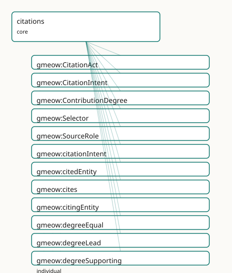

<!-- GENERATED by gmeow ontology-docs. DO NOT EDIT. -->

# GMEOW Citations Module

- **IRI:** <https://blackcatinformatics.ca/gmeow/slices/citations>
- **Tier:** core
- **[`Group`](../reference/classes/gmeow-Group.md):** core

## What This Slice Covers

This slice owns 29 terms and contributes 20 mapping or projection rows. Use it when its terms match the native fact you want to preserve; use the linkage tables to see how those facts leave GMEOW for consumer vocabularies.

## Dependencies

- [`gmeow:slices/documents`](documents.md)
- [`gmeow:slices/evidence`](evidence.md)
- [`gmeow:slices/kernel`](kernel.md)

## Consumers

- The citation/credit dogfood (source/claim refactor): CITATION.cff and slice-manifest credit projection, CrossRef and CiTO/CRediT/PROV-O/PAV alignment by reference, genealogical evidence links ([`CitationAct`](../reference/classes/gmeow-CitationAct.md) via a [`Selector`](../reference/classes/gmeow-Selector.md)), and scholarly citation graphs.

## Local Map



## Examples

### Citation Act

- **Source:** [`slices/core/citations/examples/citation-act.ttl`](https://github.com/Blackcat-Informatics/gmeow-ontology/blob/main/slices/core/citations/examples/citation-act.ttl)
- **GMEOW terms:** [`gmeow:CitationAct`](../reference/classes/gmeow-CitationAct.md), [`gmeow:CreativeWork`](../reference/classes/gmeow-CreativeWork.md), [`gmeow:Selector`](../reference/classes/gmeow-Selector.md), [`gmeow:citationIntent`](../reference/properties/gmeow-citationIntent.md), [`gmeow:citedEntity`](../reference/properties/gmeow-citedEntity.md), [`gmeow:cites`](../reference/properties/gmeow-cites.md), [`gmeow:citingEntity`](../reference/properties/gmeow-citingEntity.md), [`gmeow:intentUsesMethodIn`](../reference/individuals/gmeow-intentUsesMethodIn.md), [`gmeow:selectorPage`](../reference/properties/gmeow-selectorPage.md), [`gmeow:selectorTextQuote`](../reference/properties/gmeow-selectorTextQuote.md)

```turtle
# SPDX-FileCopyrightText: 2026 Blackcat Informatics® Inc. <paudley@blackcatinformatics.ca>
# SPDX-License-Identifier: CC-BY-4.0
#
# Worked example: citation is flat-first, reified on demand ( P4 — the same
# promotion pattern as rights). A bare gmeow:cites edge covers "A references B".
# When the citation's INTENT and exact LOCATION matter, it is promoted to a
# gmeow:CitationAct relator binding gmeow:citingEntity × gmeow:citedEntity ×
# gmeow:citationIntent, pinned to a precise gmeow:Selector (page + verbatim quote)
# via gmeow:viaSelector. gmeow:cites pairsWith gmeow:CitationAct: the flat edge
# and its reification name the same fact at two levels of detail.
@prefix gmeow: <https://blackcatinformatics.ca/gmeow/> .
@prefix ex:    <https://blackcatinformatics.ca/gmeow/examples/citations/> .

ex:myPaper a gmeow:CreativeWork ;
    gmeow:title "On Coastal Erosion in Temperate Estuaries"@en ;
    gmeow:cites ex:citedPaper .

ex:citedPaper a gmeow:CreativeWork ;
    gmeow:title "Sediment Transport Models"@en .

# --- The reified act: not just THAT it cites, but WHY (uses a method from it)
#     and WHERE (the exact passage the method appears in).
ex:cite1 a gmeow:CitationAct ;
    gmeow:citingEntity   ex:myPaper ;
    gmeow:citedEntity    ex:citedPaper ;
    gmeow:citationIntent gmeow:intentUsesMethodIn ;
    gmeow:viaSelector    ex:sel1 .

ex:sel1 a gmeow:Selector ;
    gmeow:selectorPage      "42" ;
    gmeow:selectorTextQuote "the modified Exner equation for bed evolution" .
```

## Terms

### Classes

| Term | Label | Definition |
|---|---|---|
| [`gmeow:CitationAct`](../reference/classes/gmeow-CitationAct.md) | Citation Act | A reified citation: a citing entity cites a cited entity with a typed intent, optionally via a selector (a pinpoint into the cited work), carrying provenance,... |
| [`gmeow:CitationIntent`](../reference/classes/gmeow-CitationIntent.md) | Citation Intent | The intent with which one entity cites another — a VALUE vocabulary (individuals, never subclasses) characterizing a [`gmeow:CitationAct`](../reference/classes/gmeow-CitationAct.md). Bridged by reference to... |
| [`gmeow:ContributionDegree`](../reference/classes/gmeow-ContributionDegree.md) | Contribution Degree | The degree or weight of a contribution — a VALUE vocabulary (individuals, never subclasses) characterizing a [`gmeow:Contribution`](../reference/classes/gmeow-Contribution.md). Lead, equal, and supporting ar... |
| [`gmeow:Selector`](../reference/classes/gmeow-Selector.md) | Selector | A pinpoint reference into a cited creative work — a page number, text position, text quote, or generic locator. Replaces the retired gmeow:Citation (which coll... |
| [`gmeow:SourceRole`](../reference/classes/gmeow-SourceRole.md) | Source Role | The anti-rigid role of being a source — borne by a [`gmeow:CreativeWork`](../reference/classes/gmeow-CreativeWork.md) when it is used as evidence for a claim. A thing is only contingently a source; the same... |

### Properties

| Term | Label | Definition |
|---|---|---|
| [`gmeow:citationIntent`](../reference/properties/gmeow-citationIntent.md) | citation intent | The intent with which the citation is made — a value from the open [`gmeow:CitationIntent`](../reference/classes/gmeow-CitationIntent.md) vocabulary. Functional per relator: one intent per CitationAct. |
| [`gmeow:citedEntity`](../reference/properties/gmeow-citedEntity.md) | cited entity | The creative work that is cited — a Work, Expression, Manifestation, or Item. Functional per relator: one cited entity per CitationAct. |
| [`gmeow:cites`](../reference/properties/gmeow-cites.md) | cites | Relates an entity to a creative work it cites — the flat 80%-case shortcut. Non-functional: an entity may cite many works. Promote to a [`gmeow:CitationAct`](../reference/classes/gmeow-CitationAct.md) node... |
| [`gmeow:citingEntity`](../reference/properties/gmeow-citingEntity.md) | citing entity | The entity that makes the citation — a claim, a work, a module, a dataset. Functional per relator: one citing entity per CitationAct. |
| [`gmeow:isReferencedBy`](../reference/properties/gmeow-isReferencedBy.md) | is referenced by | A related resource that references, cites, or otherwise points to the described resource. Inverse of [`gmeow:references`](../reference/properties/gmeow-references.md). |
| [`gmeow:references`](../reference/properties/gmeow-references.md) | references | A related resource that is referenced, cited, or otherwise pointed to by the described resource. (RFC 5322 References for messages; bibliographic references fo... |
| [`gmeow:selectorLocator`](../reference/properties/gmeow-selectorLocator.md) | selector locator | A generic locator string within a cited work (e.g. 'section 3.2', 'image 4', 'entry 17'), expressed as a literal within a selector. |
| [`gmeow:selectorPage`](../reference/properties/gmeow-selectorPage.md) | selector page | A page number or page range expressed as a literal within a selector. |
| [`gmeow:selectorTextPosition`](../reference/properties/gmeow-selectorTextPosition.md) | selector text position | A character offset or text position within a cited work, expressed as a literal within a selector. |
| [`gmeow:selectorTextQuote`](../reference/properties/gmeow-selectorTextQuote.md) | selector text quote | A verbatim text quote from the cited work, expressed as a literal within a selector. |
| [`gmeow:viaSelector`](../reference/properties/gmeow-viaSelector.md) | via selector | An optional pinpoint selector into the cited work — a page, text position, text quote, or locator. Non-functional: a citation may reference multiple selectors... |

### Individuals

| Term | Label | Definition |
|---|---|---|
| [`gmeow:degreeEqual`](../reference/individuals/gmeow-degreeEqual.md) | equal | The contributor contributed equally. |
| [`gmeow:degreeLead`](../reference/individuals/gmeow-degreeLead.md) | lead | The contributor led the effort. |
| [`gmeow:degreeSupporting`](../reference/individuals/gmeow-degreeSupporting.md) | supporting | The contributor supported the effort in a secondary capacity. |
| [`gmeow:intentBridgedByReference`](../reference/individuals/gmeow-intentBridgedByReference.md) | bridged by reference | The cited work is bridged by reference — aligned to but not imported as axioms ([Principle 5](https://github.com/Blackcat-Informatics/gmeow-ontology/blob/main/CONSTITUTION.md#principle-5)). |
| [`gmeow:intentCitesAsDataSource`](../reference/individuals/gmeow-intentCitesAsDataSource.md) | cites as data source | The cited work is used as a data source. |
| [`gmeow:intentConformsTo`](../reference/individuals/gmeow-intentConformsTo.md) | conforms to | The citing entity conforms to the cited work (a standard, schema, or specification). |
| [`gmeow:intentDerivedFrom`](../reference/individuals/gmeow-intentDerivedFrom.md) | derived from | The citing entity is derived from the cited work. |
| [`gmeow:intentDisagreesWith`](../reference/individuals/gmeow-intentDisagreesWith.md) | disagrees with | The citing entity disagrees with the cited work. |
| [`gmeow:intentDocuments`](../reference/individuals/gmeow-intentDocuments.md) | documents | The citing entity documents the cited work. |
| [`gmeow:intentExtends`](../reference/individuals/gmeow-intentExtends.md) | extends | The citing entity extends the cited work. |
| [`gmeow:intentIsInspiredBy`](../reference/individuals/gmeow-intentIsInspiredBy.md) | is inspired by | The citing entity is inspired by the cited work. |
| [`gmeow:intentSupports`](../reference/individuals/gmeow-intentSupports.md) | supports | The cited work supports the citing entity. |
| [`gmeow:intentUsesMethodIn`](../reference/individuals/gmeow-intentUsesMethodIn.md) | uses method in | The cited work provides a method used by the citing entity. |

## Linkages

- **Rows:** 20
- **Projection profiles:** `dcterms`, `oai_dc`
- **External vocabularies:** `cito`, `dc`, `dcterms`, `gxv`, `nmo`, `oa`, `schema`

| Source | Kind | Profile | Predicate/Relation | Target | Evidence |
|---|---|---|---|---|---|
| [`gmeow:CitationAct`](../reference/classes/gmeow-CitationAct.md) | equivalence | `-` | [skos:relatedMatch](http://www.w3.org/2004/02/skos/core#relatedMatch) | [schema:citation](https://schema.org/citation) | `gmeow-evidence.sssom.tsv`; `gmeow:eqEvidence006`; confidence 0.6 |
| [`gmeow:Selector`](../reference/classes/gmeow-Selector.md) | equivalence | `-` | [skos:closeMatch](http://www.w3.org/2004/02/skos/core#closeMatch) | [gxv:SourceReference](http://gedcomx.org/v1/SourceReference) | `gmeow-genealogy.sssom.tsv`; `gmeow:eqGenealogy052`; confidence 0.85 |
| [`gmeow:Selector`](../reference/classes/gmeow-Selector.md) | equivalence | `-` | [skos:closeMatch](http://www.w3.org/2004/02/skos/core#closeMatch) | [oa:Selector](http://www.w3.org/ns/oa#Selector) | `gmeow-citations.sssom.tsv`; `gmeow:eqCit011`; confidence 0.95 |
| [`gmeow:cites`](../reference/properties/gmeow-cites.md) | equivalence | `-` | [owl:equivalentProperty](http://www.w3.org/2002/07/owl#equivalentProperty) | [cito:cites](http://purl.org/spar/cito/cites) | `gmeow-citations.sssom.tsv`; `gmeow:eqCit001`; confidence 1 |
| [`gmeow:intentCitesAsDataSource`](../reference/individuals/gmeow-intentCitesAsDataSource.md) | equivalence | `-` | [skos:closeMatch](http://www.w3.org/2004/02/skos/core#closeMatch) | [cito:citesAsDataSource](http://purl.org/spar/cito/citesAsDataSource) | `gmeow-citations.sssom.tsv`; `gmeow:eqCit002`; confidence 0.95 |
| [`gmeow:intentConformsTo`](../reference/individuals/gmeow-intentConformsTo.md) | equivalence | `-` | [skos:closeMatch](http://www.w3.org/2004/02/skos/core#closeMatch) | [cito:obtainsSupportFrom](http://purl.org/spar/cito/obtainsSupportFrom) | `gmeow-citations.sssom.tsv`; `gmeow:eqCit006`; confidence 0.85 |
| [`gmeow:intentDerivedFrom`](../reference/individuals/gmeow-intentDerivedFrom.md) | equivalence | `-` | [skos:closeMatch](http://www.w3.org/2004/02/skos/core#closeMatch) | [cito:isDerivedFrom](http://purl.org/spar/cito/isDerivedFrom) | `gmeow-citations.sssom.tsv`; `gmeow:eqCit007`; confidence 0.95 |
| [`gmeow:intentDisagreesWith`](../reference/individuals/gmeow-intentDisagreesWith.md) | equivalence | `-` | [skos:closeMatch](http://www.w3.org/2004/02/skos/core#closeMatch) | [cito:disagreesWith](http://purl.org/spar/cito/disagreesWith) | `gmeow-citations.sssom.tsv`; `gmeow:eqCit010`; confidence 0.95 |
| [`gmeow:intentDocuments`](../reference/individuals/gmeow-intentDocuments.md) | equivalence | `-` | [skos:closeMatch](http://www.w3.org/2004/02/skos/core#closeMatch) | [cito:documents](http://purl.org/spar/cito/documents) | `gmeow-citations.sssom.tsv`; `gmeow:eqCit008`; confidence 0.95 |
| [`gmeow:intentExtends`](../reference/individuals/gmeow-intentExtends.md) | equivalence | `-` | [skos:closeMatch](http://www.w3.org/2004/02/skos/core#closeMatch) | [cito:extends](http://purl.org/spar/cito/extends) | `gmeow-citations.sssom.tsv`; `gmeow:eqCit004`; confidence 0.95 |
| [`gmeow:intentIsInspiredBy`](../reference/individuals/gmeow-intentIsInspiredBy.md) | equivalence | `-` | [skos:closeMatch](http://www.w3.org/2004/02/skos/core#closeMatch) | [cito:isInspiredBy](http://purl.org/spar/cito/isInspiredBy) | `gmeow-citations.sssom.tsv`; `gmeow:eqCit005`; confidence 0.95 |
| [`gmeow:intentSupports`](../reference/individuals/gmeow-intentSupports.md) | equivalence | `-` | [skos:closeMatch](http://www.w3.org/2004/02/skos/core#closeMatch) | [cito:providesSupportFor](http://purl.org/spar/cito/providesSupportFor) | `gmeow-citations.sssom.tsv`; `gmeow:eqCit009`; confidence 0.9 |
| [`gmeow:intentUsesMethodIn`](../reference/individuals/gmeow-intentUsesMethodIn.md) | equivalence | `-` | [skos:closeMatch](http://www.w3.org/2004/02/skos/core#closeMatch) | [cito:usesMethodIn](http://purl.org/spar/cito/usesMethodIn) | `gmeow-citations.sssom.tsv`; `gmeow:eqCit003`; confidence 0.95 |
| [`gmeow:isReferencedBy`](../reference/properties/gmeow-isReferencedBy.md) | equivalence | `-` | [skos:closeMatch](http://www.w3.org/2004/02/skos/core#closeMatch) | [dcterms:isReferencedBy](http://purl.org/dc/terms/isReferencedBy) | `gmeow-dublin-core.sssom.tsv`; `gmeow:eqDcTerms016`; confidence 0.85 |
| [`gmeow:references`](../reference/properties/gmeow-references.md) | equivalence | `-` | [skos:closeMatch](http://www.w3.org/2004/02/skos/core#closeMatch) | [dcterms:references](http://purl.org/dc/terms/references) | `gmeow-dublin-core.sssom.tsv`; `gmeow:eqDcTerms015`; confidence 0.85 |
| [`gmeow:references`](../reference/properties/gmeow-references.md) | equivalence | `-` | [skos:closeMatch](http://www.w3.org/2004/02/skos/core#closeMatch) | [nmo:references](http://www.semanticdesktop.org/ontologies/2007/03/22/nmo#references) | `gmeow-email.sssom.tsv`; `gmeow:eqEmail024`; confidence 0.95 |
| [`gmeow:isReferencedBy`](../reference/properties/gmeow-isReferencedBy.md) | projection | `dcterms` | projects to / = | [dcterms:isReferencedBy](http://purl.org/dc/terms/isReferencedBy) | `gmeow:mapDctermsIsReferencedBy`; confidence 0.85 |
| [`gmeow:isReferencedBy`](../reference/properties/gmeow-isReferencedBy.md) | projection | `oai_dc` | projects to / <= | [dc:relation](http://purl.org/dc/elements/1.1/relation) | `gmeow:mapOaiDcIsReferencedBy`; confidence 0.7; lossy: all relation refinements collapse to [dc:relation](http://purl.org/dc/elements/1.1/relation) |
| [`gmeow:references`](../reference/properties/gmeow-references.md) | projection | `dcterms` | projects to / = | [dcterms:references](http://purl.org/dc/terms/references) | `gmeow:mapDctermsReferences`; confidence 0.85 |
| [`gmeow:references`](../reference/properties/gmeow-references.md) | projection | `oai_dc` | projects to / <= | [dc:relation](http://purl.org/dc/elements/1.1/relation) | `gmeow:mapOaiDcReferences`; confidence 0.7; lossy: all relation refinements collapse to [dc:relation](http://purl.org/dc/elements/1.1/relation) |

## Guide

<!-- SPDX-FileCopyrightText: 2026 Blackcat Informatics® Inc. <paudley@blackcatinformatics.ca> -->
<!-- SPDX-License-Identifier: CC-BY-4.0 -->

# Citations — who cites what, why, and exactly where

> **Slice:** `https://blackcatinformatics.ca/gmeow/slices/citations` · **tier: core**
> The universal citation, credit, and attribution facility: every "see source X" in the model is one of these.

Citation, credit, and attribution — the universal [`CitationAct`](../reference/classes/gmeow-CitationAct.md) relator, [`Contribution`](../reference/classes/gmeow-Contribution.md) degree, and selector vocabulary. Replaces the old sources.ttl evidence link with a typed, reified citation relator and an anti-rigid [`SourceRole`](../reference/classes/gmeow-SourceRole.md). Bridges to CiTO, CRediT, [PROV-O](../external/ontologies.md#target-prov), and PAV by reference ([Principle 5](https://github.com/Blackcat-Informatics/gmeow-ontology/blob/main/CONSTITUTION.md#principle-5)).

A citation is not a bare edge — it is an *act*, with an author, an intent, and a pinpoint.
The slice is flat-first: [`gmeow:cites`](../reference/properties/gmeow-cites.md) covers the 80 % case, and the machine-readable
[`gmeow:pairsWith`](../reference/properties/gmeow-pairsWith.md) assertion (`cites` ↔ [`CitationAct`](../reference/classes/gmeow-CitationAct.md)) tells tooling exactly which relator
to promote to when intent, selector, provenance, or standpoint must be recorded. The
*why* of a citation is a value from the open, CiTO-shaped [`gmeow:CitationIntent`](../reference/classes/gmeow-CitationIntent.md)
vocabulary ([Principle 9](https://github.com/Blackcat-Informatics/gmeow-ontology/blob/main/CONSTITUTION.md#principle-9) — individuals, never subclasses), and the *where* is a
[`gmeow:Selector`](../reference/classes/gmeow-Selector.md) — a pinpoint that specializes the evidence-span mechanism rather than
reinventing it. This is also the most aggressively dogfooded slice in GMEOW: the
project's own credit model and CITATION.cff projection ride this machinery (source/claim refactor).

The rubrics facility (extensions/norms) extends the relator rather than forking it:
[`gmeow:Exemplar`](../reference/classes/gmeow-Exemplar.md) is a SubKind of [`gmeow:CitationAct`](../reference/classes/gmeow-CitationAct.md) — a citation with polarity that
holds the cited span up as a positive, negative, or cautionary example — so the CiTO
alignment arrives there for free.

## The citation relator

### [`gmeow:CitationAct`](../reference/classes/gmeow-CitationAct.md)

The reified citation: a citing entity cites a cited creative work with a typed intent,
optionally via one or more selectors, carrying provenance, confidence, and standpoint.
The promoted form of [`gmeow:cites`](../reference/properties/gmeow-cites.md) ([`gmeow:pairsWith`](../reference/properties/gmeow-pairsWith.md)). Open-world EL restrictions
require some citing entity, cited entity, and intent; closed-world cardinality is
SHACL's. Genealogical evidence is a [`CitationAct`](../reference/classes/gmeow-CitationAct.md) with [`gmeow:intentCitesAsDataSource`](../reference/individuals/gmeow-intentCitesAsDataSource.md)
toward a work, via a selector — the typed replacement for the old hasSource link.

### [`gmeow:cites`](../reference/properties/gmeow-cites.md)

The flat 80 %-case shortcut from any [`gmeow:Entity`](../reference/classes/gmeow-Entity.md) to a [`gmeow:CreativeWork`](../reference/classes/gmeow-CreativeWork.md).
Non-functional. Promote to a [`gmeow:CitationAct`](../reference/classes/gmeow-CitationAct.md) the moment intent, pinpoint,
provenance, or standpoint matters — never bolt those onto the flat triple.

### [`gmeow:citingEntity`](../reference/properties/gmeow-citingEntity.md) · [`gmeow:citedEntity`](../reference/properties/gmeow-citedEntity.md)

The two functional posts of the relator: one citing entity (any [`Entity`](../reference/classes/gmeow-Entity.md) — a claim, a
module, a dataset) and one cited entity (a [`gmeow:CreativeWork`](../reference/classes/gmeow-CreativeWork.md) — any WEMI tier) per
[`CitationAct`](../reference/classes/gmeow-CitationAct.md). Several citations to the same work are several acts, each with its own
intent and selector.

### [`gmeow:citationIntent`](../reference/properties/gmeow-citationIntent.md) · [`gmeow:CitationIntent`](../reference/classes/gmeow-CitationIntent.md)

The typed *why* — a functional pointer into an open value vocabulary bridged by
reference to CiTO sub-properties ([`cito:citesAsDataSource`](http://purl.org/spar/cito/citesAsDataSource) and kin, [Principle 5](https://github.com/Blackcat-Informatics/gmeow-ontology/blob/main/CONSTITUTION.md#principle-5)). Seeds
run from [`gmeow:intentCitesAsDataSource`](../reference/individuals/gmeow-intentCitesAsDataSource.md) through [`gmeow:intentDisagreesWith`](../reference/individuals/gmeow-intentDisagreesWith.md) to
[`gmeow:intentBridgedByReference`](../reference/individuals/gmeow-intentBridgedByReference.md) — the last being the intent GMEOW itself uses to record
its own Principle-5 alignments. A new intent is a fresh individual, never a subclass.

### [`gmeow:viaSelector`](../reference/properties/gmeow-viaSelector.md) · [`gmeow:Selector`](../reference/classes/gmeow-Selector.md)

The pinpoint into the cited work: page ([`gmeow:selectorPage`](../reference/properties/gmeow-selectorPage.md)), character position,
verbatim quote, or generic locator. Non-functional — one citation may span several
pages. [`Selector`](../reference/classes/gmeow-Selector.md) is a specialization of [`gmeow:EvidenceSpan`](../reference/classes/gmeow-EvidenceSpan.md) ([`EvidenceSpan`](../reference/classes/gmeow-EvidenceSpan.md) audit machinery) and is reused
by the annotation target span (annotation target span); it replaces the retired `gmeow:Citation`
class that collided with scholarly citation.

## Credit and source-hood

### [`gmeow:ContributionDegree`](../reference/classes/gmeow-ContributionDegree.md)

The weight of a contribution — an open value vocabulary ([Principle 9](https://github.com/Blackcat-Informatics/gmeow-ontology/blob/main/CONSTITUTION.md#principle-9)) characterizing
the universal [`gmeow:Contribution`](../reference/classes/gmeow-Contribution.md) relator: [`gmeow:degreeLead`](../reference/individuals/gmeow-degreeLead.md), [`gmeow:degreeEqual`](../reference/individuals/gmeow-degreeEqual.md),
[`gmeow:degreeSupporting`](../reference/individuals/gmeow-degreeSupporting.md) as seeds, CRediT-shaped, projected to CITATION.cff and
CrossRef contributor metadata (source/claim refactor).

### [`gmeow:SourceRole`](../reference/classes/gmeow-SourceRole.md)

The anti-rigid RoleMixin of *being a source*: a [`CreativeWork`](../reference/classes/gmeow-CreativeWork.md) is only contingently a
source — evidence for one claim, subject of another, a work in its own right
throughout. Source-hood is primarily relator-mediated via [`CitationAct`](../reference/classes/gmeow-CitationAct.md); [`SourceRole`](../reference/classes/gmeow-SourceRole.md) is
the named handle for the rare case that needs one. Nothing is a source by kind.

### [`gmeow:references`](../reference/properties/gmeow-references.md) · [`gmeow:isReferencedBy`](../reference/properties/gmeow-isReferencedBy.md)

The generic flat [`Entity`](../reference/classes/gmeow-Entity.md)→[`Entity`](../reference/classes/gmeow-Entity.md) reference pair, gathered here by the dependency surgery
of slice-dependency doctrine: one definition serves RFC 5322 message threading and bibliographic
referencing alike. The flat-first companion of the typed machinery above — promote when
kind, locus, or standpoint matters.

## Solver layer & deferred alignment

Citation *analytics* — counting, ranking, co-citation clustering, credit rollups — are
solver-layer computations ([Principle 12](https://github.com/Blackcat-Informatics/gmeow-ontology/blob/main/CONSTITUTION.md#principle-12)): the slice records the acts; it never asserts
derived metrics as facts. CiTO, CRediT, [PROV-O](../external/ontologies.md#target-prov), and PAV remain bridges by reference,
never axiom imports ([Principle 5](https://github.com/Blackcat-Informatics/gmeow-ontology/blob/main/CONSTITUTION.md#principle-5)); the rubrics-facility projections (EARL, DQV,
schema.org Rating) arrive free through [`Exemplar`](../reference/classes/gmeow-Exemplar.md) ⊑ [`CitationAct`](../reference/classes/gmeow-CitationAct.md) and are deferred to the
compiler-arc window.

## Dependencies

Depends on `kernel`, `documents` (the [`CreativeWork`](../reference/classes/gmeow-CreativeWork.md) range), and `evidence` (the
[`EvidenceSpan`](../reference/classes/gmeow-EvidenceSpan.md) that [`Selector`](../reference/classes/gmeow-Selector.md) specializes). Consumed by the citation/credit dogfood
(source/claim refactor), slice manifests, and the norms extension's [`Exemplar`](../reference/classes/gmeow-Exemplar.md).
