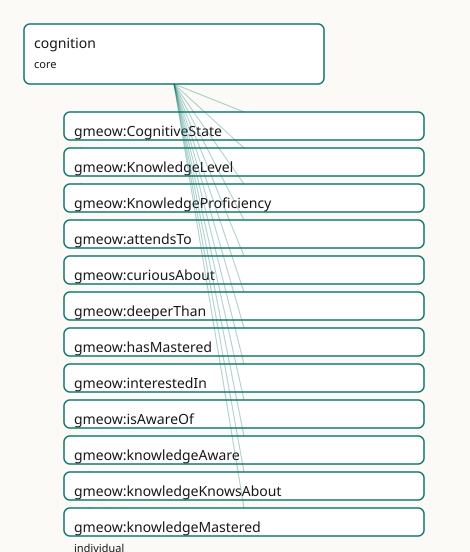

<!-- GENERATED by gmeow ontology-docs. DO NOT EDIT. -->

# GMEOW Cognition Module

- **IRI:** <https://blackcatinformatics.ca/gmeow/slices/cognition>
- **Tier:** core
- **[`Group`](../reference/classes/gmeow-Group.md):** core

## What This Slice Covers

This slice owns 24 terms and contributes 1 mapping or projection rows. Use it when its terms match the native fact you want to preserve; use the linkage tables to see how those facts leave GMEOW for consumer vocabularies.

## Dependencies

- [`gmeow:slices/kernel`](kernel.md)
- [`gmeow:slices/temporal`](temporal.md)

## Consumers

- The transpiler's expertise up-projection: [schema:knowsAbout](https://schema.org/knowsAbout) lifts to the asserted [`gmeow:knowsAbout`](../reference/properties/gmeow-knowsAbout.md) level of the knowledge spectrum, preserving the QID-anchored subject (the agent-memory flagship records what an agent knows across sessions — [Principle 14](https://github.com/Blackcat-Informatics/gmeow-ontology/blob/main/CONSTITUTION.md#principle-14)). The reified tier — [`gmeow:KnowledgeProficiency`](../reference/classes/gmeow-KnowledgeProficiency.md) (a [gufo:Relator](../external/terms.md#gufo-relator) mirroring [`SkillProficiency`](../reference/classes/gmeow-SkillProficiency.md)) over the [`gmeow:KnowledgeLevel`](../reference/classes/gmeow-KnowledgeLevel.md) ordinal axis, grounded in the [`gmeow:CognitiveState`](../reference/classes/gmeow-CognitiveState.md) mode under the kernel [`gmeow:MentalMoment`](../reference/classes/gmeow-MentalMoment.md) umbrella — lets the flagship record graded, scaled, time-scoped, standpoint-indexed knowing; attention, interest, and objectual memory-of round it out. Belief/justification epistemics land in the sibling epistemics slice.

## Local Map



## Examples

### Attention Interest Memory

- **Source:** [`slices/core/cognition/examples/attention-interest-memory.ttl`](https://github.com/Blackcat-Informatics/gmeow-ontology/blob/main/slices/core/cognition/examples/attention-interest-memory.ttl)
- **GMEOW terms:** [`gmeow:MemoryItem`](../reference/classes/gmeow-MemoryItem.md), [`gmeow:Person`](../reference/classes/gmeow-Person.md), [`gmeow:attendsTo`](../reference/properties/gmeow-attendsTo.md), [`gmeow:curiousAbout`](../reference/properties/gmeow-curiousAbout.md), [`gmeow:displayable`](../reference/properties/gmeow-displayable.md), [`gmeow:interestedIn`](../reference/properties/gmeow-interestedIn.md), [`gmeow:isAwareOf`](../reference/properties/gmeow-isAwareOf.md), [`gmeow:memoryKind`](../reference/properties/gmeow-memoryKind.md), [`gmeow:memoryKindEpisodic`](../reference/individuals/gmeow-memoryKindEpisodic.md), [`gmeow:memoryOf`](../reference/properties/gmeow-memoryOf.md)
- **External prefixes:** `wd`

```turtle
# SPDX-FileCopyrightText: 2026 Blackcat Informatics® Inc. <paudley@blackcatinformatics.ca>
# SPDX-License-Identifier: CC-BY-4.0
#
# Worked example (the further objectual cognitive relations. An agent
# records not only WHAT it knows but what it ATTENDS to, is CURIOUS about, and
# REMEMBERS about a subject — the salience/recall surface for the agent-memory
# flagship (Principle 15). These are attentional/affective pulls, NOT goals: the
# boundary to teleology:Desire is documented, never bridged (Principle 9).
# Forgetting is suppression (gmeow:displayable false), never deletion (Principle 10).
@prefix gmeow: <https://blackcatinformatics.ca/gmeow/> .
@prefix ex:    <https://blackcatinformatics.ca/gmeow/examples/cognition/> .
@prefix wd:    <http://www.wikidata.org/entity/> .

ex:nova a gmeow:Person ;
    gmeow:name        "Nova"@en ;
    gmeow:attendsTo    wd:Q11660 ;    # artificial intelligence — currently in focus
    gmeow:interestedIn wd:Q395 ;      # mathematics — sustained interest
    gmeow:curiousAbout wd:Q217413 ;   # category theory (curiousAbout ⊑ interestedIn)
    gmeow:remembers    wd:Q192995 .   # quantum computing — a subject she remembers (remembers ⊑ isAwareOf)

# curiousAbout entails interestedIn (subproperty); remembers entails isAwareOf —
# a reasoner derives ex:nova gmeow:isAwareOf wd:Q192995 from the remembers edge.

# --- Suppression, not deletion (Principle 10): forgetting, via the documented
#     remembers ↔ gmeow:MemoryItem bridge . Nova's remembering of a subject is
#     BACKED by MemoryItem(s) about it; a faded memory is the MemoryItem marked
#     gmeow:displayable false — retained for "what she remembered WHEN", never erased.
#     The bridge is prose, so cognition adds no dependency on the ai slice (Principle 9).
ex:novaWorkshopMemory a gmeow:MemoryItem ;   # propositional backing of a now-faded remembering of wd:Q189436 (bioinformatics)
    gmeow:memoryOf     ex:nova ;
    gmeow:memoryKind   gmeow:memoryKindEpisodic ;
    gmeow:displayable  false .               # forgotten — withheld, not deleted
```

### Dunning Kruger

- **Source:** [`slices/core/cognition/examples/dunning-kruger.ttl`](https://github.com/Blackcat-Informatics/gmeow-ontology/blob/main/slices/core/cognition/examples/dunning-kruger.ttl)
- **GMEOW terms:** [`gmeow:KnowledgeLevel`](../reference/classes/gmeow-KnowledgeLevel.md), [`gmeow:KnowledgeProficiency`](../reference/classes/gmeow-KnowledgeProficiency.md), [`gmeow:Person`](../reference/classes/gmeow-Person.md), [`gmeow:accordingTo`](../reference/properties/gmeow-accordingTo.md), [`gmeow:deeperThan`](../reference/properties/gmeow-deeperThan.md), [`gmeow:knowledgeKnowsAbout`](../reference/individuals/gmeow-knowledgeKnowsAbout.md), [`gmeow:knowledgeMastered`](../reference/individuals/gmeow-knowledgeMastered.md), [`gmeow:knowledgeProficiencyAgent`](../reference/properties/gmeow-knowledgeProficiencyAgent.md), [`gmeow:knowledgeProficiencyLevel`](../reference/properties/gmeow-knowledgeProficiencyLevel.md), [`gmeow:knowledgeProficiencyScale`](../reference/properties/gmeow-knowledgeProficiencyScale.md)
- **External prefixes:** `wd`

```turtle
# SPDX-FileCopyrightText: 2026 Blackcat Informatics® Inc. <paudley@blackcatinformatics.ca>
# SPDX-License-Identifier: CC-BY-4.0
#
# Worked example: the Dunning–Kruger case, modelled as COEXISTING standpoint-indexed
# claims (Principle 9), never a global verdict. Sam self-assesses MASTERY of
# quantum computing; an external assessor rates the same knowledge merely as KNOWS-ABOUT.
# Two gmeow:KnowledgeProficiency relators over the same (agent, subject), at
# divergent gmeow:KnowledgeLevel values, each indexed by gmeow:accordingTo to a
# different vantage. GMEOW records the disagreement; it does not adjudicate it.
@prefix gmeow: <https://blackcatinformatics.ca/gmeow/> .
@prefix ex:    <https://blackcatinformatics.ca/gmeow/examples/cognition/> .
@prefix wd:    <http://www.wikidata.org/entity/> .

ex:sam      a gmeow:Person ; gmeow:name "Sam"@en .
ex:assessor a gmeow:Person ; gmeow:name "External Assessor"@en .

# --- Self-attributed: Sam, by Sam's own lights, has MASTERED quantum computing.
ex:samQuantumSelf a gmeow:KnowledgeProficiency ;
    gmeow:knowledgeProficiencyAgent   ex:sam ;
    gmeow:knowledgeProficiencySubject wd:Q192995 ;         # quantum computing
    gmeow:knowledgeProficiencyLevel   gmeow:knowledgeMastered ;
    gmeow:knowledgeProficiencyScale   gmeow:scaleKnowledgeDepth ;
    gmeow:accordingTo                 ex:sam .             # self-attributed vantage

# --- Observer-attributed: the assessor, on the same scale, rates the SAME knowing
#     of the SAME subject only as KNOWS-ABOUT. Lower depth, coexisting claim.
ex:samQuantumAssessed a gmeow:KnowledgeProficiency ;
    gmeow:knowledgeProficiencyAgent   ex:sam ;
    gmeow:knowledgeProficiencySubject wd:Q192995 ;         # quantum computing
    gmeow:knowledgeProficiencyLevel   gmeow:knowledgeKnowsAbout ;
    gmeow:knowledgeProficiencyScale   gmeow:scaleKnowledgeDepth ;
    gmeow:accordingTo                 ex:assessor .        # observer-attributed vantage

# Both relators stand. gmeow:knowledgeMastered gmeow:deeperThan gmeow:knowledgeKnowsAbout
# (transitively, on the LEVELS) quantifies the gap — but the relators themselves are
# never ordered by gmeow:deeperThan, and neither claim is promoted to a fact: the
# divergence is the data (Principle 9).
```

### Knowledge Proficiency

- **Source:** [`slices/core/cognition/examples/knowledge-proficiency.ttl`](https://github.com/Blackcat-Informatics/gmeow-ontology/blob/main/slices/core/cognition/examples/knowledge-proficiency.ttl)
- **GMEOW terms:** [`gmeow:CognitiveState`](../reference/classes/gmeow-CognitiveState.md), [`gmeow:Instant`](../reference/classes/gmeow-Instant.md), [`gmeow:KnowledgeProficiency`](../reference/classes/gmeow-KnowledgeProficiency.md), [`gmeow:Person`](../reference/classes/gmeow-Person.md), [`gmeow:TimeInterval`](../reference/classes/gmeow-TimeInterval.md), [`gmeow:displayable`](../reference/properties/gmeow-displayable.md), [`gmeow:hasEndInstant`](../reference/properties/gmeow-hasEndInstant.md), [`gmeow:hasMastered`](../reference/properties/gmeow-hasMastered.md), [`gmeow:hasStartInstant`](../reference/properties/gmeow-hasStartInstant.md), [`gmeow:hasTemporalFrame`](../reference/properties/gmeow-hasTemporalFrame.md)
- **External prefixes:** `wd`, `xsd`

```turtle
# SPDX-FileCopyrightText: 2026 Blackcat Informatics® Inc. <paudley@blackcatinformatics.ca>
# SPDX-License-Identifier: CC-BY-4.0
#
# Worked example: the reified knowledge tier. The flat spectrum (gmeow:hasMastered
# &c.) says HOW DEEP; the reified gmeow:KnowledgeProficiency adds the SCALE it is
# read against, a temporal interval, and a standpoint — the promotion path when
# level, scale, time, or vantage matters (Principle 4). Suppression, not deletion:
# lapsed knowledge is a CLOSED interval with gmeow:displayable false, never removed
# (Principle 10). The mode (gmeow:CognitiveState) and the relator
# (gmeow:KnowledgeProficiency) are DIFFERENT individuals — never double-typed.
@prefix gmeow: <https://blackcatinformatics.ca/gmeow/> .
@prefix ex:    <https://blackcatinformatics.ca/gmeow/examples/cognition/> .
@prefix wd:    <http://www.wikidata.org/entity/> .
@prefix xsd:   <http://www.w3.org/2001/XMLSchema#> .

ex:ada a gmeow:Person ;
    gmeow:name "Ada"@en ;
    gmeow:hasMastered wd:Q28865 .   # Python — the flat 80% surface

# --- Promote to a reified proficiency: depth read on an explicit named SCALE,
#     over a temporal interval. The flat hasMastered above and this relator
#     coexist; gmeow:pairsWith links the two forms.
ex:adaPython a gmeow:KnowledgeProficiency ;
    gmeow:knowledgeProficiencyAgent    ex:ada ;
    gmeow:knowledgeProficiencySubject  wd:Q28865 ;       # Python
    gmeow:knowledgeProficiencyLevel    gmeow:knowledgeMastered ;
    gmeow:knowledgeProficiencyScale    gmeow:scaleKnowledgeDepth ;
    gmeow:knowledgeProficiencyInterval ex:adaPythonSince ;
    gmeow:displayable true .

# The grounding mode is a SEPARATE individual (a gmeow:CognitiveState), never the
# same node as the relator — founded-on is documentation, not a type (Principle 12).
ex:adaPythonKnowing a gmeow:CognitiveState .

ex:adaPythonSince a gmeow:TimeInterval ;
    gmeow:hasStartInstant ex:y2018 ;
    gmeow:hasTemporalFrame gmeow:temporalFrameUTCGregorian .

# --- Suppression, not deletion (Principle 10): Ada once understood a framework she
#     has since let lapse. The proficiency is RETAINED with a CLOSED interval and
#     gmeow:displayable false — what she knew WHEN stays a query, not an erasure.
ex:adaBioinf a gmeow:KnowledgeProficiency ;
    gmeow:knowledgeProficiencyAgent    ex:ada ;
    gmeow:knowledgeProficiencySubject  wd:Q189436 ;      # bioinformatics
    gmeow:knowledgeProficiencyLevel    gmeow:knowledgeUnderstands ;
    gmeow:knowledgeProficiencyScale    gmeow:scaleKnowledgeDepth ;
    gmeow:knowledgeProficiencyInterval ex:adaBioinfPast ;
    gmeow:displayable false .                            # lapsed — withheld, not deleted

ex:adaBioinfPast a gmeow:TimeInterval ;
    gmeow:hasStartInstant ex:y2014 ;
    gmeow:hasEndInstant   ex:y2018 ;
    gmeow:hasTemporalFrame gmeow:temporalFrameUTCGregorian .

ex:y2014 a gmeow:Instant ; gmeow:instantValue "2014-01-01T00:00:00Z"^^xsd:dateTime ;
    gmeow:inTemporalFrame gmeow:temporalFrameUTCGregorian .
ex:y2018 a gmeow:Instant ; gmeow:instantValue "2018-01-01T00:00:00Z"^^xsd:dateTime ;
    gmeow:inTemporalFrame gmeow:temporalFrameUTCGregorian .
```

### Knowledge Spectrum

- **Source:** [`slices/core/cognition/examples/knowledge-spectrum.ttl`](https://github.com/Blackcat-Informatics/gmeow-ontology/blob/main/slices/core/cognition/examples/knowledge-spectrum.ttl)
- **GMEOW terms:** [`gmeow:Person`](../reference/classes/gmeow-Person.md), [`gmeow:hasMastered`](../reference/properties/gmeow-hasMastered.md), [`gmeow:isAwareOf`](../reference/properties/gmeow-isAwareOf.md), [`gmeow:knowsAbout`](../reference/properties/gmeow-knowsAbout.md), [`gmeow:understands`](../reference/properties/gmeow-understands.md)
- **External prefixes:** `wd`

```turtle
# SPDX-FileCopyrightText: 2026 Blackcat Informatics® Inc. <paudley@blackcatinformatics.ca>
# SPDX-License-Identifier: CC-BY-4.0
#
# Worked example: the knowledge spectrum. An agent's epistemic depth toward a
# subject is one of four ordinal levels chained by rdfs:subPropertyOf, so the
# deepest assertion entails every shallower one. Here one agent has MASTERED
# Python (so a reasoner also derives understands / knowsAbout / isAwareOf of it),
# UNDERSTANDS category theory, KNOWS ABOUT bioinformatics, and IS only AWARE OF
# quantum computing. Subjects are wikidata QID entities — the curated bridge.
@prefix gmeow: <https://blackcatinformatics.ca/gmeow/> .
@prefix ex:    <https://blackcatinformatics.ca/gmeow/examples/cognition/> .
@prefix wd:    <http://www.wikidata.org/entity/> .

ex:ada a gmeow:Person ;
    gmeow:hasMastered  wd:Q28865 ;   # Python — entails understands ⊑ knowsAbout ⊑ isAwareOf
    gmeow:understands  wd:Q217413 ;  # category theory
    gmeow:knowsAbout   wd:Q189436 ;  # bioinformatics
    gmeow:isAwareOf    wd:Q192995 .  # quantum computing — bare awareness only

# The subjects are first-class entities identified by their wikidata QID; the
# spectrum says nothing about them beyond that ex:ada stands toward each at the
# stated depth. A reasoner materialises, e.g., ex:ada gmeow:knowsAbout wd:Q28865
# from the hasMastered assertion via the subproperty chain.
```

## Terms

### Classes

| Term | Label | Definition |
|---|---|---|
| [`gmeow:CognitiveState`](../reference/classes/gmeow-CognitiveState.md) | Cognitive State | An agent's intrinsic knowing mode toward a subject — the mental moment grounding the knowledge spectrum and the reified [`gmeow:KnowledgeProficiency`](../reference/classes/gmeow-KnowledgeProficiency.md). The agent-s... |
| [`gmeow:KnowledgeLevel`](../reference/classes/gmeow-KnowledgeLevel.md) | Knowledge Level | The graded epistemic depth of a knowledge-proficiency — an OPEN, ordered value vocabulary (knowledgeAware ≺ knowledgeKnowsAbout ≺ knowledgeUnderstands ≺ knowle... |
| [`gmeow:KnowledgeProficiency`](../reference/classes/gmeow-KnowledgeProficiency.md) | Knowledge Proficiency | A reified, leveled depth-of-knowledge of an agent toward a subject — the [gufo:Relator](../external/terms.md#gufo-relator) binding {agent} × {subject} × {level on a scale} × {interval}, mirroring... |

### Properties

| Term | Label | Definition |
|---|---|---|
| [`gmeow:attendsTo`](../reference/properties/gmeow-attendsTo.md) | attends to | Directed attention or salience of an agent toward a subject — what the agent is currently focused on. NOT a goal: an attentional pull, not a teleology:Desire ... |
| [`gmeow:curiousAbout`](../reference/properties/gmeow-curiousAbout.md) | curious about | An exploratory, knowledge-seeking orientation toward a subject — interest aimed at closing a knowledge gap. A specialization of [`gmeow:interestedIn`](../reference/properties/gmeow-interestedIn.md) (curiosity i... |
| [`gmeow:deeperThan`](../reference/properties/gmeow-deeperThan.md) | deeper than | Orders the knowledge-depth axis: relates a knowledge level to a shallower one it surpasses (knowledgeMastered [`gmeow:deeperThan`](../reference/properties/gmeow-deeperThan.md) knowledgeUnderstands). Transitiv... |
| [`gmeow:hasMastered`](../reference/properties/gmeow-hasMastered.md) | has mastered | Deepest level of the knowledge spectrum: the agent has expert command of the subject and can extend, teach or innovate on it. Entails [`gmeow:understands`](../reference/properties/gmeow-understands.md) (and tr... |
| [`gmeow:interestedIn`](../reference/properties/gmeow-interestedIn.md) | interested in | A motivational orientation of an agent toward a subject — sustained interest that makes the subject worth attending to. An attentional/affective pull, NOT a te... |
| [`gmeow:isAwareOf`](../reference/properties/gmeow-isAwareOf.md) | is aware of | Faintest level of the knowledge spectrum: the agent has encountered the subject and knows it exists, without necessarily knowing facts about it. Entailed by ev... |
| [`gmeow:knowledgeProficiencyAgent`](../reference/properties/gmeow-knowledgeProficiencyAgent.md) | knowledge proficiency agent | The agent whose depth of knowledge a knowledge-proficiency expresses. Functional — constitutive of the proficiency. |
| [`gmeow:knowledgeProficiencyInterval`](../reference/properties/gmeow-knowledgeProficiencyInterval.md) | knowledge proficiency interval | The interval over which a knowledge-proficiency held; closing it (rather than deleting) records lapsed knowledge ([Principle 10](https://github.com/Blackcat-Informatics/gmeow-ontology/blob/main/CONSTITUTION.md#principle-10)). Non-functional. Lighter cases... |
| [`gmeow:knowledgeProficiencyLevel`](../reference/properties/gmeow-knowledgeProficiencyLevel.md) | knowledge proficiency level | The attained ordinal depth of a knowledge-proficiency (a [`gmeow:KnowledgeLevel`](../reference/classes/gmeow-KnowledgeLevel.md): knowledgeAware ≺ knowledgeKnowsAbout ≺ knowledgeUnderstands ≺ knowledgeMastered)... |
| [`gmeow:knowledgeProficiencyScale`](../reference/properties/gmeow-knowledgeProficiencyScale.md) | knowledge proficiency scale | The framework a knowledge-proficiency level is measured on (the native [`gmeow:KnowledgeLevel`](../reference/classes/gmeow-KnowledgeLevel.md) scale, or Bloom's revised / SOLO / Dreyfus as alternates) — a gmeow... |
| [`gmeow:knowledgeProficiencySubject`](../reference/properties/gmeow-knowledgeProficiencySubject.md) | knowledge proficiency subject | The subject a knowledge-proficiency concerns (open range [`gmeow:Entity`](../reference/classes/gmeow-Entity.md): a topic, person, place, or event). Functional — constitutive. |
| [`gmeow:knowsAbout`](../reference/properties/gmeow-knowsAbout.md) | knows about | Second level of the knowledge spectrum: the agent knows facts about the subject and can describe it — familiarity, not yet working comprehension. The exactMatc... |
| [`gmeow:remembers`](../reference/properties/gmeow-remembers.md) | remembers | Objectual memory-of: an agent remembers a SUBJECT (a person, place, topic, or event it has encountered). Sub-property of [`gmeow:isAwareOf`](../reference/properties/gmeow-isAwareOf.md) — remembering a subjec... |
| [`gmeow:understands`](../reference/properties/gmeow-understands.md) | understands | Third level of the knowledge spectrum: the agent comprehends the subject and can reason with and apply it, beyond reciting facts. Entails [`gmeow:knowsAbout`](../reference/properties/gmeow-knowsAbout.md) (and... |

### Individuals

| Term | Label | Definition |
|---|---|---|
| [`gmeow:knowledgeAware`](../reference/individuals/gmeow-knowledgeAware.md) | knowledge: aware | Faintest depth: bare awareness — knows the subject exists. Pairs with the [`gmeow:isAwareOf`](../reference/properties/gmeow-isAwareOf.md) spectrum level. |
| [`gmeow:knowledgeKnowsAbout`](../reference/individuals/gmeow-knowledgeKnowsAbout.md) | knowledge: knows about | Familiarity — knows facts about the subject and can describe it. Pairs with the [`gmeow:knowsAbout`](../reference/properties/gmeow-knowsAbout.md) spectrum level. |
| [`gmeow:knowledgeMastered`](../reference/individuals/gmeow-knowledgeMastered.md) | knowledge: mastered | Deepest depth: expert command — can extend, teach, or innovate on the subject. Pairs with the [`gmeow:hasMastered`](../reference/properties/gmeow-hasMastered.md) spectrum level. |
| [`gmeow:knowledgeUnderstands`](../reference/individuals/gmeow-knowledgeUnderstands.md) | knowledge: understands | Working comprehension — can reason with and apply the subject. Pairs with the [`gmeow:understands`](../reference/properties/gmeow-understands.md) spectrum level. |
| [`gmeow:scaleBloomRevised`](../reference/individuals/gmeow-scaleBloomRevised.md) | Bloom's revised taxonomy | An alternate knowledge-depth framework — Anderson & Krathwohl's revised Bloom's taxonomy (remember ≺ understand ≺ apply ≺ analyze ≺ evaluate ≺ create). Reused... |
| [`gmeow:scaleKnowledgeDepth`](../reference/individuals/gmeow-scaleKnowledgeDepth.md) | knowledge depth | The native knowledge-depth scale: the framework on which the four ordinal [`gmeow:KnowledgeLevel`](../reference/classes/gmeow-KnowledgeLevel.md) values (knowledgeAware ≺ knowledgeKnowsAbout ≺ knowledgeUndersta... |
| [`gmeow:scaleSOLO`](../reference/individuals/gmeow-scaleSOLO.md) | SOLO taxonomy | An alternate knowledge-depth framework — Biggs & Collis's Structure of Observed Learning Outcomes (prestructural ≺ unistructural ≺ multistructural ≺ relational... |

## Linkages

- **Rows:** 1
- **Projection profiles:** -
- **External vocabularies:** `schema`

| Source | Kind | Profile | Predicate/Relation | Target | Evidence |
|---|---|---|---|---|---|
| [`gmeow:knowsAbout`](../reference/properties/gmeow-knowsAbout.md) | equivalence | `-` | [skos:exactMatch](http://www.w3.org/2004/02/skos/core#exactMatch) | [schema:knowsAbout](https://schema.org/knowsAbout) | `gmeow-cognition.sssom.tsv`; `gmeow:eqCognition001`; confidence 0.95 |

## Guide

<!-- SPDX-FileCopyrightText: 2026 Blackcat Informatics® Inc. <paudley@blackcatinformatics.ca> -->
<!-- SPDX-License-Identifier: CC-BY-4.0 -->

# cognition

> **Slice:** `https://blackcatinformatics.ca/gmeow/slices/cognition` · **tier: core**

An agent's **cognitive relations to a subject** — how an agent stands toward the
things it knows, attends to, and grasps. The objectual companion to the
`standpoint` slice (which carries *propositional* attitudes toward claims):
cognition relates an agent to an **entity**, not to a proposition. This minimal
core seeds the slice with a single axis — the knowledge spectrum. Belief,
justification, and knowledge-*that* are the sibling `epistemics` slice's job, not
this one.

## The knowledge spectrum

Four **ordinal** levels of an agent's epistemic depth toward a subject, chained
by [`rdfs:subPropertyOf`](http://www.w3.org/2000/01/rdf-schema#subPropertyOf) so that each deeper level **entails** every shallower one:

| Depth | Property | Sense |
|---|---|---|
| 1 · faintest | [`gmeow:isAwareOf`](../reference/properties/gmeow-isAwareOf.md) | has encountered it; knows it exists |
| 2 | [`gmeow:knowsAbout`](../reference/properties/gmeow-knowsAbout.md) | knows facts about it; can describe it |
| 3 | [`gmeow:understands`](../reference/properties/gmeow-understands.md) | comprehends it; can reason with and apply it |
| 4 · deepest | [`gmeow:hasMastered`](../reference/properties/gmeow-hasMastered.md) | expert command; can extend, teach, innovate on it |

```text
hasMastered ⊑ understands ⊑ knowsAbout ⊑ isAwareOf
```

### Why a subproperty chain (the reasoning value)

One deep assertion materialises the whole tail. [`hasMastered`](../reference/properties/gmeow-hasMastered.md)(p, [`wd:Q28865`](https://www.wikidata.org/wiki/Q28865))
entails `understands`, [`knowsAbout`](../reference/properties/gmeow-knowsAbout.md), and [`isAwareOf`](../reference/properties/gmeow-isAwareOf.md) of the same subject — so a
query "who is even *aware* of Python?" returns the dabbler and the master alike,
and "who *understands* it?" returns the masters too. The order is what reasoning
needs; the level boundaries are deliberately **vague** and no crisp cutoff is
claimed. The chain encodes the ordering, not a partition.

### Comprehension is not competency

The spectrum is the **knows** axis. [`gmeow:hasSkill`](../reference/properties/gmeow-hasSkill.md) (the `expertise` slice) is
the **can-do** axis. A skill entails *knowing about* its subject
([`gmeow:hasSkill`](../reference/properties/gmeow-hasSkill.md) ⊑ [`gmeow:knowsAbout`](../reference/properties/gmeow-knowsAbout.md), asserted by `expertise`), but neither
*understanding* nor *mastery* of it — the axes stay orthogonal and are never
silently bridged ([Principle 9](https://github.com/Blackcat-Informatics/gmeow-ontology/blob/main/CONSTITUTION.md#principle-9)).

### Standpoint indexing

Whose knowledge it is, and how deep, is a vantage-indexed claim through the
statement layer ([Principle 9](https://github.com/Blackcat-Informatics/gmeow-ontology/blob/main/CONSTITUTION.md#principle-9)). Knowledge attributed to an agent by an observer
and knowledge avowed by the agent coexist; a contested depth is two coexisting
claims, never a global verdict.

## The mental-moment family

[`gmeow:CognitiveState`](../reference/classes/gmeow-CognitiveState.md) — the agent-side **knowing** mode — sits under the kernel's
[`gmeow:MentalMoment`](../reference/classes/gmeow-MentalMoment.md) umbrella ([`gmeow:MentalMoment`](../reference/classes/gmeow-MentalMoment.md) ⊑ [`gufo:IntrinsicMode`](../external/terms.md#gufo-intrinsicmode)). That
umbrella gathers an agent's whole mental life under one queryable parent:

```text
gmeow:MentalMoment              (kernel · gufo:Category ⊑ gufo:IntrinsicMode)
├── gmeow:CognitiveState        (cognition · knowing)
├── doxastic states             (epistemics · believing — planned)
└── gmeow:IntentionalMode       (teleology · desiring/intending)
```

A consumer (the agent-memory flagship, [Principle 15](https://github.com/Blackcat-Informatics/gmeow-ontology/blob/main/CONSTITUTION.md#principle-15)) can ask for *every* mental
moment of an agent at once, rather than walking three unrelated branches.

## The reified tier — KnowledgeProficiency

The flat spectrum is the 80% surface; promote to the reified
[`gmeow:KnowledgeProficiency`](../reference/classes/gmeow-KnowledgeProficiency.md) (a [`gufo:Relator`](../external/terms.md#gufo-relator), mirroring `expertise`'s
[`SkillProficiency`](../reference/classes/gmeow-SkillProficiency.md)) when **level**, **scale**, **temporal scope**, or **standpoint**
matters ([Principle 4](https://github.com/Blackcat-Informatics/gmeow-ontology/blob/main/CONSTITUTION.md#principle-4)). It binds `{agent} × {subject} × {level} × {scale} × {interval}`
through five roles ([`knowledgeProficiencyAgent`](../reference/properties/gmeow-knowledgeProficiencyAgent.md) / `…Subject` / `…Level` / `…Scale`
/ `…Interval`).

- **Mode vs relator, never double-typed.** A [`gmeow:CognitiveState`](../reference/classes/gmeow-CognitiveState.md) (the knowing
 mode) and a [`gmeow:KnowledgeProficiency`](../reference/classes/gmeow-KnowledgeProficiency.md) (the reified relator) for the same
 knowing relation are **different individuals**. "Founded on" is documentation,
 not an axiom ([Principle 12](https://github.com/Blackcat-Informatics/gmeow-ontology/blob/main/CONSTITUTION.md#principle-12)).
- **The depth axis.** [`gmeow:KnowledgeLevel`](../reference/classes/gmeow-KnowledgeLevel.md) is an open, ordered value vocabulary
 ([`knowledgeAware`](../reference/individuals/gmeow-knowledgeAware.md) ≺ [`knowledgeKnowsAbout`](../reference/individuals/gmeow-knowledgeKnowsAbout.md) ≺ [`knowledgeUnderstands`](../reference/individuals/gmeow-knowledgeUnderstands.md) ≺ [`knowledgeMastered`](../reference/individuals/gmeow-knowledgeMastered.md)),
 the kernel [`GranularityLevel`](../reference/classes/gmeow-GranularityLevel.md) idiom. [`gmeow:deeperThan`](../reference/properties/gmeow-deeperThan.md) is transitive **on levels
 only** — [`KnowledgeProficiency`](../reference/classes/gmeow-KnowledgeProficiency.md) relators are never ordered by it.
- **[`gmeow:pairsWith`](../reference/properties/gmeow-pairsWith.md)** wires each flat spectrum property to the relator so
 `gmeow describe` can render the flat-first / reify-on-demand pairing.
- **Suppression, not deletion ([Principle 10](https://github.com/Blackcat-Informatics/gmeow-ontology/blob/main/CONSTITUTION.md#principle-10)).** Lapsed knowledge is a *closed*
 [`knowledgeProficiencyInterval`](../reference/properties/gmeow-knowledgeProficiencyInterval.md) and/or [`gmeow:displayable`](../reference/properties/gmeow-displayable.md) false — retained, never
 deleted: what an agent knew *when* stays a query.

## Attention, interest, and objectual memory

Beyond *what it knows*, an agent records what it attends to, is curious about, and
remembers about a subject — the salience/recall surface for the flagship:

| Relation | Sense |
|---|---|
| [`gmeow:attendsTo`](../reference/properties/gmeow-attendsTo.md) | directed attention / salience toward a subject |
| [`gmeow:interestedIn`](../reference/properties/gmeow-interestedIn.md) | sustained motivational orientation |
| [`gmeow:curiousAbout`](../reference/properties/gmeow-curiousAbout.md) ⊑ [`interestedIn`](../reference/properties/gmeow-interestedIn.md) | knowledge-seeking interest |
| [`gmeow:remembers`](../reference/properties/gmeow-remembers.md) ⊑ [`isAwareOf`](../reference/properties/gmeow-isAwareOf.md) | objectual memory-*of* a subject |

Boundaries, documented but **never bridged by axiom** ([Principle 9](https://github.com/Blackcat-Informatics/gmeow-ontology/blob/main/CONSTITUTION.md#principle-9)):
attention/interest is an attentional pull, **not** a `teleology` goal; objectual
[`gmeow:remembers`](../reference/properties/gmeow-remembers.md) (a remembered *subject*) is distinct from the propositional
[`gmeow:MemoryItem`](../reference/classes/gmeow-MemoryItem.md) (a remembered *claim*, the `ai` slice) — the link rides
[`gmeow:memoryOf`](../reference/properties/gmeow-memoryOf.md) as prose, so cognition adds **no** dependency on `ai`. Forgetting
is suppression ([`gmeow:displayable`](../reference/properties/gmeow-displayable.md) false), never deletion ([Principle 10](https://github.com/Blackcat-Informatics/gmeow-ontology/blob/main/CONSTITUTION.md#principle-10)).

## Terms

The four ordinal properties of the knowledge spectrum, chained so each deeper
level entails every shallower one (`[`hasMastered`](../reference/properties/gmeow-hasMastered.md) ⊑ understands ⊑ [`knowsAbout`](../reference/properties/gmeow-knowsAbout.md) ⊑
[`isAwareOf`](../reference/properties/gmeow-isAwareOf.md)`).

### [`gmeow:isAwareOf`](../reference/properties/gmeow-isAwareOf.md)

The faintest depth: the agent has encountered the subject and knows it exists. The
honest floor a flat [`schema:knowsAbout`](https://schema.org/knowsAbout) edge lifts no further than.

### [`gmeow:knowsAbout`](../reference/properties/gmeow-knowsAbout.md)

Knows facts about the subject; can describe it. The eponymous bridge to
[`schema:knowsAbout`](https://schema.org/knowsAbout) ([`skos:exactMatch`](http://www.w3.org/2004/02/skos/core#exactMatch)), and the level a [`gmeow:hasSkill`](../reference/properties/gmeow-hasSkill.md) entails
(asserted by the expertise slice).

### [`gmeow:understands`](../reference/properties/gmeow-understands.md)

Comprehends the subject; can reason with and apply it — deeper than knowing facts
about it, shallower than mastery.

### [`gmeow:hasMastered`](../reference/properties/gmeow-hasMastered.md)

The deepest level: expert command — can extend, teach, and innovate on the
subject. Asserting it materialises the whole shallower tail.

## Alignment

[`schema:knowsAbout`](https://schema.org/knowsAbout) aligns by [`skos:exactMatch`](http://www.w3.org/2004/02/skos/core#exactMatch) to [`gmeow:knowsAbout`](../reference/properties/gmeow-knowsAbout.md) — the
eponymous level is the bridge. A flat [`schema:knowsAbout`](https://schema.org/knowsAbout) edge lifts to the
asserted [`gmeow:knowsAbout`](../reference/properties/gmeow-knowsAbout.md) level (its honest floor: you cannot infer mastery
from a flat edge). Going *down*, all four levels collapse to the single
[`schema:knowsAbout`](https://schema.org/knowsAbout) the wider world offers — a lossy projection of the spectrum.

### The alignment ledger — alternate depth frameworks

The native [`gmeow:scaleKnowledgeDepth`](../reference/individuals/gmeow-scaleKnowledgeDepth.md) is the default scale; Bloom's revised
taxonomy ([`gmeow:scaleBloomRevised`](../reference/individuals/gmeow-scaleBloomRevised.md)), SOLO ([`gmeow:scaleSOLO`](../reference/individuals/gmeow-scaleSOLO.md)), and Dreyfus
([`gmeow:scaleDreyfus`](../reference/individuals/gmeow-scaleDreyfus.md), from `languages`) are reusable alternate
[`gmeow:ProficiencyScale`](../reference/classes/gmeow-ProficiencyScale.md)s — **no canonical framework is enforced** ([Principle 6](https://github.com/Blackcat-Informatics/gmeow-ontology/blob/main/CONSTITUTION.md#principle-6)).
The band correspondence below is a *soft, documented* alignment (this ledger), never
an OWL axiom; the knows-axis and the can-do-axis are never silently bridged (P9):

| [`gmeow:KnowledgeLevel`](../reference/classes/gmeow-KnowledgeLevel.md) | Bloom's revised | SOLO | Dreyfus (knows-side reading) |
|---|---|---|---|
| [`knowledgeAware`](../reference/individuals/gmeow-knowledgeAware.md) | Remember | unistructural | novice |
| [`knowledgeKnowsAbout`](../reference/individuals/gmeow-knowledgeKnowsAbout.md) | Understand | multistructural | advanced beginner |
| [`knowledgeUnderstands`](../reference/individuals/gmeow-knowledgeUnderstands.md) | Apply / Analyze | relational | competent / proficient |
| [`knowledgeMastered`](../reference/individuals/gmeow-knowledgeMastered.md) | Evaluate / Create | extended abstract | expert |

A [`gmeow:KnowledgeProficiency`](../reference/classes/gmeow-KnowledgeProficiency.md) records its level on *whichever* scale it cites; the
correspondence above is for cross-framework reading, not automatic conversion (that
is solver-side, [Principle 12](https://github.com/Blackcat-Informatics/gmeow-ontology/blob/main/CONSTITUTION.md#principle-12)).

## See also

- `expertise` — the applied-competency axis ([`hasSkill`](../reference/properties/gmeow-hasSkill.md), [`SkillProficiency`](../reference/classes/gmeow-SkillProficiency.md),
 occupations, credentials); [`hasSkill`](../reference/properties/gmeow-hasSkill.md) ⊑ [`knowsAbout`](../reference/properties/gmeow-knowsAbout.md) bridges the two. The
 [`gmeow:ProficiencyScale`](../reference/classes/gmeow-ProficiencyScale.md) / [`gmeow:ProficiencyLevel`](../reference/classes/gmeow-ProficiencyLevel.md) value vocab it once held now
 lives in `kernel` (relocated by to break a dependency cycle).
- `kernel` — [`gmeow:MentalMoment`](../reference/classes/gmeow-MentalMoment.md) (the shared mental-state umbrella) and the
 relocated proficiency value vocab.
- `teleology` — [`gmeow:IntentionalMode`](../reference/classes/gmeow-IntentionalMode.md) (desiring/intending), the conative member
 of the mental-moment family.
- `standpoint` — propositional attitudes toward claims.
- `ai` — [`gmeow:MemoryItem`](../reference/classes/gmeow-MemoryItem.md), the propositional remembered-*claim* construct
 [`gmeow:remembers`](../reference/properties/gmeow-remembers.md) is documented (not axiomatised) to bridge to.
- `epistemics` (planned) — belief, justification, knowledge-*that*.
