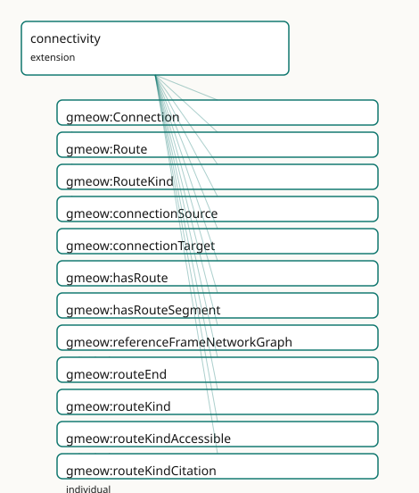

<!-- GENERATED by gmeow ontology-docs. DO NOT EDIT. Source hash: c99d8d50c0344040. -->

# GMEOW Connectivity Module

- **IRI:** <https://blackcatinformatics.ca/gmeow/slices/connectivity>
- **Tier:** extension
- **[`Group`](../reference/classes/gmeow-Group.md):** extensions

## What This Slice Covers

This slice owns 20 terms and contributes 3 mapping or projection rows. Use it when its terms match the native fact you want to preserve; use the linkage tables to see how those facts leave GMEOW for consumer vocabularies.

## Dependencies

- [`gmeow:slices/kernel`](kernel.md)
- [`gmeow:slices/places`](places.md)

## Consumers

- Network/route topology for places and the virtual-location realm.

## Local Map

## Terms

### Classes

| Term | Label | Definition |
|---|---|---|
| [`gmeow:Connection`](../reference/classes/gmeow-Connection.md) | Connection | A reified traversable link between two entities, able to bear its own period, cost, weight, bandwidth, confidence, and standpoint. The flat shortcut is gmeow:c... |
| [`gmeow:Route`](../reference/classes/gmeow-Route.md) | Route | A traversable path through a graph of connected entities — a named, typed sequence of linked nodes with a defined start and end. Models transport lines, networ... |
| [`gmeow:RouteKind`](../reference/classes/gmeow-RouteKind.md) | Route Kind | The kind of a route — transit line, flight path, walking path, citation chain, network path, social path, dependency chain. An open value vocabulary (individua... |

### Properties

| Term | Label | Definition |
|---|---|---|
| [`gmeow:connectionSource`](../reference/properties/gmeow-connectionSource.md) | connection source | The source of a reified Connection. |
| [`gmeow:connectionTarget`](../reference/properties/gmeow-connectionTarget.md) | connection target | The target of a reified Connection. |
| [`gmeow:hasRoute`](../reference/properties/gmeow-hasRoute.md) | has route | Relates a thing to a route that starts from, ends at, or passes through it. |
| [`gmeow:hasRouteSegment`](../reference/properties/gmeow-hasRouteSegment.md) | has route segment | A sub-route that is part of a larger route. A specialization of the universal [`gmeow:hasPart`](../reference/properties/gmeow-hasPart.md) spine. |
| [`gmeow:routeEnd`](../reference/properties/gmeow-routeEnd.md) | route end | The end of a route. |
| [`gmeow:routeKind`](../reference/properties/gmeow-routeKind.md) | route kind | The kind of a route (a RouteKind individual). |
| [`gmeow:routeStart`](../reference/properties/gmeow-routeStart.md) | route start | The start of a route. |
| [`gmeow:routeVia`](../reference/properties/gmeow-routeVia.md) | route via | An intermediate point that a route passes through. The order of via points is computed by the solver layer ([Principle 12](https://github.com/Blackcat-Informatics/gmeow-ontology/blob/main/CONSTITUTION.md#principle-12)), not asserted in the OWL core. |

### Individuals

| Term | Label | Definition |
|---|---|---|
| [`gmeow:referenceFrameNetworkGraph`](../reference/individuals/gmeow-referenceFrameNetworkGraph.md) | Network Graph Reference Frame | The network graph reference frame — a named coordinate system or value space together with its axes, origin, and transformation rules ([Principle 11](https://github.com/Blackcat-Informatics/gmeow-ontology/blob/main/CONSTITUTION.md#principle-11)). |
| [`gmeow:routeKindAccessible`](../reference/individuals/gmeow-routeKindAccessible.md) | accessible route | A route computed to satisfy a set of accessibility needs. The actual path is determined by the solver layer ([Principle 12](https://github.com/Blackcat-Informatics/gmeow-ontology/blob/main/CONSTITUTION.md#principle-12)), not asserted in OWL. |
| [`gmeow:routeKindCitation`](../reference/individuals/gmeow-routeKindCitation.md) | citation chain | The citation route kind — a classification of a path by the domain in which the path is traversed. |
| [`gmeow:routeKindDependency`](../reference/individuals/gmeow-routeKindDependency.md) | dependency chain | The dependency route kind — a classification of a path by the domain in which the path is traversed. |
| [`gmeow:routeKindFlight`](../reference/individuals/gmeow-routeKindFlight.md) | flight path | The flight route kind — a classification of a path by the domain in which the path is traversed. |
| [`gmeow:routeKindNetwork`](../reference/individuals/gmeow-routeKindNetwork.md) | network path | The network route kind — a classification of a path by the domain in which the path is traversed. |
| [`gmeow:routeKindSocial`](../reference/individuals/gmeow-routeKindSocial.md) | social path | The social route kind — a classification of a path by the domain in which the path is traversed. |
| [`gmeow:routeKindTransit`](../reference/individuals/gmeow-routeKindTransit.md) | transit route | The transit route kind — a classification of a path by the domain in which the path is traversed. |
| [`gmeow:routeKindWalking`](../reference/individuals/gmeow-routeKindWalking.md) | walking route | The walking route kind — a classification of a path by the domain in which the path is traversed. |

## Linkages

- **Rows:** 3
- **Projection profiles:** `schema-org`
- **External vocabularies:** `gtfs`, `schema`

| Source | Kind | Profile | Predicate/Relation | Target | Evidence |
|---|---|---|---|---|---|
| [`gmeow:Route`](../reference/classes/gmeow-Route.md) | equivalence | `-` | [skos:closeMatch](http://www.w3.org/2004/02/skos/core#closeMatch) | [gtfs:Route](http://vocab.gtfs.org/terms#Route) | `gmeow-connectivity.sssom.tsv`; `gmeow:eqConn001`; confidence 0.85 |
| [`gmeow:Route`](../reference/classes/gmeow-Route.md) | equivalence | `-` | [skos:closeMatch](http://www.w3.org/2004/02/skos/core#closeMatch) | [schema:Trip](https://schema.org/Trip) | `gmeow-connectivity.sssom.tsv`; `gmeow:eqConn003`; confidence 0.7 |
| [`gmeow:Route`](../reference/classes/gmeow-Route.md) | projection | `schema-org` | projects to / <= | [schema:Trip](https://schema.org/Trip) | `gmeow:mapSchemaRoute`; confidence 0.7; lossy: GMEOW Route is domain-generic; [schema:Trip](https://schema.org/Trip) is travel-specific. RouteKind, start, end, and via metadata are dropped. |

## Guide

<!-- SPDX-FileCopyrightText: 2026 Blackcat Informatics® Inc. <paudley@blackcatinformatics.ca> -->
<!-- SPDX-License-Identifier: CC-BY-4.0 -->

# Connectivity — traversable links, reified connections, and routes

> **Slice:** `https://blackcatinformatics.ca/gmeow/slices/connectivity` · **tier: extension**
> The universal graph layer: anything that can be traversed is said here, once.

GMEOW keeps three structural vocabularies rigorously apart: mereology ([`partOf`](../reference/properties/gmeow-partOf.md) — what is
*made of* what), RCC-8 adjacency (what *touches* what), and connectivity — what can be
*traversed* to what. This slice owns the third. The flat shortcut [`gmeow:connectsTo`](../reference/properties/gmeow-connectsTo.md)
covers the 80 % case; promote to a reified [`Connection`](../reference/classes/gmeow-Connection.md) when the link itself needs a
period, cost, weight, bandwidth, confidence, or standpoint (the flat-first pattern). The
constructs are deliberately universal: transit lines, network paths, citation chains,
social paths, and dependency chains are all the same machinery with a different
[`RouteKind`](../reference/classes/gmeow-RouteKind.md) value ([Principle 9](https://github.com/Blackcat-Informatics/gmeow-ontology/blob/main/CONSTITUTION.md#principle-9) — kinds are data, not subclasses). Path geometry,
ordering, and cost are computed by the solver layer ([Principle 12](https://github.com/Blackcat-Informatics/gmeow-ontology/blob/main/CONSTITUTION.md#principle-12)), never asserted as
triples. The slice is part of the Location-as-reference-frame epic.

Its Principle-15 consumer, declared in the manifest: **network/route topology for places
and the virtual-location realm** — the graph the solver walks when it answers "how do I
get from here to there", physically or virtually.

## The link layer

### [`gmeow:Connection`](../reference/classes/gmeow-Connection.md)

The reified traversable link — a [`gufo:Relator`](../external/terms.md#gufo-relator) between two entities, able to bear its
own period, cost, weight, bandwidth, confidence, and standpoint. The flat shortcut is
[`gmeow:connectsTo`](../reference/properties/gmeow-connectsTo.md); promote when metadata matters. Connections are admissible subjects of
the accessibility slice's [`AccessibilityAssertion`](../reference/classes/gmeow-AccessibilityAssertion.md) — a barrier can live on the *link*,
not just the endpoint.

### [`gmeow:connectionSource`](../reference/properties/gmeow-connectionSource.md) · [`gmeow:connectionTarget`](../reference/properties/gmeow-connectionTarget.md)

The two functional role properties of a [`Connection`](../reference/classes/gmeow-Connection.md): one source, one target per relator.
Direction is the relator's, not the vocabulary's — [`connectsTo`](../reference/properties/gmeow-connectsTo.md) itself is neither
symmetric nor transitive at the universal level, which is precisely what lets genealogy
declare [`hasSpouse`](../reference/properties/gmeow-hasSpouse.md)/[`hasSibling`](../reference/properties/gmeow-hasSibling.md) (symmetric) and [`hasParent`](../reference/properties/gmeow-hasParent.md)/[`hasChild`](../reference/properties/gmeow-hasChild.md) (directed) as
sub-properties without leaking axioms across domains.

## The route layer

### [`gmeow:Route`](../reference/classes/gmeow-Route.md)

A traversable path through a graph of connected entities — named, typed, with a defined
start and end. A [`Route`](../reference/classes/gmeow-Route.md) is a first-class entity (it has identity: "the Number 4 line"),
but its actual path geometry, via-ordering, and cost are the solver layer's to compute
([Principle 12](https://github.com/Blackcat-Informatics/gmeow-ontology/blob/main/CONSTITUTION.md#principle-12)). The OWL core records that the route exists and what it links.

### [`gmeow:routeStart`](../reference/properties/gmeow-routeStart.md) · [`gmeow:routeEnd`](../reference/properties/gmeow-routeEnd.md) · [`gmeow:routeVia`](../reference/properties/gmeow-routeVia.md)

Endpoints (functional) and intermediate points (non-functional, *unordered*). The order
of via points is deliberately not asserted — sequence is a solver computation, and
asserting it would freeze one traversal as schema truth.

### [`gmeow:routeKind`](../reference/properties/gmeow-routeKind.md)

Functional pointer into the [`RouteKind`](../reference/classes/gmeow-RouteKind.md) vocabulary: one kind per route.

### [`gmeow:RouteKind`](../reference/classes/gmeow-RouteKind.md)

The open value vocabulary of route classifications ([Principle 9](https://github.com/Blackcat-Informatics/gmeow-ontology/blob/main/CONSTITUTION.md#principle-9)): seeds
[`routeKindTransit`](../reference/individuals/gmeow-routeKindTransit.md), [`routeKindWalking`](../reference/individuals/gmeow-routeKindWalking.md), [`routeKindFlight`](../reference/individuals/gmeow-routeKindFlight.md), [`routeKindNetwork`](../reference/individuals/gmeow-routeKindNetwork.md),
[`routeKindCitation`](../reference/individuals/gmeow-routeKindCitation.md), [`routeKindSocial`](../reference/individuals/gmeow-routeKindSocial.md), [`routeKindDependency`](../reference/individuals/gmeow-routeKindDependency.md). The breadth of the seed
list is the point — the same [`Route`](../reference/classes/gmeow-Route.md) machinery serves geography, networks, scholarship,
and software.

### [`gmeow:routeKindAccessible`](../reference/individuals/gmeow-routeKindAccessible.md)

The bridge value for the accessibility slice (surgery): a route *computed* to
satisfy a set of [`hasAccessibilityNeed`](../reference/properties/gmeow-hasAccessibilityNeed.md) facets. The value individual lives here, beside
its value class, keeping accessibility and connectivity mutually independent sibling
extensions — the vocabulary stays open ([Principle 9](https://github.com/Blackcat-Informatics/gmeow-ontology/blob/main/CONSTITUTION.md#principle-9)) and neither slice imports the other.

### [`gmeow:hasRouteSegment`](../reference/properties/gmeow-hasRouteSegment.md)

Transitive sub-route composition, a specialization of the universal [`gmeow:hasPart`](../reference/properties/gmeow-hasPart.md)
spine: a route decomposes into legs, and the reasoner derives the segment closure. This
is the one place connectivity touches mereology — a segment is a *part* of its route,
while the stations it links are merely *connected*.

### [`gmeow:hasRoute`](../reference/properties/gmeow-hasRoute.md)

The convenience hook from any thing to a route that starts from, ends at, or passes
through it — the entry point for "what lines serve this station" queries.

## The frame seed ([Principle 11](https://github.com/Blackcat-Informatics/gmeow-ontology/blob/main/CONSTITUTION.md#principle-11))

### [`gmeow:referenceFrameNetworkGraph`](../reference/individuals/gmeow-referenceFrameNetworkGraph.md)

A seeded [`ReferenceFrame`](../reference/classes/gmeow-ReferenceFrame.md) (virtual realm, one scalar axis, crisp determinacy,
metric [`metricGraphHops`](../reference/individuals/gmeow-metricGraphHops.md). Network distance is frame-relative like every other value —
"3 hops" names its frame just as "3 km" names a spatial one. Virtual locations measure
their distances here.

## Solver layer & alignment

Everything quantitative is deferred to the solver ([Principle 12](https://github.com/Blackcat-Informatics/gmeow-ontology/blob/main/CONSTITUTION.md#principle-12)): shortest path, via
ordering, cost accumulation, accessible-route satisfaction, reachability closure. The OWL
core models the graph; the solver traverses it. Alignment is deferred — transport and
network standards (GTFS, schema.org trip vocabulary) are projection targets once the
consumer demands them, not pre-paid imports.

## Dependencies

Depends on `kernel` and `places`. Depended on by genealogy (kinship bonds are
[`connectsTo`](../reference/properties/gmeow-connectsTo.md) sub-properties) and consumed by the accessibility solver path.
