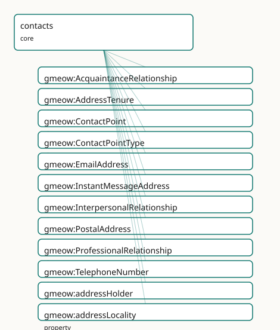

<!-- GENERATED by gmeow ontology-docs. DO NOT EDIT. -->

# GMEOW Contacts Module

- **IRI:** <https://blackcatinformatics.ca/gmeow/slices/contacts>
- **Tier:** core
- **[`Group`](../reference/classes/gmeow-Group.md):** core

## What This Slice Covers

This slice owns 39 terms and contributes 53 mapping or projection rows. Use it when its terms match the native fact you want to preserve; use the linkage tables to see how those facts leave GMEOW for consumer vocabularies.

## Dependencies

- [`gmeow:slices/accounts`](accounts.md)
- [`gmeow:slices/agreements`](agreements.md)
- [`gmeow:slices/kernel`](kernel.md)
- [`gmeow:slices/observations`](observations.md)
- [`gmeow:slices/places`](places.md)
- [`gmeow:slices/temporal`](temporal.md)

## Consumers

- The mail corpus's address book; email-address structure (core half of the email split).

## Local Map



## Examples

### Contact Points

- **Source:** [`slices/core/contacts/examples/contact-points.ttl`](https://github.com/Blackcat-Informatics/gmeow-ontology/blob/main/slices/core/contacts/examples/contact-points.ttl)
- **GMEOW terms:** [`gmeow:ContactPoint`](../reference/classes/gmeow-ContactPoint.md), [`gmeow:EmailAddress`](../reference/classes/gmeow-EmailAddress.md), [`gmeow:Organization`](../reference/classes/gmeow-Organization.md), [`gmeow:Person`](../reference/classes/gmeow-Person.md), [`gmeow:PostalAddress`](../reference/classes/gmeow-PostalAddress.md), [`gmeow:addressLocality`](../reference/properties/gmeow-addressLocality.md), [`gmeow:addressPlace`](../reference/properties/gmeow-addressPlace.md), [`gmeow:addressRegion`](../reference/properties/gmeow-addressRegion.md), [`gmeow:addressValue`](../reference/properties/gmeow-addressValue.md), [`gmeow:contactPointProvider`](../reference/properties/gmeow-contactPointProvider.md)

```turtle
# SPDX-FileCopyrightText: 2026 Blackcat Informatics® Inc. <paudley@blackcatinformatics.ca>
# SPDX-License-Identifier: CC-BY-4.0
#
# Worked example: contact details are flat-first, reified on demand (, P4).
# A bare gmeow:email / gmeow:telephone on the agent covers the common case. When
# a contact point carries a TYPE (work vs personal), a PROVIDER, structured parts
# or a postal frame, it is promoted to a reified gmeow:ContactPoint reached via
# gmeow:hasContactPoint. A gmeow:PostalAddress is expressed in an explicit postal/
# administrative REFERENCE FRAME (P11): its street/locality/region components are
# coordinate values along that frame's axes — the as-written surface form, kept
# distinct from the resolved geographic Place (gmeow:addressPlace).
@prefix gmeow: <https://blackcatinformatics.ca/gmeow/> .
@prefix ex:    <https://blackcatinformatics.ca/gmeow/examples/contacts/> .

ex:acme a gmeow:Organization ; gmeow:name "Acme Robotics Inc."@en .

ex:dana a gmeow:Person ;
    gmeow:name      "Dana Reyes"@en ;
    gmeow:email     "dana@example.org" ;        # flat shortcut — the common case
    gmeow:telephone "+1-555-0142" ;             # flat shortcut
    gmeow:hasContactPoint ex:workEmail , ex:homeAddress .

# --- Reified email: typed, provider-scoped, and split into its parts.
ex:workEmail a gmeow:EmailAddress ;
    gmeow:addressValue         "dana@acme.example" ;
    gmeow:localPart            "dana" ;
    gmeow:domainPart           "acme.example" ;
    gmeow:contactPointType     gmeow:contactPointTypeWork ;
    gmeow:contactPointProvider ex:acme .

# --- Reified postal address: components are coordinates in the postal frame (P11).
ex:homeAddress a gmeow:PostalAddress ;
    gmeow:contactPointType   gmeow:contactPointTypePersonal ;
    gmeow:postalAddressFrame gmeow:referenceFramePostalAddress ;
    gmeow:streetAddress      "742 Evergreen Terrace" ;
    gmeow:addressLocality    "Springfield" ;
    gmeow:addressRegion      "Oregon" ;
    gmeow:postalCode         "97403" ;
    gmeow:countryCode        "US" .
```

## Terms

### Classes

| Term | Label | Definition |
|---|---|---|
| [`gmeow:AcquaintanceRelationship`](../reference/classes/gmeow-AcquaintanceRelationship.md) | Acquaintance Relationship | An interpersonal relationship of social acquaintance — agents who have met and know one another (the reified form of hasMet). |
| [`gmeow:AddressTenure`](../reference/classes/gmeow-AddressTenure.md) | Address Tenure | The reified, time-scoped fact that an agent held a contact point (e.g. an email address) over a particular interval. |
| [`gmeow:ContactPoint`](../reference/classes/gmeow-ContactPoint.md) | Contact Point | A means of reaching an agent: an email address, telephone number, or postal address. |
| [`gmeow:ContactPointType`](../reference/classes/gmeow-ContactPointType.md) | Contact Point Type | The usage role of a contact point — a VALUE vocabulary (individuals, never subclasses). Personal, work, personal-domain, support, billing, and emergency are ex... |
| [`gmeow:EmailAddress`](../reference/classes/gmeow-EmailAddress.md) | Email Address | A contact point reachable via the Simple Mail Transfer Protocol (SMTP). |
| [`gmeow:InterpersonalRelationship`](../reference/classes/gmeow-InterpersonalRelationship.md) | Interpersonal Relationship | A reified standing relationship between agents (acquaintance, collaboration, …), able to bear its own time interval, confidence, and source evidence. |
| [`gmeow:PostalAddress`](../reference/classes/gmeow-PostalAddress.md) | Postal Address | A contact point reachable by physical mail at a postal address. It is expressed in the postal/administrative topological reference frame (gmeow:referenceFrameP... |
| [`gmeow:ProfessionalRelationship`](../reference/classes/gmeow-ProfessionalRelationship.md) | Professional Relationship | An interpersonal relationship arising from work — colleagues, collaborators, a client and a provider (the reified form of hasWorkedWith). |
| [`gmeow:TelephoneNumber`](../reference/classes/gmeow-TelephoneNumber.md) | Telephone Number | A contact point reachable by telephone. |

### Properties

| Term | Label | Definition |
|---|---|---|
| [`gmeow:addressHolder`](../reference/properties/gmeow-addressHolder.md) | address holder | The agent who held the contact point over the tenure's interval. |
| [`gmeow:addressLocality`](../reference/properties/gmeow-addressLocality.md) | address locality | The locality (city or town) coordinate value of a postal address, expressed along the [`gmeow:axisAddressLocality`](../reference/individuals/gmeow-axisAddressLocality.md) axis of the postal reference frame. |
| [`gmeow:addressPlace`](../reference/properties/gmeow-addressPlace.md) | address place | The geographic place a postal address denotes (typically the premises/building) — the seam from the as-written address to the resolved place hierarchy, its coo... |
| [`gmeow:addressRegion`](../reference/properties/gmeow-addressRegion.md) | address region | The region (state, province, or territory) coordinate value of a postal address, expressed along the [`gmeow:axisAddressRegion`](../reference/individuals/gmeow-axisAddressRegion.md) axis of the postal reference frame. |
| [`gmeow:addressValue`](../reference/properties/gmeow-addressValue.md) | address value | The normalized addr-spec of an email address. |
| [`gmeow:contactPointProvider`](../reference/properties/gmeow-contactPointProvider.md) | contact point provider | The agent (typically an organization) that issues or scopes a contact point — the employer behind a work address, the provider behind an email's domain. Range... |
| [`gmeow:contactPointType`](../reference/properties/gmeow-contactPointType.md) | contact point type | The usage role(s) of a contact point — one or more [`gmeow:ContactPointType`](../reference/classes/gmeow-ContactPointType.md) values (personal, work, …). Non-functional: a contact point may serve several roles,... |
| [`gmeow:countryCode`](../reference/properties/gmeow-countryCode.md) | country code | The country code coordinate value of a postal address, expressed along the [`gmeow:axisCountryCode`](../reference/individuals/gmeow-axisCountryCode.md) axis of the postal reference frame. The intended value is an I... |
| [`gmeow:deliversToAccount`](../reference/properties/gmeow-deliversToAccount.md) | delivers to account | Relates an email address to the online account it delivers to — the seam joining an address (held by an agent) to the account a message resides in. |
| [`gmeow:domainPart`](../reference/properties/gmeow-domainPart.md) | domain part | The domain part of an email address. |
| [`gmeow:email`](../reference/properties/gmeow-email.md) | email | An email address at which an agent can be reached. |
| [`gmeow:extendedAddress`](../reference/properties/gmeow-extendedAddress.md) | extended address | The extended-address coordinate value of a postal address, expressed along the [`gmeow:axisExtendedAddress`](../reference/individuals/gmeow-axisExtendedAddress.md) axis of the postal reference frame. |
| [`gmeow:hasAgreement`](../reference/properties/gmeow-hasAgreement.md) | has agreement | Relates an agent to an agreement it is party to. The party-ship period is carried with gmeow:validFrom/validUntil on this statement; the agreement's own term/e... |
| [`gmeow:hasContactPoint`](../reference/properties/gmeow-hasContactPoint.md) | has contact point | Relates an agent to a means of contacting it. |
| [`gmeow:hasMet`](../reference/properties/gmeow-hasMet.md) | has met | Records that two agents have met; symmetric. The occasion/period is carried with gmeow:validFrom/validUntil on the statement. |
| [`gmeow:hasUsed`](../reference/properties/gmeow-hasUsed.md) | has used | Records that an agent has used some entity (a tool, service, or work). The period is carried with gmeow:validFrom/validUntil on the statement. |
| [`gmeow:hasWorkedWith`](../reference/properties/gmeow-hasWorkedWith.md) | has worked with | Records that two agents have worked together; symmetric. The period is carried with gmeow:validFrom/validUntil on the statement, or reified as a gmeow:Professi... |
| [`gmeow:localPart`](../reference/properties/gmeow-localPart.md) | local part | The local part of an email address. |
| [`gmeow:postOfficeBox`](../reference/properties/gmeow-postOfficeBox.md) | post office box | The post-office-box coordinate value of a postal address, expressed along the [`gmeow:axisPostOfficeBox`](../reference/individuals/gmeow-axisPostOfficeBox.md) axis of the postal reference frame. |
| [`gmeow:postalAddressFrame`](../reference/properties/gmeow-postalAddressFrame.md) | postal address frame | The postal/administrative reference frame in which this address is expressed. Functional: an address is expressed in exactly one frame. The default is gmeow:re... |
| [`gmeow:postalCode`](../reference/properties/gmeow-postalCode.md) | postal code | The postal/ZIP code coordinate value of a postal address, expressed along the [`gmeow:axisPostalCode`](../reference/individuals/gmeow-axisPostalCode.md) axis of the postal reference frame. |
| [`gmeow:relationshipInterval`](../reference/properties/gmeow-relationshipInterval.md) | relationship interval | The time interval over which an interpersonal relationship held. (A relator carries its period this way rather than via duringInterval, which is reserved for g... |
| [`gmeow:relationshipParty`](../reference/properties/gmeow-relationshipParty.md) | relationship party | An agent who is one of the parties to an interpersonal relationship. Non-functional: a relationship typically binds two parties (and is left open for group tie... |
| [`gmeow:streetAddress`](../reference/properties/gmeow-streetAddress.md) | street address | The street-address coordinate value of a postal address, expressed along the [`gmeow:axisStreetAddress`](../reference/individuals/gmeow-axisStreetAddress.md) axis of the postal reference frame. |
| [`gmeow:telephone`](../reference/properties/gmeow-telephone.md) | telephone | A telephone number at which an agent can be reached. |
| [`gmeow:tenuredContactPoint`](../reference/properties/gmeow-tenuredContactPoint.md) | tenured contact point | The contact point an address-tenure concerns. |

### Individuals

| Term | Label | Definition |
|---|---|---|
| [`gmeow:contactPointTypePersonal`](../reference/individuals/gmeow-contactPointTypePersonal.md) | personal | A personal contact point. |
| [`gmeow:contactPointTypePersonalDomain`](../reference/individuals/gmeow-contactPointTypePersonalDomain.md) | personal domain | A contact point on a person's own domain (e.g. an email at one's personal domain). |
| [`gmeow:contactPointTypeSupport`](../reference/individuals/gmeow-contactPointTypeSupport.md) | support | A customer-support or help contact point. |
| [`gmeow:contactPointTypeWork`](../reference/individuals/gmeow-contactPointTypeWork.md) | work | A work or professional contact point. |

## Linkages

- **Rows:** 53
- **Projection profiles:** `foaf`, `schema-org`, `sioc`, `vcard`
- **External vocabularies:** `foaf`, `rdf`, `rel`, `schema`, `sioc`, `vcard`, `wd`

| Source | Kind | Profile | Predicate/Relation | Target | Evidence |
|---|---|---|---|---|---|
| [`gmeow:ContactPoint`](../reference/classes/gmeow-ContactPoint.md) | equivalence | `-` | [owl:equivalentClass](http://www.w3.org/2002/07/owl#equivalentClass) | [schema:ContactPoint](https://schema.org/ContactPoint) | `gmeow-classes.sssom.tsv`; `gmeow:eqClasses040`; confidence 1 |
| [`gmeow:EmailAddress`](../reference/classes/gmeow-EmailAddress.md) | equivalence | `-` | [skos:closeMatch](http://www.w3.org/2004/02/skos/core#closeMatch) | [wd:Q29934200](https://www.wikidata.org/wiki/Q29934200) | `gmeow-wikidata.sssom.tsv`; `gmeow:eqWikidata044`; confidence 0.85 |
| [`gmeow:InterpersonalRelationship`](../reference/classes/gmeow-InterpersonalRelationship.md) | equivalence | `-` | [skos:closeMatch](http://www.w3.org/2004/02/skos/core#closeMatch) | [foaf:knows](http://xmlns.com/foaf/0.1/knows) | `gmeow-trust.sssom.tsv`; `gmeow:eqTrust012`; confidence 0.5 |
| [`gmeow:PostalAddress`](../reference/classes/gmeow-PostalAddress.md) | equivalence | `-` | [owl:equivalentClass](http://www.w3.org/2002/07/owl#equivalentClass) | [schema:PostalAddress](https://schema.org/PostalAddress) | `gmeow-classes.sssom.tsv`; `gmeow:eqClasses041`; confidence 1 |
| [`gmeow:PostalAddress`](../reference/classes/gmeow-PostalAddress.md) | equivalence | `-` | [skos:closeMatch](http://www.w3.org/2004/02/skos/core#closeMatch) | [vcard:Address](http://www.w3.org/2006/vcard/ns#Address) | `gmeow-classes.sssom.tsv`; `gmeow:eqClasses042`; confidence 0.9 |
| [`gmeow:TelephoneNumber`](../reference/classes/gmeow-TelephoneNumber.md) | equivalence | `-` | [skos:closeMatch](http://www.w3.org/2004/02/skos/core#closeMatch) | [wd:Q214291](https://www.wikidata.org/wiki/Q214291) | `gmeow-wikidata.sssom.tsv`; `gmeow:eqWikidata043`; confidence 0.85 |
| [`gmeow:addressLocality`](../reference/properties/gmeow-addressLocality.md) | equivalence | `-` | [owl:equivalentProperty](http://www.w3.org/2002/07/owl#equivalentProperty) | [schema:addressLocality](https://schema.org/addressLocality) | `gmeow-places.sssom.tsv`; `gmeow:eqPlaces033`; confidence 1 |
| [`gmeow:addressLocality`](../reference/properties/gmeow-addressLocality.md) | equivalence | `-` | [skos:closeMatch](http://www.w3.org/2004/02/skos/core#closeMatch) | [vcard:locality](http://www.w3.org/2006/vcard/ns#locality) | `gmeow-places.sssom.tsv`; `gmeow:eqPlaces034`; confidence 0.9 |
| [`gmeow:addressPlace`](../reference/properties/gmeow-addressPlace.md) | equivalence | `-` | [skos:closeMatch](http://www.w3.org/2004/02/skos/core#closeMatch) | [schema:address](https://schema.org/address) | `gmeow-places.sssom.tsv`; `gmeow:eqPlaces041`; confidence 0.7 |
| [`gmeow:addressRegion`](../reference/properties/gmeow-addressRegion.md) | equivalence | `-` | [owl:equivalentProperty](http://www.w3.org/2002/07/owl#equivalentProperty) | [schema:addressRegion](https://schema.org/addressRegion) | `gmeow-places.sssom.tsv`; `gmeow:eqPlaces035`; confidence 1 |
| [`gmeow:addressRegion`](../reference/properties/gmeow-addressRegion.md) | equivalence | `-` | [skos:closeMatch](http://www.w3.org/2004/02/skos/core#closeMatch) | [vcard:region](http://www.w3.org/2006/vcard/ns#region) | `gmeow-places.sssom.tsv`; `gmeow:eqPlaces036`; confidence 0.9 |
| [`gmeow:countryCode`](../reference/properties/gmeow-countryCode.md) | equivalence | `-` | [skos:closeMatch](http://www.w3.org/2004/02/skos/core#closeMatch) | [schema:addressCountry](https://schema.org/addressCountry) | `gmeow-places.sssom.tsv`; `gmeow:eqPlaces039`; confidence 0.8 |
| [`gmeow:countryCode`](../reference/properties/gmeow-countryCode.md) | equivalence | `-` | [skos:closeMatch](http://www.w3.org/2004/02/skos/core#closeMatch) | [vcard:country-name](http://www.w3.org/2006/vcard/ns#country-name) | `gmeow-places.sssom.tsv`; `gmeow:eqPlaces040`; confidence 0.7 |
| [`gmeow:email`](../reference/properties/gmeow-email.md) | equivalence | `-` | [skos:closeMatch](http://www.w3.org/2004/02/skos/core#closeMatch) | [foaf:mbox](http://xmlns.com/foaf/0.1/mbox) | `gmeow-properties.sssom.tsv`; `gmeow:eqProperties005`; confidence 0.9 |
| [`gmeow:email`](../reference/properties/gmeow-email.md) | equivalence | `-` | [owl:equivalentProperty](http://www.w3.org/2002/07/owl#equivalentProperty) | [schema:email](https://schema.org/email) | `gmeow-properties.sssom.tsv`; `gmeow:eqProperties004`; confidence 1 |
| [`gmeow:email`](../reference/properties/gmeow-email.md) | equivalence | `-` | [skos:closeMatch](http://www.w3.org/2004/02/skos/core#closeMatch) | [vcard:hasEmail](http://www.w3.org/2006/vcard/ns#hasEmail) | `gmeow-properties.sssom.tsv`; `gmeow:eqProperties006`; confidence 0.9 |
| [`gmeow:extendedAddress`](../reference/properties/gmeow-extendedAddress.md) | equivalence | `-` | [skos:closeMatch](http://www.w3.org/2004/02/skos/core#closeMatch) | [vcard:extended-address](http://www.w3.org/2006/vcard/ns#extended-address) | `gmeow-places.sssom.tsv`; `gmeow:eqPlaces030`; confidence 0.9 |
| [`gmeow:hasContactPoint`](../reference/properties/gmeow-hasContactPoint.md) | equivalence | `-` | [owl:equivalentProperty](http://www.w3.org/2002/07/owl#equivalentProperty) | [schema:contactPoint](https://schema.org/contactPoint) | `gmeow-properties.sssom.tsv`; `gmeow:eqProperties009`; confidence 0.9 |
| [`gmeow:hasMet`](../reference/properties/gmeow-hasMet.md) | equivalence | `-` | [skos:closeMatch](http://www.w3.org/2004/02/skos/core#closeMatch) | [foaf:knows](http://xmlns.com/foaf/0.1/knows) | `gmeow-trust.sssom.tsv`; `gmeow:eqTrust009`; confidence 0.6 |
| [`gmeow:hasMet`](../reference/properties/gmeow-hasMet.md) | equivalence | `-` | [skos:closeMatch](http://www.w3.org/2004/02/skos/core#closeMatch) | [rel:hasMet](http://purl.org/vocab/relationship/hasMet) | `gmeow-trust.sssom.tsv`; `gmeow:eqTrust008`; confidence 0.95 |
| [`gmeow:hasWorkedWith`](../reference/properties/gmeow-hasWorkedWith.md) | equivalence | `-` | [skos:closeMatch](http://www.w3.org/2004/02/skos/core#closeMatch) | [rel:collaboratesWith](http://purl.org/vocab/relationship/collaboratesWith) | `gmeow-trust.sssom.tsv`; `gmeow:eqTrust010`; confidence 0.85 |
| [`gmeow:hasWorkedWith`](../reference/properties/gmeow-hasWorkedWith.md) | equivalence | `-` | [skos:closeMatch](http://www.w3.org/2004/02/skos/core#closeMatch) | [rel:worksWith](http://purl.org/vocab/relationship/worksWith) | `gmeow-trust.sssom.tsv`; `gmeow:eqTrust011`; confidence 0.85 |
| [`gmeow:postOfficeBox`](../reference/properties/gmeow-postOfficeBox.md) | equivalence | `-` | [skos:closeMatch](http://www.w3.org/2004/02/skos/core#closeMatch) | [schema:postOfficeBoxNumber](https://schema.org/postOfficeBoxNumber) | `gmeow-places.sssom.tsv`; `gmeow:eqPlaces031`; confidence 0.9 |
| [`gmeow:postOfficeBox`](../reference/properties/gmeow-postOfficeBox.md) | equivalence | `-` | [skos:closeMatch](http://www.w3.org/2004/02/skos/core#closeMatch) | [vcard:post-office-box](http://www.w3.org/2006/vcard/ns#post-office-box) | `gmeow-places.sssom.tsv`; `gmeow:eqPlaces032`; confidence 0.9 |
|... |... |... |... |... | 29 more rows |

## Guide

<!-- SPDX-FileCopyrightText: 2026 Blackcat Informatics® Inc. <paudley@blackcatinformatics.ca> -->
<!-- SPDX-License-Identifier: CC-BY-4.0 -->

# Contacts — channels, addresses, and ties that carry their own time

> **Slice:** `https://blackcatinformatics.ca/gmeow/slices/contacts` · **tier: core**
> Contact points (email, telephone, postal), temporally-scoped contact relationships, and
> the reified interpersonal-relationship relator — the schema.org / vCard / REL superset.

An address book flattens three different things into rows: *channels* (an email address, a
phone number), *tenure* (who held that address, when — people acquire and relinquish
addresses), and *ties* (who knows whom, in what capacity, over what period). GMEOW models
each honestly. Channels are first-class [`ContactPoint`](../reference/classes/gmeow-ContactPoint.md) objects; tenure and ties follow the
**flat-first, reify-on-demand** pattern — flat shortcuts carry their period at the statement
level with the temporal slice's [`validFrom`](../reference/properties/gmeow-validFrom.md)/[`validUntil`](../reference/properties/gmeow-validUntil.md) clocks (Principles 2–3), and
promote to a relator ([`InterpersonalRelationship`](../reference/classes/gmeow-InterpersonalRelationship.md), [`AddressTenure`](../reference/classes/gmeow-AddressTenure.md)) when the fact itself
needs identity, evidence, or confidence. A postal address, meanwhile, is **frame-relative**
([Principle 11](https://github.com/Blackcat-Informatics/gmeow-ontology/blob/main/CONSTITUTION.md#principle-11)): its components are coordinate values along the axes of the postal reference
frame — the as-written surface form — kept apart from the resolved, identifier-bearing
place hierarchy it denotes.

This slice is the superset layer over schema.org [`ContactPoint`](../reference/classes/gmeow-ContactPoint.md)/[`PostalAddress`](../reference/classes/gmeow-PostalAddress.md), vCard, and
the REL vocabulary ([Principle 5](https://github.com/Blackcat-Informatics/gmeow-ontology/blob/main/CONSTITUTION.md#principle-5): model it correctly, bridge by reference); identity *trust*
between contacts (keys, certifications, owner-trust) lives in the cross-cutting trust
module, and the email *message* model lives in the email extension — this slice is the
contact half of the email split.

## Channels

### [`gmeow:ContactPoint`](../reference/classes/gmeow-ContactPoint.md)

A means of reaching an agent, attached via [`hasContactPoint`](../reference/properties/gmeow-hasContactPoint.md). Three subkinds:
[`EmailAddress`](../reference/classes/gmeow-EmailAddress.md), [`TelephoneNumber`](../reference/classes/gmeow-TelephoneNumber.md), [`PostalAddress`](../reference/classes/gmeow-PostalAddress.md). The flat [`gmeow:email`](../reference/properties/gmeow-email.md) /
[`gmeow:telephone`](../reference/properties/gmeow-telephone.md) literals remain for the 80 % case where the channel needs no structure —
flat-first, never the only form.

### [`gmeow:EmailAddress`](../reference/classes/gmeow-EmailAddress.md)

The structured channel: [`addressValue`](../reference/properties/gmeow-addressValue.md) (the normalized addr-spec), [`localPart`](../reference/properties/gmeow-localPart.md),
[`domainPart`](../reference/properties/gmeow-domainPart.md) — all functional. [`deliversToAccount`](../reference/properties/gmeow-deliversToAccount.md) is the seam to the accounts slice: an
*address* is held by an agent; the *account* it delivers to is where messages reside. The
mail corpus's address book is this slice's named consumer ([Principle 15](https://github.com/Blackcat-Informatics/gmeow-ontology/blob/main/CONSTITUTION.md#principle-15)). Envelope display
names and internationalized addresses are tracked by and land here.

### [`gmeow:PostalAddress`](../reference/classes/gmeow-PostalAddress.md)

An address **expressed in a reference frame** ([`postalAddressFrame`](../reference/properties/gmeow-postalAddressFrame.md), functional — exactly
one frame, default [`referenceFramePostalAddress`](../reference/individuals/gmeow-referenceFramePostalAddress.md)). Its components — [`streetAddress`](../reference/properties/gmeow-streetAddress.md),
[`extendedAddress`](../reference/properties/gmeow-extendedAddress.md), [`postOfficeBox`](../reference/properties/gmeow-postOfficeBox.md), [`addressLocality`](../reference/properties/gmeow-addressLocality.md), [`addressRegion`](../reference/properties/gmeow-addressRegion.md), [`postalCode`](../reference/properties/gmeow-postalCode.md),
[`countryCode`](../reference/properties/gmeow-countryCode.md) — are coordinate values along that frame's axes: the *as-written* form, all
non-functional because multi-source values conflict and must coexist ("CA" / "Canada" /
"CAN" are three records, not one truth).

### [`gmeow:addressPlace`](../reference/properties/gmeow-addressPlace.md)

The seam from surface form to geography: the [`gmeow:Place`](../reference/classes/gmeow-Place.md) an address denotes (typically
the premises), from which [`containedInPlace`](../reference/properties/gmeow-containedInPlace.md)* climbs the resolved, QID-bearing place
hierarchy with its coordinates, geometry, and external identifiers. Geocoding — turning the
written form into that place — is solver work, never an asserted equivalence
([Principle 12](https://github.com/Blackcat-Informatics/gmeow-ontology/blob/main/CONSTITUTION.md#principle-12)).

## Tenure

### [`gmeow:AddressTenure`](../reference/classes/gmeow-AddressTenure.md)

The reified, time-scoped fact that an agent held a contact point over an interval — a
[`TimeScopedRelation`](../reference/classes/gmeow-TimeScopedRelation.md) with functional [`tenuredContactPoint`](../reference/properties/gmeow-tenuredContactPoint.md) and [`addressHolder`](../reference/properties/gmeow-addressHolder.md). Use it when
the holding itself needs identity (a shared mailbox's succession of owners, an address
recycled across people — the mail corpus's hard cases); otherwise annotate
[`hasContactPoint`](../reference/properties/gmeow-hasContactPoint.md) with the statement clocks.

## Ties

### [`gmeow:hasMet`](../reference/properties/gmeow-hasMet.md) · [`gmeow:hasWorkedWith`](../reference/properties/gmeow-hasWorkedWith.md) · [`gmeow:hasUsed`](../reference/properties/gmeow-hasUsed.md) · [`gmeow:hasAgreement`](../reference/properties/gmeow-hasAgreement.md)

The flat shortcuts (the REL-superset layer). [`hasMet`](../reference/properties/gmeow-hasMet.md)/[`hasWorkedWith`](../reference/properties/gmeow-hasWorkedWith.md) are symmetric
agent-agent records; [`hasUsed`](../reference/properties/gmeow-hasUsed.md) reaches any entity; [`hasAgreement`](../reference/properties/gmeow-hasAgreement.md) joins an agent to an
agreement it is party to — the party-ship period rides this statement, while the
agreement's own term lives on the [`Agreement`](../reference/classes/gmeow-Agreement.md) (no double-modelling). All carry their period
with [`validFrom`](../reference/properties/gmeow-validFrom.md)/[`validUntil`](../reference/properties/gmeow-validUntil.md) on the statement, exactly as the gmeow store keeps
valid_from/valid_until per claim.

### [`gmeow:InterpersonalRelationship`](../reference/classes/gmeow-InterpersonalRelationship.md)

The promoted form: a standing tie as a [`gufo:Relator`](../external/terms.md#gufo-relator) (mediating and existentially
depending on its players — the same idiom as genealogy's [`KinRelationship`](../reference/classes/gmeow-KinRelationship.md) and names'
[`NameUsage`](../reference/classes/gmeow-NameUsage.md)), for when the tie must bear its own interval, confidence, or evidence.
Subkinds [`ProfessionalRelationship`](../reference/classes/gmeow-ProfessionalRelationship.md) (reified [`hasWorkedWith`](../reference/properties/gmeow-hasWorkedWith.md)) and
[`AcquaintanceRelationship`](../reference/classes/gmeow-AcquaintanceRelationship.md) (reified [`hasMet`](../reference/properties/gmeow-hasMet.md)).

### [`gmeow:relationshipParty`](../reference/properties/gmeow-relationshipParty.md) · [`gmeow:relationshipInterval`](../reference/properties/gmeow-relationshipInterval.md)

[`relationshipParty`](../reference/properties/gmeow-relationshipParty.md) is non-functional — typically two parties, deliberately open for group
ties; the EL mediation axiom makes "a relationship mediates at least one agent"
a reasoner-visible fact, while the closed-world "exactly two" is SHACL's job.
[`relationshipInterval`](../reference/properties/gmeow-relationshipInterval.md) carries the tie's period as a first-class [`TimeInterval`](../reference/classes/gmeow-TimeInterval.md) (relators
carry intervals this way; [`duringInterval`](../reference/properties/gmeow-duringInterval.md) is reserved for situation-based time-scoped
relations).

```turtle
ex:tie a gmeow:ProfessionalRelationship ;
    gmeow:relationshipParty ex:ada , ex:grace ;
    gmeow:relationshipInterval ex:i1998to2004 ;
    gmeow:confidence 0.9 .                     # the promoted form earns evidence
```

## Solver and alignment notes

Address normalization, geocoding, and frame conversion are computations outside the logic
([Principle 12](https://github.com/Blackcat-Informatics/gmeow-ontology/blob/main/CONSTITUTION.md#principle-12)): the slice stores the as-written coordinates and the denoted place; nothing
asserts that two written variants "are" the same address. Projections downcast to
[`vcard:ADR`](http://www.w3.org/2006/vcard/ns#ADR) / [`schema:PostalAddress`](https://schema.org/PostalAddress) (flat strings reassembled from the coordinate values)
and the flat ties to the REL vocabulary; the frame indirection and the statement clocks are
canonical and survive only here ([Principle 4](https://github.com/Blackcat-Informatics/gmeow-ontology/blob/main/CONSTITUTION.md#principle-4)).

## Dependencies

Depends on `kernel`, `temporal` (clocks, intervals, [`TimeScopedRelation`](../reference/classes/gmeow-TimeScopedRelation.md)), `places`
([`addressPlace`](../reference/properties/gmeow-addressPlace.md) and the place hierarchy), `accounts` ([`deliversToAccount`](../reference/properties/gmeow-deliversToAccount.md)), `agreements`,
and `observations`. Consumed by the mail corpus's address book and the email extension.

## Contact-point usage

### [`gmeow:ContactPointType`](../reference/classes/gmeow-ContactPointType.md) · [`gmeow:contactPointType`](../reference/properties/gmeow-contactPointType.md) · [`gmeow:contactPointProvider`](../reference/properties/gmeow-contactPointProvider.md)

The usage role of a contact point — personal, work, personal-domain, support — is an
**open value vocabulary** ([`gmeow:ContactPointType`](../reference/classes/gmeow-ContactPointType.md), P9), bound by
[`gmeow:contactPointType`](../reference/properties/gmeow-contactPointType.md) (non-functional: a point may serve several roles).
[`gmeow:contactPointProvider`](../reference/properties/gmeow-contactPointProvider.md) (range [`gmeow:Agent`](../reference/classes/gmeow-Agent.md), to avoid a contacts→organization
dependency) is the issuing/scoping agent — the employer behind a work address, the
provider behind an email's domain. A retired contact point keeps [`gmeow:validUntil`](../reference/properties/gmeow-validUntil.md) in
the past (P10), never deletion. Projects to [`schema:contactType`](https://schema.org/contactType) and the vCard TYPE
parameter.
