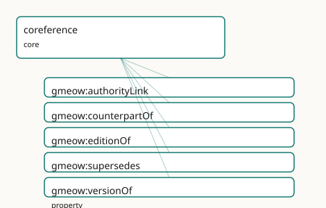

<!-- GENERATED by gmeow ontology-docs. DO NOT EDIT. -->

# GMEOW Coreference Module

- **IRI:** <https://blackcatinformatics.ca/gmeow/slices/coreference>
- **Tier:** core
- **[`Group`](../reference/classes/gmeow-Group.md):** core

## What This Slice Covers

This slice owns 5 terms and contributes 15 mapping or projection rows. Use it when its terms match the native fact you want to preserve; use the linkage tables to see how those facts leave GMEOW for consumer vocabularies.

## Dependencies

- [`gmeow:slices/documents`](documents.md)
- [`gmeow:slices/kernel`](kernel.md)

## Consumers

- Authority links from every slice to Wikidata and registries (P5, never [owl:sameAs](http://www.w3.org/2002/07/owl#sameAs)).

## Local Map



## Examples

### Authority Links

- **Source:** [`slices/core/coreference/examples/authority-links.ttl`](https://github.com/Blackcat-Informatics/gmeow-ontology/blob/main/slices/core/coreference/examples/authority-links.ttl)
- **GMEOW terms:** [`gmeow:CreativeWork`](../reference/classes/gmeow-CreativeWork.md), [`gmeow:Person`](../reference/classes/gmeow-Person.md), [`gmeow:SoftwareAgent`](../reference/classes/gmeow-SoftwareAgent.md), [`gmeow:authorityLink`](../reference/properties/gmeow-authorityLink.md), [`gmeow:counterpartOf`](../reference/properties/gmeow-counterpartOf.md), [`gmeow:editionOf`](../reference/properties/gmeow-editionOf.md), [`gmeow:name`](../reference/properties/gmeow-name.md), [`gmeow:supersedes`](../reference/properties/gmeow-supersedes.md), [`gmeow:title`](../reference/properties/gmeow-title.md)
- **External prefixes:** `owl`, `skos`

```turtle
# SPDX-FileCopyrightText: 2026 Blackcat Informatics® Inc. <paudley@blackcatinformatics.ca>
# SPDX-License-Identifier: CC-BY-4.0
#
# Worked example: coreference WITHOUT identity merge . A locally-recorded
# person is linked to two external authority records — a confident match and a
# near (uncertain) one — using gmeow:authorityLink (the flat pointer) alongside
# skos:exactMatch / skos:closeMatch (graded alignment). GMEOW NEVER asserts
# owl:sameAs to an external entity (Principle 5): identity is aligned by
# reference, with confidence, never collapsed. A creative work and its later
# annotated edition show the intra-corpus coreference edges (editionOf,
# supersedes) that relate distinct records of the "same" thing.
@prefix gmeow: <https://blackcatinformatics.ca/gmeow/> .
@prefix ex:    <https://blackcatinformatics.ca/gmeow/examples/coreference/> .
@prefix skos:  <http://www.w3.org/2004/02/skos/core#> .

# --- A locally-recorded person aligned to external authorities. The exact match
#     is asserted with confidence; the near one stays a CLOSE (not exact) match,
#     so a downstream consumer can choose its own merge threshold.
ex:recordedAuthor a gmeow:Person ;
    gmeow:name "Lin Saito"@en ;
    gmeow:authorityLink <https://orcid.org/0000-0002-1825-0097> ,
                        <http://www.wikidata.org/entity/Q42> ;
    skos:exactMatch <https://orcid.org/0000-0002-1825-0097> ;
    skos:closeMatch <http://www.wikidata.org/entity/Q42> .

# --- A field-robot software identity that is the SAME agent across contexts as
#     the recorded author's account — a counterpart, not a sameAs merge.
ex:fieldRobotIdentity a gmeow:SoftwareAgent ;
    gmeow:name "lin-field-robot"@en ;
    gmeow:counterpartOf ex:recordedAuthor .

# --- Intra-corpus coreference: a work, its annotated edition (a distinct record
#     that is an edition OF the first and SUPERSEDES it for citation).
ex:fieldNotes a gmeow:CreativeWork ;
    gmeow:title "Coastal Field Notes"@en .

ex:fieldNotesAnnotated a gmeow:CreativeWork ;
    gmeow:title "Coastal Field Notes, annotated edition"@en ;
    gmeow:editionOf ex:fieldNotes ;
    gmeow:supersedes ex:fieldNotes .
```

## Terms

### Properties

| Term | Label | Definition |
|---|---|---|
| [`gmeow:authorityLink`](../reference/properties/gmeow-authorityLink.md) | authority link | Links a GMEOW entity to a record in an external authority, registry, database, gazetteer, or catalogue by IRI. It is a see-also authority pointer, not an OWL i... |
| [`gmeow:counterpartOf`](../reference/properties/gmeow-counterpartOf.md) | counterpart of | Relates two GMEOW entities that are recognisable counterparts across realms, frames, datasets, editions, or modelling contexts without being safely mergeable.... |
| [`gmeow:editionOf`](../reference/properties/gmeow-editionOf.md) | edition of | Relates a concrete edition, issue, or manifestation of a creative work to the stable work it editions. Functional per edition, non-merge semantics: editions re... |
| [`gmeow:supersedes`](../reference/properties/gmeow-supersedes.md) | supersedes | Relates a newer entity, version, record, or claim-bearing artifact to a prior one it supersedes. Non-functional: one successor may consolidate several predeces... |
| [`gmeow:versionOf`](../reference/properties/gmeow-versionOf.md) | version of | Relates a concrete version entity to the stable lineage entity it versions: a language version to its language, a software release to its project, a data relea... |

## Linkages

- **Rows:** 15
- **Projection profiles:** `dcterms`, `oai_dc`, `schema-org`
- **External vocabularies:** `dc`, `dcterms`, `mads`, `prov`, `schema`, `wdt`, `whg`

| Source | Kind | Profile | Predicate/Relation | Target | Evidence |
|---|---|---|---|---|---|
| [`gmeow:authorityLink`](../reference/properties/gmeow-authorityLink.md) | equivalence | `-` | [skos:exactMatch](http://www.w3.org/2004/02/skos/core#exactMatch) | [mads:hasCloseExternalAuthority](http://www.loc.gov/mads/rdf/v1#hasCloseExternalAuthority) | `gmeow-coreference.sssom.tsv`; `gmeow:eqCoreference006`; confidence 0.9 |
| [`gmeow:authorityLink`](../reference/properties/gmeow-authorityLink.md) | equivalence | `-` | [skos:closeMatch](http://www.w3.org/2004/02/skos/core#closeMatch) | [schema:sameAs](https://schema.org/sameAs) | `gmeow-coreference.sssom.tsv`; `gmeow:eqCoreference001`; confidence 0.7 |
| [`gmeow:authorityLink`](../reference/properties/gmeow-authorityLink.md) | equivalence | `-` | [skos:closeMatch](http://www.w3.org/2004/02/skos/core#closeMatch) | [whg:closeMatch](https://whgazetteer.org/closeMatch) | `gmeow-places.sssom.tsv`; `gmeow:eqPlaces075`; confidence 0.7 |
| [`gmeow:counterpartOf`](../reference/properties/gmeow-counterpartOf.md) | equivalence | `-` | [skos:closeMatch](http://www.w3.org/2004/02/skos/core#closeMatch) | [prov:alternateOf](http://www.w3.org/ns/prov#alternateOf) | `gmeow-coreference.sssom.tsv`; `gmeow:eqCoreference002`; confidence 0.8 |
| [`gmeow:editionOf`](../reference/properties/gmeow-editionOf.md) | equivalence | `-` | [skos:closeMatch](http://www.w3.org/2004/02/skos/core#closeMatch) | [dcterms:isVersionOf](http://purl.org/dc/terms/isVersionOf) | `gmeow-coreference.sssom.tsv`; `gmeow:eqCoreference004`; confidence 0.7 |
| [`gmeow:supersedes`](../reference/properties/gmeow-supersedes.md) | equivalence | `-` | [skos:closeMatch](http://www.w3.org/2004/02/skos/core#closeMatch) | [dcterms:replaces](http://purl.org/dc/terms/replaces) | `gmeow-coreference.sssom.tsv`; `gmeow:eqCoreference005`; confidence 0.85 |
| [`gmeow:supersedes`](../reference/properties/gmeow-supersedes.md) | equivalence | `-` | [skos:closeMatch](http://www.w3.org/2004/02/skos/core#closeMatch) | [dcterms:replaces](http://purl.org/dc/terms/replaces) | `gmeow-dublin-core.sssom.tsv`; `gmeow:eqDcTerms019`; confidence 0.85 |
| [`gmeow:supersedes`](../reference/properties/gmeow-supersedes.md) | equivalence | `-` | [skos:closeMatch](http://www.w3.org/2004/02/skos/core#closeMatch) | [wdt:P1365](https://www.wikidata.org/wiki/Property:P1365) | `gmeow-lifecycle.sssom.tsv`; `gmeow:eqLifecycle003`; confidence 0.9 |
| [`gmeow:versionOf`](../reference/properties/gmeow-versionOf.md) | equivalence | `-` | [skos:closeMatch](http://www.w3.org/2004/02/skos/core#closeMatch) | [dcterms:isVersionOf](http://purl.org/dc/terms/isVersionOf) | `gmeow-coreference.sssom.tsv`; `gmeow:eqCoreference003`; confidence 0.85 |
| [`gmeow:versionOf`](../reference/properties/gmeow-versionOf.md) | equivalence | `-` | [skos:closeMatch](http://www.w3.org/2004/02/skos/core#closeMatch) | [dcterms:isVersionOf](http://purl.org/dc/terms/isVersionOf) | `gmeow-dublin-core.sssom.tsv`; `gmeow:eqDcTerms022`; confidence 0.85 |
| [`gmeow:authorityLink`](../reference/properties/gmeow-authorityLink.md) | projection | `schema-org` | projects to / <= | [schema:sameAs](https://schema.org/sameAs) | `gmeow:mapSchemaExactAuthorityLink`; confidence 0.8; lossy: authority provenance, confidence, standpoint, and exact-vs-close match distinction collapse to a schema.org identity URL; [skos:closeMatch](http://www.w3.org/2004/02/skos/core#closeMatch) authority links are not emitted |
| [`gmeow:supersedes`](../reference/properties/gmeow-supersedes.md) | projection | `dcterms` | projects to / = | [dcterms:replaces](http://purl.org/dc/terms/replaces) | `gmeow:mapDctermsReplaces`; confidence 0.85 |
| [`gmeow:supersedes`](../reference/properties/gmeow-supersedes.md) | projection | `oai_dc` | projects to / <= | [dc:relation](http://purl.org/dc/elements/1.1/relation) | `gmeow:mapOaiDcReplaces`; confidence 0.7; lossy: all relation refinements collapse to [dc:relation](http://purl.org/dc/elements/1.1/relation) |
| [`gmeow:versionOf`](../reference/properties/gmeow-versionOf.md) | projection | `dcterms` | projects to / = | [dcterms:isVersionOf](http://purl.org/dc/terms/isVersionOf) | `gmeow:mapDctermsIsVersionOf`; confidence 0.85 |
| [`gmeow:versionOf`](../reference/properties/gmeow-versionOf.md) | projection | `oai_dc` | projects to / <= | [dc:relation](http://purl.org/dc/elements/1.1/relation) | `gmeow:mapOaiDcIsVersionOf`; confidence 0.7; lossy: all relation refinements collapse to [dc:relation](http://purl.org/dc/elements/1.1/relation) |

## Guide

<!-- SPDX-FileCopyrightText: 2026 Blackcat Informatics® Inc. <paudley@blackcatinformatics.ca> -->
<!-- SPDX-License-Identifier: CC-BY-4.0 -->

# Coreference — identity by reference, never by merger

> **Slice:** `https://blackcatinformatics.ca/gmeow/slices/coreference` · **tier: core**
> The slice that lets GMEOW point at the rest of the world's records without ever marrying them.

Universal identity and coreference links: stable GMEOW entities link to external records and cross-realm counterparts by reference, never by [owl:sameAs](http://www.w3.org/2002/07/owl#sameAs) merger. Wikidata is the recommended hub, but all authority records remain external claims that may be exact, close, contested, or standpoint-indexed.

The doctrine is [Principle 5](https://github.com/Blackcat-Informatics/gmeow-ontology/blob/main/CONSTITUTION.md#principle-5) applied to identity. [`owl:sameAs`](http://www.w3.org/2002/07/owl#sameAs) is a logical sledgehammer:
it merges every property of both nodes, propagates upstream errors as entailments, and
collapses standpoints that were deliberately kept apart. GMEOW therefore never asserts
it across system boundaries. The stable entity is the GMEOW node itself; an external
record is an *authority reference* attached with [`gmeow:authorityLink`](../reference/properties/gmeow-authorityLink.md), and the
*strength* of the coreference is a separate, explicit claim ([`skos:exactMatch`](http://www.w3.org/2004/02/skos/core#exactMatch) /
[`skos:closeMatch`](http://www.w3.org/2004/02/skos/core#closeMatch) in instance data). A contested identification is several
standpoint-indexed claims that coexist ([Principle 9](https://github.com/Blackcat-Informatics/gmeow-ontology/blob/main/CONSTITUTION.md#principle-9)); a withdrawn one is suppressed
with [`gmeow:displayable`](../reference/properties/gmeow-displayable.md) false, never deleted ([Principle 10](https://github.com/Blackcat-Informatics/gmeow-ontology/blob/main/CONSTITUTION.md#principle-10)).

The same by-reference stance covers identity *within* the graph: counterparts across
realms and frames stay linked but unmerged, and version/edition/supersession lineage
keeps every member of the lineage first-class.

## Authority and counterpart links

### [`gmeow:authorityLink`](../reference/properties/gmeow-authorityLink.md)

The universal pointer from a GMEOW entity to a record in an external authority,
registry, database, gazetteer, or catalogue — by IRI, range intentionally open. It is a
see-also authority pointer, **not** an OWL identity merge; assert match strength
separately with [`skos:exactMatch`](http://www.w3.org/2004/02/skos/core#exactMatch) or [`skos:closeMatch`](http://www.w3.org/2004/02/skos/core#closeMatch). Wikidata is the recommended hub
because its cross-references reach most other authorities — one well-chosen QID buys
VIAF, GeoNames, and ORCID transitively (the maximal-linkage convention curl-validates
QIDs at gate time).

### [`gmeow:counterpartOf`](../reference/properties/gmeow-counterpartOf.md)

Symmetric — and deliberately *not* transitive — linkage between two GMEOW entities that
are recognisable counterparts across realms, datasets, editions, or modelling contexts
without being safely mergeable: the historical person and their fictionalized portrayal,
the same place in two gazetteers' worldviews. Non-transitivity is the point: counterpart
chains must not silently weld A to C through B.

## Version, edition, and supersession lineage

### [`gmeow:versionOf`](../reference/properties/gmeow-versionOf.md)

Relates a concrete version entity to the stable lineage entity it versions — a language
version to its language, a software release to its project, a data release to its
dataset. Functional (a version belongs to one lineage); the lineage has many versions.

### [`gmeow:editionOf`](../reference/properties/gmeow-editionOf.md)

The creative-work specialization: a concrete edition, issue, or manifestation pointing
to the stable work it editions. Functional per edition, non-merge semantics — editions
remain first-class CreativeWorks with their own identifiers, dates, rights, and
provenance. Bridges directly to the WEMI spine in `documents`/`creative-works`.

### [`gmeow:supersedes`](../reference/properties/gmeow-supersedes.md)

Relates a newer entity, version, record, or claim-bearing artifact to a prior one it
replaces. Non-functional: one successor may consolidate several predecessors. The
superseded entity is retained and usable ([Principle 10](https://github.com/Blackcat-Informatics/gmeow-ontology/blob/main/CONSTITUTION.md#principle-10)); suppression from display is a
separate decision ([`gmeow:displayable`](../reference/properties/gmeow-displayable.md) false). The lifecycle slice supplies the inverse
([`gmeow:supersededBy`](../reference/properties/gmeow-supersededBy.md)) and the event-shaped view ([`gmeow:eventTypeSupersession`](../reference/individuals/gmeow-eventTypeSupersession.md)) when
the replacement itself needs a date, location, or participants.

## Solver layer & deferred alignment

[`Entity`](../reference/classes/gmeow-Entity.md) *resolution* — deciding that two records corefer, scoring the match, clustering
candidates — is solver-layer computation ([Principle 12](https://github.com/Blackcat-Informatics/gmeow-ontology/blob/main/CONSTITUTION.md#principle-12)): the slice records asserted
links and their declared strengths; it never derives identity. The SKOS mapping
vocabulary is consumed by reference in instance data ([Principle 5](https://github.com/Blackcat-Informatics/gmeow-ontology/blob/main/CONSTITUTION.md#principle-5)), and the
maximal-linkage doctrine expects every slice to exercise these links — coreference is
the one slice whose job is to be everyone else's out-edge.

## Dependencies

Depends on `kernel` and `documents` (the [`CreativeWork`](../reference/classes/gmeow-CreativeWork.md) range of [`editionOf`](../reference/properties/gmeow-editionOf.md)). Consumed
by every slice that links to Wikidata and external registries — which, under the
maximal-linkage convention, is all of them.
