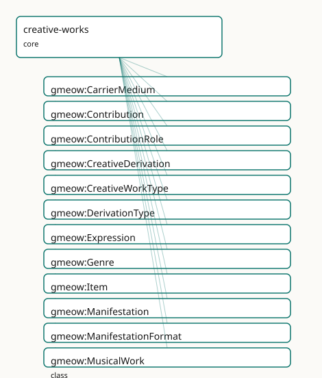

<!-- GENERATED by gmeow ontology-docs. DO NOT EDIT. Source hash: c99d8d50c0344040. -->

# GMEOW Creative Works Module

- **IRI:** <https://blackcatinformatics.ca/gmeow/slices/creative-works>
- **Tier:** core
- **[`Group`](../reference/classes/gmeow-Group.md):** core

## What This Slice Covers

This slice owns 153 terms and contributes 159 mapping or projection rows. Use it when its terms match the native fact you want to preserve; use the linkage tables to see how those facts leave GMEOW for consumer vocabularies.

## Dependencies

- [`gmeow:slices/citations`](citations.md)
- [`gmeow:slices/coreference`](coreference.md)
- [`gmeow:slices/documents`](documents.md)
- [`gmeow:slices/kernel`](kernel.md)

## Consumers

- The WEMI spine under documents, software products, citations, and the music slice.

## Local Map



## Examples

### Wemi Novel

- **Source:** [`slices/core/creative-works/examples/wemi-novel.ttl`](https://github.com/Blackcat-Informatics/gmeow-ontology/blob/main/slices/core/creative-works/examples/wemi-novel.ttl)
- **GMEOW terms:** [`gmeow:Expression`](../reference/classes/gmeow-Expression.md), [`gmeow:Item`](../reference/classes/gmeow-Item.md), [`gmeow:Manifestation`](../reference/classes/gmeow-Manifestation.md), [`gmeow:Work`](../reference/classes/gmeow-Work.md), [`gmeow:embodies`](../reference/properties/gmeow-embodies.md), [`gmeow:exemplifies`](../reference/properties/gmeow-exemplifies.md), [`gmeow:realizes`](../reference/properties/gmeow-realizes.md), [`gmeow:title`](../reference/properties/gmeow-title.md)

```turtle
# SPDX-FileCopyrightText: 2026 Blackcat Informatics® Inc. <paudley@blackcatinformatics.ca>
# SPDX-License-Identifier: CC-BY-4.0
#
# Worked example: the WEMI spine (, ). One abstract Work is realized by
# Expressions (the original text and a translation — distinct intellectual
# realizations of the same work), each embodied by Manifestations (the hardback
# and the ebook of the English text), each exemplified by Items (a specific
# physical or licensed copy). The four tiers are kept distinct so a translation,
# an edition, and a single library copy each sit at the right level — where
# surface vocabularies collapse all four into one "book" record.
@prefix gmeow: <https://blackcatinformatics.ca/gmeow/> .
@prefix ex:    <https://blackcatinformatics.ca/gmeow/examples/creative-works/> .

# --- Work: the abstract intellectual creation, independent of any text or copy.
ex:novel a gmeow:Work ;
    gmeow:title "The Lighthouse at World's End"@en .

# --- Expressions: two realizations of the one Work (P9-style co-equality — the
#     translation is not a lesser version, just another Expression).
ex:englishText a gmeow:Expression ;
    gmeow:realizes ex:novel .

ex:frenchText a gmeow:Expression ;
    gmeow:realizes ex:novel .

# --- Manifestations: two embodiments of the English Expression (print + digital).
ex:hardback a gmeow:Manifestation ;
    gmeow:embodies ex:englishText .

ex:ebook a gmeow:Manifestation ;
    gmeow:embodies ex:englishText .

# --- Item: one exemplar — a specific physical copy of the hardback.
ex:libraryCopy a gmeow:Item ;
    gmeow:exemplifies ex:hardback .
```

## Terms

### Classes

| Term | Label | Definition |
|---|---|---|
| [`gmeow:CarrierMedium`](../reference/classes/gmeow-CarrierMedium.md) | Carrier Medium | The medium of a physical carrier — a VALUE vocabulary (individuals, never subclasses). Print, e-ink file, optical disc, and server object are examples; the set... |
| [`gmeow:Contribution`](../reference/classes/gmeow-Contribution.md) | Contribution | A reified relator binding a contributor (Agent), a contribution target (a Work, Expression, Manifestation, or Item), a contribution role, and an optional degre... |
| [`gmeow:ContributionRole`](../reference/classes/gmeow-ContributionRole.md) | Contribution Role | The role an agent played in contributing to a creative work — a VALUE vocabulary (individuals, never subclasses). Author, editor, translator, illustrator, narr... |
| [`gmeow:CreativeDerivation`](../reference/classes/gmeow-CreativeDerivation.md) | Creative Derivation | A reified relator binding a source creative work, a product creative work, one or more derivation types, and optional source/product segments. Tier-honest: a s... |
| [`gmeow:CreativeWorkType`](../reference/classes/gmeow-CreativeWorkType.md) | Creative Work Type | The kind of a creative work — a VALUE vocabulary (individuals, never subclasses) characterizing a [`gmeow:Work`](../reference/classes/gmeow-Work.md). Literary, musical, visual, and software are examp... |
| [`gmeow:DerivationType`](../reference/classes/gmeow-DerivationType.md) | Derivation Type | The kind of creative derivation relating a source and product — a VALUE vocabulary (individuals, never subclasses). Cover, remix, sample, arrangement, transcri... |
| [`gmeow:Expression`](../reference/classes/gmeow-Expression.md) | Expression | A realization of a [`gmeow:Work`](../reference/classes/gmeow-Work.md) in a specific language, script, notation, or arrangement. The original-language text, a translation, and an audiobook narration a... |
| [`gmeow:Genre`](../reference/classes/gmeow-Genre.md) | Genre | A contested, registry-independent, lineage-bearing information object used to characterise creative works. Like [`gmeow:Language`](../reference/classes/gmeow-Language.md), a genre is a first-class indivi... |
| [`gmeow:Item`](../reference/classes/gmeow-Item.md) | Item | A single exemplar of a [`gmeow:Manifestation`](../reference/classes/gmeow-Manifestation.md) — one copy. An InformationObject; a physical copy is linked via [`gmeow:hasCarrier`](../reference/properties/gmeow-hasCarrier.md) to a [`gmeow:PhysicalObject`](../reference/classes/gmeow-PhysicalObject.md), keeping... |
| [`gmeow:Manifestation`](../reference/classes/gmeow-Manifestation.md) | Manifestation | A concrete edition, format, or release that embodies a [`gmeow:Expression`](../reference/classes/gmeow-Expression.md) — a rights-bearing publication artifact (the 2003 Penguin paperback, the 2011 Kindle EP... |
| [`gmeow:ManifestationFormat`](../reference/classes/gmeow-ManifestationFormat.md) | Manifestation Format | The physical or digital format of a Manifestation — a VALUE vocabulary (individuals, never subclasses). Hardcover, paperback, EPUB, PDF, audiobook, vinyl, and... |
| [`gmeow:MusicalWork`](../reference/classes/gmeow-MusicalWork.md) | Musical Work | A work whose primary content is music — the abstract artistic conception independent of any particular notation, performance, or recording. A specialization of... |
| [`gmeow:RealizationMode`](../reference/classes/gmeow-RealizationMode.md) | Realization Mode | The mode in which a musical Expression realizes its Work — a VALUE vocabulary (individuals, never subclasses). The oral-tradition guarantee requires that no sh... |
| [`gmeow:Recording`](../reference/classes/gmeow-Recording.md) | Recording | A concrete audio manifestation of a musical work or expression — a take, master, released track, or any other fixed sound recording. Co-equal sibling of gmeow:... |
| [`gmeow:ScoreEdition`](../reference/classes/gmeow-ScoreEdition.md) | Score Edition | A concrete notated manifestation of a musical work or expression — a printed score, engraving, MusicXML file, MEI document, or any other symbolic edition. Co-e... |
| [`gmeow:Work`](../reference/classes/gmeow-Work.md) | Work | A distinct abstract intellectual or artistic creation, independent of any language, notation, edition, or copy — the story, the composition, the visual concept... |

### Properties

| Term | Label | Definition |
|---|---|---|
| [`gmeow:arrangementOf`](../reference/properties/gmeow-arrangementOf.md) | arrangement of | A flat shortcut asserting that a creative work is an arrangement derived from another creative work. The reified form is a [`gmeow:CreativeDerivation`](../reference/classes/gmeow-CreativeDerivation.md) with gmeow:... |
| [`gmeow:audience`](../reference/properties/gmeow-audience.md) | audience | The intended audience of a creative work. |
| [`gmeow:conformsTo`](../reference/properties/gmeow-conformsTo.md) | conforms to | An established standard to which the described resource conforms. |
| [`gmeow:contributionDegree`](../reference/properties/gmeow-contributionDegree.md) | contribution degree | The degree or weight of the contribution — lead, equal, or supporting. Optional (≤1 per Contribution). A value from the open [`gmeow:ContributionDegree`](../reference/classes/gmeow-ContributionDegree.md) vocabular... |
| [`gmeow:contributionRole`](../reference/properties/gmeow-contributionRole.md) | contribution role | The role the contributor played in this Contribution — a value from the open [`gmeow:ContributionRole`](../reference/classes/gmeow-ContributionRole.md) vocabulary. Functional per relator: one role per Contributi... |
| [`gmeow:contributionTarget`](../reference/properties/gmeow-contributionTarget.md) | contribution target | The creative-work target of this Contribution — a Work, Expression, Manifestation, or Item. Functional per relator: one target per Contribution. |
| [`gmeow:contributor`](../reference/properties/gmeow-contributor.md) | contributor | The agent that contributed to the target in this Contribution. Functional per relator: one contributor per Contribution. |
| [`gmeow:coverOf`](../reference/properties/gmeow-coverOf.md) | cover of | A flat shortcut asserting that a creative work is a cover version derived from another creative work. The reified form is a [`gmeow:CreativeDerivation`](../reference/classes/gmeow-CreativeDerivation.md) with gmeow... |
| [`gmeow:derivationProduct`](../reference/properties/gmeow-derivationProduct.md) | derivation product | The product creative work that was derived from the source. Functional per relator: one product per CreativeDerivation. |
| [`gmeow:derivationSource`](../reference/properties/gmeow-derivationSource.md) | derivation source | The ancestor lexical item or form from which the target is derived. Functional per relator: one source per EtymologicalDerivation (a derivation with multiple s... |
| [`gmeow:derivationType`](../reference/properties/gmeow-derivationType.md) | derivation type | The kind(s) of derivation relating source and product — cover, remix, sample, arrangement, etc. Non-functional: a single derivation may combine types (e.g. a s... |
| [`gmeow:embodiedIn`](../reference/properties/gmeow-embodiedIn.md) | embodied in | Relates an Expression to a Manifestation that embodies it. Non-functional: an Expression may be embodied in many Manifestations (hardcover, paperback, EPUB). I... |
| [`gmeow:embodies`](../reference/properties/gmeow-embodies.md) | embodies | Relates a Manifestation to the Expression it embodies. Non-functional: a collected edition may embody multiple Expressions. Inverse of [`gmeow:embodiedIn`](../reference/properties/gmeow-embodiedIn.md). |
| [`gmeow:exemplifiedBy`](../reference/properties/gmeow-exemplifiedBy.md) | exemplified by | A document whose prose EXEMPLIFIES the voice — byte-perfect, carrying [`gmeow:contentDigest`](../reference/properties/gmeow-contentDigest.md) (SHACL: an undigested exemplar can drift silently) and gmeow:hasAbout... |
| [`gmeow:exemplifies`](../reference/properties/gmeow-exemplifies.md) | exemplifies | Relates an Item to the Manifestation it exemplifies. Non-functional: a single Item may exemplify multiple Manifestations when catalogued as a bound volume. Inv... |
| [`gmeow:hasArranger`](../reference/properties/gmeow-hasArranger.md) | has arranger | Relates a creative work to the agent who arranged its musical content. Flat shortcut subproperty of [`gmeow:hasContributor`](../reference/properties/gmeow-hasContributor.md). |
| [`gmeow:hasAuthor`](../reference/properties/gmeow-hasAuthor.md) | has author | Relates a creative work to an agent chiefly responsible for creating its intellectual content. A flat shortcut subproperty of [`gmeow:hasContributor`](../reference/properties/gmeow-hasContributor.md). |
| [`gmeow:hasCarrier`](../reference/properties/gmeow-hasCarrier.md) | has carrier | Relates an Item to the PhysicalObject that carries it — a printed book, a vinyl disc, a sculpture. Optional: a born-digital Item may have no carrier, or its ca... |
| [`gmeow:hasComposer`](../reference/properties/gmeow-hasComposer.md) | has composer | Relates a creative work to the agent who composed its musical content. Flat shortcut subproperty of [`gmeow:hasContributor`](../reference/properties/gmeow-hasContributor.md). |
| [`gmeow:hasConductor`](../reference/properties/gmeow-hasConductor.md) | has conductor | Relates a creative work or expression to the agent who conducted its musical performance. Flat shortcut subproperty of [`gmeow:hasContributor`](../reference/properties/gmeow-hasContributor.md). |
| [`gmeow:hasContributor`](../reference/properties/gmeow-hasContributor.md) | has contributor | Relates a creative work to an agent that contributed to it — the flat 80%-case shortcut. Non-functional: a work may have many contributors. Promote to a gmeow:... |
| [`gmeow:hasEditor`](../reference/properties/gmeow-hasEditor.md) | has editor | Relates a creative work to an agent that edited, compiled, or curated its content. A flat shortcut subproperty of [`gmeow:hasContributor`](../reference/properties/gmeow-hasContributor.md). |
| [`gmeow:hasGenre`](../reference/properties/gmeow-hasGenre.md) | has genre | Relates a creative work to a genre that characterises it. Non-functional and always contestable: competing genre claims coexist as standpoint-indexed statement... |
| [`gmeow:hasIllustrator`](../reference/properties/gmeow-hasIllustrator.md) | has illustrator | Relates a creative work to an agent that contributed visual illustrations. A flat shortcut subproperty of [`gmeow:hasContributor`](../reference/properties/gmeow-hasContributor.md). |
| [`gmeow:hasLyricist`](../reference/properties/gmeow-hasLyricist.md) | has lyricist | Relates a creative work to the agent who wrote its lyrics. Flat shortcut subproperty of [`gmeow:hasContributor`](../reference/properties/gmeow-hasContributor.md). |
| [`gmeow:hasManifestationFormat`](../reference/properties/gmeow-hasManifestationFormat.md) | has manifestation format | The physical or digital format of this manifestation — hardcover, EPUB, audiobook, web serial, etc. A value from the open [`gmeow:ManifestationFormat`](../reference/classes/gmeow-ManifestationFormat.md) vocabulary. |
| [`gmeow:hasNarrator`](../reference/properties/gmeow-hasNarrator.md) | has narrator | Relates a creative work to an agent that narrated or performed an audiobook, podcast, or other spoken-word rendition. A flat shortcut subproperty of gmeow:hasC... |
| [`gmeow:hasPerformer`](../reference/properties/gmeow-hasPerformer.md) | has performer | Relates a creative work or expression to the agent who performed it. Flat shortcut subproperty of [`gmeow:hasContributor`](../reference/properties/gmeow-hasContributor.md). |
| [`gmeow:hasProducer`](../reference/properties/gmeow-hasProducer.md) | has producer | Relates a creative work or expression to the agent who produced its recording or performance. Flat shortcut subproperty of [`gmeow:hasContributor`](../reference/properties/gmeow-hasContributor.md). |
| [`gmeow:hasTranslator`](../reference/properties/gmeow-hasTranslator.md) | has translator | Relates a creative work to an agent that translated it into another language or notation. A flat shortcut subproperty of [`gmeow:hasContributor`](../reference/properties/gmeow-hasContributor.md). |
| [`gmeow:hasVersion`](../reference/properties/gmeow-hasVersion.md) | has version | A related resource that is a version, edition, or adaptation of the described resource. Inverse of [`gmeow:versionOf`](../reference/properties/gmeow-versionOf.md). |
| [`gmeow:isRequiredBy`](../reference/properties/gmeow-isRequiredBy.md) | is required by | A related resource that requires the described resource to support its function, delivery, or coherence. Inverse of [`gmeow:requires`](../reference/properties/gmeow-requires.md). |
| [`gmeow:medium`](../reference/properties/gmeow-medium.md) | medium | The material or physical carrier of a creative work. A value from the open [`gmeow:CarrierMedium`](../reference/classes/gmeow-CarrierMedium.md) vocabulary. |
| [`gmeow:quotesWork`](../reference/properties/gmeow-quotesWork.md) | quotes work | A flat shortcut asserting that a creative work includes a quotation derived from another creative work. The reified form is a [`gmeow:CreativeDerivation`](../reference/classes/gmeow-CreativeDerivation.md) with gme... |
| [`gmeow:realizationMode`](../reference/properties/gmeow-realizationMode.md) | realization mode | The mode in which an Expression realizes its Work — notated, performed, improvised, orally transmitted, or machine-generated. A frame-carried, value-vocabulary... |
| [`gmeow:realizedThrough`](../reference/properties/gmeow-realizedThrough.md) | realized through | Relates a Work to an Expression that realizes it. Non-functional: a Work may have many Expressions (translations, arrangements, narrations). Inverse of gmeow:r... |
| [`gmeow:realizes`](../reference/properties/gmeow-realizes.md) | realizes | Relates an Expression to the Work it realizes. Non-functional: an omnibus or aggregate Expression may realize multiple Works (e.g. an anthology). Inverse of gm... |
| [`gmeow:remixOf`](../reference/properties/gmeow-remixOf.md) | remix of | A flat shortcut asserting that a creative work is a remix derived from another creative work. The reified form is a [`gmeow:CreativeDerivation`](../reference/classes/gmeow-CreativeDerivation.md) with gmeow:derivat... |
| [`gmeow:requires`](../reference/properties/gmeow-requires.md) | requires | A related resource that is required by the described resource to support its function, delivery, or coherence. |
| [`gmeow:samples`](../reference/properties/gmeow-samples.md) | samples | A flat shortcut asserting that a creative work incorporates a sample derived from another creative work. The reified form is a [`gmeow:CreativeDerivation`](../reference/classes/gmeow-CreativeDerivation.md) with gm... |
| [`gmeow:transcriptionOf`](../reference/properties/gmeow-transcriptionOf.md) | transcription of | A flat shortcut asserting that a creative work is a transcription derived from another creative work. The reified form is a [`gmeow:CreativeDerivation`](../reference/classes/gmeow-CreativeDerivation.md) with gmeow... |

### Individuals

| Term | Label | Definition |
|---|---|---|
| [`gmeow:derivationTypeArrangement`](../reference/individuals/gmeow-derivationTypeArrangement.md) | arrangement | A re-working of a work for different forces or format. |
| [`gmeow:derivationTypeContrafact`](../reference/individuals/gmeow-derivationTypeContrafact.md) | contrafact | A new melody composed over an existing harmonic structure. |
| [`gmeow:derivationTypeCover`](../reference/individuals/gmeow-derivationTypeCover.md) | cover | A new performance or Expression of an existing Work. |
| [`gmeow:derivationTypeInterpolation`](../reference/individuals/gmeow-derivationTypeInterpolation.md) | interpolation | A work that reuses a portion of another work's melody or material in a new composition. |
| [`gmeow:derivationTypeMashup`](../reference/individuals/gmeow-derivationTypeMashup.md) | mashup | A work combining two or more existing sources into a new whole. |
| [`gmeow:derivationTypeOrchestration`](../reference/individuals/gmeow-derivationTypeOrchestration.md) | orchestration | An arrangement specifically for orchestra or instrumental forces. |
| [`gmeow:derivationTypeParody`](../reference/individuals/gmeow-derivationTypeParody.md) | parody | A work that imitates another work for comic or critical effect. |
| [`gmeow:derivationTypeQuotation`](../reference/individuals/gmeow-derivationTypeQuotation.md) | quotation | A work that quotes another work. |
| [`gmeow:derivationTypeRemix`](../reference/individuals/gmeow-derivationTypeRemix.md) | remix | A new work produced by altering or combining elements of an existing recording. |
| [`gmeow:derivationTypeSample`](../reference/individuals/gmeow-derivationTypeSample.md) | sample | A work that incorporates a region or segment of another recording. |
| [`gmeow:derivationTypeTranscription`](../reference/individuals/gmeow-derivationTypeTranscription.md) | transcription | A transfer of a work into a different notation system or medium. |
| [`gmeow:derivationTypeVariation`](../reference/individuals/gmeow-derivationTypeVariation.md) | variation | A work that varies upon a theme or source. |
| [`gmeow:formatAudiobook`](../reference/individuals/gmeow-formatAudiobook.md) | audiobook | An audiobook audio format. |
| [`gmeow:formatCD`](../reference/individuals/gmeow-formatCD.md) | CD | A compact disc audio release. |
| [`gmeow:formatCassette`](../reference/individuals/gmeow-formatCassette.md) | cassette | A cassette tape audio release. |
| [`gmeow:formatComicIssue`](../reference/individuals/gmeow-formatComicIssue.md) | comic issue | A single issue of a comic book series. |
| [`gmeow:formatDigitalFile`](../reference/individuals/gmeow-formatDigitalFile.md) | digital file | A generic digital file format. |
| [`gmeow:formatEPUB`](../reference/individuals/gmeow-formatEPUB.md) | EPUB | An EPUB electronic book format. |
| [`gmeow:formatHardcover`](../reference/individuals/gmeow-formatHardcover.md) | hardcover | A hardcover book edition. |
| [`gmeow:formatLosslessDigitalAudio`](../reference/individuals/gmeow-formatLosslessDigitalAudio.md) | lossless digital audio | A lossless digital audio file release. |
| [`gmeow:formatMEI`](../reference/individuals/gmeow-formatMEI.md) | MEI | An MEI-encoded digital score. |
| [`gmeow:formatMIDIFile`](../reference/individuals/gmeow-formatMIDIFile.md) | MIDI file | A MIDI file manifestation. |
| [`gmeow:formatMusicXML`](../reference/individuals/gmeow-formatMusicXML.md) | MusicXML | A MusicXML-encoded digital score. |
| [`gmeow:formatPDF`](../reference/individuals/gmeow-formatPDF.md) | PDF | A PDF document format. |
| [`gmeow:formatPaperback`](../reference/individuals/gmeow-formatPaperback.md) | paperback | A paperback book edition. |
| [`gmeow:formatPrintedScore`](../reference/individuals/gmeow-formatPrintedScore.md) | printed score | A printed musical score. |
| [`gmeow:formatStreamingAudio`](../reference/individuals/gmeow-formatStreamingAudio.md) | streaming audio | A streaming audio distribution. |
| [`gmeow:formatVinyl`](../reference/individuals/gmeow-formatVinyl.md) | vinyl | A vinyl phonograph record. |
| [`gmeow:formatWebPage`](../reference/individuals/gmeow-formatWebPage.md) | web page | A web page or online document. |
| [`gmeow:formatWebSerial`](../reference/individuals/gmeow-formatWebSerial.md) | web serial | A serialized work published incrementally online. |
| [`gmeow:mediumEInkFile`](../reference/individuals/gmeow-mediumEInkFile.md) | e-ink file | An electronic-ink file or e-book file. |
| [`gmeow:mediumOpticalDisc`](../reference/individuals/gmeow-mediumOpticalDisc.md) | optical disc | An optical disc — CD, DVD, Blu-ray. |
| [`gmeow:mediumPrint`](../reference/individuals/gmeow-mediumPrint.md) | print | A printed paper medium. |
| [`gmeow:mediumServerObject`](../reference/individuals/gmeow-mediumServerObject.md) | server object | A digital object stored on a server. |
| [`gmeow:realizationModeImprovised`](../reference/individuals/gmeow-realizationModeImprovised.md) | improvised | The Expression is realized through improvisation. |
| [`gmeow:realizationModeMachineGenerated`](../reference/individuals/gmeow-realizationModeMachineGenerated.md) | machine generated | The Expression is realized by a machine-generative process. |
| [`gmeow:realizationModeNotated`](../reference/individuals/gmeow-realizationModeNotated.md) | notated | The Expression is realized as a notated score or symbolic representation. |
| [`gmeow:realizationModeOral`](../reference/individuals/gmeow-realizationModeOral.md) | oral | The Expression is realized through oral tradition, with no required notated form. |
| [`gmeow:realizationModePerformed`](../reference/individuals/gmeow-realizationModePerformed.md) | performed | The Expression is realized through live or recorded performance. |
| [`gmeow:roleAIAssistant`](../reference/individuals/gmeow-roleAIAssistant.md) | AI assistant | An AI system that assists in creating or editing software — attributed and confidence-weighted, never ground truth ([Principle 9](https://github.com/Blackcat-Informatics/gmeow-ontology/blob/main/CONSTITUTION.md#principle-9)). |
| [`gmeow:roleArranger`](../reference/individuals/gmeow-roleArranger.md) | arranger | An agent who arranged a musical work for different forces or format. |
| [`gmeow:roleAuthor`](../reference/individuals/gmeow-roleAuthor.md) | author | The creator of the intellectual content of a work. |
| [`gmeow:roleBotContributor`](../reference/individuals/gmeow-roleBotContributor.md) | bot contributor | An automated bot or CI agent that contributes to a project — e.g. dependency updates, formatting bots. |
| [`gmeow:roleCodeReviewer`](../reference/individuals/gmeow-roleCodeReviewer.md) | code reviewer | An agent who reviews code changes for quality, correctness, and policy compliance before merge. |
| [`gmeow:roleComposer`](../reference/individuals/gmeow-roleComposer.md) | composer | An agent who created the musical content of a work — the abstract artistic conception, independent of any particular notation or performance ([Principle 4](https://github.com/Blackcat-Informatics/gmeow-ontology/blob/main/CONSTITUTION.md#principle-4): nota... |
| [`gmeow:roleConceptualization`](../reference/individuals/gmeow-roleConceptualization.md) | conceptualization | Ideas, formulation or evolution of overarching research goals and aims. |
| [`gmeow:roleCoverArtist`](../reference/individuals/gmeow-roleCoverArtist.md) | cover artist | An agent who created cover art for a manifestation. |
| [`gmeow:roleDataCuration`](../reference/individuals/gmeow-roleDataCuration.md) | data curation | Management activities to annotate, scrub data and maintain research data. |
| [`gmeow:roleDirector`](../reference/individuals/gmeow-roleDirector.md) | director | An agent who directed a film, theatre, or choreographic production. |
| [`gmeow:roleEditor`](../reference/individuals/gmeow-roleEditor.md) | editor | An agent who edited, compiled, or curated the content. |
| [`gmeow:roleFormalAnalysis`](../reference/individuals/gmeow-roleFormalAnalysis.md) | formal analysis | Application of statistical, mathematical, computational, or other formal techniques to analyse or synthesize study data. |
| [`gmeow:roleFundingAcquisition`](../reference/individuals/gmeow-roleFundingAcquisition.md) | funding acquisition | Acquisition of the financial support for the project leading to this publication. |
| [`gmeow:roleIllustrator`](../reference/individuals/gmeow-roleIllustrator.md) | illustrator | An agent who contributed visual illustrations. |
| [`gmeow:roleInventor`](../reference/individuals/gmeow-roleInventor.md) | inventor | An agent who invented the subject of a patent. Projects to [schema:inventor](https://schema.org/inventor) via the Contribution pattern. |
| [`gmeow:roleInvestigation`](../reference/individuals/gmeow-roleInvestigation.md) | investigation | Conducting a research and investigation process, specifically performing the experiments, or data/evidence collection. |
| [`gmeow:roleLLMAssistedEditor`](../reference/individuals/gmeow-roleLLMAssistedEditor.md) | LLM-assisted editor | An agent who edited with substantial assistance from a large language model. |
| [`gmeow:roleLetterer`](../reference/individuals/gmeow-roleLetterer.md) | letterer | An agent who lettered or calligraphed text in a visual work. |
| [`gmeow:roleLibrettist`](../reference/individuals/gmeow-roleLibrettist.md) | librettist | An agent who wrote the libretto of an opera, musical, or other staged work. |
| [`gmeow:roleLyricist`](../reference/individuals/gmeow-roleLyricist.md) | lyricist | An agent who wrote the lyrics of a musical work. |
| [`gmeow:roleMasteringEngineer`](../reference/individuals/gmeow-roleMasteringEngineer.md) | mastering engineer | An agent who mastered a recording. |
| [`gmeow:roleMethodology`](../reference/individuals/gmeow-roleMethodology.md) | methodology | Development or design of methodology; creation of models. |
| [`gmeow:roleMixingEngineer`](../reference/individuals/gmeow-roleMixingEngineer.md) | mixing engineer | An agent who mixed a recording. |
| [`gmeow:roleNarrator`](../reference/individuals/gmeow-roleNarrator.md) | narrator | An agent who narrated or performed a spoken-word rendition. |
| [`gmeow:roleOrchestrator`](../reference/individuals/gmeow-roleOrchestrator.md) | orchestrator | An agent who orchestrated a musical work. |
| [`gmeow:rolePhotographer`](../reference/individuals/gmeow-rolePhotographer.md) | photographer | An agent who created photographic content. |
| [`gmeow:roleProjectAdministration`](../reference/individuals/gmeow-roleProjectAdministration.md) | project administration | Management and coordination responsibility for the research activity planning and execution. |
| [`gmeow:rolePublisher`](../reference/individuals/gmeow-rolePublisher.md) | publisher | An agent who published a work — issued and disseminated a manifestation. Projects to [schema:publisher](https://schema.org/publisher) via the Contribution pattern. |
| [`gmeow:roleRecordingEngineer`](../reference/individuals/gmeow-roleRecordingEngineer.md) | recording engineer | An agent who engineered the recording of a musical work. |
| [`gmeow:roleReleaser`](../reference/individuals/gmeow-roleReleaser.md) | releaser | An agent who cuts and publishes software releases. |
| [`gmeow:roleRemixer`](../reference/individuals/gmeow-roleRemixer.md) | remixer | An agent who created a remix of an existing recording. |
| [`gmeow:roleResources`](../reference/individuals/gmeow-roleResources.md) | resources | Provision of study materials, reagents, materials, patients, laboratory samples, animals, instrumentation, computing resources, or other analysis tools. |
| [`gmeow:roleSamplingArtist`](../reference/individuals/gmeow-roleSamplingArtist.md) | sampling artist | An agent who created a work by sampling existing material. |
| [`gmeow:roleSecurityContact`](../reference/individuals/gmeow-roleSecurityContact.md) | security contact | An agent responsible for receiving and handling security vulnerability reports. |
| [`gmeow:roleSoftware`](../reference/individuals/gmeow-roleSoftware.md) | software | Programming, software development; designing computer programs; implementation of the computer code and supporting algorithms. |
| [`gmeow:roleSoftwareDeveloper`](../reference/individuals/gmeow-roleSoftwareDeveloper.md) | software developer | An agent who writes code, fixes bugs, or implements features in a software project. |
| [`gmeow:roleSoftwareMaintainer`](../reference/individuals/gmeow-roleSoftwareMaintainer.md) | software maintainer | An agent with ongoing responsibility for a software project — triaging issues, reviewing contributions, and cutting releases. |
| [`gmeow:roleSongwriter`](../reference/individuals/gmeow-roleSongwriter.md) | songwriter | An agent who wrote the words and/or music of a song. |
| [`gmeow:roleSoundDesigner`](../reference/individuals/gmeow-roleSoundDesigner.md) | sound designer | An agent who designed sound or sonic material for a work. |
| [`gmeow:roleSupervision`](../reference/individuals/gmeow-roleSupervision.md) | supervision | Oversight and leadership responsibility for the research activity planning and execution, including mentorship external to the core team. |
| [`gmeow:roleTranslator`](../reference/individuals/gmeow-roleTranslator.md) | translator | An agent who translated the work into another language or notation. |
| [`gmeow:roleValidation`](../reference/individuals/gmeow-roleValidation.md) | validation | Verification, whether as a part of the activity or separate, of the overall replication/reproducibility of results/experiments and other research outputs. |
| [`gmeow:roleVisualization`](../reference/individuals/gmeow-roleVisualization.md) | visualization | Preparation, creation and/or presentation of the published work, specifically visualization/data presentation. |
| [`gmeow:roleWritingOriginalDraft`](../reference/individuals/gmeow-roleWritingOriginalDraft.md) | writing – original draft | Creation and/or presentation of the published work, specifically writing the initial draft. |
| [`gmeow:roleWritingReviewEditing`](../reference/individuals/gmeow-roleWritingReviewEditing.md) | writing – review & editing | Critical review, commentary or revision – including pre- or post-publication stages. |
| [`gmeow:workTypeAudiovisual`](../reference/individuals/gmeow-workTypeAudiovisual.md) | audiovisual | A work combining moving images and sound — a film, television program, or video. |
| [`gmeow:workTypeCartographic`](../reference/individuals/gmeow-workTypeCartographic.md) | cartographic | A cartographic work — a map, atlas, or geospatial representation. |
| [`gmeow:workTypeChoreographic`](../reference/individuals/gmeow-workTypeChoreographic.md) | choreographic | A choreographic work — a dance piece or movement composition. |
| [`gmeow:workTypeDataset`](../reference/individuals/gmeow-workTypeDataset.md) | dataset | A dataset work — a structured collection of data published as a unit. |
| [`gmeow:workTypeFilm`](../reference/individuals/gmeow-workTypeFilm.md) | film | A cinematic work — a feature film, short film, or documentary. |
| [`gmeow:workTypeLiterary`](../reference/individuals/gmeow-workTypeLiterary.md) | literary | A work of literature — fiction, poetry, drama, or literary non-fiction. |
| [`gmeow:workTypeMusical`](../reference/individuals/gmeow-workTypeMusical.md) | musical | A work whose primary content is music — a song, symphony, composition, or other musical creation, whether notated, performed, improvised, orally transmitted, o... |
| [`gmeow:workTypeNarrative`](../reference/individuals/gmeow-workTypeNarrative.md) | narrative | A work whose primary content is a story or narrative. |
| [`gmeow:workTypePhotographic`](../reference/individuals/gmeow-workTypePhotographic.md) | photographic | A photographic work — a still photograph or photo essay. |
| [`gmeow:workTypeSoftware`](../reference/individuals/gmeow-workTypeSoftware.md) | software | A software work — a program, library, or application. |
| [`gmeow:workTypeVisual`](../reference/individuals/gmeow-workTypeVisual.md) | visual | A visual artwork — a painting, drawing, or digital image. |
| [`gmeow:workTypeWritten`](../reference/individuals/gmeow-workTypeWritten.md) | written | A primarily written work — scholarly, journalistic, or technical. |

## Linkages

- **Rows:** 159
- **Projection profiles:** `bibframe`, `codemeta`, `dcterms`, `doap`, `foaf`, `oai_dc`, `odrl`, `schema-org`
- **External vocabularies:** `bibframe`, `codemeta`, `credit`, `dc`, `dcterms`, `doap`, `fabio`, `foaf`, `frbr`, `lrmoo`, `odrl`, `pav`, `prov`, `schema`, `wd`

| Source | Kind | Profile | Predicate/Relation | Target | Evidence |
|---|---|---|---|---|---|
| [`gmeow:Contribution`](../reference/classes/gmeow-Contribution.md) | equivalence | `-` | [skos:closeMatch](http://www.w3.org/2004/02/skos/core#closeMatch) | [prov:Attribution](http://www.w3.org/ns/prov#Attribution) | `gmeow-citations.sssom.tsv`; `gmeow:eqCit012`; confidence 0.85 |
| [`gmeow:Contribution`](../reference/classes/gmeow-Contribution.md) | equivalence | `-` | [skos:closeMatch](http://www.w3.org/2004/02/skos/core#closeMatch) | [schema:Role](https://schema.org/Role) | `gmeow-narrative.sssom.tsv`; `gmeow:eqNarrative010`; confidence 0.7 |
| [`gmeow:Expression`](../reference/classes/gmeow-Expression.md) | equivalence | `-` | [skos:closeMatch](http://www.w3.org/2004/02/skos/core#closeMatch) | [fabio:Expression](http://purl.org/spar/fabio/Expression) | `gmeow-creative-works.sssom.tsv`; `gmeow:eqCw009`; confidence 0.95 |
| [`gmeow:Expression`](../reference/classes/gmeow-Expression.md) | equivalence | `-` | [owl:equivalentClass](http://www.w3.org/2002/07/owl#equivalentClass) | [frbr:Expression](http://purl.org/vocab/frbr/core#Expression) | `gmeow-creative-works.sssom.tsv`; `gmeow:eqCw002`; confidence 1 |
| [`gmeow:Expression`](../reference/classes/gmeow-Expression.md) | equivalence | `-` | [owl:equivalentClass](http://www.w3.org/2002/07/owl#equivalentClass) | [lrmoo:F2_Expression](http://iflastandards.info/ns/lrm/lrmoo/F2_Expression) | `gmeow-creative-works.sssom.tsv`; `gmeow:eqCw013`; confidence 0.95 |
| [`gmeow:Genre`](../reference/classes/gmeow-Genre.md) | equivalence | `-` | [skos:closeMatch](http://www.w3.org/2004/02/skos/core#closeMatch) | [wd:Q188451](https://www.wikidata.org/wiki/Q188451) | `gmeow-creative-works.sssom.tsv`; `gmeow:eqCw060`; confidence 0.9 |
| [`gmeow:Item`](../reference/classes/gmeow-Item.md) | equivalence | `-` | [skos:closeMatch](http://www.w3.org/2004/02/skos/core#closeMatch) | [bibframe:Item](http://id.loc.gov/ontologies/bibframe/Item) | `gmeow-creative-works.sssom.tsv`; `gmeow:eqCw021`; confidence 0.9 |
| [`gmeow:Item`](../reference/classes/gmeow-Item.md) | equivalence | `-` | [skos:closeMatch](http://www.w3.org/2004/02/skos/core#closeMatch) | [fabio:Item](http://purl.org/spar/fabio/Item) | `gmeow-creative-works.sssom.tsv`; `gmeow:eqCw011`; confidence 0.95 |
| [`gmeow:Item`](../reference/classes/gmeow-Item.md) | equivalence | `-` | [owl:equivalentClass](http://www.w3.org/2002/07/owl#equivalentClass) | [frbr:Item](http://purl.org/vocab/frbr/core#Item) | `gmeow-creative-works.sssom.tsv`; `gmeow:eqCw004`; confidence 1 |
| [`gmeow:Item`](../reference/classes/gmeow-Item.md) | equivalence | `-` | [owl:equivalentClass](http://www.w3.org/2002/07/owl#equivalentClass) | [lrmoo:F5_Item](http://iflastandards.info/ns/lrm/lrmoo/F5_Item) | `gmeow-creative-works.sssom.tsv`; `gmeow:eqCw015`; confidence 0.95 |
| [`gmeow:Manifestation`](../reference/classes/gmeow-Manifestation.md) | equivalence | `-` | [skos:closeMatch](http://www.w3.org/2004/02/skos/core#closeMatch) | [bibframe:Instance](http://id.loc.gov/ontologies/bibframe/Instance) | `gmeow-creative-works.sssom.tsv`; `gmeow:eqCw020`; confidence 0.9 |
| [`gmeow:Manifestation`](../reference/classes/gmeow-Manifestation.md) | equivalence | `-` | [skos:closeMatch](http://www.w3.org/2004/02/skos/core#closeMatch) | [fabio:Manifestation](http://purl.org/spar/fabio/Manifestation) | `gmeow-creative-works.sssom.tsv`; `gmeow:eqCw010`; confidence 0.95 |
| [`gmeow:Manifestation`](../reference/classes/gmeow-Manifestation.md) | equivalence | `-` | [owl:equivalentClass](http://www.w3.org/2002/07/owl#equivalentClass) | [frbr:Manifestation](http://purl.org/vocab/frbr/core#Manifestation) | `gmeow-creative-works.sssom.tsv`; `gmeow:eqCw003`; confidence 1 |
| [`gmeow:Manifestation`](../reference/classes/gmeow-Manifestation.md) | equivalence | `-` | [owl:equivalentClass](http://www.w3.org/2002/07/owl#equivalentClass) | [lrmoo:F3_Manifestation](http://iflastandards.info/ns/lrm/lrmoo/F3_Manifestation) | `gmeow-creative-works.sssom.tsv`; `gmeow:eqCw014`; confidence 0.95 |
| [`gmeow:Manifestation`](../reference/classes/gmeow-Manifestation.md) | equivalence | `-` | [skos:broadMatch](http://www.w3.org/2004/02/skos/core#broadMatch) | [wd:Q3331189](https://www.wikidata.org/wiki/Q3331189) | `gmeow-creative-works.sssom.tsv`; `gmeow:eqCw028`; confidence 0.8 |
| [`gmeow:Work`](../reference/classes/gmeow-Work.md) | equivalence | `-` | [skos:closeMatch](http://www.w3.org/2004/02/skos/core#closeMatch) | [bibframe:Work](http://id.loc.gov/ontologies/bibframe/Work) | `gmeow-creative-works.sssom.tsv`; `gmeow:eqCw019`; confidence 0.8 |
| [`gmeow:Work`](../reference/classes/gmeow-Work.md) | equivalence | `-` | [skos:closeMatch](http://www.w3.org/2004/02/skos/core#closeMatch) | [fabio:Work](http://purl.org/spar/fabio/Work) | `gmeow-creative-works.sssom.tsv`; `gmeow:eqCw008`; confidence 0.95 |
| [`gmeow:Work`](../reference/classes/gmeow-Work.md) | equivalence | `-` | [owl:equivalentClass](http://www.w3.org/2002/07/owl#equivalentClass) | [frbr:Work](http://purl.org/vocab/frbr/core#Work) | `gmeow-creative-works.sssom.tsv`; `gmeow:eqCw001`; confidence 1 |
| [`gmeow:Work`](../reference/classes/gmeow-Work.md) | equivalence | `-` | [owl:equivalentClass](http://www.w3.org/2002/07/owl#equivalentClass) | [lrmoo:F1_Work](http://iflastandards.info/ns/lrm/lrmoo/F1_Work) | `gmeow-creative-works.sssom.tsv`; `gmeow:eqCw012`; confidence 0.95 |
| [`gmeow:Work`](../reference/classes/gmeow-Work.md) | equivalence | `-` | [skos:closeMatch](http://www.w3.org/2004/02/skos/core#closeMatch) | [schema:CreativeWork](https://schema.org/CreativeWork) | `gmeow-creative-works.sssom.tsv`; `gmeow:eqCw023`; confidence 0.75 |
| [`gmeow:Work`](../reference/classes/gmeow-Work.md) | equivalence | `-` | [skos:closeMatch](http://www.w3.org/2004/02/skos/core#closeMatch) | [wd:Q386724](https://www.wikidata.org/wiki/Q386724) | `gmeow-creative-works.sssom.tsv`; `gmeow:eqCw027`; confidence 0.95 |
| [`gmeow:audience`](../reference/properties/gmeow-audience.md) | equivalence | `-` | [skos:closeMatch](http://www.w3.org/2004/02/skos/core#closeMatch) | [dcterms:audience](http://purl.org/dc/terms/audience) | `gmeow-dublin-core.sssom.tsv`; `gmeow:eqDcTerms029`; confidence 0.75 |
| [`gmeow:conformsTo`](../reference/properties/gmeow-conformsTo.md) | equivalence | `-` | [skos:closeMatch](http://www.w3.org/2004/02/skos/core#closeMatch) | [dcterms:conformsTo](http://purl.org/dc/terms/conformsTo) | `gmeow-dublin-core.sssom.tsv`; `gmeow:eqDcTerms023`; confidence 0.85 |
| [`gmeow:contributor`](../reference/properties/gmeow-contributor.md) | equivalence | `-` | [skos:closeMatch](http://www.w3.org/2004/02/skos/core#closeMatch) | [pav:contributedBy](http://purl.org/pav/contributedBy) | `gmeow-creative-works.sssom.tsv`; `gmeow:eqCw053`; confidence 0.9 |
|... |... |... |... |... | 135 more rows |

## Guide

<!-- SPDX-FileCopyrightText: 2026 Blackcat Informatics® Inc. <paudley@blackcatinformatics.ca> -->
<!-- SPDX-License-Identifier: Apache-2.0 -->

# Creative-Works Mapping Guide

This document describes the WEMI ([`Work`](../reference/classes/gmeow-Work.md) / [`Expression`](../reference/classes/gmeow-Expression.md) / [`Manifestation`](../reference/classes/gmeow-Manifestation.md) / [`Item`](../reference/classes/gmeow-Item.md)) spine
introduced in, its design rationale, and its mappings to external
vocabularies.

## The WEMI spine in GMEOW

GMEOW reconstructs the four-tier FRBR/LRMoo distinction using native primitives:

| Tier | Class | Identity criterion | [gUFO](../external/ontologies.md#target-gufo) meta-class |
|---|---|---|---|
| **Work** | [`gmeow:Work`](../reference/classes/gmeow-Work.md) | Abstract intellectual content | [`gufo:Kind`](../external/terms.md#gufo-kind) |
| **Expression** | [`gmeow:Expression`](../reference/classes/gmeow-Expression.md) | Language/notation/arrangement | [`gufo:Kind`](../external/terms.md#gufo-kind) |
| **Manifestation** | [`gmeow:Manifestation`](../reference/classes/gmeow-Manifestation.md) | Edition/format/release | [`gufo:Kind`](../external/terms.md#gufo-kind) |
| **Item** | [`gmeow:Item`](../reference/classes/gmeow-Item.md) | Single exemplar | [`gufo:Kind`](../external/terms.md#gufo-kind) |

[`gmeow:CreativeWork`](../reference/classes/gmeow-CreativeWork.md) is the [`gufo:Category`](../external/terms.md#gufo-category) umbrella over all four tiers. It
replaces the former flat [`gufo:Kind`](../external/terms.md#gufo-kind) (pre-) so that surface-vocabulary
alignments become projections from the umbrella rather than core equivalences.

### Key design decisions

- **[`Expression`](../reference/classes/gmeow-Expression.md) variance by reference frame** ([`gmeow:hasReferenceFrame`](../reference/properties/gmeow-hasReferenceFrame.md)): A
translation is the same [`Work`](../reference/classes/gmeow-Work.md) realized in another language frame; a musical
arrangement is the [`Work`](../reference/classes/gmeow-Work.md) in another notation frame. No subclass taxonomy
explosion ([Principle 9](https://github.com/Blackcat-Informatics/gmeow-ontology/blob/main/CONSTITUTION.md#principle-9)).
- **Creation as reified Events** ([`gmeow:eventType`](../reference/properties/gmeow-eventType.md) values): [`Work`](../reference/classes/gmeow-Work.md) conception,
[`Expression`](../reference/classes/gmeow-Expression.md) creation, and [`Manifestation`](../reference/classes/gmeow-Manifestation.md) production are event types, not [`Event`](../reference/classes/gmeow-Event.md)
subclasses ([Principle 12](https://github.com/Blackcat-Informatics/gmeow-ontology/blob/main/CONSTITUTION.md#principle-12)).
- **[`Contribution`](../reference/classes/gmeow-Contribution.md) relator + flat shortcuts**: [`gmeow:Contribution`](../reference/classes/gmeow-Contribution.md) binds
contributor × target × role with provenance/period/confidence; flat shortcuts
([`hasAuthor`](../reference/properties/gmeow-hasAuthor.md), [`hasTranslator`](../reference/properties/gmeow-hasTranslator.md), …) cover the 80% case.
- **Open value vocabularies**: [`CreativeWorkType`](../reference/classes/gmeow-CreativeWorkType.md), [`ContributionRole`](../reference/classes/gmeow-ContributionRole.md),
[`ManifestationFormat`](../reference/classes/gmeow-ManifestationFormat.md), and [`CarrierMedium`](../reference/classes/gmeow-CarrierMedium.md) are individuals, never subclasses
([Principle 9](https://github.com/Blackcat-Informatics/gmeow-ontology/blob/main/CONSTITUTION.md#principle-9)).
- **No primary/privileged claim**: Co-equal multilingual titles, no canonical
edition. Superseded values use [`gmeow:displayable`](../reference/properties/gmeow-displayable.md) false (Principles 9–10).

## External mappings

### FRBRcore (equivalence by reference)

`gmeow:Work/Expression/Manifestation/Item` are [`owl:equivalentClass`](http://www.w3.org/2002/07/owl#equivalentClass) to their
FRBRcore counterparts. The spine relations (`realizes`, `embodies`, `exemplifies`)
are [`owl:equivalentProperty`](http://www.w3.org/2002/07/owl#equivalentProperty) to FRBR R-relations.

### FaBiO / SPAR ontologies (closeMatch)

FaBiO's WEMI classes are scholarly-publication-scoped; GMEOW's are universal.
Mapped as [`skos:closeMatch`](http://www.w3.org/2004/02/skos/core#closeMatch) with confidence 0.95.

### LRMoo (equivalence by reference)

[`gmeow:Work`](../reference/classes/gmeow-Work.md) ↔ [`lrmoo:F1_Work`](http://iflastandards.info/ns/lrm/lrmoo/F1_Work), [`Expression`](../reference/classes/gmeow-Expression.md) ↔ `F2`, [`Manifestation`](../reference/classes/gmeow-Manifestation.md) ↔ `F3`,
[`Item`](../reference/classes/gmeow-Item.md) ↔ `F5`. Creation event types map to `F27` and `F28` as [`skos:closeMatch`](http://www.w3.org/2004/02/skos/core#closeMatch).

### BIBFRAME 2.0

[`Manifestation`](../reference/classes/gmeow-Manifestation.md) ↔ `bf:Instance` and [`Item`](../reference/classes/gmeow-Item.md) ↔ `bf:Item` are [`owl:equivalentClass`](http://www.w3.org/2002/07/owl#equivalentClass).
[`Work`](../reference/classes/gmeow-Work.md) ↔ `bf:Work` is [`skos:closeMatch`](http://www.w3.org/2004/02/skos/core#closeMatch) (lossy: BIBFRAME conflates [`Work`](../reference/classes/gmeow-Work.md)+[`Expression`](../reference/classes/gmeow-Expression.md)).

### schema.org (lossy projection)

[`CreativeWork`](../reference/classes/gmeow-CreativeWork.md) → [`schema:CreativeWork`](https://schema.org/CreativeWork) ([`skos:closeMatch`](http://www.w3.org/2004/02/skos/core#closeMatch), confidence 0.8).
The WEMI spine collapses to one flat node in schema.org; relations flatten to
`workExample` / `exampleOfWork`. [`BookRelease`](../reference/classes/gmeow-BookRelease.md) → [`schema:Book`](https://schema.org/Book);
[`MediaObject`](../reference/classes/gmeow-MediaObject.md) → [`schema:MediaObject`](https://schema.org/MediaObject); [`WebPage`](../reference/classes/gmeow-WebPage.md) → [`schema:WebPage`](https://schema.org/WebPage).

### Wikidata

[`Work`](../reference/classes/gmeow-Work.md) → [`wd:Q386724`](https://www.wikidata.org/wiki/Q386724) (*work*). [`Manifestation`](../reference/classes/gmeow-Manifestation.md) → [`wd:Q3331189`](https://www.wikidata.org/wiki/Q3331189)
(*version, edition or translation*) as [`skos:broadMatch`](http://www.w3.org/2004/02/skos/core#broadMatch) (lossy: muddles
edition and translation). [`CreativeWorkType`](../reference/classes/gmeow-CreativeWorkType.md) seeds map to specific Wikidata items
([Q571](https://www.wikidata.org/wiki/Q571) *book*, [Q7725634](https://www.wikidata.org/wiki/Q7725634) *literary work*, [Q47461344](https://www.wikidata.org/wiki/Q47461344) *written work*, etc.).

## Refactor impact on existing classes

The former flat `documents.ttl` classes were re-homed:

- **[`Work`](../reference/classes/gmeow-Work.md) specializations**: [`Document`](../reference/classes/gmeow-Document.md), [`Article`](../reference/classes/gmeow-Article.md), [`Patent`](../reference/classes/gmeow-Patent.md), [`Dataset`](../reference/classes/gmeow-Dataset.md),
 [`SoftwareProject`](../reference/classes/gmeow-SoftwareProject.md)
- **[`Manifestation`](../reference/classes/gmeow-Manifestation.md) specializations**: [`BookRelease`](../reference/classes/gmeow-BookRelease.md), [`SerialInstallment`](../reference/classes/gmeow-SerialInstallment.md),
 [`MediaObject`](../reference/classes/gmeow-MediaObject.md), [`WebPage`](../reference/classes/gmeow-WebPage.md)

[`CreativeWorkTitle`](../reference/classes/gmeow-CreativeWorkTitle.md), [`hasTitle`](../reference/properties/gmeow-hasTitle.md), `title`, `identifier`, and [`datePublished`](../reference/properties/gmeow-datePublished.md)
retain their domains (now the [`CreativeWork`](../reference/classes/gmeow-CreativeWork.md) umbrella) and continue to function
for all WEMI tiers.

## References

1. IFLA Library Reference Model (LRM), 2017.
2. FRBR — Functional Requirements for Bibliographic Records, 1998/2009.
3. FaBiO and the SPAR ontologies (Peroni & Shotton).
4. [CIDOC-CRM](../external/ontologies.md#target-crm) Conceptual Reference Model.
5. LRMoo ([CIDOC-CRM](../external/ontologies.md#target-crm) [`Issue`](../reference/classes/gmeow-Issue.md) ID-360).
6. BIBFRAME 2.0 Model — Library of Congress.
7. schema.org [`CreativeWork`](../reference/classes/gmeow-CreativeWork.md).
8. OpenWEMI — Code4Lib Journal.
