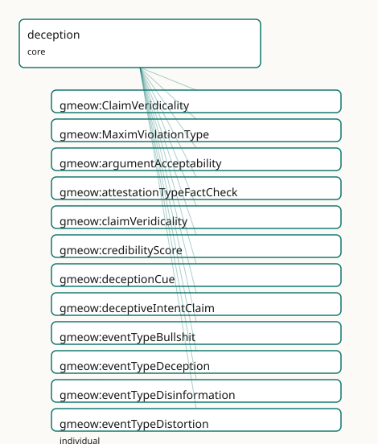

<!-- GENERATED by gmeow ontology-docs. DO NOT EDIT. -->

# GMEOW Deception Module

- **IRI:** <https://blackcatinformatics.ca/gmeow/slices/deception>
- **Tier:** core
- **[`Group`](../reference/classes/gmeow-Group.md):** core

## What This Slice Covers

This slice owns 35 terms and contributes 17 mapping or projection rows. Use it when its terms match the native fact you want to preserve; use the linkage tables to see how those facts leave GMEOW for consumer vocabularies.

## Dependencies

- [`gmeow:slices/attestation`](attestation.md)
- [`gmeow:slices/epistemics`](epistemics.md)
- [`gmeow:slices/events`](events.md)
- [`gmeow:slices/kernel`](kernel.md)
- [`gmeow:slices/observations`](observations.md)

## Consumers

- Graph-native epistemics of the lie (P16: core by commitment); the claim layer's refutations.

## Local Map



## Examples

### Blame Deflection

- **Source:** [`slices/core/deception/examples/blame-deflection.ttl`](https://github.com/Blackcat-Informatics/gmeow-ontology/blob/main/slices/core/deception/examples/blame-deflection.ttl)
- **GMEOW terms:** [`gmeow:DoxasticStandpointClaim`](../reference/classes/gmeow-DoxasticStandpointClaim.md), [`gmeow:DoxasticState`](../reference/classes/gmeow-DoxasticState.md), [`gmeow:Event`](../reference/classes/gmeow-Event.md), [`gmeow:Organization`](../reference/classes/gmeow-Organization.md), [`gmeow:Participation`](../reference/classes/gmeow-Participation.md), [`gmeow:Person`](../reference/classes/gmeow-Person.md), [`gmeow:Proposition`](../reference/classes/gmeow-Proposition.md), [`gmeow:claimModality`](../reference/properties/gmeow-claimModality.md), [`gmeow:claimOfBelief`](../reference/properties/gmeow-claimOfBelief.md), [`gmeow:claimVeridicality`](../reference/properties/gmeow-claimVeridicality.md)
- **External prefixes:** `xsd`

```turtle
# SPDX-FileCopyrightText: 2026 Blackcat Informatics® Inc. <paudley@blackcatinformatics.ca>
# SPDX-License-Identifier: CC-BY-4.0
#
# Worked example: deception is held ≠ projected. A spokesperson
# privately BELIEVES an internal misconfiguration caused an outage, but publicly
# PROJECTS that a third-party vendor did. The lie is a gmeow:Event linking the
# two DoxasticStandpointClaims: gmeow:heldStandpoint (the believed claim) and
# gmeow:projectedStandpoint (the asserted-but-disbelieved one). Falsehood is not
# an isFalse boolean — it is the projected claim carrying gmeow:claimVeridicality
# gmeow:veridicalityUntrue. Nothing here needs a "deception class": ordinary
# claims, an event type, and the held/projected gap do all the work.
#
# Re-grounded for both standpoints are reified as gmeow:DoxasticState
# instances and reported by gmeow:DoxasticStandpointClaim instances via
# gmeow:claimOfBelief. The held belief has high credence; the projected belief has
# low credence — the spokesperson publicly avows the vendor-caused proposition
# while actually disbelieving it. The deception is the divergence between the
# high-credence held state and the low-credence projected state.
@prefix gmeow: <https://blackcatinformatics.ca/gmeow/> .
@prefix ex:    <https://blackcatinformatics.ca/gmeow/examples/deception/> .
@prefix rdfs:  <http://www.w3.org/2000/01/rdf-schema#> .
@prefix xsd:   <http://www.w3.org/2001/XMLSchema#> .

# --- The outage being explained, and the two candidate causes.
ex:outage a gmeow:Event ;
    rdfs:label "the March data outage"@en ;
    gmeow:eventType gmeow:eventTypeDestruction ;
    gmeow:eventTime "2026-03-04T02:00:00Z"^^xsd:dateTime ;
    gmeow:eventTemporalFrame gmeow:temporalFrameUTCGregorian .

ex:internalCause a gmeow:Person ; gmeow:name "the on-call engineer (internal)"@en .
ex:vendor a gmeow:Organization ; gmeow:name "Northwind CDN (third party)"@en .

ex:spokesperson a gmeow:Person ; gmeow:name "Comms lead"@en .

# --- Propositions that are the truth-apt contents of the two standpoints.
ex:internalCauseProposition a gmeow:Proposition ;
    rdfs:label "the internal engineer caused the outage"@en .

ex:vendorCauseProposition a gmeow:Proposition ;
    rdfs:label "the third-party vendor caused the outage"@en .

# --- The spokesperson's privately HELD belief state.
ex:spokespersonHeldBelief a gmeow:DoxasticState ;
    rdfs:label "spokesperson's held belief: internal engineer caused the outage"@en ;
    gmeow:epistemicAgent ex:spokesperson ;
    gmeow:doxasticContent ex:internalCauseProposition ;
    gmeow:doxasticClaim ex:heldClaim ;
    gmeow:credence "0.95"^^xsd:decimal .

# --- What the spokesperson privately HOLDS: the internal engineer caused it.
ex:heldClaim a gmeow:DoxasticStandpointClaim ;
    gmeow:vantage ex:spokesperson ;
    gmeow:observedFeature ex:internalCauseProposition ;
    gmeow:claimOfBelief ex:spokespersonHeldBelief ;
    gmeow:claimModality gmeow:unequivocal ;
    gmeow:observationMethod gmeow:methodExpertJudgement .

# --- The spokesperson's publicly PROJECTED belief state: the vendor caused it,
#     but held with very low credence — the spokesperson disbelieves what they
#     avow. The low credence is the structural signature of the lie.
ex:spokespersonProjectedBelief a gmeow:DoxasticState ;
    rdfs:label "spokesperson's projected belief: vendor caused the outage (avowed, low credence)"@en ;
    gmeow:epistemicAgent ex:spokesperson ;
    gmeow:doxasticContent ex:vendorCauseProposition ;
    gmeow:doxasticClaim ex:projectedClaim ;
    gmeow:credence "0.05"^^xsd:decimal .

# --- What the spokesperson publicly PROJECTS: the vendor caused it. Asserted
#     unequivocally, but UNTRUE — the falsehood is a veridicality value on the
#     claim, never an isFalse flag. The claim is backed by the low-credence
#     projected DoxasticState; the gap between the avowed unequivocal claim and
#     the 0.05 credence is the deception.
ex:projectedClaim a gmeow:DoxasticStandpointClaim ;
    gmeow:vantage ex:spokesperson ;
    gmeow:observedFeature ex:vendorCauseProposition ;
    gmeow:claimOfBelief ex:spokespersonProjectedBelief ;
    gmeow:claimModality gmeow:unequivocal ;
    gmeow:claimVeridicality gmeow:veridicalityUntrue ;
    gmeow:observationMethod gmeow:methodExpertJudgement .

# --- The lie: an Event whose held and projected standpoints diverge. That gap
#     IS the deception; the spokesperson is its participant in the deceiver role.
ex:coverStory a gmeow:Event ;
    rdfs:label "the public attribution to the vendor"@en ;
    gmeow:eventType gmeow:eventTypeLie ;
    gmeow:eventTime "2026-03-05T09:00:00Z"^^xsd:dateTime ;
    gmeow:eventTemporalFrame gmeow:temporalFrameUTCGregorian ;
    gmeow:heldStandpoint ex:heldClaim ;
    gmeow:projectedStandpoint ex:projectedClaim ;
    gmeow:hasParticipant ex:spokesperson .

ex:deceiverRole a gmeow:Participation ;
    gmeow:participationEvent ex:coverStory ;
    gmeow:participationParticipant ex:spokesperson ;
    gmeow:participationRole gmeow:roleDeceiver .
```

## Terms

### Classes

| Term | Label | Definition |
|---|---|---|
| [`gmeow:ClaimVeridicality`](../reference/classes/gmeow-ClaimVeridicality.md) | Claim Veridicality | The veridicality status of a claim — whether it is untrue, licensed-false (fiction, satire, sarcasm), or true. A closed value vocabulary (individuals, never su... |
| [`gmeow:MaximViolationType`](../reference/classes/gmeow-MaximViolationType.md) | Maxim Violation Type | A value vocabulary for conversational maxim violations (Gricean maxims: quality, quantity, relation, manner). |

### Properties

| Term | Label | Definition |
|---|---|---|
| [`gmeow:argumentAcceptability`](../reference/properties/gmeow-argumentAcceptability.md) | argument acceptability | A numerical acceptability score for an argument or standpoint claim. Solver-layer computation ([Principle 12](https://github.com/Blackcat-Informatics/gmeow-ontology/blob/main/CONSTITUTION.md#principle-12)), referencing AIF (Argument Interchange Format). |
| [`gmeow:claimVeridicality`](../reference/properties/gmeow-claimVeridicality.md) | claim veridicality | The veridicality status of a claim — whether it is untrue, licensed-false (fiction, satire, sarcasm), or true. Non-functional: a claim may carry multiple verid... |
| [`gmeow:credibilityScore`](../reference/properties/gmeow-credibilityScore.md) | credibility score | A numerical credibility score assigned to an observation or claim. Solver-layer computation ([Principle 12](https://github.com/Blackcat-Informatics/gmeow-ontology/blob/main/CONSTITUTION.md#principle-12)). |
| [`gmeow:deceptionCue`](../reference/properties/gmeow-deceptionCue.md) | deception cue | An observation that serves as a cue or indicator of deception in the event — a behavioural, linguistic, or evidential signal. Non-functional: a deception event... |
| [`gmeow:deceptiveIntentClaim`](../reference/properties/gmeow-deceptiveIntentClaim.md) | deceptive intent claim | An attributed, defeasible standpoint claim that the event was carried out with deceptive intent. The vantage is the assessor (who attributes the intent), not t... |
| [`gmeow:heldStandpoint`](../reference/properties/gmeow-heldStandpoint.md) | held standpoint | The doxastic standpoint claim that the deceiver actually holds to be true — a [`gmeow:DoxasticStandpointClaim`](../reference/classes/gmeow-DoxasticStandpointClaim.md) whose [`gmeow:claimOfBelief`](../reference/properties/gmeow-claimOfBelief.md) observes the held gmeow:D... |
| [`gmeow:implicates`](../reference/properties/gmeow-implicates.md) | implicates | Relates a deceptive event to a proposition or entity that it conversationally or contextually implicates — the paltering mechanism, where a literally true stat... |
| [`gmeow:maximViolationType`](../reference/properties/gmeow-maximViolationType.md) | maxim violation type | The type of conversational maxim violated in a deceptive event (quality, quantity, relation, manner). Solver-layer classification ([Principle 12](https://github.com/Blackcat-Informatics/gmeow-ontology/blob/main/CONSTITUTION.md#principle-12)). |
| [`gmeow:projectedStandpoint`](../reference/properties/gmeow-projectedStandpoint.md) | projected standpoint | The doxastic standpoint claim that the deceiver projects to the deceived party — a [`gmeow:DoxasticStandpointClaim`](../reference/classes/gmeow-DoxasticStandpointClaim.md) whose optional [`gmeow:claimOfBelief`](../reference/properties/gmeow-claimOfBelief.md), when prese... |
| [`gmeow:propagationMutationDistance`](../reference/properties/gmeow-propagationMutationDistance.md) | propagation mutation distance | The number of transmission hops before a propagated deceptive claim mutates. Solver-layer computation ([Principle 12](https://github.com/Blackcat-Informatics/gmeow-ontology/blob/main/CONSTITUTION.md#principle-12)). |

### Individuals

| Term | Label | Definition |
|---|---|---|
| [`gmeow:attestationTypeFactCheck`](../reference/individuals/gmeow-attestationTypeFactCheck.md) | fact check | An attestation whose purpose is to verify or refute a claim — the schema.org ClaimReview act, modelled as an attestation with type fact-check. The result is a... |
| [`gmeow:eventTypeBullshit`](../reference/individuals/gmeow-eventTypeBullshit.md) | bullshit | A deception event in which the deceiver projects an unequivocal standpoint while holding the bullshit modality — indifference to the truth-value of the proposi... |
| [`gmeow:eventTypeDeception`](../reference/individuals/gmeow-eventTypeDeception.md) | deception | An event in which one or more participants intentionally or knowingly project a standpoint that diverges from the standpoint they actually hold, causing anothe... |
| [`gmeow:eventTypeDisinformation`](../reference/individuals/gmeow-eventTypeDisinformation.md) | disinformation campaign | A coordinated, propagated deception that aggregates many constituent deception events along a [prov:wasDerivedFrom](http://www.w3.org/ns/prov#wasDerivedFrom) / [`gmeow:propagatesFrom`](../reference/properties/gmeow-propagatesFrom.md) propagation chain. At... |
| [`gmeow:eventTypeDistortion`](../reference/individuals/gmeow-eventTypeDistortion.md) | distortion / spin | A deception event in which the projected standpoint sharpens, re-frames, or selectively emphasises the held standpoint — a modality shift (e.g. probable→unequi... |
| [`gmeow:eventTypeFabrication`](../reference/individuals/gmeow-eventTypeFabrication.md) | fabrication | A deception event in which a false artifact (a [`gmeow:CreativeWork`](../reference/classes/gmeow-CreativeWork.md)) is produced and its attested provenance is projected as genuine while the deceiver's held st... |
| [`gmeow:eventTypeForgery`](../reference/individuals/gmeow-eventTypeForgery.md) | forgery | A fabrication that mimics a specific genuine artifact — the forged work bears a [`gmeow:counterpartOf`](../reference/properties/gmeow-counterpartOf.md) link to the genuine work it imitates, and when a cryptograp... |
| [`gmeow:eventTypeImpersonation`](../reference/individuals/gmeow-eventTypeImpersonation.md) | impersonation | A deception event in which a projected identity claim is presented as belonging to a subject other than the deceiver. Reuses [`gmeow:IdentityFacet`](../reference/classes/gmeow-IdentityFacet.md) machinery: the... |
| [`gmeow:eventTypeLie`](../reference/individuals/gmeow-eventTypeLie.md) | lie / falsification | A deception event in which the projected standpoint negates the held standpoint — the deceiver communicates a proposition they believe to be false. The project... |
| [`gmeow:eventTypeOmission`](../reference/individuals/gmeow-eventTypeOmission.md) | omission / concealment | A deception event in which the held standpoint is present but no projected standpoint is offered — the deceiver suppresses a truth they hold rather than assert... |
| [`gmeow:eventTypePaltering`](../reference/individuals/gmeow-eventTypePaltering.md) | paltering | A deception event in which the projected literal claim is technically true but conversationally implicates a false conclusion P′ that the held standpoint refut... |
| [`gmeow:eventTypeSelfDeception`](../reference/individuals/gmeow-eventTypeSelfDeception.md) | self-deception | A deception event in which the same agent fills both the deceiver and deceived roles — an avowed (conscious, articulated) standpoint diverges from a tacit (imp... |
| [`gmeow:maximViolationManner`](../reference/individuals/gmeow-maximViolationManner.md) | maxim violation — manner | Violation of the Gricean maxim of Manner: avoid obscurity, ambiguity, prolixity, and disorder. Distortion, spin, and deliberate obfuscation violate this maxim. |
| [`gmeow:maximViolationQuality`](../reference/individuals/gmeow-maximViolationQuality.md) | maxim violation — quality | Violation of the Gricean maxim of Quality: do not say what you believe to be false or for which you lack adequate evidence. Lies, falsifications, and bullshit... |
| [`gmeow:maximViolationQuantity`](../reference/individuals/gmeow-maximViolationQuantity.md) | maxim violation — quantity | Violation of the Gricean maxim of Quantity: make your contribution as informative as required, but not more so. Omissions, concealment, and paltering violate t... |
| [`gmeow:maximViolationRelation`](../reference/individuals/gmeow-maximViolationRelation.md) | maxim violation — relation | Violation of the Gricean maxim of Relation (Relevance): be relevant. Paltering and certain forms of distraction or red-herring deception violate this maxim. |
| [`gmeow:roleBeneficiaryOfDeception`](../reference/individuals/gmeow-roleBeneficiaryOfDeception.md) | beneficiary of deception | An entity that benefits from a deception event, whether or not they are the deceiver — the third-party beneficiary who gains from the false belief induced in t... |
| [`gmeow:roleDeceived`](../reference/individuals/gmeow-roleDeceived.md) | deceived | The participant in a deception event who is induced to hold a false belief by the divergence between the projected and held standpoints. In self-deception, thi... |
| [`gmeow:roleDeceiver`](../reference/individuals/gmeow-roleDeceiver.md) | deceiver | The participant in a deception event who projects a standpoint that diverges from what they hold true. In self-deception, this role is borne by the same entity... |
| [`gmeow:roleDupe`](../reference/individuals/gmeow-roleDupe.md) | dupe | An unwitting intermediary in a deception — a participant who forwards the projected standpoint without knowing it is deceptive, acting as a conduit rather than... |
| [`gmeow:roleSpinDoctor`](../reference/individuals/gmeow-roleSpinDoctor.md) | spin doctor | The participant in a distortion or spin event who reframes, sharpens, or selectively presents information to alter the inferential landscape without literally... |
| [`gmeow:veridicalityLicensedFalsehood`](../reference/individuals/gmeow-veridicalityLicensedFalsehood.md) | licensed falsehood | The claim is fiction, satire, sarcasm, or another form of falsehood that is socially licensed and not deceptive — the audience understands the non-truth-assert... |
| [`gmeow:veridicalityUntrue`](../reference/individuals/gmeow-veridicalityUntrue.md) | untrue | The claim is not true — a statement that fails to correspond to fact. This is a frame-relative assessment (a claim may be refuted in one standpoint and unequiv... |

## Linkages

- **Rows:** 17
- **Projection profiles:** -
- **External vocabularies:** `crminf`, `wd`

| Source | Kind | Profile | Predicate/Relation | Target | Evidence |
|---|---|---|---|---|---|
| [`gmeow:deceptiveIntentClaim`](../reference/properties/gmeow-deceptiveIntentClaim.md) | equivalence | `-` | [skos:relatedMatch](http://www.w3.org/2004/02/skos/core#relatedMatch) | [crminf:I1_Argumentation](http://www.ics.forth.gr/isl/CRMinf/I1_Argumentation) | `gmeow-deception.sssom.tsv`; `gmeow:eqDeception006`; confidence 0.4 |
| [`gmeow:eventTypeBullshit`](../reference/individuals/gmeow-eventTypeBullshit.md) | equivalence | `-` | [skos:relatedMatch](http://www.w3.org/2004/02/skos/core#relatedMatch) | [wd:Q1760159](https://www.wikidata.org/wiki/Q1760159) | `gmeow-deception.sssom.tsv`; `gmeow:eqDeception012`; confidence 0.9 |
| [`gmeow:eventTypeBullshit`](../reference/individuals/gmeow-eventTypeBullshit.md) | equivalence | `-` | [skos:relatedMatch](http://www.w3.org/2004/02/skos/core#relatedMatch) | [wd:Q2063516](https://www.wikidata.org/wiki/Q2063516) | `gmeow-deception.sssom.tsv`; `gmeow:eqDeception011`; confidence 0.5 |
| [`gmeow:eventTypeDeception`](../reference/individuals/gmeow-eventTypeDeception.md) | equivalence | `-` | [skos:closeMatch](http://www.w3.org/2004/02/skos/core#closeMatch) | [wd:Q170028](https://www.wikidata.org/wiki/Q170028) | `gmeow-deception.sssom.tsv`; `gmeow:eqDeception007`; confidence 0.7 |
| [`gmeow:eventTypeDisinformation`](../reference/individuals/gmeow-eventTypeDisinformation.md) | equivalence | `-` | [skos:closeMatch](http://www.w3.org/2004/02/skos/core#closeMatch) | [wd:Q189656](https://www.wikidata.org/wiki/Q189656) | `gmeow-deception.sssom.tsv`; `gmeow:eqDeception019`; confidence 0.7 |
| [`gmeow:eventTypeDisinformation`](../reference/individuals/gmeow-eventTypeDisinformation.md) | equivalence | `-` | [skos:relatedMatch](http://www.w3.org/2004/02/skos/core#relatedMatch) | [wd:Q28549308](https://www.wikidata.org/wiki/Q28549308) | `gmeow-deception.sssom.tsv`; `gmeow:eqDeception023`; confidence 0.6 |
| [`gmeow:eventTypeDisinformation`](../reference/individuals/gmeow-eventTypeDisinformation.md) | equivalence | `-` | [skos:relatedMatch](http://www.w3.org/2004/02/skos/core#relatedMatch) | [wd:Q7281](https://www.wikidata.org/wiki/Q7281) | `gmeow-deception.sssom.tsv`; `gmeow:eqDeception021`; confidence 0.5 |
| [`gmeow:eventTypeDisinformation`](../reference/individuals/gmeow-eventTypeDisinformation.md) | equivalence | `-` | [skos:relatedMatch](http://www.w3.org/2004/02/skos/core#relatedMatch) | [wd:Q878352](https://www.wikidata.org/wiki/Q878352) | `gmeow-deception.sssom.tsv`; `gmeow:eqDeception022`; confidence 0.5 |
| [`gmeow:eventTypeDistortion`](../reference/individuals/gmeow-eventTypeDistortion.md) | equivalence | `-` | [skos:closeMatch](http://www.w3.org/2004/02/skos/core#closeMatch) | [wd:Q12776523](https://www.wikidata.org/wiki/Q12776523) | `gmeow-deception.sssom.tsv`; `gmeow:eqDeception010`; confidence 0.6 |
| [`gmeow:eventTypeFabrication`](../reference/individuals/gmeow-eventTypeFabrication.md) | equivalence | `-` | [skos:closeMatch](http://www.w3.org/2004/02/skos/core#closeMatch) | [wd:Q1332286](https://www.wikidata.org/wiki/Q1332286) | `gmeow-deception.sssom.tsv`; `gmeow:eqDeception015`; confidence 0.5 |
| [`gmeow:eventTypeFabrication`](../reference/individuals/gmeow-eventTypeFabrication.md) | equivalence | `-` | [skos:closeMatch](http://www.w3.org/2004/02/skos/core#closeMatch) | [wd:Q18387855](https://www.wikidata.org/wiki/Q18387855) | `gmeow-deception.sssom.tsv`; `gmeow:eqDeception014`; confidence 0.6 |
| [`gmeow:eventTypeForgery`](../reference/individuals/gmeow-eventTypeForgery.md) | equivalence | `-` | [skos:closeMatch](http://www.w3.org/2004/02/skos/core#closeMatch) | [wd:Q1332286](https://www.wikidata.org/wiki/Q1332286) | `gmeow-deception.sssom.tsv`; `gmeow:eqDeception016`; confidence 0.7 |
| [`gmeow:eventTypeForgery`](../reference/individuals/gmeow-eventTypeForgery.md) | equivalence | `-` | [skos:closeMatch](http://www.w3.org/2004/02/skos/core#closeMatch) | [wd:Q693988](https://www.wikidata.org/wiki/Q693988) | `gmeow-deception.sssom.tsv`; `gmeow:eqDeception017`; confidence 0.7 |
| [`gmeow:eventTypeImpersonation`](../reference/individuals/gmeow-eventTypeImpersonation.md) | equivalence | `-` | [skos:closeMatch](http://www.w3.org/2004/02/skos/core#closeMatch) | [wd:Q2146099](https://www.wikidata.org/wiki/Q2146099) | `gmeow-deception.sssom.tsv`; `gmeow:eqDeception018`; confidence 0.7 |
| [`gmeow:eventTypeLie`](../reference/individuals/gmeow-eventTypeLie.md) | equivalence | `-` | [skos:closeMatch](http://www.w3.org/2004/02/skos/core#closeMatch) | [wd:Q4925193](https://www.wikidata.org/wiki/Q4925193) | `gmeow-deception.sssom.tsv`; `gmeow:eqDeception008`; confidence 0.7 |
| [`gmeow:eventTypeSelfDeception`](../reference/individuals/gmeow-eventTypeSelfDeception.md) | equivalence | `-` | [skos:closeMatch](http://www.w3.org/2004/02/skos/core#closeMatch) | [wd:Q1602343](https://www.wikidata.org/wiki/Q1602343) | `gmeow-deception.sssom.tsv`; `gmeow:eqDeception013`; confidence 0.7 |
| [`gmeow:veridicalityUntrue`](../reference/individuals/gmeow-veridicalityUntrue.md) | equivalence | `-` | [skos:closeMatch](http://www.w3.org/2004/02/skos/core#closeMatch) | [wd:Q13579947](https://www.wikidata.org/wiki/Q13579947) | `gmeow-deception.sssom.tsv`; `gmeow:eqDeception020`; confidence 0.6 |

## Guide

<!-- SPDX-FileCopyrightText: 2026 Blackcat Informatics® Inc. <paudley@blackcatinformatics.ca> -->
<!-- SPDX-License-Identifier: CC-BY-4.0 -->

# Deception — the lie as a structural gap, never a truth bit

> **Slice:** `https://blackcatinformatics.ca/gmeow/slices/deception` · **tier: core**
> Graph-native epistemics of the lie: held ≠ projected, standpoint-indexed, with intent kept out of the logic.

Most vocabularies flag falsehood with a boolean. GMEOW refuses (Principles 1 and 12): there
is **no `isFalse`, no `isDeceptive`, and no truth datatype property** anywhere in the graph.
A falsehood is a frame-relative [`gmeow:StandpointClaim`](../reference/classes/gmeow-StandpointClaim.md) whose [`claimModality`](../reference/properties/gmeow-claimModality.md) is
[`gmeow:refuted`](../reference/individuals/gmeow-refuted.md) — settled-false *per a designated reference frame* — and a deception is not
a verdict at all but a **structural divergence**: an event in which the standpoint a party
*holds* differs from the standpoint they *project*. The gap is the act.

Three corollaries shape everything below. **Intent stays out of the logic** — deceptive
intent is an attributed, defeasible claim by an assessor, never entailed by the reasoner,
coexisting with its denial ([Principle 9](https://github.com/Blackcat-Informatics/gmeow-ontology/blob/main/CONSTITUTION.md#principle-9)). **Deception kinds are values, never subclasses** —
each mechanism is one open [`gmeow:eventType`](../reference/properties/gmeow-eventType.md) individual (events doctrine), and the
deception-specific constraints are SHACL scoped to [`gmeow:eventTypeDeception`](../reference/individuals/gmeow-eventTypeDeception.md)
(DeceptionEventShape), never global OWL restrictions on [`gmeow:Event`](../reference/classes/gmeow-Event.md) ([Principle 3](https://github.com/Blackcat-Informatics/gmeow-ontology/blob/main/CONSTITUTION.md#principle-3)).
**Licensed falsehood is a safety property** — fiction, satire, and sarcasm are structurally
distinct from deception, so no pipeline ever "debunks" a novel.

## The divergence core

### [`gmeow:eventTypeDeception`](../reference/individuals/gmeow-eventTypeDeception.md)

The umbrella event kind: a participant projects a standpoint diverging from the one they
hold, inducing a false belief. A value individual on an ordinary [`gmeow:Event`](../reference/classes/gmeow-Event.md) — birth,
marriage, and lie share one [`Event`](../reference/classes/gmeow-Event.md) class, distinguished by [`gmeow:eventType`](../reference/properties/gmeow-eventType.md) alone.

### [`gmeow:heldStandpoint`](../reference/properties/gmeow-heldStandpoint.md) · [`gmeow:projectedStandpoint`](../reference/properties/gmeow-projectedStandpoint.md)

The two sides of the gap, both ordinary [`gmeow:StandpointClaim`](../reference/classes/gmeow-StandpointClaim.md)s attached to the deception
event. Non-functional by design: a complex deception may hold several private positions and
project different stories to different audiences. The *relationship* between the pair —
negation (lie), implicature (paltering), absence (omission), sharpening (spin) — is what the
mechanism inventory below names.

### [`gmeow:deceptiveIntentClaim`](../reference/properties/gmeow-deceptiveIntentClaim.md)

Intent as a contestable attribution: a [`StandpointClaim`](../reference/classes/gmeow-StandpointClaim.md) whose vantage is the *assessor* (not
the deceiver), carrying [`gmeow:confidence`](../reference/properties/gmeow-confidence.md) and [`gmeow:wasAttributedTo`](../reference/properties/gmeow-wasAttributedTo.md). The reasoner never
entails intent; an accusation and its denial coexist ([Principle 9](https://github.com/Blackcat-Informatics/gmeow-ontology/blob/main/CONSTITUTION.md#principle-9)).

## Veridicality

### [`gmeow:ClaimVeridicality`](../reference/classes/gmeow-ClaimVeridicality.md) · [`gmeow:claimVeridicality`](../reference/properties/gmeow-claimVeridicality.md)

The veridicality status of a claim, as a value vocabulary linked by the non-functional
[`gmeow:claimVeridicality`](../reference/properties/gmeow-claimVeridicality.md) — multiple assessments from different standpoints coexist. This is
an assessment axis, never a global verdict ([Principle 11](https://github.com/Blackcat-Informatics/gmeow-ontology/blob/main/CONSTITUTION.md#principle-11)).

### [`gmeow:veridicalityUntrue`](../reference/individuals/gmeow-veridicalityUntrue.md) · [`gmeow:veridicalityLicensedFalsehood`](../reference/individuals/gmeow-veridicalityLicensedFalsehood.md)

[`veridicalityUntrue`](../reference/individuals/gmeow-veridicalityUntrue.md) is frame-relative non-truth — refuted in one standpoint, possibly
unequivocal in another. [`veridicalityLicensedFalsehood`](../reference/individuals/gmeow-veridicalityLicensedFalsehood.md) is the safety property: fiction,
satire, and sarcasm assert nothing because the audience understands the non-truth-asserting
frame — licensed, not deceptive ([Principle 1](https://github.com/Blackcat-Informatics/gmeow-ontology/blob/main/CONSTITUTION.md#principle-1)).

## The mechanism inventory

### [`gmeow:eventTypeLie`](../reference/individuals/gmeow-eventTypeLie.md) · [`gmeow:eventTypePaltering`](../reference/individuals/gmeow-eventTypePaltering.md) · [`gmeow:eventTypeOmission`](../reference/individuals/gmeow-eventTypeOmission.md) · [`gmeow:eventTypeDistortion`](../reference/individuals/gmeow-eventTypeDistortion.md) · [`gmeow:eventTypeBullshit`](../reference/individuals/gmeow-eventTypeBullshit.md) · [`gmeow:eventTypeSelfDeception`](../reference/individuals/gmeow-eventTypeSelfDeception.md)

Six speech-act mechanisms, each one open [`gmeow:eventType`](../reference/properties/gmeow-eventType.md) value distinguished by *where the
gap lives*: projection negates the held claim (lie); a literally true projection implicates
a false conclusion (paltering); a held truth is never projected (omission); the projection
sharpens or re-frames — a modality shift, probable→unequivocal (distortion); the deceiver
projects certainty while holding the bullshit modality, Frankfurt's indifference to truth
(bullshit); one agent fills both roles, avowed vs tacit sub-vantage (self-deception). Each
maps to the Gricean maxim it violates.

### [`gmeow:MaximViolationType`](../reference/classes/gmeow-MaximViolationType.md) · [`gmeow:maximViolationType`](../reference/properties/gmeow-maximViolationType.md)

The Gricean classification axis — Quality (lie, bullshit), [`Quantity`](../reference/classes/gmeow-Quantity.md) (omission, paltering),
Relation (paltering, red herrings), Manner (distortion, obfuscation) — as a closed value
vocabulary. Assigning a violation is solver-layer classification ([Principle 12](https://github.com/Blackcat-Informatics/gmeow-ontology/blob/main/CONSTITUTION.md#principle-12)).

### [`gmeow:implicates`](../reference/properties/gmeow-implicates.md)

The paltering hook: relates a deceptive event to the proposition its literally-true
statement misleadingly implies. Deliberately without reasoner semantics — implicature is a
pragmatics computation, not an OWL entailment ([Principle 12](https://github.com/Blackcat-Informatics/gmeow-ontology/blob/main/CONSTITUTION.md#principle-12)).

## Carrier deception

### [`gmeow:eventTypeFabrication`](../reference/individuals/gmeow-eventTypeFabrication.md) · [`gmeow:eventTypeForgery`](../reference/individuals/gmeow-eventTypeForgery.md) · [`gmeow:eventTypeImpersonation`](../reference/individuals/gmeow-eventTypeImpersonation.md)

Divergence borne by an artifact or identity binding rather than a bare utterance. A
fabrication invents a false [`gmeow:CreativeWork`](../reference/classes/gmeow-CreativeWork.md) whose projected provenance the deceiver's
held standpoint refutes — evidenced by a failed [`gmeow:VerificationResult`](../reference/classes/gmeow-VerificationResult.md), never a truth
axiom. A forgery is a fabrication that mimics a *specific* genuine work
([`gmeow:counterpartOf`](../reference/properties/gmeow-counterpartOf.md) the original). An impersonation projects an [`gmeow:IdentityFacet`](../reference/classes/gmeow-IdentityFacet.md)
whose subject differs from the deceiver — email spoofing is impersonation with a failed
[`AuthenticationResult`](../reference/classes/gmeow-AuthenticationResult.md); phishing is an instance, never a taxonomy primitive.

## Participant roles

### [`gmeow:roleDeceiver`](../reference/individuals/gmeow-roleDeceiver.md) · [`gmeow:roleDeceived`](../reference/individuals/gmeow-roleDeceived.md) · [`gmeow:roleBeneficiaryOfDeception`](../reference/individuals/gmeow-roleBeneficiaryOfDeception.md) · [`gmeow:roleDupe`](../reference/individuals/gmeow-roleDupe.md) · [`gmeow:roleSpinDoctor`](../reference/individuals/gmeow-roleSpinDoctor.md)

Open [`gmeow:ParticipantRole`](../reference/classes/gmeow-ParticipantRole.md) values on ordinary Participations. Self-deception is the
configuration where deceiver = deceived; the dupe is the unwitting conduit; the spin doctor
is specific to distortion events. No role implies guilt — roles are structure, intent is an
attribution.

## Propagation and the per-node boundary

### [`gmeow:eventTypeDisinformation`](../reference/individuals/gmeow-eventTypeDisinformation.md)

A coordinated campaign aggregating constituent deception events along the
[`prov:wasDerivedFrom`](http://www.w3.org/ns/prov#wasDerivedFrom) / [`gmeow:propagatesFrom`](../reference/properties/gmeow-propagatesFrom.md) lineage spine. The
misinformation↔disinformation boundary is **per-node, never a global label**: at the origin
held ≠ projected (deception, [`roleDeceiver`](../reference/individuals/gmeow-roleDeceiver.md)); at sincere intermediary nodes held ≈ projected
and the claim is merely untrue ([`roleDupe`](../reference/individuals/gmeow-roleDupe.md)).

### [`gmeow:deceptionCue`](../reference/properties/gmeow-deceptionCue.md) · [`gmeow:attestationTypeFactCheck`](../reference/individuals/gmeow-attestationTypeFactCheck.md)

Evidence enters as observations: a cue is a behavioural, linguistic, or evidential signal
attached non-functionally to the event — competing standpoint-indexed cue claims coexist. A
fact-check is an attestation kind (the schema.org ClaimReview act) whose result is a
[`VerificationResult`](../reference/classes/gmeow-VerificationResult.md), not a truth assertion.

## Solver layer & deferred alignment

Everything that *scores* lives below the ontology ([Principle 12](https://github.com/Blackcat-Informatics/gmeow-ontology/blob/main/CONSTITUTION.md#principle-12)): cue weighting
([`gmeow:credibilityScore`](../reference/properties/gmeow-credibilityScore.md)), propagation-chain analysis
([`gmeow:propagationMutationDistance`](../reference/properties/gmeow-propagationMutationDistance.md)), argument evaluation ([`gmeow:argumentAcceptability`](../reference/properties/gmeow-argumentAcceptability.md),
referencing AIF), implicature derivation, and maxim classification. The slice carries the
structure those solvers read; it asserts no verdicts. Alignment is by reference — schema.org
ClaimReview via the fact-check attestation kind, AIF for argument scores — with SSSOM rows
deferred to the alignment window. DL-cleanliness is by construction: simple object
properties only, no transitivity, chains, or inverses ([Principle 3](https://github.com/Blackcat-Informatics/gmeow-ontology/blob/main/CONSTITUTION.md#principle-3)).

## Bridge: aboutness (kernel)

[`gmeow:veridicalityLicensedFalsehood`](../reference/individuals/gmeow-veridicalityLicensedFalsehood.md) (fiction, satire, sarcasm) is the
special case where the kernel's aboutness axis meets veridicality: a fictional
carrier *enacts* its content ([`gmeow:hasAboutness`](../reference/properties/gmeow-hasAboutness.md) [`gmeow:aboutnessEnacts`](../reference/individuals/gmeow-aboutnessEnacts.md))
while asserting nothing — enactment without assertion is licensed, not
deceptive. The bridge is documentation only, deliberately: no axiom couples
[`hasAboutness`](../reference/properties/gmeow-hasAboutness.md) to veridicality or standpoint modality, so enactment never
entails assertion (and text *about* deception is never inferred to deceive).

## Dependencies

Depends on `kernel`, `events` (the [`Event`](../reference/classes/gmeow-Event.md)/eventType machinery), `observations` (cues), and
`attestation` (fact-checks, verification results). Consumed by the claim layer's refutation
modality and by the narrative extension's unreliable-narration and myth boundaries — both
documented bridges, neither an axiom coupling.
