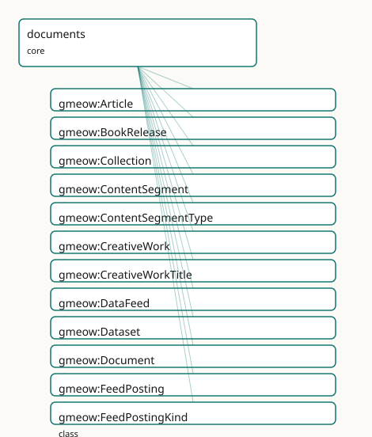

<!-- GENERATED by gmeow ontology-docs. DO NOT EDIT. -->

# GMEOW Documents Module

- **IRI:** <https://blackcatinformatics.ca/gmeow/slices/documents>
- **Tier:** core
- **[`Group`](../reference/classes/gmeow-Group.md):** core

## What This Slice Covers

This slice owns 66 terms and contributes 186 mapping or projection rows. Use it when its terms match the native fact you want to preserve; use the linkage tables to see how those facts leave GMEOW for consumer vocabularies.

## Dependencies

- [`gmeow:slices/creative-works`](creative-works.md)
- [`gmeow:slices/kernel`](kernel.md)
- [`gmeow:slices/names`](names.md)
- [`gmeow:slices/observations`](observations.md)
- [`gmeow:slices/places`](places.md)
- [`gmeow:slices/standpoint`](standpoint.md)
- [`gmeow:slices/tags`](tags.md)

## Consumers

- Creative-works manifestations, the mail corpus attachments, depictions of any entity.

## Local Map



## Examples

### Web Presence

- **Source:** [`slices/core/documents/examples/web-presence.ttl`](https://github.com/Blackcat-Informatics/gmeow-ontology/blob/main/slices/core/documents/examples/web-presence.ttl)
- **GMEOW terms:** [`gmeow:Expression`](../reference/classes/gmeow-Expression.md), [`gmeow:Person`](../reference/classes/gmeow-Person.md), [`gmeow:ProfilePage`](../reference/classes/gmeow-ProfilePage.md), [`gmeow:WebPage`](../reference/classes/gmeow-WebPage.md), [`gmeow:WebSite`](../reference/classes/gmeow-WebSite.md), [`gmeow:Work`](../reference/classes/gmeow-Work.md), [`gmeow:embodies`](../reference/properties/gmeow-embodies.md), [`gmeow:name`](../reference/properties/gmeow-name.md), [`gmeow:pageOfSite`](../reference/properties/gmeow-pageOfSite.md), [`gmeow:pagePrincipalSubject`](../reference/properties/gmeow-pagePrincipalSubject.md)

```turtle
# SPDX-FileCopyrightText: 2026 Blackcat Informatics® Inc. <paudley@blackcatinformatics.ca>
# SPDX-License-Identifier: CC-BY-4.0
#
# Worked example: a web presence on the WEMI spine. A WebSite and
# its WebPages are concrete gmeow:Manifestations — so each embodies an Expression
# that realizes a Work, the same four-tier backing every published artifact
# carries. Pages belong to the site via gmeow:pageOfSite (⊑ partOf). The about
# page names a person as its gmeow:pagePrincipalSubject (⊑ isAbout), which makes
# it a gmeow:ProfilePage by INFERENCE — ProfilePage is a defined class (any
# WebPage whose principal subject is an Agent), so no manual typing is needed.
@prefix gmeow: <https://blackcatinformatics.ca/gmeow/> .
@prefix ex:    <https://blackcatinformatics.ca/gmeow/examples/documents/> .

# --- The WEMI backing the whole site shares: one Work, one Expression.
ex:siteWork a gmeow:Work ;
    gmeow:title "Blackcat Informatics® website"@en .

ex:siteContent a gmeow:Expression ;
    gmeow:realizes ex:siteWork .

# --- The site (a Manifestation) and its pages (also Manifestations), each
#     embodying the shared Expression.
ex:site a gmeow:WebSite ;
    gmeow:embodies ex:siteContent .

ex:homepage a gmeow:WebPage ;
    gmeow:pageOfSite ex:site ;
    gmeow:embodies ex:siteContent .

# --- The about page: its principal subject is a person, so it IS a ProfilePage
#     (≡ WebPage ⊓ ∃pagePrincipalSubject.Agent) without being typed as one.
ex:aboutMara a gmeow:WebPage ;
    gmeow:pageOfSite ex:site ;
    gmeow:pagePrincipalSubject ex:mara ;
    gmeow:embodies ex:siteContent .

ex:mara a gmeow:Person ;
    gmeow:name "Mara Okafor"@en .
```

## Terms

### Classes

| Term | Label | Definition |
|---|---|---|
| [`gmeow:Article`](../reference/classes/gmeow-Article.md) | Article | A written work published in a periodical, blog, or scholarly venue. A specialization of [`gmeow:Work`](../reference/classes/gmeow-Work.md). |
| [`gmeow:BookRelease`](../reference/classes/gmeow-BookRelease.md) | Book Release | A concrete published edition or release of a book — an out-of-universe information object and rights-bearing publication artifact. A specialization of gmeow:Ma... |
| [`gmeow:Collection`](../reference/classes/gmeow-Collection.md) | Collection | An aggregation of resources published or curated as a unit — an anthology, album, gallery, or series bundle. A specialization of [`gmeow:Work`](../reference/classes/gmeow-Work.md) whose members ride... |
| [`gmeow:ContentSegment`](../reference/classes/gmeow-ContentSegment.md) | Content Segment | A structural part of a creative work, release, or installment — a chapter, section, scene, or episode. A [gufo:Kind](../external/terms.md#gufo-kind) with distinct identity criteria (position an... |
| [`gmeow:ContentSegmentType`](../reference/classes/gmeow-ContentSegmentType.md) | Content Segment Type | The structural type of a content segment — a VALUE vocabulary (individuals, never subclasses). Chapter, section, scene, and paragraph are examples; the set is... |
| [`gmeow:CreativeWork`](../reference/classes/gmeow-CreativeWork.md) | Creative Work | The abstract umbrella category for intellectual and artistic creations in the WEMI spine — a Work, Expression, Manifestation, or Item. Formerly a flat [gufo:Kin...](http://purl.org/nemo/gufo#Kin...) |
| [`gmeow:CreativeWorkTitle`](../reference/classes/gmeow-CreativeWorkTitle.md) | Creative Work Title | An appellation borne by a creative work — a document title, article headline, dataset name, or media title. Carries its own [`gmeow:nameLanguage`](../reference/properties/gmeow-nameLanguage.md) and gmeow:nameSc... |
| [`gmeow:DataFeed`](../reference/classes/gmeow-DataFeed.md) | Data Feed | A published, ordered stream of items — a syndication feed (RSS/Atom/JSON Feed), a timeline, an activity feed. A specialisation of [`gmeow:Collection`](../reference/classes/gmeow-Collection.md); its items r... |
| [`gmeow:Dataset`](../reference/classes/gmeow-Dataset.md) | Dataset | A collection of data published as a unit. A specialization of [`gmeow:Work`](../reference/classes/gmeow-Work.md). |
| [`gmeow:Document`](../reference/classes/gmeow-Document.md) | Document | An abstract intellectual work of bounded textual or digital content — the conceptual document, independent of any particular file, record, or report. A special... |
| [`gmeow:FeedPosting`](../reference/classes/gmeow-FeedPosting.md) | Feed Posting | A short-form work published to a feed, timeline, or platform — a social-media post, a blog entry, a microblog note. A specialisation of [`gmeow:Work`](../reference/classes/gmeow-Work.md); its kind (s... |
| [`gmeow:FeedPostingKind`](../reference/classes/gmeow-FeedPostingKind.md) | Feed Posting Kind | The kind of a syndicated posting — a VALUE vocabulary (individuals, never subclasses). Social, blog, microblog, forum, and status are examples; the set is open. |
| [`gmeow:LiteraryWork`](../reference/classes/gmeow-LiteraryWork.md) | Literary Work | An abstract long-form story or textual work — fiction, poetry, drama, or literary non-fiction. A specialization of [`gmeow:Work`](../reference/classes/gmeow-Work.md). |
| [`gmeow:MediaObject`](../reference/classes/gmeow-MediaObject.md) | Media Object | An image, audio, or video media file — a concrete published artifact. A specialization of [`gmeow:Manifestation`](../reference/classes/gmeow-Manifestation.md). |
| [`gmeow:Patent`](../reference/classes/gmeow-Patent.md) | Patent | An abstract intellectual work describing an invention — the inventive concept as claimed, independent of any granted or filed document. A specialization of gme... |
| [`gmeow:ProfilePage`](../reference/classes/gmeow-ProfilePage.md) | Profile Page | A web page whose principal subject is an agent — a person's or organization's profile/about page. A DEFINED class: any [`gmeow:WebPage`](../reference/classes/gmeow-WebPage.md) whose gmeow:pagePrincipalS... |
| [`gmeow:ReadingOrder`](../reference/classes/gmeow-ReadingOrder.md) | Reading Order | A standpoint that supplies a subjective ordering for consuming segments of a work — publication order, internal chronology, author-recommended order, or fandom... |
| [`gmeow:SerialInstallment`](../reference/classes/gmeow-SerialInstallment.md) | Serial Installment | A single issue, episode, or chapter of a serial creative work — a comic issue, TV episode, magazine issue, or serial chapter. An out-of-universe publication ar... |
| [`gmeow:SerialWork`](../reference/classes/gmeow-SerialWork.md) | Serial Work | An ongoing authored work released over installments — a web serial, comic series, or magazine. A specialization of [`gmeow:Work`](../reference/classes/gmeow-Work.md). |
| [`gmeow:Service`](../reference/classes/gmeow-Service.md) | Service | A system that provides one or more functions — a web API, hosted application, or online service. A specialization of [`gmeow:Work`](../reference/classes/gmeow-Work.md) in the schema.org / creative-wo... |
| [`gmeow:WebPage`](../reference/classes/gmeow-WebPage.md) | Web Page | A page on the web identified by a URL — a concrete published artifact. A specialization of [`gmeow:Manifestation`](../reference/classes/gmeow-Manifestation.md). |
| [`gmeow:WebSite`](../reference/classes/gmeow-WebSite.md) | Web Site | A web site — the published collection of web pages served under one identity (a domain, a project site, a personal homepage). A specialization of gmeow:Manifes... |

### Properties

| Term | Label | Definition |
|---|---|---|
| [`gmeow:abstract`](../reference/properties/gmeow-abstract.md) | abstract | A summary of the content of a creative work. |
| [`gmeow:bibliographicCitation`](../reference/properties/gmeow-bibliographicCitation.md) | bibliographic citation | A bibliographic reference for a creative work. |
| [`gmeow:caption`](../reference/properties/gmeow-caption.md) | caption | A caption for a media object — the short text shown with an image, audio, or video ([schema:caption](https://schema.org/caption)). Non-functional. |
| [`gmeow:captureDevice`](../reference/properties/gmeow-captureDevice.md) | capture device | The physical device (camera, scanner, screen-capture hardware) that captured the media. Non-functional: multiple devices may be asserted (e.g. a composite imag... |
| [`gmeow:captureTime`](../reference/properties/gmeow-captureTime.md) | capture time | The date and time when the image or media was captured. Non-functional: competing capture-time claims from different sources or EXIF vs. metadata may coexist w... |
| [`gmeow:colourspace`](../reference/properties/gmeow-colourspace.md) | colourspace | The colourspace reference frame in which this media object's pixel values are expressed — sRGB, Adobe RGB, CMYK, CIE XYZ, etc. A subproperty of gmeow:hasRefere... |
| [`gmeow:contentLanguage`](../reference/properties/gmeow-contentLanguage.md) | content language | The natural language of a work's content — the language a document, article, or page is written in. Distinct from the names slice's per-appellation language ta... |
| [`gmeow:dateAccepted`](../reference/properties/gmeow-dateAccepted.md) | date accepted | The date a creative work was accepted (e.g. by a journal, conference, or repository). |
| [`gmeow:dateAvailable`](../reference/properties/gmeow-dateAvailable.md) | date available | The date a creative work became or will become available. |
| [`gmeow:dateCreated`](../reference/properties/gmeow-dateCreated.md) | date created | The date a creative work was created. Distinct from datePublished (the issue/release date) and from the creation event's full temporal extent. |
| [`gmeow:dateModified`](../reference/properties/gmeow-dateModified.md) | date modified | The date a creative work was last modified. |
| [`gmeow:datePublished`](../reference/properties/gmeow-datePublished.md) | date published | The date a creative work was published or issued. |
| [`gmeow:dateSubmitted`](../reference/properties/gmeow-dateSubmitted.md) | date submitted | The date a creative work was submitted for review or publication. |
| [`gmeow:depictedIn`](../reference/properties/gmeow-depictedIn.md) | depicted in | Relates an entity to an image that depicts it. Inverse of [`gmeow:depicts`](../reference/properties/gmeow-depicts.md). Non-functional: an entity may be depicted in many images. |
| [`gmeow:depicts`](../reference/properties/gmeow-depicts.md) | depicts | Relates an image (MediaObject) to an entity it depicts — the flat 80%-case shortcut, subproperty of [`gmeow:isAbout`](../reference/properties/gmeow-isAbout.md). Non-functional: an image may depict many ent... |
| [`gmeow:extent`](../reference/properties/gmeow-extent.md) | extent | The size or duration of a creative work. |
| [`gmeow:feedPostingKind`](../reference/properties/gmeow-feedPostingKind.md) | posting kind | The kind of a posting — a value from the open [`gmeow:FeedPostingKind`](../reference/classes/gmeow-FeedPostingKind.md) vocabulary (social, blog, microblog, …). Drives the schema projection (a social posting → s... |
| [`gmeow:hasSegment`](../reference/properties/gmeow-hasSegment.md) | has segment | Relates a whole (work, release, installment, or another segment) to a structural part. Non-functional: a work may have many segments. Inverse of gmeow:segmentO... |
| [`gmeow:hasTitle`](../reference/properties/gmeow-hasTitle.md) | has title | Relates a creative work to a structured [`gmeow:CreativeWorkTitle`](../reference/classes/gmeow-CreativeWorkTitle.md) it bears; the creative-work-scoped specialization of [`gmeow:hasAppellation`](../reference/properties/gmeow-hasAppellation.md). Non-functional — a w... |
| [`gmeow:identifier`](../reference/properties/gmeow-identifier.md) | identifier | A formal identifier of a creative work, such as a DOI or patent number. |
| [`gmeow:imageOrientation`](../reference/properties/gmeow-imageOrientation.md) | image orientation | The clockwise rotation of an image from its normal orientation, in degrees (EXIF convention: 0, 90, 180, 270). Functional: one orientation per manifestation. T... |
| [`gmeow:mediaType`](../reference/properties/gmeow-mediaType.md) | media type | The IANA media (MIME) type of an artifact — 'text/plain', 'application/pdf', 'image/avif'. Universal: an email body part, a Manifestation, a Distribution all c... |
| [`gmeow:pageOfSite`](../reference/properties/gmeow-pageOfSite.md) | page of site | Relates a web page to the web site it belongs to — a specialisation of [`gmeow:partOf`](../reference/properties/gmeow-partOf.md), so site membership rides the universal mereology spine. The discrete page→... |
| [`gmeow:pagePrincipalSubject`](../reference/properties/gmeow-pagePrincipalSubject.md) | page main entity | The principal subject a web page is primarily about — the one entity it represents (a person's profile page, an organization's about page). A functional specia... |
| [`gmeow:pixelHeight`](../reference/properties/gmeow-pixelHeight.md) | pixel height | The height of a media object in pixels. Functional: one height per manifestation. |
| [`gmeow:pixelWidth`](../reference/properties/gmeow-pixelWidth.md) | pixel width | The width of a media object in pixels. Functional: one width per manifestation. |
| [`gmeow:quotedText`](../reference/properties/gmeow-quotedText.md) | quoted text | The inline text a work quotes when the quoted content is a passage rather than a linkable resource. Non-functional: several quoted passages may appear. |
| [`gmeow:quotesContent`](../reference/properties/gmeow-quotesContent.md) | quotes content | Relates a work (a posting, an article) to content it quotes — another posting, a passage, an external resource. Non-functional: a work may quote several source... |
| [`gmeow:segmentIndex`](../reference/properties/gmeow-segmentIndex.md) | segment index | The position of this segment within its containing whole — 1-based by convention, but not enforced. |
| [`gmeow:segmentOf`](../reference/properties/gmeow-segmentOf.md) | segment of | A structural segment is part of a larger whole — a work, release, installment, or another segment. Transitive; inverse of [`gmeow:hasSegment`](../reference/properties/gmeow-hasSegment.md). |
| [`gmeow:segmentType`](../reference/properties/gmeow-segmentType.md) | segment type | The structural type of this segment — chapter, section, scene, etc. A value from the open [`gmeow:ContentSegmentType`](../reference/classes/gmeow-ContentSegmentType.md) vocabulary. |
| [`gmeow:sharesContent`](../reference/properties/gmeow-sharesContent.md) | shares content | Relates a posting to content it shares or reposts — another posting, an article, a media object. The repost/share/boost edge. Non-functional. Projects to schem... |
| [`gmeow:tableOfContents`](../reference/properties/gmeow-tableOfContents.md) | table of contents | A list of subunits of a creative work. |
| [`gmeow:title`](../reference/properties/gmeow-title.md) | title | The flat title literal of a creative work — the 80%-case shortcut for a single plain title. Promote to a structured [`gmeow:CreativeWorkTitle`](../reference/classes/gmeow-CreativeWorkTitle.md) via [`gmeow:hasTitle`](../reference/properties/gmeow-hasTitle.md)... |
| [`gmeow:transcript`](../reference/properties/gmeow-transcript.md) | transcript | A text transcript of the spoken/audio content of a media object ([schema:transcript](https://schema.org/transcript)). Distinct from [`gmeow:transcriptionOf`](../reference/properties/gmeow-transcriptionOf.md), which is phonetic/script transcriptio... |

### Individuals

| Term | Label | Definition |
|---|---|---|
| [`gmeow:feedPostingKindBlog`](../reference/individuals/gmeow-feedPostingKindBlog.md) | blog | A blog entry or article post. |
| [`gmeow:feedPostingKindMicroblog`](../reference/individuals/gmeow-feedPostingKindMicroblog.md) | microblog | A short microblog note (a tweet-like status). |
| [`gmeow:feedPostingKindSocial`](../reference/individuals/gmeow-feedPostingKindSocial.md) | social | A social-media post (a timeline/feed status). |
| [`gmeow:segmentTypeBackMatter`](../reference/individuals/gmeow-segmentTypeBackMatter.md) | back matter | Supplementary material at the end of a book — appendix, bibliography, index. |
| [`gmeow:segmentTypeChapter`](../reference/individuals/gmeow-segmentTypeChapter.md) | chapter | A major division of a written work. |
| [`gmeow:segmentTypeFrontMatter`](../reference/individuals/gmeow-segmentTypeFrontMatter.md) | front matter | Preliminary material at the beginning of a book — title page, preface, table of contents. |
| [`gmeow:segmentTypeParagraph`](../reference/individuals/gmeow-segmentTypeParagraph.md) | paragraph | A distinct section of writing covering a single theme. |
| [`gmeow:segmentTypeScene`](../reference/individuals/gmeow-segmentTypeScene.md) | scene | A continuous sequence of action in a dramatic or narrative work. |
| [`gmeow:segmentTypeSection`](../reference/individuals/gmeow-segmentTypeSection.md) | section | A distinct part or subdivision of a work. |

## Linkages

- **Rows:** 186
- **Projection profiles:** `bibframe`, `bibo`, `dcat`, `dcterms`, `doap`, `exif`, `foaf`, `iiif`, `oai_dc`, `schema-org`, `sioc`, `vcard`
- **External vocabularies:** `bibframe`, `bibo`, `cc`, `dc`, `dcat`, `dcmitype`, `dcterms`, `doap`, `exif`, `foaf`, `gxv`, `iiif`, `pav`, `prov`, `qb`, `rdf`, `schema`, `sioc`, `vcard`, `wd`

| Source | Kind | Profile | Predicate/Relation | Target | Evidence |
|---|---|---|---|---|---|
| [`gmeow:Article`](../reference/classes/gmeow-Article.md) | equivalence | `-` | [rdfs:subClassOf](http://www.w3.org/2000/01/rdf-schema#subClassOf) | [bibo:AcademicArticle](http://purl.org/ontology/bibo/AcademicArticle) | `gmeow-classes.sssom.tsv`; `gmeow:eqClasses019`; confidence 1 |
| [`gmeow:Article`](../reference/classes/gmeow-Article.md) | equivalence | `-` | [owl:equivalentClass](http://www.w3.org/2002/07/owl#equivalentClass) | [schema:Article](https://schema.org/Article) | `gmeow-classes.sssom.tsv`; `gmeow:eqClasses017`; confidence 1 |
| [`gmeow:Article`](../reference/classes/gmeow-Article.md) | equivalence | `-` | [rdfs:subClassOf](http://www.w3.org/2000/01/rdf-schema#subClassOf) | [schema:BlogPosting](https://schema.org/BlogPosting) | `gmeow-classes.sssom.tsv`; `gmeow:eqClasses021`; confidence 0.9 |
| [`gmeow:Article`](../reference/classes/gmeow-Article.md) | equivalence | `-` | [rdfs:subClassOf](http://www.w3.org/2000/01/rdf-schema#subClassOf) | [schema:NewsArticle](https://schema.org/NewsArticle) | `gmeow-classes.sssom.tsv`; `gmeow:eqClasses020`; confidence 1 |
| [`gmeow:Article`](../reference/classes/gmeow-Article.md) | equivalence | `-` | [rdfs:subClassOf](http://www.w3.org/2000/01/rdf-schema#subClassOf) | [schema:ScholarlyArticle](https://schema.org/ScholarlyArticle) | `gmeow-classes.sssom.tsv`; `gmeow:eqClasses018`; confidence 1 |
| [`gmeow:Article`](../reference/classes/gmeow-Article.md) | equivalence | `-` | [skos:closeMatch](http://www.w3.org/2004/02/skos/core#closeMatch) | [wd:Q191067](https://www.wikidata.org/wiki/Q191067) | `gmeow-wikidata.sssom.tsv`; `gmeow:eqWikidata032`; confidence 0.85 |
| [`gmeow:BookRelease`](../reference/classes/gmeow-BookRelease.md) | equivalence | `-` | [skos:broadMatch](http://www.w3.org/2004/02/skos/core#broadMatch) | [schema:Book](https://schema.org/Book) | `gmeow-creative-works.sssom.tsv`; `gmeow:eqCw024`; confidence 0.85 |
| [`gmeow:BookRelease`](../reference/classes/gmeow-BookRelease.md) | equivalence | `-` | [skos:closeMatch](http://www.w3.org/2004/02/skos/core#closeMatch) | [schema:Book](https://schema.org/Book) | `gmeow-narrative.sssom.tsv`; `gmeow:eqNarrative001`; confidence 0.8 |
| [`gmeow:Collection`](../reference/classes/gmeow-Collection.md) | equivalence | `-` | [skos:closeMatch](http://www.w3.org/2004/02/skos/core#closeMatch) | [dcmitype:Collection](http://purl.org/dc/dcmitype/Collection) | `gmeow-dublin-core.sssom.tsv`; `gmeow:eqDcType010`; confidence 0.85 |
| [`gmeow:ContentSegment`](../reference/classes/gmeow-ContentSegment.md) | equivalence | `-` | [skos:narrowMatch](http://www.w3.org/2004/02/skos/core#narrowMatch) | [schema:Chapter](https://schema.org/Chapter) | `gmeow-narrative.sssom.tsv`; `gmeow:eqNarrative009`; confidence 0.7 |
| [`gmeow:CreativeWork`](../reference/classes/gmeow-CreativeWork.md) | equivalence | `-` | [skos:closeMatch](http://www.w3.org/2004/02/skos/core#closeMatch) | [bibframe:Work](http://id.loc.gov/ontologies/bibframe/Work) | `gmeow-classes.sssom.tsv`; `gmeow:eqClasses028`; confidence 0.8 |
| [`gmeow:CreativeWork`](../reference/classes/gmeow-CreativeWork.md) | equivalence | `-` | [skos:relatedMatch](http://www.w3.org/2004/02/skos/core#relatedMatch) | [cc:Work](http://creativecommons.org/ns#Work) | `gmeow-rights.sssom.tsv`; `gmeow:eqRights183`; confidence 0.6 |
| [`gmeow:CreativeWork`](../reference/classes/gmeow-CreativeWork.md) | equivalence | `-` | [skos:closeMatch](http://www.w3.org/2004/02/skos/core#closeMatch) | [gxv:SourceDescription](http://gedcomx.org/v1/SourceDescription) | `gmeow-genealogy.sssom.tsv`; `gmeow:eqGenealogy051`; confidence 0.85 |
| [`gmeow:CreativeWork`](../reference/classes/gmeow-CreativeWork.md) | equivalence | `-` | [skos:closeMatch](http://www.w3.org/2004/02/skos/core#closeMatch) | [prov:Entity](http://www.w3.org/ns/prov#Entity) | `gmeow-provenance.sssom.tsv`; `gmeow:eqProvenance006`; confidence 0.6 |
| [`gmeow:CreativeWork`](../reference/classes/gmeow-CreativeWork.md) | equivalence | `-` | [owl:equivalentClass](http://www.w3.org/2002/07/owl#equivalentClass) | [schema:CreativeWork](https://schema.org/CreativeWork) | `gmeow-classes.sssom.tsv`; `gmeow:eqClasses015`; confidence 1 |
| [`gmeow:CreativeWork`](../reference/classes/gmeow-CreativeWork.md) | equivalence | `-` | [skos:closeMatch](http://www.w3.org/2004/02/skos/core#closeMatch) | [schema:CreativeWork](https://schema.org/CreativeWork) | `gmeow-creative-works.sssom.tsv`; `gmeow:eqCw022`; confidence 0.8 |
| [`gmeow:CreativeWork`](../reference/classes/gmeow-CreativeWork.md) | equivalence | `-` | [skos:closeMatch](http://www.w3.org/2004/02/skos/core#closeMatch) | [wd:Q17537576](https://www.wikidata.org/wiki/Q17537576) | `gmeow-wikidata.sssom.tsv`; `gmeow:eqWikidata031`; confidence 0.8 |
| [`gmeow:CreativeWorkTitle`](../reference/classes/gmeow-CreativeWorkTitle.md) | equivalence | `-` | [owl:equivalentClass](http://www.w3.org/2002/07/owl#equivalentClass) | [bibframe:Title](http://id.loc.gov/ontologies/bibframe/Title) | `gmeow-properties.sssom.tsv`; `gmeow:eqProperties077`; confidence 0.9 |
| [`gmeow:CreativeWorkTitle`](../reference/classes/gmeow-CreativeWorkTitle.md) | equivalence | `-` | [skos:broadMatch](http://www.w3.org/2004/02/skos/core#broadMatch) | [schema:name](https://schema.org/name) | `gmeow-names.sssom.tsv`; `gmeow:eqNames051`; confidence 0.6 |
| [`gmeow:DataFeed`](../reference/classes/gmeow-DataFeed.md) | equivalence | `-` | [skos:closeMatch](http://www.w3.org/2004/02/skos/core#closeMatch) | [schema:DataFeed](https://schema.org/DataFeed) | `gmeow-classes.sssom.tsv`; `gmeow:eqClasses056`; confidence 0.85 |
| [`gmeow:Dataset`](../reference/classes/gmeow-Dataset.md) | equivalence | `-` | [skos:closeMatch](http://www.w3.org/2004/02/skos/core#closeMatch) | [dcmitype:Dataset](http://purl.org/dc/dcmitype/Dataset) | `gmeow-dublin-core.sssom.tsv`; `gmeow:eqDcType002`; confidence 0.9 |
| [`gmeow:Dataset`](../reference/classes/gmeow-Dataset.md) | equivalence | `-` | [skos:closeMatch](http://www.w3.org/2004/02/skos/core#closeMatch) | [qb:DataSet](http://purl.org/linked-data/cube#DataSet) | `gmeow-aggregation.sssom.tsv`; `gmeow:eqAgg002`; confidence 0.9 |
| [`gmeow:Dataset`](../reference/classes/gmeow-Dataset.md) | equivalence | `-` | [owl:equivalentClass](http://www.w3.org/2002/07/owl#equivalentClass) | [schema:Dataset](https://schema.org/Dataset) | `gmeow-classes.sssom.tsv`; `gmeow:eqClasses023`; confidence 1 |
| [`gmeow:Dataset`](../reference/classes/gmeow-Dataset.md) | equivalence | `-` | [skos:closeMatch](http://www.w3.org/2004/02/skos/core#closeMatch) | [wd:Q1172284](https://www.wikidata.org/wiki/Q1172284) | `gmeow-wikidata.sssom.tsv`; `gmeow:eqWikidata034`; confidence 0.85 |
|... |... |... |... |... | 162 more rows |

## Guide

<!-- SPDX-FileCopyrightText: 2026 Blackcat Informatics® Inc. <paudley@blackcatinformatics.ca> -->
<!-- SPDX-License-Identifier: CC-BY-4.0 -->

# Documents — works, releases, segments, and the depiction spine

> **Slice:** `https://blackcatinformatics.ca/gmeow/slices/documents` · **tier: core**
> The everyday creative-work vocabulary: what got written, released, segmented, titled, and pictured.

Creative works and document metadata — articles, patents, datasets, media, web pages (the schema.org / BIBO / BIBFRAME superset layer).

This slice furnishes the working subkinds of the four-tier WEMI spine:
[`gmeow:Document`](../reference/classes/gmeow-Document.md), [`gmeow:Article`](../reference/classes/gmeow-Article.md), [`gmeow:Patent`](../reference/classes/gmeow-Patent.md), [`gmeow:Dataset`](../reference/classes/gmeow-Dataset.md),
[`gmeow:LiteraryWork`](../reference/classes/gmeow-LiteraryWork.md), [`gmeow:SerialWork`](../reference/classes/gmeow-SerialWork.md), [`gmeow:Collection`](../reference/classes/gmeow-Collection.md), and [`gmeow:Service`](../reference/classes/gmeow-Service.md)
specialize [`gmeow:Work`](../reference/classes/gmeow-Work.md) (the abstract creation); [`gmeow:MediaObject`](../reference/classes/gmeow-MediaObject.md), [`gmeow:WebPage`](../reference/classes/gmeow-WebPage.md),
[`gmeow:BookRelease`](../reference/classes/gmeow-BookRelease.md), and [`gmeow:SerialInstallment`](../reference/classes/gmeow-SerialInstallment.md) specialize [`gmeow:Manifestation`](../reference/classes/gmeow-Manifestation.md)
(the concrete artifact). The umbrella [`gmeow:CreativeWork`](../reference/classes/gmeow-CreativeWork.md) is a Category, not a Kind —
identity criteria live on the tiers, never on the umbrella.

Aboutness is kept honest by the tags-slice trichotomy ([Principle 9](https://github.com/Blackcat-Informatics/gmeow-ontology/blob/main/CONSTITUTION.md#principle-9)): [`rdf:type`](http://www.w3.org/1999/02/22-rdf-syntax-ns#type) says
what a thing *is*, [`gmeow:hasTag`](../reference/properties/gmeow-hasTag.md) says what someone *labelled* it, and [`gmeow:isAbout`](../reference/properties/gmeow-isAbout.md)
says what it *concerns* — three axes, property-disjoint, never collapsed.
[`gmeow:depicts`](../reference/properties/gmeow-depicts.md) is the image-shaped arm of [`isAbout`](../reference/properties/gmeow-isAbout.md), and [`gmeow:ContentSegment`](../reference/classes/gmeow-ContentSegment.md) gives
every work structural decomposition without inventing per-genre part classes. Reading
order, finally, is a *standpoint* ([`gmeow:ReadingOrder`](../reference/classes/gmeow-ReadingOrder.md)) — publication order and
internal chronology coexist as subjective orderings, never canonical truth.

## Works and their structure

### [`gmeow:CreativeWork`](../reference/classes/gmeow-CreativeWork.md)

The abstract umbrella Category for intellectual and artistic creations across the WEMI
spine. Formerly a flat Kind (pre WEMI spine); now a Category so each of the four tiers
beneath it can be a [gufo:Kind](../external/terms.md#gufo-kind) with its own identity criteria. Carries the flat
metadata properties ([`gmeow:title`](../reference/properties/gmeow-title.md), [`gmeow:identifier`](../reference/properties/gmeow-identifier.md), [`gmeow:datePublished`](../reference/properties/gmeow-datePublished.md), the DC
date and description refinements).

### [`gmeow:ContentSegment`](../reference/classes/gmeow-ContentSegment.md)

A structural part of a work, release, or installment — chapter, section, scene,
episode — a genuine Kind whose identity is position-and-type within a containing
whole. One class for all segments: the *kind* of segment is a value, never a subclass.

### [`gmeow:hasSegment`](../reference/properties/gmeow-hasSegment.md) · [`gmeow:segmentOf`](../reference/properties/gmeow-segmentOf.md)

The segment mereology, specializing the universal [`gmeow:hasPart`](../reference/properties/gmeow-hasPart.md)/[`gmeow:partOf`](../reference/properties/gmeow-partOf.md)
spine. [`segmentOf`](../reference/properties/gmeow-segmentOf.md) is transitive — a scene of a chapter of a book is a segment of the
book; [`hasSegment`](../reference/properties/gmeow-hasSegment.md) is its non-functional inverse.

### [`gmeow:segmentType`](../reference/properties/gmeow-segmentType.md) · [`gmeow:segmentIndex`](../reference/properties/gmeow-segmentIndex.md)

Per-segment classification and position: [`segmentType`](../reference/properties/gmeow-segmentType.md) points (functionally) into the
open [`gmeow:ContentSegmentType`](../reference/classes/gmeow-ContentSegmentType.md) value vocabulary (chapter, section, scene, paragraph,
front matter, back matter — seeds, not a closed enum, [Principle 9](https://github.com/Blackcat-Informatics/gmeow-ontology/blob/main/CONSTITUTION.md#principle-9)); [`segmentIndex`](../reference/properties/gmeow-segmentIndex.md) is a
1-based-by-convention integer.

### [`gmeow:CreativeWorkTitle`](../reference/classes/gmeow-CreativeWorkTitle.md) · [`gmeow:hasTitle`](../reference/properties/gmeow-hasTitle.md)

The structured title: an [`Appellation`](../reference/classes/gmeow-Appellation.md) subkind carrying its own [`gmeow:nameLanguage`](../reference/properties/gmeow-nameLanguage.md) and
[`gmeow:nameScript`](../reference/properties/gmeow-nameScript.md), so co-equal multilingual titles ("The Matrix" / "黑客帝国") are
separate first-class objects — never alternateName subordinates, none primary
([Principle 9](https://github.com/Blackcat-Informatics/gmeow-ontology/blob/main/CONSTITUTION.md#principle-9)). Superseded titles set [`gmeow:displayable`](../reference/properties/gmeow-displayable.md) false instead of being deleted
([Principle 10](https://github.com/Blackcat-Informatics/gmeow-ontology/blob/main/CONSTITUTION.md#principle-10)). The flat [`gmeow:title`](../reference/properties/gmeow-title.md) literal remains the 80 %-case shortcut.

### [`gmeow:ReadingOrder`](../reference/classes/gmeow-ReadingOrder.md)

A [`gmeow:Standpoint`](../reference/classes/gmeow-Standpoint.md) subkind that supplies a subjective consumption ordering for the
segments of a work — publication order, internal chronology, author-recommended,
fandom. Claims are annotated [`gmeow:accordingTo`](../reference/properties/gmeow-accordingTo.md) a [`ReadingOrder`](../reference/classes/gmeow-ReadingOrder.md); no order is ever
ontology truth.

## Syndicated content

### [`gmeow:FeedPosting`](../reference/classes/gmeow-FeedPosting.md) · [`gmeow:feedPostingKind`](../reference/properties/gmeow-feedPostingKind.md) · [`gmeow:quotesContent`](../reference/properties/gmeow-quotesContent.md) · [`gmeow:sharesContent`](../reference/properties/gmeow-sharesContent.md) · [`gmeow:DataFeed`](../reference/classes/gmeow-DataFeed.md)

The syndication surface (MoveAction projection). A [`gmeow:FeedPosting`](../reference/classes/gmeow-FeedPosting.md) is a short-form work published
to a feed or platform — its kind ([`gmeow:feedPostingKind`](../reference/properties/gmeow-feedPostingKind.md): social / blog / microblog)
is an **open value**, never a subclass (P9), and drives the schema split
([`schema:SocialMediaPosting`](https://schema.org/SocialMediaPosting) vs [`schema:BlogPosting`](https://schema.org/BlogPosting)). [`gmeow:quotesContent`](../reference/properties/gmeow-quotesContent.md) (with the
inline [`gmeow:quotedText`](../reference/properties/gmeow-quotedText.md)) becomes [`schema:Quotation`](https://schema.org/Quotation) + [`schema:citation`](https://schema.org/citation);
[`gmeow:sharesContent`](../reference/properties/gmeow-sharesContent.md) is the repost/boost edge → [`schema:sharedContent`](https://schema.org/sharedContent) /
[`sioc:links_to`](http://rdfs.org/sioc/ns#links_to). A [`gmeow:DataFeed`](../reference/classes/gmeow-DataFeed.md) is a published ordered item stream (RSS/Atom/JSON
Feed, a timeline) whose members ride the [`hasPart`](../reference/properties/gmeow-hasPart.md) spine → [`schema:DataFeed`](https://schema.org/DataFeed) /
`dataFeedElement` / `DataFeedItem`. FeedPostings **resolve the email slice's declared
SIOC partiality**: a posting IS a [`sioc:Post`](http://rdfs.org/sioc/ns#Post), so email is no longer SIOC's only
consumer. ([`gmeow:Posting`](../reference/classes/gmeow-Posting.md) in the finance slice is an unrelated ledger term — the feed
posting is deliberately [`FeedPosting`](../reference/classes/gmeow-FeedPosting.md).)

## Web presence

### [`gmeow:WebSite`](../reference/classes/gmeow-WebSite.md) · [`gmeow:pageOfSite`](../reference/properties/gmeow-pageOfSite.md) · [`gmeow:pagePrincipalSubject`](../reference/properties/gmeow-pagePrincipalSubject.md) · [`gmeow:ProfilePage`](../reference/classes/gmeow-ProfilePage.md)

The web-presence model. A [`gmeow:WebSite`](../reference/classes/gmeow-WebSite.md) is the published collection; a
[`gmeow:WebPage`](../reference/classes/gmeow-WebPage.md) belongs to it via [`gmeow:pageOfSite`](../reference/properties/gmeow-pageOfSite.md) (a subproperty of [`partOf`](../reference/properties/gmeow-partOf.md), so
site membership rides the universal mereology — the discrete hierarchy a breadcrumb
trail walks). [`gmeow:pagePrincipalSubject`](../reference/properties/gmeow-pagePrincipalSubject.md) (functional, a subproperty of [`isAbout`](../reference/properties/gmeow-isAbout.md)) names
the one entity a page principally represents. [`gmeow:ProfilePage`](../reference/classes/gmeow-ProfilePage.md) is a **defined**
class — any [`WebPage`](../reference/classes/gmeow-WebPage.md) whose [`pagePrincipalSubject`](../reference/properties/gmeow-pagePrincipalSubject.md) is a [`gmeow:Agent`](../reference/classes/gmeow-Agent.md) — so
[`schema:ProfilePage`](https://schema.org/ProfilePage) / [`schema:WebSite`](https://schema.org/WebSite) / [`schema:mainEntityOfPage`](https://schema.org/mainEntityOfPage) and the
`BreadcrumbList`/`ListItem` walk all derive structurally, never from stored
navigation config.

### [`gmeow:contentLanguage`](../reference/properties/gmeow-contentLanguage.md)

The natural language of a **work's body** — distinct from the names slice's
per-appellation language tag, which is the language of a *name*. Non-functional (a
multilingual work has several); projects to [`schema:inLanguage`](https://schema.org/inLanguage) / [`schema:iso6391Code`](https://schema.org/iso6391Code)
by reconstructing the BCP-47 / ISO 639-1 code from the [`gmeow:Language`](../reference/classes/gmeow-Language.md).

## Manifestations and the image-depiction spine

### [`gmeow:MediaObject`](../reference/classes/gmeow-MediaObject.md)

An image, audio, or video file — a concrete [`Manifestation`](../reference/classes/gmeow-Manifestation.md) carrying the technical
metadata of the design: [`gmeow:pixelWidth`](../reference/properties/gmeow-pixelWidth.md)/[`gmeow:pixelHeight`](../reference/properties/gmeow-pixelHeight.md) (functional),
[`gmeow:imageOrientation`](../reference/properties/gmeow-imageOrientation.md) (EXIF degrees — the transform math is solver work,
[Principle 12](https://github.com/Blackcat-Informatics/gmeow-ontology/blob/main/CONSTITUTION.md#principle-12)), [`gmeow:captureTime`](../reference/properties/gmeow-captureTime.md) (non-functional: EXIF and catalogue claims coexist
with confidence), and [`gmeow:captureDevice`](../reference/properties/gmeow-captureDevice.md). Declares `[`gmeow:requiresFrame`](../reference/properties/gmeow-requiresFrame.md)
[`gmeow:colourspace`](../reference/properties/gmeow-colourspace.md)` at warning severity ([Principle 11](https://github.com/Blackcat-Informatics/gmeow-ontology/blob/main/CONSTITUTION.md#principle-11)).

### [`gmeow:depicts`](../reference/properties/gmeow-depicts.md) · [`gmeow:depictedIn`](../reference/properties/gmeow-depictedIn.md)

The flat depiction foundation (gathered here by the dependency refactor): any
[`MediaObject`](../reference/classes/gmeow-MediaObject.md) can depict any [`Entity`](../reference/classes/gmeow-Entity.md) with zero image machinery, as a subproperty of
[`gmeow:isAbout`](../reference/properties/gmeow-isAbout.md). The pair [`gmeow:pairsWith`](../reference/properties/gmeow-pairsWith.md) the [`gmeow:DepictionUsage`](../reference/classes/gmeow-DepictionUsage.md) relator in the
images extension — promote when context, audience, period, confidence, or evidence of
the depiction matters (regions and scene graphs live there too).

### [`gmeow:colourspace`](../reference/properties/gmeow-colourspace.md)

The colourspace *reference frame* of a media object's pixel values — sRGB, Adobe RGB,
CMYK — a subproperty of [`gmeow:hasReferenceFrame`](../reference/properties/gmeow-hasReferenceFrame.md) ([Principle 11](https://github.com/Blackcat-Informatics/gmeow-ontology/blob/main/CONSTITUTION.md#principle-11): a pixel value is
meaningless without its frame). Deliberately not OWL-functional so merged standpoints
never trigger [`owl:sameAs`](http://www.w3.org/2002/07/owl#sameAs) collapse; single-valuedness is SHACL's job.

### [`gmeow:BookRelease`](../reference/classes/gmeow-BookRelease.md) · [`gmeow:SerialInstallment`](../reference/classes/gmeow-SerialInstallment.md)

Concrete publication artifacts: an edition or release of a book, and a single issue,
episode, or chapter of a serial. Both are out-of-universe, rights-bearing
Manifestations, held strictly apart from any in-universe narrative frame they source
(linked via [`gmeow:sourceFor`](../reference/properties/gmeow-sourceFor.md)).

## Solver layer & alignment

Pixel-space computation — orientation transforms, colourspace conversion, derived
thumbnails — belongs to the solver layer ([Principle 12](https://github.com/Blackcat-Informatics/gmeow-ontology/blob/main/CONSTITUTION.md#principle-12)); the slice records the claims
and their frames. The slice supersets schema.org, BIBO, and BIBFRAME by reference
([Principle 5](https://github.com/Blackcat-Informatics/gmeow-ontology/blob/main/CONSTITUTION.md#principle-5)): aligned to, never imported.

## Dependencies

Depends on `kernel`, `creative-works` (the WEMI spine), `names` ([`Appellation`](../reference/classes/gmeow-Appellation.md)),
`observations`, `places`, `standpoint` ([`ReadingOrder`](../reference/classes/gmeow-ReadingOrder.md)), and `tags` (the [`isAbout`](../reference/properties/gmeow-isAbout.md)
trichotomy). Consumed by creative-works manifestations, the mail-corpus attachments,
and depictions of any entity.
