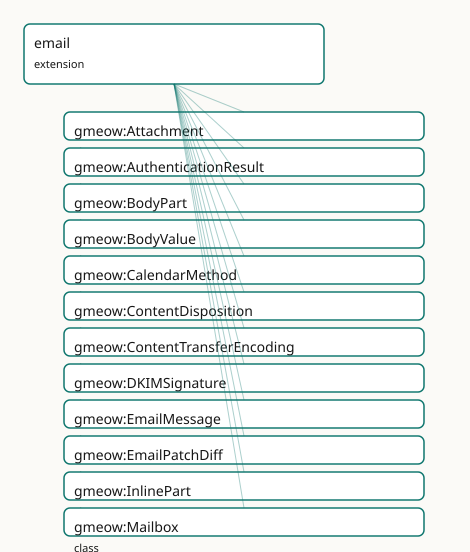

<!-- GENERATED by gmeow ontology-docs. DO NOT EDIT. -->

# GMEOW Email Module

- **IRI:** <https://blackcatinformatics.ca/gmeow/slices/email>
- **Tier:** extension
- **[`Group`](../reference/classes/gmeow-Group.md):** extensions

## What This Slice Covers

This slice owns 168 terms and contributes 41 mapping or projection rows. Use it when its terms match the native fact you want to preserve; use the linkage tables to see how those facts leave GMEOW for consumer vocabularies.

## Dependencies

- [`gmeow:slices/accounts`](accounts.md)
- [`gmeow:slices/contacts`](contacts.md)
- [`gmeow:slices/documents`](documents.md)
- [`gmeow:slices/entities`](entities.md)
- [`gmeow:slices/events`](events.md)
- [`gmeow:slices/kernel`](kernel.md)
- [`gmeow:slices/temporal`](temporal.md)
- [`gmeow:slices/trust`](trust.md)

## Consumers

- The mail corpus: the dogfooded message model over core contacts/accounts.

## Local Map



## Terms

### Classes

| Term | Label | Definition |
|---|---|---|
| [`gmeow:Attachment`](../reference/classes/gmeow-Attachment.md) | Attachment | A non-inline body part presented as an attached file. An attachment may also be a [`gmeow:Document`](../reference/classes/gmeow-Document.md) or [`gmeow:MediaObject`](../reference/classes/gmeow-MediaObject.md) (the two are not disjoint), and its text... |
| [`gmeow:AuthenticationResult`](../reference/classes/gmeow-AuthenticationResult.md) | Authentication Result | The outcome of an email authentication check (RFC 8601 Authentication-Results) — a method (DKIM, SPF, DMARC, ARC), a verdict, and the verifying server. |
| [`gmeow:BodyPart`](../reference/classes/gmeow-BodyPart.md) | Body Part | A MIME part of a message's body, with a media type and content. |
| [`gmeow:BodyValue`](../reference/classes/gmeow-BodyValue.md) | Body Value | A decoded body-content object stored as a separate information object, typically the result of extracting or decoding a MIME BodyPart. Linked to its source Bod... |
| [`gmeow:CalendarMethod`](../reference/classes/gmeow-CalendarMethod.md) | Calendar Method | The iCalendar METHOD of a calendar component carried by an email — a VALUE vocabulary (individuals, never subclasses). Aligned to RFC 5546/iTIP: REQUEST, REPLY... |
| [`gmeow:ContentDisposition`](../reference/classes/gmeow-ContentDisposition.md) | Content Disposition | The presentation disposition of a body part — inline (displayed as part of the message body) or attachment (presented as a separate file). An open value vocabu... |
| [`gmeow:ContentTransferEncoding`](../reference/classes/gmeow-ContentTransferEncoding.md) | Content Transfer Encoding | The MIME content-transfer-encoding of a body part — the mechanism by which the part's content is encoded for transport. An open value vocabulary (individuals,... |
| [`gmeow:DKIMSignature`](../reference/classes/gmeow-DKIMSignature.md) | DKIM Signature | A DomainKeys Identified Mail signature (RFC 6376) over selected headers and the body. |
| [`gmeow:EmailMessage`](../reference/classes/gmeow-EmailMessage.md) | Email Message | An RFC 5322 email message, with headers, participants, a thread, body parts and mailbox residence. |
| [`gmeow:EmailPatchDiff`](../reference/classes/gmeow-EmailPatchDiff.md) | Email Patch Diff | A patch or diff artifact between email body or header states, typically between a variant message and its canonical counterpart. Treated as a MIME-like BodyPar... |
| [`gmeow:InlinePart`](../reference/classes/gmeow-InlinePart.md) | Inline Part | A body part displayed inline within the message body, such as an embedded image or a text/html part rendered as part of the message content. Distinct from Atta... |
| [`gmeow:Mailbox`](../reference/classes/gmeow-Mailbox.md) | Mailbox | A named container of messages within an account — a folder, JMAP mailbox, or Gmail label. |
| [`gmeow:MailboxResidence`](../reference/classes/gmeow-MailboxResidence.md) | Mailbox Residence | The reified, time-scoped fact that a message resided in a mailbox/label over an interval (membership is time-varying — messages move between folders and labels... |
| [`gmeow:MailingList`](../reference/classes/gmeow-MailingList.md) | Mailing List | An email distribution list — an InformationObject identified by a List-Id and serving as the hub for list metadata, subscription, and archiving. |
| [`gmeow:Message`](../reference/classes/gmeow-Message.md) | Message | A communication sent from one agent to others — the parent of email and other message kinds. |
| [`gmeow:MessageHeader`](../reference/classes/gmeow-MessageHeader.md) | Message Header | A single RFC 5322 header field (name and value) of a message. |
| [`gmeow:MessageKeyword`](../reference/classes/gmeow-MessageKeyword.md) | Message Keyword | A flag/keyword applied to a message (IMAP flag or JMAP keyword) such as seen, flagged, answered, draft, forwarded, or junk. |
| [`gmeow:MessageKind`](../reference/classes/gmeow-MessageKind.md) | Message Kind | The behavioral or report kind of a message — a VALUE vocabulary (individuals, never subclasses). Categories can overlap (a bounce is also auto-generated; a rea... |
| [`gmeow:MessageParticipant`](../reference/classes/gmeow-MessageParticipant.md) | Message Participant | A reified occurrence of an email address in a particular message header or envelope context. |
| [`gmeow:MessageParticipantRole`](../reference/classes/gmeow-MessageParticipantRole.md) | Message Participant Role | The role an address occurrence plays in a message header or envelope. |
| [`gmeow:MultipartBodyPart`](../reference/classes/gmeow-MultipartBodyPart.md) | Multipart Body Part | A MIME container part that holds other body parts — the structural node of a multipart/alternative, multipart/mixed, multipart/related, or other multipart subt... |
| [`gmeow:MultipartType`](../reference/classes/gmeow-MultipartType.md) | Multipart Type | The MIME multipart subtype of a MultipartBodyPart — an open value vocabulary (individuals, never subclasses). Standard subtypes are seeded; new subtypes (e.g.... |
| [`gmeow:RelayHop`](../reference/classes/gmeow-RelayHop.md) | Relay Hop | One hop in a message's delivery path, recorded by a Received header: a relaying server, the host it received from, a server timestamp, and the protocol used. |
| [`gmeow:Thread`](../reference/classes/gmeow-Thread.md) | Thread | A conversation: a set of messages related by reply/reference chains. |

### Properties

| Term | Label | Definition |
|---|---|---|
| [`gmeow:analysisInputBodyLine`](../reference/properties/gmeow-analysisInputBodyLine.md) | analysis input body line | The specific body line used as input for line-based fingerprinting, when the importer performs line-scoped analysis. |
| [`gmeow:analysisScope`](../reference/properties/gmeow-analysisScope.md) | analysis scope | What portion of the message was analyzed when producing content fingerprints (e.g. 'headers+body', 'body-only', 'body-no-sig'). The scope value is importer-def... |
| [`gmeow:authMethod`](../reference/properties/gmeow-authMethod.md) | authentication method | The authentication method checked: dkim, spf, dmarc, arc, iprev, or auth. |
| [`gmeow:authResult`](../reference/properties/gmeow-authResult.md) | authentication result | The verdict of an authentication check: pass, fail, none, softfail, neutral, temperror, or permerror. |
| [`gmeow:authServer`](../reference/properties/gmeow-authServer.md) | authentication server | The authentication-serv-id (authserv-id) that performed the check. |
| [`gmeow:autoSubmitted`](../reference/properties/gmeow-autoSubmitted.md) | auto submitted | The raw Auto-Submitted header value of an email message per RFC 3834 (e.g. auto-generated, auto-replied). |
| [`gmeow:bcc`](../reference/properties/gmeow-bcc.md) | bcc | A blind-carbon-copy recipient address of a message (RFC 5322 Bcc). |
| [`gmeow:blobId`](../reference/properties/gmeow-blobId.md) | blob id | The opaque JMAP (RFC 8620) blob identifier for an object. In JMAP this identifies the raw bytes of an Email or of an individual BodyPart; the value is provider... |
| [`gmeow:bodyLineFingerprint`](../reference/properties/gmeow-bodyLineFingerprint.md) | body line fingerprint | A line-normalized content fingerprint used for fuzzy email body matching. The normalization policy is an importer/projection concern ([Principle 12](https://github.com/Blackcat-Informatics/gmeow-ontology/blob/main/CONSTITUTION.md#principle-12)); this prope... |
| [`gmeow:bodyStructure`](../reference/properties/gmeow-bodyStructure.md) | body structure | The serialized JMAP EmailBodyStructure object (RFC 8621) for a message, preserved as a raw projection. The canonical semantic representation of the MIME tree r... |
| [`gmeow:calendarAttachment`](../reference/properties/gmeow-calendarAttachment.md) | calendar attachment | Links a message to the specific attachment that carries iCalendar data (mediaType text/calendar). A specialization of [`gmeow:hasAttachment`](../reference/properties/gmeow-hasAttachment.md) that keeps the attach... |
| [`gmeow:calendarUid`](../reference/properties/gmeow-calendarUid.md) | calendar UID | The iCalendar UID of the event described in the message. Non-functional: competing or multiple UIDs may coexist, and updates to the same event may carry the sa... |
| [`gmeow:canonicalFingerprint`](../reference/properties/gmeow-canonicalFingerprint.md) | canonical fingerprint | A content fingerprint of the canonical body content for this message identity family. This is a semantic/content fingerprint used for variant grouping; for byt... |
| [`gmeow:cc`](../reference/properties/gmeow-cc.md) | cc | A carbon-copy recipient address of a message (RFC 5322 Cc). |
| [`gmeow:charset`](../reference/properties/gmeow-charset.md) | charset | The character encoding of a MIME part's content (e.g. utf-8, iso-8859-1). Stored as a literal because the IANA charset registry is too open to enumerate as a c... |
| [`gmeow:childMailbox`](../reference/properties/gmeow-childMailbox.md) | child mailbox | A child mailbox in a folder hierarchy. Inverse of [`gmeow:parentMailbox`](../reference/properties/gmeow-parentMailbox.md); a specialization of the universal [`gmeow:hasPart`](../reference/properties/gmeow-hasPart.md) spine. |
| [`gmeow:contentId`](../reference/properties/gmeow-contentId.md) | content id | The Content-ID header value of a MIME part, used to reference the part from other parts (e.g. cid: references in HTML). |
| [`gmeow:describesEvent`](../reference/properties/gmeow-describesEvent.md) | describes event | Links an email message to an event described within it — typically parsed from a text/calendar attachment. Non-functional: an email may describe multiple event... |
| [`gmeow:displayName`](../reference/properties/gmeow-displayName.md) | display name | The display name as rendered in this particular header occurrence. |
| [`gmeow:dispositionNotificationTo`](../reference/properties/gmeow-dispositionNotificationTo.md) | disposition notification to | The email address to which a read receipt or other message disposition notification should be sent (RFC 3798 Disposition-Notification-To). Non-functional: mult... |
| [`gmeow:eventDescribedBy`](../reference/properties/gmeow-eventDescribedBy.md) | event described by | Links an event to an email message that describes it; the inverse of [`gmeow:describesEvent`](../reference/properties/gmeow-describesEvent.md). |
| [`gmeow:filename`](../reference/properties/gmeow-filename.md) | filename | The filename of an attachment. |
| [`gmeow:from`](../reference/properties/gmeow-from.md) | from | The author address of a message (RFC 5322 From). |
| [`gmeow:hasAttachment`](../reference/properties/gmeow-hasAttachment.md) | has attachment | Relates a message to one of its attachments. |
| [`gmeow:hasAuthenticationResult`](../reference/properties/gmeow-hasAuthenticationResult.md) | has authentication result | Relates a message to an authentication check performed on it. |
| [`gmeow:hasBodyPart`](../reference/properties/gmeow-hasBodyPart.md) | has body part | Relates a message to a MIME part of its body. A MIME-structure specialization of the universal [`gmeow:hasPart`](../reference/properties/gmeow-hasPart.md) spine. |
| [`gmeow:hasCalendarMethod`](../reference/properties/gmeow-hasCalendarMethod.md) | has calendar method | Relates an email message to the iCalendar METHOD of the calendar component it carries. Non-functional: a message may theoretically carry multiple methods (thou... |
| [`gmeow:hasContentDisposition`](../reference/properties/gmeow-hasContentDisposition.md) | has content disposition | Relates a body part to its Content-Disposition value (inline or attachment). |
| [`gmeow:hasContentTransferEncoding`](../reference/properties/gmeow-hasContentTransferEncoding.md) | has content transfer encoding | Relates a body part to its Content-Transfer-Encoding value (base64, quoted-printable, 7bit, 8bit, binary). |
| [`gmeow:hasHeader`](../reference/properties/gmeow-hasHeader.md) | has header | Relates a message to one of its RFC 5322 headers. |
| [`gmeow:hasInlinePart`](../reference/properties/gmeow-hasInlinePart.md) | has inline part | Relates a message to one of its inline body parts — a MIME-structure specialization of the universal [`gmeow:hasPart`](../reference/properties/gmeow-hasPart.md) spine. |
| [`gmeow:hasKeyword`](../reference/properties/gmeow-hasKeyword.md) | has keyword | Relates a message to a flag/keyword applied to it. |
| [`gmeow:hasMailingList`](../reference/properties/gmeow-hasMailingList.md) | has mailing list | Relates an email message to the mailing list through which it was distributed. Non-functional: a message may theoretically be cross-posted to multiple lists. |
| [`gmeow:hasMessageKind`](../reference/properties/gmeow-hasMessageKind.md) | has message kind | Relates a message to one of its behavioral or report kinds. Non-functional: a message may carry multiple overlapping kinds. |
| [`gmeow:hasMessageParticipant`](../reference/properties/gmeow-hasMessageParticipant.md) | has message participant | Relates a message to one of its reified address occurrences. |
| [`gmeow:hasMultipartType`](../reference/properties/gmeow-hasMultipartType.md) | has multipart type | Relates a MultipartBodyPart to its MIME multipart subtype (alternative, mixed, related, signed, encrypted, etc.). |
| [`gmeow:hasPatchDiff`](../reference/properties/gmeow-hasPatchDiff.md) | has patch diff | Relates an email message to a patch-diff body part representing the difference between this message and another version (typically between a variant and the ca... |
| [`gmeow:hasRelayHop`](../reference/properties/gmeow-hasRelayHop.md) | has relay hop | Relates a message to a hop in its delivery path. |
| [`gmeow:headerName`](../reference/properties/gmeow-headerName.md) | header name | The field name of a message header. |
| [`gmeow:headerValue`](../reference/properties/gmeow-headerValue.md) | header value | The field value of a message header. |
| [`gmeow:hopOrdinal`](../reference/properties/gmeow-hopOrdinal.md) | hop ordinal | The position of a hop within the message path (1 = closest to the origin). |
| [`gmeow:importance`](../reference/properties/gmeow-importance.md) | importance | The raw Importance header value of an email message (high, normal, or low). Stored as the canonical header literal; the vocabulary is small but client-extensib... |
| [`gmeow:inReplyTo`](../reference/properties/gmeow-inReplyTo.md) | in reply to | Relates a message to the message it directly replies to (RFC 5322 In-Reply-To). |
| [`gmeow:listArchive`](../reference/properties/gmeow-listArchive.md) | list archive | An archive URI for the mailing list this message was distributed through (RFC 2369 List-Archive). Non-functional: multiple URIs may be listed. |
| [`gmeow:listHelp`](../reference/properties/gmeow-listHelp.md) | list help | A help URI for the mailing list this message was distributed through (RFC 2369 List-Help). Non-functional: multiple URIs may be listed. |
| [`gmeow:listId`](../reference/properties/gmeow-listId.md) | list id | The mailing-list identifier a message was distributed through (RFC 2919 List-Id). |
| [`gmeow:listOwner`](../reference/properties/gmeow-listOwner.md) | list owner | The owner or administrator email address of the mailing list this message was distributed through (RFC 2369 List-Owner). Non-functional: multiple addresses may... |
| [`gmeow:listPost`](../reference/properties/gmeow-listPost.md) | list post | The posting address or sentinel for the mailing list this message was distributed through (RFC 2369 List-Post). A datatype property because RFC 2369 permits th... |
| [`gmeow:listSubscribe`](../reference/properties/gmeow-listSubscribe.md) | list subscribe | A subscription URI for the mailing list this message was distributed through (RFC 2369 List-Subscribe). Non-functional: multiple URIs may be listed. |
| [`gmeow:listUnsubscribe`](../reference/properties/gmeow-listUnsubscribe.md) | list unsubscribe | An unsubscription URI for the mailing list this message was distributed through (RFC 2369 List-Unsubscribe). Non-functional: multiple URIs may be listed. |
| [`gmeow:mailboxName`](../reference/properties/gmeow-mailboxName.md) | mailbox name | The display name of a mailbox or label. |
| [`gmeow:mailboxOfAccount`](../reference/properties/gmeow-mailboxOfAccount.md) | mailbox of account | Relates a mailbox to the online account that holds it. |
| [`gmeow:mailboxPath`](../reference/properties/gmeow-mailboxPath.md) | mailbox path | A display path string for a mailbox (e.g. 'INBOX/Work/Projects'). Derived from the transitive parentMailbox spine; a projection-layer convenience, not a canoni... |
| [`gmeow:mailboxRole`](../reference/properties/gmeow-mailboxRole.md) | mailbox role | The special-use role of a mailbox (JMAP role): inbox, archive, drafts, sent, trash, junk, templates. |
| [`gmeow:mailboxSortOrder`](../reference/properties/gmeow-mailboxSortOrder.md) | mailbox sort order | The display ordering of a mailbox among its siblings in a provider's UI. Provider-derived mutable state, not a logical core fact. Intentionally non-functional:... |
| [`gmeow:mailboxTotalMessages`](../reference/properties/gmeow-mailboxTotalMessages.md) | mailbox total messages | The total number of messages residing in a mailbox. A derived rollup over [`gmeow:MailboxResidence`](../reference/classes/gmeow-MailboxResidence.md) / [`gmeow:residesIn`](../reference/properties/gmeow-residesIn.md), computed in the solver/projection layer (Pr... |
| [`gmeow:mailboxUnreadMessages`](../reference/properties/gmeow-mailboxUnreadMessages.md) | mailbox unread messages | The number of unread messages in a mailbox. A derived rollup over message residence and keyword state (absence of [`gmeow:keywordSeen`](../reference/individuals/gmeow-keywordSeen.md)), computed in the solver/pr... |
| [`gmeow:messageIdCollision`](../reference/properties/gmeow-messageIdCollision.md) | message id collision | Whether multiple distinct bodies share this message's RFC 5322 Message-ID — a collision detected during import. |
| [`gmeow:messageIdGenerated`](../reference/properties/gmeow-messageIdGenerated.md) | message id generated | Whether the RFC 5322 Message-ID of this message was generated by gmeow because the original message lacked one. |
| [`gmeow:parentMailbox`](../reference/properties/gmeow-parentMailbox.md) | parent mailbox | The parent mailbox in a folder hierarchy. A specialization of the universal [`gmeow:partOf`](../reference/properties/gmeow-partOf.md) spine for mailbox containment. |
| [`gmeow:partId`](../reference/properties/gmeow-partId.md) | part id | The structural identifier of a MIME part within a message (e.g. '1', '1.2', '2.1.3'). Scoped to the message; the same raw content may have different partIds in... |
| [`gmeow:partOfThread`](../reference/properties/gmeow-partOfThread.md) | part of thread | Relates a message to the thread (conversation) it belongs to. A conversation-thread specialization of the universal [`gmeow:partOf`](../reference/properties/gmeow-partOf.md) spine. |
| [`gmeow:participantAddress`](../reference/properties/gmeow-participantAddress.md) | participant address | The normalized email address that appears in this participant occurrence. |
| [`gmeow:participantGroup`](../reference/properties/gmeow-participantGroup.md) | participant group | The RFC 5322 group name that contains this address occurrence. |
| [`gmeow:participantHeader`](../reference/properties/gmeow-participantHeader.md) | participant header | The RFC 5322 header field from which this occurrence was parsed. |
| [`gmeow:participantMessage`](../reference/properties/gmeow-participantMessage.md) | participant message | The message a participant occurrence belongs to. |
| [`gmeow:participantOrdinal`](../reference/properties/gmeow-participantOrdinal.md) | participant ordinal | The zero-based position of this address occurrence. |
| [`gmeow:participantRole`](../reference/properties/gmeow-participantRole.md) | participant role | The header or envelope role of this address occurrence. |
| [`gmeow:precedence`](../reference/properties/gmeow-precedence.md) | precedence | The raw Precedence header value of an email message (e.g. bulk, list, junk). |
| [`gmeow:preview`](../reference/properties/gmeow-preview.md) | preview | A short plain-text preview/snippet of a message's body. |
| [`gmeow:priority`](../reference/properties/gmeow-priority.md) | priority | The raw X-Priority header value of an email message (typically 1–5). Non-standardised across clients, so stored as a literal rather than a value vocabulary. |
| [`gmeow:rawAddressValue`](../reference/properties/gmeow-rawAddressValue.md) | raw address value | The raw, unparsed header segment or envelope value for this occurrence. |
| [`gmeow:readReceiptRequested`](../reference/properties/gmeow-readReceiptRequested.md) | read receipt requested | Whether the message requests a read receipt (convenience projection derived from the presence of a Disposition-Notification-To header). Not functional: differe... |
| [`gmeow:receivedAt`](../reference/properties/gmeow-receivedAt.md) | received at | When a message was received by the storing system (JMAP receivedAt / Gmail internalDate). |
| [`gmeow:relayAt`](../reference/properties/gmeow-relayAt.md) | relay at | The server timestamp recorded for a relay hop. |
| [`gmeow:relayBy`](../reference/properties/gmeow-relayBy.md) | relay by | The server that performed a relay hop. |
| [`gmeow:relayFrom`](../reference/properties/gmeow-relayFrom.md) | relay from | The host a relay hop received the message from. |
| [`gmeow:relayProtocol`](../reference/properties/gmeow-relayProtocol.md) | relay protocol | The protocol used for a relay hop (e.g. ESMTP, ESMTPS). |
| [`gmeow:replyTo`](../reference/properties/gmeow-replyTo.md) | reply to | An address to which replies should be sent (RFC 5322 Reply-To). |
| [`gmeow:resentDate`](../reference/properties/gmeow-resentDate.md) | resent date | The RFC 5322 Resent-Date header value of a message. Non-functional: a message may carry multiple Resent-Date values if it was resent multiple times. The raw he... |
| [`gmeow:resentMessageId`](../reference/properties/gmeow-resentMessageId.md) | resent message id | The RFC 5322 Resent-Message-ID header value of a message. Non-functional: a message may carry multiple Resent-Message-ID values if it was resent multiple times... |
| [`gmeow:residenceMailbox`](../reference/properties/gmeow-residenceMailbox.md) | residence mailbox | The mailbox a mailbox-residence concerns. |
| [`gmeow:residentMessage`](../reference/properties/gmeow-residentMessage.md) | resident message | The message a mailbox-residence concerns. |
| [`gmeow:residesIn`](../reference/properties/gmeow-residesIn.md) | resides in | Relates a message to a mailbox/label it currently resides in. Time-varying residence is reified as [`gmeow:MailboxResidence`](../reference/classes/gmeow-MailboxResidence.md); on this convenience property the per... |
| [`gmeow:rfcMessageId`](../reference/properties/gmeow-rfcMessageId.md) | RFC message id | The RFC 5322 Message-ID of a message. |
| [`gmeow:sender`](../reference/properties/gmeow-sender.md) | sender | The transmitting address of a message, where different from the author (RFC 5322 Sender). |
| [`gmeow:sentAt`](../reference/properties/gmeow-sentAt.md) | sent at | When a message was sent (RFC 5322 Date). |
| [`gmeow:sentBySoftware`](../reference/properties/gmeow-sentBySoftware.md) | sent by software | The software agent that sent a message, when parsed and identified from the User-Agent or X-Mailer header. The raw header value remains on [`gmeow:userAgent`](../reference/properties/gmeow-userAgent.md) (Pri... |
| [`gmeow:sizeEstimate`](../reference/properties/gmeow-sizeEstimate.md) | size estimate | The estimated size of a message in octets. |
| [`gmeow:subject`](../reference/properties/gmeow-subject.md) | subject | The subject line of a message (RFC 5322 Subject). |
| [`gmeow:subjectPrefix`](../reference/properties/gmeow-subjectPrefix.md) | subject prefix | A prefix stripped from a message subject during normalization (e.g. 'Re:', 'Fwd:', 'AW:'). A single message may have multiple nested prefixes, so this property... |
| [`gmeow:threadSubject`](../reference/properties/gmeow-threadSubject.md) | thread subject | The base subject of a conversation thread, with reply/forward prefixes stripped, used for display and grouping. Derived from the raw RFC 5322 Subject headers o... |
| [`gmeow:to`](../reference/properties/gmeow-to.md) | to | A primary recipient address of a message (RFC 5322 To). |
| [`gmeow:userAgent`](../reference/properties/gmeow-userAgent.md) | user agent | The raw User-Agent or X-Mailer header value of an email message — the sending software identifier as it appeared in the header. |

### Individuals

| Term | Label | Definition |
|---|---|---|
| [`gmeow:calendarMethodAdd`](../reference/individuals/gmeow-calendarMethodAdd.md) | add | An addition of one or more instances to an existing event (iTIP METHOD=ADD). |
| [`gmeow:calendarMethodCancel`](../reference/individuals/gmeow-calendarMethodCancel.md) | cancel | A cancellation of an event (iTIP METHOD=CANCEL). |
| [`gmeow:calendarMethodCounter`](../reference/individuals/gmeow-calendarMethodCounter.md) | counter | A counter-proposal to an invitation (iTIP METHOD=COUNTER). |
| [`gmeow:calendarMethodDeclineCounter`](../reference/individuals/gmeow-calendarMethodDeclineCounter.md) | decline counter | A decline of a counter-proposal (iTIP METHOD=DECLINECOUNTER). |
| [`gmeow:calendarMethodPublish`](../reference/individuals/gmeow-calendarMethodPublish.md) | publish | A published event announcement (iTIP METHOD=PUBLISH). |
| [`gmeow:calendarMethodRefresh`](../reference/individuals/gmeow-calendarMethodRefresh.md) | refresh | A request for the latest version of an event (iTIP METHOD=REFRESH). |
| [`gmeow:calendarMethodReply`](../reference/individuals/gmeow-calendarMethodReply.md) | reply | A response to an invitation (iTIP METHOD=REPLY). |
| [`gmeow:calendarMethodRequest`](../reference/individuals/gmeow-calendarMethodRequest.md) | request | An invitation to attend an event (iTIP METHOD=REQUEST). |
| [`gmeow:contentDispositionAttachment`](../reference/individuals/gmeow-contentDispositionAttachment.md) | attachment | The body part is presented as an attached file (RFC 2183). |
| [`gmeow:contentDispositionInline`](../reference/individuals/gmeow-contentDispositionInline.md) | inline | The body part is displayed inline as part of the message body (RFC 2183). |
| [`gmeow:keywordAnswered`](../reference/individuals/gmeow-keywordAnswered.md) | answered | The answered message keyword — a flag or classifier applied to a message for retrieval or workflow. |
| [`gmeow:keywordDraft`](../reference/individuals/gmeow-keywordDraft.md) | draft | The draft message keyword — a flag or classifier applied to a message for retrieval or workflow. |
| [`gmeow:keywordFlagged`](../reference/individuals/gmeow-keywordFlagged.md) | flagged | The flagged message keyword — a flag or classifier applied to a message for retrieval or workflow. |
| [`gmeow:keywordForwarded`](../reference/individuals/gmeow-keywordForwarded.md) | forwarded | The forwarded message keyword — a flag or classifier applied to a message for retrieval or workflow. |
| [`gmeow:keywordJunk`](../reference/individuals/gmeow-keywordJunk.md) | junk | The junk message keyword — a flag or classifier applied to a message for retrieval or workflow. |
| [`gmeow:keywordSeen`](../reference/individuals/gmeow-keywordSeen.md) | seen | The seen message keyword — a flag or classifier applied to a message for retrieval or workflow. |
| [`gmeow:messageKindAutoGenerated`](../reference/individuals/gmeow-messageKindAutoGenerated.md) | auto-generated | An auto-submitted message per RFC 3834 — out-of-office, vacation, challenge-response, or other automatically generated response. |
| [`gmeow:messageKindBounce`](../reference/individuals/gmeow-messageKindBounce.md) | bounce | A hard or soft bounce message — a specialized delivery status notification indicating failed or delayed delivery. |
| [`gmeow:messageKindCalendarInvitation`](../reference/individuals/gmeow-messageKindCalendarInvitation.md) | calendar invitation | An email whose primary purpose is conveying a calendar invitation, reply, cancellation, or update. Overlaps with other kinds (e.g. auto-generated for system-ge... |
| [`gmeow:messageKindDeliveryStatusNotification`](../reference/individuals/gmeow-messageKindDeliveryStatusNotification.md) | delivery status notification | A Delivery Status Notification (DSN) per RFC 3464 — a bounce or delivery report. |
| [`gmeow:messageKindFeedbackReport`](../reference/individuals/gmeow-messageKindFeedbackReport.md) | feedback report | An Abuse Reporting Format (ARF) feedback-loop report — typically from an ISP to a sender reporting spam complaints. |
| [`gmeow:messageKindReadReceipt`](../reference/individuals/gmeow-messageKindReadReceipt.md) | read receipt | A Message Disposition Notification (MDN) per RFC 3798 — a read receipt or other disposition report. |
| [`gmeow:messageRoleBcc`](../reference/individuals/gmeow-messageRoleBcc.md) | bcc | The bcc message participant role — a role an agent plays in the transmission or handling of a message. |
| [`gmeow:messageRoleCc`](../reference/individuals/gmeow-messageRoleCc.md) | cc | The cc message participant role — a role an agent plays in the transmission or handling of a message. |
| [`gmeow:messageRoleDeliveredTo`](../reference/individuals/gmeow-messageRoleDeliveredTo.md) | delivered-to | The delivered to message participant role — a role an agent plays in the transmission or handling of a message. |
| [`gmeow:messageRoleEnvelopeFrom`](../reference/individuals/gmeow-messageRoleEnvelopeFrom.md) | envelope-from | The envelope from message participant role — a role an agent plays in the transmission or handling of a message. |
| [`gmeow:messageRoleEnvelopeTo`](../reference/individuals/gmeow-messageRoleEnvelopeTo.md) | envelope-to | The envelope to message participant role — a role an agent plays in the transmission or handling of a message. |
| [`gmeow:messageRoleErrorsTo`](../reference/individuals/gmeow-messageRoleErrorsTo.md) | errors-to | The errors to message participant role — a role an agent plays in the transmission or handling of a message. |
| [`gmeow:messageRoleFrom`](../reference/individuals/gmeow-messageRoleFrom.md) | from | The from message participant role — a role an agent plays in the transmission or handling of a message. |
| [`gmeow:messageRoleOriginalTo`](../reference/individuals/gmeow-messageRoleOriginalTo.md) | original-to | The original to message participant role — a role an agent plays in the transmission or handling of a message. |
| [`gmeow:messageRoleReplyTo`](../reference/individuals/gmeow-messageRoleReplyTo.md) | reply-to | The reply to message participant role — a role an agent plays in the transmission or handling of a message. |
| [`gmeow:messageRoleResentCc`](../reference/individuals/gmeow-messageRoleResentCc.md) | resent-cc | The resent cc message participant role — a role an agent plays in the transmission or handling of a message. |
| [`gmeow:messageRoleResentFrom`](../reference/individuals/gmeow-messageRoleResentFrom.md) | resent-from | The resent from message participant role — a role an agent plays in the transmission or handling of a message. |
| [`gmeow:messageRoleResentTo`](../reference/individuals/gmeow-messageRoleResentTo.md) | resent-to | The resent to message participant role — a role an agent plays in the transmission or handling of a message. |
| [`gmeow:messageRoleReturnPath`](../reference/individuals/gmeow-messageRoleReturnPath.md) | return-path | The return path message participant role — a role an agent plays in the transmission or handling of a message. |
| [`gmeow:messageRoleSender`](../reference/individuals/gmeow-messageRoleSender.md) | sender | The sender message participant role — a role an agent plays in the transmission or handling of a message. |
| [`gmeow:messageRoleTo`](../reference/individuals/gmeow-messageRoleTo.md) | to | The to message participant role — a role an agent plays in the transmission or handling of a message. |
| [`gmeow:multipartTypeAlternative`](../reference/individuals/gmeow-multipartTypeAlternative.md) | alternative | A multipart/alternative container where each child part is a different representation of the same content (RFC 2046). |
| [`gmeow:multipartTypeDigest`](../reference/individuals/gmeow-multipartTypeDigest.md) | digest | A multipart/digest container where each child part is a complete RFC 5322 message (RFC 2046). |
| [`gmeow:multipartTypeEncrypted`](../reference/individuals/gmeow-multipartTypeEncrypted.md) | encrypted | A multipart/encrypted container for encrypted content (RFC 1847). |
| [`gmeow:multipartTypeMixed`](../reference/individuals/gmeow-multipartTypeMixed.md) | mixed | A multipart/mixed container for content with independent parts (RFC 2046). |
| [`gmeow:multipartTypeParallel`](../reference/individuals/gmeow-multipartTypeParallel.md) | parallel | A multipart/parallel container where parts are intended to be viewed simultaneously (RFC 2046). |
| [`gmeow:multipartTypeRelated`](../reference/individuals/gmeow-multipartTypeRelated.md) | related | A multipart/related container where parts reference one another, typically used for HTML with inline images (RFC 2387). |
| [`gmeow:multipartTypeReport`](../reference/individuals/gmeow-multipartTypeReport.md) | report | A multipart/report container for mail system reports such as delivery status notifications (RFC 3462). |
| [`gmeow:multipartTypeSigned`](../reference/individuals/gmeow-multipartTypeSigned.md) | signed | A multipart/signed container for cryptographically signed content (RFC 1847). |
| [`gmeow:transferEncoding7bit`](../reference/individuals/gmeow-transferEncoding7bit.md) | 7bit | 7-bit content-transfer-encoding — short lines of US-ASCII (RFC 2045). |
| [`gmeow:transferEncoding8bit`](../reference/individuals/gmeow-transferEncoding8bit.md) | 8bit | 8-bit content-transfer-encoding — short lines of octets (RFC 2045). |
| [`gmeow:transferEncodingBase64`](../reference/individuals/gmeow-transferEncodingBase64.md) | base64 | Base64 content-transfer-encoding (RFC 2045). |
| [`gmeow:transferEncodingBinary`](../reference/individuals/gmeow-transferEncodingBinary.md) | binary | Binary content-transfer-encoding — arbitrary octets without line-length restrictions (RFC 2045). |
| [`gmeow:transferEncodingQuotedPrintable`](../reference/individuals/gmeow-transferEncodingQuotedPrintable.md) | quoted-printable | Quoted-printable content-transfer-encoding (RFC 2045). |

## Linkages

- **Rows:** 41
- **Projection profiles:** `sioc`
- **External vocabularies:** `ical`, `nmo`, `rdf`, `schema`, `sioc`, `wd`

| Source | Kind | Profile | Predicate/Relation | Target | Evidence |
|---|---|---|---|---|---|
| [`gmeow:CalendarMethod`](../reference/classes/gmeow-CalendarMethod.md) | equivalence | `-` | [skos:relatedMatch](http://www.w3.org/2004/02/skos/core#relatedMatch) | [ical:method](http://www.w3.org/2002/12/cal/icaltzd#method) | `gmeow-email.sssom.tsv`; `gmeow:eqEmail030`; confidence 0.85 |
| [`gmeow:EmailMessage`](../reference/classes/gmeow-EmailMessage.md) | equivalence | `-` | [skos:closeMatch](http://www.w3.org/2004/02/skos/core#closeMatch) | [nmo:Email](http://www.semanticdesktop.org/ontologies/2007/03/22/nmo#Email) | `gmeow-email.sssom.tsv`; `gmeow:eqEmail002`; confidence 0.95 |
| [`gmeow:EmailMessage`](../reference/classes/gmeow-EmailMessage.md) | equivalence | `-` | [owl:equivalentClass](http://www.w3.org/2002/07/owl#equivalentClass) | [schema:EmailMessage](https://schema.org/EmailMessage) | `gmeow-email.sssom.tsv`; `gmeow:eqEmail001`; confidence 1 |
| [`gmeow:EmailMessage`](../reference/classes/gmeow-EmailMessage.md) | equivalence | `-` | [skos:closeMatch](http://www.w3.org/2004/02/skos/core#closeMatch) | [sioc:Post](http://rdfs.org/sioc/ns#Post) | `gmeow-email.sssom.tsv`; `gmeow:eqEmail003`; confidence 0.7 |
| [`gmeow:Mailbox`](../reference/classes/gmeow-Mailbox.md) | equivalence | `-` | [skos:closeMatch](http://www.w3.org/2004/02/skos/core#closeMatch) | [nmo:Mailbox](http://www.semanticdesktop.org/ontologies/2007/03/22/nmo#Mailbox) | `gmeow-email.sssom.tsv`; `gmeow:eqEmail007`; confidence 0.85 |
| [`gmeow:Mailbox`](../reference/classes/gmeow-Mailbox.md) | equivalence | `-` | [skos:closeMatch](http://www.w3.org/2004/02/skos/core#closeMatch) | [wd:Q1531418](https://www.wikidata.org/wiki/Q1531418) | `gmeow-wikidata.sssom.tsv`; `gmeow:eqWikidata045`; confidence 0.7 |
| [`gmeow:Message`](../reference/classes/gmeow-Message.md) | equivalence | `-` | [skos:closeMatch](http://www.w3.org/2004/02/skos/core#closeMatch) | [nmo:Message](http://www.semanticdesktop.org/ontologies/2007/03/22/nmo#Message) | `gmeow-email.sssom.tsv`; `gmeow:eqEmail005`; confidence 0.9 |
| [`gmeow:Message`](../reference/classes/gmeow-Message.md) | equivalence | `-` | [skos:closeMatch](http://www.w3.org/2004/02/skos/core#closeMatch) | [schema:Message](https://schema.org/Message) | `gmeow-email.sssom.tsv`; `gmeow:eqEmail004`; confidence 0.9 |
| [`gmeow:Thread`](../reference/classes/gmeow-Thread.md) | equivalence | `-` | [skos:closeMatch](http://www.w3.org/2004/02/skos/core#closeMatch) | [sioc:Container](http://rdfs.org/sioc/ns#Container) | `gmeow-email.sssom.tsv`; `gmeow:eqEmail034`; confidence 0.8 |
| [`gmeow:Thread`](../reference/classes/gmeow-Thread.md) | equivalence | `-` | [skos:closeMatch](http://www.w3.org/2004/02/skos/core#closeMatch) | [sioc:Thread](http://rdfs.org/sioc/ns#Thread) | `gmeow-email.sssom.tsv`; `gmeow:eqEmail006`; confidence 0.8 |
| [`gmeow:bcc`](../reference/properties/gmeow-bcc.md) | equivalence | `-` | [skos:closeMatch](http://www.w3.org/2004/02/skos/core#closeMatch) | [nmo:bcc](http://www.semanticdesktop.org/ontologies/2007/03/22/nmo#bcc) | `gmeow-email.sssom.tsv`; `gmeow:eqEmail015`; confidence 0.95 |
| [`gmeow:bcc`](../reference/properties/gmeow-bcc.md) | equivalence | `-` | [skos:closeMatch](http://www.w3.org/2004/02/skos/core#closeMatch) | [schema:bccRecipient](https://schema.org/bccRecipient) | `gmeow-email.sssom.tsv`; `gmeow:eqEmail014`; confidence 0.95 |
| [`gmeow:calendarUid`](../reference/properties/gmeow-calendarUid.md) | equivalence | `-` | [skos:closeMatch](http://www.w3.org/2004/02/skos/core#closeMatch) | [ical:uid](http://www.w3.org/2002/12/cal/icaltzd#uid) | `gmeow-email.sssom.tsv`; `gmeow:eqEmail029`; confidence 0.9 |
| [`gmeow:cc`](../reference/properties/gmeow-cc.md) | equivalence | `-` | [skos:closeMatch](http://www.w3.org/2004/02/skos/core#closeMatch) | [nmo:cc](http://www.semanticdesktop.org/ontologies/2007/03/22/nmo#cc) | `gmeow-email.sssom.tsv`; `gmeow:eqEmail013`; confidence 0.95 |
| [`gmeow:cc`](../reference/properties/gmeow-cc.md) | equivalence | `-` | [skos:closeMatch](http://www.w3.org/2004/02/skos/core#closeMatch) | [schema:ccRecipient](https://schema.org/ccRecipient) | `gmeow-email.sssom.tsv`; `gmeow:eqEmail012`; confidence 0.95 |
| [`gmeow:describesEvent`](../reference/properties/gmeow-describesEvent.md) | equivalence | `-` | [skos:relatedMatch](http://www.w3.org/2004/02/skos/core#relatedMatch) | [schema:about](https://schema.org/about) | `gmeow-email.sssom.tsv`; `gmeow:eqEmail028`; confidence 0.6 |
| [`gmeow:displayName`](../reference/properties/gmeow-displayName.md) | equivalence | `-` | [skos:closeMatch](http://www.w3.org/2004/02/skos/core#closeMatch) | [schema:name](https://schema.org/name) | `gmeow-email.sssom.tsv`; `gmeow:eqEmail033`; confidence 0.85 |
| [`gmeow:from`](../reference/properties/gmeow-from.md) | equivalence | `-` | [skos:closeMatch](http://www.w3.org/2004/02/skos/core#closeMatch) | [nmo:from](http://www.semanticdesktop.org/ontologies/2007/03/22/nmo#from) | `gmeow-email.sssom.tsv`; `gmeow:eqEmail009`; confidence 0.9 |
| [`gmeow:from`](../reference/properties/gmeow-from.md) | equivalence | `-` | [skos:closeMatch](http://www.w3.org/2004/02/skos/core#closeMatch) | [schema:sender](https://schema.org/sender) | `gmeow-email.sssom.tsv`; `gmeow:eqEmail008`; confidence 0.9 |
| [`gmeow:hasAttachment`](../reference/properties/gmeow-hasAttachment.md) | equivalence | `-` | [skos:closeMatch](http://www.w3.org/2004/02/skos/core#closeMatch) | [nmo:hasAttachment](http://www.semanticdesktop.org/ontologies/2007/03/22/nmo#hasAttachment) | `gmeow-email.sssom.tsv`; `gmeow:eqEmail026`; confidence 0.9 |
| [`gmeow:hasAttachment`](../reference/properties/gmeow-hasAttachment.md) | equivalence | `-` | [skos:closeMatch](http://www.w3.org/2004/02/skos/core#closeMatch) | [schema:messageAttachment](https://schema.org/messageAttachment) | `gmeow-email.sssom.tsv`; `gmeow:eqEmail025`; confidence 0.9 |
| [`gmeow:hasCalendarMethod`](../reference/properties/gmeow-hasCalendarMethod.md) | equivalence | `-` | [skos:closeMatch](http://www.w3.org/2004/02/skos/core#closeMatch) | [ical:method](http://www.w3.org/2002/12/cal/icaltzd#method) | `gmeow-email.sssom.tsv`; `gmeow:eqEmail031`; confidence 0.85 |
| [`gmeow:inReplyTo`](../reference/properties/gmeow-inReplyTo.md) | equivalence | `-` | [skos:closeMatch](http://www.w3.org/2004/02/skos/core#closeMatch) | [nmo:inReplyTo](http://www.semanticdesktop.org/ontologies/2007/03/22/nmo#inReplyTo) | `gmeow-email.sssom.tsv`; `gmeow:eqEmail023`; confidence 0.95 |
| [`gmeow:messageKindCalendarInvitation`](../reference/individuals/gmeow-messageKindCalendarInvitation.md) | equivalence | `-` | [skos:relatedMatch](http://www.w3.org/2004/02/skos/core#relatedMatch) | [ical:Vevent](http://www.w3.org/2002/12/cal/icaltzd#Vevent) | `gmeow-email.sssom.tsv`; `gmeow:eqEmail032`; confidence 0.5 |
|... |... |... |... |... | 17 more rows |

## Guide

<!-- SPDX-FileCopyrightText: 2026 Blackcat Informatics® Inc. <paudley@blackcatinformatics.ca> -->
<!-- SPDX-License-Identifier: CC-BY-4.0 -->

# Gmeow `mail_message` → GMEOW mapping

How the `gmeow` mail store's `mail_message` facet (and its compound parts) maps to
GMEOW email terms, so the importer can emit GMEOW RDF. Each email becomes a
[`gmeow:EmailMessage`](../reference/classes/gmeow-EmailMessage.md); participants are reached through [`gmeow:EmailAddress`](../reference/classes/gmeow-EmailAddress.md) (the
seam to people and accounts); residence and address tenure are time-scoped.

## Facet metadata fields

| gmeow facet field | GMEOW term | Object kind |
|---|---|---|
| `rfc_message_id` | [`gmeow:rfcMessageId`](../reference/properties/gmeow-rfcMessageId.md) | literal (identity key) |
| `subject` | [`gmeow:subject`](../reference/properties/gmeow-subject.md) | literal |
| `date` | [`gmeow:sentAt`](../reference/properties/gmeow-sentAt.md) | dateTime |
| `from` | [`gmeow:from`](../reference/properties/gmeow-from.md) | → [`gmeow:EmailAddress`](../reference/classes/gmeow-EmailAddress.md) |
| `sender` | [`gmeow:sender`](../reference/properties/gmeow-sender.md) | → [`gmeow:EmailAddress`](../reference/classes/gmeow-EmailAddress.md) |
| `reply_to` | [`gmeow:replyTo`](../reference/properties/gmeow-replyTo.md) | → [`gmeow:EmailAddress`](../reference/classes/gmeow-EmailAddress.md) |
| `to` | [`gmeow:to`](../reference/properties/gmeow-to.md) | → [`gmeow:EmailAddress`](../reference/classes/gmeow-EmailAddress.md) |
| `cc` | [`gmeow:cc`](../reference/properties/gmeow-cc.md) | → [`gmeow:EmailAddress`](../reference/classes/gmeow-EmailAddress.md) |
| `bcc` | [`gmeow:bcc`](../reference/properties/gmeow-bcc.md) | → [`gmeow:EmailAddress`](../reference/classes/gmeow-EmailAddress.md) |
| `thread_id` | [`gmeow:partOfThread`](../reference/properties/gmeow-partOfThread.md) | → [`gmeow:Thread`](../reference/classes/gmeow-Thread.md) |
| `internal_date` / `received_at` | [`gmeow:receivedAt`](../reference/properties/gmeow-receivedAt.md) | dateTime |
| `size_estimate` | [`gmeow:sizeEstimate`](../reference/properties/gmeow-sizeEstimate.md) | integer |
| `label_ids` | [`gmeow:residesIn`](../reference/properties/gmeow-residesIn.md) (→ [`gmeow:Mailbox`](../reference/classes/gmeow-Mailbox.md)) and/or [`gmeow:hasKeyword`](../reference/properties/gmeow-hasKeyword.md) | per Gmail label¹ |
| `gmail_message_id` | [`gmeow:identifier`](../reference/properties/gmeow-identifier.md) (provider id) | literal |
| `history_id` | — (provider sync cursor; not modelled) | — |
| `classification_label_values` | [`gmeow:hasKeyword`](../reference/properties/gmeow-hasKeyword.md) | → [`gmeow:MessageKeyword`](../reference/classes/gmeow-MessageKeyword.md) |

¹ Gmail system labels split: `INBOX`/`SENT`/`DRAFT`/`SPAM`/`TRASH` → a [`gmeow:Mailbox`](../reference/classes/gmeow-Mailbox.md)
with [`gmeow:mailboxRole`](../reference/properties/gmeow-mailboxRole.md) (`inbox`/`sent`/`drafts`/`junk`/`trash`) reached by
[`gmeow:residesIn`](../reference/properties/gmeow-residesIn.md) (time-scoped via [`gmeow:MailboxResidence`](../reference/classes/gmeow-MailboxResidence.md)); `UNREAD`/`STARRED` →
[`gmeow:hasKeyword`](../reference/properties/gmeow-hasKeyword.md) ([`keywordSeen`](../reference/individuals/gmeow-keywordSeen.md) absent / [`keywordFlagged`](../reference/individuals/gmeow-keywordFlagged.md)); `CATEGORY_*` → keywords.

## Compound parts

| gmeow part role | GMEOW term |
|---|---|
| `rfc822_headers` | [`gmeow:hasHeader`](../reference/properties/gmeow-hasHeader.md) → [`gmeow:MessageHeader`](../reference/classes/gmeow-MessageHeader.md) ([`headerName`](../reference/properties/gmeow-headerName.md)/[`headerValue`](../reference/properties/gmeow-headerValue.md)) |
| `email_body` | [`gmeow:hasBodyPart`](../reference/properties/gmeow-hasBodyPart.md) → [`gmeow:BodyPart`](../reference/classes/gmeow-BodyPart.md) ([`gmeow:mediaType`](../reference/properties/gmeow-mediaType.md)) |
| `mime_structure` → attachments[] | [`gmeow:hasAttachment`](../reference/properties/gmeow-hasAttachment.md) → [`gmeow:Attachment`](../reference/classes/gmeow-Attachment.md) (`filename`, [`mediaType`](../reference/properties/gmeow-mediaType.md)) |
| `attachment` (bytes) | the [`gmeow:Attachment`](../reference/classes/gmeow-Attachment.md)'s content; a PDF attachment is also a [`gmeow:Document`](../reference/classes/gmeow-Document.md) |

Derived artifacts (text extraction, AI summary, embedding) are separate
[`gmeow:InformationObject`](../reference/classes/gmeow-InformationObject.md)s linked to the attachment/body by [`gmeow:wasDerivedFrom`](../reference/properties/gmeow-wasDerivedFrom.md),
carrying [`gmeow:confidence`](../reference/properties/gmeow-confidence.md) and [`gmeow:wasGeneratedBy`](../reference/properties/gmeow-wasGeneratedBy.md) (a [`gmeow:SoftwareAgent`](../reference/classes/gmeow-SoftwareAgent.md)).

## Raw message provenance

The complete RFC 5322 byte stream — the "envelope" from which headers, body, and
attachments are parsed — is itself a first-class artifact. It is **not** a
property of the parsed [`EmailMessage`](../reference/classes/gmeow-EmailMessage.md); it is a [`gmeow:Manifestation`](../reference/classes/gmeow-Manifestation.md) (or more
generally a [`gmeow:InformationObject`](../reference/classes/gmeow-InformationObject.md)) that the message was derived from
([Principle 4](https://github.com/Blackcat-Informatics/gmeow-ontology/blob/main/CONSTITUTION.md#principle-4): one canonical source, never duplicate).

### Raw artifact

| gmeow facet field | GMEOW term | Object kind |
|---|---|---|
| Raw RFC 5322 bytes | [`gmeow:Manifestation`](../reference/classes/gmeow-Manifestation.md) / [`gmeow:InformationObject`](../reference/classes/gmeow-InformationObject.md) | artifact |
| Content digest (BLAKE3, SHA-256, …) | [`gmeow:contentDigest`](../reference/properties/gmeow-contentDigest.md) | literal |
| Original path / archive location | [`gmeow:sourceLocation`](../reference/properties/gmeow-sourceLocation.md) | literal |
| Carrier mtime | [`gmeow:sourceModifiedAt`](../reference/properties/gmeow-sourceModifiedAt.md) | dateTime |

The raw message artifact is content-addressed: two identical byte streams share
the same [`gmeow:contentDigest`](../reference/properties/gmeow-contentDigest.md) regardless of where they were found. The carrier
mtime ([`sourceModifiedAt`](../reference/properties/gmeow-sourceModifiedAt.md)) is a terminus-ante-quem on the recording of the
claims the bytes carry — it is NOT the message's sent time, received time, or
import time ([Principle 9](https://github.com/Blackcat-Informatics/gmeow-ontology/blob/main/CONSTITUTION.md#principle-9): four distinct clocks, never collapsed).

### Derivation and import activity

The parsed [`EmailMessage`](../reference/classes/gmeow-EmailMessage.md) is linked to its raw envelope via the cross-cutting
provenance spine:

| Relationship | GMEOW term | Direction |
|---|---|---|
| Parsed message derived from raw bytes | [`gmeow:wasDerivedFrom`](../reference/properties/gmeow-wasDerivedFrom.md) | EmailMessage → Manifestation |
| Parsed message generated by import | [`gmeow:wasGeneratedBy`](../reference/properties/gmeow-wasGeneratedBy.md) | EmailMessage → ImportActivity |
| Import activity associated with importer | [`gmeow:wasAssociatedWith`](../reference/properties/gmeow-wasAssociatedWith.md) | ImportActivity → SoftwareAgent |
| Ingestion (transaction) time | [`gmeow:ingestedAt`](../reference/properties/gmeow-ingestedAt.md) | on ImportActivity |

This mirrors the pattern used for vCard, GEDCOM, and every other import envelope
in GMEOW: the envelope is a [`Manifestation`](../reference/classes/gmeow-Manifestation.md) with [`contentDigest`](../reference/properties/gmeow-contentDigest.md); the import is
an [`ImportActivity`](../reference/classes/gmeow-ImportActivity.md) with [`ingestedAt`](../reference/properties/gmeow-ingestedAt.md); the parsed entity is derived from the
envelope and generated by the activity.

### The four-clock model

Email involves four separate times that must not be conflated ([Principle 9](https://github.com/Blackcat-Informatics/gmeow-ontology/blob/main/CONSTITUTION.md#principle-9)):

| Clock | GMEOW term | Source | Semantics |
|---|---|---|---|
| Sent time | [`gmeow:sentAt`](../reference/properties/gmeow-sentAt.md) | RFC 5322 `Date` header | When the author claims the message was sent |
| Provider receive time | [`gmeow:receivedAt`](../reference/properties/gmeow-receivedAt.md) | Gmail `internalDate`, SMTP `Received` | When the storing provider accepted the message |
| Carrier mtime | [`gmeow:sourceModifiedAt`](../reference/properties/gmeow-sourceModifiedAt.md) | File mtime, archive metadata | Terminus-ante-quem on the recording of the raw bytes |
| Import time | [`gmeow:ingestedAt`](../reference/properties/gmeow-ingestedAt.md) | GMEOW import activity | When the system recorded the parsed message |

The `Date` header may be forged or absent; [`sentAt`](../reference/properties/gmeow-sentAt.md) records the header value as
a claim, not as ground truth. The provider receive time ([`receivedAt`](../reference/properties/gmeow-receivedAt.md)) is
observationally distinct and typically more reliable. The carrier mtime and
import time are system bookkeeping — they never override the message's own
temporal claims.

### Provider external IDs and versions

Provider-specific identifiers (Gmail message ID, archive path, maildir filename)
are **not** the message's canonical identity — the RFC 5322 Message-ID
([`gmeow:rfcMessageId`](../reference/properties/gmeow-rfcMessageId.md)) and content digest ([`gmeow:contentDigest`](../reference/properties/gmeow-contentDigest.md)) are. Provider
IDs are provenance metadata and are recorded with the existing cross-cutting
identifier property:

| Source | GMEOW term |
|---|---|
| `gmail_message_id` | [`gmeow:identifier`](../reference/properties/gmeow-identifier.md) |
| Archive path / maildir name | [`gmeow:sourceLocation`](../reference/properties/gmeow-sourceLocation.md) |
| Provider version string | [`gmeow:identifier`](../reference/properties/gmeow-identifier.md) (with standpoint/provenance annotation) |

### MIME body part metadata

GMEOW models the MIME body-part tree using the existing [`BodyPart`](../reference/classes/gmeow-BodyPart.md) / [`Attachment`](../reference/classes/gmeow-Attachment.md) / [`hasBodyPart`](../reference/properties/gmeow-hasBodyPart.md) spine, with the universal [`hasPart`](../reference/properties/gmeow-hasPart.md) / [`partOf`](../reference/properties/gmeow-partOf.md) relation for internal multipart structure ([Principle 12](https://github.com/Blackcat-Informatics/gmeow-ontology/blob/main/CONSTITUTION.md#principle-12): decoding and reconstruction are computations, not OWL entailments).

| Source facet / header | GMEOW term | Object kind |
|---|---|---|
| MIME part ID | [`gmeow:partId`](../reference/properties/gmeow-partId.md) | literal |
| `Content-ID` header | [`gmeow:contentId`](../reference/properties/gmeow-contentId.md) | literal |
| `Content-Type` charset parameter | [`gmeow:charset`](../reference/properties/gmeow-charset.md) | literal |
| `Content-Disposition` | [`gmeow:hasContentDisposition`](../reference/properties/gmeow-hasContentDisposition.md) | → [`gmeow:ContentDisposition`](../reference/classes/gmeow-ContentDisposition.md) ([`contentDispositionInline`](../reference/individuals/gmeow-contentDispositionInline.md) / [`contentDispositionAttachment`](../reference/individuals/gmeow-contentDispositionAttachment.md)) |
| `Content-Transfer-Encoding` | [`gmeow:hasContentTransferEncoding`](../reference/properties/gmeow-hasContentTransferEncoding.md) | → [`gmeow:ContentTransferEncoding`](../reference/classes/gmeow-ContentTransferEncoding.md) ([`transferEncodingBase64`](../reference/individuals/gmeow-transferEncodingBase64.md), [`transferEncodingQuotedPrintable`](../reference/individuals/gmeow-transferEncodingQuotedPrintable.md), [`transferEncoding7bit`](../reference/individuals/gmeow-transferEncoding7bit.md), [`transferEncoding8bit`](../reference/individuals/gmeow-transferEncoding8bit.md), [`transferEncodingBinary`](../reference/individuals/gmeow-transferEncodingBinary.md)) |
| multipart subtype | [`gmeow:hasMultipartType`](../reference/properties/gmeow-hasMultipartType.md) | → [`gmeow:MultipartType`](../reference/classes/gmeow-MultipartType.md) ([`multipartTypeAlternative`](../reference/individuals/gmeow-multipartTypeAlternative.md), [`multipartTypeMixed`](../reference/individuals/gmeow-multipartTypeMixed.md), [`multipartTypeRelated`](../reference/individuals/gmeow-multipartTypeRelated.md), [`multipartTypeSigned`](../reference/individuals/gmeow-multipartTypeSigned.md), [`multipartTypeEncrypted`](../reference/individuals/gmeow-multipartTypeEncrypted.md), [`multipartTypeReport`](../reference/individuals/gmeow-multipartTypeReport.md), [`multipartTypeDigest`](../reference/individuals/gmeow-multipartTypeDigest.md), [`multipartTypeParallel`](../reference/individuals/gmeow-multipartTypeParallel.md)) |

**Multipart structure.** A [`gmeow:MultipartBodyPart`](../reference/classes/gmeow-MultipartBodyPart.md) is a [`BodyPart`](../reference/classes/gmeow-BodyPart.md) that contains other body parts via [`hasPart`](../reference/properties/gmeow-hasPart.md) / [`partOf`](../reference/properties/gmeow-partOf.md). The multipart subtype is recorded with [`hasMultipartType`](../reference/properties/gmeow-hasMultipartType.md). Child parts may be [`BodyPart`](../reference/classes/gmeow-BodyPart.md), [`InlinePart`](../reference/classes/gmeow-InlinePart.md), or [`Attachment`](../reference/classes/gmeow-Attachment.md) instances.

**Inline parts.** A [`gmeow:InlinePart`](../reference/classes/gmeow-InlinePart.md) is a [`BodyPart`](../reference/classes/gmeow-BodyPart.md) displayed inline within the message body. It is reached from the message via [`hasInlinePart`](../reference/properties/gmeow-hasInlinePart.md) (a subproperty of [`hasBodyPart`](../reference/properties/gmeow-hasBodyPart.md)). An inline image in an HTML message is an [`InlinePart`](../reference/classes/gmeow-InlinePart.md) with [`contentDispositionInline`](../reference/individuals/gmeow-contentDispositionInline.md) and a [`contentId`](../reference/properties/gmeow-contentId.md) referenced by a `cid:` URL.

**Disposition.** [`InlinePart`](../reference/classes/gmeow-InlinePart.md) and [`Attachment`](../reference/classes/gmeow-Attachment.md) are not declared disjoint ([Principle 9](https://github.com/Blackcat-Informatics/gmeow-ontology/blob/main/CONSTITUTION.md#principle-9)). The explicit disposition is recorded with [`hasContentDisposition`](../reference/properties/gmeow-hasContentDisposition.md); the kind is a separate facet that may or may not align with the disposition value.

**Decoded content.** Decoded plain-text or HTML body content is not stored as a literal property on the part. Instead, it is modeled as a derived [`gmeow:InformationObject`](../reference/classes/gmeow-InformationObject.md) (typically [`gmeow:TextExtraction`](../reference/classes/gmeow-TextExtraction.md)) linked to the source [`BodyPart`](../reference/classes/gmeow-BodyPart.md) by [`gmeow:wasDerivedFrom`](../reference/properties/gmeow-wasDerivedFrom.md), carrying provenance and confidence ([Principle 12](https://github.com/Blackcat-Informatics/gmeow-ontology/blob/main/CONSTITUTION.md#principle-12)).

### JMAP structural identifiers

JMAP (RFC 8620 / RFC 8621) exposes [`blobId`](../reference/properties/gmeow-blobId.md), [`partId`](../reference/properties/gmeow-partId.md), and [`bodyStructure`](../reference/properties/gmeow-bodyStructure.md) as message-addressing identifiers. GMEOW maps them without letting the JMAP projection become a competing canonical model:

| Source | GMEOW term | Object kind | Notes |
|---|---|---|---|
| JMAP Email [`blobId`](../reference/properties/gmeow-blobId.md) | [`gmeow:blobId`](../reference/properties/gmeow-blobId.md) | [`rdfs:Literal`](http://www.w3.org/2000/01/rdf-schema#Literal) | Opaque provider-scoped identifier for the full message bytes |
| JMAP BodyPart [`blobId`](../reference/properties/gmeow-blobId.md) | [`gmeow:blobId`](../reference/properties/gmeow-blobId.md) | [`rdfs:Literal`](http://www.w3.org/2000/01/rdf-schema#Literal) | Opaque provider-scoped identifier for a part's raw bytes |
| JMAP BodyPart [`partId`](../reference/properties/gmeow-partId.md) | [`gmeow:partId`](../reference/properties/gmeow-partId.md) | [`rdfs:Literal`](http://www.w3.org/2000/01/rdf-schema#Literal) | Scoped to the message; not globally unique (already in) |
| JMAP Email [`bodyStructure`](../reference/properties/gmeow-bodyStructure.md) | [`gmeow:bodyStructure`](../reference/properties/gmeow-bodyStructure.md) | [`rdfs:Literal`](http://www.w3.org/2000/01/rdf-schema#Literal) | Serialized JSON of the JMAP BodyStructure object |
| Decoded body content object | [`gmeow:BodyValue`](../reference/classes/gmeow-BodyValue.md) | → [`gmeow:InformationObject`](../reference/classes/gmeow-InformationObject.md) | Derived from a [`BodyPart`](../reference/classes/gmeow-BodyPart.md) via [`gmeow:wasDerivedFrom`](../reference/properties/gmeow-wasDerivedFrom.md) |

**Opaque identifiers.** [`blobId`](../reference/properties/gmeow-blobId.md) is treated as opaque even when gmeow happens to back it with a content digest. When byte-exact content identity matters, also assert [`gmeow:contentDigest`](../reference/properties/gmeow-contentDigest.md) on the relevant [`BodyPart`](../reference/classes/gmeow-BodyPart.md) or raw artifact.

**Message-scoped [`partId`](../reference/properties/gmeow-partId.md).** A [`partId`](../reference/properties/gmeow-partId.md) such as `1.2` identifies a part only within its containing [`EmailMessage`](../reference/classes/gmeow-EmailMessage.md) / `BodyStructure`. The same raw content can carry different [`partId`](../reference/properties/gmeow-partId.md)s in different messages.

**[`bodyStructure`](../reference/properties/gmeow-bodyStructure.md) is a projection.** The serialized JMAP BodyStructure is preserved for importer round-tripping, but the canonical semantic MIME tree remains the [`hasBodyPart`](../reference/properties/gmeow-hasBodyPart.md) / [`hasPart`](../reference/properties/gmeow-hasPart.md) / [`partOf`](../reference/properties/gmeow-partOf.md) spine from. Do not model the same structure twice.

**Decoded content as object.** A [`gmeow:BodyValue`](../reference/classes/gmeow-BodyValue.md) is a decoded content object linked to its source [`BodyPart`](../reference/classes/gmeow-BodyPart.md) by the existing [`wasDerivedFrom`](../reference/properties/gmeow-wasDerivedFrom.md) provenance property. It is not a literal on the part, and it is not a separate competing tree.

## Threading

`References` / `In-Reply-To` headers → [`gmeow:references`](../reference/properties/gmeow-references.md) / [`gmeow:inReplyTo`](../reference/properties/gmeow-inReplyTo.md)
(→ [`gmeow:EmailMessage`](../reference/classes/gmeow-EmailMessage.md)); `thread_id` → [`gmeow:partOfThread`](../reference/properties/gmeow-partOfThread.md).

## Thread subject normalization

The raw [`gmeow:subject`](../reference/properties/gmeow-subject.md) is the canonical RFC 5322 Subject header ([Principle 4](https://github.com/Blackcat-Informatics/gmeow-ontology/blob/main/CONSTITUTION.md#principle-4)).
Threading systems (JMAP, IMAP, Gmail) strip reply/forward prefixes (`Re:`,
`Fwd:`, `AW:`, `SV:`, etc.) to group messages into conversations. GMEOW models
the result of this normalization explicitly:

- [`gmeow:threadSubject`](../reference/properties/gmeow-threadSubject.md) — the base subject, attached to the [`gmeow:Thread`](../reference/classes/gmeow-Thread.md).
 This is a derived display value, not an identity key.
- [`gmeow:subjectPrefix`](../reference/properties/gmeow-subjectPrefix.md) — the prefix(es) removed from an individual message's
 subject. Non-functional; nested prefixes produce multiple values.

Prefix stripping and base-subject computation are importer/projection behavior
([Principle 12](https://github.com/Blackcat-Informatics/gmeow-ontology/blob/main/CONSTITUTION.md#principle-12)). The algorithm follows RFC 5256 § 2.1 base-subject rules where
applicable, but GMEOW does not mandate a specific implementation; the importer
asserts the result.

## Trust indicators (forward-looking)

These headers are preserved in `rfc822_headers` but not yet parsed by gmeow. When
parsed, map per the wire-authentication terms (DKIM, Authentication-Results, relay hops — now in the email slice, atop trust's generic signatures):

| Source | GMEOW term |
|---|---|
| `Received:` chain | [`gmeow:hasRelayHop`](../reference/properties/gmeow-hasRelayHop.md) → [`gmeow:RelayHop`](../reference/classes/gmeow-RelayHop.md) ([`relayFrom`](../reference/properties/gmeow-relayFrom.md)/[`relayBy`](../reference/properties/gmeow-relayBy.md)/[`relayAt`](../reference/properties/gmeow-relayAt.md)/[`relayProtocol`](../reference/properties/gmeow-relayProtocol.md)/[`hopOrdinal`](../reference/properties/gmeow-hopOrdinal.md)) |
| `Authentication-Results:` (DKIM/SPF/DMARC/ARC) | [`gmeow:hasAuthenticationResult`](../reference/properties/gmeow-hasAuthenticationResult.md) → [`gmeow:AuthenticationResult`](../reference/classes/gmeow-AuthenticationResult.md) ([`authMethod`](../reference/properties/gmeow-authMethod.md)/[`authResult`](../reference/properties/gmeow-authResult.md)/[`authServer`](../reference/properties/gmeow-authServer.md)) |
| `DKIM-Signature:` | [`gmeow:hasSignature`](../reference/properties/gmeow-hasSignature.md) → [`gmeow:DKIMSignature`](../reference/classes/gmeow-DKIMSignature.md) ([`signingDomain`](../reference/properties/gmeow-signingDomain.md)/[`signatureAlgorithm`](../reference/properties/gmeow-signatureAlgorithm.md)/[`verificationStatus`](../reference/properties/gmeow-verificationStatus.md)) |
| S/MIME / PGP signature | [`gmeow:SMIMESignature`](../reference/classes/gmeow-SMIMESignature.md) / [`gmeow:PGPSignature`](../reference/classes/gmeow-PGPSignature.md) |

## Participant model: three layers

GMEOW distinguishes three layers for email addresses:

1. **[`EmailAddress`](../reference/classes/gmeow-EmailAddress.md)** — the stable, normalized contact point. Carries structural
 facts ([`gmeow:addressValue`](../reference/properties/gmeow-addressValue.md), [`gmeow:localPart`](../reference/properties/gmeow-localPart.md), [`gmeow:domainPart`](../reference/properties/gmeow-domainPart.md)) and links
 to agents ([`AddressTenure`](../reference/classes/gmeow-AddressTenure.md)) and accounts ([`deliversToAccount`](../reference/properties/gmeow-deliversToAccount.md)).
2. **[`MessageParticipant`](../reference/classes/gmeow-MessageParticipant.md)** — the contextual occurrence of an address in a
 message header or envelope. Carries [`displayName`](../reference/properties/gmeow-displayName.md), [`rawAddressValue`](../reference/properties/gmeow-rawAddressValue.md),
 [`participantRole`](../reference/properties/gmeow-participantRole.md), [`participantHeader`](../reference/properties/gmeow-participantHeader.md), and [`participantOrdinal`](../reference/properties/gmeow-participantOrdinal.md). Scoped to
 the occurrence, never a global claim about the [`EmailAddress`](../reference/classes/gmeow-EmailAddress.md).
 [`gmeow:displayName`](../reference/properties/gmeow-displayName.md) is bridged to [`schema:name`](https://schema.org/name) by [`skos:closeMatch`](http://www.w3.org/2004/02/skos/core#closeMatch)
 ([Principle 5](https://github.com/Blackcat-Informatics/gmeow-ontology/blob/main/CONSTITUTION.md#principle-5)), with a scoping comment because GMEOW ties the display name
 to the occurrence while [schema:name](https://schema.org/name) is broader.
3. **[`AddressTenure`](../reference/classes/gmeow-AddressTenure.md)** — the time-scoped fact that an agent held an address.

### Flat shortcuts vs. reified relator

The existing flat properties ([`gmeow:from`](../reference/properties/gmeow-from.md), [`gmeow:to`](../reference/properties/gmeow-to.md), [`gmeow:cc`](../reference/properties/gmeow-cc.md), [`gmeow:bcc`](../reference/properties/gmeow-bcc.md),
[`gmeow:sender`](../reference/properties/gmeow-sender.md), [`gmeow:replyTo`](../reference/properties/gmeow-replyTo.md)) remain the 80% shortcut. Promote to
[`MessageParticipant`](../reference/classes/gmeow-MessageParticipant.md) when any of the following matters:

- Raw syntax, comments, or quoting must be preserved
- Envelope vs. header distinction (e.g. envelope-from vs. From)
- Resent-* roles
- Display-name variance across messages
- Ordering within a recipient list
- Provenance, confidence, or validation status
- Malformed or spoofed values that must not contaminate contact identity

### Normalization rules (importer-side, [Principle 12](https://github.com/Blackcat-Informatics/gmeow-ontology/blob/main/CONSTITUTION.md#principle-12))

- [`addressValue`](../reference/properties/gmeow-addressValue.md) is the normalized addr-spec (SMTP-lower-case local part,
 Punycode A-label for IDN domains).
- [`localPart`](../reference/properties/gmeow-localPart.md) is the mailbox portion; case-folding and dot-removal are
 computation-layer concerns.
- [`domainPart`](../reference/properties/gmeow-domainPart.md) is the Punycode A-label for IDN domains; the Unicode U-label
 is a projection-downcast concern.
- Malformed or missing addr-specs: [`participantAddress`](../reference/properties/gmeow-participantAddress.md) is omitted from
 the [`MessageParticipant`](../reference/classes/gmeow-MessageParticipant.md); the [`rawAddressValue`](../reference/properties/gmeow-rawAddressValue.md) retains the malformed text
 for audit.

## Identity & temporal grounding

- An [`EmailAddress`](../reference/classes/gmeow-EmailAddress.md) is held by an [`Agent`](../reference/classes/gmeow-Agent.md) over time → [`gmeow:AddressTenure`](../reference/classes/gmeow-AddressTenure.md) (a
 [`gmeow:TimeScopedRelation`](../reference/classes/gmeow-TimeScopedRelation.md)); the same address [`gmeow:deliversToAccount`](../reference/properties/gmeow-deliversToAccount.md) an
 [`gmeow:OnlineAccount`](../reference/classes/gmeow-OnlineAccount.md). This is the seam joining message ↔ person ↔ account.
- A message's residence in a mailbox/label is time-varying → [`gmeow:MailboxResidence`](../reference/classes/gmeow-MailboxResidence.md)
 (a [`gmeow:TimeScopedRelation`](../reference/classes/gmeow-TimeScopedRelation.md) with [`gmeow:duringInterval`](../reference/properties/gmeow-duringInterval.md)); the convenience
 [`gmeow:residesIn`](../reference/properties/gmeow-residesIn.md) may carry [`gmeow:validFrom`](../reference/properties/gmeow-validFrom.md)/[`gmeow:validUntil`](../reference/properties/gmeow-validUntil.md) as RDF-star
 annotations for the current/simple case.

## Behavioral metadata — MessageKind and raw-header facets

Gmeow ingests complete mail archives including delivery status notifications,
abuse reports, read receipts, and auto-generated responses. These categories
are **overlapping** (a bounce is also auto-generated) and are modelled as an
open value vocabulary rather than subclasses, so no single category is forced
to win ([Principle 9](https://github.com/Blackcat-Informatics/gmeow-ontology/blob/main/CONSTITUTION.md#principle-9)).

### MessageKind vocabulary

| Kind | gmeow individual | RFC / standard |
|---|---|---|
| Delivery Status Notification (DSN) | [`gmeow:messageKindDeliveryStatusNotification`](../reference/individuals/gmeow-messageKindDeliveryStatusNotification.md) | RFC 3464 |
| Bounce (hard or soft) | [`gmeow:messageKindBounce`](../reference/individuals/gmeow-messageKindBounce.md) | RFC 3464 (specialised DSN) |
| Abuse Reporting Format (ARF) | [`gmeow:messageKindFeedbackReport`](../reference/individuals/gmeow-messageKindFeedbackReport.md) | RFC 5965 |
| Read receipt (MDN) | [`gmeow:messageKindReadReceipt`](../reference/individuals/gmeow-messageKindReadReceipt.md) | RFC 3798 |
| Auto-generated response | [`gmeow:messageKindAutoGenerated`](../reference/individuals/gmeow-messageKindAutoGenerated.md) | RFC 3834 |

The property [`gmeow:hasMessageKind`](../reference/properties/gmeow-hasMessageKind.md) relates a [`gmeow:Message`](../reference/classes/gmeow-Message.md) to one or more
[`gmeow:MessageKind`](../reference/classes/gmeow-MessageKind.md) values. It is non-functional: a single message may carry
multiple kinds.

### Raw-header-backed datatype properties

The canonical source for these values is the `rfc822_headers` part
([`gmeow:hasHeader`](../reference/properties/gmeow-hasHeader.md) → [`gmeow:MessageHeader`](../reference/classes/gmeow-MessageHeader.md)). The datatype properties below are
convenience projections ([Principle 4](https://github.com/Blackcat-Informatics/gmeow-ontology/blob/main/CONSTITUTION.md#principle-4)):

| Source header | GMEOW term | Range | Notes |
|---|---|---|---|
| `X-Priority` | [`gmeow:priority`](../reference/properties/gmeow-priority.md) | Literal | Typically 1–5; non-standardised across clients |
| `Importance` | [`gmeow:importance`](../reference/properties/gmeow-importance.md) | Literal | `high`, `normal`, `low` |
| `User-Agent` / `X-Mailer` | [`gmeow:userAgent`](../reference/properties/gmeow-userAgent.md) | Literal | Raw header string |
| `Auto-Submitted` | [`gmeow:autoSubmitted`](../reference/properties/gmeow-autoSubmitted.md) | Literal | RFC 3834 values |
| `Precedence` | [`gmeow:precedence`](../reference/properties/gmeow-precedence.md) | Literal | `bulk`, `list`, `junk`, etc. |

### Software agent identification

When the importer parses `User-Agent` or `X-Mailer` and identifies the sending
software, it may assert:

| Source | GMEOW term | Object kind |
|---|---|---|
| Parsed `User-Agent` / `X-Mailer` | [`gmeow:sentBySoftware`](../reference/properties/gmeow-sentBySoftware.md) | → [`gmeow:SoftwareAgent`](../reference/classes/gmeow-SoftwareAgent.md) |

The raw header value always remains on [`gmeow:userAgent`](../reference/properties/gmeow-userAgent.md) ([Principle 4](https://github.com/Blackcat-Informatics/gmeow-ontology/blob/main/CONSTITUTION.md#principle-4)).

### Read receipt / disposition notification

| Source | GMEOW term | Object kind |
|---|---|---|
| `Disposition-Notification-To` | [`gmeow:dispositionNotificationTo`](../reference/properties/gmeow-dispositionNotificationTo.md) | → [`gmeow:EmailAddress`](../reference/classes/gmeow-EmailAddress.md) |
| Presence of above header | [`gmeow:readReceiptRequested`](../reference/properties/gmeow-readReceiptRequested.md) | [`xsd:boolean`](http://www.w3.org/2001/XMLSchema#boolean) |

The boolean [`gmeow:readReceiptRequested`](../reference/properties/gmeow-readReceiptRequested.md) is a convenience projection derived
from the presence of `Disposition-Notification-To`. It is intentionally
**non-functional**: different sources or parsers may disagree or strip the
header ([Principle 9](https://github.com/Blackcat-Informatics/gmeow-ontology/blob/main/CONSTITUTION.md#principle-9)). The canonical underlying fact is the
[`gmeow:dispositionNotificationTo`](../reference/properties/gmeow-dispositionNotificationTo.md) address (or addresses). The raw header is
also preserved in `rfc822_headers`.

### Resent header facets

RFC 5322 allows a message to be resent by an intermediary, producing a
`Resent-*` trace block. Address roles (`Resent-From`, `Resent-To`,
`Resent-Cc`) are modelled through [`gmeow:MessageParticipant`](../reference/classes/gmeow-MessageParticipant.md) with the
[`messageRoleResentFrom`](../reference/individuals/gmeow-messageRoleResentFrom.md), [`messageRoleResentTo`](../reference/individuals/gmeow-messageRoleResentTo.md), and [`messageRoleResentCc`](../reference/individuals/gmeow-messageRoleResentCc.md)
role values. The non-address trace fields are convenience projections:

| Source header | GMEOW term | Range | Notes |
|---|---|---|---|
| `Resent-Date` | [`gmeow:resentDate`](../reference/properties/gmeow-resentDate.md) | [`xsd:dateTime`](http://www.w3.org/2001/XMLSchema#dateTime) | Non-functional; multiple resent blocks possible |
| `Resent-Message-ID` | [`gmeow:resentMessageId`](../reference/properties/gmeow-resentMessageId.md) | [`rdfs:Literal`](http://www.w3.org/2000/01/rdf-schema#Literal) | Non-functional; multiple resent blocks possible |

The raw `Resent-Date` and `Resent-Message-ID` values also remain on
[`gmeow:MessageHeader`](../reference/classes/gmeow-MessageHeader.md) ([Principle 4](https://github.com/Blackcat-Informatics/gmeow-ontology/blob/main/CONSTITUTION.md#principle-4)).

## Mailbox hierarchy

Mailboxes form a tree within an account. The canonical hierarchy spine is
[`gmeow:parentMailbox`](../reference/properties/gmeow-parentMailbox.md) / [`gmeow:childMailbox`](../reference/properties/gmeow-childMailbox.md), which specialize the universal
[`gmeow:partOf`](../reference/properties/gmeow-partOf.md) / [`gmeow:hasPart`](../reference/properties/gmeow-hasPart.md) relations. All other hierarchy-derived values
are projection-layer conveniences ([Principle 12](https://github.com/Blackcat-Informatics/gmeow-ontology/blob/main/CONSTITUTION.md#principle-12)).

### Hierarchy spine

| Source | GMEOW term | Notes |
|---|---|---|
| JMAP `parentId` | [`gmeow:parentMailbox`](../reference/properties/gmeow-parentMailbox.md) | Direct parent in folder tree |
| JMAP `parentId` (inverse) | [`gmeow:childMailbox`](../reference/properties/gmeow-childMailbox.md) | Inverse of [`parentMailbox`](../reference/properties/gmeow-parentMailbox.md) |

### Provider-derived UI state

| Source | GMEOW term | Range | Notes |
|---|---|---|---|
| JMAP `sortOrder` | [`gmeow:mailboxSortOrder`](../reference/properties/gmeow-mailboxSortOrder.md) | [`xsd:integer`](http://www.w3.org/2001/XMLSchema#integer) | Sibling ordering; mutable provider state |
| Derived path string | [`gmeow:mailboxPath`](../reference/properties/gmeow-mailboxPath.md) | [`rdfs:Literal`](http://www.w3.org/2000/01/rdf-schema#Literal) | Display path (e.g. `INBOX/Work/Projects`); computed from transitive [`parentMailbox`](../reference/properties/gmeow-parentMailbox.md) |
| Derived count | [`gmeow:mailboxTotalMessages`](../reference/properties/gmeow-mailboxTotalMessages.md) | [`xsd:integer`](http://www.w3.org/2001/XMLSchema#integer) | Rollup over [`MailboxResidence`](../reference/classes/gmeow-MailboxResidence.md) / [`residesIn`](../reference/properties/gmeow-residesIn.md) |
| Derived count | [`gmeow:mailboxUnreadMessages`](../reference/properties/gmeow-mailboxUnreadMessages.md) | [`xsd:integer`](http://www.w3.org/2001/XMLSchema#integer) | Rollup over residence + absence of [`keywordSeen`](../reference/individuals/gmeow-keywordSeen.md) |

These are **not asserted as canonical facts** in the ontology; they are computed
by the importer/projection layer and may carry provenance or standpoint
annotations when needed (Principles 2–3).

### Lifecycle and destruction

A destroyed mailbox is **retained, not erased** ([Principle 10](https://github.com/Blackcat-Informatics/gmeow-ontology/blob/main/CONSTITUTION.md#principle-10)). Use the lifecycle
module rather than a boolean flag:

| JMAP concept | GMEOW pattern |
|---|---|
| `isDestroyed` | [`gmeow:hasDestructionEvent`](../reference/properties/gmeow-hasDestructionEvent.md) → [`gmeow:Event`](../reference/classes/gmeow-Event.md) + [`gmeow:displayable`](../reference/properties/gmeow-displayable.md) false |

### System vs user classification

JMAP `isSystem` is a provider classification, not an ontic identity distinction.
GMEOW does **not** model this as subclasses (`SystemMailbox` / `UserMailbox`)
because there is no identity difference — a user-created folder may later be
promoted to a special-use role, and a provider may auto-create folders with no
standard role ([Principle 9](https://github.com/Blackcat-Informatics/gmeow-ontology/blob/main/CONSTITUTION.md#principle-9)).

System/user origin is a **projection concern**; the canonical signal is
[`gmeow:mailboxRole`](../reference/properties/gmeow-mailboxRole.md) for JMAP special-use roles (`inbox`, `archive`, `drafts`,
`sent`, `trash`, `junk`, `templates`). A mailbox without a role is treated as
user-created by convention.

## Mailing-list headers

RFC 2369 and RFC 2919 define a family of mailing-list headers that carry
metadata about subscription, posting, help, archiving, and list identity.
GMEOW models the list itself as a first-class [`gmeow:MailingList`](../reference/classes/gmeow-MailingList.md) individual
and links messages to it; the header values are convenience projections over
the canonical `rfc822_headers` part ([Principle 4](https://github.com/Blackcat-Informatics/gmeow-ontology/blob/main/CONSTITUTION.md#principle-4)).

### List identity and message linkage

| Source header | GMEOW term | Object kind | Notes |
|---|---|---|---|
| `List-Id` | [`gmeow:listId`](../reference/properties/gmeow-listId.md) | [`rdfs:Literal`](http://www.w3.org/2000/01/rdf-schema#Literal) on [`Message`](../reference/classes/gmeow-Message.md) | Existing property; RFC 2919 identifier |
| `List-Id` (list entity) | [`gmeow:identifier`](../reference/properties/gmeow-identifier.md) | [`rdfs:Literal`](http://www.w3.org/2000/01/rdf-schema#Literal) on [`MailingList`](../reference/classes/gmeow-MailingList.md) | Cross-cutting identifier property |
| Message → list | [`gmeow:hasMailingList`](../reference/properties/gmeow-hasMailingList.md) | → [`gmeow:MailingList`](../reference/classes/gmeow-MailingList.md) | Non-functional; cross-posting possible |

### RFC 2369 command headers

| Source header | GMEOW term | Object kind | Notes |
|---|---|---|---|
| `List-Subscribe` | [`gmeow:listSubscribe`](../reference/properties/gmeow-listSubscribe.md) | → [`owl:Thing`](http://www.w3.org/2002/07/owl#Thing) | Non-functional; multiple URIs may appear |
| `List-Unsubscribe` | [`gmeow:listUnsubscribe`](../reference/properties/gmeow-listUnsubscribe.md) | → [`owl:Thing`](http://www.w3.org/2002/07/owl#Thing) | Non-functional; multiple URIs may appear |
| `List-Post` | [`gmeow:listPost`](../reference/properties/gmeow-listPost.md) | [`rdfs:Literal`](http://www.w3.org/2000/01/rdf-schema#Literal) | Datatype because RFC 2369 permits `NO` sentinel |
| `List-Help` | [`gmeow:listHelp`](../reference/properties/gmeow-listHelp.md) | → [`owl:Thing`](http://www.w3.org/2002/07/owl#Thing) | Non-functional; multiple URIs may appear |
| `List-Archive` | [`gmeow:listArchive`](../reference/properties/gmeow-listArchive.md) | → [`owl:Thing`](http://www.w3.org/2002/07/owl#Thing) | Non-functional; multiple URIs may appear |
| `List-Owner` | [`gmeow:listOwner`](../reference/properties/gmeow-listOwner.md) | → [`gmeow:EmailAddress`](../reference/classes/gmeow-EmailAddress.md) | Non-functional; multiple addresses may appear |

[`listPost`](../reference/properties/gmeow-listPost.md) is intentionally a **datatype property** while the other URI-valued
headers are object properties. RFC 2369 §3.4 allows the sentinel value `NO` for
announcement-only lists, which cannot be represented as an object property value.
The raw header value remains on [`gmeow:MessageHeader`](../reference/classes/gmeow-MessageHeader.md) in all cases.

### Example pattern

```turtle
ex:myList a gmeow:MailingList ;
    gmeow:identifier "<discuss@example.org>" .

ex:msg a gmeow:EmailMessage ;
    gmeow:hasMailingList ex:myList ;
    gmeow:listId "<discuss@example.org>" ;
    gmeow:listSubscribe <mailto:discuss-subscribe@example.org> ;
    gmeow:listUnsubscribe <mailto:discuss-unsubscribe@example.org> ;
    gmeow:listPost "<mailto:discuss@example.org>" ;
    gmeow:listHelp <mailto:discuss-help@example.org> ;
    gmeow:listArchive <https://example.org/archive/discuss/> ;
    gmeow:listOwner ex:listOwnerAddress .

ex:listOwnerAddress a gmeow:EmailAddress .
```

## Calendar invitations and event descriptions

When gmeow ingests an email with a `text/calendar` MIME part or a `.ics`
attachment, the message and the event it describes are structurally linked in
GMEOW without duplicating the event model.

### Event description bridge

| Source | GMEOW term | Object kind | Notes |
|---|---|---|---|
| `text/calendar` attachment | [`gmeow:calendarAttachment`](../reference/properties/gmeow-calendarAttachment.md) | → [`gmeow:Attachment`](../reference/classes/gmeow-Attachment.md) | Subproperty of [`hasAttachment`](../reference/properties/gmeow-hasAttachment.md); keeps the attachment first-class |
| Parsed iCalendar VEVENT | [`gmeow:describesEvent`](../reference/properties/gmeow-describesEvent.md) | → [`gmeow:Event`](../reference/classes/gmeow-Event.md) | Reuses `events.ttl` event spine; non-functional |
| iCalendar `UID` | [`gmeow:calendarUid`](../reference/properties/gmeow-calendarUid.md) | Literal | Non-functional; competing UIDs may coexist |
| iCalendar `METHOD` | [`gmeow:hasCalendarMethod`](../reference/properties/gmeow-hasCalendarMethod.md) | → [`gmeow:CalendarMethod`](../reference/classes/gmeow-CalendarMethod.md) | Value vocabulary: request, reply, cancel, publish, counter, decline-counter |
| Message kind | [`gmeow:hasMessageKind`](../reference/properties/gmeow-hasMessageKind.md) | → [`gmeow:messageKindCalendarInvitation`](../reference/individuals/gmeow-messageKindCalendarInvitation.md) | Overlaps with other kinds (auto-generated, etc.) per [Principle 9](https://github.com/Blackcat-Informatics/gmeow-ontology/blob/main/CONSTITUTION.md#principle-9) |

The social act of invitation — organizer, invitee, acceptance/decline status,
RSVP — is modeled via [`gmeow:EventInvitation`](../reference/classes/gmeow-EventInvitation.md) from the calendar module
(`calendar.ttl`). The email is the **carrier**; the [`EventInvitation`](../reference/classes/gmeow-EventInvitation.md) is the
social act. An email may carry zero, one, or many [`EventInvitation`](../reference/classes/gmeow-EventInvitation.md) relators
(a group invitation parsed into multiple per-invitee relators, or a single
message carrying both an invitation and a cancellation).

### iCalendar alignment

| GMEOW | iCalendar (RFC 5545/5546) | Relationship |
|---|---|---|
| [`gmeow:describesEvent`](../reference/properties/gmeow-describesEvent.md) | `VEVENT` component | The email describes the event the VEVENT represents |
| [`gmeow:calendarUid`](../reference/properties/gmeow-calendarUid.md) | `UID` | Direct correspondence |
| [`gmeow:hasCalendarMethod`](../reference/properties/gmeow-hasCalendarMethod.md) | `METHOD` | Value vocabulary aligned to iTIP METHOD values |
| [`gmeow:calendarAttachment`](../reference/properties/gmeow-calendarAttachment.md) | `ATTACH` with `VALUE=URI` or inline | The attachment carrying the calendar data |

### Cancelled invitations

A cancelled invitation is **retained, not erased** ([Principle 10](https://github.com/Blackcat-Informatics/gmeow-ontology/blob/main/CONSTITUTION.md#principle-10)). The email
remains in the store with its [`hasCalendarMethod`](../reference/properties/gmeow-hasCalendarMethod.md) [`gmeow:calendarMethodCancel`](../reference/individuals/gmeow-calendarMethodCancel.md)
and the original [`describesEvent`](../reference/properties/gmeow-describesEvent.md) link intact. Suppression (hiding from UI)
is handled through the projection layer, never by deletion.

## Versioning, variants, and patch diffs

Gmeow's mail store tracks Message-ID collisions, body variants, and patch diffs
between a variant message and its canonical counterpart. The cross-cutting
version-set layer in `ontology/modules/versions.ttl` provides the generic
lineage machinery; the email module adds only the email-specific identity keys,
collision flags, fingerprints, and patch-diff artifact type.

### Design principles

- **Canonical/variant is a role, not a subclass.** A message is canonical or
 variant only *according to an authority/importer*. The role is asserted with a
 [`gmeow:VersionMembership`](../reference/classes/gmeow-VersionMembership.md) relator carrying [`versionRole`](../reference/properties/gmeow-versionRole.md)
 ([`roleCanonical`](../reference/individuals/gmeow-roleCanonical.md) / [`roleVariant`](../reference/individuals/gmeow-roleVariant.md)) and [`membershipAuthority`](../reference/properties/gmeow-membershipAuthority.md) ([Principle 9](https://github.com/Blackcat-Informatics/gmeow-ontology/blob/main/CONSTITUTION.md#principle-9)).
- **Version scale is a value vocabulary.** Use [`gmeow:versionScale`](../reference/properties/gmeow-versionScale.md)
 ([`scaleTrivial`](../reference/individuals/gmeow-scaleTrivial.md), [`scaleMinor`](../reference/individuals/gmeow-scaleMinor.md), [`scaleMajor`](../reference/individuals/gmeow-scaleMajor.md)) on the [`VersionMembership`](../reference/classes/gmeow-VersionMembership.md), not a
 free literal or datatype property.
- **Superseded variants remain first-class.** A variant that is later judged
 non-canonical is retained and linked forward; it is suppressed from display via
 [`gmeow:displayable`](../reference/properties/gmeow-displayable.md) false, never erased ([Principle 10](https://github.com/Blackcat-Informatics/gmeow-ontology/blob/main/CONSTITUTION.md#principle-10)).
- **Counts and fuzzy matching are projection concerns.** `version_count` and the
 selection of "latest" or "canonical" according to a fingerprint policy are
 computed by the importer / solver layer ([Principle 12](https://github.com/Blackcat-Informatics/gmeow-ontology/blob/main/CONSTITUTION.md#principle-12)), not asserted as
 canonical datatype properties.

### `query_mail_identities` mapping

| gmeow field | GMEOW term | Object kind |
|---|---|---|
| `generated` | [`gmeow:messageIdGenerated`](../reference/properties/gmeow-messageIdGenerated.md) | [`xsd:boolean`](http://www.w3.org/2001/XMLSchema#boolean) on [`EmailMessage`](../reference/classes/gmeow-EmailMessage.md) |
| `collision` | [`gmeow:messageIdCollision`](../reference/properties/gmeow-messageIdCollision.md) | [`xsd:boolean`](http://www.w3.org/2001/XMLSchema#boolean) on [`EmailMessage`](../reference/classes/gmeow-EmailMessage.md) |
| `variant` | [`gmeow:VersionMembership`](../reference/classes/gmeow-VersionMembership.md) + [`gmeow:versionRole`](../reference/properties/gmeow-versionRole.md) [`gmeow:roleVariant`](../reference/individuals/gmeow-roleVariant.md) | relator on the variant message |
| `max_scale` | [`gmeow:VersionMembership`](../reference/classes/gmeow-VersionMembership.md) + [`gmeow:versionScale`](../reference/properties/gmeow-versionScale.md) ([`scaleTrivial`](../reference/individuals/gmeow-scaleTrivial.md)/[`scaleMinor`](../reference/individuals/gmeow-scaleMinor.md)/[`scaleMajor`](../reference/individuals/gmeow-scaleMajor.md)) | relator on the relevant membership(s) |
| `version_count` | — | **derived projection**; count [`VersionMembership`](../reference/classes/gmeow-VersionMembership.md)s for the [`VersionSet`](../reference/classes/gmeow-VersionSet.md) |

### `mail_message` facet metadata mapping

| gmeow facet field | GMEOW term | Object kind |
|---|---|---|
| `canonical_fingerprint` | [`gmeow:canonicalFingerprint`](../reference/properties/gmeow-canonicalFingerprint.md) | [`rdfs:Literal`](http://www.w3.org/2000/01/rdf-schema#Literal) on [`EmailMessage`](../reference/classes/gmeow-EmailMessage.md) |
| `body_line_fingerprint` | [`gmeow:bodyLineFingerprint`](../reference/properties/gmeow-bodyLineFingerprint.md) | [`rdfs:Literal`](http://www.w3.org/2000/01/rdf-schema#Literal) on [`EmailMessage`](../reference/classes/gmeow-EmailMessage.md) |
| `canonical_version_id` | [`gmeow:versionLabel`](../reference/properties/gmeow-versionLabel.md) or an identifier on the canonical [`VersionMembership`](../reference/classes/gmeow-VersionMembership.md) | literal / relator annotation |
| `version_count` | — | **derived projection** (see above) |
| `message_id_collision` | [`gmeow:messageIdCollision`](../reference/properties/gmeow-messageIdCollision.md) | [`xsd:boolean`](http://www.w3.org/2001/XMLSchema#boolean) on [`EmailMessage`](../reference/classes/gmeow-EmailMessage.md) |
| `analysis_scope` | [`gmeow:analysisScope`](../reference/properties/gmeow-analysisScope.md) | [`rdfs:Literal`](http://www.w3.org/2000/01/rdf-schema#Literal) on [`EmailMessage`](../reference/classes/gmeow-EmailMessage.md) |
| `analysis_input_body_line` | [`gmeow:analysisInputBodyLine`](../reference/properties/gmeow-analysisInputBodyLine.md) | [`rdfs:Literal`](http://www.w3.org/2000/01/rdf-schema#Literal) on [`EmailMessage`](../reference/classes/gmeow-EmailMessage.md) |

### Compound parts: `patch_diff`

A `patch_diff` compound part is modeled as a [`gmeow:EmailPatchDiff`](../reference/classes/gmeow-EmailPatchDiff.md), which is a
[`gmeow:BodyPart`](../reference/classes/gmeow-BodyPart.md) subclass. It is linked from the variant message via
[`gmeow:hasPatchDiff`](../reference/properties/gmeow-hasPatchDiff.md) (a subproperty of [`gmeow:hasBodyPart`](../reference/properties/gmeow-hasBodyPart.md)). The patch carries
[`gmeow:mediaType`](../reference/properties/gmeow-mediaType.md) "text/und", a [`gmeow:contentDigest`](../reference/properties/gmeow-contentDigest.md) for reliable
identity, and [`gmeow:wasDerivedFrom`](../reference/properties/gmeow-wasDerivedFrom.md) pointing to the canonical body part(s) it
was computed from.

| gmeow part role | GMEOW term |
|---|---|
| `patch_diff` (`text/und`) | [`gmeow:hasPatchDiff`](../reference/properties/gmeow-hasPatchDiff.md) → [`gmeow:EmailPatchDiff`](../reference/classes/gmeow-EmailPatchDiff.md) ([`mediaType`](../reference/properties/gmeow-mediaType.md), [`contentDigest`](../reference/properties/gmeow-contentDigest.md), [`wasDerivedFrom`](../reference/properties/gmeow-wasDerivedFrom.md)) |

### Example pattern

```turtle
ex:msgVersionSet a gmeow:VersionSet .

ex:msgCanonical a gmeow:EmailMessage ;
    gmeow:rfcMessageId "<collision@example.org>" ;
    gmeow:messageIdCollision true ;
    gmeow:canonicalFingerprint "blake3:canonical-body-hash" ;
    gmeow:hasBodyPart ex:msgCanonicalBody .

ex:msgCanonicalBody a gmeow:BodyPart ;
    gmeow:partId "1" ;
    gmeow:mediaType "text/plain" ;
    gmeow:contentDigest "blake3:canonical-body-bytes" .

ex:canonicalMembership a gmeow:VersionMembership ;
    gmeow:versionSet ex:msgVersionSet ;
    gmeow:versionMember ex:msgCanonical ;
    gmeow:versionRole gmeow:roleCanonical ;
    gmeow:membershipAuthority ex:gmeowImporter .

ex:msgVariant a gmeow:EmailMessage ;
    gmeow:rfcMessageId "<collision@example.org>" ;
    gmeow:messageIdCollision true ;
    gmeow:bodyLineFingerprint "blake3:variant-body-line-hash" ;
    gmeow:analysisScope "body-only" ;
    gmeow:analysisInputBodyLine "Please review the attached Q2 report." ;
    gmeow:hasPatchDiff ex:variantPatch .

ex:variantMembership a gmeow:VersionMembership ;
    gmeow:versionSet ex:msgVersionSet ;
    gmeow:versionMember ex:msgVariant ;
    gmeow:versionRole gmeow:roleVariant ;
    gmeow:versionScale gmeow:scaleMinor ;
    gmeow:membershipAuthority ex:gmeowImporter .

ex:variantPatch a gmeow:EmailPatchDiff ;
    gmeow:mediaType "text/und" ;
    gmeow:contentDigest "blake3:patch-bytes" ;
    gmeow:wasDerivedFrom ex:msgCanonicalBody .
```
