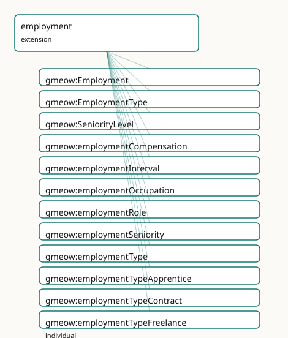

<!-- GENERATED by gmeow ontology-docs. DO NOT EDIT. -->

# GMEOW Employment Module

- **IRI:** <https://blackcatinformatics.ca/gmeow/slices/employment>
- **Tier:** extension
- **[`Group`](../reference/classes/gmeow-Group.md):** extensions

## What This Slice Covers

This slice owns 21 terms and contributes 17 mapping or projection rows. Use it when its terms match the native fact you want to preserve; use the linkage tables to see how those facts leave GMEOW for consumer vocabularies.

## Dependencies

- [`gmeow:slices/entities`](entities.md)
- [`gmeow:slices/kernel`](kernel.md)
- [`gmeow:slices/observations`](observations.md)
- [`gmeow:slices/organization`](organization.md)
- [`gmeow:slices/temporal`](temporal.md)

## Consumers

- CV/employment claims over organization and agreements; the mail corpus's signatures.

## Local Map



## Examples

### Job

- **Source:** [`slices/extensions/employment/examples/job.ttl`](https://github.com/Blackcat-Informatics/gmeow-ontology/blob/main/slices/extensions/employment/examples/job.ttl)
- **GMEOW terms:** [`gmeow:Employment`](../reference/classes/gmeow-Employment.md), [`gmeow:Membership`](../reference/classes/gmeow-Membership.md), [`gmeow:Occupation`](../reference/classes/gmeow-Occupation.md), [`gmeow:Organization`](../reference/classes/gmeow-Organization.md), [`gmeow:Person`](../reference/classes/gmeow-Person.md), [`gmeow:employmentOccupation`](../reference/properties/gmeow-employmentOccupation.md), [`gmeow:employmentSeniority`](../reference/properties/gmeow-employmentSeniority.md), [`gmeow:employmentType`](../reference/properties/gmeow-employmentType.md), [`gmeow:employmentTypeFullTime`](../reference/individuals/gmeow-employmentTypeFullTime.md), [`gmeow:membershipMember`](../reference/properties/gmeow-membershipMember.md)

```turtle
# SPDX-FileCopyrightText: 2026 Blackcat Informatics® Inc. <paudley@blackcatinformatics.ca>
# SPDX-License-Identifier: CC-BY-4.0
#
# Worked example: employment specializes membership. A gmeow:Employment is
# a gmeow:Membership (the person is a member of the employer), refined with the
# facets a job adds: an open gmeow:employmentType (full-time / contract / intern /
# volunteer …), a gmeow:employmentSeniority, the gmeow:employmentOccupation it
# realizes, and its gmeow:employmentInterval. The seat-vs-sitter discipline from
# the organization slice still holds — this is the SITTER's tenure, distinct from
# any Post it may fill.
@prefix gmeow: <https://blackcatinformatics.ca/gmeow/> .
@prefix ex:    <https://blackcatinformatics.ca/gmeow/examples/employment/> .
@prefix rdfs:  <http://www.w3.org/2000/01/rdf-schema#> .

ex:dana a gmeow:Person ; gmeow:name "Dana Reyes"@en .
ex:acme a gmeow:Organization ; gmeow:name "Acme Robotics Inc."@en .

ex:engineer a gmeow:Occupation ; rdfs:label "Software Engineer"@en .

# --- The employment: a membership of Acme, refined with employment facets.
ex:job a gmeow:Employment ;
    gmeow:membershipMember       ex:dana ;
    gmeow:membershipOrganization ex:acme ;
    gmeow:employmentType         gmeow:employmentTypeFullTime ;
    gmeow:employmentSeniority    gmeow:senioritySenior ;
    gmeow:employmentOccupation   ex:engineer .
```

## Terms

### Classes

| Term | Label | Definition |
|---|---|---|
| [`gmeow:Employment`](../reference/classes/gmeow-Employment.md) | Employment | A reified employment relationship between an agent and an organization, optionally founded on an employment contract and bearing a role, compensation, and empl... |
| [`gmeow:EmploymentType`](../reference/classes/gmeow-EmploymentType.md) | Employment Type | The kind of employment — a VALUE, never an Employment subclass. The set is open; a kind not among the seeds is a FRESH [`gmeow:EmploymentType`](../reference/classes/gmeow-EmploymentType.md) individual carrying... |
| [`gmeow:SeniorityLevel`](../reference/classes/gmeow-SeniorityLevel.md) | Seniority Level | The seniority or rank of an employment — a VALUE, never an Employment subclass. The set is open; a level not among the seeds is a FRESH [`gmeow:SeniorityLevel`](../reference/classes/gmeow-SeniorityLevel.md) in... |

### Properties

| Term | Label | Definition |
|---|---|---|
| [`gmeow:employmentCompensation`](../reference/properties/gmeow-employmentCompensation.md) | employment compensation | The monetary compensation of an employment, expressed as a MonetaryAmount with explicit currency frame ([Principle 11](https://github.com/Blackcat-Informatics/gmeow-ontology/blob/main/CONSTITUTION.md#principle-11)). Non-functional: a single employment may... |
| [`gmeow:employmentInterval`](../reference/properties/gmeow-employmentInterval.md) | employment interval | The time interval over which the employment holds. A relator carries its period this way (matching [`gmeow:participationInterval`](../reference/properties/gmeow-participationInterval.md), [`gmeow:membershipInterval`](../reference/properties/gmeow-membershipInterval.md)) rathe... |
| [`gmeow:employmentOccupation`](../reference/properties/gmeow-employmentOccupation.md) | employment occupation | The occupation associated with this employment, drawn from an open vocabulary such as ESCO or SOC. Functional: an employment maps to one canonical occupation;... |
| [`gmeow:employmentRole`](../reference/properties/gmeow-employmentRole.md) | employment role | The role borne by this employment — a job title, position, or function. Functional: an employment has one canonical role at a time; a change of role is a new e... |
| [`gmeow:employmentSeniority`](../reference/properties/gmeow-employmentSeniority.md) | employment seniority | The seniority level of an employment — one of the open [`gmeow:SeniorityLevel`](../reference/classes/gmeow-SeniorityLevel.md) values. Functional: an employment has one canonical seniority at a time; a promotio... |
| [`gmeow:employmentType`](../reference/properties/gmeow-employmentType.md) | employment type | The kind of employment — one of the open [`gmeow:EmploymentType`](../reference/classes/gmeow-EmploymentType.md) values. Functional: an employment has one canonical type at a time; a change of type is a new emp... |

### Individuals

| Term | Label | Definition |
|---|---|---|
| [`gmeow:employmentTypeApprentice`](../reference/individuals/gmeow-employmentTypeApprentice.md) | apprentice | Employment as an apprentice, combining work with structured training. |
| [`gmeow:employmentTypeContract`](../reference/individuals/gmeow-employmentTypeContract.md) | contract | Employment under a fixed-term contract. |
| [`gmeow:employmentTypeFreelance`](../reference/individuals/gmeow-employmentTypeFreelance.md) | freelance | Self-employed or independent contractor work. |
| [`gmeow:employmentTypeFullTime`](../reference/individuals/gmeow-employmentTypeFullTime.md) | full-time | Employment for the full ordinary duration of working hours. |
| [`gmeow:employmentTypeIntern`](../reference/individuals/gmeow-employmentTypeIntern.md) | intern | Employment as an intern or trainee. |
| [`gmeow:employmentTypePartTime`](../reference/individuals/gmeow-employmentTypePartTime.md) | part-time | Employment for less than the full ordinary duration of working hours. |
| [`gmeow:employmentTypeVolunteer`](../reference/individuals/gmeow-employmentTypeVolunteer.md) | volunteer | Unpaid voluntary work. |
| [`gmeow:seniorityEntry`](../reference/individuals/gmeow-seniorityEntry.md) | entry-level | An entry-level or junior position. |
| [`gmeow:seniorityExecutive`](../reference/individuals/gmeow-seniorityExecutive.md) | executive | An executive or C-level position. |
| [`gmeow:seniorityLead`](../reference/individuals/gmeow-seniorityLead.md) | lead | A lead or principal position. |
| [`gmeow:seniorityMid`](../reference/individuals/gmeow-seniorityMid.md) | mid-level | A mid-level position. |
| [`gmeow:senioritySenior`](../reference/individuals/gmeow-senioritySenior.md) | senior | A senior-level position. |

## Linkages

- **Rows:** 17
- **Projection profiles:** `org`, `resume`
- **External vocabularies:** `esco`, `org`, `rdf`, `schema`, `wdt`

| Source | Kind | Profile | Predicate/Relation | Target | Evidence |
|---|---|---|---|---|---|
| [`gmeow:Employment`](../reference/classes/gmeow-Employment.md) | equivalence | `-` | [skos:closeMatch](http://www.w3.org/2004/02/skos/core#closeMatch) | [org:Role](http://www.w3.org/ns/org#Role) | `gmeow-employment.sssom.tsv`; `gmeow:eqEmployment020`; confidence 0.75 |
| [`gmeow:Employment`](../reference/classes/gmeow-Employment.md) | equivalence | `-` | [skos:closeMatch](http://www.w3.org/2004/02/skos/core#closeMatch) | [schema:EmployeeRole](https://schema.org/EmployeeRole) | `gmeow-employment.sssom.tsv`; `gmeow:eqEmployment001`; confidence 0.85 |
| [`gmeow:Employment`](../reference/classes/gmeow-Employment.md) | equivalence | `-` | [skos:closeMatch](http://www.w3.org/2004/02/skos/core#closeMatch) | [schema:OrganizationRole](https://schema.org/OrganizationRole) | `gmeow-employment.sssom.tsv`; `gmeow:eqEmployment002`; confidence 0.8 |
| [`gmeow:Employment`](../reference/classes/gmeow-Employment.md) | equivalence | `-` | [skos:relatedMatch](http://www.w3.org/2004/02/skos/core#relatedMatch) | [wdt:P108](https://www.wikidata.org/wiki/Property:P108) | `gmeow-employment.sssom.tsv`; `gmeow:eqEmployment010`; confidence 0.8 |
| [`gmeow:employmentCompensation`](../reference/properties/gmeow-employmentCompensation.md) | equivalence | `-` | [skos:relatedMatch](http://www.w3.org/2004/02/skos/core#relatedMatch) | [schema:salary](https://schema.org/salary) | `gmeow-employment.sssom.tsv`; `gmeow:eqEmployment004`; confidence 0.7 |
| [`gmeow:employmentCompensation`](../reference/properties/gmeow-employmentCompensation.md) | equivalence | `-` | [skos:closeMatch](http://www.w3.org/2004/02/skos/core#closeMatch) | [wdt:P2250](https://www.wikidata.org/wiki/Property:P2250) | `gmeow-employment.sssom.tsv`; `gmeow:eqEmployment011`; confidence 0.75 |
| [`gmeow:employmentOccupation`](../reference/properties/gmeow-employmentOccupation.md) | equivalence | `-` | [skos:closeMatch](http://www.w3.org/2004/02/skos/core#closeMatch) | [esco:occupation](http://data.europa.eu/esco/model#occupation) | `gmeow-employment.sssom.tsv`; `gmeow:eqEmployment040`; confidence 0.9 |
| [`gmeow:employmentType`](../reference/properties/gmeow-employmentType.md) | equivalence | `-` | [skos:closeMatch](http://www.w3.org/2004/02/skos/core#closeMatch) | [schema:employmentType](https://schema.org/employmentType) | `gmeow-employment.sssom.tsv`; `gmeow:eqEmployment003`; confidence 0.85 |
| [`gmeow:Employment`](../reference/classes/gmeow-Employment.md) | projection | `resume` | projects to / <= | [schema:employmentType](https://schema.org/employmentType) | `gmeow:mapResumeEmploymentType`; confidence 0.85; lossy: the EmploymentType value vocabulary individual collapses to its [rdfs:label](http://www.w3.org/2000/01/rdf-schema#label) string; the structural type distinction is lost |
| [`gmeow:Employment`](../reference/classes/gmeow-Employment.md) | projection | `resume` | projects to / <= | [schema:endDate](https://schema.org/endDate) | `gmeow:mapResumeEndDate`; confidence 0.9; lossy: the Employment relator and interval frame collapse to a flat [schema:endDate](https://schema.org/endDate); open-ended employments (no end) emit no endDate |
| [`gmeow:Employment`](../reference/classes/gmeow-Employment.md) | projection | `resume` | projects to / <= | [schema:jobTitle](https://schema.org/jobTitle) | `gmeow:mapResumeJobTitle`; confidence 0.9; lossy: the Employment relator (organization, period, compensation, type, standpoint) collapses to a flat [schema:jobTitle](https://schema.org/jobTitle) literal; contested employment claims are not distinguished; transform `gmeow:fnMembershipToJobTitle` |
| [`gmeow:Employment`](../reference/classes/gmeow-Employment.md) | projection | `resume` | projects to / <= | [schema:startDate](https://schema.org/startDate) | `gmeow:mapResumeStartDate`; confidence 0.9; lossy: the Employment relator (organization, role, compensation, standpoint) and the interval's temporal frame collapse to a flat [schema:startDate](https://schema.org/startDate) on the projected EmployeeRole |
| [`gmeow:Employment`](../reference/classes/gmeow-Employment.md) | projection | `resume` | projects to / <= | [schema:worksFor](https://schema.org/worksFor) | `gmeow:mapResumeWorksFor`; confidence 0.9; lossy: the Employment relator and its contested claims collapse to a flat [schema:worksFor](https://schema.org/worksFor) edge |
| [`gmeow:employmentInterval`](../reference/properties/gmeow-employmentInterval.md) | projection | `resume` | projects to / <= | [schema:endDate](https://schema.org/endDate) | `gmeow:mapResumeEndDate`; confidence 0.9; lossy: the Employment relator and interval frame collapse to a flat [schema:endDate](https://schema.org/endDate); open-ended employments (no end) emit no endDate |
| [`gmeow:employmentInterval`](../reference/properties/gmeow-employmentInterval.md) | projection | `resume` | projects to / <= | [schema:startDate](https://schema.org/startDate) | `gmeow:mapResumeStartDate`; confidence 0.9; lossy: the Employment relator (organization, role, compensation, standpoint) and the interval's temporal frame collapse to a flat [schema:startDate](https://schema.org/startDate) on the projected EmployeeRole |
| [`gmeow:employmentRole`](../reference/properties/gmeow-employmentRole.md) | projection | `org` | projects to / = | [org:Membership](http://www.w3.org/ns/org#Membership), [org:member](http://www.w3.org/ns/org#member), [org:organization](http://www.w3.org/ns/org#organization), [org:role](http://www.w3.org/ns/org#role), [rdf:type](http://www.w3.org/1999/02/22-rdf-syntax-ns#type) | `gmeow:mapOrgMembership`; confidence 0.95; lossy: statement-level provenance (accordingTo, validity clocks) on the membership drops |
| [`gmeow:employmentType`](../reference/properties/gmeow-employmentType.md) | projection | `resume` | projects to / <= | [schema:employmentType](https://schema.org/employmentType) | `gmeow:mapResumeEmploymentType`; confidence 0.85; lossy: the EmploymentType value vocabulary individual collapses to its [rdfs:label](http://www.w3.org/2000/01/rdf-schema#label) string; the structural type distinction is lost |

## Guide

<!-- SPDX-FileCopyrightText: 2026 Blackcat Informatics® Inc. <paudley@blackcatinformatics.ca> -->
<!-- SPDX-License-Identifier: CC-BY-4.0 -->

# Employment — tenure, compensation, and career as reified membership

> **Slice:** `https://blackcatinformatics.ca/gmeow/slices/employment` · **tier: extension**
> The ResumeRDF / Europass / schema.org / ESCO / CTDL superset layer — one relator, many projections.

[`Employment`](../reference/classes/gmeow-Employment.md) is not a new primitive; it is a [`Membership`](../reference/classes/gmeow-Membership.md) — a reified [`gufo:Relator`](../external/terms.md#gufo-relator)
connecting an agent to an organization, optionally founded on an [`Agreement`](../reference/classes/gmeow-Agreement.md) ([Principle 4](https://github.com/Blackcat-Informatics/gmeow-ontology/blob/main/CONSTITUTION.md#principle-4):
reuse the spine, add only the facets). The structural skeleton (member, organization,
role, period) is inherited; this slice adds the employment-specific facets — type,
compensation, seniority, occupation. Flat-first, reify on demand: a flat [`gmeow:memberOf`](../reference/properties/gmeow-memberOf.md)
covers the 80 % case; promote to [`gmeow:Employment`](../reference/classes/gmeow-Employment.md) when type, compensation, seniority,
or provenance matters. Career *events* (hiring, promotion, transfer, resignation,
termination) are value individuals in the universal [`EventType`](../reference/classes/gmeow-EventType.md) vocabulary, never
subclasses ([Principle 9](https://github.com/Blackcat-Informatics/gmeow-ontology/blob/main/CONSTITUTION.md#principle-9)).

The standpoint doctrine applies with full force: disputed tenure, rival role
claims, and contested terminations are standpoint-indexed claims that **coexist**, none
privileged ([Principle 9](https://github.com/Blackcat-Informatics/gmeow-ontology/blob/main/CONSTITUTION.md#principle-9)) — two [`accordingTo`](../reference/properties/gmeow-accordingTo.md)-annotated [`memberOf`](../reference/properties/gmeow-memberOf.md) triples, or two reified
[`Employment`](../reference/classes/gmeow-Employment.md) relators each carrying [`gmeow:accordingTo`](../reference/properties/gmeow-accordingTo.md). There is no employment-specific
dispute mechanism, no `primaryEmployment`, no `preferredJob` — only the cross-cutting
standpoint facility. A withdrawn employment record sets [`gmeow:displayable`](../reference/properties/gmeow-displayable.md) false, never
deletion ([Principle 10](https://github.com/Blackcat-Informatics/gmeow-ontology/blob/main/CONSTITUTION.md#principle-10)). Its Principle-15 consumer, declared in the manifest:
**CV/employment claims over organization and agreements, and the mail corpus's
signatures** — a signature block ("Jane Doe, Senior Engineer, Acme") is exactly one
flat-or-reified employment claim from the vantage of the message.

## The relator

### [`gmeow:Employment`](../reference/classes/gmeow-Employment.md)

A [`Membership`](../reference/classes/gmeow-Membership.md) subkind: agent, organization, and role inherited; type, compensation,
seniority, and occupation added here. Relator mediation is axiomatized (EL
`someValuesFrom`: an [`Employment`](../reference/classes/gmeow-Employment.md) has a type, a member [`Agent`](../reference/classes/gmeow-Agent.md), and an [`Organization`](../reference/classes/gmeow-Organization.md)) so the
doctrine is reasoner-visible; closed-world cardinality belongs to SHACL
(`gmeow-shapes.ttl`).

### [`gmeow:employmentInterval`](../reference/properties/gmeow-employmentInterval.md)

The tenure: [`Employment`](../reference/classes/gmeow-Employment.md) → [`TimeInterval`](../reference/classes/gmeow-TimeInterval.md), matching [`participationInterval`](../reference/properties/gmeow-participationInterval.md) and
[`membershipInterval`](../reference/properties/gmeow-membershipInterval.md) (relators carry their period this way; [`duringInterval`](../reference/properties/gmeow-duringInterval.md) is reserved
for [`gufo:Situation`](http://purl.org/nemo/gufo#Situation)-based time-scoped relations). Open-ended — no end instant — when the
employment is current. Contested dates are coexisting standpoint-indexed intervals.

## The facet vocabularies ([Principle 9](https://github.com/Blackcat-Informatics/gmeow-ontology/blob/main/CONSTITUTION.md#principle-9) — values, never subclasses)

### [`gmeow:EmploymentType`](../reference/classes/gmeow-EmploymentType.md)

The kind of employment: seeds [`employmentTypeFullTime`](../reference/individuals/gmeow-employmentTypeFullTime.md), `…PartTime`, …[`Contract`](../reference/classes/gmeow-Contract.md),
`…Intern`, `…Freelance`, `…Volunteer`, `…Apprentice`. Open: a kind not among the seeds is
a fresh individual with a label, never an [`Employment`](../reference/classes/gmeow-Employment.md) subclass.

### [`gmeow:employmentType`](../reference/properties/gmeow-employmentType.md)

Functional pointer to the type — one canonical type at a time. A change of type is a new
employment record or a standpoint-indexed claim, never an in-place overwrite.

### [`gmeow:SeniorityLevel`](../reference/classes/gmeow-SeniorityLevel.md)

The rank: seeds [`seniorityEntry`](../reference/individuals/gmeow-seniorityEntry.md), [`seniorityMid`](../reference/individuals/gmeow-seniorityMid.md), [`senioritySenior`](../reference/individuals/gmeow-senioritySenior.md), [`seniorityLead`](../reference/individuals/gmeow-seniorityLead.md),
[`seniorityExecutive`](../reference/individuals/gmeow-seniorityExecutive.md). Deliberately orthogonal to both employment type and role — a
part-time executive and a full-time intern are both expressible without a combinatorial
class explosion.

### [`gmeow:employmentSeniority`](../reference/properties/gmeow-employmentSeniority.md)

Functional: one canonical seniority at a time; a promotion is a new employment record or
a standpoint-indexed claim — which is also how the promotion *event* (an [`EventType`](../reference/classes/gmeow-EventType.md)
value) and the resulting record stay distinct.

## The cross-slice facets

### [`gmeow:employmentRole`](../reference/properties/gmeow-employmentRole.md)

The job title or function, specializing the universal [`gmeow:hasRole`](../reference/properties/gmeow-hasRole.md). Functional per
employment; rival role claims are rival relators, not multiple values.

### [`gmeow:employmentOccupation`](../reference/properties/gmeow-employmentOccupation.md)

The occupation drawn from an open external vocabulary (ESCO, SOC). Functional: one
canonical occupation per record; an agent with several occupations has several employment
records.

### [`gmeow:employmentCompensation`](../reference/properties/gmeow-employmentCompensation.md)

[`Employment`](../reference/classes/gmeow-Employment.md) → [`MonetaryAmount`](../reference/classes/gmeow-MonetaryAmount.md) — compensation always carries its explicit currency
reference frame ([Principle 11](https://github.com/Blackcat-Informatics/gmeow-ontology/blob/main/CONSTITUTION.md#principle-11): an amount without its frame is meaningless).
Non-functional by design: raises, bonuses, and multi-currency arrangements are co-equal
standpoint-indexed claims over time, not a single overwritten salary field.

## Solver layer & alignment

Career-trajectory queries — tenure overlap, gap detection, seniority progression — are
solver-layer computations over [`employmentInterval`](../reference/properties/gmeow-employmentInterval.md) and the temporal slice's clocks
([Principle 12](https://github.com/Blackcat-Informatics/gmeow-ontology/blob/main/CONSTITUTION.md#principle-12)); the OWL core asserts records, not timelines. Alignment to the superset
sources (ResumeRDF, Europass, schema.org `EmployeeRole`, ESCO, CTDL) is the projection
layer's concern: each is a lossy down-projection of the relator, deferred until its
consumer is live.

## Dependencies

Depends on `kernel`, `entities`, `observations`, `organization` ([`Membership`](../reference/classes/gmeow-Membership.md), [`Role`](../reference/classes/gmeow-Role.md),
[`Agreement`](../reference/classes/gmeow-Agreement.md)), and `temporal` ([`TimeInterval`](../reference/classes/gmeow-TimeInterval.md)). Reuses [`MonetaryAmount`](../reference/classes/gmeow-MonetaryAmount.md), [`Occupation`](../reference/classes/gmeow-Occupation.md), [`Credential`](../reference/classes/gmeow-Credential.md),
[`Skill`](../reference/classes/gmeow-Skill.md), and [`LanguageProficiency`](../reference/classes/gmeow-LanguageProficiency.md) from their home slices without redefinition.
