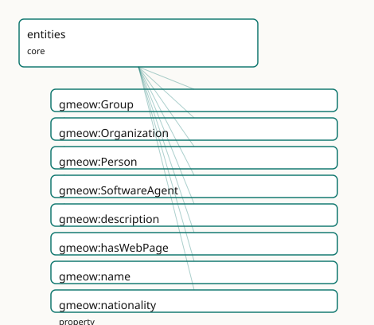

<!-- GENERATED by gmeow ontology-docs. DO NOT EDIT. -->

# GMEOW Entities Module

- **IRI:** <https://blackcatinformatics.ca/gmeow/slices/entities>
- **Tier:** core
- **[`Group`](../reference/classes/gmeow-Group.md):** core

## What This Slice Covers

This slice owns 8 terms and contributes 43 mapping or projection rows. Use it when its terms match the native fact you want to preserve; use the linkage tables to see how those facts leave GMEOW for consumer vocabularies.

## Dependencies

- [`gmeow:slices/contacts`](contacts.md)
- [`gmeow:slices/documents`](documents.md)
- [`gmeow:slices/kernel`](kernel.md)
- [`gmeow:slices/language`](language.md)
- [`gmeow:slices/names`](names.md)
- [`gmeow:slices/places`](places.md)
- [`gmeow:slices/trust`](trust.md)

## Consumers

- Every slice describing people, organizations, or things; the mail corpus; the identity facets.

## Local Map



## Examples

### Agent Sortals

- **Source:** [`slices/core/entities/examples/agent-sortals.ttl`](https://github.com/Blackcat-Informatics/gmeow-ontology/blob/main/slices/core/entities/examples/agent-sortals.ttl)
- **GMEOW terms:** [`gmeow:Group`](../reference/classes/gmeow-Group.md), [`gmeow:Organization`](../reference/classes/gmeow-Organization.md), [`gmeow:Person`](../reference/classes/gmeow-Person.md), [`gmeow:SoftwareAgent`](../reference/classes/gmeow-SoftwareAgent.md), [`gmeow:WebPage`](../reference/classes/gmeow-WebPage.md), [`gmeow:description`](../reference/properties/gmeow-description.md), [`gmeow:hasWebPage`](../reference/properties/gmeow-hasWebPage.md), [`gmeow:name`](../reference/properties/gmeow-name.md), [`gmeow:subOrganizationOf`](../reference/properties/gmeow-subOrganizationOf.md)
- **External prefixes:** `gufo`

```turtle
# SPDX-FileCopyrightText: 2026 Blackcat Informatics® Inc. <paudley@blackcatinformatics.ca>
# SPDX-License-Identifier: CC-BY-4.0
#
# Worked example: the four agent sortals. A small consultancy, two of its
# people, an informal working group, and its CI bot — each a distinct gufo:Kind
# beneath the kernel's gmeow:Agent. The flat naming tier (gmeow:name) carries the
# 80% case here; anything that needs structure — a reified PersonName, a contact
# point, a location — attaches to these Kinds from its own slice (the entities
# slice stays deliberately thin). Person ⟂ Organization ⟂ SoftwareAgent are
# pairwise disjoint (a human is never a bot); Group is deliberately NOT disjoint
# (a structured organization is arguably also a group, P9).
@prefix gmeow: <https://blackcatinformatics.ca/gmeow/> .
@prefix ex:    <https://blackcatinformatics.ca/gmeow/examples/entities/> .
@prefix rdfs:  <http://www.w3.org/2000/01/rdf-schema#> .

# --- Organization: the flat name/description tier. A structured web presence
#     (gmeow:hasWebPage → a WEMI gmeow:WebPage) is shown in the documents example;
#     here the flat tier carries it.
ex:blackcat a gmeow:Organization ;
    gmeow:name "Blackcat Informatics® Inc."@en ;
    gmeow:description "A small ontology and tooling consultancy."@en .

# --- People: gmeow:Person, the identity-supplying sortal everything else anchors
#     to. Flat names suffice for the example; a contested or multilingual name
#     would promote to the names slice's reified PersonName.
ex:mara a gmeow:Person ;
    gmeow:name "Mara Okafor"@en ;
    gmeow:description "Backend engineer; maintains the release pipeline."@en .

ex:tomas a gmeow:Person ;
    gmeow:name "Tomáš Novák"@en .

# --- Group: a collection of agents treated as a unit WITHOUT the formal
#     structure of an organization. Sub-organization decomposition would instead
#     use gmeow:subOrganizationOf in the organization slice.
ex:platformTeam a gmeow:Group ;
    gmeow:name "Platform team"@en ;
    gmeow:description "An informal cross-functional working group, not a legal sub-organization."@en .

# --- SoftwareAgent: a process acting on behalf of an organization. Disjoint with
#     Person; the "acts on behalf of" delegation is a provenance-layer relation,
#     not subclassing.
ex:ciBot a gmeow:SoftwareAgent ;
    gmeow:name "blackcat-ci"@en ;
    gmeow:description "The CI build agent that runs Blackcat's release pipeline."@en .
```

## Terms

### Classes

| Term | Label | Definition |
|---|---|---|
| [`gmeow:Group`](../reference/classes/gmeow-Group.md) | Group | A collection of agents treated as a unit without the formal structure of an organization. |
| [`gmeow:Organization`](../reference/classes/gmeow-Organization.md) | Organization | A structured group of agents — a company, institution, association, or governmental body — able to act as a single agent. |
| [`gmeow:Person`](../reference/classes/gmeow-Person.md) | Person | An individual human being, living or deceased. |
| [`gmeow:SoftwareAgent`](../reference/classes/gmeow-SoftwareAgent.md) | Software Agent | A software process or autonomous program that acts on behalf of a person or organization. |

### Properties

| Term | Label | Definition |
|---|---|---|
| [`gmeow:description`](../reference/properties/gmeow-description.md) | description | A free-text note or description about an entity — the unstructured NOTE field (a biography, a remark, an annotation). Genuinely flat: unlike names, dates or ro... |
| [`gmeow:hasWebPage`](../reference/properties/gmeow-hasWebPage.md) | has web page | Relates an entity to a web page representing it — a homepage, a profile page, a project site. The structured form of a 'website / URL' field: the page is a fir... |
| [`gmeow:name`](../reference/properties/gmeow-name.md) | name | A simple label by which an entity is known — the [rdfs:label](http://www.w3.org/2000/01/rdf-schema#label) tier, for entities that do not need the full naming apparatus (organizations, software agents, sour... |
| [`gmeow:nationality`](../reference/properties/gmeow-nationality.md) | nationality | The country of a person's nationality ([schema:nationality](https://schema.org/nationality)) — a [`gmeow:Place`](../reference/classes/gmeow-Place.md). The legal/national-identity bond, distinct from where a person currently lives. Non... |

## Linkages

- **Rows:** 43
- **Projection profiles:** `dcat`, `dcterms`, `doap`, `foaf`, `gedcom`, `oai_dc`, `org`, `resume`, `schema-org`, `vcard`
- **External vocabularies:** `dc`, `dcterms`, `doap`, `foaf`, `gedcom`, `gxv`, `org`, `rdf`, `schema`, `vcard`, `wd`

| Source | Kind | Profile | Predicate/Relation | Target | Evidence |
|---|---|---|---|---|---|
| [`gmeow:Group`](../reference/classes/gmeow-Group.md) | equivalence | `-` | [owl:equivalentClass](http://www.w3.org/2002/07/owl#equivalentClass) | [foaf:Group](http://xmlns.com/foaf/0.1/Group) | `gmeow-classes.sssom.tsv`; `gmeow:eqClasses009`; confidence 0.95 |
| [`gmeow:Group`](../reference/classes/gmeow-Group.md) | equivalence | `-` | [skos:closeMatch](http://www.w3.org/2004/02/skos/core#closeMatch) | [wd:Q874405](https://www.wikidata.org/wiki/Q874405) | `gmeow-wikidata.sssom.tsv`; `gmeow:eqWikidata054`; confidence 0.75 |
| [`gmeow:Organization`](../reference/classes/gmeow-Organization.md) | equivalence | `-` | [owl:equivalentClass](http://www.w3.org/2002/07/owl#equivalentClass) | [foaf:Organization](http://xmlns.com/foaf/0.1/Organization) | `gmeow-classes.sssom.tsv`; `gmeow:eqClasses005`; confidence 1 |
| [`gmeow:Organization`](../reference/classes/gmeow-Organization.md) | equivalence | `-` | [rdfs:subClassOf](http://www.w3.org/2000/01/rdf-schema#subClassOf) | [org:FormalOrganization](http://www.w3.org/ns/org#FormalOrganization) | `gmeow-classes.sssom.tsv`; `gmeow:eqClasses006`; confidence 1 |
| [`gmeow:Organization`](../reference/classes/gmeow-Organization.md) | equivalence | `-` | [owl:equivalentClass](http://www.w3.org/2002/07/owl#equivalentClass) | [schema:Organization](https://schema.org/Organization) | `gmeow-classes.sssom.tsv`; `gmeow:eqClasses004`; confidence 1 |
| [`gmeow:Organization`](../reference/classes/gmeow-Organization.md) | equivalence | `-` | [skos:exactMatch](http://www.w3.org/2004/02/skos/core#exactMatch) | [wd:Q43229](https://www.wikidata.org/wiki/Q43229) | `gmeow-wikidata.sssom.tsv`; `gmeow:eqWikidata002`; confidence 0.9 |
| [`gmeow:Person`](../reference/classes/gmeow-Person.md) | equivalence | `-` | [owl:equivalentClass](http://www.w3.org/2002/07/owl#equivalentClass) | [foaf:Person](http://xmlns.com/foaf/0.1/Person) | `gmeow-classes.sssom.tsv`; `gmeow:eqClasses002`; confidence 1 |
| [`gmeow:Person`](../reference/classes/gmeow-Person.md) | equivalence | `-` | [owl:equivalentClass](http://www.w3.org/2002/07/owl#equivalentClass) | [gedcom:Individual](http://www.w3.org/2000/10/swap/pim/gedcom#Individual) | `gmeow-classes.sssom.tsv`; `gmeow:eqClasses003`; confidence 0.95 |
| [`gmeow:Person`](../reference/classes/gmeow-Person.md) | equivalence | `-` | [skos:closeMatch](http://www.w3.org/2004/02/skos/core#closeMatch) | [gxv:Person](http://gedcomx.org/v1/Person) | `gmeow-genealogy.sssom.tsv`; `gmeow:eqGenealogy043`; confidence 0.9 |
| [`gmeow:Person`](../reference/classes/gmeow-Person.md) | equivalence | `-` | [owl:equivalentClass](http://www.w3.org/2002/07/owl#equivalentClass) | [schema:Person](https://schema.org/Person) | `gmeow-classes.sssom.tsv`; `gmeow:eqClasses001`; confidence 1 |
| [`gmeow:Person`](../reference/classes/gmeow-Person.md) | equivalence | `-` | [skos:exactMatch](http://www.w3.org/2004/02/skos/core#exactMatch) | [wd:Q5](https://www.wikidata.org/wiki/Q5) | `gmeow-wikidata.sssom.tsv`; `gmeow:eqWikidata001`; confidence 0.95 |
| [`gmeow:description`](../reference/properties/gmeow-description.md) | equivalence | `-` | [skos:closeMatch](http://www.w3.org/2004/02/skos/core#closeMatch) | [dcterms:description](http://purl.org/dc/terms/description) | `gmeow-dublin-core.sssom.tsv`; `gmeow:eqDcTerms002`; confidence 0.9 |
| [`gmeow:description`](../reference/properties/gmeow-description.md) | equivalence | `-` | [skos:closeMatch](http://www.w3.org/2004/02/skos/core#closeMatch) | [dcterms:description](http://purl.org/dc/terms/description) | `gmeow-properties.sssom.tsv`; `gmeow:eqProperties037`; confidence 0.9 |
| [`gmeow:description`](../reference/properties/gmeow-description.md) | equivalence | `-` | [owl:equivalentProperty](http://www.w3.org/2002/07/owl#equivalentProperty) | [schema:description](https://schema.org/description) | `gmeow-properties.sssom.tsv`; `gmeow:eqProperties036`; confidence 1 |
| [`gmeow:description`](../reference/properties/gmeow-description.md) | equivalence | `-` | [skos:closeMatch](http://www.w3.org/2004/02/skos/core#closeMatch) | [vcard:note](http://www.w3.org/2006/vcard/ns#note) | `gmeow-properties.sssom.tsv`; `gmeow:eqProperties038`; confidence 0.8 |
| [`gmeow:hasWebPage`](../reference/properties/gmeow-hasWebPage.md) | equivalence | `-` | [skos:closeMatch](http://www.w3.org/2004/02/skos/core#closeMatch) | [foaf:homepage](http://xmlns.com/foaf/0.1/homepage) | `gmeow-properties.sssom.tsv`; `gmeow:eqProperties040`; confidence 0.8 |
| [`gmeow:hasWebPage`](../reference/properties/gmeow-hasWebPage.md) | equivalence | `-` | [skos:closeMatch](http://www.w3.org/2004/02/skos/core#closeMatch) | [schema:url](https://schema.org/url) | `gmeow-properties.sssom.tsv`; `gmeow:eqProperties039`; confidence 0.8 |
| [`gmeow:name`](../reference/properties/gmeow-name.md) | equivalence | `-` | [owl:equivalentProperty](http://www.w3.org/2002/07/owl#equivalentProperty) | [foaf:name](http://xmlns.com/foaf/0.1/name) | `gmeow-properties.sssom.tsv`; `gmeow:eqProperties002`; confidence 1 |
| [`gmeow:name`](../reference/properties/gmeow-name.md) | equivalence | `-` | [owl:equivalentProperty](http://www.w3.org/2002/07/owl#equivalentProperty) | [schema:name](https://schema.org/name) | `gmeow-properties.sssom.tsv`; `gmeow:eqProperties001`; confidence 1 |
| [`gmeow:name`](../reference/properties/gmeow-name.md) | equivalence | `-` | [skos:closeMatch](http://www.w3.org/2004/02/skos/core#closeMatch) | [vcard:fn](http://www.w3.org/2006/vcard/ns#fn) | `gmeow-properties.sssom.tsv`; `gmeow:eqProperties003`; confidence 0.9 |
| [`gmeow:Organization`](../reference/classes/gmeow-Organization.md) | projection | `org` | projects to / <= | [org:FormalOrganization](http://www.w3.org/ns/org#FormalOrganization) | `gmeow:mapOrgOrganization`; confidence 0.9; lossy: the formal/informal distinction is asserted, not derived — GMEOW organizations project as formal |
| [`gmeow:Organization`](../reference/classes/gmeow-Organization.md) | projection | `schema-org` | projects to / = | [schema:Corporation](https://schema.org/Corporation), [schema:EducationalOrganization](https://schema.org/EducationalOrganization), [schema:GovernmentOrganization](https://schema.org/GovernmentOrganization), [schema:NGO](https://schema.org/NGO), [schema:Organization](https://schema.org/Organization), [schema:Project](https://schema.org/Project) | `gmeow:mapSchemaOrganizationType`; transform `gmeow:fnOrganizationTypeToClass` |
| [`gmeow:Organization`](../reference/classes/gmeow-Organization.md) | projection | `schema-org` | projects to / <= | [schema:dissolutionDate](https://schema.org/dissolutionDate) | `gmeow:mapSchemaDissolutionDate`; confidence 0.9; lossy: the destruction event's place, participants, and standpoint are dropped; only the instant survives as [schema:dissolutionDate](https://schema.org/dissolutionDate) |
| [`gmeow:Organization`](../reference/classes/gmeow-Organization.md) | projection | `schema-org` | projects to / <= | [schema:foundingDate](https://schema.org/foundingDate) | `gmeow:mapSchemaFoundingDate`; confidence 0.9; lossy: the creation event's place, participants, and standpoint are dropped; only the instant survives as [schema:foundingDate](https://schema.org/foundingDate) |
|... |... |... |... |... | 19 more rows |

## Guide

<!-- SPDX-FileCopyrightText: 2026 Blackcat Informatics® Inc. <paudley@blackcatinformatics.ca> -->
<!-- SPDX-License-Identifier: CC-BY-4.0 -->

# Entities — people, organizations, groups, and software agents

> **Slice:** `https://blackcatinformatics.ca/gmeow/slices/entities` · **tier: core**
> The FOAF / schema.org superset layer: the agent sortals everything else describes.

This slice mints the concrete agent Kinds beneath the kernel's [`gmeow:Agent`](../reference/classes/gmeow-Agent.md) category —
the things the mail corpus, the identity facets, and every people-describing slice talk
about. The stance is deliberately thin: the sortals carry identity, while names, contact
points, locations, documents, and trust assessments live in their own slices and attach
*to* these Kinds. Where common vocabularies flatten a person into a bag of string fields,
GMEOW keeps the flat tier honest (a simple `name` literal for entities that need nothing
more) and routes everything with structure — person names above all — to the structured
model, downcasting to "First Last" only in the projection layer ([Principle 10](https://github.com/Blackcat-Informatics/gmeow-ontology/blob/main/CONSTITUTION.md#principle-10): projection
is where lossiness is allowed, never storage).

The module's one axiom block is doctrine made checkable (relator-mediation doctrine): distinct [`gufo:Kind`](../external/terms.md#gufo-kind)
classes each supply their own principle of identity, so the core ultimate Kinds are
asserted pairwise disjoint — and only those whose disjointness is *true*.

## The agent sortals

### [`gmeow:Person`](../reference/classes/gmeow-Person.md)

An individual human being, living or deceased. A [`gufo:Kind`](../external/terms.md#gufo-kind) — the identity-supplying
sortal that the names slice's [`PersonName`](../reference/classes/gmeow-PersonName.md), the identity facets, and the relationship
relators all anchor to. Disjoint with [`Organization`](../reference/classes/gmeow-Organization.md), [`SoftwareAgent`](../reference/classes/gmeow-SoftwareAgent.md), [`Location`](../reference/classes/gmeow-Location.md), [`ContactPoint`](../reference/classes/gmeow-ContactPoint.md),
[`CryptographicKey`](../reference/classes/gmeow-CryptographicKey.md), [`Appellation`](../reference/classes/gmeow-Appellation.md), [`Language`](../reference/classes/gmeow-Language.md), and [`WritingSystem`](../reference/classes/gmeow-WritingSystem.md).

### [`gmeow:Organization`](../reference/classes/gmeow-Organization.md)

A structured group of agents able to act as a single agent — a company, institution,
association, or governmental body. Sub-organization decomposition specializes the
kernel's universal [`gmeow:partOf`](../reference/properties/gmeow-partOf.md) spine in its own slice; here only the Kind lives.

### [`gmeow:Group`](../reference/classes/gmeow-Group.md)

A collection of agents treated as a unit *without* the formal structure of an organization
([`gufo:Collection`](http://purl.org/nemo/gufo#Collection), under [`gmeow:Entity`](../reference/classes/gmeow-Entity.md) rather than [`gmeow:Agent`](../reference/classes/gmeow-Agent.md)). Deliberately
**excluded** from the disjointness axiom: a structured organization is arguably a group,
and asserting that overlap away would manufacture inconsistency ([Principle 9](https://github.com/Blackcat-Informatics/gmeow-ontology/blob/main/CONSTITUTION.md#principle-9)).

### [`gmeow:SoftwareAgent`](../reference/classes/gmeow-SoftwareAgent.md)

A software process or autonomous program acting on behalf of a person or organization.
Disjoint with [`Person`](../reference/classes/gmeow-Person.md) — a human is never a bot — while delegation and attribution are
provenance-layer relations, not subclassing.

## The flat naming tier

### [`gmeow:name`](../reference/properties/gmeow-name.md)

The [`rdfs:label`](http://www.w3.org/2000/01/rdf-schema#label) tier: a simple, language-tagged label for entities that do not need the
full naming apparatus (organizations, software agents, sources, keys). It carries **no
precedence** over an entity's other names ([Principle 9](https://github.com/Blackcat-Informatics/gmeow-ontology/blob/main/CONSTITUTION.md#principle-9) — no privileged selector). Persons'
names are [`gmeow:PersonName`](../reference/classes/gmeow-PersonName.md) structures in the names slice; the flat given/family
rendering is produced by downcasting that model at projection time, never stored here.

### [`gmeow:description`](../reference/properties/gmeow-description.md)

The unstructured NOTE field — a biography, a remark, an annotation. Genuinely flat: unlike
names, dates, or roles, a note has no structure to reify, so no relator pairing exists.
Distinct from [`skos:definition`](http://www.w3.org/2004/02/skos/core#definition), which documents ontology *terms*, not instances.
Non-functional; language-tag where applicable.

### [`gmeow:hasWebPage`](../reference/properties/gmeow-hasWebPage.md)

The structured form of a "website / URL" field: the page is a first-class [`gmeow:WebPage`](../reference/classes/gmeow-WebPage.md)
(documents slice) whose IRI is its URL, so it can itself carry a title, language, and
rights. Non-functional — an entity may have several pages. Prefer this over a bare URL
literal: the bridge into the document layer is the point.

## The disjointness doctrine (relator-mediation doctrine)

The [`owl:AllDisjointClasses`](http://www.w3.org/2002/07/owl#AllDisjointClasses) axiom covers [`Person`](../reference/classes/gmeow-Person.md), [`Organization`](../reference/classes/gmeow-Organization.md), [`SoftwareAgent`](../reference/classes/gmeow-SoftwareAgent.md), [`Location`](../reference/classes/gmeow-Location.md),
[`ContactPoint`](../reference/classes/gmeow-ContactPoint.md), [`CryptographicKey`](../reference/classes/gmeow-CryptographicKey.md), [`Appellation`](../reference/classes/gmeow-Appellation.md), [`Language`](../reference/classes/gmeow-Language.md), and [`WritingSystem`](../reference/classes/gmeow-WritingSystem.md) — cross-module
IRIs that resolve after merge. Deliberately excluded: [`Group`](../reference/classes/gmeow-Group.md) (above) and the
[`InformationObject`](../reference/classes/gmeow-InformationObject.md) document / message / source family, where a Source may legitimately
also be a [`Document`](../reference/classes/gmeow-Document.md) or [`CreativeWork`](../reference/classes/gmeow-CreativeWork.md). The rule is constitutional: add only disjointness
that is TRUE; benign overlap must never become an inconsistency ([Principle 9](https://github.com/Blackcat-Informatics/gmeow-ontology/blob/main/CONSTITUTION.md#principle-9)).

## Alignment & boundaries

This is the layer that projects to FOAF ([`foaf:Person`](http://xmlns.com/foaf/0.1/Person), [`foaf:Organization`](http://xmlns.com/foaf/0.1/Organization),
[`foaf:Agent`](http://xmlns.com/foaf/0.1/Agent)) and schema.org ([`schema:Person`](https://schema.org/Person), [`schema:Organization`](https://schema.org/Organization)) — by reference and
lossy projection, never import ([Principle 5](https://github.com/Blackcat-Informatics/gmeow-ontology/blob/main/CONSTITUTION.md#principle-5)). [`Entity`](../reference/classes/gmeow-Entity.md) resolution — deciding that two
person records denote one human — is a solver-layer computation over the identity facets
([Principle 12](https://github.com/Blackcat-Informatics/gmeow-ontology/blob/main/CONSTITUTION.md#principle-12)); the slice never asserts [`owl:sameAs`](http://www.w3.org/2002/07/owl#sameAs) shortcuts. Depends on kernel,
names, contacts, places, documents, language, and trust; consumed by every slice that
describes people, organizations, or things.
