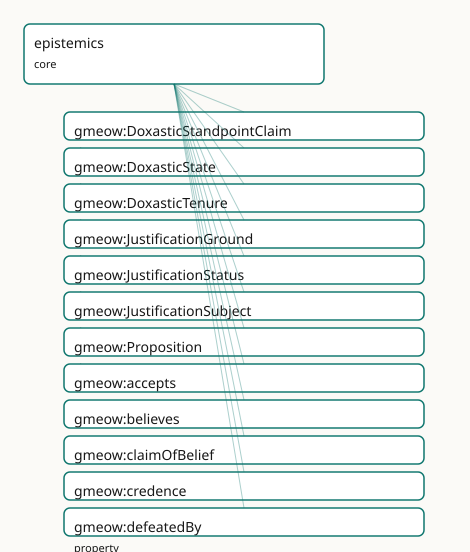

<!-- GENERATED by gmeow ontology-docs. DO NOT EDIT. -->

# GMEOW Epistemics Module

- **IRI:** <https://blackcatinformatics.ca/gmeow/slices/epistemics>
- **Tier:** core
- **[`Group`](../reference/classes/gmeow-Group.md):** core

## What This Slice Covers

This slice owns 24 terms and contributes 7 mapping or projection rows. Use it when its terms match the native fact you want to preserve; use the linkage tables to see how those facts leave GMEOW for consumer vocabularies.

## Dependencies

- [`gmeow:slices/attestation`](attestation.md)
- [`gmeow:slices/evidence`](evidence.md)
- [`gmeow:slices/inference`](inference.md)
- [`gmeow:slices/kernel`](kernel.md)
- [`gmeow:slices/observations`](observations.md)
- [`gmeow:slices/standpoint`](standpoint.md)
- [`gmeow:slices/temporal`](temporal.md)

## Consumers

- The agent-memory flagship store_claim / recall MCP surface ([Principle 14](https://github.com/Blackcat-Informatics/gmeow-ontology/blob/main/CONSTITUTION.md#principle-14)): an LLM output is a held attitude toward a proposition, recorded via the flat doxastic spine; the keystone [`knowsThat`](../reference/properties/gmeow-knowsThat.md) subPropertyOf believes materialises belief from any knowledge claim. The reified tier ([`DoxasticState`](../reference/classes/gmeow-DoxasticState.md), credence, [`doxasticClaim`](../reference/properties/gmeow-doxasticClaim.md), [`DoxasticTenure`](../reference/classes/gmeow-DoxasticTenure.md)) lives in this slice, reusing temporal:TimeScopedRelation/duringInterval and standpoint:StandpointClaim/claimModality. The lightweight [`gmeow:justifiedBy`](../reference/properties/gmeow-justifiedBy.md) hook points a [`DoxasticState`](../reference/classes/gmeow-DoxasticState.md) at [`EvidenceSpan`](../reference/classes/gmeow-EvidenceSpan.md), [`Attestation`](../reference/classes/gmeow-Attestation.md), or [`DoxasticState`](../reference/classes/gmeow-DoxasticState.md) justifiers; full inferential argumentation remains in the sibling justification child.

## Local Map



## Examples

### Belief And Knowledge

- **Source:** [`slices/core/epistemics/examples/belief-and-knowledge.ttl`](https://github.com/Blackcat-Informatics/gmeow-ontology/blob/main/slices/core/epistemics/examples/belief-and-knowledge.ttl)
- **GMEOW terms:** [`gmeow:Agent`](../reference/classes/gmeow-Agent.md), [`gmeow:Proposition`](../reference/classes/gmeow-Proposition.md), [`gmeow:accepts`](../reference/properties/gmeow-accepts.md), [`gmeow:believes`](../reference/properties/gmeow-believes.md), [`gmeow:knowsThat`](../reference/properties/gmeow-knowsThat.md), [`gmeow:suspendsJudgementOn`](../reference/properties/gmeow-suspendsJudgementOn.md)

```turtle
# SPDX-FileCopyrightText: 2026 Blackcat Informatics® Inc. <paudley@blackcatinformatics.ca>
# SPDX-License-Identifier: CC-BY-4.0
#
# Worked example — the flat doxastic spine. An agent knowsThat one proposition
# (which ENTAILS believes by the keystone), believes a second, pragmatically
# accepts a third without believing it, and suspends judgement on a fourth.
# No truth bit anywhere; modality and vantage would ride the statement layer.

@prefix gmeow: <https://blackcatinformatics.ca/gmeow/> .
@prefix ex:    <https://example.org/> .
@prefix rdfs:  <http://www.w3.org/2000/01/rdf-schema#> .

ex:earthOrbitsSun  a gmeow:Proposition ; rdfs:label "the Earth orbits the Sun"@en .
ex:coffeeIsHealthy a gmeow:Proposition ; rdfs:label "coffee is healthy"@en .
ex:nullHypothesis  a gmeow:Proposition ; rdfs:label "the null hypothesis, assumed for the test"@en .
ex:lifeOnEuropa    a gmeow:Proposition ; rdfs:label "there is life on Europa"@en .

ex:ada a gmeow:Agent ;
    gmeow:knowsThat            ex:earthOrbitsSun ;   # entails gmeow:believes ex:earthOrbitsSun
    gmeow:believes            ex:coffeeIsHealthy ;
    gmeow:accepts             ex:nullHypothesis ;   # a working premise — NOT believed
    gmeow:suspendsJudgementOn ex:lifeOnEuropa .
```

### Belief Revision

- **Source:** [`slices/core/epistemics/examples/belief-revision.ttl`](https://github.com/Blackcat-Informatics/gmeow-ontology/blob/main/slices/core/epistemics/examples/belief-revision.ttl)
- **GMEOW terms:** [`gmeow:Agent`](../reference/classes/gmeow-Agent.md), [`gmeow:DoxasticState`](../reference/classes/gmeow-DoxasticState.md), [`gmeow:DoxasticTenure`](../reference/classes/gmeow-DoxasticTenure.md), [`gmeow:Proposition`](../reference/classes/gmeow-Proposition.md), [`gmeow:StandpointClaim`](../reference/classes/gmeow-StandpointClaim.md), [`gmeow:TimeInterval`](../reference/classes/gmeow-TimeInterval.md), [`gmeow:claimModality`](../reference/properties/gmeow-claimModality.md), [`gmeow:credence`](../reference/properties/gmeow-credence.md), [`gmeow:displayable`](../reference/properties/gmeow-displayable.md), [`gmeow:doxasticClaim`](../reference/properties/gmeow-doxasticClaim.md)
- **External prefixes:** `xsd`

```turtle
# SPDX-FileCopyrightText: 2026 Blackcat Informatics® Inc. <paudley@blackcatinformatics.ca>
# SPDX-License-Identifier: CC-BY-4.0
#
# Worked example — BELIEF REVISION as SUPPRESSION (Principle 10).
#
# An agent believes "the printer is broken" with high credence.
# Later a defeater arrives — "the document was never sent to the print queue" —
# an undercutting defeater: it removes the warrant without asserting the negation.
# Revision does NOT delete anything:
#   * the original DoxasticState is RETAINED;
#   * the original DoxasticTenure is CLOSED (endedAtTime) and marked displayable false;
#   * a new DoxasticState (lower credence / different modality) records the revision.

@prefix gmeow: <https://blackcatinformatics.ca/gmeow/> .
@prefix ex:    <https://blackcatinformatics.ca/gmeow/examples/epistemics/> .
@prefix rdfs:  <http://www.w3.org/2000/01/rdf-schema#> .
@prefix xsd:   <http://www.w3.org/2001/XMLSchema#> .

ex:operator a gmeow:Agent ;
    rdfs:label "Office operator"@en .

ex:propPrinterBroken a gmeow:Proposition ;
    rdfs:label "the printer is broken"@en .

# --- Original belief (high credence, unequivocal) -----------------------------
ex:originalBelief a gmeow:DoxasticState ;
    rdfs:label "original belief: the printer is broken"@en ;
    gmeow:epistemicAgent ex:operator ;
    gmeow:doxasticContent ex:propPrinterBroken ;
    gmeow:credence "0.92"^^xsd:decimal ;
    gmeow:doxasticClaim ex:originalClaim .

ex:originalClaim a gmeow:StandpointClaim ;
    rdfs:label "Original claim: printer is broken"@en ;
    gmeow:vantage ex:operator ;
    gmeow:observedFeature ex:propPrinterBroken ;
    gmeow:claimModality gmeow:unequivocal ;
    gmeow:observationMethod gmeow:methodExpertJudgement .

ex:originalTenure a gmeow:DoxasticTenure ;
    rdfs:label "Original tenure of the 'printer is broken' belief"@en ;
    gmeow:tenureOfDoxasticState ex:originalBelief ;
    gmeow:duringInterval ex:originalInterval .

ex:originalInterval a gmeow:TimeInterval ;
    gmeow:startedAtTime "2026-06-15T11:00:00Z"^^xsd:dateTime ;
    gmeow:endedAtTime   "2026-06-15T11:18:00Z"^^xsd:dateTime ;
    gmeow:hasTemporalFrame gmeow:temporalFrameUTCGregorian .

# --- Suppression of the withdrawn original tenure -----------------------------
ex:originalTenure gmeow:displayable false .

# --- Revised belief (lower credence, probable) --------------------------------
ex:revisedBelief a gmeow:DoxasticState ;
    rdfs:label "revised belief: printer may be broken"@en ;
    gmeow:epistemicAgent ex:operator ;
    gmeow:doxasticContent ex:propPrinterBroken ;
    gmeow:credence "0.35"^^xsd:decimal ;
    gmeow:doxasticClaim ex:revisedClaim .

ex:revisedClaim a gmeow:StandpointClaim ;
    rdfs:label "Revised claim: printer may be broken"@en ;
    gmeow:vantage ex:operator ;
    gmeow:observedFeature ex:propPrinterBroken ;
    gmeow:claimModality gmeow:probable ;
    gmeow:observationMethod gmeow:methodExpertJudgement .

ex:revisedTenure a gmeow:DoxasticTenure ;
    rdfs:label "Revised tenure of the 'printer may be broken' belief"@en ;
    gmeow:tenureOfDoxasticState ex:revisedBelief ;
    gmeow:duringInterval ex:revisedInterval .

ex:revisedInterval a gmeow:TimeInterval ;
    gmeow:startedAtTime "2026-06-15T11:18:00Z"^^xsd:dateTime ;
    gmeow:hasTemporalFrame gmeow:temporalFrameUTCGregorian .
```

### Flagship Epistemic Ledger

- **Source:** [`slices/core/epistemics/examples/flagship-epistemic-ledger.ttl`](https://github.com/Blackcat-Informatics/gmeow-ontology/blob/main/slices/core/epistemics/examples/flagship-epistemic-ledger.ttl)
- **GMEOW terms:** [`gmeow:Chunk`](../reference/classes/gmeow-Chunk.md), [`gmeow:Document`](../reference/classes/gmeow-Document.md), [`gmeow:DoxasticState`](../reference/classes/gmeow-DoxasticState.md), [`gmeow:DoxasticTenure`](../reference/classes/gmeow-DoxasticTenure.md), [`gmeow:EvidenceSpan`](../reference/classes/gmeow-EvidenceSpan.md), [`gmeow:Person`](../reference/classes/gmeow-Person.md), [`gmeow:Proposition`](../reference/classes/gmeow-Proposition.md), [`gmeow:SoftwareAgent`](../reference/classes/gmeow-SoftwareAgent.md), [`gmeow:StandpointClaim`](../reference/classes/gmeow-StandpointClaim.md), [`gmeow:TimeInterval`](../reference/classes/gmeow-TimeInterval.md)
- **External prefixes:** `xsd`

```turtle
# SPDX-FileCopyrightText: 2026 Blackcat Informatics® Inc. <paudley@blackcatinformatics.ca>
# SPDX-License-Identifier: CC-BY-4.0
#
# Flagship worked example — EPISTEMIC LEDGER (, Task 3).
#
# Scenario: an operator asks whether the flagship LLM recalled a meeting date
# correctly.  Initially the operator is fairly confident (credence 0.85) and
# the belief is justified by an EvidenceSpan pinned to a calendar source.
# A defeater then arrives, the operator revises down to credence 0.30, and the
# original tenure is closed and suppressed (Principle 10).  Meanwhile the LLM
# itself is modeled as knowing-that the proposition (non-factive: it entails
# the LLM believes it, but commits no global truth), while a skeptic doubts the
# same proposition and records a standpoint-indexed refutation.  Competing
# attitudes coexist; none is privileged (Principle 9).

@prefix gmeow: <https://blackcatinformatics.ca/gmeow/> .
@prefix ex:    <https://blackcatinformatics.ca/gmeow/examples/epistemics/flagship/> .
@prefix rdfs:  <http://www.w3.org/2000/01/rdf-schema#> .
@prefix xsd:   <http://www.w3.org/2001/XMLSchema#> .

# --- Three agents ----------------------------------------------------------------
ex:llm a gmeow:SoftwareAgent ;
    rdfs:label "flagship LLM"@en .

ex:operator a gmeow:Person ;
    rdfs:label "human operator"@en .

ex:skeptic a gmeow:Person ;
    rdfs:label "skeptical reviewer"@en .

# --- The proposition -------------------------------------------------------------
ex:propRecall a gmeow:Proposition ;
    rdfs:label "the flagship LLM recalled the meeting date correctly"@en .

# --- Original credence-weighted belief (operator) --------------------------------
ex:opBeliefOriginal a gmeow:DoxasticState ;
    rdfs:label "original belief: LLM recalled the meeting date correctly"@en ;
    gmeow:epistemicAgent ex:operator ;
    gmeow:doxasticContent ex:propRecall ;
    gmeow:doxasticClaim ex:opClaimOriginal ;
    gmeow:credence "0.85"^^xsd:decimal ;
    gmeow:justifiedBy ex:evidenceSpan1 .

ex:opClaimOriginal a gmeow:StandpointClaim ;
    rdfs:label "original operator claim: LLM recalled the meeting date correctly"@en ;
    gmeow:vantage ex:operator ;
    gmeow:observedFeature ex:propRecall ;
    gmeow:claimModality gmeow:probable ;
    gmeow:observationMethod gmeow:methodExpertJudgement .

# --- EvidenceSpan justification pinned to a source chunk -------------------------
ex:evidenceSpan1 a gmeow:EvidenceSpan ;
    rdfs:label "calendar evidence span for the meeting date"@en ;
    gmeow:selectorTextQuote "the meeting is scheduled for 2026-06-18"@en ;
    gmeow:spanOfChunk ex:chunk1 .

ex:chunk1 a gmeow:Chunk ;
    rdfs:label "retrieved chunk containing the meeting date"@en ;
    gmeow:chunkOf ex:source1 ;
    gmeow:spanStart 142 ;
    gmeow:spanEnd 186 .

ex:source1 a gmeow:Document ;
    rdfs:label "team calendar entry"@en ;
    gmeow:sourceLocation "https://calendar.example.com/events/2026-06-18-meeting" .

# --- Original open-ended tenure --------------------------------------------------
ex:opTenureOriginal a gmeow:DoxasticTenure ;
    rdfs:label "original tenure of the operator's belief"@en ;
    gmeow:tenureOfDoxasticState ex:opBeliefOriginal ;
    gmeow:duringInterval ex:originalInterval .

ex:originalInterval a gmeow:TimeInterval ;
    gmeow:startedAtTime "2026-06-10T09:00:00Z"^^xsd:dateTime ;
    gmeow:hasTemporalFrame gmeow:temporalFrameUTCGregorian .

# --- Revised belief after a defeater ---------------------------------------------
ex:opBeliefRevised a gmeow:DoxasticState ;
    rdfs:label "revised belief: LLM probably misremembered the meeting date"@en ;
    gmeow:epistemicAgent ex:operator ;
    gmeow:doxasticContent ex:propRecall ;
    gmeow:doxasticClaim ex:opClaimRevised ;
    gmeow:credence "0.30"^^xsd:decimal .

ex:opClaimRevised a gmeow:StandpointClaim ;
    rdfs:label "revised operator claim: LLM recall is at best conceivable"@en ;
    gmeow:vantage ex:operator ;
    gmeow:observedFeature ex:propRecall ;
    gmeow:claimModality gmeow:conceivable ;
    gmeow:observationMethod gmeow:methodExpertJudgement .

ex:opTenureRevised a gmeow:DoxasticTenure ;
    rdfs:label "revised tenure of the operator's belief"@en ;
    gmeow:tenureOfDoxasticState ex:opBeliefRevised ;
    gmeow:duringInterval ex:revisedInterval .

ex:revisedInterval a gmeow:TimeInterval ;
    gmeow:startedAtTime "2026-06-15T14:00:00Z"^^xsd:dateTime ;
    gmeow:hasTemporalFrame gmeow:temporalFrameUTCGregorian .

# --- Suppression of the original tenure (Principle 10) ---------------------------
ex:originalInterval gmeow:endedAtTime "2026-06-15T14:00:00Z"^^xsd:dateTime .
ex:opTenureOriginal gmeow:displayable false .

# --- Non-factive knowsThat coexisting with standpoint-indexed denial -------------
# knowsThat is NON-FACTIVE: asserting it only entails gmeow:believes for the LLM;
# it commits no global truth verdict.
ex:llm gmeow:knowsThat ex:propRecall .

ex:skeptic gmeow:doubts ex:propRecall .

ex:skepticDenial a gmeow:StandpointClaim ;
    rdfs:label "skeptic's standpoint-indexed denial"@en ;
    gmeow:vantage ex:skeptic ;
    gmeow:observedFeature ex:propRecall ;
    gmeow:claimModality gmeow:refuted ;
    gmeow:observationMethod gmeow:methodExpertJudgement .
```

### Justification And Defeat

- **Source:** [`slices/core/epistemics/examples/justification-and-defeat.ttl`](https://github.com/Blackcat-Informatics/gmeow-ontology/blob/main/slices/core/epistemics/examples/justification-and-defeat.ttl)
- **GMEOW terms:** [`gmeow:Agent`](../reference/classes/gmeow-Agent.md), [`gmeow:DoxasticStandpointClaim`](../reference/classes/gmeow-DoxasticStandpointClaim.md), [`gmeow:DoxasticState`](../reference/classes/gmeow-DoxasticState.md), [`gmeow:Event`](../reference/classes/gmeow-Event.md), [`gmeow:EvidenceSpan`](../reference/classes/gmeow-EvidenceSpan.md), [`gmeow:PhysicalObject`](../reference/classes/gmeow-PhysicalObject.md), [`gmeow:Proposition`](../reference/classes/gmeow-Proposition.md), [`gmeow:claimModality`](../reference/properties/gmeow-claimModality.md), [`gmeow:claimOfBelief`](../reference/properties/gmeow-claimOfBelief.md), [`gmeow:credence`](../reference/properties/gmeow-credence.md)
- **External prefixes:** `xsd`

```turtle
# SPDX-FileCopyrightText: 2026 Blackcat Informatics® Inc. <paudley@blackcatinformatics.ca>
# SPDX-License-Identifier: CC-BY-4.0
#
# Worked example — epistemic justification and defeat (, Principle 8).
#
# Three cases:
#   1. Justified belief: Ada believes it is noon because a working wall clock
#      reads 12:00. The DoxasticState is justifiedBy the EvidenceSpan of the
#      clock reading, and the DoxasticStandpointClaim reports that held state.
#   2. Gettier-defeated belief: Ada believes it is noon because a stopped clock
#      happens to show 12:00. The evidence is the same kind (a clock-face
#      reading), but a solver flags the state defeatedBy
#      gmeow:justificationStatusGettier because the justification is misleading —
#      the belief is true only by accident.
#   3. Lie: Bob privately believes it is noon (held DoxasticState/Claim), but
#      publicly projects that it is 3pm (projected DoxasticStandpointClaim). The
#      lie is a gmeow:Event of eventTypeLie linking the held and projected
#      standpoints; the divergence IS the deception.

@prefix gmeow: <https://blackcatinformatics.ca/gmeow/> .
@prefix ex:    <https://blackcatinformatics.ca/gmeow/examples/epistemics/> .
@prefix rdfs:  <http://www.w3.org/2000/01/rdf-schema#> .
@prefix xsd:   <http://www.w3.org/2001/XMLSchema#> .

# --- Propositions ------------------------------------------------------------
ex:timeNoon    a gmeow:Proposition ; rdfs:label "the current time is 12:00"@en .
ex:timeThreePm a gmeow:Proposition ; rdfs:label "the current time is 15:00"@en .

# --- Agents ------------------------------------------------------------------
ex:ada a gmeow:Agent ; rdfs:label "Ada"@en .
ex:bob a gmeow:Agent ; rdfs:label "Bob"@en .

# --- Evidence spans (clock-face readings) ------------------------------------
# The clock itself is the physical instrument; the reading is the EvidenceSpan
# that anchors the agent's justification.
ex:wallClock a gmeow:PhysicalObject ;
    rdfs:label "the working wall clock"@en .

ex:wallClockReading a gmeow:EvidenceSpan ;
    rdfs:label "wall-clock reading: 12:00"@en ;
    gmeow:selectorTextQuote "12:00"@en .

ex:stoppedClock a gmeow:PhysicalObject ;
    rdfs:label "the stopped clock"@en .

ex:stoppedClockReading a gmeow:EvidenceSpan ;
    rdfs:label "stopped-clock reading: 12:00"@en ;
    gmeow:selectorTextQuote "12:00"@en .

# --- Case 1: justified belief (working clock) --------------------------------
ex:adaJustifiedBelief a gmeow:DoxasticState ;
    rdfs:label "Ada's justified belief that it is noon"@en ;
    gmeow:epistemicAgent ex:ada ;
    gmeow:doxasticContent ex:timeNoon ;
    gmeow:credence "0.95"^^xsd:decimal ;
    gmeow:doxasticClaim ex:adaJustifiedClaim ;
    gmeow:justifiedBy ex:wallClockReading .

ex:adaJustifiedClaim a gmeow:DoxasticStandpointClaim ;
    rdfs:label "Ada's justified standpoint claim that it is noon"@en ;
    gmeow:vantage ex:ada ;
    gmeow:observedFeature ex:timeNoon ;
    gmeow:claimModality gmeow:unequivocal ;
    gmeow:observationMethod gmeow:methodInstrumentalReading ;
    gmeow:claimOfBelief ex:adaJustifiedBelief .

# --- Case 2: Gettier-defeated belief (stopped clock) -------------------------
# Same evidential kind as Case 1, but the basis is misleading: the clock is
# stopped and only happens to show the correct time. The solver marks the state
# as a Gettier case; the reasoner never infers this.
ex:adaGettierBelief a gmeow:DoxasticState ;
    rdfs:label "Ada's Gettier-defeated belief that it is noon"@en ;
    gmeow:epistemicAgent ex:ada ;
    gmeow:doxasticContent ex:timeNoon ;
    gmeow:credence "0.95"^^xsd:decimal ;
    gmeow:doxasticClaim ex:adaGettierClaim ;
    gmeow:justifiedBy ex:stoppedClockReading ;
    gmeow:defeatedBy gmeow:justificationStatusGettier .

ex:adaGettierClaim a gmeow:DoxasticStandpointClaim ;
    rdfs:label "Ada's Gettier-defeated standpoint claim that it is noon"@en ;
    gmeow:vantage ex:ada ;
    gmeow:observedFeature ex:timeNoon ;
    gmeow:claimModality gmeow:unequivocal ;
    gmeow:observationMethod gmeow:methodInstrumentalReading ;
    gmeow:claimOfBelief ex:adaGettierBelief .

# --- Case 3: lie (held noon, projected 3pm) ----------------------------------
# Bob's held belief is about noon; the projected claim is the standpoint he
# communicates. The held standpoint is a DoxasticStandpointClaim grounded in his
# actual DoxasticState; the projected standpoint diverges.
ex:liarHeldBelief a gmeow:DoxasticState ;
    rdfs:label "Bob's held belief that it is noon"@en ;
    gmeow:epistemicAgent ex:bob ;
    gmeow:doxasticContent ex:timeNoon ;
    gmeow:credence "0.95"^^xsd:decimal ;
    gmeow:doxasticClaim ex:liarHeldClaim .

ex:liarHeldClaim a gmeow:DoxasticStandpointClaim ;
    rdfs:label "Bob's held standpoint claim that it is noon"@en ;
    gmeow:vantage ex:bob ;
    gmeow:observedFeature ex:timeNoon ;
    gmeow:claimModality gmeow:unequivocal ;
    gmeow:observationMethod gmeow:methodInstrumentalReading ;
    gmeow:claimOfBelief ex:liarHeldBelief .

ex:liarProjectedClaim a gmeow:DoxasticStandpointClaim ;
    rdfs:label "Bob's projected standpoint claim that it is 3pm"@en ;
    gmeow:vantage ex:bob ;
    gmeow:observedFeature ex:timeThreePm ;
    gmeow:claimModality gmeow:unequivocal ;
    gmeow:observationMethod gmeow:methodExpertJudgement .

ex:lieEvent a gmeow:Event ;
    rdfs:label "Bob's lie about the time"@en ;
    gmeow:eventType gmeow:eventTypeLie ;
    gmeow:heldStandpoint ex:liarHeldClaim ;
    gmeow:projectedStandpoint ex:liarProjectedClaim .
```

## Terms

### Classes

| Term | Label | Definition |
|---|---|---|
| [`gmeow:DoxasticStandpointClaim`](../reference/classes/gmeow-DoxasticStandpointClaim.md) | doxastic standpoint claim | A StandpointClaim that explicitly reports a held DoxasticState — the reified, vantage-indexed claim that an agent is in a particular believing mode toward a pr... |
| [`gmeow:DoxasticState`](../reference/classes/gmeow-DoxasticState.md) | Doxastic State | An agent's intrinsic believing mode toward a proposition — the reified, first-class mental moment that grounds the flat doxastic spine ([`gmeow:believes`](../reference/properties/gmeow-believes.md), gmeow:k... |
| [`gmeow:DoxasticTenure`](../reference/classes/gmeow-DoxasticTenure.md) | Doxastic Tenure | The reified, time-scoped fact that a DoxasticState was held over an interval — the belief-revision history construct. Opened when the belief is adopted; closed... |
| [`gmeow:JustificationGround`](../reference/classes/gmeow-JustificationGround.md) | Justification Ground | The class of things that can serve as a justification basis — an evidence span, an attestation, or a further doxastic state. Introduced as a named superclass s... |
| [`gmeow:JustificationStatus`](../reference/classes/gmeow-JustificationStatus.md) | Justification Status | A value vocabulary for justification-defeat states of a doxastic state or standpoint-claim — solver-set flags such as Gettier-case, defeated, undercut, and reb... |
| [`gmeow:JustificationSubject`](../reference/classes/gmeow-JustificationSubject.md) | Justification Subject | The class of things that can carry justification or defeat relations — a doxastic state or a standpoint claim. Introduced as a named superclass so that schema... |
| [`gmeow:Proposition`](../reference/classes/gmeow-Proposition.md) | Proposition | A truth-apt content — a described state of affairs that can be held true or false, the object of a doxastic attitude ([`gmeow:believes`](../reference/properties/gmeow-believes.md), [`gmeow:knowsThat`](../reference/properties/gmeow-knowsThat.md)). Existin... |

### Properties

| Term | Label | Definition |
|---|---|---|
| [`gmeow:accepts`](../reference/properties/gmeow-accepts.md) | accepts | An agent pragmatically accepts a proposition — takes it on as a working premise for reasoning or action — WITHOUT thereby believing it true. Acceptance is the... |
| [`gmeow:believes`](../reference/properties/gmeow-believes.md) | believes | An agent holds a proposition to be true — the base doxastic attitude. Range is intentionally OPEN: the object may be a [`gmeow:Proposition`](../reference/classes/gmeow-Proposition.md), a reified statement,... |
| [`gmeow:claimOfBelief`](../reference/properties/gmeow-claimOfBelief.md) | claim of belief | Relates a DoxasticStandpointClaim to the DoxasticState it reports — the held believing mode that the claim is about. Functional: one such claim reports exactly... |
| [`gmeow:credence`](../reference/properties/gmeow-credence.md) | credence | A graded degree-of-belief in the closed interval [0,1], attached to a DoxasticState. Non-functional: an agent's credence may be reported by multiple sources or... |
| [`gmeow:defeatedBy`](../reference/properties/gmeow-defeatedBy.md) | defeated by | A doxastic state or standpoint-claim is marked with a justification-defeat status — a solver-set flag such as Gettier-case or defeated. Non-functional: a state... |
| [`gmeow:doubts`](../reference/properties/gmeow-doubts.md) | doubts | An agent holds a proposition in doubt — a low-credence, unsettled doxastic attitude: weaker than believing, and distinct from settled disbelief (a refuted gmeo... |
| [`gmeow:doxasticClaim`](../reference/properties/gmeow-doxasticClaim.md) | doxastic claim | The StandpointClaim that carries the qualitative belief value (claimModality) for a DoxasticState. Reuses the existing standpoint vocabulary without domain-cla... |
| [`gmeow:doxasticContent`](../reference/properties/gmeow-doxasticContent.md) | doxastic content | The Proposition that is the content of a DoxasticState — what the agent believes. Functional and constitutive: one doxastic state is directed at exactly one pr... |
| [`gmeow:epistemicAgent`](../reference/properties/gmeow-epistemicAgent.md) | epistemic agent | The agent in whom a DoxasticState inheres — the believer. Functional and constitutive: one doxastic state is the believing mode of exactly one agent. |
| [`gmeow:justifiedBy`](../reference/properties/gmeow-justifiedBy.md) | justified by | A doxastic state or standpoint-claim is justified by some evidence span, attestation, or further doxastic state — the basing / available-evidence relation. Non... |
| [`gmeow:knowsThat`](../reference/properties/gmeow-knowsThat.md) | knows that | An agent knows that a proposition holds — justified, standpoint-true belief held from a vantage. THE KEYSTONE: [`gmeow:knowsThat`](../reference/properties/gmeow-knowsThat.md) [rdfs:subPropertyOf](http://www.w3.org/2000/01/rdf-schema#subPropertyOf) gmeow:believe... |
| [`gmeow:suspendsJudgementOn`](../reference/properties/gmeow-suspendsJudgementOn.md) | suspends judgement on | An agent neither believes nor disbelieves a proposition — a third, agnostic doxastic stance (withholding), distinct from doubt (a leaning) and from silence (no... |
| [`gmeow:tenureOfDoxasticState`](../reference/properties/gmeow-tenureOfDoxasticState.md) | tenure of doxastic state | Relates a DoxasticTenure to the DoxasticState whose holding interval it records. Functional: one tenure scopes one doxastic state; a revised belief gets a new... |

### Individuals

| Term | Label | Definition |
|---|---|---|
| [`gmeow:justificationStatusDefeated`](../reference/individuals/gmeow-justificationStatusDefeated.md) | defeated | A generic defeated marker — the justification for the target doxastic state or standpoint-claim has been undermined by some defeater. A solver-set flag only; n... |
| [`gmeow:justificationStatusGettier`](../reference/individuals/gmeow-justificationStatusGettier.md) | Gettier case | A Gettier-case marker — the subject has a justified true belief that falls short of knowledge because the justification is defective or accidentally related to... |
| [`gmeow:justificationStatusRebutted`](../reference/individuals/gmeow-justificationStatusRebutted.md) | rebutted | A rebutting justification-defeat marker — positive reason has been given to believe the negation of the target doxastic state or standpoint-claim, attacking th... |
| [`gmeow:justificationStatusUndercut`](../reference/individuals/gmeow-justificationStatusUndercut.md) | undercut | An undercutting justification-defeat marker — the inferential or evidential link supporting the target is attacked, removing the warrant without asserting the... |

## Linkages

- **Rows:** 7
- **Projection profiles:** -
- **External vocabularies:** `crminf`, `iao`, `sumo`, `wd`

| Source | Kind | Profile | Predicate/Relation | Target | Evidence |
|---|---|---|---|---|---|
| [`gmeow:DoxasticState`](../reference/classes/gmeow-DoxasticState.md) | equivalence | `-` | [skos:closeMatch](http://www.w3.org/2004/02/skos/core#closeMatch) | [crminf:I2_Belief](http://www.ics.forth.gr/isl/CRMinf/I2_Belief) | `gmeow-epistemics.sssom.tsv`; `gmeow:eqEpistemics001`; confidence 0.7 |
| [`gmeow:Proposition`](../reference/classes/gmeow-Proposition.md) | equivalence | `-` | [skos:relatedMatch](http://www.w3.org/2004/02/skos/core#relatedMatch) | [crminf:I4_Proposition_Set](http://www.ics.forth.gr/isl/CRMinf/I4_Proposition_Set) | `gmeow-epistemics.sssom.tsv`; `gmeow:eqEpistemics002`; confidence 0.6 |
| [`gmeow:Proposition`](../reference/classes/gmeow-Proposition.md) | equivalence | `-` | [skos:relatedMatch](http://www.w3.org/2004/02/skos/core#relatedMatch) | iao:0000030 | `gmeow-epistemics.sssom.tsv`; `gmeow:eqEpistemics003`; confidence 0.6 |
| [`gmeow:Proposition`](../reference/classes/gmeow-Proposition.md) | equivalence | `-` | [skos:relatedMatch](http://www.w3.org/2004/02/skos/core#relatedMatch) | [wd:Q108163](https://www.wikidata.org/wiki/Q108163) | `gmeow-epistemics.sssom.tsv`; `gmeow:eqEpistemics004`; confidence 0.7 |
| [`gmeow:believes`](../reference/properties/gmeow-believes.md) | equivalence | `-` | [skos:relatedMatch](http://www.w3.org/2004/02/skos/core#relatedMatch) | [sumo:believes](https://www.ontologyportal.org/SUMO.owl#believes) | `gmeow-epistemics.sssom.tsv`; `gmeow:eqEpistemics005`; confidence 0.5 |
| [`gmeow:justifiedBy`](../reference/properties/gmeow-justifiedBy.md) | equivalence | `-` | [skos:relatedMatch](http://www.w3.org/2004/02/skos/core#relatedMatch) | [crminf:J2_concluded_that](http://www.ics.forth.gr/isl/CRMinf/J2_concluded_that) | `gmeow-epistemics.sssom.tsv`; `gmeow:eqEpistemics008`; confidence 0.5 |
| [`gmeow:knowsThat`](../reference/properties/gmeow-knowsThat.md) | equivalence | `-` | [skos:relatedMatch](http://www.w3.org/2004/02/skos/core#relatedMatch) | [sumo:knows](https://www.ontologyportal.org/SUMO.owl#knows) | `gmeow-epistemics.sssom.tsv`; `gmeow:eqEpistemics006`; confidence 0.4 |

## Guide

<!-- SPDX-FileCopyrightText: 2026 Blackcat Informatics® Inc. <paudley@blackcatinformatics.ca> -->
<!-- SPDX-License-Identifier: CC-BY-4.0 -->

# epistemics

> **Slice:** `https://blackcatinformatics.ca/gmeow/slices/epistemics` · **tier: core**

Propositional epistemic relations — an agent's attitudes toward propositions/claims: belief, doubt,
suspension, pragmatic acceptance, and non-factive knowledge-that. The propositional companion to the
cognition slice (objectual, agent → entity): epistemics relates an agent to a **proposition**, not to
an entity. This slice provides both the flat doxastic spine and the reified tier: [`gmeow:Proposition`](../reference/classes/gmeow-Proposition.md),
[`gmeow:DoxasticState`](../reference/classes/gmeow-DoxasticState.md) (a `kernel:MentalMoment`), [`gmeow:credence`](../reference/properties/gmeow-credence.md), [`gmeow:doxasticClaim`](../reference/properties/gmeow-doxasticClaim.md)
(linked to a `standpoint:StandpointClaim`), and [`gmeow:DoxasticTenure`](../reference/classes/gmeow-DoxasticTenure.md) (a `temporal:TimeScopedRelation`).
Justification grounds land in a sibling child.

## The flat doxastic spine

| Property | Stance |
|---|---|
| [`gmeow:believes`](../reference/properties/gmeow-believes.md) | holds the proposition true (base attitude) |
| [`gmeow:doubts`](../reference/properties/gmeow-doubts.md) | holds it in doubt (low-credence, unsettled) |
| [`gmeow:suspendsJudgementOn`](../reference/properties/gmeow-suspendsJudgementOn.md) | neither believes nor disbelieves (agnostic withholding) |
| [`gmeow:accepts`](../reference/properties/gmeow-accepts.md) | a working premise — entails neither belief nor truth |
| [`gmeow:knowsThat`](../reference/properties/gmeow-knowsThat.md) | justified, standpoint-true belief — ⊑ [`gmeow:believes`](../reference/properties/gmeow-believes.md) |

Domain [`gmeow:Agent`](../reference/classes/gmeow-Agent.md), range **open** ([Principle 13](https://github.com/Blackcat-Informatics/gmeow-ontology/blob/main/CONSTITUTION.md#principle-13)): the 80% case points cheaply at any reified
statement or claim; typed [`gmeow:Proposition`](../reference/classes/gmeow-Proposition.md) content arrives at the reified tier.

## Doctrine highlights

- **The keystone** — [`gmeow:knowsThat`](../reference/properties/gmeow-knowsThat.md) [`rdfs:subPropertyOf`](http://www.w3.org/2000/01/rdf-schema#subPropertyOf) [`gmeow:believes`](../reference/properties/gmeow-believes.md): knowledge entails belief;
 the reverse never holds; asserting [`knowsThat`](../reference/properties/gmeow-knowsThat.md) materialises `believes`.
- **No factive knows** (Principles 1, 12) — [`gmeow:knowsThat`](../reference/properties/gmeow-knowsThat.md) is **non-factive**. Asserting it
 entails only [`gmeow:believes`](../reference/properties/gmeow-believes.md); it commits no global truth verdict. There is no `isTrue`, no truth
 datatype, and no factivity axiom. [`knowsThat`](../reference/properties/gmeow-knowsThat.md) is a vantage-indexed claim that
 (belief ∧ truth-per-frame ∧ justification) holds from a frame; the JTB → knowledge judgement
 (and Gettier defeaters) is solver work.
- **Truth-per-frame is reused, never re-minted** ([Principle 6](https://github.com/Blackcat-Informatics/gmeow-ontology/blob/main/CONSTITUTION.md#principle-6)) — how settled a proposition is held
 rides the standpoint modality ([`gmeow:standpointModality`](../reference/properties/gmeow-standpointModality.md) on a flattened statement,
 [`gmeow:claimModality`](../reference/properties/gmeow-claimModality.md) on a reified [`StandpointClaim`](../reference/classes/gmeow-StandpointClaim.md)), in the standpoint slice.
- **believes → [`accordingTo`](../reference/properties/gmeow-accordingTo.md) is documented, not axiomatised** — an [`owl:ObjectProperty`](http://www.w3.org/2002/07/owl#ObjectProperty) cannot
 [`rdfs:subPropertyOf`](http://www.w3.org/2000/01/rdf-schema#subPropertyOf) an [`owl:AnnotationProperty`](http://www.w3.org/2002/07/owl#AnnotationProperty) in OWL 2 DL; the [`gmeow:vantage`](../reference/properties/gmeow-vantage.md) ⊑ [`accordingTo`](../reference/properties/gmeow-accordingTo.md)
 precedent. Realised in the projection layer.
- **[`Proposition`](../reference/classes/gmeow-Proposition.md) is the sibling of [`Goal`](../reference/classes/gmeow-Goal.md), by direction of fit** — a belief and a goal may share the
 same [`gmeow:Proposition`](../reference/classes/gmeow-Proposition.md) but differ in fit (mind-to-world vs world-to-mind); deliberately **no**
 [`Goal`](../reference/classes/gmeow-Goal.md) ⊑ [`Proposition`](../reference/classes/gmeow-Proposition.md) subsumption, no `teleology` dependency.
- **Acceptance is not belief** — [`gmeow:accepts`](../reference/properties/gmeow-accepts.md) is pragmatic; it entails neither belief nor truth.

## External alignment

[`gmeow:DoxasticState`](../reference/classes/gmeow-DoxasticState.md) is axiomatically grounded in [gUFO](../external/ontologies.md#target-gufo): it is a [`gufo:Kind`](../external/terms.md#gufo-kind) under
[`gmeow:MentalMoment`](../reference/classes/gmeow-MentalMoment.md), and [`gmeow:MentalMoment`](../reference/classes/gmeow-MentalMoment.md) is itself a named [`gufo:Category`](../external/terms.md#gufo-category) below
[`gufo:IntrinsicMode`](../external/terms.md#gufo-intrinsicmode) (see the kernel slice). That subsumption is ontology, not a mapping row:
the SSSOM set records cross-vocabulary links only.

The epistemics mapping set is authored in
[`slices/core/epistemics/mappings/equivalences.ttl`](./mappings/equivalences.ttl) and compiled to
[`generated/mappings/gmeow-epistemics.sssom.tsv`](../../../generated/mappings/gmeow-epistemics.sssom.tsv).
All alignments are by reference ([Principle 5](https://github.com/Blackcat-Informatics/gmeow-ontology/blob/main/CONSTITUTION.md#principle-5)); GMEOW never imports an external axiom.

| GMEOW term | External target(s) | Predicate | Note |
|---|---|---|---|
| [`gmeow:DoxasticState`](../reference/classes/gmeow-DoxasticState.md) | [`crminf:I2_Belief`](http://www.ics.forth.gr/isl/CRMinf/I2_Belief) | [`skos:closeMatch`](http://www.w3.org/2004/02/skos/core#closeMatch) | both are an agent's held attitude toward a proposition; [CRMinf](../external/ontologies.md#target-crminf) I2 is temporal, GMEOW's state is an endurant mental moment |
| [`gmeow:Proposition`](../reference/classes/gmeow-Proposition.md) | [`crminf:I4_Proposition_Set`](http://www.ics.forth.gr/isl/CRMinf/I4_Proposition_Set) | [`skos:relatedMatch`](http://www.w3.org/2004/02/skos/core#relatedMatch) | I4 is a set; GMEOW's term is a single truth-apt content |
| [`gmeow:Proposition`](../reference/classes/gmeow-Proposition.md) | [`iao:0000030`](http://purl.obolibrary.org/obo/IAO_0000030) | [`skos:relatedMatch`](http://www.w3.org/2004/02/skos/core#relatedMatch) | [IAO](../external/ontologies.md#target-iao) information content entity, broader |
| [`gmeow:Proposition`](../reference/classes/gmeow-Proposition.md) | [`wd:Q108163`](https://www.wikidata.org/wiki/Q108163) | [`skos:relatedMatch`](http://www.w3.org/2004/02/skos/core#relatedMatch) | Wikidata "proposition", entity-page verified |
| [`gmeow:believes`](../reference/properties/gmeow-believes.md) | [`sumo:believes`](https://www.ontologyportal.org/SUMO.owl#believes) | [`skos:relatedMatch`](http://www.w3.org/2004/02/skos/core#relatedMatch) | [SUMO](../external/ontologies.md#target-sumo)'s predicate is conceptually adjacent; GMEOW's is non-factive and standpoint-indexed |
| [`gmeow:knowsThat`](../reference/properties/gmeow-knowsThat.md) | [`sumo:knows`](https://www.ontologyportal.org/SUMO.owl#knows) | [`skos:relatedMatch`](http://www.w3.org/2004/02/skos/core#relatedMatch) | explicitly **non-factive**: GMEOW [`knowsThat`](../reference/properties/gmeow-knowsThat.md) entails only `believes`, never global truth |
| [`gmeow:justifiedBy`](../reference/properties/gmeow-justifiedBy.md) | [`crminf:J2_concluded_that`](http://www.ics.forth.gr/isl/CRMinf/J2_concluded_that) | [`skos:relatedMatch`](http://www.w3.org/2004/02/skos/core#relatedMatch) | direction of support is inverted |

[`gmeow:credence`](../reference/properties/gmeow-credence.md) and [`gmeow:accepts`](../reference/properties/gmeow-accepts.md) are left unaligned: no canonical, resolvable RDF vocabulary
was found. [ATOMIC](../external/ontologies.md#target-atomic) belief edges and AIF S-/RA-nodes are referenced in prose only; no stable,
resolvable namespace suitable for SSSOM rows is available. Epistemic-modal operators (S4/S5/KD45)
belong to the [`logic:`](https://blackcatinformatics.ca/logic/) slice profiles.

## Terms

The truth-apt content class and the flat doxastic spine this minimal core seeds —
domain [`gmeow:Agent`](../reference/classes/gmeow-Agent.md), range open ([Principle 13](https://github.com/Blackcat-Informatics/gmeow-ontology/blob/main/CONSTITUTION.md#principle-13)).

### [`gmeow:Proposition`](../reference/classes/gmeow-Proposition.md)

The truth-apt content an attitude is taken toward — the sibling of [`Goal`](../reference/classes/gmeow-Goal.md) by
direction of fit: a belief and a goal may share the same [`gmeow:Proposition`](../reference/classes/gmeow-Proposition.md) but
differ in fit (mind-to-world vs world-to-mind), with deliberately no
[`Goal`](../reference/classes/gmeow-Goal.md) ⊑ [`Proposition`](../reference/classes/gmeow-Proposition.md) subsumption.

### [`gmeow:believes`](../reference/properties/gmeow-believes.md) · [`gmeow:knowsThat`](../reference/properties/gmeow-knowsThat.md)

The base attitude and its factive-looking refinement: [`gmeow:believes`](../reference/properties/gmeow-believes.md) holds the
proposition true, and [`gmeow:knowsThat`](../reference/properties/gmeow-knowsThat.md) [`rdfs:subPropertyOf`](http://www.w3.org/2000/01/rdf-schema#subPropertyOf) [`gmeow:believes`](../reference/properties/gmeow-believes.md) is the
keystone — knowledge entails belief, never the reverse. There is no factive
`isTrue` axiom; [`knowsThat`](../reference/properties/gmeow-knowsThat.md) is a vantage-indexed claim that belief, truth-per-frame,
and justification hold, with the JTB judgement left to the solver.

### [`gmeow:doubts`](../reference/properties/gmeow-doubts.md) · [`gmeow:suspendsJudgementOn`](../reference/properties/gmeow-suspendsJudgementOn.md) · [`gmeow:accepts`](../reference/properties/gmeow-accepts.md)

The non-believing stances: [`gmeow:doubts`](../reference/properties/gmeow-doubts.md) holds the proposition in low-credence
doubt; [`gmeow:suspendsJudgementOn`](../reference/properties/gmeow-suspendsJudgementOn.md) is agnostic withholding (neither believes nor
disbelieves); [`gmeow:accepts`](../reference/properties/gmeow-accepts.md) is a pragmatic working premise that entails neither
belief nor truth.

## Dependencies

Depends on `kernel` ([`gmeow:SocialObject`](../reference/classes/gmeow-SocialObject.md), [`gmeow:Agent`](../reference/classes/gmeow-Agent.md), [`gmeow:MentalMoment`](../reference/classes/gmeow-MentalMoment.md)), `temporal`
([`gmeow:TimeScopedRelation`](../reference/classes/gmeow-TimeScopedRelation.md), [`gmeow:duringInterval`](../reference/properties/gmeow-duringInterval.md), [`gmeow:TimeInterval`](../reference/classes/gmeow-TimeInterval.md)), and `standpoint`
([`gmeow:StandpointClaim`](../reference/classes/gmeow-StandpointClaim.md), [`gmeow:claimModality`](../reference/properties/gmeow-claimModality.md), [`gmeow:StandpointModality`](../reference/classes/gmeow-StandpointModality.md)). The flat
believes → [`accordingTo`](../reference/properties/gmeow-accordingTo.md) bridge is documentation only at this tier; the reified tier hard-depends on
standpoint and temporal.

## Reified doxastic tier

When credence, temporal scope, or the mental moment itself must be first-class, promote from the flat
spine to a [`gmeow:DoxasticState`](../reference/classes/gmeow-DoxasticState.md).

| Term | Role |
|---|---|
| [`gmeow:DoxasticState`](../reference/classes/gmeow-DoxasticState.md) | The agent's intrinsic believing mode — a `kernel:MentalMoment`. |
| [`gmeow:epistemicAgent`](../reference/properties/gmeow-epistemicAgent.md) | The believer (functional, domain [`DoxasticState`](../reference/classes/gmeow-DoxasticState.md), range [`Agent`](../reference/classes/gmeow-Agent.md)). |
| [`gmeow:doxasticContent`](../reference/properties/gmeow-doxasticContent.md) | The believed [`gmeow:Proposition`](../reference/classes/gmeow-Proposition.md) (functional). |
| [`gmeow:doxasticClaim`](../reference/properties/gmeow-doxasticClaim.md) | Links to a `standpoint:StandpointClaim` carrying the qualitative [`claimModality`](../reference/properties/gmeow-claimModality.md). |
| [`gmeow:credence`](../reference/properties/gmeow-credence.md) | Graded degree-of-belief `[0,1]` as [`xsd:decimal`](http://www.w3.org/2001/XMLSchema#decimal) (non-functional). |
| [`gmeow:DoxasticTenure`](../reference/classes/gmeow-DoxasticTenure.md) | Time-scoped belief-revision history — a `temporal:TimeScopedRelation`. |
| [`gmeow:tenureOfDoxasticState`](../reference/properties/gmeow-tenureOfDoxasticState.md) | The [`DoxasticState`](../reference/classes/gmeow-DoxasticState.md) whose holding interval the tenure records (functional). |

### [`gmeow:justifiedBy`](../reference/properties/gmeow-justifiedBy.md)

The lightweight belief→justifier hook. [`gmeow:justifiedBy`](../reference/properties/gmeow-justifiedBy.md) points from a [`gmeow:DoxasticState`](../reference/classes/gmeow-DoxasticState.md)
to the thing that supports it — typically an [`EvidenceSpan`](../reference/classes/gmeow-EvidenceSpan.md), an [`Attestation`](../reference/classes/gmeow-Attestation.md), or another
[`DoxasticState`](../reference/classes/gmeow-DoxasticState.md). It is non-functional: a belief may rest on multiple independent grounds,
and competing justifications coexist ([Principle 9](https://github.com/Blackcat-Informatics/gmeow-ontology/blob/main/CONSTITUTION.md#principle-9)).

This property is intentionally thin. It records *that* a doxastic state is supported, not the
full inferential argument structure. Full argument graphs, inference-making acts, and defeater
chains live in the sibling justification child.

### `revise_belief` — suppression, not deletion

Revising a belief closes the prior [`gmeow:DoxasticTenure`](../reference/classes/gmeow-DoxasticTenure.md) by setting [`gmeow:endedAtTime`](../reference/properties/gmeow-endedAtTime.md) on its
interval and marks the **tenure** [`gmeow:displayable`](../reference/properties/gmeow-displayable.md) false. The original [`gmeow:DoxasticState`](../reference/classes/gmeow-DoxasticState.md) is
retained as audit. A new [`DoxasticState`](../reference/classes/gmeow-DoxasticState.md) (and a new open [`DoxasticTenure`](../reference/classes/gmeow-DoxasticTenure.md)) records the revised belief.
This is the same suppression pattern used by `inference:InferenceTenure` ([Principle 10](https://github.com/Blackcat-Informatics/gmeow-ontology/blob/main/CONSTITUTION.md#principle-10)).

Example: see `slices/core/epistemics/examples/belief-revision.ttl`.

## Flagship worked example

[`slices/core/epistemics/examples/flagship-epistemic-ledger.ttl`](./examples/flagship-epistemic-ledger.ttl)
is the reference epistemic ledger for this slice. It models an operator deciding whether a
flagship LLM recalled a meeting date correctly:

- `ex:propRecall` mints the shared [`gmeow:Proposition`](../reference/classes/gmeow-Proposition.md).
- The operator's original [`gmeow:DoxasticState`](../reference/classes/gmeow-DoxasticState.md) carries [`gmeow:credence`](../reference/properties/gmeow-credence.md) "0.85" and is
 [`gmeow:justifiedBy`](../reference/properties/gmeow-justifiedBy.md) an [`EvidenceSpan`](../reference/classes/gmeow-EvidenceSpan.md) pinned to a calendar chunk.
- A defeater arrives; the operator revises to a lower-credence state and a new
 [`gmeow:DoxasticTenure`](../reference/classes/gmeow-DoxasticTenure.md). The original tenure is closed with [`gmeow:endedAtTime`](../reference/properties/gmeow-endedAtTime.md) and
 suppressed with [`gmeow:displayable`](../reference/properties/gmeow-displayable.md) false ([Principle 10](https://github.com/Blackcat-Informatics/gmeow-ontology/blob/main/CONSTITUTION.md#principle-10)); the old [`DoxasticState`](../reference/classes/gmeow-DoxasticState.md) is
 retained as audit.
- The LLM itself is modeled with [`gmeow:knowsThat`](../reference/properties/gmeow-knowsThat.md) — non-factive: it entails only that the
 LLM [`gmeow:believes`](../reference/properties/gmeow-believes.md) the proposition, with no global truth commitment.
- A skeptic [`gmeow:doubts`](../reference/properties/gmeow-doubts.md) the same proposition and records a standpoint-indexed refutation.
 The competing attitudes coexist; none is privileged ([Principle 9](https://github.com/Blackcat-Informatics/gmeow-ontology/blob/main/CONSTITUTION.md#principle-9)).
