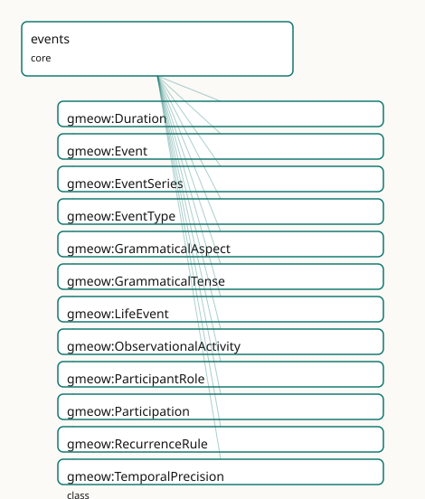

<!-- GENERATED by gmeow ontology-docs. DO NOT EDIT. -->

# GMEOW Events Module

- **IRI:** <https://blackcatinformatics.ca/gmeow/slices/events>
- **Tier:** core
- **[`Group`](../reference/classes/gmeow-Group.md):** core

## What This Slice Covers

This slice owns 159 terms and contributes 269 mapping or projection rows. Use it when its terms match the native fact you want to preserve; use the linkage tables to see how those facts leave GMEOW for consumer vocabularies.

## Dependencies

- [`gmeow:slices/documents`](documents.md)
- [`gmeow:slices/kernel`](kernel.md)
- [`gmeow:slices/observations`](observations.md)
- [`gmeow:slices/places`](places.md)
- [`gmeow:slices/provenance`](provenance.md)
- [`gmeow:slices/temporal`](temporal.md)

## Consumers

- [`Participation`](../reference/classes/gmeow-Participation.md) and life events across slices; the calendar slice; provenance activities.

## Local Map



## Examples

### Wedding

- **Source:** [`slices/core/events/examples/wedding.ttl`](https://github.com/Blackcat-Informatics/gmeow-ontology/blob/main/slices/core/events/examples/wedding.ttl)
- **GMEOW terms:** [`gmeow:Event`](../reference/classes/gmeow-Event.md), [`gmeow:Participation`](../reference/classes/gmeow-Participation.md), [`gmeow:Person`](../reference/classes/gmeow-Person.md), [`gmeow:Place`](../reference/classes/gmeow-Place.md), [`gmeow:eventLocation`](../reference/properties/gmeow-eventLocation.md), [`gmeow:eventTemporalFrame`](../reference/properties/gmeow-eventTemporalFrame.md), [`gmeow:eventTime`](../reference/properties/gmeow-eventTime.md), [`gmeow:eventType`](../reference/properties/gmeow-eventType.md), [`gmeow:eventTypeMarriage`](../reference/individuals/gmeow-eventTypeMarriage.md), [`gmeow:hasParticipant`](../reference/properties/gmeow-hasParticipant.md)
- **External prefixes:** `xsd`

```turtle
# SPDX-FileCopyrightText: 2026 Blackcat Informatics® Inc. <paudley@blackcatinformatics.ca>
# SPDX-License-Identifier: CC-BY-4.0
#
# Worked example: an event on the four orthogonal axes . A wedding has a
# TYPE (eventTypeMarriage), a temporal placement carried in an EXPLICIT frame
# (P11: the instant is meaningless without its TemporalFrame), and a LOCATION —
# three independent axes. The fourth axis is participation: most attendees ride
# the flat gmeow:hasParticipant (the 80% case), but the principals and the
# officiant are promoted to reified gmeow:Participation relators so their ROLES
# are recorded — the reify-on-demand idiom shared with NameUsage.
@prefix gmeow: <https://blackcatinformatics.ca/gmeow/> .
@prefix ex:    <https://blackcatinformatics.ca/gmeow/examples/events/> .
@prefix rdfs:  <http://www.w3.org/2000/01/rdf-schema#> .
@prefix xsd:   <http://www.w3.org/2001/XMLSchema#> .

ex:wedding a gmeow:Event ;
    rdfs:label "the marriage of Alex and Sam"@en ;
    gmeow:eventType gmeow:eventTypeMarriage ;
    gmeow:eventTime "2026-06-20T15:00:00Z"^^xsd:dateTime ;
    gmeow:eventTemporalFrame gmeow:temporalFrameUTCGregorian ;
    gmeow:eventLocation ex:chapel ;
    # Flat participation for the witnesses ONLY — no role/period/evidence needed.
    # The principals and the officiant are instead reified below (with roles), so
    # they are deliberately NOT repeated here: flat and reified never overlap.
    gmeow:hasParticipant ex:witnessA , ex:witnessB .

ex:chapel a gmeow:Place ; gmeow:name "Rosewood Chapel"@en .

ex:alex a gmeow:Person ; gmeow:name "Alex Mercer"@en .
ex:sam a gmeow:Person ; gmeow:name "Sam Okonkwo"@en .
ex:officiant a gmeow:Person ; gmeow:name "Rev. Dana Pike"@en .
ex:witnessA a gmeow:Person ; gmeow:name "Jordan Vance"@en .
ex:witnessB a gmeow:Person ; gmeow:name "Priya Raman"@en .

# --- Reified participations: the two principals and the officiant, with roles.
#     A withdrawn or disputed role would coexist as another Participation
#     (displayable false, or standpoint-indexed) — never overwritten (P9/P10).
ex:partAlex a gmeow:Participation ;
    gmeow:participationEvent ex:wedding ;
    gmeow:participationParticipant ex:alex ;
    gmeow:participationRole gmeow:roleParticipantPrincipal .

ex:partSam a gmeow:Participation ;
    gmeow:participationEvent ex:wedding ;
    gmeow:participationParticipant ex:sam ;
    gmeow:participationRole gmeow:roleParticipantPrincipal .

ex:partOfficiant a gmeow:Participation ;
    gmeow:participationEvent ex:wedding ;
    gmeow:participationParticipant ex:officiant ;
    gmeow:participationRole gmeow:roleOfficiant .
```

## Terms

### Classes

| Term | Label | Definition |
|---|---|---|
| [`gmeow:Duration`](../reference/classes/gmeow-Duration.md) | Duration | A length of time as a quantity, independent of when it occurs — the running time of an event, a gap, a recurrence period. Carries an [xsd:duration](http://www.w3.org/2001/XMLSchema#duration) via gmeow:dur... |
| [`gmeow:Event`](../reference/classes/gmeow-Event.md) | Event | A temporal occurrence in which entities participate in roles, over possibly fuzzy time, at possibly several locations, asserted by possibly conflicting sources... |
| [`gmeow:EventSeries`](../reference/classes/gmeow-EventSeries.md) | Event Series | A recurrence or schedule that issues a series of concrete [`gmeow:Event`](../reference/classes/gmeow-Event.md) occurrences — a weekly standup, an annual conference. Distinct from any one occurrence; t... |
| [`gmeow:EventType`](../reference/classes/gmeow-EventType.md) | Event Type | The kind of an event — a VALUE, never a [`gmeow:Event`](../reference/classes/gmeow-Event.md) subclass. The set is open; a kind not among the seed individuals is a FRESH [`gmeow:EventType`](../reference/classes/gmeow-EventType.md) individual carr... |
| [`gmeow:GrammaticalAspect`](../reference/classes/gmeow-GrammaticalAspect.md) | Grammatical Aspect | The grammatical aspect of an event mention in text — a VALUE vocabulary for ISO-TimeML interoperability (perfective / progressive / perfective-progressive / no... |
| [`gmeow:GrammaticalTense`](../reference/classes/gmeow-GrammaticalTense.md) | Grammatical Tense | The grammatical tense of an event mention in text — a VALUE vocabulary for ISO-TimeML interoperability (past / present / future / none). Describes the linguist... |
| [`gmeow:LifeEvent`](../reference/classes/gmeow-LifeEvent.md) | Life Event | An event in the life of a person or family — a birth, death, marriage, christening, name change, and so on — to which sources and confidence can be attached. A... |
| [`gmeow:ObservationalActivity`](../reference/classes/gmeow-ObservationalActivity.md) | Observational Activity | An activity whose primary purpose is to produce observations — a scientific survey, census, archaeological excavation, clinical trial, code review, audit, or a... |
| [`gmeow:ParticipantRole`](../reference/classes/gmeow-ParticipantRole.md) | Participant Role | The role an entity plays in an event — a VALUE, never a participation subproperty. The set is open; a role not among the seeds is a FRESH [`gmeow:ParticipantRole`](../reference/classes/gmeow-ParticipantRole.md)... |
| [`gmeow:Participation`](../reference/classes/gmeow-Participation.md) | Participation | A reified participation of an entity in an event, in a role, over a period, on some evidence — the same relator idiom as [`gmeow:NameUsage`](../reference/classes/gmeow-NameUsage.md). Mint one Participatio... |
| [`gmeow:RecurrenceRule`](../reference/classes/gmeow-RecurrenceRule.md) | Recurrence Rule | A rule by which a [`gmeow:EventSeries`](../reference/classes/gmeow-EventSeries.md) repeats — weekly, every-first-Monday, annually. Carries an RFC 5545 RRULE string via [`gmeow:recurrenceRuleText`](../reference/properties/gmeow-recurrenceRuleText.md). (= ISO-TimeM... |
| [`gmeow:TemporalPrecision`](../reference/classes/gmeow-TemporalPrecision.md) | Temporal Precision | The granularity to which an event's time is known — day, month, year, decade, or circa. A value carried by [`gmeow:temporalPrecision`](../reference/properties/gmeow-temporalPrecision.md); pairs with gmeow:earliestSt... |

### Properties

| Term | Label | Definition |
|---|---|---|
| [`gmeow:after`](../reference/properties/gmeow-after.md) | after | Allen AFTER: this event begins strictly after the related event ends; the transitive inverse of [`gmeow:before`](../reference/properties/gmeow-before.md). (= [time:intervalAfter](http://www.w3.org/2006/time#intervalAfter); TimeML AFTER; TEO after.) |
| [`gmeow:before`](../reference/properties/gmeow-before.md) | before | Allen BEFORE: this event ends strictly before the related event begins (a gap between them). Transitive. Inverse of [`gmeow:after`](../reference/properties/gmeow-after.md). (= [time:intervalBefore](http://www.w3.org/2006/time#intervalBefore) over th... |
| [`gmeow:coincidesWith`](../reference/properties/gmeow-coincidesWith.md) | coincides with | Allen EQUALS: this event and the related event share the same temporal extent (co-temporal). Symmetric and transitive. Asserts TEMPORAL simultaneity only, neve... |
| [`gmeow:contains`](../reference/properties/gmeow-contains.md) | temporally contains | Allen CONTAINS: this event's extent strictly contains the related event's extent; the transitive inverse of [`gmeow:during`](../reference/properties/gmeow-during.md). A TEMPORAL relation only — not spatia... |
| [`gmeow:durationValue`](../reference/properties/gmeow-durationValue.md) | duration value | The length of a [`gmeow:Duration`](../reference/classes/gmeow-Duration.md) as an [xsd:duration](http://www.w3.org/2001/XMLSchema#duration) literal (ISO 8601, e.g. P1Y2M / PT3H). DL-clean; the TEO hasNormalizedDuration 0Y0M0W0D0H0m0s string is a pro... |
| [`gmeow:during`](../reference/properties/gmeow-during.md) | during | Allen DURING: this event's extent falls strictly within the related event's extent (both endpoints interior). Transitive. Inverse of [`gmeow:contains`](../reference/properties/gmeow-contains.md). Distinct f... |
| [`gmeow:earliestStart`](../reference/properties/gmeow-earliestStart.md) | earliest start | The earliest instant at which an event could have started — the lower bound of a fuzzy / approximate date ([xsd:dateTime](http://www.w3.org/2001/XMLSchema#dateTime)). Pairs with [`gmeow:latestEnd`](../reference/properties/gmeow-latestEnd.md) and a gmeo... |
| [`gmeow:eventAspect`](../reference/properties/gmeow-eventAspect.md) | event aspect | The grammatical aspect of a textual mention of the event (ISO-TimeML EVENT @aspect). Annotation-layer only; orthogonal to the event's actual temporal placement. |
| [`gmeow:eventFromLocation`](../reference/properties/gmeow-eventFromLocation.md) | event from-location | The origin of a movement event — where a migration, move, journey, or relocation departed from. A specialisation of [`gmeow:eventLocation`](../reference/properties/gmeow-eventLocation.md) (the origin IS a locati... |
| [`gmeow:eventInterval`](../reference/properties/gmeow-eventInterval.md) | event interval | The crisp, known time interval over which an event occurred (reuses the temporal module's [`gmeow:TimeInterval`](../reference/classes/gmeow-TimeInterval.md)). For a point-like occurrence use [`gmeow:eventTime`](../reference/properties/gmeow-eventTime.md);... |
| [`gmeow:eventLocation`](../reference/properties/gmeow-eventLocation.md) | event location | A location at which an event occurred — a geographic [`gmeow:Place`](../reference/classes/gmeow-Place.md), a [`gmeow:VirtualLocation`](../reference/classes/gmeow-VirtualLocation.md), or any other [`gmeow:Location`](../reference/classes/gmeow-Location.md) (the full superset). Non-functional: an... |
| [`gmeow:eventObservation`](../reference/properties/gmeow-eventObservation.md) | event observation | An observation made during or about an event. Inverse of [`gmeow:observationEvent`](../reference/properties/gmeow-observationEvent.md) (observations module). Non-functional: an event may have many observations, and... |
| [`gmeow:eventSpacetime`](../reference/properties/gmeow-eventSpacetime.md) | event spacetime | A spacetime slice of an event, expressed as a [`gmeow:LocationState`](../reference/classes/gmeow-LocationState.md) that carries location, time interval or instant, pose, and optional velocity relative to an e... |
| [`gmeow:eventTemporalFrame`](../reference/properties/gmeow-eventTemporalFrame.md) | event temporal frame | The temporal frame in which the event's date/interval is expressed — explicit for non-default frames ([Principle 11](https://github.com/Blackcat-Informatics/gmeow-ontology/blob/main/CONSTITUTION.md#principle-11)). |
| [`gmeow:eventTense`](../reference/properties/gmeow-eventTense.md) | event tense | The grammatical tense of a textual mention of the event (ISO-TimeML EVENT @tense). Annotation-layer only; MUST NOT be inferred from, or used to infer, the even... |
| [`gmeow:eventTime`](../reference/properties/gmeow-eventTime.md) | event time | The instant at which a point-like event occurred ([xsd:dateTime](http://www.w3.org/2001/XMLSchema#dateTime) — DL-clean, never [xsd:date](http://www.w3.org/2001/XMLSchema#date)). Replaces the former free-text gmeow:eventDate. Non-functional: comp... |
| [`gmeow:eventToLocation`](../reference/properties/gmeow-eventToLocation.md) | event to-location | The destination of a movement event — where a migration, move, journey, or relocation arrived. A specialisation of [`gmeow:eventLocation`](../reference/properties/gmeow-eventLocation.md), pairing with gmeow:even... |
| [`gmeow:eventTrajectory`](../reference/properties/gmeow-eventTrajectory.md) | event trajectory | The trajectory of a moving event — a parade, march, migration, or procession — describing its continuous space-time path. Reuses the [`gmeow:Trajectory`](../reference/classes/gmeow-Trajectory.md) facility... |
| [`gmeow:eventType`](../reference/properties/gmeow-eventType.md) | event type | The kind(s) of an event, drawn from the open [`gmeow:EventType`](../reference/classes/gmeow-EventType.md) value vocabulary. Non-functional: an occurrence may carry several types (a wedding that is also a... |
| [`gmeow:finishedBy`](../reference/properties/gmeow-finishedBy.md) | finished by | Allen FINISHED-BY: inverse of [`gmeow:finishes`](../reference/properties/gmeow-finishes.md). (= [time:intervalFinishedBy](http://www.w3.org/2006/time#intervalFinishedBy); TimeML ENDED_BY; TEO finishedBy.) |
| [`gmeow:finishes`](../reference/properties/gmeow-finishes.md) | finishes | Allen FINISHES: this event and the related event end together, and this one began later (it is a final sub-span). NOT transitive. Inverse of [`gmeow:finishedBy`](../reference/properties/gmeow-finishedBy.md).... |
| [`gmeow:generatedObservation`](../reference/properties/gmeow-generatedObservation.md) | generated observation | Relates an observational activity to an observation it generated as a first-class output. The inverse direction (Observation → Activity) is covered by the gene... |
| [`gmeow:hasDuration`](../reference/properties/gmeow-hasDuration.md) | has duration | Relates an event to its duration (a [`gmeow:Duration`](../reference/classes/gmeow-Duration.md)). Distinct from [`gmeow:eventInterval`](../reference/properties/gmeow-eventInterval.md) (which anchors the event in time); a duration is a length only. |
| [`gmeow:hasParticipant`](../reference/properties/gmeow-hasParticipant.md) | has participant | An agent that took part in an event — the flat 80%-case shortcut. Non-functional. Promote to a [`gmeow:Participation`](../reference/classes/gmeow-Participation.md) node when the role, period, confidence, or e... |
| [`gmeow:hasRecurrenceRule`](../reference/properties/gmeow-hasRecurrenceRule.md) | has recurrence rule | Relates an event series to the recurrence rule by which it repeats. |
| [`gmeow:hasSubEvent`](../reference/properties/gmeow-hasSubEvent.md) | has sub-event | Relates an event to a constituent sub-event; the transitive inverse of [`gmeow:subEventOf`](../reference/properties/gmeow-subEventOf.md). |
| [`gmeow:latestEnd`](../reference/properties/gmeow-latestEnd.md) | latest end | The latest instant by which an event must have ended — the upper bound of a fuzzy / approximate date ([xsd:dateTime](http://www.w3.org/2001/XMLSchema#dateTime)). Pairs with [`gmeow:earliestStart`](../reference/properties/gmeow-earliestStart.md) and a gmeow... |
| [`gmeow:meets`](../reference/properties/gmeow-meets.md) | meets | Allen MEETS: this event ends exactly when the related event begins (no gap, no overlap). NOT transitive. Inverse of [`gmeow:metBy`](../reference/properties/gmeow-metBy.md). (= [time:intervalMeets](http://www.w3.org/2006/time#intervalMeets); TimeML... |
| [`gmeow:metBy`](../reference/properties/gmeow-metBy.md) | met by | Allen MET-BY: this event begins exactly when the related event ends; inverse of [`gmeow:meets`](../reference/properties/gmeow-meets.md). (= [time:intervalMetBy](http://www.w3.org/2006/time#intervalMetBy); TimeML IAFTER; TEO metBy.) |
| [`gmeow:occurrenceOfSeries`](../reference/properties/gmeow-occurrenceOfSeries.md) | occurrence of series | Relates a concrete event occurrence to the series that issued it; the inverse of [`gmeow:seriesOccurrence`](../reference/properties/gmeow-seriesOccurrence.md). |
| [`gmeow:overlappedBy`](../reference/properties/gmeow-overlappedBy.md) | overlapped by | Allen OVERLAPPED-BY: inverse of [`gmeow:overlaps`](../reference/properties/gmeow-overlaps.md). (= [time:intervalOverlappedBy](http://www.w3.org/2006/time#intervalOverlappedBy); TEO overlappedBy.) |
| [`gmeow:overlaps`](../reference/properties/gmeow-overlaps.md) | overlaps | Allen OVERLAPS: this event begins before, and ends during, the related event (their extents partially overlap). NOT transitive. Inverse of [`gmeow:overlappedBy`](../reference/properties/gmeow-overlappedBy.md).... |
| [`gmeow:participationEvent`](../reference/properties/gmeow-participationEvent.md) | participation event | The event a participation is part of (functional — one event per participation). |
| [`gmeow:participationInterval`](../reference/properties/gmeow-participationInterval.md) | participation interval | The time interval over which the participation held. (A relator carries its period this way — matching usageInterval / relationshipInterval — rather than via d... |
| [`gmeow:participationParticipant`](../reference/properties/gmeow-participationParticipant.md) | participation participant | The entity that took part in the event in this participation. Range is [`gmeow:Entity`](../reference/classes/gmeow-Entity.md) (not only Agent) to admit non-agent participants — a document signed, a pla... |
| [`gmeow:participationRole`](../reference/properties/gmeow-participationRole.md) | participation role | The role(s) the participant played, drawn from the open [`gmeow:ParticipantRole`](../reference/classes/gmeow-ParticipantRole.md) value vocabulary. NON-FUNCTIONAL — mirroring [`gmeow:eventType`](../reference/properties/gmeow-eventType.md): a participation may... |
| [`gmeow:recurrenceRuleText`](../reference/properties/gmeow-recurrenceRuleText.md) | recurrence rule text | The recurrence rule as an RFC 5545 RRULE string (e.g. FREQ=WEEKLY;BYDAY=MO). Projected directly to iCalendar RRULE; a SET-typed TIMEX3 in ISO-TimeML. |
| [`gmeow:seriesOccurrence`](../reference/properties/gmeow-seriesOccurrence.md) | series occurrence | Relates an event series to one of the concrete event occurrences it issues. |
| [`gmeow:startedBy`](../reference/properties/gmeow-startedBy.md) | started by | Allen STARTED-BY: inverse of [`gmeow:starts`](../reference/properties/gmeow-starts.md). (= [time:intervalStartedBy](http://www.w3.org/2006/time#intervalStartedBy); TimeML BEGUN_BY; TEO startedBy.) |
| [`gmeow:starts`](../reference/properties/gmeow-starts.md) | starts | Allen STARTS: this event and the related event begin together, and this one ends first (it is an initial sub-span). NOT transitive. Inverse of [`gmeow:startedBy`](../reference/properties/gmeow-startedBy.md).... |
| [`gmeow:subEventOf`](../reference/properties/gmeow-subEventOf.md) | sub-event of | Relates an event to a larger event it is part of — a talk within a session within a conference. Transitive: a part of a part is a part ([CIDOC-CRM](../external/ontologies.md#target-crm) P9 consists o... |
| [`gmeow:temporalCoverage`](../reference/properties/gmeow-temporalCoverage.md) | temporal coverage | The temporal extent or scope of a creative work. |
| [`gmeow:temporalPrecision`](../reference/properties/gmeow-temporalPrecision.md) | temporal precision | The granularity to which an event's time is known — a [`gmeow:TemporalPrecision`](../reference/classes/gmeow-TemporalPrecision.md) value (day / month / year / decade / circa). Makes the determinacy of a date expl... |

### Individuals

| Term | Label | Definition |
|---|---|---|
| [`gmeow:aspectNone`](../reference/individuals/gmeow-aspectNone.md) | none | ISO-TimeML aspect NONE. |
| [`gmeow:aspectPerfective`](../reference/individuals/gmeow-aspectPerfective.md) | perfective | ISO-TimeML aspect PERFECTIVE. |
| [`gmeow:aspectPerfectiveProgressive`](../reference/individuals/gmeow-aspectPerfectiveProgressive.md) | perfective-progressive | ISO-TimeML aspect PERFECTIVE_PROGRESSIVE. |
| [`gmeow:aspectProgressive`](../reference/individuals/gmeow-aspectProgressive.md) | progressive | ISO-TimeML aspect PROGRESSIVE. |
| [`gmeow:eventTypeAcquisition`](../reference/individuals/gmeow-eventTypeAcquisition.md) | acquisition | The event of one organization acquiring control of another organization. |
| [`gmeow:eventTypeAdoption`](../reference/individuals/gmeow-eventTypeAdoption.md) | adoption | The adoption of a person. |
| [`gmeow:eventTypeAnnulment`](../reference/individuals/gmeow-eventTypeAnnulment.md) | annulment | The annulment of a marriage. |
| [`gmeow:eventTypeAudit`](../reference/individuals/gmeow-eventTypeAudit.md) | audit | A formal audit or inspection — an observational activity that produces evaluative observations. |
| [`gmeow:eventTypeBaptism`](../reference/individuals/gmeow-eventTypeBaptism.md) | baptism | A baptism. |
| [`gmeow:eventTypeBarMitzvah`](../reference/individuals/gmeow-eventTypeBarMitzvah.md) | bar mitzvah | A bar mitzvah. |
| [`gmeow:eventTypeBatMitzvah`](../reference/individuals/gmeow-eventTypeBatMitzvah.md) | bat mitzvah | A bat mitzvah. |
| [`gmeow:eventTypeBirth`](../reference/individuals/gmeow-eventTypeBirth.md) | birth | The event of a person being born. |
| [`gmeow:eventTypeBurial`](../reference/individuals/gmeow-eventTypeBurial.md) | burial | The burial of a deceased person. |
| [`gmeow:eventTypeCensus`](../reference/individuals/gmeow-eventTypeCensus.md) | census | A person's enumeration in a census. |
| [`gmeow:eventTypeCensusActivity`](../reference/individuals/gmeow-eventTypeCensusActivity.md) | census activity | A census as a systematic data-collection activity — an observational activity that produces population observations. Distinguished from [`gmeow:eventTypeCensus`](../reference/individuals/gmeow-eventTypeCensus.md),... |
| [`gmeow:eventTypeChristening`](../reference/individuals/gmeow-eventTypeChristening.md) | christening | A christening or naming ceremony. |
| [`gmeow:eventTypeClinicalTrial`](../reference/individuals/gmeow-eventTypeClinicalTrial.md) | clinical trial | A clinical trial or structured medical investigation — an observational activity that produces health-outcome observations. |
| [`gmeow:eventTypeCodeReview`](../reference/individuals/gmeow-eventTypeCodeReview.md) | code review | The event of reviewing code changes for quality, correctness, and policy compliance. |
| [`gmeow:eventTypeCommit`](../reference/individuals/gmeow-eventTypeCommit.md) | commit | The event of recording a version-control commit — a content-addressed snapshot of a codebase. |
| [`gmeow:eventTypeConcert`](../reference/individuals/gmeow-eventTypeConcert.md) | concert | A public musical performance, typically before an audience. |
| [`gmeow:eventTypeConfirmation`](../reference/individuals/gmeow-eventTypeConfirmation.md) | confirmation | A religious confirmation. |
| [`gmeow:eventTypeCreation`](../reference/individuals/gmeow-eventTypeCreation.md) | creation | The event of an entity coming into existence — the universal form of birth (person), founding (organization), minting (currency), or realization (reference fra... |
| [`gmeow:eventTypeCremation`](../reference/individuals/gmeow-eventTypeCremation.md) | cremation | The cremation of a deceased person. |
| [`gmeow:eventTypeDJSet`](../reference/individuals/gmeow-eventTypeDJSet.md) | DJ set | A performance in which a DJ selects and plays recorded music. |
| [`gmeow:eventTypeDeath`](../reference/individuals/gmeow-eventTypeDeath.md) | death | The event of a person's death. |
| [`gmeow:eventTypeDestruction`](../reference/individuals/gmeow-eventTypeDestruction.md) | destruction | The event of an entity ceasing to exist — the universal form of death (person), dissolution (organization), destruction (place), or retirement (frame, software... |
| [`gmeow:eventTypeDissolution`](../reference/individuals/gmeow-eventTypeDissolution.md) | dissolution | The formal dissolution of a structured entity — an organization, agreement, polity, or marriage. Distinct from general destruction in carrying legal or procedu... |
| [`gmeow:eventTypeDivorce`](../reference/individuals/gmeow-eventTypeDivorce.md) | divorce | The legal dissolution of a marriage. |
| [`gmeow:eventTypeEmigration`](../reference/individuals/gmeow-eventTypeEmigration.md) | emigration | A person's emigration from a country. |
| [`gmeow:eventTypeEngagement`](../reference/individuals/gmeow-eventTypeEngagement.md) | engagement | A betrothal or engagement to marry. |
| [`gmeow:eventTypeExcavation`](../reference/individuals/gmeow-eventTypeExcavation.md) | excavation | An archaeological excavation — a structured observational activity that produces stratigraphic and spatial observations. |
| [`gmeow:eventTypeExpressionCreation`](../reference/individuals/gmeow-eventTypeExpressionCreation.md) | expression creation | The event of realizing a work in a specific language, script, notation, or arrangement — the act that brings a [`gmeow:Expression`](../reference/classes/gmeow-Expression.md) into existence. ≈ LRMoo F28 Exp... |
| [`gmeow:eventTypeFirstCommunion`](../reference/individuals/gmeow-eventTypeFirstCommunion.md) | first communion | A first communion. |
| [`gmeow:eventTypeFuneral`](../reference/individuals/gmeow-eventTypeFuneral.md) | funeral | A funeral or memorial service. |
| [`gmeow:eventTypeGraduation`](../reference/individuals/gmeow-eventTypeGraduation.md) | graduation | Graduation from an educational program. |
| [`gmeow:eventTypeHiring`](../reference/individuals/gmeow-eventTypeHiring.md) | hiring | The event of an agent beginning employment with an organization. |
| [`gmeow:eventTypeImageAnnotation`](../reference/individuals/gmeow-eventTypeImageAnnotation.md) | image annotation | The act of adding regions, labels, scene-graph edges, or other structured metadata to an image. Produces [`gmeow:ImageRegion`](../reference/classes/gmeow-ImageRegion.md) and [`gmeow:SceneGraphEdge`](../reference/classes/gmeow-SceneGraphEdge.md) instances. |
| [`gmeow:eventTypeImageCapture`](../reference/individuals/gmeow-eventTypeImageCapture.md) | image capture | The act of capturing a still image — photography, screenshot, or frame grab. Brings a [`gmeow:MediaObject`](../reference/classes/gmeow-MediaObject.md) into existence. ≈ [CIDOC-CRM](../external/ontologies.md#target-crm) E12 Production scoped to a... |
| [`gmeow:eventTypeImageProcessing`](../reference/individuals/gmeow-eventTypeImageProcessing.md) | image processing | The act of editing, filtering, colour-correcting, or otherwise transforming a digital image. The output is a derivative [`gmeow:MediaObject`](../reference/classes/gmeow-MediaObject.md) linked by gmeow:wasDe... |
| [`gmeow:eventTypeImageScanning`](../reference/individuals/gmeow-eventTypeImageScanning.md) | image scanning | The act of digitizing a physical photograph, document, or artwork via scanner or camera reprography. Produces a [`gmeow:MediaObject`](../reference/classes/gmeow-MediaObject.md) from a physical source. |
| [`gmeow:eventTypeImmigration`](../reference/individuals/gmeow-eventTypeImmigration.md) | immigration | A person's immigration into a country. |
| [`gmeow:eventTypeJamSession`](../reference/individuals/gmeow-eventTypeJamSession.md) | jam session | An informal musical performance, often improvisatory, by multiple participants. |
| [`gmeow:eventTypeManifestationProduction`](../reference/individuals/gmeow-eventTypeManifestationProduction.md) | manifestation production | The event of producing a concrete edition, format, or release — the act that brings a [`gmeow:Manifestation`](../reference/classes/gmeow-Manifestation.md) into existence (printing, pressing, digital publishin... |
| [`gmeow:eventTypeMarriage`](../reference/individuals/gmeow-eventTypeMarriage.md) | marriage | The event of two persons entering into marriage. |
| [`gmeow:eventTypeMerge`](../reference/individuals/gmeow-eventTypeMerge.md) | merge | The event of merging one branch of development into another. |
| [`gmeow:eventTypeMerger`](../reference/individuals/gmeow-eventTypeMerger.md) | merger | The event of two or more organizations combining into one or more successor organizations. |
| [`gmeow:eventTypeMigration`](../reference/individuals/gmeow-eventTypeMigration.md) | migration | A relocation of people from one place to another — a family's move, an internal migration, or a multi-generational flow. The general movement event ([schema:Mov...](https://schema.org/Mov...) |
| [`gmeow:eventTypeMilitaryService`](../reference/individuals/gmeow-eventTypeMilitaryService.md) | military service | A period of military service. |
| [`gmeow:eventTypeMusicalPerformance`](../reference/individuals/gmeow-eventTypeMusicalPerformance.md) | musical performance | A performance of music — the central event type for the music extension. Co-typed with more specific values such as concert, recording session, or take as need... |
| [`gmeow:eventTypeNameChange`](../reference/individuals/gmeow-eventTypeNameChange.md) | name change | A formal change of name. |
| [`gmeow:eventTypeNaturalization`](../reference/individuals/gmeow-eventTypeNaturalization.md) | naturalization | The grant of citizenship by naturalization. |
| [`gmeow:eventTypeOrdination`](../reference/individuals/gmeow-eventTypeOrdination.md) | ordination | Ordination into religious office. |
| [`gmeow:eventTypeOverdub`](../reference/individuals/gmeow-eventTypeOverdub.md) | overdub | A take recorded over or alongside existing recorded material. |
| [`gmeow:eventTypeProbate`](../reference/individuals/gmeow-eventTypeProbate.md) | probate | The probate of an estate. |
| [`gmeow:eventTypePromotion`](../reference/individuals/gmeow-eventTypePromotion.md) | promotion | The event of an agent advancing in rank, role, or compensation within an organization. |
| [`gmeow:eventTypePush`](../reference/individuals/gmeow-eventTypePush.md) | push | The event of pushing commits to a remote repository. |
| [`gmeow:eventTypeRecordingSession`](../reference/individuals/gmeow-eventTypeRecordingSession.md) | recording session | A session at which one or more recordings are captured. |
| [`gmeow:eventTypeRehearsal`](../reference/individuals/gmeow-eventTypeRehearsal.md) | rehearsal | A practice or preparation event for a musical performance. |
| [`gmeow:eventTypeRelease`](../reference/individuals/gmeow-eventTypeRelease.md) | release | The event of publishing a software release — producing a versioned product with associated artifacts. |
| [`gmeow:eventTypeRename`](../reference/individuals/gmeow-eventTypeRename.md) | rename | The event of an organization changing its name, while remaining the same legal entity. Reuses the names module for the new name plus a temporal tenure (e.g. Fa... |
| [`gmeow:eventTypeResidence`](../reference/individuals/gmeow-eventTypeResidence.md) | residence | A person's residence at a place over a period. |
| [`gmeow:eventTypeResignation`](../reference/individuals/gmeow-eventTypeResignation.md) | resignation | The event of an agent voluntarily ending employment. |
| [`gmeow:eventTypeRetirement`](../reference/individuals/gmeow-eventTypeRetirement.md) | retirement | Retirement from working life. |
| [`gmeow:eventTypeSeparation`](../reference/individuals/gmeow-eventTypeSeparation.md) | separation | A legal or informal marital separation. |
| [`gmeow:eventTypeSoundcheck`](../reference/individuals/gmeow-eventTypeSoundcheck.md) | soundcheck | A pre-performance event for checking sound and equipment. |
| [`gmeow:eventTypeSpinOff`](../reference/individuals/gmeow-eventTypeSpinOff.md) | spin-off | The event of a part of an organization breaking away to form a new, independent organization. |
| [`gmeow:eventTypeSplit`](../reference/individuals/gmeow-eventTypeSplit.md) | split | The event of one organization dividing into two or more successor organizations. |
| [`gmeow:eventTypeSupersession`](../reference/individuals/gmeow-eventTypeSupersession.md) | supersession | The event of one entity replacing another — a transformation, merger, or reorganization where a predecessor entity ceases and a successor entity begins (e.g. S... |
| [`gmeow:eventTypeSurvey`](../reference/individuals/gmeow-eventTypeSurvey.md) | survey | A systematic survey or data-collection activity whose purpose is to produce observations. |
| [`gmeow:eventTypeTake`](../reference/individuals/gmeow-eventTypeTake.md) | take | A single recorded attempt or capture during a recording session. |
| [`gmeow:eventTypeTermination`](../reference/individuals/gmeow-eventTypeTermination.md) | termination | The event of an agent's employment being ended by the organization. |
| [`gmeow:eventTypeTransfer`](../reference/individuals/gmeow-eventTypeTransfer.md) | transfer | The event of an agent moving from one organizational unit or location to another. |
| [`gmeow:eventTypeTransmission`](../reference/individuals/gmeow-eventTypeTransmission.md) | transmission | An oral-tradition teaching event in which musical knowledge is passed from one agent to another (see). |
| [`gmeow:eventTypeWill`](../reference/individuals/gmeow-eventTypeWill.md) | will | The making of a will. |
| [`gmeow:eventTypeWorkConception`](../reference/individuals/gmeow-eventTypeWorkConception.md) | work conception | The event of conceiving an abstract intellectual or artistic work — the creative act that brings a [`gmeow:Work`](../reference/classes/gmeow-Work.md) into existence. ≈ LRMoo F27 / [CIDOC-CRM](../external/ontologies.md#target-crm) E65 Creat... |
| [`gmeow:precisionCirca`](../reference/individuals/gmeow-precisionCirca.md) | circa | The event's time is approximate (circa) — bounded by [`gmeow:earliestStart`](../reference/properties/gmeow-earliestStart.md) / [`gmeow:latestEnd`](../reference/properties/gmeow-latestEnd.md). |
| [`gmeow:precisionDay`](../reference/individuals/gmeow-precisionDay.md) | day | The event's time is known to the day. |
| [`gmeow:precisionDecade`](../reference/individuals/gmeow-precisionDecade.md) | decade | The event's time is known only to the decade. |
| [`gmeow:precisionMonth`](../reference/individuals/gmeow-precisionMonth.md) | month | The event's time is known to the month. |
| [`gmeow:precisionYear`](../reference/individuals/gmeow-precisionYear.md) | year | The event's time is known to the year. |
| [`gmeow:roleAccompanist`](../reference/individuals/gmeow-roleAccompanist.md) | accompanist | A performer who accompanies a soloist or ensemble. |
| [`gmeow:roleAgent`](../reference/individuals/gmeow-roleAgent.md) | agent | An agent that carried out or caused the event (the active party). |
| [`gmeow:roleAttendee`](../reference/individuals/gmeow-roleAttendee.md) | attendee | An agent who attended the event. |
| [`gmeow:roleBeneficiary`](../reference/individuals/gmeow-roleBeneficiary.md) | beneficiary | An entity that benefited from the event. |
| [`gmeow:roleConductor`](../reference/individuals/gmeow-roleConductor.md) | conductor | An agent who conducted a musical performance. Also a ContributionRole (declared in creative-works.ttl) — one concept, one IRI ([Principle 5](https://github.com/Blackcat-Informatics/gmeow-ontology/blob/main/CONSTITUTION.md#principle-5)). |
| [`gmeow:roleEmployee`](../reference/individuals/gmeow-roleEmployee.md) | employee | The agent employed in an employment event. |
| [`gmeow:roleEmployer`](../reference/individuals/gmeow-roleEmployer.md) | employer | The organization employing in an employment event. |
| [`gmeow:roleEnsembleMember`](../reference/individuals/gmeow-roleEnsembleMember.md) | ensemble member | A performer participating as a member of a musical ensemble. |
| [`gmeow:roleImproviser`](../reference/individuals/gmeow-roleImproviser.md) | improviser | A performer whose participation is primarily improvisatory. |
| [`gmeow:roleLearner`](../reference/individuals/gmeow-roleLearner.md) | learner | An agent who receives musical knowledge in an oral-tradition teaching event (see). |
| [`gmeow:roleOfficiant`](../reference/individuals/gmeow-roleOfficiant.md) | officiant | A person who officiated at the event. Generalizes the former gmeow:hasOfficiant. |
| [`gmeow:roleOrganizer`](../reference/individuals/gmeow-roleOrganizer.md) | organizer | An agent that organized or convened the event. |
| [`gmeow:roleParticipantPrincipal`](../reference/individuals/gmeow-roleParticipantPrincipal.md) | principal / subject | The entity an event is principally about (e.g. the child in a birth, the deceased in a death). Generalizes the former gmeow:hasPrincipal. |
| [`gmeow:rolePerformer`](../reference/individuals/gmeow-rolePerformer.md) | performer | An agent who performed at the event. Also a ContributionRole (declared in creative-works.ttl) — one concept, one IRI ([Principle 5](https://github.com/Blackcat-Informatics/gmeow-ontology/blob/main/CONSTITUTION.md#principle-5)). |
| [`gmeow:roleProducer`](../reference/individuals/gmeow-roleProducer.md) | producer | An agent who produced a performance or recording. Also a ContributionRole (declared in creative-works.ttl) — one concept, one IRI ([Principle 5](https://github.com/Blackcat-Informatics/gmeow-ontology/blob/main/CONSTITUTION.md#principle-5)). |
| [`gmeow:roleSessionMusician`](../reference/individuals/gmeow-roleSessionMusician.md) | session musician | A musician hired to perform in a recording session. |
| [`gmeow:roleSoloist`](../reference/individuals/gmeow-roleSoloist.md) | soloist | A performer featured as a soloist in a musical performance. |
| [`gmeow:roleTransmitter`](../reference/individuals/gmeow-roleTransmitter.md) | transmitter | An agent who transmits musical knowledge in an oral-tradition teaching event (see). |
| [`gmeow:roleVictim`](../reference/individuals/gmeow-roleVictim.md) | victim | An entity harmed by the event — distinct from, and never inferred from, any other role. |
| [`gmeow:roleWitness`](../reference/individuals/gmeow-roleWitness.md) | witness | A person who witnessed the event. Generalizes the former gmeow:hasWitness. |
| [`gmeow:tenseFuture`](../reference/individuals/gmeow-tenseFuture.md) | future | ISO-TimeML tense FUTURE. |
| [`gmeow:tenseNone`](../reference/individuals/gmeow-tenseNone.md) | none | ISO-TimeML tense NONE (untensed / nominal mention). |
| [`gmeow:tensePast`](../reference/individuals/gmeow-tensePast.md) | past | ISO-TimeML tense PAST. |
| [`gmeow:tensePresent`](../reference/individuals/gmeow-tensePresent.md) | present | ISO-TimeML tense PRESENT. |

## Linkages

- **Rows:** 269
- **Projection profiles:** `crmarchaeo`, `dcterms`, `gedcom`, `ical`, `iptc`, `oai_dc`, `owl-time`, `prov`, `schema-org`, `schema-org-schedule`, `vcard`
- **External vocabularies:** `bbc`, `bio`, `crm`, `crmarc`, `crmgeo`, `dc`, `dcmitype`, `dcterms`, `gedcom`, `gx`, `ical`, `iptc`, `lode`, `lrmoo`, `obi`, `org`, `prov`, `qb`, `rdf`, `schema`, `sem`, `teo`, `time`, `vcard`, `wd`, `wdt`

| Source | Kind | Profile | Predicate/Relation | Target | Evidence |
|---|---|---|---|---|---|
| [`gmeow:Duration`](../reference/classes/gmeow-Duration.md) | equivalence | `-` | [skos:closeMatch](http://www.w3.org/2004/02/skos/core#closeMatch) | [schema:Duration](https://schema.org/Duration) | `gmeow-events.sssom.tsv`; `gmeow:eqEvents119`; confidence 0.85 |
| [`gmeow:Duration`](../reference/classes/gmeow-Duration.md) | equivalence | `-` | [skos:closeMatch](http://www.w3.org/2004/02/skos/core#closeMatch) | [teo:Duration](https://sbmi.uth.edu/bsdi/TEO_1.0.0.owl#Duration) | `gmeow-events.sssom.tsv`; `gmeow:eqEvents120`; confidence 0.85 |
| [`gmeow:Duration`](../reference/classes/gmeow-Duration.md) | equivalence | `-` | [skos:closeMatch](http://www.w3.org/2004/02/skos/core#closeMatch) | [time:Duration](http://www.w3.org/2006/time#Duration) | `gmeow-events.sssom.tsv`; `gmeow:eqEvents118`; confidence 0.85 |
| [`gmeow:Event`](../reference/classes/gmeow-Event.md) | equivalence | `-` | [skos:relatedMatch](http://www.w3.org/2004/02/skos/core#relatedMatch) | [bbc:NewsEvent](http://www.bbc.co.uk/ontologies/news/NewsEvent) | `gmeow-standpoint.sssom.tsv`; `gmeow:eqStandpoint019`; confidence 0.45 |
| [`gmeow:Event`](../reference/classes/gmeow-Event.md) | equivalence | `-` | [skos:closeMatch](http://www.w3.org/2004/02/skos/core#closeMatch) | [crm:E5_Event](http://www.cidoc-crm.org/cidoc-crm/E5_Event) | `gmeow-events.sssom.tsv`; `gmeow:eqEvents002`; confidence 0.9 |
| [`gmeow:Event`](../reference/classes/gmeow-Event.md) | equivalence | `-` | [skos:closeMatch](http://www.w3.org/2004/02/skos/core#closeMatch) | [dcmitype:Event](http://purl.org/dc/dcmitype/Event) | `gmeow-dublin-core.sssom.tsv`; `gmeow:eqDcType007`; confidence 0.85 |
| [`gmeow:Event`](../reference/classes/gmeow-Event.md) | equivalence | `-` | [skos:relatedMatch](http://www.w3.org/2004/02/skos/core#relatedMatch) | [ical:Vevent](http://www.w3.org/2002/12/cal/icaltzd#Vevent) | `gmeow-events.sssom.tsv`; `gmeow:eqEvents006`; confidence 0.5 |
| [`gmeow:Event`](../reference/classes/gmeow-Event.md) | equivalence | `-` | [skos:closeMatch](http://www.w3.org/2004/02/skos/core#closeMatch) | [lode:Event](http://linkedevents.org/ontology/Event) | `gmeow-events.sssom.tsv`; `gmeow:eqEvents004`; confidence 0.85 |
| [`gmeow:Event`](../reference/classes/gmeow-Event.md) | equivalence | `-` | [rdfs:subClassOf](http://www.w3.org/2000/01/rdf-schema#subClassOf) | [org:ChangeEvent](http://www.w3.org/ns/org#ChangeEvent) | `gmeow-classes.sssom.tsv`; `gmeow:eqClasses051`; confidence 0.9 |
| [`gmeow:Event`](../reference/classes/gmeow-Event.md) | equivalence | `-` | [skos:relatedMatch](http://www.w3.org/2004/02/skos/core#relatedMatch) | [prov:Activity](http://www.w3.org/ns/prov#Activity) | `gmeow-deception.sssom.tsv`; `gmeow:eqDeception003`; confidence 0.4 |
| [`gmeow:Event`](../reference/classes/gmeow-Event.md) | equivalence | `-` | [skos:relatedMatch](http://www.w3.org/2004/02/skos/core#relatedMatch) | [prov:Activity](http://www.w3.org/ns/prov#Activity) | `gmeow-events.sssom.tsv`; `gmeow:eqEvents003`; confidence 0.5 |
| [`gmeow:Event`](../reference/classes/gmeow-Event.md) | equivalence | `-` | [skos:closeMatch](http://www.w3.org/2004/02/skos/core#closeMatch) | [schema:Event](https://schema.org/Event) | `gmeow-events.sssom.tsv`; `gmeow:eqEvents001`; confidence 0.9 |
| [`gmeow:Event`](../reference/classes/gmeow-Event.md) | equivalence | `-` | [skos:closeMatch](http://www.w3.org/2004/02/skos/core#closeMatch) | [sem:Event](http://semanticweb.cs.vu.nl/2009/11/sem/Event) | `gmeow-events.sssom.tsv`; `gmeow:eqEvents005`; confidence 0.85 |
| [`gmeow:Event`](../reference/classes/gmeow-Event.md) | equivalence | `-` | [skos:relatedMatch](http://www.w3.org/2004/02/skos/core#relatedMatch) | [wd:Q1656682](https://www.wikidata.org/wiki/Q1656682) | `gmeow-events.sssom.tsv`; `gmeow:eqEvents007`; confidence 0.6 |
| [`gmeow:EventSeries`](../reference/classes/gmeow-EventSeries.md) | equivalence | `-` | [skos:closeMatch](http://www.w3.org/2004/02/skos/core#closeMatch) | [schema:EventSeries](https://schema.org/EventSeries) | `gmeow-events.sssom.tsv`; `gmeow:eqEvents010`; confidence 0.85 |
| [`gmeow:LifeEvent`](../reference/classes/gmeow-LifeEvent.md) | equivalence | `-` | [skos:closeMatch](http://www.w3.org/2004/02/skos/core#closeMatch) | [wd:Q2400985](https://www.wikidata.org/wiki/Q2400985) | `gmeow-wikidata.sssom.tsv`; `gmeow:eqWikidata036`; confidence 0.8 |
| [`gmeow:ObservationalActivity`](../reference/classes/gmeow-ObservationalActivity.md) | equivalence | `-` | [skos:closeMatch](http://www.w3.org/2004/02/skos/core#closeMatch) | [crm:E13_Attribute_Assignment](http://www.cidoc-crm.org/cidoc-crm/E13_Attribute_Assignment) | `gmeow-events.sssom.tsv`; `gmeow:eqEvents131`; confidence 0.85 |
| [`gmeow:ObservationalActivity`](../reference/classes/gmeow-ObservationalActivity.md) | equivalence | `-` | [skos:relatedMatch](http://www.w3.org/2004/02/skos/core#relatedMatch) | [crmarc:A1_Excavation_Process_Unit](http://www.cidoc-crm.org/crmarchaeo/A1_Excavation_Process_Unit) | `gmeow-observations.sssom.tsv`; `gmeow:eqObs060`; confidence 0.75 |
| [`gmeow:ObservationalActivity`](../reference/classes/gmeow-ObservationalActivity.md) | equivalence | `-` | [skos:relatedMatch](http://www.w3.org/2004/02/skos/core#relatedMatch) | [iptc:NewsMessage](http://iptc.org/std/NewsML-G2/NewsMessage) | `gmeow-observations.sssom.tsv`; `gmeow:eqObs070`; confidence 0.7 |
| [`gmeow:ObservationalActivity`](../reference/classes/gmeow-ObservationalActivity.md) | equivalence | `-` | [skos:closeMatch](http://www.w3.org/2004/02/skos/core#closeMatch) | obi:0000011 | `gmeow-observations.sssom.tsv`; `gmeow:eqObs056`; confidence 0.8 |
| [`gmeow:ObservationalActivity`](../reference/classes/gmeow-ObservationalActivity.md) | equivalence | `-` | [skos:closeMatch](http://www.w3.org/2004/02/skos/core#closeMatch) | [prov:Activity](http://www.w3.org/ns/prov#Activity) | `gmeow-events.sssom.tsv`; `gmeow:eqEvents132`; confidence 0.9 |
| [`gmeow:ObservationalActivity`](../reference/classes/gmeow-ObservationalActivity.md) | equivalence | `-` | [skos:relatedMatch](http://www.w3.org/2004/02/skos/core#relatedMatch) | [qb:DataSet](http://purl.org/linked-data/cube#DataSet) | `gmeow-observations.sssom.tsv`; `gmeow:eqObs058`; confidence 0.6 |
| [`gmeow:ObservationalActivity`](../reference/classes/gmeow-ObservationalActivity.md) | equivalence | `-` | [skos:closeMatch](http://www.w3.org/2004/02/skos/core#closeMatch) | [schema:Action](https://schema.org/Action) | `gmeow-events.sssom.tsv`; `gmeow:eqEvents133`; confidence 0.75 |
| [`gmeow:ParticipantRole`](../reference/classes/gmeow-ParticipantRole.md) | equivalence | `-` | [skos:relatedMatch](http://www.w3.org/2004/02/skos/core#relatedMatch) | [sem:RoleType](http://semanticweb.cs.vu.nl/2009/11/sem/RoleType) | `gmeow-events.sssom.tsv`; `gmeow:eqEvents033`; confidence 0.55 |
|... |... |... |... |... | 245 more rows |

## Guide

<!-- SPDX-FileCopyrightText: 2026 Blackcat Informatics® Inc. <paudley@blackcatinformatics.ca> -->
<!-- SPDX-License-Identifier: CC-BY-4.0 -->

# Events — occurrences, participation, and the four orthogonal axes

> **Slice:** `https://blackcatinformatics.ca/gmeow/slices/events` · **tier: core**
> The universal occurrence: entities participate in roles, over possibly fuzzy time, at possibly several places, per possibly conflicting sources.

A GMEOW event is a temporal occurrence in which entities participate *in roles*, over
*possibly fuzzy* time, at *possibly several* locations, asserted by *possibly
conflicting* sources. The slice supersets schema.org [`Event`](../reference/classes/gmeow-Event.md), [CIDOC-CRM](../external/ontologies.md#target-crm) E5/E7/E92,
OWL-Time, [PROV-O](../external/ontologies.md#target-prov) [`Activity`](../reference/classes/gmeow-Activity.md), iCalendar VEVENT, LODE, SEM, and Wikidata by reference
([Principle 5](https://github.com/Blackcat-Informatics/gmeow-ontology/blob/main/CONSTITUTION.md#principle-5)), and absorbed the former genealogy event hierarchy ([Principle 6](https://github.com/Blackcat-Informatics/gmeow-ontology/blob/main/CONSTITUTION.md#principle-6)):
thirty-odd [`LifeEvent`](../reference/classes/gmeow-LifeEvent.md) subclasses and role subproperties became value individuals.

The no-mess rules. **Type is a value, not a class** — one [`gmeow:Event`](../reference/classes/gmeow-Event.md) class, kinds in
an open value vocabulary ([Principle 9](https://github.com/Blackcat-Informatics/gmeow-ontology/blob/main/CONSTITUTION.md#principle-9), no overtyping). **[`Role`](../reference/classes/gmeow-Role.md) is a value on a relator**,
never a subproperty. **Four orthogonal axes** — [`eventType`](../reference/properties/gmeow-eventType.md) ⟂ [`participationRole`](../reference/properties/gmeow-participationRole.md) ⟂
temporal ⟂ location — with no inferential bridge. **Flat-first, reify on demand** —
[`gmeow:hasParticipant`](../reference/properties/gmeow-hasParticipant.md) for the 80 % case, [`gmeow:Participation`](../reference/classes/gmeow-Participation.md) when role, period,
confidence, or evidence matters. **Co-equal conflicting claims coexist** — no primary
date; corrections use [`gmeow:displayable`](../reference/properties/gmeow-displayable.md) false, never deletion ([Principle 10](https://github.com/Blackcat-Informatics/gmeow-ontology/blob/main/CONSTITUTION.md#principle-10)).
**DL-clean time** ([Principle 3](https://github.com/Blackcat-Informatics/gmeow-ontology/blob/main/CONSTITUTION.md#principle-3)) — base triples are [`xsd:dateTime`](http://www.w3.org/2001/XMLSchema#dateTime), never [`xsd:date`](http://www.w3.org/2001/XMLSchema#date).

## The occurrence and its kind

### [`gmeow:Event`](../reference/classes/gmeow-Event.md)

The universal occurrence — [`gmeow:Activity`](../reference/classes/gmeow-Activity.md) (provenance) and [`gmeow:LifeEvent`](../reference/classes/gmeow-LifeEvent.md)
re-parent onto it, so it is the genuine top event of the model. Declares
[`gmeow:requiresFrame`](../reference/properties/gmeow-requiresFrame.md) [`gmeow:eventTemporalFrame`](../reference/properties/gmeow-eventTemporalFrame.md) at warning severity ([Principle 11](https://github.com/Blackcat-Informatics/gmeow-ontology/blob/main/CONSTITUTION.md#principle-11)).

### [`gmeow:eventType`](../reference/properties/gmeow-eventType.md) · [`gmeow:EventType`](../reference/classes/gmeow-EventType.md)

The kind of an occurrence as an open value vocabulary — birth, marriage, merger,
commit, image capture, expression creation — seeded from BIO, GEDCOM X, LRMoo, and
[CIDOC-CRM](../external/ontologies.md#target-crm). Non-functional by design: one occurrence may be both a marriage and a
religious rite, and a birth is *also* a [`gmeow:eventTypeCreation`](../reference/individuals/gmeow-eventTypeCreation.md) (the lifecycle hook).
An unforeseen kind is a fresh labelled individual, never a new class ([Principle 9](https://github.com/Blackcat-Informatics/gmeow-ontology/blob/main/CONSTITUTION.md#principle-9)).

### [`gmeow:LifeEvent`](../reference/classes/gmeow-LifeEvent.md)

A thin, person-scoped phase of [`Event`](../reference/classes/gmeow-Event.md) — *not* a type taxonomy: the specific kind stays a
value ([`gmeow:eventTypeBirth`](../reference/individuals/gmeow-eventTypeBirth.md), …). It is the seam joining the names module to the event
spine: [`gmeow:conferredByEvent`](../reference/properties/gmeow-conferredByEvent.md) ranges over it.

## Participation (the centerpiece relator)

### [`gmeow:Participation`](../reference/classes/gmeow-Participation.md)

The reified, time-scoped, evidence-bearing fact that an entity took part in an event
in a role — the [`NameUsage`](../reference/classes/gmeow-NameUsage.md)/IdentityFacet idiom, one per (event, participant, role)
tuple. A disputed role is several standpoint-indexed Participations, none privileged; a
withdrawn one keeps [`gmeow:displayable`](../reference/properties/gmeow-displayable.md) false. EL axioms require some event and
participant; closed-world cardinality is SHACL's.

### [`gmeow:participationEvent`](../reference/properties/gmeow-participationEvent.md) · [`gmeow:participationParticipant`](../reference/properties/gmeow-participationParticipant.md) · [`gmeow:participationRole`](../reference/properties/gmeow-participationRole.md) · [`gmeow:participationInterval`](../reference/properties/gmeow-participationInterval.md)

The relator's posts: exactly one event (functional); one or more participants (range
[`gmeow:Entity`](../reference/classes/gmeow-Entity.md), not just [`Agent`](../reference/classes/gmeow-Agent.md) — a document signed, a place visited); zero or more
roles (non-functional, mirroring [`eventType`](../reference/properties/gmeow-eventType.md) — competing role claims coexist via
[`gmeow:accordingTo`](../reference/properties/gmeow-accordingTo.md)); and an optional interval over which the participation held.

### [`gmeow:hasParticipant`](../reference/properties/gmeow-hasParticipant.md)

The flat 80 %-case shortcut, [`Event`](../reference/classes/gmeow-Event.md) → [`Agent`](../reference/classes/gmeow-Agent.md). [`gmeow:pairsWith`](../reference/properties/gmeow-pairsWith.md) [`gmeow:Participation`](../reference/classes/gmeow-Participation.md)
(machine-readable, promote the moment role, period, confidence, or
evidence must be recorded — the [`hasMet`](../reference/properties/gmeow-hasMet.md)/InterpersonalRelationship duality.

### [`gmeow:ParticipantRole`](../reference/classes/gmeow-ParticipantRole.md)

The open role vocabulary: principal/subject, organizer, attendee, performer,
officiant, witness, victim, agent, beneficiary, employee, employer. A role not among
the seeds is a fresh individual — never a new participation subproperty.

## Time, fuzziness, and place

### [`gmeow:eventTime`](../reference/properties/gmeow-eventTime.md) · [`gmeow:eventInterval`](../reference/properties/gmeow-eventInterval.md) · [`gmeow:earliestStart`](../reference/properties/gmeow-earliestStart.md) · [`gmeow:latestEnd`](../reference/properties/gmeow-latestEnd.md) · [`gmeow:temporalPrecision`](../reference/properties/gmeow-temporalPrecision.md)

The temporal axis, three honest shapes: a point event uses [`eventTime`](../reference/properties/gmeow-eventTime.md)
([`xsd:dateTime`](http://www.w3.org/2001/XMLSchema#dateTime)); a crisp span uses [`eventInterval`](../reference/properties/gmeow-eventInterval.md) (the temporal slice's
[`TimeInterval`](../reference/classes/gmeow-TimeInterval.md)); a fuzzy date uses the [`earliestStart`](../reference/properties/gmeow-earliestStart.md)/[`latestEnd`](../reference/properties/gmeow-latestEnd.md) bounds plus a
[`gmeow:TemporalPrecision`](../reference/classes/gmeow-TemporalPrecision.md) value (day/month/year/decade/circa) — uncertainty modelled,
not smuggled into a string. All non-functional: competing standpoint-indexed dates
coexist, confidence-weighted, annotated by the four statement clocks (temporal slice).

### [`gmeow:eventLocation`](../reference/properties/gmeow-eventLocation.md) · [`gmeow:eventTrajectory`](../reference/properties/gmeow-eventTrajectory.md) · [`gmeow:eventSpacetime`](../reference/properties/gmeow-eventSpacetime.md)

The spatial axis: one or more [`gmeow:Location`](../reference/classes/gmeow-Location.md) values (geographic or virtual — a
property chain lifts an event to every containing location); a [`gmeow:Trajectory`](../reference/classes/gmeow-Trajectory.md) for
moving events; and [`gmeow:LocationState`](../reference/classes/gmeow-LocationState.md) spacetime slices carrying pose and velocity
relative to an explicit frame ([Principle 11](https://github.com/Blackcat-Informatics/gmeow-ontology/blob/main/CONSTITUTION.md#principle-11)).

### [`gmeow:eventFromLocation`](../reference/properties/gmeow-eventFromLocation.md) · [`gmeow:eventToLocation`](../reference/properties/gmeow-eventToLocation.md)

The endpoint pair for movement events — migrations, moves, journeys, relocations.
Both are specialisations of [`gmeow:eventLocation`](../reference/properties/gmeow-eventLocation.md) (an origin or destination IS a
location of the event, so plain location consumers keep working), and together they
are the discrete sibling of the continuous [`gmeow:eventTrajectory`](../reference/properties/gmeow-eventTrajectory.md). A movement event
with one known endpoint carries just that endpoint. With [`gmeow:eventTypeMigration`](../reference/individuals/gmeow-eventTypeMigration.md)
(or immigration/emigration) this is the canonical home of relocation history; the
schema.org projection derives [`schema:MoveAction`](https://schema.org/MoveAction) + `fromLocation`/`toLocation` from
exactly this shape.

### [`gmeow:subEventOf`](../reference/properties/gmeow-subEventOf.md) · [`gmeow:hasSubEvent`](../reference/properties/gmeow-hasSubEvent.md)

[`Event`](../reference/classes/gmeow-Event.md) mereology — conference → session → talk — transitive specializations of the
universal [`partOf`](../reference/properties/gmeow-partOf.md)/[`hasPart`](../reference/properties/gmeow-hasPart.md) spine, kept out of all cardinality axioms to preserve
OWL 2 DL regularity. Mereological, not temporal: containment in time is
[`gmeow:during`](../reference/properties/gmeow-during.md)/[`gmeow:contains`](../reference/properties/gmeow-contains.md).

### [`gmeow:before`](../reference/properties/gmeow-before.md) · [`gmeow:after`](../reference/properties/gmeow-after.md) · [`gmeow:coincidesWith`](../reference/properties/gmeow-coincidesWith.md) (the event-level Allen family)

Thirteen qualitative event-event temporal relations (`meets`/[`metBy`](../reference/properties/gmeow-metBy.md),
`overlaps`/[`overlappedBy`](../reference/properties/gmeow-overlappedBy.md), `starts`/[`startedBy`](../reference/properties/gmeow-startedBy.md), `during`/`contains`,
`finishes`/[`finishedBy`](../reference/properties/gmeow-finishedBy.md) complete the set) — the TimeML TLINK / TEO idiom. Before/after
and during/contains are transitive; [`coincidesWith`](../reference/properties/gmeow-coincidesWith.md) asserts temporal simultaneity
only, never identity. Kept strictly apart from the interval-level Allen family.

## Series, duration, observation

### [`gmeow:EventSeries`](../reference/classes/gmeow-EventSeries.md) · [`gmeow:hasRecurrenceRule`](../reference/properties/gmeow-hasRecurrenceRule.md) · [`gmeow:Duration`](../reference/classes/gmeow-Duration.md)

Planned-vs-actual: a series issues concrete occurrences ([`gmeow:seriesOccurrence`](../reference/properties/gmeow-seriesOccurrence.md)); its
[`gmeow:RecurrenceRule`](../reference/classes/gmeow-RecurrenceRule.md) carries an RFC 5545 RRULE string projected straight to
iCalendar; a [`Duration`](../reference/classes/gmeow-Duration.md) is an unanchored length ([`xsd:duration`](http://www.w3.org/2001/XMLSchema#duration), DL-clean), distinct
from the anchored interval. Tense and aspect ([`gmeow:eventTense`](../reference/properties/gmeow-eventTense.md), [`gmeow:eventAspect`](../reference/properties/gmeow-eventAspect.md))
are ISO-TimeML annotation-layer only — about the mention in text, never the occurrence.

### [`gmeow:ObservationalActivity`](../reference/classes/gmeow-ObservationalActivity.md) · [`gmeow:generatedObservation`](../reference/properties/gmeow-generatedObservation.md)

The seam to the observation stack (an activity whose purpose is producing
observations — survey, census activity, excavation, audit, clinical trial (all type
values). A property chain associates the activity with the vantage of its
observations; the inverse rides [`gmeow:wasGeneratedBy`](../reference/properties/gmeow-wasGeneratedBy.md), deliberately not declared
[`owl:inverseOf`](http://www.w3.org/2002/07/owl#inverseOf) to keep OWL 2 DL typing honest.

## Solver layer & deferred alignment

The full Allen composition table is not expressible in OWL DL and is not asserted: a
reasoner derives the sound transitive closures; everything richer — composition,
cross-family JEPD between event-level and interval-level relations — is SHACL-gate
and solver work ([Principle 12](https://github.com/Blackcat-Informatics/gmeow-ontology/blob/main/CONSTITUTION.md#principle-12)). Recurrence expansion is likewise computed; RRULE
structure stays a projection concern, and the LODE/SEM/CIDOC bridges stay references,
never imports ([Principle 5](https://github.com/Blackcat-Informatics/gmeow-ontology/blob/main/CONSTITUTION.md#principle-5)).

## Dependencies

Depends on `kernel`, `documents`, `observations`, `places`, `provenance`, and
`temporal`. Consumed by participation and life events across slices, the calendar
slice, the lifecycle slice's creation/destruction hooks, and provenance activities.
