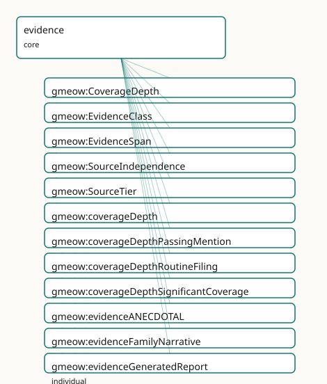

<!-- GENERATED by gmeow ontology-docs. DO NOT EDIT. -->

# GMEOW Evidence Module

- **IRI:** <https://blackcatinformatics.ca/gmeow/slices/evidence>
- **Tier:** core
- **[`Group`](../reference/classes/gmeow-Group.md):** core

## What This Slice Covers

This slice owns 35 terms and contributes 4 mapping or projection rows. Use it when its terms match the native fact you want to preserve; use the linkage tables to see how those facts leave GMEOW for consumer vocabularies.

## Dependencies

- [`gmeow:slices/citations`](citations.md)
- [`gmeow:slices/kernel`](kernel.md)

## Consumers

- The claim spine's [`EvidenceSpan`](../reference/classes/gmeow-EvidenceSpan.md) ([`EvidenceSpan`](../reference/classes/gmeow-EvidenceSpan.md) audit machinery); evidential warrant for citations and deception analyses.

## Local Map



## Examples

### Notability Assessment

- **Source:** [`slices/core/evidence/examples/notability-assessment.ttl`](https://github.com/Blackcat-Informatics/gmeow-ontology/blob/main/slices/core/evidence/examples/notability-assessment.ttl)
- **GMEOW terms:** [`gmeow:CitationAct`](../reference/classes/gmeow-CitationAct.md), [`gmeow:CreativeWork`](../reference/classes/gmeow-CreativeWork.md), [`gmeow:Organization`](../reference/classes/gmeow-Organization.md), [`gmeow:citationIntent`](../reference/properties/gmeow-citationIntent.md), [`gmeow:citedEntity`](../reference/properties/gmeow-citedEntity.md), [`gmeow:citingEntity`](../reference/properties/gmeow-citingEntity.md), [`gmeow:coverageDepth`](../reference/properties/gmeow-coverageDepth.md), [`gmeow:coverageDepthRoutineFiling`](../reference/individuals/gmeow-coverageDepthRoutineFiling.md), [`gmeow:coverageDepthSignificantCoverage`](../reference/individuals/gmeow-coverageDepthSignificantCoverage.md), [`gmeow:evidenceIndependentTradePress`](../reference/individuals/gmeow-evidenceIndependentTradePress.md)

```turtle
# SPDX-FileCopyrightText: 2026 Blackcat Informatics® Inc. <paudley@blackcatinformatics.ca>
# SPDX-License-Identifier: CC-BY-4.0
#
# Worked example: grading citations as evidence. The evidence slice hangs
# quality dimensions on a gmeow:CitationAct (from the citations slice): its
# gmeow:hasEvidenceClass, gmeow:sourceTier (primary/secondary/tertiary),
# gmeow:sourceIndependence and gmeow:coverageDepth together decide whether the
# citation gmeow:supportsNotability. The Wikipedia-notability discrimination falls
# straight out: independent + secondary + significant coverage SUPPORTS it; a
# routine self-originated passing mention does NOT — same predicate, graded.
@prefix gmeow: <https://blackcatinformatics.ca/gmeow/> .
@prefix ex:    <https://blackcatinformatics.ca/gmeow/examples/evidence/> .

ex:subject a gmeow:Organization ; gmeow:name "Acme Robotics Inc."@en .

ex:feature a gmeow:CreativeWork ; gmeow:title "Acme Robotics: the rise of a warehouse-automation contender"@en .
ex:pressRelease a gmeow:CreativeWork ; gmeow:title "Acme Robotics announces Series B"@en .

# --- Strong evidence: an independent trade-press feature with depth → supports.
#     The subject (citingEntity, generic Entity) is supported by the cited work
#     (citedEntity, a CreativeWork): gmeow:intentSupports reads "the cited work
#     supports the citing entity", and the evidence dimensions grade that support.
ex:goodCite a gmeow:CitationAct ;
    gmeow:citingEntity       ex:subject ;
    gmeow:citedEntity        ex:feature ;
    gmeow:citationIntent     gmeow:intentSupports ;
    gmeow:hasEvidenceClass   gmeow:evidenceIndependentTradePress ;
    gmeow:sourceTier         gmeow:sourceTierSecondary ;
    gmeow:sourceIndependence gmeow:sourceIndependenceIndependent ;
    gmeow:coverageDepth      gmeow:coverageDepthSignificantCoverage ;
    gmeow:supportsNotability true .

# --- Weak evidence: the subject's own press release, a passing routine notice →
#     same predicate, graded the other way: does NOT support notability.
ex:weakCite a gmeow:CitationAct ;
    gmeow:citingEntity       ex:subject ;
    gmeow:citedEntity        ex:pressRelease ;
    gmeow:citationIntent     gmeow:intentSupports ;
    gmeow:hasEvidenceClass   gmeow:evidenceSelfControlledSite ;
    gmeow:sourceTier         gmeow:sourceTierPrimary ;
    gmeow:sourceIndependence gmeow:sourceIndependenceSelfOrIssuerOriginated ;
    gmeow:coverageDepth      gmeow:coverageDepthRoutineFiling ;
    gmeow:supportsNotability false .
```

## Terms

### Classes

| Term | Label | Definition |
|---|---|---|
| [`gmeow:CoverageDepth`](../reference/classes/gmeow-CoverageDepth.md) | Coverage Depth | The depth of coverage a source provides about its subject — a value vocabulary (individuals, never subclasses). Distinguishes significant in-depth treatment fr... |
| [`gmeow:EvidenceClass`](../reference/classes/gmeow-EvidenceClass.md) | Evidence Class | The kind and strength of evidence supporting a claim — a value vocabulary (individuals, never subclasses). Distinguishes verified facts from self-assertions, a... |
| [`gmeow:EvidenceSpan`](../reference/classes/gmeow-EvidenceSpan.md) | Evidence Span | An anchored target span within a resource — a text quote, character position, fragment identifier, page, or generic locator. Generalized from the citation-sele... |
| [`gmeow:SourceIndependence`](../reference/classes/gmeow-SourceIndependence.md) | Source Independence | The independence of a source from the subject it covers — a value vocabulary (individuals, never subclasses). Distinguishes sources that are editorially indepe... |
| [`gmeow:SourceTier`](../reference/classes/gmeow-SourceTier.md) | Source Tier | The bibliographic tier of a source — primary, secondary, or tertiary — a value vocabulary (individuals, never subclasses). This is the standard source-tier axi... |

### Properties

| Term | Label | Definition |
|---|---|---|
| [`gmeow:coverageDepth`](../reference/properties/gmeow-coverageDepth.md) | coverage depth | The depth of coverage the source provides about the subject of a citation — significant coverage, passing mention, or routine filing. Non-functional: competing... |
| [`gmeow:hasEvidenceClass`](../reference/properties/gmeow-hasEvidenceClass.md) | has evidence class | The evidential warrant of a citation — the kind and strength of evidence it provides for the claim it supports. Non-functional: a single citation may carry mul... |
| [`gmeow:sourceIndependence`](../reference/properties/gmeow-sourceIndependence.md) | source independence | The independence status of the source referenced by a citation — independent or self/issuer originated. Non-functional: competing assessments by different stan... |
| [`gmeow:sourceTier`](../reference/properties/gmeow-sourceTier.md) | source tier | The bibliographic tier of the source referenced by a citation — primary, secondary, or tertiary. Non-functional: competing tier assessments coexist (Principle... |
| [`gmeow:supportsNotability`](../reference/properties/gmeow-supportsNotability.md) | supports notability | Whether this citation is asserted to support notability (encyclopedic significance) as distinct from factual verification. A citation may verify a fact (high e... |

### Individuals

| Term | Label | Definition |
|---|---|---|
| [`gmeow:coverageDepthPassingMention`](../reference/individuals/gmeow-coverageDepthPassingMention.md) | passing mention | The source mentions the subject only in passing — a name in a list, a brief reference, or an incidental citation — without substantive discussion. |
| [`gmeow:coverageDepthRoutineFiling`](../reference/individuals/gmeow-coverageDepthRoutineFiling.md) | routine filing | The source is a routine administrative filing, automated entry, or bulk-generated record that mentions the subject only as a matter of standard procedure. |
| [`gmeow:coverageDepthSignificantCoverage`](../reference/individuals/gmeow-coverageDepthSignificantCoverage.md) | significant coverage | The source provides substantial, in-depth treatment of the subject — multiple paragraphs, a dedicated article, or a detailed profile — rather than a trivial me... |
| [`gmeow:evidenceANECDOTAL`](../reference/individuals/gmeow-evidenceANECDOTAL.md) | anecdotal evidence | Evidence based on personal accounts, informal narratives, or uncorroborated reports — stronger than rumour but weaker than verified fact. |
| [`gmeow:evidenceFamilyNarrative`](../reference/individuals/gmeow-evidenceFamilyNarrative.md) | family narrative evidence | Evidence from oral history, family tradition, or genealogical narrative passed between relatives. |
| [`gmeow:evidenceGeneratedReport`](../reference/individuals/gmeow-evidenceGeneratedReport.md) | generated report evidence | Evidence from a machine-generated report, dashboard output, or automated analytics summary. |
| [`gmeow:evidenceIndependentTradePress`](../reference/individuals/gmeow-evidenceIndependentTradePress.md) | independent trade press evidence | Evidence from a trade or industry publication that is editorially independent of the subject. |
| [`gmeow:evidenceLegalFiling`](../reference/individuals/gmeow-evidenceLegalFiling.md) | legal filing evidence | Evidence from a court filing, patent application, regulatory submission, or other legal document filed with a governmental or judicial body. |
| [`gmeow:evidenceNewspaperLead`](../reference/individuals/gmeow-evidenceNewspaperLead.md) | newspaper lead evidence | Evidence from a newspaper article, wire-service dispatch, or journalistic lead — distinct from independent trade press in audience and editorial process. |
| [`gmeow:evidenceOcrExtract`](../reference/individuals/gmeow-evidenceOcrExtract.md) | OCR extract evidence | Evidence extracted from an image or scan by optical character recognition — the extraction step itself is part of the provenance. |
| [`gmeow:evidenceOfficialSource`](../reference/individuals/gmeow-evidenceOfficialSource.md) | official source evidence | Evidence from an authoritative governmental, intergovernmental, or standards-body source. |
| [`gmeow:evidencePrivateCorrespondence`](../reference/individuals/gmeow-evidencePrivateCorrespondence.md) | private correspondence evidence | Evidence from a letter, email, message, or other direct communication not intended for public distribution. |
| [`gmeow:evidencePrivateScan`](../reference/individuals/gmeow-evidencePrivateScan.md) | private scan evidence | Evidence from a privately held document scan, photograph, or digitisation not publicly accessible or independently verifiable. |
| [`gmeow:evidencePublicRegistry`](../reference/individuals/gmeow-evidencePublicRegistry.md) | public registry evidence | Evidence drawn from a publicly accessible register, database, or gazette maintained by an authority. |
| [`gmeow:evidenceRUMOR`](../reference/individuals/gmeow-evidenceRUMOR.md) | rumour evidence | Evidence whose provenance is unverified, unverifiable, or explicitly speculative — the weakest warrant tier, recorded for audit completeness but not for factua... |
| [`gmeow:evidenceRawArchive`](../reference/individuals/gmeow-evidenceRawArchive.md) | raw archive evidence | Evidence from an unprocessed archival holding — a box, folder, or collection entry before scholarly curation or transcription. |
| [`gmeow:evidenceSELF`](../reference/individuals/gmeow-evidenceSELF.md) | self evidence | Evidence originating from the subject of the claim itself — a self-assertion, self-published biography, or press release. High authority for the subject's own... |
| [`gmeow:evidenceSelfControlledSite`](../reference/individuals/gmeow-evidenceSelfControlledSite.md) | self-controlled site evidence | Evidence from a website, social-media account, or platform profile controlled by the subject of the claim. |
| [`gmeow:evidenceSourceCodeArchive`](../reference/individuals/gmeow-evidenceSourceCodeArchive.md) | source code archive evidence | Evidence from a version-controlled software repository, release tarball, or code snapshot. |
| [`gmeow:evidenceVERIFIED`](../reference/individuals/gmeow-evidenceVERIFIED.md) | verified evidence | Evidence that has been independently checked or corroborated by a trusted authority or process. |
| [`gmeow:sourceIndependenceIndependent`](../reference/individuals/gmeow-sourceIndependenceIndependent.md) | independent | The source is editorially and financially independent of the subject — no employment, ownership, or promotional relationship. |
| [`gmeow:sourceIndependenceSelfOrIssuerOriginated`](../reference/individuals/gmeow-sourceIndependenceSelfOrIssuerOriginated.md) | self or issuer originated | The source originates from the subject itself or from an issuer, promoter, or affiliated party — press releases, self-published sites, corporate filings by the... |
| [`gmeow:sourceTierPrimary`](../reference/individuals/gmeow-sourceTierPrimary.md) | primary | A primary source — an original document, artifact, or direct record created at the time of the event or by the subject (a birth certificate, a legal filing, a... |
| [`gmeow:sourceTierSecondary`](../reference/individuals/gmeow-sourceTierSecondary.md) | secondary | A secondary source — an analysis, commentary, review, or synthesis by an independent party that interprets or builds upon primary sources (a biography, a trade... |
| [`gmeow:sourceTierTertiary`](../reference/individuals/gmeow-sourceTierTertiary.md) | tertiary | A tertiary source — a compendium, index, encyclopedia, or database that aggregates and summarizes secondary sources without adding original analysis. |

## Linkages

- **Rows:** 4
- **Projection profiles:** -
- **External vocabularies:** `crminf`, `prov`, `schema`

| Source | Kind | Profile | Predicate/Relation | Target | Evidence |
|---|---|---|---|---|---|
| [`gmeow:EvidenceClass`](../reference/classes/gmeow-EvidenceClass.md) | equivalence | `-` | [skos:closeMatch](http://www.w3.org/2004/02/skos/core#closeMatch) | [crminf:I2_Belief](http://www.ics.forth.gr/isl/CRMinf/I2_Belief) | `gmeow-evidence.sssom.tsv`; `gmeow:eqEvidence001`; confidence 0.75 |
| [`gmeow:hasEvidenceClass`](../reference/properties/gmeow-hasEvidenceClass.md) | equivalence | `-` | [skos:relatedMatch](http://www.w3.org/2004/02/skos/core#relatedMatch) | [crminf:J5_holds_to_be](http://www.ics.forth.gr/isl/CRMinf/J5_holds_to_be) | `gmeow-evidence.sssom.tsv`; `gmeow:eqEvidence002`; confidence 0.6 |
| [`gmeow:hasEvidenceClass`](../reference/properties/gmeow-hasEvidenceClass.md) | equivalence | `-` | [skos:relatedMatch](http://www.w3.org/2004/02/skos/core#relatedMatch) | [prov:wasDerivedFrom](http://www.w3.org/ns/prov#wasDerivedFrom) | `gmeow-evidence.sssom.tsv`; `gmeow:eqEvidence005`; confidence 0.5 |
| [`gmeow:hasEvidenceClass`](../reference/properties/gmeow-hasEvidenceClass.md) | equivalence | `-` | [skos:relatedMatch](http://www.w3.org/2004/02/skos/core#relatedMatch) | [schema:isBasedOn](https://schema.org/isBasedOn) | `gmeow-evidence.sssom.tsv`; `gmeow:eqEvidence007`; confidence 0.6 |

## Guide

<!-- SPDX-FileCopyrightText: 2026 Blackcat Informatics® Inc. <paudley@blackcatinformatics.ca> -->
<!-- SPDX-License-Identifier: CC-BY-4.0 -->

# Evidence — warrant and notability, two axes that never bridge

> **Slice:** `https://blackcatinformatics.ca/gmeow/slices/evidence` · **tier: core**
> The evidential substrate of the citation link: how strong the evidence is, and — separately — whether it makes anything notable.

No SOTA vocabulary unifies evidential warrant with source-independence typing
([Principle 1](https://github.com/Blackcat-Informatics/gmeow-ontology/blob/main/CONSTITUTION.md#principle-1)), so GMEOW does, as **two orthogonal axes that travel with the evidence
link** ([`CitationAct`](../reference/classes/gmeow-CitationAct.md) / [`EvidenceSpan`](../reference/classes/gmeow-EvidenceSpan.md)), never with the asserted fact. **[`Axis`](../reference/classes/gmeow-Axis.md) A —
evidential warrant**: the kind and strength of evidence for a claim, an open value
vocabulary ([`EvidenceClass`](../reference/classes/gmeow-EvidenceClass.md)) reached non-functionally — a multi-source claim legitimately
carries several evidence classes at once ([Principle 9](https://github.com/Blackcat-Informatics/gmeow-ontology/blob/main/CONSTITUTION.md#principle-9)). **[`Axis`](../reference/classes/gmeow-Axis.md) B — source independence
and coverage typing**: four facets on the citation that feed *notability* assessment, not
truth. The axes are explicitly orthogonal: a primary legal filing may verify a fact
beyond doubt (high warrant) while establishing no notability at all
([`supportsNotability`](../reference/properties/gmeow-supportsNotability.md) false). Bridged by reference to [CRMinf](../external/ontologies.md#target-crminf), [PROV-O](../external/ontologies.md#target-prov), schema.org, C2PA,
DataCite, nanopublications, and WP:GNG ([Principle 5](https://github.com/Blackcat-Informatics/gmeow-ontology/blob/main/CONSTITUTION.md#principle-5)).

On the claim spine (Source → [`Chunk`](../reference/classes/gmeow-Chunk.md) → [`EvidenceSpan`](../reference/classes/gmeow-EvidenceSpan.md) → Claim, [Principle 14](https://github.com/Blackcat-Informatics/gmeow-ontology/blob/main/CONSTITUTION.md#principle-14)) this slice owns
the **[`EvidenceSpan`](../reference/classes/gmeow-EvidenceSpan.md)** anchor — the [`EvidenceSpan`](../reference/classes/gmeow-EvidenceSpan.md) audit machinery link from a claim back into the exact span of
its source — and the warrant facets that ride on each citation edge. Weak evidence is
recorded, never deleted: rumour-tier claims are suppressed by projection ([Principle 10](https://github.com/Blackcat-Informatics/gmeow-ontology/blob/main/CONSTITUTION.md#principle-10)),
and every eligibility decision is the solver's, not the reasoner's ([Principle 12](https://github.com/Blackcat-Informatics/gmeow-ontology/blob/main/CONSTITUTION.md#principle-12)).

## The spine anchor

### [`gmeow:EvidenceSpan`](../reference/classes/gmeow-EvidenceSpan.md)

An anchored target span within a resource — text quote, character position, fragment
identifier, page, or generic locator. Generalised from the citation-selector model to
serve both evidentiary claims (GraphRAG provenance design/EvidenceSpan audit machinery) and annotation targets (annotation target span): the
citations slice's [`Selector`](../reference/classes/gmeow-Selector.md) specialises it, the notes slice's annotation targets reuse
it, and no second selector model is ever minted ([Principle 4](https://github.com/Blackcat-Informatics/gmeow-ontology/blob/main/CONSTITUTION.md#principle-4)). Re-homed to core in the
slice-dependency doctrine dependency refactor because the spine anchor *is* core evidence machinery.

## Axis A — evidential warrant

### [`gmeow:EvidenceClass`](../reference/classes/gmeow-EvidenceClass.md)

The kind and strength of evidence supporting a claim — a value vocabulary (individuals,
never subclasses), and open: a new evidence kind is data, not a schema change. Coarse
tiers ([`evidenceVERIFIED`](../reference/individuals/gmeow-evidenceVERIFIED.md), [`evidenceSELF`](../reference/individuals/gmeow-evidenceSELF.md), [`evidenceANECDOTAL`](../reference/individuals/gmeow-evidenceANECDOTAL.md), [`evidenceRUMOR`](../reference/individuals/gmeow-evidenceRUMOR.md)) coexist
with fine refinements (legal filing, public registry, independent trade press, OCR
extract, family narrative, source-code archive, private correspondence…). [`Note`](../reference/classes/gmeow-Note.md) the
[Principle 9](https://github.com/Blackcat-Informatics/gmeow-ontology/blob/main/CONSTITUTION.md#principle-9) inflection in [`evidenceSELF`](../reference/individuals/gmeow-evidenceSELF.md): self-assertion is *top* authority for the
subject's own standpoint while remaining *low* warrant for third-party verification —
two different questions, both answered honestly.

### [`gmeow:hasEvidenceClass`](../reference/properties/gmeow-hasEvidenceClass.md)

The warrant facet on a [`CitationAct`](../reference/classes/gmeow-CitationAct.md). Non-functional by doctrine: one citation may be
both a legal filing and the trade-press coverage of that filing, and competing
classifications coexist rather than collapse ([Principle 9](https://github.com/Blackcat-Informatics/gmeow-ontology/blob/main/CONSTITUTION.md#principle-9)).

## Axis B — independence & coverage (the notability axis)

### [`gmeow:sourceIndependence`](../reference/properties/gmeow-sourceIndependence.md)

Whether the cited source is editorially and financially independent of its subject, or
self/issuer-originated (press releases, self-published sites, the subject's own
filings). Range is the [`SourceIndependence`](../reference/classes/gmeow-SourceIndependence.md) value vocabulary. About notability
eligibility, never factual truth — competing assessments from different standpoints
coexist ([Principle 9](https://github.com/Blackcat-Informatics/gmeow-ontology/blob/main/CONSTITUTION.md#principle-9)).

### [`gmeow:sourceTier`](../reference/properties/gmeow-sourceTier.md)

The standard bibliographic tier — [`sourceTierPrimary`](../reference/individuals/gmeow-sourceTierPrimary.md) / [`sourceTierSecondary`](../reference/individuals/gmeow-sourceTierSecondary.md) /
[`sourceTierTertiary`](../reference/individuals/gmeow-sourceTierTertiary.md) ([`SourceTier`](../reference/classes/gmeow-SourceTier.md) vocabulary, cf. WP:GNG). A value vocabulary naming an
evidentiary reality, not a selector privileging one co-equal claim. Non-functional:
tier assessments are themselves contestable.

### [`gmeow:coverageDepth`](../reference/properties/gmeow-coverageDepth.md)

How deeply the source treats the subject — [`coverageDepthSignificantCoverage`](../reference/individuals/gmeow-coverageDepthSignificantCoverage.md),
[`coverageDepthPassingMention`](../reference/individuals/gmeow-coverageDepthPassingMention.md), or [`coverageDepthRoutineFiling`](../reference/individuals/gmeow-coverageDepthRoutineFiling.md) ([`CoverageDepth`](../reference/classes/gmeow-CoverageDepth.md)
vocabulary). Orthogonal to tier and independence: a secondary independent source can
still mention the subject only in a list.

### [`gmeow:supportsNotability`](../reference/properties/gmeow-supportsNotability.md)

The explicit boolean assertion that *this* citation is offered as notability support, as
distinct from factual verification. The keystone of the two-axis doctrine: warrant and
notability never bridge automatically — a citation must be *claimed* as notability
evidence, and competing notability assessments coexist ([Principle 9](https://github.com/Blackcat-Informatics/gmeow-ontology/blob/main/CONSTITUTION.md#principle-9)).

## Open-world policy & solver boundary

No existential restrictions are asserted on [`CitationAct`](../reference/classes/gmeow-CitationAct.md): every facet here is an
optional annotation on the evidence link, with closed-world enforcement left to SHACL at
instance-validation time (Principles 7–8). And the question the axes exist to answer —
"is this subject notable?", "is this claim adequately evidenced?" — is **never** answered
in OWL: eligibility folds over independence × tier × depth × warrant are projection-time
solver policy ([Principle 12](https://github.com/Blackcat-Informatics/gmeow-ontology/blob/main/CONSTITUTION.md#principle-12)). The graph records the facets; the consumer's policy decides.

## Dependencies

Depends on `citations` (the [`CitationAct`](../reference/classes/gmeow-CitationAct.md) the facets attach to) and `kernel`. Consumed by
the claim spine's [`EvidenceSpan`](../reference/classes/gmeow-EvidenceSpan.md) ([`EvidenceSpan`](../reference/classes/gmeow-EvidenceSpan.md) audit machinery), citation warrant in every sourced slice, and
the deception analyses' evidence grading.
