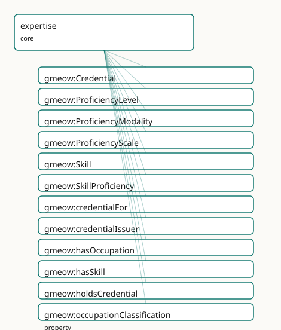

<!-- GENERATED by gmeow ontology-docs. DO NOT EDIT. -->

# GMEOW Expertise Module

- **IRI:** <https://blackcatinformatics.ca/gmeow/slices/expertise>
- **Tier:** core
- **[`Group`](../reference/classes/gmeow-Group.md):** core

## What This Slice Covers

This slice owns 20 terms and contributes 22 mapping or projection rows. Use it when its terms match the native fact you want to preserve; use the linkage tables to see how those facts leave GMEOW for consumer vocabularies.

## Dependencies

- [`gmeow:slices/cognition`](cognition.md)
- [`gmeow:slices/entities`](entities.md)
- [`gmeow:slices/kernel`](kernel.md)
- [`gmeow:slices/organization`](organization.md)
- [`gmeow:slices/temporal`](temporal.md)

## Consumers

- Cross-cutting proficiency claims (promoted core, slice-dependency doctrine): skills, credentials, language proficiency.

## Local Map



## Examples

### Skill Proficiency

- **Source:** [`slices/core/expertise/examples/skill-proficiency.ttl`](https://github.com/Blackcat-Informatics/gmeow-ontology/blob/main/slices/core/expertise/examples/skill-proficiency.ttl)
- **GMEOW terms:** [`gmeow:Attestation`](../reference/classes/gmeow-Attestation.md), [`gmeow:Credential`](../reference/classes/gmeow-Credential.md), [`gmeow:Occupation`](../reference/classes/gmeow-Occupation.md), [`gmeow:Organization`](../reference/classes/gmeow-Organization.md), [`gmeow:Person`](../reference/classes/gmeow-Person.md), [`gmeow:ProficiencyLevel`](../reference/classes/gmeow-ProficiencyLevel.md), [`gmeow:ProficiencyScale`](../reference/classes/gmeow-ProficiencyScale.md), [`gmeow:Skill`](../reference/classes/gmeow-Skill.md), [`gmeow:SkillProficiency`](../reference/classes/gmeow-SkillProficiency.md), [`gmeow:attestationType`](../reference/properties/gmeow-attestationType.md)
- **External prefixes:** `xsd`

```turtle
# SPDX-FileCopyrightText: 2026 Blackcat Informatics® Inc. <paudley@blackcatinformatics.ca>
# SPDX-License-Identifier: CC-BY-4.0
#
# Worked example: skill, proficiency, and credentials. A flat gmeow:hasSkill
# says an agent HAS a skill; the reified gmeow:SkillProficiency says HOW WELL, and
# crucially on WHICH SCALE — a proficiency level is meaningless without the scale
# it is read against (P11 in spirit: a value carries its frame). A gmeow:Credential
# is a separate, independently-issued attestation OF a skill, by an issuer — having
# a credential and being proficient are distinct facts. ProficiencyLevel, scale,
# Skill and Occupation are open vocabularies, minted as needed.
@prefix gmeow: <https://blackcatinformatics.ca/gmeow/> .
@prefix ex:    <https://blackcatinformatics.ca/gmeow/examples/expertise/> .
@prefix rdfs:  <http://www.w3.org/2000/01/rdf-schema#> .
@prefix xsd:   <http://www.w3.org/2001/XMLSchema#> .

ex:dana a gmeow:Person ;
    gmeow:name           "Dana Reyes"@en ;
    gmeow:hasSkill       ex:python ;
    gmeow:hasOccupation  ex:engineer ;
    gmeow:holdsCredential ex:cert .

ex:python   a gmeow:Skill ; rdfs:label "Python programming"@en .
ex:engineer a gmeow:Occupation ;
    rdfs:label "Software Engineer"@en ;
    gmeow:occupationClassification "SOC 15-1252" .

# --- Proficiency: HOW WELL, read against an explicit named SCALE.
ex:proficiency a gmeow:SkillProficiency ;
    gmeow:skillProficiencyAgent ex:dana ;
    gmeow:skillProficiencyOf    ex:python ;
    gmeow:skillProficiencyLevel ex:expert ;
    gmeow:skillProficiencyScale ex:dreyfus .

ex:dreyfus a gmeow:ProficiencyScale ; rdfs:label "Dreyfus model of skill acquisition"@en .
ex:expert  a gmeow:ProficiencyLevel ; rdfs:label "expert"@en .

# --- A credential: an independent attestation OF the skill, by an issuer. A
#     verifiable credential references a gmeow:Attestation that signs it (the
#     expertise↔attestation seam): the credential is a CLAIM, the attestation
#     makes it checkable.
ex:cert a gmeow:Credential ;
    gmeow:credentialFor    ex:python ;
    gmeow:credentialIssuer ex:psf ;
    gmeow:hasAttestation   ex:certAttestation .

ex:certAttestation a gmeow:Attestation ;
    gmeow:attester        ex:psf ;
    gmeow:attestedSubject ex:cert ;
    gmeow:attestationType gmeow:attestationTypeVerifiableCredential ;
    gmeow:issuedAt        "2025-09-01T00:00:00Z"^^xsd:dateTime .

ex:psf a gmeow:Organization ; gmeow:name "Python Software Foundation"@en .
```

## Terms

### Classes

| Term | Label | Definition |
|---|---|---|
| [`gmeow:Credential`](../reference/classes/gmeow-Credential.md) | Credential | An educational or occupational credential held by an agent — a degree, certification, badge, license, or other attestation of qualification. Its issuer is gmeo... |
| [`gmeow:Skill`](../reference/classes/gmeow-Skill.md) | Skill | A competency or ability an agent possesses — a knowledge, ability, or expertise that can be applied to perform a task. Occupation-independent; aligned to esco:... |
| [`gmeow:SkillProficiency`](../reference/classes/gmeow-SkillProficiency.md) | Skill Proficiency | A reified, leveled proficiency of an agent in a skill — the [gufo:Relator](../external/terms.md#gufo-relator) binding {agent} × {skill} × {level on a scale} × {interval}, mirroring languages' gmeo... |

### Properties

| Term | Label | Definition |
|---|---|---|
| [`gmeow:credentialFor`](../reference/properties/gmeow-credentialFor.md) | credential for | The skill or occupation that a credential certifies. Non-functional — a credential may certify several skills or both a skill and an occupation. Profile compli... |
| [`gmeow:credentialIssuer`](../reference/properties/gmeow-credentialIssuer.md) | credential issuer | The organization that issued a credential. Functional per credential: one issuer is constitutive of the credential's identity (a different issuer is a differen... |
| [`gmeow:hasOccupation`](../reference/properties/gmeow-hasOccupation.md) | has occupation | Relates a person to an occupation they hold or have held. Non-functional — a person may have several occupations over time. |
| [`gmeow:hasSkill`](../reference/properties/gmeow-hasSkill.md) | has skill | Relates an agent to a skill it possesses. Non-functional — an agent may have many skills. The leveled, scaled detail is carried by the reified gmeow:SkillProfi... |
| [`gmeow:holdsCredential`](../reference/properties/gmeow-holdsCredential.md) | holds credential | Relates an agent to a credential it holds. Non-functional — an agent may hold many credentials, and a single credential may be held by many agents (shared lice... |
| [`gmeow:occupationClassification`](../reference/properties/gmeow-occupationClassification.md) | occupation classification | An external classification code for an occupation (ESCO, SOC, O*NET, ISCO, NOC). Non-functional — an occupation may carry codes from several schemes. The schem... |
| [`gmeow:skillProficiencyAgent`](../reference/properties/gmeow-skillProficiencyAgent.md) | skill proficiency agent | The agent whose proficiency a skill-proficiency expresses. Functional — constitutive of the proficiency. |
| [`gmeow:skillProficiencyInterval`](../reference/properties/gmeow-skillProficiencyInterval.md) | skill proficiency interval | The interval over which a skill-proficiency held (proficiency changes over a life). Lighter cases use gmeow:validFrom/validUntil on the statement. |
| [`gmeow:skillProficiencyLevel`](../reference/properties/gmeow-skillProficiencyLevel.md) | skill proficiency level | The attained level of a skill-proficiency (a [`gmeow:ProficiencyLevel`](../reference/classes/gmeow-ProficiencyLevel.md) value, e.g. dreyfusExpert, assessedCompetent). Functional. |
| [`gmeow:skillProficiencyOf`](../reference/properties/gmeow-skillProficiencyOf.md) | skill proficiency of | The skill a skill-proficiency concerns. Functional — constitutive. |
| [`gmeow:skillProficiencyScale`](../reference/properties/gmeow-skillProficiencyScale.md) | skill proficiency scale | The framework/scale a skill-proficiency level is measured on (Dreyfus, NIH, assessed, self-reported) — a [`gmeow:ProficiencyScale`](../reference/classes/gmeow-ProficiencyScale.md) value. Functional. |

### Individuals

| Term | Label | Definition |
|---|---|---|
| [`gmeow:dreyfusAdvancedBeginner`](../reference/individuals/gmeow-dreyfusAdvancedBeginner.md) | Dreyfus advanced beginner | The advanced-beginner level of the Dreyfus scale — beginning to recognise recurring situational elements, still leaning on rules but accumulating practical exp... |
| [`gmeow:dreyfusCompetent`](../reference/individuals/gmeow-dreyfusCompetent.md) | Dreyfus competent | The competent level of the Dreyfus scale — planning deliberately and selecting among situational elements toward a goal, taking responsibility for outcomes. |
| [`gmeow:dreyfusExpert`](../reference/individuals/gmeow-dreyfusExpert.md) | Dreyfus expert | The expert level of the Dreyfus scale — fluent, intuitive performance in which situation-recognition and response are fused, with deliberation reserved for the... |
| [`gmeow:dreyfusNovice`](../reference/individuals/gmeow-dreyfusNovice.md) | Dreyfus novice | The novice level of the Dreyfus scale — rule-bound, context-free application of taught procedures, with little situational judgement. |
| [`gmeow:dreyfusProficient`](../reference/individuals/gmeow-dreyfusProficient.md) | Dreyfus proficient | The proficient level of the Dreyfus scale — perceiving situations holistically and intuitively, while still deciding the response analytically. |
| [`gmeow:scaleDreyfus`](../reference/individuals/gmeow-scaleDreyfus.md) | Dreyfus | The Dreyfus model of skill acquisition — an ordered skill-proficiency scale (novice ≺ advanced beginner ≺ competent ≺ proficient ≺ expert) describing how an ag... |

## Linkages

- **Rows:** 22
- **Projection profiles:** `schema-org`
- **External vocabularies:** `ceterms`, `esco`, `schema`, `wd`

| Source | Kind | Profile | Predicate/Relation | Target | Evidence |
|---|---|---|---|---|---|
| [`gmeow:Credential`](../reference/classes/gmeow-Credential.md) | equivalence | `-` | [owl:equivalentClass](http://www.w3.org/2002/07/owl#equivalentClass) | [ceterms:Credential](https://purl.org/ctdl/terms/Credential) | `gmeow-classes.sssom.tsv`; `gmeow:eqClasses054`; confidence 0.9 |
| [`gmeow:Credential`](../reference/classes/gmeow-Credential.md) | equivalence | `-` | [owl:equivalentClass](http://www.w3.org/2002/07/owl#equivalentClass) | [schema:EducationalOccupationalCredential](https://schema.org/EducationalOccupationalCredential) | `gmeow-classes.sssom.tsv`; `gmeow:eqClasses044`; confidence 1 |
| [`gmeow:Credential`](../reference/classes/gmeow-Credential.md) | equivalence | `-` | [skos:closeMatch](http://www.w3.org/2004/02/skos/core#closeMatch) | [wd:Q5158833](https://www.wikidata.org/wiki/Q5158833) | `gmeow-wikidata.sssom.tsv`; `gmeow:eqWikidata046`; confidence 0.8 |
| [`gmeow:Skill`](../reference/classes/gmeow-Skill.md) | equivalence | `-` | [skos:closeMatch](http://www.w3.org/2004/02/skos/core#closeMatch) | [esco:Skill](http://data.europa.eu/esco/model#Skill) | `gmeow-classes.sssom.tsv`; `gmeow:eqClasses052`; confidence 0.9 |
| [`gmeow:Skill`](../reference/classes/gmeow-Skill.md) | equivalence | `-` | [skos:closeMatch](http://www.w3.org/2004/02/skos/core#closeMatch) | [wd:Q2242730](https://www.wikidata.org/wiki/Q2242730) | `gmeow-wikidata.sssom.tsv`; `gmeow:eqWikidata052`; confidence 0.8 |
| [`gmeow:credentialFor`](../reference/properties/gmeow-credentialFor.md) | equivalence | `-` | [skos:closeMatch](http://www.w3.org/2004/02/skos/core#closeMatch) | [schema:competencyRequired](https://schema.org/competencyRequired) | `gmeow-properties.sssom.tsv`; `gmeow:eqProperties071`; confidence 0.8 |
| [`gmeow:credentialIssuer`](../reference/properties/gmeow-credentialIssuer.md) | equivalence | `-` | [skos:closeMatch](http://www.w3.org/2004/02/skos/core#closeMatch) | [ceterms:ownedBy](https://purl.org/ctdl/terms/ownedBy) | `gmeow-properties.sssom.tsv`; `gmeow:eqProperties074`; confidence 0.8 |
| [`gmeow:credentialIssuer`](../reference/properties/gmeow-credentialIssuer.md) | equivalence | `-` | [skos:closeMatch](http://www.w3.org/2004/02/skos/core#closeMatch) | [schema:recognizedBy](https://schema.org/recognizedBy) | `gmeow-properties.sssom.tsv`; `gmeow:eqProperties072`; confidence 0.8 |
| [`gmeow:credentialIssuer`](../reference/properties/gmeow-credentialIssuer.md) | equivalence | `-` | [skos:closeMatch](http://www.w3.org/2004/02/skos/core#closeMatch) | [schema:sourceOrganization](https://schema.org/sourceOrganization) | `gmeow-properties.sssom.tsv`; `gmeow:eqProperties073`; confidence 0.8 |
| [`gmeow:hasOccupation`](../reference/properties/gmeow-hasOccupation.md) | equivalence | `-` | [owl:equivalentProperty](http://www.w3.org/2002/07/owl#equivalentProperty) | [schema:hasOccupation](https://schema.org/hasOccupation) | `gmeow-properties.sssom.tsv`; `gmeow:eqProperties033`; confidence 1 |
| [`gmeow:hasSkill`](../reference/properties/gmeow-hasSkill.md) | equivalence | `-` | [skos:closeMatch](http://www.w3.org/2004/02/skos/core#closeMatch) | [schema:skills](https://schema.org/skills) | `gmeow-properties.sssom.tsv`; `gmeow:eqProperties068`; confidence 0.8 |
| [`gmeow:holdsCredential`](../reference/properties/gmeow-holdsCredential.md) | equivalence | `-` | [owl:equivalentProperty](http://www.w3.org/2002/07/owl#equivalentProperty) | [schema:hasCredential](https://schema.org/hasCredential) | `gmeow-properties.sssom.tsv`; `gmeow:eqProperties070`; confidence 1 |
| [`gmeow:Credential`](../reference/classes/gmeow-Credential.md) | projection | `schema-org` | projects to / <= | [schema:competencyRequired](https://schema.org/competencyRequired) | `gmeow:mapSchemaCredentialFor`; confidence 0.8; lossy: the Skill/Occupation distinction in credentialFor collapses to [schema:competencyRequired](https://schema.org/competencyRequired) |
| [`gmeow:Credential`](../reference/classes/gmeow-Credential.md) | projection | `schema-org` | projects to / <= | [schema:recognizedBy](https://schema.org/recognizedBy) | `gmeow:mapSchemaCredentialIssuer`; confidence 0.8; lossy: the issuer organization relator collapses to a flat [schema:recognizedBy](https://schema.org/recognizedBy) edge |
| [`gmeow:SkillProficiency`](../reference/classes/gmeow-SkillProficiency.md) | projection | `schema-org` | projects to / <= | [schema:knowsAbout](https://schema.org/knowsAbout) | `gmeow:mapSchemaSkillProficiency`; confidence 0.8; lossy: the SkillProficiency relator (level, scale, interval, standpoint, confidence) collapses to a flat [schema:knowsAbout](https://schema.org/knowsAbout) edge; transform `gmeow:fnSkillProficiencyToKnowsAbout` |
| [`gmeow:credentialFor`](../reference/properties/gmeow-credentialFor.md) | projection | `schema-org` | projects to / <= | [schema:competencyRequired](https://schema.org/competencyRequired) | `gmeow:mapSchemaCredentialFor`; confidence 0.8; lossy: the Skill/Occupation distinction in credentialFor collapses to [schema:competencyRequired](https://schema.org/competencyRequired) |
| [`gmeow:credentialIssuer`](../reference/properties/gmeow-credentialIssuer.md) | projection | `schema-org` | projects to / <= | [schema:recognizedBy](https://schema.org/recognizedBy) | `gmeow:mapSchemaCredentialIssuer`; confidence 0.8; lossy: the issuer organization relator collapses to a flat [schema:recognizedBy](https://schema.org/recognizedBy) edge |
| [`gmeow:hasSkill`](../reference/properties/gmeow-hasSkill.md) | projection | `schema-org` | projects to / <= | [schema:knowsAbout](https://schema.org/knowsAbout) | `gmeow:mapSchemaSkillProficiency`; confidence 0.8; lossy: the SkillProficiency relator (level, scale, interval, standpoint, confidence) collapses to a flat [schema:knowsAbout](https://schema.org/knowsAbout) edge; transform `gmeow:fnSkillProficiencyToKnowsAbout` |
| [`gmeow:hasSkill`](../reference/properties/gmeow-hasSkill.md) | projection | `schema-org` | projects to / = | [schema:skills](https://schema.org/skills) | `gmeow:mapSchemaSkills`; confidence 0.9 |
| [`gmeow:holdsCredential`](../reference/properties/gmeow-holdsCredential.md) | projection | `schema-org` | projects to / = | [schema:hasCredential](https://schema.org/hasCredential) | `gmeow:mapSchemaHasCredential`; confidence 0.9 |
| [`gmeow:skillProficiencyAgent`](../reference/properties/gmeow-skillProficiencyAgent.md) | projection | `schema-org` | projects to / <= | [schema:knowsAbout](https://schema.org/knowsAbout) | `gmeow:mapSchemaSkillProficiency`; confidence 0.8; lossy: the SkillProficiency relator (level, scale, interval, standpoint, confidence) collapses to a flat [schema:knowsAbout](https://schema.org/knowsAbout) edge; transform `gmeow:fnSkillProficiencyToKnowsAbout` |
| [`gmeow:skillProficiencyOf`](../reference/properties/gmeow-skillProficiencyOf.md) | projection | `schema-org` | projects to / <= | [schema:knowsAbout](https://schema.org/knowsAbout) | `gmeow:mapSchemaSkillProficiency`; confidence 0.8; lossy: the SkillProficiency relator (level, scale, interval, standpoint, confidence) collapses to a flat [schema:knowsAbout](https://schema.org/knowsAbout) edge; transform `gmeow:fnSkillProficiencyToKnowsAbout` |

## Guide

<!-- SPDX-FileCopyrightText: 2026 Blackcat Informatics® Inc. <paudley@blackcatinformatics.ca> -->
<!-- SPDX-License-Identifier: CC-BY-4.0 -->

# Expertise mapping doctrine

This note records the design contract for the GMEOW expertise module
(`ontology/modules/expertise.ttl`) and its relationship to the language
proficiency machinery, employment, attestation, and surface vocabularies.

## Core model

- **[`Skill`](../reference/classes/gmeow-Skill.md)**, **[`Occupation`](../reference/classes/gmeow-Occupation.md)**, and **[`Credential`](../reference/classes/gmeow-Credential.md)** are [`gufo:Kind`](../external/terms.md#gufo-kind) individuals.
- **[`SkillProficiency`](../reference/classes/gmeow-SkillProficiency.md)** is a [`gufo:Relator`](../external/terms.md#gufo-relator) binding `{agent} × {skill} × {level} × {scale} × {interval}`.
- [`gmeow:hasSkill`](../reference/properties/gmeow-hasSkill.md) is the flat shortcut for the common case; promote to [`SkillProficiency`](../reference/classes/gmeow-SkillProficiency.md) when level, scale, temporal scope, provenance, or standpoint matter.

## Reuse, not parallel mechanisms

- The rating vocabulary classes ([`ProficiencyScale`](../reference/classes/gmeow-ProficiencyScale.md), [`ProficiencyLevel`](../reference/classes/gmeow-ProficiencyLevel.md), [`ProficiencyModality`](../reference/classes/gmeow-ProficiencyModality.md)) live in the `kernel` slice — relocated there by to break a latent `expertise ↔ cognition` dependency cycle (Principle 6/16). They are domain-neutral; CEFR/ILR/ACTFL remain language scales, Dreyfus/NIH/Assessed are skill scales, and `cognition`'s [`KnowledgeProficiency`](../reference/classes/gmeow-KnowledgeProficiency.md) reuses the same classes. [`SkillProficiency`](../reference/classes/gmeow-SkillProficiency.md) and [`LanguageProficiency`](../reference/classes/gmeow-LanguageProficiency.md) consume the same value individuals unchanged (same IRIs).
- Temporal scope reuses [`validFrom`](../reference/properties/gmeow-validFrom.md)/[`validUntil`](../reference/properties/gmeow-validUntil.md) (lightweight) and [`TimeInterval`](../reference/classes/gmeow-TimeInterval.md) / [`hasCreationEvent`](../reference/properties/gmeow-hasCreationEvent.md) (heavyweight) from `temporal.ttl` and `lifecycle.ttl`.
- [`Standpoint`](../reference/classes/gmeow-Standpoint.md) and confidence reuse the cross-cutting [`accordingTo`](../reference/properties/gmeow-accordingTo.md) / `confidence` annotation properties from `standpoint.ttl`.

## Endorsement and credential verification

- A third-party skill endorsement is an [`Attestation`](../reference/classes/gmeow-Attestation.md) whose [`attestedSubject`](../reference/properties/gmeow-attestedSubject.md) is the [`SkillProficiency`](../reference/classes/gmeow-SkillProficiency.md).
- Self-asserted, assessed, and endorsed proficiency levels coexist as standpoint-indexed claims (CONSTITUTION [Principle 9](https://github.com/Blackcat-Informatics/gmeow-ontology/blob/main/CONSTITUTION.md#principle-9)); none is privileged.
- [`Credential`](../reference/classes/gmeow-Credential.md) verification is routed through `attestation.ttl`, which is already aligned to [`vc:VerifiableCredential`](https://www.w3.org/2018/credentials#VerifiableCredential). A verifiable credential is a [`Credential`](../reference/classes/gmeow-Credential.md) whose authenticity is borne by an [`Attestation`](../reference/classes/gmeow-Attestation.md). The expertise module supplies content; attestation supplies the signed envelope.

## Occupation classification

- [`occupationClassification`](../reference/properties/gmeow-occupationClassification.md) carries ESCO, SOC, O*NET, ISCO, or NOC codes as literal values.
- Classification resolution and scheme identification are solver-side concerns (CONSTITUTION [Principle 12](https://github.com/Blackcat-Informatics/gmeow-ontology/blob/main/CONSTITUTION.md#principle-12)); the ontology only records the code.

## Surface-vocabulary bridging (by reference)

- **schema.org** — [`Skill`](../reference/classes/gmeow-Skill.md)/[`SkillProficiency`](../reference/classes/gmeow-SkillProficiency.md) flatten to [`schema:knowsAbout`](https://schema.org/knowsAbout) / [`schema:skills`](https://schema.org/skills); [`holdsCredential`](../reference/properties/gmeow-holdsCredential.md) maps to [`schema:hasCredential`](https://schema.org/hasCredential); [`credentialFor`](../reference/properties/gmeow-credentialFor.md) to [`schema:competencyRequired`](https://schema.org/competencyRequired); [`credentialIssuer`](../reference/properties/gmeow-credentialIssuer.md) to [`schema:recognizedBy`](https://schema.org/recognizedBy) / [`schema:sourceOrganization`](https://schema.org/sourceOrganization).
- **ESCO** — [`Skill`](../reference/classes/gmeow-Skill.md) → [`esco:Skill`](http://data.europa.eu/esco/model#Skill); [`Occupation`](../reference/classes/gmeow-Occupation.md) → [`esco:Occupation`](http://data.europa.eu/esco/model#Occupation).
- **CTDL / [`Credential`](../reference/classes/gmeow-Credential.md) Engine** — [`Credential`](../reference/classes/gmeow-Credential.md) → [`ceterms:Credential`](https://purl.org/ctdl/terms/Credential); [`credentialIssuer`](../reference/properties/gmeow-credentialIssuer.md) → [`ceterms:ownedBy`](https://purl.org/ctdl/terms/ownedBy).
- **Open Badges 3.0 / W3C VC** — no new terms in the expertise module; verification semantics are inherited from the attestation layer.

## SHACL

- `shapes/expertise-shapes.ttl` enforces closed-world well-formedness:
 - A [`SkillProficiency`](../reference/classes/gmeow-SkillProficiency.md) must reference exactly one [`Skill`](../reference/classes/gmeow-Skill.md) and carry exactly one [`ProficiencyLevel`](../reference/classes/gmeow-ProficiencyLevel.md).
 - The level's [`levelScale`](../reference/properties/gmeow-levelScale.md) should match the relator's [`skillProficiencyScale`](../reference/properties/gmeow-skillProficiencyScale.md) (warning).
 - A [`Credential`](../reference/classes/gmeow-Credential.md) intended to be verifiable should reference an [`Attestation`](../reference/classes/gmeow-Attestation.md) (warning).
 - A [`Credential`](../reference/classes/gmeow-Credential.md)'s issuer must be an [`Organization`](../reference/classes/gmeow-Organization.md).

## Terms

### [`gmeow:Skill`](../reference/classes/gmeow-Skill.md) · [`gmeow:Credential`](../reference/classes/gmeow-Credential.md)

A [`gufo:Kind`](../external/terms.md#gufo-kind) competency or ability an agent can apply to a task, aligned to
[`esco:Skill`](http://data.europa.eu/esco/model#Skill) by reference; and a degree, certification, badge, or license that
qualifies an agent — its issuer is [`gmeow:credentialIssuer`](../reference/properties/gmeow-credentialIssuer.md), its subject matter
[`gmeow:credentialFor`](../reference/properties/gmeow-credentialFor.md), and its verification is borne by a [`gmeow:Attestation`](../reference/classes/gmeow-Attestation.md)
([Principle 4](https://github.com/Blackcat-Informatics/gmeow-ontology/blob/main/CONSTITUTION.md#principle-4)).

### [`gmeow:SkillProficiency`](../reference/classes/gmeow-SkillProficiency.md) · [`gmeow:skillProficiencyAgent`](../reference/properties/gmeow-skillProficiencyAgent.md) · [`gmeow:skillProficiencyOf`](../reference/properties/gmeow-skillProficiencyOf.md) · [`gmeow:skillProficiencyLevel`](../reference/properties/gmeow-skillProficiencyLevel.md) · [`gmeow:skillProficiencyScale`](../reference/properties/gmeow-skillProficiencyScale.md) · [`gmeow:skillProficiencyInterval`](../reference/properties/gmeow-skillProficiencyInterval.md)

The reified [`gufo:Relator`](../external/terms.md#gufo-relator) binding {agent} × {skill} × {level on a scale} ×
{interval}, mirroring languages' [`LanguageProficiency`](../reference/classes/gmeow-LanguageProficiency.md). Its functional roles fix
the agent, the rated skill, the attained level, and the scale that level is read
against; [`skillProficiencyInterval`](../reference/properties/gmeow-skillProficiencyInterval.md) bounds the span the level held. Contested
levels coexist as separate standpoint-indexed relators ([Principle 9](https://github.com/Blackcat-Informatics/gmeow-ontology/blob/main/CONSTITUTION.md#principle-9)).

### [`gmeow:hasSkill`](../reference/properties/gmeow-hasSkill.md) · [`gmeow:hasOccupation`](../reference/properties/gmeow-hasOccupation.md) · [`gmeow:holdsCredential`](../reference/properties/gmeow-holdsCredential.md)

The flat 80 % shortcuts: an agent possesses a skill ([`hasSkill`](../reference/properties/gmeow-hasSkill.md), a
sub-property of [`knowsAbout`](../reference/properties/gmeow-knowsAbout.md) touching the can-do rung); a person holds an
occupation or job role over time ([`hasOccupation`](../reference/properties/gmeow-hasOccupation.md)); an agent holds a credential,
many-to-many ([`holdsCredential`](../reference/properties/gmeow-holdsCredential.md)). Promote to the reified forms when level,
scale, temporal scope, or standpoint must become first-class.

### [`gmeow:credentialIssuer`](../reference/properties/gmeow-credentialIssuer.md) · [`gmeow:credentialFor`](../reference/properties/gmeow-credentialFor.md) · [`gmeow:occupationClassification`](../reference/properties/gmeow-occupationClassification.md)

A credential's single issuing [`Organization`](../reference/classes/gmeow-Organization.md) (functional — a different issuer is
a different credential); what it certifies (a [`Skill`](../reference/classes/gmeow-Skill.md), an [`Occupation`](../reference/classes/gmeow-Occupation.md), or both,
the union range a SHACL shape); and the raw external classification codes (ESCO,
SOC, O*NET, ISCO, NOC) carried on an occupation, scheme resolution being
solver-side ([Principle 12](https://github.com/Blackcat-Informatics/gmeow-ontology/blob/main/CONSTITUTION.md#principle-12)).

### [`gmeow:ProficiencyScale`](../reference/classes/gmeow-ProficiencyScale.md) · [`gmeow:ProficiencyLevel`](../reference/classes/gmeow-ProficiencyLevel.md) · [`gmeow:ProficiencyModality`](../reference/classes/gmeow-ProficiencyModality.md)

The domain-neutral rating machinery generalized from languages: a [`ProficiencyScale`](../reference/classes/gmeow-ProficiencyScale.md)
is the rating framework (CEFR, ILR, ACTFL, Dreyfus, NIH, assessed, self-reported);
a [`ProficiencyLevel`](../reference/classes/gmeow-ProficiencyLevel.md) is an attained rung on a scale (tied to it by [`levelScale`](../reference/properties/gmeow-levelScale.md)),
meaningless without naming its scale; a [`ProficiencyModality`](../reference/classes/gmeow-ProficiencyModality.md) is the channel a
language proficiency rates (speaking, listening, reading, writing). All are value
individuals, never subclasses ([Principle 9](https://github.com/Blackcat-Informatics/gmeow-ontology/blob/main/CONSTITUTION.md#principle-9)).
