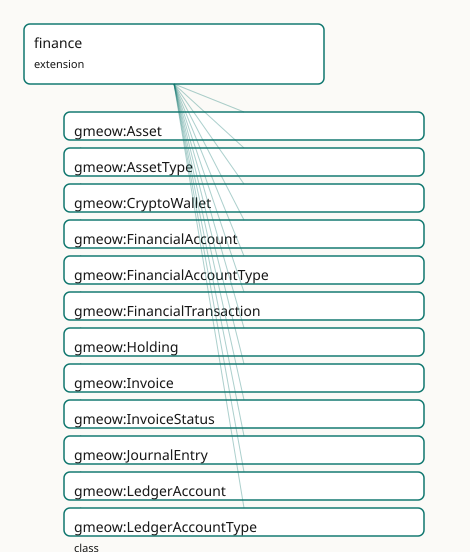

<!-- GENERATED by gmeow ontology-docs. DO NOT EDIT. -->

# GMEOW Finance Module

- **IRI:** <https://blackcatinformatics.ca/gmeow/slices/finance>
- **Tier:** extension
- **[`Group`](../reference/classes/gmeow-Group.md):** extensions

## What This Slice Covers

This slice owns 108 terms and contributes 14 mapping or projection rows. Use it when its terms match the native fact you want to preserve; use the linkage tables to see how those facts leave GMEOW for consumer vocabularies.

## Dependencies

- [`gmeow:slices/accounts`](accounts.md)
- [`gmeow:slices/agreements`](agreements.md)
- [`gmeow:slices/documents`](documents.md)
- [`gmeow:slices/events`](events.md)
- [`gmeow:slices/kernel`](kernel.md)
- [`gmeow:slices/observations`](observations.md)
- [`gmeow:slices/places`](places.md)
- [`gmeow:slices/temporal`](temporal.md)
- [`gmeow:slices/trust`](trust.md)

## Consumers

- Accounts, transactions, REA double-entry over core [`MonetaryAmount`](../reference/classes/gmeow-MonetaryAmount.md); [FIBO](../external/ontologies.md#target-fibo-fnd-pas-ps) alignment.

## Local Map

## Terms

### Classes

| Term | Label | Definition |
|---|---|---|
| [`gmeow:Asset`](../reference/classes/gmeow-Asset.md) | Asset | A financial asset — a stock, bond, cryptocurrency, real estate holding, commodity, or other instrument of value. The thing that is held, not the holding itself... |
| [`gmeow:AssetType`](../reference/classes/gmeow-AssetType.md) | Asset Type | The kind of a financial asset — a VALUE, never an Asset subclass. Open vocabulary. |
| [`gmeow:CryptoWallet`](../reference/classes/gmeow-CryptoWallet.md) | Crypto Wallet | A digital wallet that holds cryptocurrency assets. A subclass of FinancialAccount (it is a financial-existence account) with wallet-specific properties: addres... |
| [`gmeow:FinancialAccount`](../reference/classes/gmeow-FinancialAccount.md) | Financial Account | A financial account held by an agent with a financial institution — a bank account, credit card, investment account, or wallet. Distinct from OnlineAccount (so... |
| [`gmeow:FinancialAccountType`](../reference/classes/gmeow-FinancialAccountType.md) | Financial Account Type | The kind of a financial account — a VALUE, never a FinancialAccount subclass. The set is open; a kind not among the seeds is a FRESH [`gmeow:FinancialAccountType`](../reference/classes/gmeow-FinancialAccountType.md)... |
| [`gmeow:FinancialTransaction`](../reference/classes/gmeow-FinancialTransaction.md) | Financial Transaction | A money-movement event — a payment, transfer, deposit, withdrawal, fee, interest, or refund. Reuses the Event/Participation substrate: payer, payee, and interm... |
| [`gmeow:Holding`](../reference/classes/gmeow-Holding.md) | Holding | A reified relator connecting an agent to a financial asset with a quantity and cost-basis. The thing that is held: agent × asset × quantity × cost-basis × opti... |
| [`gmeow:Invoice`](../reference/classes/gmeow-Invoice.md) | Invoice | A billing document issued by a seller to a buyer, requesting payment for goods or services rendered. A subclass of Document. |
| [`gmeow:InvoiceStatus`](../reference/classes/gmeow-InvoiceStatus.md) | Invoice Status | The status of an invoice — a VALUE, never a subclass. Open vocabulary. |
| [`gmeow:JournalEntry`](../reference/classes/gmeow-JournalEntry.md) | Journal Entry | A balanced double-entry bookkeeping event: a temporal occurrence in which debits equal credits (per currency bucket). Composed of two or more Posting relators. |
| [`gmeow:LedgerAccount`](../reference/classes/gmeow-LedgerAccount.md) | Ledger Account | A book-keeping account in a double-entry ledger — an asset, liability, equity, revenue, or expense account. An InformationObject distinct from FinancialAccount... |
| [`gmeow:LedgerAccountType`](../reference/classes/gmeow-LedgerAccountType.md) | Ledger Account Type | The kind of a ledger account — a VALUE, never a LedgerAccount subclass. The set is open; a kind not among the seeds is a FRESH LedgerAccountType individual car... |
| [`gmeow:Order`](../reference/classes/gmeow-Order.md) | Order | A purchase order or sales order — an agreement between a buyer and a seller for the supply of goods or services at a stated price. A subclass of Agreement. |
| [`gmeow:OrderStatus`](../reference/classes/gmeow-OrderStatus.md) | Order Status | The status of an order — a VALUE, never a subclass. Open vocabulary. |
| [`gmeow:Payment`](../reference/classes/gmeow-Payment.md) | Payment | A payment event — a financial transaction whose purpose is to discharge an obligation or transfer value. A thin subclass of FinancialTransaction distinguished... |
| [`gmeow:PaymentMethod`](../reference/classes/gmeow-PaymentMethod.md) | Payment Method | The method or instrument used to make a payment — a VALUE, never a subclass. Open vocabulary. |
| [`gmeow:Posting`](../reference/classes/gmeow-Posting.md) | Posting | A reified relator connecting a journal entry to a ledger account with a monetary amount and a posting direction (debit or credit). The atomic unit of double-en... |
| [`gmeow:PostingDirection`](../reference/classes/gmeow-PostingDirection.md) | Posting Direction | The direction of a posting in double-entry bookkeeping — a VALUE, never a subclass. Only debit and credit are seeded; the vocabulary is closed in practice but... |
| [`gmeow:TransactionStatus`](../reference/classes/gmeow-TransactionStatus.md) | Transaction Status | The status of a financial transaction — a VALUE, never a subclass. Open vocabulary; seeds in Phase B. |
| [`gmeow:TransactionType`](../reference/classes/gmeow-TransactionType.md) | Transaction Type | The kind of a financial transaction — a VALUE, never a subclass. Open vocabulary; seeds in Phase B. |
| [`gmeow:WalletScheme`](../reference/classes/gmeow-WalletScheme.md) | Wallet Scheme | The blockchain or cryptographic scheme of a wallet — a VALUE, never a subclass. Open vocabulary. |

### Properties

| Term | Label | Definition |
|---|---|---|
| [`gmeow:accountBalance`](../reference/properties/gmeow-accountBalance.md) | account balance | The current balance of a financial account, expressed as a MonetaryAmount. Non-functional: a multi-currency account has several balances, and competing standpo... |
| [`gmeow:accountCurrency`](../reference/properties/gmeow-accountCurrency.md) | account currency | The currency(ies) of a financial account, drawn from the open currency reference-frame vocabulary ([`gmeow:frameRealmCurrency`](../reference/individuals/gmeow-frameRealmCurrency.md)). NON-FUNCTIONAL: a single account... |
| [`gmeow:accountHolder`](../reference/properties/gmeow-accountHolder.md) | account holder | Relates a financial account to the agent that holds it. Non-functional: a joint account has several co-equal holders. |
| [`gmeow:accountNumber`](../reference/properties/gmeow-accountNumber.md) | account number | The account number identifying the financial account at its institution. Not functional: different sources may report differing formats. |
| [`gmeow:accountType`](../reference/properties/gmeow-accountType.md) | account type | The kind of financial account — one of the open [`gmeow:FinancialAccountType`](../reference/classes/gmeow-FinancialAccountType.md) values (bank, credit, investment, wallet). Functional: an account has one canonical... |
| [`gmeow:assetIdentifier`](../reference/properties/gmeow-assetIdentifier.md) | asset identifier | An identifier for the financial asset — FIGI, ISIN, ticker symbol, or other instrument identifier. Non-functional: different sources may report differing ident... |
| [`gmeow:assetType`](../reference/properties/gmeow-assetType.md) | asset type | The kind of financial asset — one of the open AssetType values (stock, bond, cryptocurrency, real estate, commodity). Functional: an asset has one canonical ty... |
| [`gmeow:bic`](../reference/properties/gmeow-bic.md) | BIC | The Bank Identifier Code (ISO 9362, SWIFT code) of the institution holding the account. |
| [`gmeow:holdingAgent`](../reference/properties/gmeow-holdingAgent.md) | holding agent | The agent that holds the asset. Functional: a holding is held by exactly one agent. |
| [`gmeow:holdingAsset`](../reference/properties/gmeow-holdingAsset.md) | holding asset | The financial asset that is held. Functional: a holding is of exactly one asset. |
| [`gmeow:holdingCostBasis`](../reference/properties/gmeow-holdingCostBasis.md) | holding cost basis | The cost basis of the holding — the original monetary amount paid to acquire the asset. Functional: a holding has one canonical cost basis (disputed values are... |
| [`gmeow:holdingPeriod`](../reference/properties/gmeow-holdingPeriod.md) | holding period | The time interval over which the holding is valid. Optional: omit for point-in-time holdings. |
| [`gmeow:holdingQuantity`](../reference/properties/gmeow-holdingQuantity.md) | holding quantity | The quantity of the asset held, as an [xsd:decimal.](http://www.w3.org/2001/XMLSchema#decimal.) Functional: a holding has exactly one quantity at a given point in time (competing standpoint-indexed quanti... |
| [`gmeow:iban`](../reference/properties/gmeow-iban.md) | IBAN | The International Bank Account Number (ISO 13616) of a bank account. |
| [`gmeow:invoiceAmount`](../reference/properties/gmeow-invoiceAmount.md) | invoice amount | The total monetary amount requested by the invoice, expressed as a MonetaryAmount. Functional: an invoice has one canonical total amount. |
| [`gmeow:invoiceDueDate`](../reference/properties/gmeow-invoiceDueDate.md) | invoice due date | The date and time by which payment is due ([xsd:dateTime](http://www.w3.org/2001/XMLSchema#dateTime) — DL-clean, never [xsd:date](http://www.w3.org/2001/XMLSchema#date)). Non-functional: competing standpoint-indexed due dates coexist. |
| [`gmeow:invoiceIssuer`](../reference/properties/gmeow-invoiceIssuer.md) | invoice issuer | The agent that issued the invoice. Non-functional: a jointly issued invoice has several co-equal issuers. |
| [`gmeow:invoiceRecipient`](../reference/properties/gmeow-invoiceRecipient.md) | invoice recipient | The agent that is being billed. Non-functional: a jointly billed party has several recipients. |
| [`gmeow:invoiceStatus`](../reference/properties/gmeow-invoiceStatus.md) | invoice status | The status of an invoice, drawn from the open InvoiceStatus value vocabulary. Non-functional: an invoice may progress through several statuses over time. |
| [`gmeow:journalEntryPostings`](../reference/properties/gmeow-journalEntryPostings.md) | journal entry postings | The postings that compose a journal entry. Non-functional: a journal entry has at least two postings (SHACL-enforced). |
| [`gmeow:ledgerAccountCurrency`](../reference/properties/gmeow-ledgerAccountCurrency.md) | ledger account currency | The currency(ies) in which the ledger account tracks balances. Non-functional: a single logical ledger account may track several currency buckets (multi-curren... |
| [`gmeow:ledgerAccountHolder`](../reference/properties/gmeow-ledgerAccountHolder.md) | ledger account holder | The agent that holds the ledger account. Non-functional: a jointly maintained ledger account has several co-equal holders. |
| [`gmeow:ledgerAccountType`](../reference/properties/gmeow-ledgerAccountType.md) | ledger account type | The kind of ledger account — one of the open LedgerAccountType values (asset, liability, equity, revenue, expense). Functional: a ledger account has one canoni... |
| [`gmeow:orderAmount`](../reference/properties/gmeow-orderAmount.md) | order amount | The total monetary amount of the order, expressed as a MonetaryAmount. Functional: an order has one canonical total amount. |
| [`gmeow:orderBuyer`](../reference/properties/gmeow-orderBuyer.md) | order buyer | The agent placing the order. Non-functional: a joint purchase has several buyers. |
| [`gmeow:orderSeller`](../reference/properties/gmeow-orderSeller.md) | order seller | The agent fulfilling the order. Non-functional: a jointly fulfilled order has several sellers. |
| [`gmeow:orderStatus`](../reference/properties/gmeow-orderStatus.md) | order status | The status of an order, drawn from the open OrderStatus value vocabulary. Non-functional: an order may progress through several statuses. |
| [`gmeow:paymentMethod`](../reference/properties/gmeow-paymentMethod.md) | payment method | The method of payment — cash, cheque, credit card, bank transfer, cryptocurrency, etc. Non-functional: a single payment may involve several methods (e.g. split... |
| [`gmeow:postingAccount`](../reference/properties/gmeow-postingAccount.md) | posting account | The ledger account this posting affects. Functional: a posting affects exactly one ledger account. |
| [`gmeow:postingAmount`](../reference/properties/gmeow-postingAmount.md) | posting amount | The monetary amount of this posting, expressed as a MonetaryAmount with explicit currency frame. Functional: a posting has exactly one amount. |
| [`gmeow:postingDirection`](../reference/properties/gmeow-postingDirection.md) | posting direction | The direction of this posting — debit or credit. Functional: a posting is exactly one direction. |
| [`gmeow:postingJournalEntry`](../reference/properties/gmeow-postingJournalEntry.md) | posting journal entry | The journal entry this posting belongs to. Functional: a posting belongs to exactly one journal entry. |
| [`gmeow:transactionAmount`](../reference/properties/gmeow-transactionAmount.md) | transaction amount | The monetary amount of a financial transaction, expressed as a MonetaryAmount. Functional: a single transaction occurrence has one canonical amount (disputed a... |
| [`gmeow:transactionStatus`](../reference/properties/gmeow-transactionStatus.md) | transaction status | The status(es) of a financial transaction, drawn from the open TransactionStatus value vocabulary. Non-functional: a transaction may progress through several s... |
| [`gmeow:transactionType`](../reference/properties/gmeow-transactionType.md) | transaction type | The kind(s) of a financial transaction, drawn from the open TransactionType value vocabulary. Non-functional: a transaction may carry several types, and compet... |
| [`gmeow:walletAddress`](../reference/properties/gmeow-walletAddress.md) | wallet address | A public address of the crypto wallet. Non-functional: a single wallet may have multiple addresses (e.g. HD wallet derivation paths). |
| [`gmeow:walletKey`](../reference/properties/gmeow-walletKey.md) | wallet key | The cryptographic key that controls the wallet. Non-functional: a wallet may be controlled by several keys (multi-sig) or the key may rotate over time. |
| [`gmeow:walletScheme`](../reference/properties/gmeow-walletScheme.md) | wallet scheme | The blockchain scheme of the wallet — Bitcoin, Ethereum, Solana, Monero, etc. Functional: a wallet operates on exactly one scheme (a multi-scheme container is... |

### Individuals

| Term | Label | Definition |
|---|---|---|
| [`gmeow:accountTypeBank`](../reference/individuals/gmeow-accountTypeBank.md) | bank account | A deposit or chequing account at a bank or credit union. |
| [`gmeow:accountTypeCredit`](../reference/individuals/gmeow-accountTypeCredit.md) | credit account | A credit card or line-of-credit account. |
| [`gmeow:accountTypeInvestment`](../reference/individuals/gmeow-accountTypeInvestment.md) | investment account | A brokerage, retirement, or other investment holdings account. |
| [`gmeow:accountTypeWallet`](../reference/individuals/gmeow-accountTypeWallet.md) | wallet | A digital wallet — fiat or crypto — held by an agent. |
| [`gmeow:assetTypeBond`](../reference/individuals/gmeow-assetTypeBond.md) | bond | A fixed-income debt instrument. |
| [`gmeow:assetTypeCommodity`](../reference/individuals/gmeow-assetTypeCommodity.md) | commodity | A basic good or raw material traded on a market (gold, oil, wheat, etc.). |
| [`gmeow:assetTypeCryptocurrency`](../reference/individuals/gmeow-assetTypeCryptocurrency.md) | cryptocurrency | A digital currency operating on a blockchain or distributed ledger. |
| [`gmeow:assetTypeRealEstate`](../reference/individuals/gmeow-assetTypeRealEstate.md) | real estate | A real property asset — land, buildings, or improvements. |
| [`gmeow:assetTypeStock`](../reference/individuals/gmeow-assetTypeStock.md) | stock | A share of ownership in a corporation. |
| [`gmeow:invoiceStatusCancelled`](../reference/individuals/gmeow-invoiceStatusCancelled.md) | cancelled | An invoice that has been cancelled. Retained with displayable false, never deleted ([Principle 10](https://github.com/Blackcat-Informatics/gmeow-ontology/blob/main/CONSTITUTION.md#principle-10)). |
| [`gmeow:invoiceStatusDraft`](../reference/individuals/gmeow-invoiceStatusDraft.md) | draft | An invoice that has been created but not yet sent. |
| [`gmeow:invoiceStatusOverdue`](../reference/individuals/gmeow-invoiceStatusOverdue.md) | overdue | An invoice whose due date has passed without payment. |
| [`gmeow:invoiceStatusPaid`](../reference/individuals/gmeow-invoiceStatusPaid.md) | paid | An invoice that has been paid in full. |
| [`gmeow:invoiceStatusSent`](../reference/individuals/gmeow-invoiceStatusSent.md) | sent | An invoice that has been sent to the recipient. |
| [`gmeow:ledgerAccountTypeAsset`](../reference/individuals/gmeow-ledgerAccountTypeAsset.md) | asset | An asset account — resources owned by the entity (cash, receivables, inventory, equipment). |
| [`gmeow:ledgerAccountTypeEquity`](../reference/individuals/gmeow-ledgerAccountTypeEquity.md) | equity | An equity account — the residual interest in the assets after deducting liabilities (owner capital, retained earnings). |
| [`gmeow:ledgerAccountTypeExpense`](../reference/individuals/gmeow-ledgerAccountTypeExpense.md) | expense | An expense account — costs incurred in the process of generating revenue (salaries, rent, utilities, supplies). |
| [`gmeow:ledgerAccountTypeLiability`](../reference/individuals/gmeow-ledgerAccountTypeLiability.md) | liability | A liability account — obligations owed by the entity (payables, loans, accrued expenses). |
| [`gmeow:ledgerAccountTypeRevenue`](../reference/individuals/gmeow-ledgerAccountTypeRevenue.md) | revenue | A revenue account — income generated from normal business operations (sales, fees, interest income). |
| [`gmeow:orderStatusCancelled`](../reference/individuals/gmeow-orderStatusCancelled.md) | cancelled | An order that has been cancelled. Retained with displayable false, never deleted ([Principle 10](https://github.com/Blackcat-Informatics/gmeow-ontology/blob/main/CONSTITUTION.md#principle-10)). |
| [`gmeow:orderStatusConfirmed`](../reference/individuals/gmeow-orderStatusConfirmed.md) | confirmed | An order that has been confirmed by the seller. |
| [`gmeow:orderStatusDelivered`](../reference/individuals/gmeow-orderStatusDelivered.md) | delivered | An order whose goods have been delivered. |
| [`gmeow:orderStatusPending`](../reference/individuals/gmeow-orderStatusPending.md) | pending | An order that has been placed but not yet confirmed. |
| [`gmeow:orderStatusShipped`](../reference/individuals/gmeow-orderStatusShipped.md) | shipped | An order whose goods have been shipped. |
| [`gmeow:paymentMethodBankTransfer`](../reference/individuals/gmeow-paymentMethodBankTransfer.md) | bank transfer | Payment made by bank transfer or wire. |
| [`gmeow:paymentMethodCash`](../reference/individuals/gmeow-paymentMethodCash.md) | cash | Payment made in physical currency. |
| [`gmeow:paymentMethodCheque`](../reference/individuals/gmeow-paymentMethodCheque.md) | cheque | Payment made by cheque. |
| [`gmeow:paymentMethodCreditCard`](../reference/individuals/gmeow-paymentMethodCreditCard.md) | credit card | Payment made by credit card. |
| [`gmeow:paymentMethodCrypto`](../reference/individuals/gmeow-paymentMethodCrypto.md) | cryptocurrency | Payment made in cryptocurrency. |
| [`gmeow:postingDirectionCredit`](../reference/individuals/gmeow-postingDirectionCredit.md) | credit | A credit posting — an entry on the right side of a ledger account. |
| [`gmeow:postingDirectionDebit`](../reference/individuals/gmeow-postingDirectionDebit.md) | debit | A debit posting — an entry on the left side of a ledger account. |
| [`gmeow:roleIntermediary`](../reference/individuals/gmeow-roleIntermediary.md) | intermediary | An intermediary agent in a financial transaction — a bank, payment processor, or clearing house. |
| [`gmeow:rolePayee`](../reference/individuals/gmeow-rolePayee.md) | payee | The agent that receives money in a financial transaction. |
| [`gmeow:rolePayer`](../reference/individuals/gmeow-rolePayer.md) | payer | The agent that sends money in a financial transaction. |
| [`gmeow:transactionStatusCompleted`](../reference/individuals/gmeow-transactionStatusCompleted.md) | completed | A transaction that has been fully processed and settled. |
| [`gmeow:transactionStatusFailed`](../reference/individuals/gmeow-transactionStatusFailed.md) | failed | A transaction that failed to complete. |
| [`gmeow:transactionStatusPending`](../reference/individuals/gmeow-transactionStatusPending.md) | pending | A transaction that has been initiated but not yet settled. |
| [`gmeow:transactionStatusReversed`](../reference/individuals/gmeow-transactionStatusReversed.md) | reversed | A transaction that has been reversed or voided. The original transaction record is retained with displayable false ([Principle 10](https://github.com/Blackcat-Informatics/gmeow-ontology/blob/main/CONSTITUTION.md#principle-10)); the reversal is a separate e... |
| [`gmeow:transactionTypeDeposit`](../reference/individuals/gmeow-transactionTypeDeposit.md) | deposit | A deposit transaction — money added to an account. |
| [`gmeow:transactionTypeFee`](../reference/individuals/gmeow-transactionTypeFee.md) | fee | A fee transaction — a charge levied by a financial institution or service provider. |
| [`gmeow:transactionTypeInterest`](../reference/individuals/gmeow-transactionTypeInterest.md) | interest | An interest transaction — interest earned or charged on an account balance. |
| [`gmeow:transactionTypePayment`](../reference/individuals/gmeow-transactionTypePayment.md) | payment | A payment transaction — money sent from one agent to another. |
| [`gmeow:transactionTypeRefund`](../reference/individuals/gmeow-transactionTypeRefund.md) | refund | A refund transaction — money returned to the payer. |
| [`gmeow:transactionTypeTransfer`](../reference/individuals/gmeow-transactionTypeTransfer.md) | transfer | A transfer transaction — money moved between accounts held by the same agent. |
| [`gmeow:transactionTypeWithdrawal`](../reference/individuals/gmeow-transactionTypeWithdrawal.md) | withdrawal | A withdrawal transaction — money removed from an account. |
| [`gmeow:walletSchemeBTC`](../reference/individuals/gmeow-walletSchemeBTC.md) | Bitcoin | The Bitcoin blockchain scheme. |
| [`gmeow:walletSchemeETH`](../reference/individuals/gmeow-walletSchemeETH.md) | Ethereum | The Ethereum blockchain scheme. |
| [`gmeow:walletSchemeSOL`](../reference/individuals/gmeow-walletSchemeSOL.md) | Solana | The Solana blockchain scheme. |
| [`gmeow:walletSchemeXMR`](../reference/individuals/gmeow-walletSchemeXMR.md) | Monero | The Monero blockchain scheme. |

## Linkages

- **Rows:** 14
- **Projection profiles:** -
- **External vocabularies:** `fibo-fbc-fi-fi`, `fibo-fnd-acc-ae`, `fibo-fnd-pas-ps`, `schema`

| Source | Kind | Profile | Predicate/Relation | Target | Evidence |
|---|---|---|---|---|---|
| [`gmeow:Asset`](../reference/classes/gmeow-Asset.md) | equivalence | `-` | [skos:closeMatch](http://www.w3.org/2004/02/skos/core#closeMatch) | [fibo-fbc-fi-fi:FinancialInstrument](https://spec.edmcouncil.org/fibo/ontology/FBC/FinancialInstruments/FinancialInstruments/FinancialInstrument) | `gmeow-fibo.sssom.tsv`; `gmeow:eqFibo008`; confidence 0.8 |
| [`gmeow:CryptoWallet`](../reference/classes/gmeow-CryptoWallet.md) | equivalence | `-` | [skos:closeMatch](http://www.w3.org/2004/02/skos/core#closeMatch) | [schema:BankAccount](https://schema.org/BankAccount) | `gmeow-schema-org-finance.sssom.tsv`; `gmeow:eqSchemaOrgFin012`; confidence 0.6 |
| [`gmeow:FinancialAccount`](../reference/classes/gmeow-FinancialAccount.md) | equivalence | `-` | [skos:closeMatch](http://www.w3.org/2004/02/skos/core#closeMatch) | [schema:BankAccount](https://schema.org/BankAccount) | `gmeow-schema-org-finance.sssom.tsv`; `gmeow:eqSchemaOrgFin001`; confidence 0.8 |
| [`gmeow:FinancialAccount`](../reference/classes/gmeow-FinancialAccount.md) | equivalence | `-` | [skos:relatedMatch](http://www.w3.org/2004/02/skos/core#relatedMatch) | [schema:DepositAccount](https://schema.org/DepositAccount) | `gmeow-schema-org-finance.sssom.tsv`; `gmeow:eqSchemaOrgFin002`; confidence 0.7 |
| [`gmeow:FinancialTransaction`](../reference/classes/gmeow-FinancialTransaction.md) | equivalence | `-` | [skos:closeMatch](http://www.w3.org/2004/02/skos/core#closeMatch) | [fibo-fnd-pas-ps:TransactionEvent](https://spec.edmcouncil.org/fibo/ontology/FND/ProductsAndServices/ProductsAndServices/TransactionEvent) | `gmeow-fibo.sssom.tsv`; `gmeow:eqFibo005`; confidence 0.75 |
| [`gmeow:FinancialTransaction`](../reference/classes/gmeow-FinancialTransaction.md) | equivalence | `-` | [skos:closeMatch](http://www.w3.org/2004/02/skos/core#closeMatch) | [schema:MoneyTransfer](https://schema.org/MoneyTransfer) | `gmeow-schema-org-finance.sssom.tsv`; `gmeow:eqSchemaOrgFin008`; confidence 0.75 |
| [`gmeow:Holding`](../reference/classes/gmeow-Holding.md) | equivalence | `-` | [skos:closeMatch](http://www.w3.org/2004/02/skos/core#closeMatch) | [fibo-fbc-fi-fi:Holding](https://spec.edmcouncil.org/fibo/ontology/FBC/FinancialInstruments/FinancialInstruments/Holding) | `gmeow-fibo.sssom.tsv`; `gmeow:eqFibo009`; confidence 0.8 |
| [`gmeow:Invoice`](../reference/classes/gmeow-Invoice.md) | equivalence | `-` | [skos:closeMatch](http://www.w3.org/2004/02/skos/core#closeMatch) | [schema:Invoice](https://schema.org/Invoice) | `gmeow-schema-org-finance.sssom.tsv`; `gmeow:eqSchemaOrgFin010`; confidence 0.9 |
| [`gmeow:LedgerAccount`](../reference/classes/gmeow-LedgerAccount.md) | equivalence | `-` | [skos:closeMatch](http://www.w3.org/2004/02/skos/core#closeMatch) | [fibo-fnd-acc-ae:Account](https://spec.edmcouncil.org/fibo/ontology/FND/Accounting/AccountingEquity/Account) | `gmeow-fibo.sssom.tsv`; `gmeow:eqFibo006`; confidence 0.8 |
| [`gmeow:Order`](../reference/classes/gmeow-Order.md) | equivalence | `-` | [skos:closeMatch](http://www.w3.org/2004/02/skos/core#closeMatch) | [schema:Order](https://schema.org/Order) | `gmeow-schema-org-finance.sssom.tsv`; `gmeow:eqSchemaOrgFin011`; confidence 0.85 |
| [`gmeow:Payment`](../reference/classes/gmeow-Payment.md) | equivalence | `-` | [skos:closeMatch](http://www.w3.org/2004/02/skos/core#closeMatch) | [schema:Payment](https://schema.org/Payment) | `gmeow-schema-org-finance.sssom.tsv`; `gmeow:eqSchemaOrgFin009`; confidence 0.85 |
| [`gmeow:Posting`](../reference/classes/gmeow-Posting.md) | equivalence | `-` | [skos:closeMatch](http://www.w3.org/2004/02/skos/core#closeMatch) | [fibo-fnd-acc-ae:BookEntry](https://spec.edmcouncil.org/fibo/ontology/FND/Accounting/AccountingEquity/BookEntry) | `gmeow-fibo.sssom.tsv`; `gmeow:eqFibo007`; confidence 0.75 |
| [`gmeow:accountBalance`](../reference/properties/gmeow-accountBalance.md) | equivalence | `-` | [skos:closeMatch](http://www.w3.org/2004/02/skos/core#closeMatch) | [schema:accountBalance](https://schema.org/accountBalance) | `gmeow-schema-org-finance.sssom.tsv`; `gmeow:eqSchemaOrgFin007`; confidence 0.85 |
| [`gmeow:iban`](../reference/properties/gmeow-iban.md) | equivalence | `-` | [skos:exactMatch](http://www.w3.org/2004/02/skos/core#exactMatch) | [schema:iban](https://schema.org/iban) | `gmeow-schema-org-finance.sssom.tsv`; `gmeow:eqSchemaOrgFin006`; confidence 0.95 |

## Guide

# GMEOW Finance Mapping

<!-- SPDX-FileCopyrightText: 2026 Blackcat Informatics® Inc. <paudley@blackcatinformatics.ca> -->
<!-- SPDX-License-Identifier: Apache-2.0 -->

## Scope

The GMEOW financial slice models personal and SMB financial existence: accounts,
monetary amounts, transactions, ledgers, invoices, orders, asset holdings, and
crypto wallets. It is grounded in the existing GMEOW substrate ([`Event`](../reference/classes/gmeow-Event.md),
[`Participation`](../reference/classes/gmeow-Participation.md), [`Agreement`](../reference/classes/gmeow-Agreement.md), `Rights`, `Trust`) and aligned to heavy standards
([FIBO](../external/ontologies.md#target-fibo-fnd-pas-ps), ISO 20022, schema.org, FIGI, OFX) **by reference, never imported**
([Principle 5](https://github.com/Blackcat-Informatics/gmeow-ontology/blob/main/CONSTITUTION.md#principle-5)).

This document covers **all phases** (A–D) of.

## Design principles

1. **A transaction is a reified [`Event`](../reference/classes/gmeow-Event.md)** (REA pattern): money movement with
 [`Agent`](../reference/classes/gmeow-Agent.md) participants in roles (payer / payee / intermediary). Reuses
 [`Event`](../reference/classes/gmeow-Event.md)/[`Participation`](../reference/classes/gmeow-Participation.md); never re-minted.
2. **Money is [`MonetaryAmount`](../reference/classes/gmeow-MonetaryAmount.md) = amount ([`xsd:decimal`](http://www.w3.org/2001/XMLSchema#decimal)) + currency**
 ([`ReferenceFrame`](../reference/classes/gmeow-ReferenceFrame.md) individual). ISO 4217 codes are an **open value vocabulary**
 of individuals, never subclasses. DL-clean.
3. **Double-entry as structure**: [`LedgerAccount`](../reference/classes/gmeow-LedgerAccount.md), [`JournalEntry`](../reference/classes/gmeow-JournalEntry.md) ⊑ [`Event`](../reference/classes/gmeow-Event.md),
 [`Posting`](../reference/classes/gmeow-Posting.md) ⊑ [`gufo:Relator`](../external/terms.md#gufo-relator) (account × amount × debit/credit). Balance
 (Σ debits = Σ credits) enforced by **SHACL, not OWL**.
4. **Loans are [`Agreement`](../reference/classes/gmeow-Agreement.md)s; invoices are [`Document`](../reference/classes/gmeow-Document.md)s; ownership is `rights`;
 banks are [`Organization`](../reference/classes/gmeow-Organization.md)s; wallets hold `trust` keys** — reuse, don't duplicate.
5. **Sensitive: P9/P10 + provenance.** Reversed/voided transactions are
 `displayable false`, retained as audit trail, never deleted; disputed amounts
 coexist [`accordingTo`](../reference/properties/gmeow-accordingTo.md); every figure carries `confidence`/[`wasAttributedTo`](../reference/properties/gmeow-wasAttributedTo.md).
6. **Flat-first, reify on demand**: a flat [`accountBalance`](../reference/properties/gmeow-accountBalance.md) on [`FinancialAccount`](../reference/classes/gmeow-FinancialAccount.md)
 covers the 80% case; promote to a [`Holding`](../reference/classes/gmeow-Holding.md) relator when cost-basis, period,
 or provenance matters.

## [gUFO](../external/ontologies.md#target-gufo) grounding

| GMEOW term | [gUFO](../external/ontologies.md#target-gufo) category | Parent |
|---|---|---|
| [`FinancialAccount`](../reference/classes/gmeow-FinancialAccount.md) | [`gufo:Kind`](../external/terms.md#gufo-kind) | [`InformationObject`](../reference/classes/gmeow-InformationObject.md) |
| [`MonetaryAmount`](../reference/classes/gmeow-MonetaryAmount.md) | [`gufo:Kind`](../external/terms.md#gufo-kind) | [`Entity`](../reference/classes/gmeow-Entity.md) |
| [`FinancialAccountType`](../reference/classes/gmeow-FinancialAccountType.md) | [`gufo:AbstractIndividualType`](../external/terms.md#gufo-abstractindividualtype) | [`gufo:QualityValue`](../external/terms.md#gufo-qualityvalue) |
| [`TransactionType`](../reference/classes/gmeow-TransactionType.md) | [`gufo:AbstractIndividualType`](../external/terms.md#gufo-abstractindividualtype) | [`gufo:QualityValue`](../external/terms.md#gufo-qualityvalue) |
| [`TransactionStatus`](../reference/classes/gmeow-TransactionStatus.md) | [`gufo:AbstractIndividualType`](../external/terms.md#gufo-abstractindividualtype) | [`gufo:QualityValue`](../external/terms.md#gufo-qualityvalue) |
| [`FinancialTransaction`](../reference/classes/gmeow-FinancialTransaction.md) | [`gufo:EventType`](../external/terms.md#gufo-eventtype) | [`Event`](../reference/classes/gmeow-Event.md) |
| [`LedgerAccount`](../reference/classes/gmeow-LedgerAccount.md) | [`gufo:Kind`](../external/terms.md#gufo-kind) | [`InformationObject`](../reference/classes/gmeow-InformationObject.md) |
| [`JournalEntry`](../reference/classes/gmeow-JournalEntry.md) | [`gufo:EventType`](../external/terms.md#gufo-eventtype) | [`Event`](../reference/classes/gmeow-Event.md) |
| [`Posting`](../reference/classes/gmeow-Posting.md) | [`gufo:Kind`](../external/terms.md#gufo-kind) | [`gufo:Relator`](../external/terms.md#gufo-relator) |
| [`PostingDirection`](../reference/classes/gmeow-PostingDirection.md) | [`gufo:AbstractIndividualType`](../external/terms.md#gufo-abstractindividualtype) | [`gufo:QualityValue`](../external/terms.md#gufo-qualityvalue) |
| [`LedgerAccountType`](../reference/classes/gmeow-LedgerAccountType.md) | [`gufo:AbstractIndividualType`](../external/terms.md#gufo-abstractindividualtype) | [`gufo:QualityValue`](../external/terms.md#gufo-qualityvalue) |
| [`Payment`](../reference/classes/gmeow-Payment.md) | [`gufo:EventType`](../external/terms.md#gufo-eventtype) | [`FinancialTransaction`](../reference/classes/gmeow-FinancialTransaction.md) |
| [`PaymentMethod`](../reference/classes/gmeow-PaymentMethod.md) | [`gufo:AbstractIndividualType`](../external/terms.md#gufo-abstractindividualtype) | [`gufo:QualityValue`](../external/terms.md#gufo-qualityvalue) |
| [`Invoice`](../reference/classes/gmeow-Invoice.md) | [`gufo:SubKind`](../external/terms.md#gufo-subkind) | [`Document`](../reference/classes/gmeow-Document.md) |
| [`InvoiceStatus`](../reference/classes/gmeow-InvoiceStatus.md) | [`gufo:AbstractIndividualType`](../external/terms.md#gufo-abstractindividualtype) | [`gufo:QualityValue`](../external/terms.md#gufo-qualityvalue) |
| [`Order`](../reference/classes/gmeow-Order.md) | [`gufo:SubKind`](../external/terms.md#gufo-subkind) | [`Agreement`](../reference/classes/gmeow-Agreement.md) |
| [`OrderStatus`](../reference/classes/gmeow-OrderStatus.md) | [`gufo:AbstractIndividualType`](../external/terms.md#gufo-abstractindividualtype) | [`gufo:QualityValue`](../external/terms.md#gufo-qualityvalue) |
| [`Asset`](../reference/classes/gmeow-Asset.md) | [`gufo:Kind`](../external/terms.md#gufo-kind) | [`Entity`](../reference/classes/gmeow-Entity.md) |
| [`AssetType`](../reference/classes/gmeow-AssetType.md) | [`gufo:AbstractIndividualType`](../external/terms.md#gufo-abstractindividualtype) | [`gufo:QualityValue`](../external/terms.md#gufo-qualityvalue) |
| [`Holding`](../reference/classes/gmeow-Holding.md) | [`gufo:Kind`](../external/terms.md#gufo-kind) | [`gufo:Relator`](../external/terms.md#gufo-relator) |
| [`CryptoWallet`](../reference/classes/gmeow-CryptoWallet.md) | [`gufo:SubKind`](../external/terms.md#gufo-subkind) | [`FinancialAccount`](../reference/classes/gmeow-FinancialAccount.md) |
| [`WalletScheme`](../reference/classes/gmeow-WalletScheme.md) | [`gufo:AbstractIndividualType`](../external/terms.md#gufo-abstractindividualtype) | [`gufo:QualityValue`](../external/terms.md#gufo-qualityvalue) |

## Reuse map

| Finance concept | Reuses GMEOW term | Module |
|---|---|---|
| Transaction | [`Event`](../reference/classes/gmeow-Event.md) + [`Participation`](../reference/classes/gmeow-Participation.md) | events |
| Loan | [`Agreement`](../reference/classes/gmeow-Agreement.md) + [`hasParty`](../reference/properties/gmeow-hasParty.md) | agreements |
| Invoice | [`Document`](../reference/classes/gmeow-Document.md) | documents |
| Bank / broker | [`Organization`](../reference/classes/gmeow-Organization.md) | organization |
| Crypto wallet keys | [`CryptographicKey`](../reference/classes/gmeow-CryptographicKey.md) + [`holdsKey`](../reference/properties/gmeow-holdsKey.md) | trust |
| Asset ownership | [`RightsStatement`](../reference/classes/gmeow-RightsStatement.md) / [`Copyright`](../reference/classes/gmeow-Copyright.md) | rights |
| Temporal scope | [`TimeInterval`](../reference/classes/gmeow-TimeInterval.md) + four clocks | temporal |
| Standpoint dispute | [`accordingTo`](../reference/properties/gmeow-accordingTo.md) + `confidence` | standpoint |
| Suppression | `displayable` | provenance |

## External alignment

### [FIBO](../external/ontologies.md#target-fibo-fnd-pas-ps)

| GMEOW term | [FIBO](../external/ontologies.md#target-fibo-fnd-pas-ps) term | Strength |
|---|---|---|
| [`ReferenceFrame`](../reference/classes/gmeow-ReferenceFrame.md) (currency realm) | [`fibo-fnd-acc-cur:Currency`](https://spec.edmcouncil.org/fibo/ontology/FND/Accounting/CurrencyAmount/Currency) | [`skos:closeMatch`](http://www.w3.org/2004/02/skos/core#closeMatch) |
| [`hasReferenceFrame`](../reference/properties/gmeow-hasReferenceFrame.md) | [`fibo-fnd-acc-cur:hasCurrency`](https://spec.edmcouncil.org/fibo/ontology/FND/Accounting/CurrencyAmount/hasCurrency) | [`skos:closeMatch`](http://www.w3.org/2004/02/skos/core#closeMatch) |
| [`MonetaryAmount`](../reference/classes/gmeow-MonetaryAmount.md) | [`fibo-fnd-acc-cur:MonetaryAmount`](https://spec.edmcouncil.org/fibo/ontology/FND/Accounting/CurrencyAmount/MonetaryAmount) | [`skos:closeMatch`](http://www.w3.org/2004/02/skos/core#closeMatch) |
| `currency` | [`fibo-fnd-acc-cur:hasCurrency`](https://spec.edmcouncil.org/fibo/ontology/FND/Accounting/CurrencyAmount/hasCurrency) | [`skos:closeMatch`](http://www.w3.org/2004/02/skos/core#closeMatch) |
| [`FinancialTransaction`](../reference/classes/gmeow-FinancialTransaction.md) | [`fibo-fbc-pas-fpas:TransactionEvent`](https://spec.edmcouncil.org/fibo/ontology/FBC/ProductsAndServices/FinancialProductsAndServices/TransactionEvent) | [`skos:closeMatch`](http://www.w3.org/2004/02/skos/core#closeMatch) |
| [`LedgerAccount`](../reference/classes/gmeow-LedgerAccount.md) | [`fibo-fnd-acc-ae:Account`](https://spec.edmcouncil.org/fibo/ontology/FND/Accounting/AccountingEquity/Account) | [`skos:closeMatch`](http://www.w3.org/2004/02/skos/core#closeMatch) |
| [`Posting`](../reference/classes/gmeow-Posting.md) | [`fibo-fnd-acc-ae:BookEntry`](https://spec.edmcouncil.org/fibo/ontology/FND/Accounting/AccountingEquity/BookEntry) | [`skos:closeMatch`](http://www.w3.org/2004/02/skos/core#closeMatch) |
| [`Asset`](../reference/classes/gmeow-Asset.md) | [`fibo-fbc-fi-fi:FinancialInstrument`](https://spec.edmcouncil.org/fibo/ontology/FBC/FinancialInstruments/FinancialInstruments/FinancialInstrument) | [`skos:closeMatch`](http://www.w3.org/2004/02/skos/core#closeMatch) |
| [`Holding`](../reference/classes/gmeow-Holding.md) | [`fibo-fbc-fi-fi:Holding`](https://spec.edmcouncil.org/fibo/ontology/FBC/FinancialInstruments/FinancialInstruments/Holding) | [`skos:closeMatch`](http://www.w3.org/2004/02/skos/core#closeMatch) |

### schema.org financial extension

| GMEOW term | schema.org term | Strength |
|---|---|---|
| [`FinancialAccount`](../reference/classes/gmeow-FinancialAccount.md) | [`schema:BankAccount`](https://schema.org/BankAccount) | [`skos:closeMatch`](http://www.w3.org/2004/02/skos/core#closeMatch) |
| [`FinancialAccount`](../reference/classes/gmeow-FinancialAccount.md) | [`schema:DepositAccount`](https://schema.org/DepositAccount) | [`skos:relatedMatch`](http://www.w3.org/2004/02/skos/core#relatedMatch) |
| [`MonetaryAmount`](../reference/classes/gmeow-MonetaryAmount.md) | [`schema:MonetaryAmount`](https://schema.org/MonetaryAmount) | [`skos:closeMatch`](http://www.w3.org/2004/02/skos/core#closeMatch) |
| [`monetaryValue`](../reference/properties/gmeow-monetaryValue.md) | [`schema:value`](https://schema.org/value) | [`skos:closeMatch`](http://www.w3.org/2004/02/skos/core#closeMatch) |
| `currency` | [`schema:currency`](https://schema.org/currency) | [`skos:closeMatch`](http://www.w3.org/2004/02/skos/core#closeMatch) |
| `iban` | [`schema:iban`](https://schema.org/iban) | [`skos:exactMatch`](http://www.w3.org/2004/02/skos/core#exactMatch) |
| [`accountBalance`](../reference/properties/gmeow-accountBalance.md) | [`schema:accountBalance`](https://schema.org/accountBalance) | [`skos:closeMatch`](http://www.w3.org/2004/02/skos/core#closeMatch) |
| [`FinancialTransaction`](../reference/classes/gmeow-FinancialTransaction.md) | [`schema:MoneyTransfer`](https://schema.org/MoneyTransfer) | [`skos:closeMatch`](http://www.w3.org/2004/02/skos/core#closeMatch) |
| [`Payment`](../reference/classes/gmeow-Payment.md) | [`schema:Payment`](https://schema.org/Payment) | [`skos:closeMatch`](http://www.w3.org/2004/02/skos/core#closeMatch) |
| [`Invoice`](../reference/classes/gmeow-Invoice.md) | [`schema:Invoice`](https://schema.org/Invoice) | [`skos:closeMatch`](http://www.w3.org/2004/02/skos/core#closeMatch) |
| [`Order`](../reference/classes/gmeow-Order.md) | [`schema:Order`](https://schema.org/Order) | [`skos:closeMatch`](http://www.w3.org/2004/02/skos/core#closeMatch) |
| [`CryptoWallet`](../reference/classes/gmeow-CryptoWallet.md) | [`schema:BankAccount`](https://schema.org/BankAccount) | [`skos:closeMatch`](http://www.w3.org/2004/02/skos/core#closeMatch) |

### ISO 4217

Each GMEOW **ISO 4217** currency [`ReferenceFrame`](../reference/classes/gmeow-ReferenceFrame.md) individual (e.g. [`referenceFrameUSD`](../reference/individuals/gmeow-referenceFrameUSD.md))
is [`skos:exactMatch`](http://www.w3.org/2004/02/skos/core#exactMatch) to the corresponding [FIBO](../external/ontologies.md#target-fibo-fnd-pas-ps) `ISO4217-CurrencyCodes` individual
(e.g. [`fibo-iso4217:USD`](https://spec.edmcouncil.org/fibo/ontology/FND/Accounting/ISO4217-CurrencyCodes/USD)). Non-ISO assets (e.g. BTC/ETH) are mapped separately.

## Projection lossiness

| Target | What drops | What survives |
|---|---|---|
| schema.org | Currency as ReferenceFrame → string code; participant roles flattened; ledger detail lost | Amount, account, invoice, order, payment |
| OFX / FDX | Standpoint, confidence, provenance; multi-currency detail | Account balances, transactions, holdings |
| ISO 20022 camt.053 | Standpoint metadata; GMEOW-specific relator structure | Bank statement accounts, entries, balances |
| Ledger-CLI / GnuCash | Currency frames, provenance, standpoint | Double-entry postings, accounts, amounts |

## SHACL validation

| Shape | What it enforces |
|---|---|
| `MonetaryAmountHasCurrencyShape` | Every [`MonetaryAmount`](../reference/classes/gmeow-MonetaryAmount.md) has exactly one `currency` |
| `MonetaryAmountHasValueShape` | Every [`MonetaryAmount`](../reference/classes/gmeow-MonetaryAmount.md) has exactly one [`monetaryValue`](../reference/properties/gmeow-monetaryValue.md) |
| `FinancialAccountShape` | Every [`FinancialAccount`](../reference/classes/gmeow-FinancialAccount.md) has ≥1 holder, ≤1 type, currencies are ReferenceFrames |
| `TransactionHasPartiesShape` | Every [`FinancialTransaction`](../reference/classes/gmeow-FinancialTransaction.md) has ≥1 participant |
| `LedgerAccountShape` | Every [`LedgerAccount`](../reference/classes/gmeow-LedgerAccount.md) has ≥1 holder, exactly 1 type |
| `JournalEntryHasPostingsShape` | Every [`JournalEntry`](../reference/classes/gmeow-JournalEntry.md) has ≥2 postings |
| `PostingShape` | Every [`Posting`](../reference/classes/gmeow-Posting.md) has exactly 1 journal entry, account, amount, direction |
| `InvoiceShape` | Every [`Invoice`](../reference/classes/gmeow-Invoice.md) has exactly 1 amount, ≥1 issuer, ≥1 recipient |
| `OrderShape` | Every [`Order`](../reference/classes/gmeow-Order.md) has exactly 1 amount, ≥1 buyer, ≥1 seller |
| `HoldingShape` | Every [`Holding`](../reference/classes/gmeow-Holding.md) has exactly 1 agent, 1 asset, 1 quantity |
| `CryptoWalletShape` | Every [`CryptoWallet`](../reference/classes/gmeow-CryptoWallet.md) has exactly 1 scheme |

## Build order (phased)

- **Phase A** (merged): [`FinancialAccount`](../reference/classes/gmeow-FinancialAccount.md), [`MonetaryAmount`](../reference/classes/gmeow-MonetaryAmount.md), currency vocabulary,
 basic mappings, SHACL, tests.
- **Phase B** (this PR): [`FinancialTransaction`](../reference/classes/gmeow-FinancialTransaction.md), [`LedgerAccount`](../reference/classes/gmeow-LedgerAccount.md), [`JournalEntry`](../reference/classes/gmeow-JournalEntry.md),
 [`Posting`](../reference/classes/gmeow-Posting.md), double-entry SHACL, transaction/ledger/posting mappings.
- **Phase C** (this PR): [`Payment`](../reference/classes/gmeow-Payment.md), [`Invoice`](../reference/classes/gmeow-Invoice.md) (⊑ [`Document`](../reference/classes/gmeow-Document.md)), [`Order`](../reference/classes/gmeow-Order.md), [`Asset`](../reference/classes/gmeow-Asset.md),
 [`Holding`](../reference/classes/gmeow-Holding.md) (⊑ [`gufo:Relator`](../external/terms.md#gufo-relator)), invoice/order/asset/holding mappings.
- **Phase D** (this PR): [`CryptoWallet`](../reference/classes/gmeow-CryptoWallet.md), schema.org / OFX / ISO 20022 / ledger-CLI
 projections, crypto mappings.

## Constitution principles

Principles 1 (SOTA), 4 (one canonical source), 5 (maximal bridging by reference),
7 (verified by construction), 9 (open value vocabularies), 10 (suppression, never
erasure), 11 (frame-relativity — currency as explicit [`ReferenceFrame`](../reference/classes/gmeow-ReferenceFrame.md)).

## References (SOTA)

- **[FIBO](../external/ontologies.md#target-fibo-fnd-pas-ps)** (Financial Industry Business Ontology, EDM Council / OMG) —
 Accounting/CurrencyAmount, ISO4217-CurrencyCodes, LoanOrCredit, FinancialInstruments.
 <https://spec.edmcouncil.org/fibo/>
- **schema.org financial extension** (FIBO-derived). <https://schema.org/docs/financial.html>
- **ISO 4217** (currency), **ISO 20022** (camt.053 / pain / pacs), **FIGI**
 (instrument id), **OFX / FDX** (personal-finance interchange), **REA**
 ontology (Resources-Events-Agents accounting).
