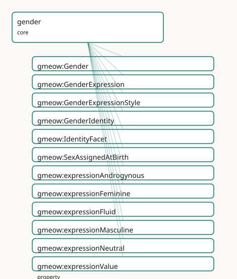

<!-- GENERATED by gmeow ontology-docs. DO NOT EDIT. -->

# GMEOW Gender Module

- **IRI:** <https://blackcatinformatics.ca/gmeow/slices/gender>
- **Tier:** core
- **[`Group`](../reference/classes/gmeow-Group.md):** core

## What This Slice Covers

This slice owns 33 terms and contributes 59 mapping or projection rows. Use it when its terms match the native fact you want to preserve; use the linkage tables to see how those facts leave GMEOW for consumer vocabularies.

## Dependencies

- [`gmeow:slices/entities`](entities.md)
- [`gmeow:slices/kernel`](kernel.md)
- [`gmeow:slices/names`](names.md)
- [`gmeow:slices/observations`](observations.md)
- [`gmeow:slices/sexuality`](sexuality.md)

## Consumers

- Identity facets on persons (P16: core by commitment); the 7-axis orthogonality matrix.

## Local Map



## Examples

### Self Asserted Facets

- **Source:** [`slices/core/gender/examples/self-asserted-facets.ttl`](https://github.com/Blackcat-Informatics/gmeow-ontology/blob/main/slices/core/gender/examples/self-asserted-facets.ttl)
- **GMEOW terms:** [`gmeow:GenderExpression`](../reference/classes/gmeow-GenderExpression.md), [`gmeow:GenderIdentity`](../reference/classes/gmeow-GenderIdentity.md), [`gmeow:IdentityFacet`](../reference/classes/gmeow-IdentityFacet.md), [`gmeow:Organization`](../reference/classes/gmeow-Organization.md), [`gmeow:Person`](../reference/classes/gmeow-Person.md), [`gmeow:displayable`](../reference/properties/gmeow-displayable.md), [`gmeow:expressionAndrogynous`](../reference/individuals/gmeow-expressionAndrogynous.md), [`gmeow:expressionValue`](../reference/properties/gmeow-expressionValue.md), [`gmeow:facetSubject`](../reference/properties/gmeow-facetSubject.md), [`gmeow:facetVantage`](../reference/properties/gmeow-facetVantage.md)

```turtle
# SPDX-FileCopyrightText: 2026 Blackcat Informatics® Inc. <paudley@blackcatinformatics.ca>
# SPDX-License-Identifier: CC-BY-4.0
#
# Worked example: gender as reified, self-asserted, co-equal facets (, P9/P10).
# Each axis is a reified gmeow:IdentityFacet (the NameUsage relator idiom), never a
# flat enum column. Four tenets are visible here:
#   • SELF-ASSERTION is the top authority — a self-asserted facet (selfAsserted
#     true) outranks an external registry record (selfAsserted false), which is
#     SUPPRESSED, never deleted (gmeow:displayable false, P10): kept for provenance,
#     never leaked or displayed.
#   • CO-EQUALITY — gender identity and gender expression are separate facets with
#     no primary/preferred slot; expression is never inferred from identity.
#   • SEX ≠ GENDER — gmeow:sexAssignedAtBirth is a RECORDED administrative datum,
#     not an IdentityFacet, and implies nothing about identity or expression.
#   • OPEN VOCABULARY — values are individuals (gmeow:genderNonBinary, …), never
#     Person subclasses and never a forced enum.
@prefix gmeow: <https://blackcatinformatics.ca/gmeow/> .
@prefix ex:    <https://blackcatinformatics.ca/gmeow/examples/gender/> .

ex:robin a gmeow:Person ;
    gmeow:name "Robin"@en ;
    gmeow:hasGenderIdentity   ex:selfId , ex:registryId ;
    gmeow:hasGenderExpression ex:expr ;
    gmeow:sexAssignedAtBirth  gmeow:saabFemale .   # recorded datum — NOT identity

# A facet is an Observation: it records its gmeow:facetSubject (whose facet) and
# gmeow:facetVantage (who asserts it). When self-asserted, the vantage IS the
# subject — that self-reference is exactly what makes it the top authority.
ex:registry a gmeow:Organization ; gmeow:name "National Records Registry"@en .

# --- The self-asserted identity: subject is its own vantage; displayed.
ex:selfId a gmeow:GenderIdentity ;
    gmeow:facetSubject  ex:robin ;
    gmeow:facetVantage  ex:robin ;
    gmeow:genderValue   gmeow:genderNonBinary ;
    gmeow:selfAsserted  true ;
    gmeow:displayable   true .

# --- An external registry's conflicting record: its vantage is the REGISTRY,
#     not Robin — kept for provenance but SUPPRESSED (P10) and never self-
#     asserted, because self-assertion outranks an imported datum.
ex:registryId a gmeow:GenderIdentity ;
    gmeow:facetSubject ex:robin ;
    gmeow:facetVantage ex:registry ;
    gmeow:genderValue  gmeow:genderWoman ;
    gmeow:selfAsserted false ;
    gmeow:displayable  false .

# --- Gender expression: a separate axis, never inferred from identity.
ex:expr a gmeow:GenderExpression ;
    gmeow:facetSubject    ex:robin ;
    gmeow:facetVantage    ex:robin ;
    gmeow:expressionValue gmeow:expressionAndrogynous ;
    gmeow:selfAsserted    true .
```

## Terms

### Classes

| Term | Label | Definition |
|---|---|---|
| [`gmeow:Gender`](../reference/classes/gmeow-Gender.md) | Gender | A gender a person may identify with — a VALUE, never a [`gmeow:Person`](../reference/classes/gmeow-Person.md) subclass. The set is open and culturally diverse; a gender not among the seed individuals i... |
| [`gmeow:GenderExpression`](../reference/classes/gmeow-GenderExpression.md) | Gender Expression | A person's SELF-ASSERTED gender expression — how they present (a [`gmeow:GenderExpressionStyle`](../reference/classes/gmeow-GenderExpressionStyle.md) value via [`gmeow:expressionValue`](../reference/properties/gmeow-expressionValue.md)). A distinct axis from gender iden... |
| [`gmeow:GenderExpressionStyle`](../reference/classes/gmeow-GenderExpressionStyle.md) | Gender Expression Style | A style of gender expression — a VALUE pointed at by [`gmeow:expressionValue`](../reference/properties/gmeow-expressionValue.md), never a subclass. Open: a style not seeded here is a fresh individual with [rdfs:lab...](http://www.w3.org/2000/01/rdf-schema#lab...) |
| [`gmeow:GenderIdentity`](../reference/classes/gmeow-GenderIdentity.md) | Gender Identity | A person's SELF-ASSERTED gender identity — what they are — as a reified facet pointing (via [`gmeow:genderValue`](../reference/properties/gmeow-genderValue.md)) to an open [`gmeow:Gender`](../reference/classes/gmeow-Gender.md) value. Independent of pr... |
| [`gmeow:IdentityFacet`](../reference/classes/gmeow-IdentityFacet.md) | Identity Facet | A reified, SELF-ASSERTED claim about an aspect of a person's identity — an observation in the universal claim stack: gender identity, gender expression,... |
| [`gmeow:SexAssignedAtBirth`](../reference/classes/gmeow-SexAssignedAtBirth.md) | Sex Assigned at Birth | A recorded sex-assigned-at-birth value pointed at by [`gmeow:sexAssignedAtBirth`](../reference/properties/gmeow-sexAssignedAtBirth.md) — a VALUE, never a subclass. Deliberately coarse and inclusive (incl. intersex);... |

### Properties

| Term | Label | Definition |
|---|---|---|
| [`gmeow:expressionValue`](../reference/properties/gmeow-expressionValue.md) | expression value | The [`gmeow:GenderExpressionStyle`](../reference/classes/gmeow-GenderExpressionStyle.md) value a gender-expression facet asserts (functional per facet). A predefined individual or a fresh one with [rdfs:label](http://www.w3.org/2000/01/rdf-schema#label); the sin... |
| [`gmeow:genderValue`](../reference/properties/gmeow-genderValue.md) | gender value | The [`gmeow:Gender`](../reference/classes/gmeow-Gender.md) value a gender-identity facet asserts (functional PER FACET — one value each; multiplicity is expressed by multiple facets). The value is a gm... |
| [`gmeow:hasGenderExpression`](../reference/properties/gmeow-hasGenderExpression.md) | has gender expression | Relates a person to a self-asserted gender-expression facet. Non-functional and contextual. MUST NOT be inferred from [`gmeow:hasGenderIdentity`](../reference/properties/gmeow-hasGenderIdentity.md), gmeow:sexAssigne... |
| [`gmeow:hasGenderIdentity`](../reference/properties/gmeow-hasGenderIdentity.md) | has gender identity | Relates a person to a self-asserted gender-identity facet they hold. Non-functional and contextual — a person bears many co-equal identities; a superseded one... |
| [`gmeow:intersexVariation`](../reference/properties/gmeow-intersexVariation.md) | intersex variation | An optional free-text note recording an intersex variation, for inclusivity where [`gmeow:sexAssignedAtBirth`](../reference/properties/gmeow-sexAssignedAtBirth.md) [`gmeow:saabIntersex`](../reference/individuals/gmeow-saabIntersex.md) is insufficient. Deliberately a p... |
| [`gmeow:selfAsserted`](../reference/properties/gmeow-selfAsserted.md) | self-asserted | Whether an identity facet was asserted by the person themselves (true — the top authority) rather than recorded or inferred by a third party (false). Also usab... |
| [`gmeow:sexAssignedAtBirth`](../reference/properties/gmeow-sexAssignedAtBirth.md) | sex assigned at birth | The sex recorded for a person at birth (a [`gmeow:SexAssignedAtBirth`](../reference/classes/gmeow-SexAssignedAtBirth.md) value) — a RECORDED administrative datum, NOT a self-asserted identity and NOT a gufo Identi... |

### Individuals

| Term | Label | Definition |
|---|---|---|
| [`gmeow:expressionAndrogynous`](../reference/individuals/gmeow-expressionAndrogynous.md) | androgynous | The androgynous gender expression style — a stylistic presentation of gender through behavior, appearance, or self-presentation. |
| [`gmeow:expressionFeminine`](../reference/individuals/gmeow-expressionFeminine.md) | feminine | The feminine gender expression style — a stylistic presentation of gender through behavior, appearance, or self-presentation. |
| [`gmeow:expressionFluid`](../reference/individuals/gmeow-expressionFluid.md) | fluid | The fluid gender expression style — a stylistic presentation of gender through behavior, appearance, or self-presentation. |
| [`gmeow:expressionMasculine`](../reference/individuals/gmeow-expressionMasculine.md) | masculine | The masculine gender expression style — a stylistic presentation of gender through behavior, appearance, or self-presentation. |
| [`gmeow:expressionNeutral`](../reference/individuals/gmeow-expressionNeutral.md) | neutral | The neutral gender expression style — a stylistic presentation of gender through behavior, appearance, or self-presentation. |
| [`gmeow:genderAgender`](../reference/individuals/gmeow-genderAgender.md) | agender | The agender gender — a gender identity value that an agent may self-assert or be described by. |
| [`gmeow:genderBigender`](../reference/individuals/gmeow-genderBigender.md) | bigender | The bigender gender — a gender identity value that an agent may self-assert or be described by. |
| [`gmeow:genderDemiboy`](../reference/individuals/gmeow-genderDemiboy.md) | demiboy | The demiboy gender — a gender identity value that an agent may self-assert or be described by. |
| [`gmeow:genderDemigirl`](../reference/individuals/gmeow-genderDemigirl.md) | demigirl | The demigirl gender — a gender identity value that an agent may self-assert or be described by. |
| [`gmeow:genderGenderfluid`](../reference/individuals/gmeow-genderGenderfluid.md) | genderfluid | The genderfluid gender — a gender identity value that an agent may self-assert or be described by. |
| [`gmeow:genderGenderqueer`](../reference/individuals/gmeow-genderGenderqueer.md) | genderqueer | The genderqueer gender — a gender identity value that an agent may self-assert or be described by. |
| [`gmeow:genderMan`](../reference/individuals/gmeow-genderMan.md) | man | The man gender — a gender identity value that an agent may self-assert or be described by. |
| [`gmeow:genderNonBinary`](../reference/individuals/gmeow-genderNonBinary.md) | non-binary | The non binary gender — a gender identity value that an agent may self-assert or be described by. |
| [`gmeow:genderQuestioning`](../reference/individuals/gmeow-genderQuestioning.md) | questioning | The questioning gender — a gender identity value that an agent may self-assert or be described by. |
| [`gmeow:genderTwoSpirit`](../reference/individuals/gmeow-genderTwoSpirit.md) | Two-Spirit | The two spirit gender — a gender identity value that an agent may self-assert or be described by. |
| [`gmeow:genderWoman`](../reference/individuals/gmeow-genderWoman.md) | woman | The woman gender — a gender identity value that an agent may self-assert or be described by. |
| [`gmeow:saabFemale`](../reference/individuals/gmeow-saabFemale.md) | assigned female | The female sex assigned at birth — a category used to record sex assigned to a person at birth. |
| [`gmeow:saabIntersex`](../reference/individuals/gmeow-saabIntersex.md) | intersex | The intersex sex assigned at birth — a category used to record sex assigned to a person at birth. |
| [`gmeow:saabMale`](../reference/individuals/gmeow-saabMale.md) | assigned male | The male sex assigned at birth — a category used to record sex assigned to a person at birth. |
| [`gmeow:saabUnknown`](../reference/individuals/gmeow-saabUnknown.md) | unknown / not recorded | The unknown sex assigned at birth — a category used to record sex assigned to a person at birth. |

## Linkages

- **Rows:** 59
- **Projection profiles:** `foaf`, `gedcom`, `schema-org`
- **External vocabularies:** `fhir`, `foaf`, `gedcom`, `gsso`, `homosaurus`, `schema`, `sosa`, `wd`, `wdt`

| Source | Kind | Profile | Predicate/Relation | Target | Evidence |
|---|---|---|---|---|---|
| [`gmeow:GenderIdentity`](../reference/classes/gmeow-GenderIdentity.md) | equivalence | `-` | [skos:closeMatch](http://www.w3.org/2004/02/skos/core#closeMatch) | [homosaurus:homoit0000571](https://homosaurus.org/v4/homoit0000571) | `gmeow-gender.sssom.tsv`; `gmeow:eqGender001`; confidence 0.8 |
| [`gmeow:IdentityFacet`](../reference/classes/gmeow-IdentityFacet.md) | equivalence | `-` | [skos:closeMatch](http://www.w3.org/2004/02/skos/core#closeMatch) | [sosa:Observation](http://www.w3.org/ns/sosa/Observation) | `gmeow-observations.sssom.tsv`; `gmeow:eqObs020`; confidence 0.85 |
| [`gmeow:genderAgender`](../reference/individuals/gmeow-genderAgender.md) | equivalence | `-` | [skos:closeMatch](http://www.w3.org/2004/02/skos/core#closeMatch) | [homosaurus:homoit0000021](https://homosaurus.org/v4/homoit0000021) | `gmeow-gender.sssom.tsv`; `gmeow:eqGender012`; confidence 0.9 |
| [`gmeow:genderAgender`](../reference/individuals/gmeow-genderAgender.md) | equivalence | `-` | [skos:closeMatch](http://www.w3.org/2004/02/skos/core#closeMatch) | [wd:Q505371](https://www.wikidata.org/wiki/Q505371) | `gmeow-gender.sssom.tsv`; `gmeow:eqGender013`; confidence 0.9 |
| [`gmeow:genderBigender`](../reference/individuals/gmeow-genderBigender.md) | equivalence | `-` | [skos:closeMatch](http://www.w3.org/2004/02/skos/core#closeMatch) | [wd:Q859614](https://www.wikidata.org/wiki/Q859614) | `gmeow-gender.sssom.tsv`; `gmeow:eqGender019`; confidence 0.85 |
| [`gmeow:genderGenderfluid`](../reference/individuals/gmeow-genderGenderfluid.md) | equivalence | `-` | [skos:closeMatch](http://www.w3.org/2004/02/skos/core#closeMatch) | [homosaurus:homoit0000570](https://homosaurus.org/v4/homoit0000570) | `gmeow-gender.sssom.tsv`; `gmeow:eqGender017`; confidence 0.9 |
| [`gmeow:genderGenderfluid`](../reference/individuals/gmeow-genderGenderfluid.md) | equivalence | `-` | [skos:closeMatch](http://www.w3.org/2004/02/skos/core#closeMatch) | [wd:Q18116794](https://www.wikidata.org/wiki/Q18116794) | `gmeow-gender.sssom.tsv`; `gmeow:eqGender018`; confidence 0.9 |
| [`gmeow:genderGenderqueer`](../reference/individuals/gmeow-genderGenderqueer.md) | equivalence | `-` | [skos:closeMatch](http://www.w3.org/2004/02/skos/core#closeMatch) | gsso:000131 | `gmeow-gender.sssom.tsv`; `gmeow:eqGender015`; confidence 0.85 |
| [`gmeow:genderGenderqueer`](../reference/individuals/gmeow-genderGenderqueer.md) | equivalence | `-` | [skos:closeMatch](http://www.w3.org/2004/02/skos/core#closeMatch) | [homosaurus:homoit0001921](https://homosaurus.org/v4/homoit0001921) | `gmeow-gender.sssom.tsv`; `gmeow:eqGender014`; confidence 0.85 |
| [`gmeow:genderGenderqueer`](../reference/individuals/gmeow-genderGenderqueer.md) | equivalence | `-` | [skos:closeMatch](http://www.w3.org/2004/02/skos/core#closeMatch) | [wd:Q12964198](https://www.wikidata.org/wiki/Q12964198) | `gmeow-gender.sssom.tsv`; `gmeow:eqGender016`; confidence 0.85 |
| [`gmeow:genderMan`](../reference/individuals/gmeow-genderMan.md) | equivalence | `-` | [skos:closeMatch](http://www.w3.org/2004/02/skos/core#closeMatch) | gsso:000370 | `gmeow-gender.sssom.tsv`; `gmeow:eqGender007`; confidence 0.85 |
| [`gmeow:genderMan`](../reference/individuals/gmeow-genderMan.md) | equivalence | `-` | [skos:closeMatch](http://www.w3.org/2004/02/skos/core#closeMatch) | [homosaurus:homoit0001008](https://homosaurus.org/v4/homoit0001008) | `gmeow-gender.sssom.tsv`; `gmeow:eqGender008`; confidence 0.8 |
| [`gmeow:genderNonBinary`](../reference/individuals/gmeow-genderNonBinary.md) | equivalence | `-` | [skos:closeMatch](http://www.w3.org/2004/02/skos/core#closeMatch) | gsso:000395 | `gmeow-gender.sssom.tsv`; `gmeow:eqGender010`; confidence 0.9 |
| [`gmeow:genderNonBinary`](../reference/individuals/gmeow-genderNonBinary.md) | equivalence | `-` | [skos:closeMatch](http://www.w3.org/2004/02/skos/core#closeMatch) | [homosaurus:homoit0001048](https://homosaurus.org/v4/homoit0001048) | `gmeow-gender.sssom.tsv`; `gmeow:eqGender009`; confidence 0.9 |
| [`gmeow:genderNonBinary`](../reference/individuals/gmeow-genderNonBinary.md) | equivalence | `-` | [skos:closeMatch](http://www.w3.org/2004/02/skos/core#closeMatch) | [wd:Q48270](https://www.wikidata.org/wiki/Q48270) | `gmeow-gender.sssom.tsv`; `gmeow:eqGender011`; confidence 0.9 |
| [`gmeow:genderTwoSpirit`](../reference/individuals/gmeow-genderTwoSpirit.md) | equivalence | `-` | [skos:closeMatch](http://www.w3.org/2004/02/skos/core#closeMatch) | gsso:007398 | `gmeow-gender.sssom.tsv`; `gmeow:eqGender021`; confidence 0.9 |
| [`gmeow:genderTwoSpirit`](../reference/individuals/gmeow-genderTwoSpirit.md) | equivalence | `-` | [skos:closeMatch](http://www.w3.org/2004/02/skos/core#closeMatch) | [homosaurus:homoit0001480](https://homosaurus.org/v4/homoit0001480) | `gmeow-gender.sssom.tsv`; `gmeow:eqGender020`; confidence 0.9 |
| [`gmeow:genderTwoSpirit`](../reference/individuals/gmeow-genderTwoSpirit.md) | equivalence | `-` | [skos:closeMatch](http://www.w3.org/2004/02/skos/core#closeMatch) | [wd:Q301702](https://www.wikidata.org/wiki/Q301702) | `gmeow-gender.sssom.tsv`; `gmeow:eqGender022`; confidence 0.85 |
| [`gmeow:genderValue`](../reference/properties/gmeow-genderValue.md) | equivalence | `-` | [skos:closeMatch](http://www.w3.org/2004/02/skos/core#closeMatch) | [foaf:gender](http://xmlns.com/foaf/0.1/gender) | `gmeow-gender.sssom.tsv`; `gmeow:eqGender003`; confidence 0.6 |
| [`gmeow:genderValue`](../reference/properties/gmeow-genderValue.md) | equivalence | `-` | [skos:closeMatch](http://www.w3.org/2004/02/skos/core#closeMatch) | [schema:gender](https://schema.org/gender) | `gmeow-gender.sssom.tsv`; `gmeow:eqGender002`; confidence 0.7 |
| [`gmeow:genderValue`](../reference/properties/gmeow-genderValue.md) | equivalence | `-` | [skos:closeMatch](http://www.w3.org/2004/02/skos/core#closeMatch) | [wdt:P21](https://www.wikidata.org/wiki/Property:P21) | `gmeow-gender.sssom.tsv`; `gmeow:eqGender004`; confidence 0.85 |
| [`gmeow:genderWoman`](../reference/individuals/gmeow-genderWoman.md) | equivalence | `-` | [skos:closeMatch](http://www.w3.org/2004/02/skos/core#closeMatch) | gsso:000369 | `gmeow-gender.sssom.tsv`; `gmeow:eqGender005`; confidence 0.85 |
| [`gmeow:genderWoman`](../reference/individuals/gmeow-genderWoman.md) | equivalence | `-` | [skos:closeMatch](http://www.w3.org/2004/02/skos/core#closeMatch) | [homosaurus:homoit0001509](https://homosaurus.org/v4/homoit0001509) | `gmeow-gender.sssom.tsv`; `gmeow:eqGender006`; confidence 0.8 |
| [`gmeow:saabFemale`](../reference/individuals/gmeow-saabFemale.md) | equivalence | `-` | [skos:closeMatch](http://www.w3.org/2004/02/skos/core#closeMatch) | [wd:Q6581072](https://www.wikidata.org/wiki/Q6581072) | `gmeow-gender.sssom.tsv`; `gmeow:eqGender025`; confidence 0.8 |
|... |... |... |... |... | 35 more rows |

## Guide

<!-- SPDX-FileCopyrightText: 2026 Blackcat Informatics® Inc. <paudley@blackcatinformatics.ca> -->
<!-- SPDX-License-Identifier: CC-BY-4.0 -->

# Gender — self-asserted identity facets, never inferred, never erased

> **Slice:** `https://blackcatinformatics.ca/gmeow/slices/gender` · **tier: core**
> The shared [`IdentityFacet`](../reference/classes/gmeow-IdentityFacet.md) base, and the gender-identity / gender-expression /
> sex-assigned-at-birth axes of the seven-axis orthogonality matrix.

Most schemas have a `gender` column: an enum, single-valued, often silently inferred from a
title or a pronoun. GMEOW refuses every part of that. A gender is a **reified, self-asserted
claim** — an [`IdentityFacet`](../reference/classes/gmeow-IdentityFacet.md), the same relator idiom as names' [`NameUsage`](../reference/classes/gmeow-NameUsage.md) — never a bare
property; the value space is an **open vocabulary of individuals**, never an enum and never a
[`Person`](../reference/classes/gmeow-Person.md) subclass ([Principle 9](https://github.com/Blackcat-Informatics/gmeow-ontology/blob/main/CONSTITUTION.md#principle-9): inclusive without overtyping); a person bears **many co-equal
facets** with deliberately *no* primary/preferred term, because a primary-gender slot encodes
the same hierarchy a primary-name slot does ([Principle 9](https://github.com/Blackcat-Informatics/gmeow-ontology/blob/main/CONSTITUTION.md#principle-9), anti-colonial in both directions —
the seeds neither force Western categories nor appropriate culturally-specific ones:
Two-Spirit carries a scope note restricting it to self-referential Indigenous North American
use). **Self-assertion is the top authority** ([Principle 9](https://github.com/Blackcat-Informatics/gmeow-ontology/blob/main/CONSTITUTION.md#principle-9)): a facet the person asserted
outranks any registry or import, and is never silently overwritten.

A superseded label is **suppressed, never erased** ([Principle 10](https://github.com/Blackcat-Informatics/gmeow-ontology/blob/main/CONSTITUTION.md#principle-10)): [`gmeow:displayable`](../reference/properties/gmeow-displayable.md) false
— the deadname analog — keeps the history while preventing the leak. And none of this is
optional: identity slices sit in **core by commitment** ([Principle 16](https://github.com/Blackcat-Informatics/gmeow-ontology/blob/main/CONSTITUTION.md#principle-16)) — GMEOW refuses to
make respectful identity an extension someone might not load.

## The seven-axis orthogonality matrix

Seven identity axes span three modules — **[`GenderIdentity`](../reference/classes/gmeow-GenderIdentity.md)**, **[`GenderExpression`](../reference/classes/gmeow-GenderExpression.md)**, and
**[`SexAssignedAtBirth`](../reference/classes/gmeow-SexAssignedAtBirth.md)** here; **[`SexualOrientation`](../reference/classes/gmeow-SexualOrientation.md)** and **[`RomanticOrientation`](../reference/classes/gmeow-RomanticOrientation.md)** in the
sexuality slice; **[`PronounSet`](../reference/classes/gmeow-PronounSet.md)** and **[`Honorific`](../reference/classes/gmeow-Honorific.md)** in names — and they are **pairwise
disjoint with no inferential bridge in any direction**. Address ≠ identity: pronouns say how
a person is *addressed*, never what they *are*. Sex ≠ gender: sex-at-birth is a recorded
administrative datum, not an identity. Nothing infers expression from identity, orientation
from gender, or anything from anything. The disjointness is a reasoner **theorem**
([`owl:AllDisjointClasses`](http://www.w3.org/2002/07/owl#AllDisjointClasses) over both the facet classes and their value spaces, OWL 2
EL-visible —); the bridge-*absence* half, which OWL cannot say, stays a
closed-world lint (`tests/test_identity_orthogonality.py`).

## The facet base

### [`gmeow:IdentityFacet`](../reference/classes/gmeow-IdentityFacet.md)

The shared root: a reified, self-asserted claim about an aspect of a person's identity — a
[`gufo:Relator`](../external/terms.md#gufo-relator) *and* a [`gmeow:Observation`](../reference/classes/gmeow-Observation.md) in the universal claim stack,
mediating the person ([`facetSubject`](../reference/properties/gmeow-facetSubject.md)) and an open identity value, with the asserting agent
as [`facetVantage`](../reference/properties/gmeow-facetVantage.md). Carries the optional [`validFrom`](../reference/properties/gmeow-validFrom.md)/[`validUntil`](../reference/properties/gmeow-validUntil.md) clocks and the
[`gmeow:displayable`](../reference/properties/gmeow-displayable.md) control. The sexuality slice's two orientation facets subclass this same
base.

### [`gmeow:selfAsserted`](../reference/properties/gmeow-selfAsserted.md)

The authority marker: `true` when the person asserted the facet themselves (the top
authority), `false` for a third-party record. Non-functional — a multi-source merge carries
both, coexisting rather than contradicting ([Principle 9](https://github.com/Blackcat-Informatics/gmeow-ontology/blob/main/CONSTITUTION.md#principle-9)'s standpoint stance). Also usable as
a statement-level RDF 1.2 annotation on a quoted claim.

## The three axes in this slice

### [`gmeow:GenderIdentity`](../reference/classes/gmeow-GenderIdentity.md) · [`gmeow:hasGenderIdentity`](../reference/properties/gmeow-hasGenderIdentity.md) · [`gmeow:genderValue`](../reference/properties/gmeow-genderValue.md)

What a person **is**. [`hasGenderIdentity`](../reference/properties/gmeow-hasGenderIdentity.md) is non-functional — bigender is two co-equal
facets, genderfluid and transition are facets over time — and MUST NOT be inferred from
pronouns, honorifics, expression, or sex-at-birth. [`genderValue`](../reference/properties/gmeow-genderValue.md) is functional *per facet*
(one value each; multiplicity is more facets) and is the **single path** to the value: there
is deliberately no flat `gmeow:gender` shortcut to grow stale.

### [`gmeow:GenderExpression`](../reference/classes/gmeow-GenderExpression.md) · [`gmeow:hasGenderExpression`](../reference/properties/gmeow-hasGenderExpression.md) · [`gmeow:expressionValue`](../reference/properties/gmeow-expressionValue.md)

How a person **presents** — a separate axis: a masculine-presenting woman and a
feminine-presenting man are directly expressible with no tension, because expression is
never derived from identity (or vice versa). Same shape: non-functional bearer property,
functional-per-facet value path to an open [`GenderExpressionStyle`](../reference/classes/gmeow-GenderExpressionStyle.md).

### [`gmeow:sexAssignedAtBirth`](../reference/properties/gmeow-sexAssignedAtBirth.md)

A **recorded administrative datum** — not an [`IdentityFacet`](../reference/classes/gmeow-IdentityFacet.md), not self-asserted, never
equated with or implied by gender identity/expression. Non-functional so a correction and a
prior record coexist (multi-source honesty). Historical/genealogical records keep external
[`gedcom:sex`](http://www.w3.org/2000/10/swap/pim/gedcom#sex); this is GMEOW's native, value-vocabulary-backed term.

### [`gmeow:intersexVariation`](../reference/properties/gmeow-intersexVariation.md)

An optional free-text note for inclusivity where [`gmeow:saabIntersex`](../reference/individuals/gmeow-saabIntersex.md) alone is insufficient.
Deliberately a plain note: GMEOW does not model clinical sex characteristics or a DSD
taxonomy — that depth would be overtyping in exactly the sense [Principle 9](https://github.com/Blackcat-Informatics/gmeow-ontology/blob/main/CONSTITUTION.md#principle-9) forbids.

## The value vocabularies

### [`gmeow:Gender`](../reference/classes/gmeow-Gender.md) · [`gmeow:GenderExpressionStyle`](../reference/classes/gmeow-GenderExpressionStyle.md) · [`gmeow:SexAssignedAtBirth`](../reference/classes/gmeow-SexAssignedAtBirth.md)

Open value vocabularies of individuals under [`gufo:QualityValue`](../external/terms.md#gufo-qualityvalue) — never [`Person`](../reference/classes/gmeow-Person.md)
subclasses, never a closed enum. The seeds (woman, man, non-binary, agender, genderfluid,
genderqueer, bigender, demigirl, demiboy, Two-Spirit, questioning; feminine through neutral;
the four coarse sex-at-birth values) are **anchors, not a fence**: an identity not seeded is
a *fresh individual* carrying [`rdfs:label`](http://www.w3.org/2000/01/rdf-schema#label) — the names module's custom-[`PronounSet`](../reference/classes/gmeow-PronounSet.md) idiom —
never a flat literal. The three value spaces are themselves pairwise disjoint, so a raw
value can never cross axes.

```turtle
ex:robin a gmeow:Person ;
    gmeow:hasGenderIdentity ex:facetNb , ex:facetPrior .

ex:facetNb a gmeow:GenderIdentity ;            # current, self-asserted
    gmeow:genderValue gmeow:genderNonBinary ;
    gmeow:selfAsserted true .

ex:facetPrior a gmeow:GenderIdentity ;         # superseded — suppressed, kept
    gmeow:genderValue gmeow:genderMan ;
    gmeow:displayable false .                  # Principle 10: never deleted
```

## Boundaries, solver, and alignment

Closed-world cardinality ("exactly one value per facet", "exactly one subject") is
deliberately **not** OWL — it is SHACL's job (phase 3), keeping the reasoned core
EL-friendly ([Principle 12](https://github.com/Blackcat-Informatics/gmeow-ontology/blob/main/CONSTITUTION.md#principle-12)'s boundary discipline: the ontology states the relata, the gates
check the counts). Alignment is lossy by design: GSSO, Homosaurus, Wikidata, schema.org,
FOAF and HL7/FHIR mappings live in `mappings/gmeow-gender.sssom.tsv`, and flat targets like
[`schema:gender`](https://schema.org/gender) receive a documented downcast — the reified, self-asserted, co-equal
machinery is canonical and survives only here ([Principle 4](https://github.com/Blackcat-Informatics/gmeow-ontology/blob/main/CONSTITUTION.md#principle-4)). The full rationale is in
[`identity-mapping.md`](../../../docs/identity-mapping.md).

## Dependencies

Depends on `kernel`, `entities`, `names` (the displayable control and the relator idiom),
`observations` (the claim stack), and `sexuality` (the matrix axioms span both). Consumed by
every person-bearing dataset: identity facets on persons are core by commitment
([Principle 16](https://github.com/Blackcat-Informatics/gmeow-ontology/blob/main/CONSTITUTION.md#principle-16)).
