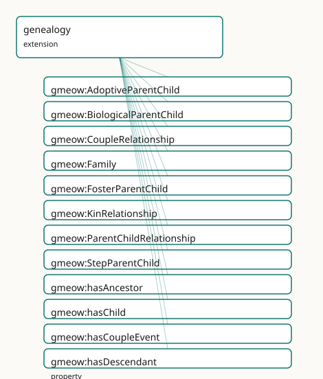

<!-- GENERATED by gmeow ontology-docs. DO NOT EDIT. -->

# GMEOW Genealogy Module

- **IRI:** <https://blackcatinformatics.ca/gmeow/slices/genealogy>
- **Tier:** extension
- **[`Group`](../reference/classes/gmeow-Group.md):** extensions

## What This Slice Covers

This slice owns 21 terms and contributes 47 mapping or projection rows. Use it when its terms match the native fact you want to preserve; use the linkage tables to see how those facts leave GMEOW for consumer vocabularies.

## Dependencies

- [`gmeow:slices/entities`](entities.md)
- [`gmeow:slices/kernel`](kernel.md)
- [`gmeow:slices/observations`](observations.md)

## Consumers

- Kin relationships for the family-history use of the mail corpus; GEDCOM alignment.

## Local Map



## Examples

### Biological And Adoptive

- **Source:** [`slices/extensions/genealogy/examples/biological-and-adoptive.ttl`](https://github.com/Blackcat-Informatics/gmeow-ontology/blob/main/slices/extensions/genealogy/examples/biological-and-adoptive.ttl)
- **GMEOW terms:** [`gmeow:AdoptiveParentChild`](../reference/classes/gmeow-AdoptiveParentChild.md), [`gmeow:BiologicalParentChild`](../reference/classes/gmeow-BiologicalParentChild.md), [`gmeow:Person`](../reference/classes/gmeow-Person.md), [`gmeow:hasFather`](../reference/properties/gmeow-hasFather.md), [`gmeow:hasParent`](../reference/properties/gmeow-hasParent.md), [`gmeow:name`](../reference/properties/gmeow-name.md), [`gmeow:relationshipChild`](../reference/properties/gmeow-relationshipChild.md), [`gmeow:relationshipParent`](../reference/properties/gmeow-relationshipParent.md)

```turtle
# SPDX-FileCopyrightText: 2026 Blackcat Informatics® Inc. <paudley@blackcatinformatics.ca>
# SPDX-License-Identifier: CC-BY-4.0
#
# Worked example: parent-child is not one relation (Principle 9). Most schemas have
# a single "parent" field; GMEOW reifies the KIND of parentage, so a child's
# BIOLOGICAL and ADOPTIVE parents COEXIST rather than overwrite. A
# gmeow:BiologicalParentChild and a gmeow:AdoptiveParentChild (siblings of
# Foster/Step) each bind a gmeow:relationshipParent to a gmeow:relationshipChild.
# Flat gmeow:hasParent / gmeow:hasFather remain available as the simple view; the
# reified relations carry the distinction the flat edges can't.
@prefix gmeow: <https://blackcatinformatics.ca/gmeow/> .
@prefix ex:    <https://blackcatinformatics.ca/gmeow/examples/genealogy/> .

ex:alex     a gmeow:Person ; gmeow:name "Alex"@en ; gmeow:hasParent ex:birthFather , ex:adoptiveMother .
ex:birthFather    a gmeow:Person ; gmeow:name "Jordan (birth father)"@en .
ex:adoptiveMother a gmeow:Person ; gmeow:name "Priya (adoptive mother)"@en .

# --- The two parentages coexist — neither erases the other (P9). A child has a
#     biological father AND an adoptive mother, each a distinct reified relation;
#     the flat gmeow:hasParent edges above are the simple, kind-blind view.
ex:biological a gmeow:BiologicalParentChild ;
    gmeow:relationshipParent ex:birthFather ;
    gmeow:relationshipChild  ex:alex .

ex:adoptive a gmeow:AdoptiveParentChild ;
    gmeow:relationshipParent ex:adoptiveMother ;
    gmeow:relationshipChild  ex:alex .
```

## Terms

### Classes

| Term | Label | Definition |
|---|---|---|
| [`gmeow:AdoptiveParentChild`](../reference/classes/gmeow-AdoptiveParentChild.md) | Adoptive Parent-Child | A parent-child relationship established by adoption. |
| [`gmeow:BiologicalParentChild`](../reference/classes/gmeow-BiologicalParentChild.md) | Biological Parent-Child | A parent-child relationship by biological descent. |
| [`gmeow:CoupleRelationship`](../reference/classes/gmeow-CoupleRelationship.md) | Couple Relationship | A reified couple relationship (marriage, civil union, or partnership) between two persons; bears marriage, divorce and related events. |
| [`gmeow:Family`](../reference/classes/gmeow-Family.md) | Family | A kinship group of persons related by descent, marriage, or adoption. |
| [`gmeow:FosterParentChild`](../reference/classes/gmeow-FosterParentChild.md) | Foster Parent-Child | A parent-child relationship through fostering. |
| [`gmeow:KinRelationship`](../reference/classes/gmeow-KinRelationship.md) | Kin Relationship | A reified kinship relationship between persons, modelled as an observation (a claim-from-a-vantage) in the universal stack (observation-spine bridge). Able to... |
| [`gmeow:ParentChildRelationship`](../reference/classes/gmeow-ParentChildRelationship.md) | Parent-Child Relationship | A reified parent-child relationship, typed by its nature (biological, adoptive, step, or foster). |
| [`gmeow:StepParentChild`](../reference/classes/gmeow-StepParentChild.md) | Step Parent-Child | A parent-child relationship through marriage to a biological/adoptive parent. |

### Properties

| Term | Label | Definition |
|---|---|---|
| [`gmeow:hasAncestor`](../reference/properties/gmeow-hasAncestor.md) | has ancestor | Relates a person to an ancestor — a parent, a parent's parent, and so on. Transitive: an ancestor of an ancestor is an ancestor. [`gmeow:hasParent`](../reference/properties/gmeow-hasParent.md) (hence gmeow:h... |
| [`gmeow:hasChild`](../reference/properties/gmeow-hasChild.md) | has child | Relates a person to a child; the inverse of hasParent. |
| [`gmeow:hasCoupleEvent`](../reference/properties/gmeow-hasCoupleEvent.md) | has couple event | Relates a couple relationship to an event in its history — the marriage, the divorce, an anniversary (project homepage and language). The seam the GEDCOM proje... |
| [`gmeow:hasDescendant`](../reference/properties/gmeow-hasDescendant.md) | has descendant | Relates a person to a descendant — a child, a child's child, and so on; the transitive inverse of [`gmeow:hasAncestor`](../reference/properties/gmeow-hasAncestor.md). Derived by the reasoner ([`gmeow:hasChild`](../reference/properties/gmeow-hasChild.md) is... |
| [`gmeow:hasFather`](../reference/properties/gmeow-hasFather.md) | has father | Relates a person to a male parent. |
| [`gmeow:hasMother`](../reference/properties/gmeow-hasMother.md) | has mother | Relates a person to a female parent. |
| [`gmeow:hasParent`](../reference/properties/gmeow-hasParent.md) | has parent | Relates a person to a parent (any kind: biological, adoptive, step, or foster). Non-functional: contested parentage claims from multiple sources coexist as sta... |
| [`gmeow:hasPartner`](../reference/properties/gmeow-hasPartner.md) | has partner | Relates a couple relationship to one of its two partners. |
| [`gmeow:hasSibling`](../reference/properties/gmeow-hasSibling.md) | has sibling | Relates a person to a sibling; symmetric. |
| [`gmeow:hasSpouse`](../reference/properties/gmeow-hasSpouse.md) | has spouse | Relates a person to a spouse; symmetric. |
| [`gmeow:relationshipChild`](../reference/properties/gmeow-relationshipChild.md) | relationship child | The child in a reified parent-child relationship. |
| [`gmeow:relationshipParent`](../reference/properties/gmeow-relationshipParent.md) | relationship parent | The parent in a reified parent-child relationship. |
| [`gmeow:withinFamily`](../reference/properties/gmeow-withinFamily.md) | within family | Anchors a reified kinship relationship in the family group it belongs to — the structural seam GEDCOM exchange requires (a child's family, a marriage's family)... |

## Linkages

- **Rows:** 47
- **Projection profiles:** `foaf`, `gedcom`
- **External vocabularies:** `bio`, `foaf`, `gedcom`, `gx`, `rdf`, `rel`, `schema`, `sosa`, `wd`, `wdt`

| Source | Kind | Profile | Predicate/Relation | Target | Evidence |
|---|---|---|---|---|---|
| [`gmeow:AdoptiveParentChild`](../reference/classes/gmeow-AdoptiveParentChild.md) | equivalence | `-` | [skos:closeMatch](http://www.w3.org/2004/02/skos/core#closeMatch) | [gx:AdoptiveParent](http://gedcomx.org/AdoptiveParent) | `gmeow-genealogy.sssom.tsv`; `gmeow:eqGenealogy047`; confidence 0.9 |
| [`gmeow:BiologicalParentChild`](../reference/classes/gmeow-BiologicalParentChild.md) | equivalence | `-` | [skos:closeMatch](http://www.w3.org/2004/02/skos/core#closeMatch) | [gx:BiologicalParent](http://gedcomx.org/BiologicalParent) | `gmeow-genealogy.sssom.tsv`; `gmeow:eqGenealogy046`; confidence 0.9 |
| [`gmeow:CoupleRelationship`](../reference/classes/gmeow-CoupleRelationship.md) | equivalence | `-` | [skos:closeMatch](http://www.w3.org/2004/02/skos/core#closeMatch) | [gx:Couple](http://gedcomx.org/Couple) | `gmeow-genealogy.sssom.tsv`; `gmeow:eqGenealogy044`; confidence 0.95 |
| [`gmeow:Family`](../reference/classes/gmeow-Family.md) | equivalence | `-` | [owl:equivalentClass](http://www.w3.org/2002/07/owl#equivalentClass) | [gedcom:Family](http://www.w3.org/2000/10/swap/pim/gedcom#Family) | `gmeow-classes.sssom.tsv`; `gmeow:eqClasses033`; confidence 1 |
| [`gmeow:Family`](../reference/classes/gmeow-Family.md) | equivalence | `-` | [skos:exactMatch](http://www.w3.org/2004/02/skos/core#exactMatch) | [wd:Q8436](https://www.wikidata.org/wiki/Q8436) | `gmeow-wikidata.sssom.tsv`; `gmeow:eqWikidata005`; confidence 0.9 |
| [`gmeow:FosterParentChild`](../reference/classes/gmeow-FosterParentChild.md) | equivalence | `-` | [skos:closeMatch](http://www.w3.org/2004/02/skos/core#closeMatch) | [gx:FosterParent](http://gedcomx.org/FosterParent) | `gmeow-genealogy.sssom.tsv`; `gmeow:eqGenealogy049`; confidence 0.9 |
| [`gmeow:KinRelationship`](../reference/classes/gmeow-KinRelationship.md) | equivalence | `-` | [skos:closeMatch](http://www.w3.org/2004/02/skos/core#closeMatch) | [sosa:Observation](http://www.w3.org/ns/sosa/Observation) | `gmeow-observations.sssom.tsv`; `gmeow:eqObs023`; confidence 0.8 |
| [`gmeow:ParentChildRelationship`](../reference/classes/gmeow-ParentChildRelationship.md) | equivalence | `-` | [skos:closeMatch](http://www.w3.org/2004/02/skos/core#closeMatch) | [gx:ParentChild](http://gedcomx.org/ParentChild) | `gmeow-genealogy.sssom.tsv`; `gmeow:eqGenealogy045`; confidence 0.95 |
| [`gmeow:StepParentChild`](../reference/classes/gmeow-StepParentChild.md) | equivalence | `-` | [skos:closeMatch](http://www.w3.org/2004/02/skos/core#closeMatch) | [gx:StepParent](http://gedcomx.org/StepParent) | `gmeow-genealogy.sssom.tsv`; `gmeow:eqGenealogy048`; confidence 0.9 |
| [`gmeow:hasChild`](../reference/properties/gmeow-hasChild.md) | equivalence | `-` | [skos:closeMatch](http://www.w3.org/2004/02/skos/core#closeMatch) | [bio:child](http://purl.org/vocab/bio/0.1/child) | `gmeow-genealogy.sssom.tsv`; `gmeow:eqGenealogy056`; confidence 0.9 |
| [`gmeow:hasChild`](../reference/properties/gmeow-hasChild.md) | equivalence | `-` | [skos:closeMatch](http://www.w3.org/2004/02/skos/core#closeMatch) | [gedcom:child](http://www.w3.org/2000/10/swap/pim/gedcom#child) | `gmeow-genealogy.sssom.tsv`; `gmeow:eqGenealogy071`; confidence 0.8 |
| [`gmeow:hasChild`](../reference/properties/gmeow-hasChild.md) | equivalence | `-` | [owl:equivalentProperty](http://www.w3.org/2002/07/owl#equivalentProperty) | [rel:parentOf](http://purl.org/vocab/relationship/parentOf) | `gmeow-properties.sssom.tsv`; `gmeow:eqProperties023`; confidence 0.95 |
| [`gmeow:hasChild`](../reference/properties/gmeow-hasChild.md) | equivalence | `-` | [owl:equivalentProperty](http://www.w3.org/2002/07/owl#equivalentProperty) | [schema:children](https://schema.org/children) | `gmeow-properties.sssom.tsv`; `gmeow:eqProperties022`; confidence 1 |
| [`gmeow:hasChild`](../reference/properties/gmeow-hasChild.md) | equivalence | `-` | [skos:closeMatch](http://www.w3.org/2004/02/skos/core#closeMatch) | [wdt:P40](https://www.wikidata.org/wiki/Property:P40) | `gmeow-genealogy.sssom.tsv`; `gmeow:eqGenealogy066`; confidence 0.95 |
| [`gmeow:hasFather`](../reference/properties/gmeow-hasFather.md) | equivalence | `-` | [skos:closeMatch](http://www.w3.org/2004/02/skos/core#closeMatch) | [bio:father](http://purl.org/vocab/bio/0.1/father) | `gmeow-genealogy.sssom.tsv`; `gmeow:eqGenealogy054`; confidence 0.9 |
| [`gmeow:hasFather`](../reference/properties/gmeow-hasFather.md) | equivalence | `-` | [skos:closeMatch](http://www.w3.org/2004/02/skos/core#closeMatch) | [wdt:P22](https://www.wikidata.org/wiki/Property:P22) | `gmeow-genealogy.sssom.tsv`; `gmeow:eqGenealogy064`; confidence 0.95 |
| [`gmeow:hasMother`](../reference/properties/gmeow-hasMother.md) | equivalence | `-` | [skos:closeMatch](http://www.w3.org/2004/02/skos/core#closeMatch) | [bio:mother](http://purl.org/vocab/bio/0.1/mother) | `gmeow-genealogy.sssom.tsv`; `gmeow:eqGenealogy055`; confidence 0.9 |
| [`gmeow:hasMother`](../reference/properties/gmeow-hasMother.md) | equivalence | `-` | [skos:closeMatch](http://www.w3.org/2004/02/skos/core#closeMatch) | [wdt:P25](https://www.wikidata.org/wiki/Property:P25) | `gmeow-genealogy.sssom.tsv`; `gmeow:eqGenealogy065`; confidence 0.95 |
| [`gmeow:hasParent`](../reference/properties/gmeow-hasParent.md) | equivalence | `-` | [owl:equivalentProperty](http://www.w3.org/2002/07/owl#equivalentProperty) | [rel:childOf](http://purl.org/vocab/relationship/childOf) | `gmeow-properties.sssom.tsv`; `gmeow:eqProperties021`; confidence 0.95 |
| [`gmeow:hasParent`](../reference/properties/gmeow-hasParent.md) | equivalence | `-` | [owl:equivalentProperty](http://www.w3.org/2002/07/owl#equivalentProperty) | [schema:parent](https://schema.org/parent) | `gmeow-properties.sssom.tsv`; `gmeow:eqProperties020`; confidence 1 |
| [`gmeow:hasParent`](../reference/properties/gmeow-hasParent.md) | equivalence | `-` | [skos:closeMatch](http://www.w3.org/2004/02/skos/core#closeMatch) | [wdt:P8810](https://www.wikidata.org/wiki/Property:P8810) | `gmeow-genealogy.sssom.tsv`; `gmeow:eqGenealogy063`; confidence 0.9 |
| [`gmeow:hasPartner`](../reference/properties/gmeow-hasPartner.md) | equivalence | `-` | [skos:closeMatch](http://www.w3.org/2004/02/skos/core#closeMatch) | [gedcom:husband](http://www.w3.org/2000/10/swap/pim/gedcom#husband) | `gmeow-genealogy.sssom.tsv`; `gmeow:eqGenealogy072`; confidence 0.7 |
| [`gmeow:hasPartner`](../reference/properties/gmeow-hasPartner.md) | equivalence | `-` | [skos:closeMatch](http://www.w3.org/2004/02/skos/core#closeMatch) | [gedcom:wife](http://www.w3.org/2000/10/swap/pim/gedcom#wife) | `gmeow-genealogy.sssom.tsv`; `gmeow:eqGenealogy073`; confidence 0.7 |
| [`gmeow:hasSibling`](../reference/properties/gmeow-hasSibling.md) | equivalence | `-` | [owl:equivalentProperty](http://www.w3.org/2002/07/owl#equivalentProperty) | [rel:siblingOf](http://purl.org/vocab/relationship/siblingOf) | `gmeow-properties.sssom.tsv`; `gmeow:eqProperties027`; confidence 1 |
|... |... |... |... |... | 23 more rows |

## Guide

<!-- SPDX-FileCopyrightText: 2026 Blackcat Informatics® Inc. <paudley@blackcatinformatics.ca> -->
<!-- SPDX-License-Identifier: CC-BY-4.0 -->

# Genealogy — evidence-centric kinship, derived ancestry

> **Slice:** `https://blackcatinformatics.ca/gmeow/slices/genealogy` · **tier: extension**
> Reified, typed kinship as observation; ancestry the reasoner derives, never asserts.

Genealogy is the discipline of *contested evidence*, and the slice models it that way. A
kinship claim is an observation — a claim-from-a-vantage in the universal stack
(observation-spine bridge) — not a brute fact. The standpoint doctrine governs everything
contested: disputed parentage, conflicting birth/death dates, competing civil vs parish
records are standpoint-indexed claims that **coexist**, none privileged ([Principle 9](https://github.com/Blackcat-Informatics/gmeow-ontology/blob/main/CONSTITUTION.md#principle-9)). A
contested parentage is two [`accordingTo`](../reference/properties/gmeow-accordingTo.md)-annotated [`hasParent`](../reference/properties/gmeow-hasParent.md) triples, or two reified
[`ParentChildRelationship`](../reference/classes/gmeow-ParentChildRelationship.md) instances each carrying [`gmeow:accordingTo`](../reference/properties/gmeow-accordingTo.md). There is no
genealogy-specific dispute mechanism, no `preferredParent`, no `primaryKinship` — only
the cross-cutting standpoint facility. A withdrawn claim sets [`gmeow:displayable`](../reference/properties/gmeow-displayable.md) false,
never deletion ([Principle 10](https://github.com/Blackcat-Informatics/gmeow-ontology/blob/main/CONSTITUTION.md#principle-10)).

Equally important is what the slice does *not* own. Life events belong to the universal
events module ([`LifeEvent`](../reference/classes/gmeow-LifeEvent.md) occurrences carrying [`eventTypeBirth`](../reference/individuals/gmeow-eventTypeBirth.md) / `…Marriage` /
`…NameChange` values, with [`Participation`](../reference/classes/gmeow-Participation.md) relators for principal/witness/officiant);
names belong to the names module ([`PersonName`](../reference/classes/gmeow-PersonName.md), linked to its conferring event via
[`conferredByEvent`](../reference/properties/gmeow-conferredByEvent.md)); sex and gender belong to the gender and sexuality modules. The slice
supersedes the unmaintained W3C SWAP gedcom vocabulary and is aligned to BIO, GEDCOM X,
schema.org, Wikidata, REL, and GeoNames. Its Principle-15 consumer, declared in the
manifest: **kin relationships for the family-history use of the mail corpus, and the
GEDCOM alignment**.

## The reified layer

### [`gmeow:KinRelationship`](../reference/classes/gmeow-KinRelationship.md)

The root reified kinship relator — simultaneously a [`gmeow:Observation`](../reference/classes/gmeow-Observation.md) and a
[`gufo:Relator`](../external/terms.md#gufo-relator): a relationship *is* a claim from a vantage, able to bear its own events,
dates, sources, and standpoint-indexed sub-claims. The participants are co-observed
features ([`relationshipParent`](../reference/properties/gmeow-relationshipParent.md)/[`relationshipChild`](../reference/properties/gmeow-relationshipChild.md)/[`hasPartner`](../reference/properties/gmeow-hasPartner.md) are [`observedFeature`](../reference/properties/gmeow-observedFeature.md)
sub-properties — the slice-dependency doctrine bridge declared here, so the observation spine never
knows the slice).

### [`gmeow:ParentChildRelationship`](../reference/classes/gmeow-ParentChildRelationship.md)

The parent-child relator, typed by nature via its four subkinds. Relator mediation is
axiomatized (EL `someValuesFrom`: a parent and a child exist) so ELK sees the structure;
closed-world cardinality is SHACL's (SHACL closure gate).

### [`gmeow:BiologicalParentChild`](../reference/classes/gmeow-BiologicalParentChild.md) · [`gmeow:AdoptiveParentChild`](../reference/classes/gmeow-AdoptiveParentChild.md) · [`gmeow:StepParentChild`](../reference/classes/gmeow-StepParentChild.md) · [`gmeow:FosterParentChild`](../reference/classes/gmeow-FosterParentChild.md)

The four natures of parenthood as subkinds — one of the few places GMEOW subclasses
rather than using a value vocabulary, because the nature changes the relator's identity
conditions (an adoption is a different relationship, not the same one re-labelled).

### [`gmeow:relationshipParent`](../reference/properties/gmeow-relationshipParent.md) · [`gmeow:relationshipChild`](../reference/properties/gmeow-relationshipChild.md)

The functional role properties of a [`ParentChildRelationship`](../reference/classes/gmeow-ParentChildRelationship.md): one parent, one child per
relator. A child with two parents has two relators — which is exactly what lets each
parentage claim carry its own evidence and standpoint.

### [`gmeow:CoupleRelationship`](../reference/classes/gmeow-CoupleRelationship.md)

The reified couple relator — marriage, civil union, or partnership — bearing marriage,
divorce, and related events. Its two partners attach via [`gmeow:hasPartner`](../reference/properties/gmeow-hasPartner.md) (an
[`observedFeature`](../reference/properties/gmeow-observedFeature.md) bridge like the parent/child roles).

### [`gmeow:Family`](../reference/classes/gmeow-Family.md)

A [`Group`](../reference/classes/gmeow-Group.md) subkind: a kinship group related by descent, marriage, or adoption. The
GEDCOM-style family record, grounded in the universal [`Group`](../reference/classes/gmeow-Group.md) machinery rather than
reinvented.

## The flat layer (the 80 % case)

### [`gmeow:hasParent`](../reference/properties/gmeow-hasParent.md) · [`gmeow:hasChild`](../reference/properties/gmeow-hasChild.md)

The flat shortcuts, mutually inverse, deliberately non-functional: contested parentage
claims from multiple sources coexist as [`accordingTo`](../reference/properties/gmeow-accordingTo.md)-annotated statements ([Principle 9](https://github.com/Blackcat-Informatics/gmeow-ontology/blob/main/CONSTITUTION.md#principle-9)).
[`hasMother`](../reference/properties/gmeow-hasMother.md)/[`hasFather`](../reference/properties/gmeow-hasFather.md) specialize [`hasParent`](../reference/properties/gmeow-hasParent.md). Both are sub-properties of
[`gmeow:connectsTo`](../reference/properties/gmeow-connectsTo.md) — kinship bonds are traversable links in the universal graph layer
(connectivity spine), safely, because [`connectsTo`](../reference/properties/gmeow-connectsTo.md) is neither symmetric nor transitive.

### [`gmeow:hasSpouse`](../reference/properties/gmeow-hasSpouse.md) · [`gmeow:hasSibling`](../reference/properties/gmeow-hasSibling.md)

Symmetric flat shortcuts, also [`connectsTo`](../reference/properties/gmeow-connectsTo.md) sub-properties. Their symmetry stays local —
the connectivity spine imposes nothing back.

### [`gmeow:hasAncestor`](../reference/properties/gmeow-hasAncestor.md) · [`gmeow:hasDescendant`](../reference/properties/gmeow-hasDescendant.md)

The derived closure (relator-mediation doctrine, phase 2 of the reasoning-depth design):
[`hasAncestor`](../reference/properties/gmeow-hasAncestor.md) is transitive with [`hasParent`](../reference/properties/gmeow-hasParent.md) as a sub-property, so the reasoner *entails*
the full ancestor closure that was never asserted; [`hasDescendant`](../reference/properties/gmeow-hasDescendant.md) adds the DL inverse
(HermiT-complete). Both are non-simple (transitive) and are deliberately kept out of
every cardinality and functional axiom, preserving OWL 2 DL regularity. Never assert
ancestry directly — assert parentage and let the reasoner do its one job.

## Solver layer & alignment

Beyond the OWL-derived ancestor closure, genealogy computation — relationship-degree
calculation ("second cousin once removed"), pedigree collapse, generation numbering — is
the solver layer's work ([Principle 12](https://github.com/Blackcat-Informatics/gmeow-ontology/blob/main/CONSTITUTION.md#principle-12)) over the asserted parentage graph. The GEDCOM X /
BIO / schema.org alignments are projections of the reified relators; the evidence-bearing
form is canonical, the flat GEDCOM record is the lossy down-projection.

## Dependencies

Depends on `kernel`, `entities` ([`Person`](../reference/classes/gmeow-Person.md), [`Group`](../reference/classes/gmeow-Group.md)), and `observations` (the [`Observation`](../reference/classes/gmeow-Observation.md)
spine the relators sit on). Leans on events, names, gender, and connectivity by
convention — each contribution declared in the slice that owns it.

## Couple events (project homepage and language)

### [`gmeow:hasCoupleEvent`](../reference/properties/gmeow-hasCoupleEvent.md)

Links a [`gmeow:CoupleRelationship`](../reference/classes/gmeow-CoupleRelationship.md) to an event in its history — the marriage, divorce,
or anniversary. The seam the GEDCOM projection walks: a marriage [`gmeow:Event`](../reference/classes/gmeow-Event.md)'s
[`gmeow:eventTime`](../reference/properties/gmeow-eventTime.md) / [`gmeow:eventLocation`](../reference/properties/gmeow-eventLocation.md) source [`gedcom:date`](http://www.w3.org/2000/10/swap/pim/gedcom#date) / [`gedcom:place`](http://www.w3.org/2000/10/swap/pim/gedcom#place) on the
couple's minted Marriage node.
