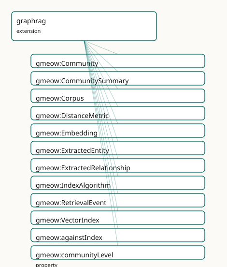

<!-- GENERATED by gmeow ontology-docs. DO NOT EDIT. -->

# GMEOW GraphRAG Module

- **IRI:** <https://blackcatinformatics.ca/gmeow/slices/graphrag>
- **Tier:** extension
- **[`Group`](../reference/classes/gmeow-Group.md):** extensions

## What This Slice Covers

This slice owns 34 terms and contributes 11 mapping or projection rows. Use it when its terms match the native fact you want to preserve; use the linkage tables to see how those facts leave GMEOW for consumer vocabularies.

## Dependencies

- [`gmeow:slices/ai`](ai.md)
- [`gmeow:slices/entities`](entities.md)
- [`gmeow:slices/kernel`](kernel.md)
- [`gmeow:slices/observations`](observations.md)
- [`gmeow:slices/provenance`](provenance.md)

## Consumers

- [`Project`](../reference/classes/gmeow-Project.md) Lillith — a GraphRAG deployment whose corpus, embeddings, indexes, retrievals, and derived entity graph must be auditable provenance, not pipeline internals (P15).

## Local Map



## Examples

### Lillith Dataset

- **Source:** [`slices/extensions/graphrag/examples/lillith-dataset.ttl`](https://github.com/Blackcat-Informatics/gmeow-ontology/blob/main/slices/extensions/graphrag/examples/lillith-dataset.ttl)
- **GMEOW terms:** [`gmeow:BuildActivity`](../reference/classes/gmeow-BuildActivity.md), [`gmeow:Builder`](../reference/classes/gmeow-Builder.md), [`gmeow:Dataset`](../reference/classes/gmeow-Dataset.md), [`gmeow:Distribution`](../reference/classes/gmeow-Distribution.md), [`gmeow:ImportActivity`](../reference/classes/gmeow-ImportActivity.md), [`gmeow:License`](../reference/classes/gmeow-License.md), [`gmeow:Organization`](../reference/classes/gmeow-Organization.md), [`gmeow:Repository`](../reference/classes/gmeow-Repository.md), [`gmeow:buildConfigUri`](../reference/properties/gmeow-buildConfigUri.md), [`gmeow:buildOutput`](../reference/properties/gmeow-buildOutput.md)
- **External prefixes:** `xsd`

```turtle
# SPDX-FileCopyrightText: 2026 Blackcat Informatics® Inc. <paudley@blackcatinformatics.ca>
# SPDX-License-Identifier: CC-BY-4.0
#
# The dataset descriptor for the Lillith worked example : the
# gmeow:Dataset node that the research-object exports (Croissant, RO-Crate,
# DCAT, DataCite, Frictionless) read their catalog metadata FROM — title,
# description, licence, attribution, publication date. Canonical instance
# data; every export is a generated lossy projection of it (P4/P5).
@prefix gmeow: <https://blackcatinformatics.ca/gmeow/> .
@prefix ex:    <https://blackcatinformatics.ca/gmeow/examples/graphrag/> .
@prefix rdfs:  <http://www.w3.org/2000/01/rdf-schema#> .
@prefix xsd:   <http://www.w3.org/2001/XMLSchema#> .

ex:lillith-benchmark a gmeow:Dataset ;
    rdfs:label "Lillith GraphRAG benchmark"@en ;
    gmeow:title "Lillith GraphRAG benchmark"@en ;
    gmeow:description "A worked GraphRAG benchmark dataset: a content-addressed corpus, its chunking, embeddings, vector index, retrieval events, and model-extracted entity/relationship descriptions — every artifact attributed and confidence-weighted, published as a research object."@en ;
    gmeow:hasPart ex:corpus-lillith ;
    gmeow:hasLicense ex:lillith-license ;
    gmeow:wasAttributedTo ex:blackcat ;
    gmeow:datePublished "2026-06-12T00:00:00Z"^^xsd:dateTime ;
    gmeow:sourceLocation "https://blackcatinformatics.ca/gmeow/examples/graphrag/lillith-benchmark" .

ex:lillith-license a gmeow:License ;
    rdfs:label "CC BY 4.0"@en ;
    gmeow:licensor ex:blackcat ;
    gmeow:licensedWork ex:lillith-benchmark ;
    gmeow:licenseFamily gmeow:licenseFamilyCC ;
    gmeow:spdxLicenseId "CC-BY-4.0" ;
    gmeow:spdxLicenseName "Creative Commons Attribution 4.0 International" .

ex:blackcat a gmeow:Organization ;
    rdfs:label "Blackcat Informatics Inc."@en .

# The ingest provenance the catalog projections flatten to PROV.
ex:lillith-ingest a gmeow:ImportActivity ;
    rdfs:label "lillith corpus ingest"@en ;
    gmeow:ingestedAt "2026-06-01T09:00:00Z"^^xsd:dateTime ;
    gmeow:eventTemporalFrame gmeow:temporalFrameUTCGregorian .

# --- The pipeline run as a verifiable workflow ('s model, the Workflow
# Run Crate substrate): the extraction pipeline lives in a repository, its
# workflow definition is the buildConfigUri, the run is a BuildActivity
# performed by a Builder, and the published crate is the Distribution.
ex:pipeline-repo a gmeow:Repository ;
    rdfs:label "lillith-pipeline repository"@en ;
    gmeow:repositoryType gmeow:repoTypeGit ;
    gmeow:cloneUrl "https://github.com/blackcat-informatics/lillith-pipeline.git" ;
    gmeow:webUrl "https://github.com/blackcat-informatics/lillith-pipeline" .

ex:pipeline-runner a gmeow:Builder ;
    rdfs:label "lillith pipeline runner"@en .

ex:pipeline-run a gmeow:BuildActivity ;
    rdfs:label "lillith benchmark pipeline run 2026-06-02"@en ;
    gmeow:buildSource ex:pipeline-repo ;
    gmeow:buildOutput ex:lillith-crate ;
    gmeow:buildConfigUri "https://github.com/blackcat-informatics/lillith-pipeline/blob/main/.github/workflows/benchmark.yml" ;
    gmeow:hasParticipant ex:pipeline-runner ;
    gmeow:eventTime "2026-06-02T08:00:00Z"^^xsd:dateTime ;
    gmeow:eventTemporalFrame gmeow:temporalFrameUTCGregorian .

ex:lillith-crate a gmeow:Distribution ;
    rdfs:label "lillith.crate.zip"@en ;
    gmeow:contentDigest "blake3:8888999900001111222233334444555566667777aaaabbbbccccddddeeeeff66" .
```

### Lillith Pipeline

- **Source:** [`slices/extensions/graphrag/examples/lillith-pipeline.ttl`](https://github.com/Blackcat-Informatics/gmeow-ontology/blob/main/slices/extensions/graphrag/examples/lillith-pipeline.ttl)
- **GMEOW terms:** [`gmeow:Activity`](../reference/classes/gmeow-Activity.md), [`gmeow:Chunk`](../reference/classes/gmeow-Chunk.md), [`gmeow:Community`](../reference/classes/gmeow-Community.md), [`gmeow:CommunitySummary`](../reference/classes/gmeow-CommunitySummary.md), [`gmeow:Corpus`](../reference/classes/gmeow-Corpus.md), [`gmeow:Document`](../reference/classes/gmeow-Document.md), [`gmeow:Embedding`](../reference/classes/gmeow-Embedding.md), [`gmeow:ExtractedEntity`](../reference/classes/gmeow-ExtractedEntity.md), [`gmeow:ExtractedRelationship`](../reference/classes/gmeow-ExtractedRelationship.md), [`gmeow:ModelInvocation`](../reference/classes/gmeow-ModelInvocation.md)
- **External prefixes:** `xsd`

```turtle
# SPDX-FileCopyrightText: 2026 Blackcat Informatics® Inc. <paudley@blackcatinformatics.ca>
# SPDX-License-Identifier: CC-BY-4.0
#
# Worked example: a Project-Lillith-shaped pipeline, end to end — every
# artifact content-addressed, every step attributed via the EXISTING
# provenance properties, the derived entity graph auditable and revisable.
@prefix gmeow: <https://blackcatinformatics.ca/gmeow/> .
@prefix ex:    <https://blackcatinformatics.ca/gmeow/examples/graphrag/> .
@prefix rdfs:  <http://www.w3.org/2000/01/rdf-schema#> .
@prefix xsd:   <http://www.w3.org/2001/XMLSchema#> .

# --- Corpus and chunking (the core ai slice's Chunk).
ex:mail-archive a gmeow:Document ;
    rdfs:label "list archive, 2025"@en ;
    gmeow:contentDigest "blake3:aa20bb31cc42dd53ee64ff750086119722a833b944c055d166e277f388a499b0" .

ex:corpus-lillith a gmeow:Corpus ;
    rdfs:label "Lillith working corpus"@en ;
    gmeow:corpusMember ex:mail-archive ;
    gmeow:contentDigest "blake3:0123456789abcdef0123456789abcdef0123456789abcdef0123456789abcdef" .

ex:chunk-7 a gmeow:Chunk ;
    gmeow:chunkOf ex:mail-archive ;
    gmeow:spanStart "5200"^^xsd:nonNegativeInteger ;
    gmeow:spanEnd "6100"^^xsd:nonNegativeInteger ;
    gmeow:contentDigest "blake3:fedcba9876543210fedcba9876543210fedcba9876543210fedcba9876543210" .

# --- Embedding + index: attributed, metric-explicit, vector OUTSIDE (P12).
ex:embedder a gmeow:SoftwareAgent ; rdfs:label "embedder-v3"@en .

ex:embed-run a gmeow:Activity ; rdfs:label "embedding pass 2026-06-01"@en ;
    gmeow:eventTime "2026-06-01T00:00:00Z"^^xsd:dateTime ;
    gmeow:eventTemporalFrame gmeow:temporalFrameUTCGregorian .

ex:embedding-7 a gmeow:Embedding ;
    gmeow:embeddingOf ex:chunk-7 ;
    gmeow:embeddingModel ex:embedder ;
    gmeow:embeddingDimensions "1024"^^xsd:positiveInteger ;
    gmeow:distanceMetric gmeow:distanceMetricCosine ;
    gmeow:vectorRef "s3://lillith/vectors/chunk-7"^^xsd:anyURI ;
    gmeow:wasGeneratedBy ex:embed-run ;
    gmeow:wasDerivedFrom ex:chunk-7 ;
    gmeow:contentDigest "blake3:1111222233334444555566667777888899990000aaaabbbbccccddddeeeeffff" .

ex:index-build a gmeow:Activity ; rdfs:label "index build 2026-06-01"@en ;
    gmeow:eventTime "2026-06-01T00:00:00Z"^^xsd:dateTime ;
    gmeow:eventTemporalFrame gmeow:temporalFrameUTCGregorian .

ex:index-lillith a gmeow:VectorIndex ;
    gmeow:contentDigest "blake3:2222333344445555666677778888999900001111aaaabbbbccccddddeeeeff00" ;
    gmeow:indexesCorpus ex:corpus-lillith ;
    gmeow:indexAlgorithm gmeow:indexAlgorithmHnsw ;
    gmeow:distanceMetric gmeow:distanceMetricCosine ;
    gmeow:indexParameters "{\"M\": 16, \"efConstruction\": 200}" ;
    gmeow:wasGeneratedBy ex:index-build .

# --- Retrieval: why did the model see this passage?
ex:retrieval-3 a gmeow:RetrievalEvent ;
    gmeow:forQuery "who maintained the build system?" ;
    gmeow:againstIndex ex:index-lillith ;
    gmeow:retrievedChunk ex:chunk-7 ;
    gmeow:atTime "2026-06-02T10:00:00Z"^^xsd:dateTime ;
    gmeow:eventTemporalFrame gmeow:temporalFrameUTCGregorian .

# --- Extraction (core ModelInvocation) → derived DESCRIPTIONS.
ex:extractor a gmeow:SoftwareAgent ; rdfs:label "extraction model"@en .
ex:invocation-44 a gmeow:ModelInvocation ;
    gmeow:usedModel ex:extractor ;
    gmeow:samplingTemperature 0.0 ;
    gmeow:atTime "2026-06-01T12:00:00Z"^^xsd:dateTime ;
    gmeow:eventTemporalFrame gmeow:temporalFrameUTCGregorian .

ex:desc-mara a gmeow:ExtractedEntity ;
    rdfs:label "extracted: 'Mara' (maintainer?)"@en ;
    gmeow:contentDigest "blake3:3333444455556666777788889999000011112222aaaabbbbccccddddeeeeff11" ;
    gmeow:wasDerivedFrom ex:chunk-7 ;
    gmeow:wasGeneratedBy ex:invocation-44 .

ex:desc-buildsys a gmeow:ExtractedEntity ;
    rdfs:label "extracted: 'the build system'"@en ;
    gmeow:contentDigest "blake3:4444555566667777888899990000111122223333aaaabbbbccccddddeeeeff22" ;
    gmeow:wasDerivedFrom ex:chunk-7 ;
    gmeow:wasGeneratedBy ex:invocation-44 .

ex:rel-maintains a gmeow:ExtractedRelationship ;
    rdfs:label "extracted: Mara maintains the build system"@en ;
    gmeow:contentDigest "blake3:5555666677778888999900001111222233334444aaaabbbbccccddddeeeeff33" ;
    gmeow:relationshipSource ex:desc-mara ;
    gmeow:relationshipTarget ex:desc-buildsys ;
    gmeow:wasDerivedFrom ex:chunk-7 ;
    gmeow:wasGeneratedBy ex:invocation-44 .

# --- Community + summary: the global-question substrate, revisable.
ex:cluster-run a gmeow:Activity ; rdfs:label "leiden clustering 2026-06-02"@en ;
    gmeow:eventTime "2026-06-02T00:00:00Z"^^xsd:dateTime ;
    gmeow:eventTemporalFrame gmeow:temporalFrameUTCGregorian .

ex:community-infra a gmeow:Community ;
    rdfs:label "infrastructure community"@en ;
    gmeow:contentDigest "blake3:6666777788889999000011112222333344445555aaaabbbbccccddddeeeeff44" ;
    gmeow:communityLevel "0"^^xsd:nonNegativeInteger ;
    gmeow:communityMember ex:desc-mara, ex:desc-buildsys ;
    gmeow:wasGeneratedBy ex:cluster-run .

ex:summary-infra a gmeow:CommunitySummary ;
    rdfs:label "summary: the infrastructure crew"@en ;
    gmeow:contentDigest "blake3:7777888899990000111122223333444455556666aaaabbbbccccddddeeeeff55" ;
    gmeow:summarizesCommunity ex:community-infra ;
    gmeow:wasDerivedFrom ex:desc-mara, ex:desc-buildsys, ex:chunk-7 ;
    gmeow:wasGeneratedBy ex:invocation-44 .
```

## Terms

### Classes

| Term | Label | Definition |
|---|---|---|
| [`gmeow:Community`](../reference/classes/gmeow-Community.md) | Community | A graph-clustering community (Leiden or similar) over extracted-entity descriptions, at a level ([`gmeow:communityLevel`](../reference/properties/gmeow-communityLevel.md)) of the cluster hierarchy. The clustering... |
| [`gmeow:CommunitySummary`](../reference/classes/gmeow-CommunitySummary.md) | Community Summary | A pre-generated summary of a community — GraphRAG's global-question substrate, [`gmeow:wasDerivedFrom`](../reference/properties/gmeow-wasDerivedFrom.md) the community's members and chunks and [`gmeow:wasGeneratedBy`](../reference/properties/gmeow-wasGeneratedBy.md)... |
| [`gmeow:Corpus`](../reference/classes/gmeow-Corpus.md) | Corpus | An indexed collection of source information objects over which retrieval operates — the working document set behind a pipeline, distinct from the documents sli... |
| [`gmeow:DistanceMetric`](../reference/classes/gmeow-DistanceMetric.md) | Distance Metric | An open value vocabulary of vector similarity/distance functions. |
| [`gmeow:Embedding`](../reference/classes/gmeow-Embedding.md) | Embedding | A vector representation of an information object (usually a core [`gmeow:Chunk`](../reference/classes/gmeow-Chunk.md)), produced by an embedding model — the genuine vocabulary gap in the semantic-web... |
| [`gmeow:ExtractedEntity`](../reference/classes/gmeow-ExtractedEntity.md) | Extracted Entity | A model-extracted entity DESCRIPTION — an information object about a putative entity, derived from source chunks. Deliberately NOT the entity itself: promotion... |
| [`gmeow:ExtractedRelationship`](../reference/classes/gmeow-ExtractedRelationship.md) | Extracted Relationship | A model-extracted relationship description between extracted-entity descriptions — the GraphRAG edge as a revisable, attributed artifact rather than a black-bo... |
| [`gmeow:IndexAlgorithm`](../reference/classes/gmeow-IndexAlgorithm.md) | Index Algorithm | An open value vocabulary of vector-index structures. |
| [`gmeow:RetrievalEvent`](../reference/classes/gmeow-RetrievalEvent.md) | Retrieval Event | One retrieval against a vector index: the query, the index queried, and the chunks returned — the answer to 'why did the model see this passage?'. An agent-mem... |
| [`gmeow:VectorIndex`](../reference/classes/gmeow-VectorIndex.md) | Vector Index | A built retrieval structure over a corpus's embeddings — the artifact a RetrievalEvent queries. Carries its algorithm ([`gmeow:indexAlgorithm`](../reference/properties/gmeow-indexAlgorithm.md)), parameters (verba... |

### Properties

| Term | Label | Definition |
|---|---|---|
| [`gmeow:againstIndex`](../reference/properties/gmeow-againstIndex.md) | against index | The index this retrieval queried. Functional: federated retrieval is several RetrievalEvents under one parent activity. |
| [`gmeow:communityLevel`](../reference/properties/gmeow-communityLevel.md) | community level | The hierarchy level of this community (0 = leaf clustering). |
| [`gmeow:communityMember`](../reference/properties/gmeow-communityMember.md) | community member | An extracted-entity description this community clusters. |
| [`gmeow:corpusMember`](../reference/properties/gmeow-corpusMember.md) | corpus member | Relates a corpus to a source information object it collects. Non-functional: a source may belong to many corpora. |
| [`gmeow:distanceMetric`](../reference/properties/gmeow-distanceMetric.md) | distance metric | The similarity/distance function under which an embedding or index is meaningful — cosine and euclidean disagree about what is 'near', so the metric is provena... |
| [`gmeow:embeddingDimensions`](../reference/properties/gmeow-embeddingDimensions.md) | embedding dimensions | The dimensionality of the embedding vector. |
| [`gmeow:embeddingModel`](../reference/properties/gmeow-embeddingModel.md) | embedding model | The model agent that produced this embedding. Two models' embeddings of the same chunk are two Embedding individuals — never merged (P9: machine-derived values... |
| [`gmeow:embeddingOf`](../reference/properties/gmeow-embeddingOf.md) | embedding of | The information object this embedding represents. Functional: one embedding represents exactly one object under one model. |
| [`gmeow:forQuery`](../reference/properties/gmeow-forQuery.md) | for query | The query text this retrieval served, recorded verbatim. |
| [`gmeow:indexAlgorithm`](../reference/properties/gmeow-indexAlgorithm.md) | index algorithm | The approximate-nearest-neighbour structure this index uses (open vocabulary). |
| [`gmeow:indexParameters`](../reference/properties/gmeow-indexParameters.md) | index parameters | The build parameters (efConstruction, nlist, M,...) recorded verbatim as a JSON object string — reproducibility provenance; their semantics stay in the solver... |
| [`gmeow:indexesCorpus`](../reference/properties/gmeow-indexesCorpus.md) | indexes corpus | The corpus whose embeddings this index serves. Non-functional: a federated index may span corpora. |
| [`gmeow:relationshipSource`](../reference/properties/gmeow-relationshipSource.md) | relationship source | The extracted-entity description at the tail of this extracted relationship. |
| [`gmeow:relationshipTarget`](../reference/properties/gmeow-relationshipTarget.md) | relationship target | The extracted-entity description at the head of this extracted relationship. |
| [`gmeow:retrievalScore`](../reference/properties/gmeow-retrievalScore.md) | retrieval score | Statement-level annotation: the relevance score a retrieval (or re-ranker) assigned to ONE retrievedChunk triple. An annotation property so competing scores co... |
| [`gmeow:retrievedChunk`](../reference/properties/gmeow-retrievedChunk.md) | retrieved chunk | A chunk this retrieval returned. Score, rank, and re-ranker attribution ride RDF 1.2 statement annotations on each retrievedChunk triple ([`gmeow:retrievalScore`](../reference/properties/gmeow-retrievalScore.md)... |
| [`gmeow:summarizesCommunity`](../reference/properties/gmeow-summarizesCommunity.md) | summarizes community | The community this summary condenses. |
| [`gmeow:vectorRef`](../reference/properties/gmeow-vectorRef.md) | vector ref | A dereferenceable locator for the vector payload (an object-store key, an index slot). The vector lives outside the graph by reference (P12); the graph holds t... |

### Individuals

| Term | Label | Definition |
|---|---|---|
| [`gmeow:distanceMetricCosine`](../reference/individuals/gmeow-distanceMetricCosine.md) | cosine | Cosine similarity — angle between vectors, magnitude-invariant. |
| [`gmeow:distanceMetricDotProduct`](../reference/individuals/gmeow-distanceMetricDotProduct.md) | dot product | Inner-product similarity — magnitude-sensitive; common for normalized embeddings. |
| [`gmeow:distanceMetricEuclidean`](../reference/individuals/gmeow-distanceMetricEuclidean.md) | euclidean | Euclidean (L2) distance between vectors. |
| [`gmeow:indexAlgorithmFlat`](../reference/individuals/gmeow-indexAlgorithmFlat.md) | flat | Exhaustive (brute-force) scan — exact, no approximation structure. |
| [`gmeow:indexAlgorithmHnsw`](../reference/individuals/gmeow-indexAlgorithmHnsw.md) | HNSW | Hierarchical Navigable Small World graph index. |
| [`gmeow:indexAlgorithmIvf`](../reference/individuals/gmeow-indexAlgorithmIvf.md) | IVF | Inverted-file (coarse-quantizer) index. |

## Linkages

- **Rows:** 11
- **Projection profiles:** `dcat`, `schema-org`
- **External vocabularies:** `dcat`, `rdf`, `schema`, `spdx`, `wd`

| Source | Kind | Profile | Predicate/Relation | Target | Evidence |
|---|---|---|---|---|---|
| [`gmeow:Community`](../reference/classes/gmeow-Community.md) | equivalence | `-` | [skos:relatedMatch](http://www.w3.org/2004/02/skos/core#relatedMatch) | [wd:Q105222918](https://www.wikidata.org/wiki/Q105222918) | `gmeow-graphrag.sssom.tsv`; `gmeow:eqGr005`; confidence 0.6 |
| [`gmeow:CommunitySummary`](../reference/classes/gmeow-CommunitySummary.md) | equivalence | `-` | [skos:relatedMatch](http://www.w3.org/2004/02/skos/core#relatedMatch) | [wd:Q1394144](https://www.wikidata.org/wiki/Q1394144) | `gmeow-graphrag.sssom.tsv`; `gmeow:eqGr006`; confidence 0.6 |
| [`gmeow:Corpus`](../reference/classes/gmeow-Corpus.md) | equivalence | `-` | [skos:closeMatch](http://www.w3.org/2004/02/skos/core#closeMatch) | [schema:Dataset](https://schema.org/Dataset) | `gmeow-graphrag.sssom.tsv`; `gmeow:eqGr002`; confidence 0.7 |
| [`gmeow:Corpus`](../reference/classes/gmeow-Corpus.md) | equivalence | `-` | [skos:closeMatch](http://www.w3.org/2004/02/skos/core#closeMatch) | [wd:Q461183](https://www.wikidata.org/wiki/Q461183) | `gmeow-graphrag.sssom.tsv`; `gmeow:eqGr001`; confidence 0.8 |
| [`gmeow:Embedding`](../reference/classes/gmeow-Embedding.md) | equivalence | `-` | [skos:closeMatch](http://www.w3.org/2004/02/skos/core#closeMatch) | [wd:Q18395344](https://www.wikidata.org/wiki/Q18395344) | `gmeow-graphrag.sssom.tsv`; `gmeow:eqGr003`; confidence 0.7 |
| [`gmeow:RetrievalEvent`](../reference/classes/gmeow-RetrievalEvent.md) | equivalence | `-` | [skos:relatedMatch](http://www.w3.org/2004/02/skos/core#relatedMatch) | [wd:Q121362277](https://www.wikidata.org/wiki/Q121362277) | `gmeow-graphrag.sssom.tsv`; `gmeow:eqGr004`; confidence 0.6 |
| [`gmeow:corpusMember`](../reference/properties/gmeow-corpusMember.md) | equivalence | `-` | [skos:closeMatch](http://www.w3.org/2004/02/skos/core#closeMatch) | [schema:distribution](https://schema.org/distribution) | `gmeow-properties.sssom.tsv`; `gmeow:eqProperties080`; confidence 0.8 |
| [`gmeow:Corpus`](../reference/classes/gmeow-Corpus.md) | projection | `dcat` | projects to / <= | [dcat:Dataset](http://www.w3.org/ns/dcat#Dataset) | `gmeow:mapDcatCorpus`; confidence 0.85; lossy: the corpus's retrieval role (index membership, embedding lineage) is invisible to DCAT — only the dataset facet survives |
| [`gmeow:corpusMember`](../reference/properties/gmeow-corpusMember.md) | projection | `dcat` | projects to / <= | [dcat:Distribution](http://www.w3.org/ns/dcat#Distribution), [dcat:distribution](http://www.w3.org/ns/dcat#distribution), [dcat:downloadURL](http://www.w3.org/ns/dcat#downloadURL), [rdf:type](http://www.w3.org/1999/02/22-rdf-syntax-ns#type) | `gmeow:mapDcatDistribution`; confidence 0.85; lossy: the member document is REUSED as the [dcat:Distribution](http://www.w3.org/ns/dcat#Distribution) node (no manifestation split); its GMEOW typing is dropped |
| [`gmeow:corpusMember`](../reference/properties/gmeow-corpusMember.md) | projection | `dcat` | projects to / <= | [rdf:type](http://www.w3.org/1999/02/22-rdf-syntax-ns#type), [spdx:Checksum](http://spdx.org/rdf/terms#Checksum), [spdx:checksum](http://spdx.org/rdf/terms#checksum), [spdx:checksumValue](http://spdx.org/rdf/terms#checksumValue) | `gmeow:mapDcatChecksum`; confidence 0.85; lossy: the algorithm prefix stays inline in [spdx:checksumValue](http://spdx.org/rdf/terms#checksumValue) (no [spdx:algorithm](http://spdx.org/rdf/terms#algorithm) split) |
| [`gmeow:corpusMember`](../reference/properties/gmeow-corpusMember.md) | projection | `schema-org` | projects to / <= | [rdf:type](http://www.w3.org/1999/02/22-rdf-syntax-ns#type), [schema:DataDownload](https://schema.org/DataDownload), [schema:contentUrl](https://schema.org/contentUrl), [schema:distribution](https://schema.org/distribution), [schema:encodingFormat](https://schema.org/encodingFormat) | `gmeow:mapSchemaDataDownload`; confidence 0.85; lossy: the member document is REUSED as the [schema:DataDownload](https://schema.org/DataDownload) node; its GMEOW typing drops |

## Guide

<!-- SPDX-FileCopyrightText: 2026 Blackcat Informatics® Inc. <paudley@blackcatinformatics.ca> -->
<!-- SPDX-License-Identifier: CC-BY-4.0 -->

# The GraphRAG extension — the pipeline as auditable provenance

GraphRAG systems derive an entity knowledge graph and pre-generated community
summaries from a corpus — and throw the provenance away (arXiv:2404.16130).
This extension keeps it: every artifact content-addressed (the existing
[`gmeow:contentDigest`](../reference/properties/gmeow-contentDigest.md)), every step an attributed activity (the existing
[`gmeow:wasGeneratedBy`](../reference/properties/gmeow-wasGeneratedBy.md) / [`gmeow:wasDerivedFrom`](../reference/properties/gmeow-wasDerivedFrom.md)), every score a statement-level
annotation that coexists with its rivals (P9, P3).

Consumer: **[`Project`](../reference/classes/gmeow-Project.md) Lillith** (manifest, P15).

## The pipeline

```text
Corpus ─corpusMember→ sources ─(core chunkOf)─ Chunk
   │                                             │ embeddingOf⁻¹
   │ indexesCorpus⁻¹                          Embedding (model, dims, metric,
VectorIndex (algorithm, params,                vectorRef → outside the graph, P12)
   wasGeneratedBy build run)
   │ againstIndex⁻¹
RetrievalEvent (forQuery; retrievedChunk + retrievalScore annotations)
   │ feeds (core) ModelInvocation
ExtractedEntity / ExtractedRelationship  — descriptions, wasDerivedFrom chunks
   │ communityMember⁻¹
Community (level) ─summarizesCommunity⁻¹─ CommunitySummary ⊑ Summary
```

## Doctrine

- **Descriptions, not entities.** [`ExtractedEntity`](../reference/classes/gmeow-ExtractedEntity.md) is an information object
 ABOUT a putative entity; promotion to a first-class [`gmeow:Entity`](../reference/classes/gmeow-Entity.md) is a
 separate, attributable curation act with coreference by reference, never
 [`owl:sameAs`](http://www.w3.org/2002/07/owl#sameAs) (P5).
- **Vectors stay outside.** [`vectorRef`](../reference/properties/gmeow-vectorRef.md) points; the graph holds the audit trail
 (model, dimensions, metric, build parameters), not the floats (P12).
- **Claims are the core's business.** What the pipeline EXTRACTS as claims is
 the core ai slice's StandpointClaim-with-model-vantage pattern; this
 extension carries the machinery around those claims.
- **Memory recall is a [`RetrievalEvent`](../reference/classes/gmeow-RetrievalEvent.md)** — the read half of the core [`MemoryItem`](../reference/classes/gmeow-MemoryItem.md)
 doctrine.
