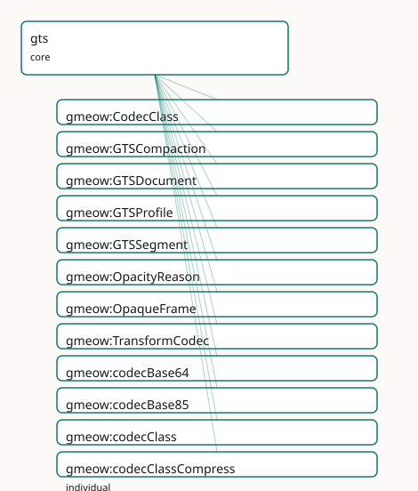

<!-- GENERATED by gmeow ontology-docs. DO NOT EDIT. -->

# GMEOW GTS Transport Module

- **IRI:** <https://blackcatinformatics.ca/gmeow/slices/gts>
- **Tier:** core
- **[`Group`](../reference/classes/gmeow-Group.md):** core

## What This Slice Covers

This slice owns 38 terms and contributes 3 mapping or projection rows. Use it when its terms match the native fact you want to preserve; use the linkage tables to see how those facts leave GMEOW for consumer vocabularies.

## Dependencies

- [`gmeow:slices/attestation`](attestation.md)
- [`gmeow:slices/creative-works`](creative-works.md)
- [`gmeow:slices/kernel`](kernel.md)
- [`gmeow:slices/provenance`](provenance.md)
- [`gmeow:slices/versions`](versions.md)

## Consumers

- Describing and dogfooding GTS transport artifacts: packages, segments, profiles, chain heads, opaque frames, codecs, and compaction lineage ([`docs/GTS-SPEC.md`](https://github.com/Blackcat-Informatics/gmeow-ontology/blob/main/docs/GTS-SPEC.md)).

## Local Map



## Examples

### Dist Package

- **Source:** [`slices/core/gts/examples/dist-package.ttl`](https://github.com/Blackcat-Informatics/gmeow-ontology/blob/main/slices/core/gts/examples/dist-package.ttl)
- **GMEOW terms:** [`gmeow:Agent`](../reference/classes/gmeow-Agent.md), [`gmeow:Expression`](../reference/classes/gmeow-Expression.md), [`gmeow:GTSDocument`](../reference/classes/gmeow-GTSDocument.md), [`gmeow:GTSSegment`](../reference/classes/gmeow-GTSSegment.md), [`gmeow:OpaqueFrame`](../reference/classes/gmeow-OpaqueFrame.md), [`gmeow:Work`](../reference/classes/gmeow-Work.md), [`gmeow:codecZstd`](../reference/individuals/gmeow-codecZstd.md), [`gmeow:contentDigest`](../reference/properties/gmeow-contentDigest.md), [`gmeow:embodies`](../reference/properties/gmeow-embodies.md), [`gmeow:gtsHeadId`](../reference/properties/gmeow-gtsHeadId.md)
- **External prefixes:** `xsd`

```turtle
# SPDX-FileCopyrightText: 2026 Blackcat Informatics® Inc. <paudley@blackcatinformatics.ca>
# SPDX-License-Identifier: CC-BY-4.0
# Worked example : a two-segment GTS distribution package described
# in GMEOW's own transport vocabulary — the dogfood loop closed. Validates
# in `make validate` against the merged ontology + SHACL (the segment
# shapes demand the composite-identity parts: head, index, profile).

@prefix gmeow: <https://blackcatinformatics.ca/gmeow/> .
@prefix ex:    <https://blackcatinformatics.ca/gmeow/examples/> .
@prefix rdfs:  <http://www.w3.org/2000/01/rdf-schema#> .
@prefix xsd:   <http://www.w3.org/2001/XMLSchema#> .

# The full WEMI spine the shapes demand: Work ← realizes ← Expression
# ← embodies ← Manifestation (the GTS document and its segments).
ex:gmeow-ontology-work-001
    a gmeow:Work ;
    rdfs:label "the GMEOW ontology"@en .

ex:gmeow-ontology-expression-001
    a gmeow:Expression ;
    rdfs:label "the GMEOW ontology, v0.1.0 statement-complete expression"@en ;
    gmeow:realizes ex:gmeow-ontology-work-001 ;
    # P11: an expression's content lives in a reference system — here the
    # (English-labelled) vocabulary expression of the ontology.
    gmeow:hasReferenceFrame gmeow:referenceFrameEnglish .

ex:gts-dist-package-001
    a gmeow:GTSDocument ;
    rdfs:label "gmeow.gts — the dist snapshot, with a music extension appended"@en ;
    gmeow:embodies ex:gmeow-ontology-expression-001 ;
    gmeow:contentDigest "blake3:0e2f4b8a3c1d5e7f9a0b2c4d6e8f0a1b2c3d4e5f6a7b8c9d0e1f2a3b4c5d6e7f" .

ex:gts-dist-segment-core
    a gmeow:GTSSegment ;
    rdfs:label "core dist segment"@en ;
    gmeow:gtsSegmentOf ex:gts-dist-package-001 ;
    gmeow:embodies ex:gmeow-ontology-expression-001 ;
    gmeow:gtsSegmentIndex "0"^^xsd:nonNegativeInteger ;
    gmeow:gtsHeadId "blake3:929d046b2300eb09424f2d46b07fb793ad97ddde5e9fdb25ebefe245e8da8be8" ;
    gmeow:gtsProfile gmeow:gtsProfileDist ;
    gmeow:usesTransformCodec gmeow:codecZstd .

ex:gts-dist-segment-music
    a gmeow:GTSSegment ;
    rdfs:label "appended music-extension segment"@en ;
    gmeow:gtsSegmentOf ex:gts-dist-package-001 ;
    gmeow:embodies ex:gmeow-ontology-expression-001 ;
    gmeow:gtsSegmentIndex "1"^^xsd:nonNegativeInteger ;
    gmeow:gtsHeadId "blake3:167704cc2c533090b63ff3bf38b4fcff2bb70b33f996aa22f53025044e310ee8" ;
    gmeow:gtsProfile gmeow:gtsProfileGeneric ;
    gmeow:usesTransformCodec gmeow:codecZstd .

# A sealed frame: opacity is vantage-relative — transparent to its recipient.
ex:gts-opaque-frame-001
    a gmeow:OpaqueFrame ;
    rdfs:label "sealed evidence attachment"@en ;
    gmeow:opaqueFrameIn ex:gts-dist-segment-core ;
    gmeow:opacityReason gmeow:opacityMissingKey ;
    gmeow:sealedRecipient ex:agent-archivist-001 .

ex:agent-archivist-001
    a gmeow:Agent ;
    rdfs:label "the archivist"@en .
```

## Terms

### Classes

| Term | Label | Definition |
|---|---|---|
| [`gmeow:CodecClass`](../reference/classes/gmeow-CodecClass.md) | Codec Class | The capability class of a transform codec — encode, compress, or encrypt (spec §8). Determines the degradation path when the capability is missing: unknown-cod... |
| [`gmeow:GTSCompaction`](../reference/classes/gmeow-GTSCompaction.md) | GTS Compaction | An activity that rewrites a GTS document's frame layout — e.g. into delivery order for streaming (spec §3.2) or into a snapshot. Compaction re-authors on... |
| [`gmeow:GTSDocument`](../reference/classes/gmeow-GTSDocument.md) | GTS Document | A single-file Graph Transport Substrate artifact ([`docs/GTS-SPEC.md`](https://github.com/Blackcat-Informatics/gmeow-ontology/blob/main/docs/GTS-SPEC.md)): a CBOR Sequence of one or more append-only segments carrying an RDF 1.2 graph and any cont... |
| [`gmeow:GTSProfile`](../reference/classes/gmeow-GTSProfile.md) | GTS Profile | A named GTS profile (spec §13) — a purpose and requirement set a segment declares. An OPEN value vocabulary (individuals, never subclasses): extensions add the... |
| [`gmeow:GTSSegment`](../reference/classes/gmeow-GTSSegment.md) | GTS Segment | One complete header-plus-frames log inside a GTS document — the unit of independent integrity (spec §3.1): a segment has its own genesis hash, its own id/prev... |
| [`gmeow:OpacityReason`](../reference/classes/gmeow-OpacityReason.md) | Opacity Reason | Why a frame is opaque to a given reader (spec §7.6) — a missing capability or damage. An open value vocabulary; opacity is vantage-relative, so the reason is a... |
| [`gmeow:OpaqueFrame`](../reference/classes/gmeow-OpaqueFrame.md) | Opaque Frame | A sealed or undecodable region of a GTS segment, surfaced by the reader as a first-class object rather than dropped (spec §7.6): an encrypted frame the reader... |
| [`gmeow:TransformCodec`](../reference/classes/gmeow-TransformCodec.md) | Transform Codec | A payload transform from the durable GTS catalog (spec §8): a named, stackable codec separating structure durability (CBOR + the spec, forever) from density an... |

### Properties

| Term | Label | Definition |
|---|---|---|
| [`gmeow:codecClass`](../reference/properties/gmeow-codecClass.md) | codec class | The capability class of a transform codec (spec §8): what a reader must hold to reverse it — a library (encode, compress) or a key (encrypt). |
| [`gmeow:gtsHeadId`](../reference/properties/gmeow-gtsHeadId.md) | GTS head id | The chain head of a segment — the content-id of its last frame, written 'blake3:<hex>'. Transitively commits to the segment's entire history (spec §9.1), makin... |
| [`gmeow:gtsProfile`](../reference/properties/gmeow-gtsProfile.md) | GTS profile | The declared profile of a segment (spec §13) — a value vocabulary individual naming the segment's purpose and requirement set. Functional per segment; a multi-... |
| [`gmeow:gtsSegment`](../reference/properties/gmeow-gtsSegment.md) | GTS segment | A segment of this GTS document — the inverse of [`gmeow:gtsSegmentOf`](../reference/properties/gmeow-gtsSegmentOf.md). Non-functional: a document holds one or more segments, ordered by [`gmeow:gtsSegmentIndex`](../reference/properties/gmeow-gtsSegmentIndex.md). |
| [`gmeow:gtsSegmentIndex`](../reference/properties/gmeow-gtsSegmentIndex.md) | GTS segment index | The zero-based position of a segment within its document's file order. The ordered list of segment heads — [`gmeow:gtsHeadId`](../reference/properties/gmeow-gtsHeadId.md) taken in [`gmeow:gtsSegmentIndex`](../reference/properties/gmeow-gtsSegmentIndex.md) order... |
| [`gmeow:gtsSegmentOf`](../reference/properties/gmeow-gtsSegmentOf.md) | GTS segment of | The GTS document a segment is part of. Functional: a segment instance belongs to one document (the same bytes appearing in another file are a different segment... |
| [`gmeow:opacityReason`](../reference/properties/gmeow-opacityReason.md) | opacity reason | Why a frame is opaque to the describing reader (spec §7.6): an encrypt-class codec without a key, a codec the reader lacks, or damage. Functional and REQUIRED... |
| [`gmeow:opaqueFrameIn`](../reference/properties/gmeow-opaqueFrameIn.md) | opaque frame in | The GTS segment an opaque frame belongs to. Functional: a frame occupies one position in one segment's chain. |
| [`gmeow:sealedRecipient`](../reference/properties/gmeow-sealedRecipient.md) | sealed recipient | An agent for whom a sealed (encrypted) opaque frame is decryptable — the frame's declared audience (spec §9.3 recipients). Non-functional: a frame may be seale... |
| [`gmeow:usesTransformCodec`](../reference/properties/gmeow-usesTransformCodec.md) | uses transform codec | A transform codec declared in a segment's catalog and used by at least one of its frames (spec §8). Non-functional: payloads carry stackable codec chains. |

### Individuals

| Term | Label | Definition |
|---|---|---|
| [`gmeow:codecBase64`](../reference/individuals/gmeow-codecBase64.md) | base64 codec | RFC 4648 base64 re-encoding, for payloads that must transit text-only channels. |
| [`gmeow:codecBase85`](../reference/individuals/gmeow-codecBase85.md) | base85 codec | base85 (Ascii85/Z85-family) re-encoding — denser than base64 for text-only channels. |
| [`gmeow:codecClassCompress`](../reference/individuals/gmeow-codecClassCompress.md) | compress | A lossless compression transform (gzip, zstd, lzma2): reversal needs only a library. |
| [`gmeow:codecClassEncode`](../reference/individuals/gmeow-codecClassEncode.md) | encode | A reversible re-encoding (identity, base64, base85): reversal needs only a library; no information is hidden or removed. |
| [`gmeow:codecClassEncrypt`](../reference/individuals/gmeow-codecClassEncrypt.md) | encrypt | A confidentiality transform (COSE encryption): reversal needs a key; without one the frame degrades to missing-key opacity for that reader. |
| [`gmeow:codecCoseEncrypt0`](../reference/individuals/gmeow-codecCoseEncrypt0.md) | COSE Encrypt0 codec | RFC 9052 COSE_Encrypt0 sealing: the payload is encrypted to declared recipients; readers without a key see a missing-key opaque frame. |
| [`gmeow:codecGzip`](../reference/individuals/gmeow-codecGzip.md) | gzip codec | RFC 1952 gzip compression. |
| [`gmeow:codecIdentity`](../reference/individuals/gmeow-codecIdentity.md) | identity codec | The identity transform: payload bytes pass through unchanged. |
| [`gmeow:codecLzma2`](../reference/individuals/gmeow-codecLzma2.md) | lzma2 codec | LZMA2 (xz) compression — higher ratio, slower, for archival density. |
| [`gmeow:codecZstd`](../reference/individuals/gmeow-codecZstd.md) | zstd codec | RFC 8878 Zstandard compression — the GTS workhorse compressor. |
| [`gmeow:gtsProfileAiPackage`](../reference/individuals/gmeow-gtsProfileAiPackage.md) | ai-package profile | Agent-memory package profile: grounded knowledge plus provenance and standpoints, packaged for AI-agent consumption — the GMEOW dogfood profile. |
| [`gmeow:gtsProfileBundle`](../reference/individuals/gmeow-gtsProfileBundle.md) | bundle profile | Composition profile: a document whose payloads include nested, independently sealed GTS documents (matryoshka, spec §12.1). |
| [`gmeow:gtsProfileDist`](../reference/individuals/gmeow-gtsProfileDist.md) | dist profile | Distribution snapshot profile: a statement-complete, reasoned graph packaged for consumption — the shipping form of an ontology or dataset. |
| [`gmeow:gtsProfileEvidence`](../reference/individuals/gmeow-gtsProfileEvidence.md) | evidence profile | Evidentiary profile: every frame signed, chain of custody preserved; the package is an attestation-bearing exhibit. Compaction is contraindicated (see shapes)... |
| [`gmeow:gtsProfileGeneric`](../reference/individuals/gmeow-gtsProfileGeneric.md) | generic profile | The default GTS profile: no requirements beyond the baseline reader contract. |
| [`gmeow:gtsProfileImage`](../reference/individuals/gmeow-gtsProfileImage.md) | image profile | Media-carriage profile: content-addressed media blobs with graph-side descriptions and progressive (catalog-before-bytes) delivery ordering (spec §3.2). |
| [`gmeow:gtsProfileOpaque`](../reference/individuals/gmeow-gtsProfileOpaque.md) | opaque profile | Selective-disclosure profile: substantive payloads sealed to named recipients; the describing reader sees structure, signers, and recipients but not content. |
| [`gmeow:opacityDamaged`](../reference/individuals/gmeow-opacityDamaged.md) | damaged | The frame failed its self-hash check or its payload would not decode — content corruption, detected and surfaced rather than dropped. |
| [`gmeow:opacityMissingKey`](../reference/individuals/gmeow-opacityMissingKey.md) | missing key | The frame is sealed with an encrypt-class codec and the reader holds no key for it; the declared recipients ([`gmeow:sealedRecipient`](../reference/properties/gmeow-sealedRecipient.md)) can decrypt it. |
| [`gmeow:opacityUnknownCodec`](../reference/individuals/gmeow-opacityUnknownCodec.md) | unknown codec | The frame's transform chain names a codec the reader has no library for. |

## Linkages

- **Rows:** 3
- **Projection profiles:** -
- **External vocabularies:** `dcat`, `prov`

| Source | Kind | Profile | Predicate/Relation | Target | Evidence |
|---|---|---|---|---|---|
| [`gmeow:GTSCompaction`](../reference/classes/gmeow-GTSCompaction.md) | equivalence | `-` | [skos:closeMatch](http://www.w3.org/2004/02/skos/core#closeMatch) | [prov:Activity](http://www.w3.org/ns/prov#Activity) | `gmeow-gts.sssom.tsv`; `gmeow:eqGts002`; confidence 0.9 |
| [`gmeow:GTSDocument`](../reference/classes/gmeow-GTSDocument.md) | equivalence | `-` | [skos:closeMatch](http://www.w3.org/2004/02/skos/core#closeMatch) | [dcat:Distribution](http://www.w3.org/ns/dcat#Distribution) | `gmeow-gts.sssom.tsv`; `gmeow:eqGts001`; confidence 0.8 |
| [`gmeow:GTSSegment`](../reference/classes/gmeow-GTSSegment.md) | equivalence | `-` | [skos:closeMatch](http://www.w3.org/2004/02/skos/core#closeMatch) | [prov:Entity](http://www.w3.org/ns/prov#Entity) | `gmeow-gts.sssom.tsv`; `gmeow:eqGts003`; confidence 0.7 |

## Guide

<!-- SPDX-FileCopyrightText: 2026 Blackcat Informatics® Inc. <paudley@blackcatinformatics.ca> -->
<!-- SPDX-License-Identifier: CC-BY-4.0 -->

# GTS Transport Module

GMEOW describing its own transport ([`docs/GTS-SPEC.md`](https://github.com/Blackcat-Informatics/gmeow-ontology/blob/main/docs/GTS-SPEC.md)): a GTS file as a
first-class entity — its segments, profiles, chain heads, transform codecs,
opaque frames, and compaction lineage. Term-level documentation lives in
`module.ttl`; this note carries the doctrine.

## Transport claims vs content claims

**GTS gives TRANSPORT claims; GMEOW gives CONTENT claims.** A frame signature
or head commitment is a [`gmeow:Attestation`](../reference/classes/gmeow-Attestation.md) whose [`attestedSubject`](../reference/properties/gmeow-attestedSubject.md) is the
[`gmeow:GTSSegment`](../reference/classes/gmeow-GTSSegment.md): it proves bytes, order, and signer key control — never the
truth of the carried statements. Content claims ("this is true, signed by
Bob") are statement-level machinery (standpoint, attestation over claims)
riding as ordinary quads — opaque cargo to the transport, and therefore
invariant under transport operations *by construction*.

The corollary is [`gmeow:GTSCompaction`](../reference/classes/gmeow-GTSCompaction.md): a rewrite re-authors only the
ordering. Content claims survive untouched; transport claims over the source
chain become detached evidence about the source document, cited through the
compaction's [`wasDerivedFrom`](../reference/properties/gmeow-wasDerivedFrom.md) lineage and the source's [`gtsHeadId`](../reference/properties/gmeow-gtsHeadId.md)s.
Evidence-profile documents warn on compaction (see `shapes.ttl`); sealing the
source verbatim as a nested GTS blob (spec §12.1) preserves its attestation
intact.

## Identity

Three identities, three properties, no overlap: [`gmeow:contentDigest`](../reference/properties/gmeow-contentDigest.md)
(sources) is byte-exact identity of a file or blob; [`gmeow:gtsHeadId`](../reference/properties/gmeow-gtsHeadId.md)
(⊑ [`gmeow:versionFingerprint`](../reference/properties/gmeow-versionFingerprint.md)) is the chain head that transitively commits to
a segment's history; the document's composite identity is the ordered list of
its segments' heads ([`gtsSegmentIndex`](../reference/properties/gmeow-gtsSegmentIndex.md) order).

## Reuse map (no parallel mechanisms)

| transport concept | reused machinery |
|---|---|
| frame/head signatures, signers | attestation ([`hasSignature`](../reference/properties/gmeow-hasSignature.md), [`Attestation`](../reference/classes/gmeow-Attestation.md)) |
| blob and file byte identity | sources ([`contentDigest`](../reference/properties/gmeow-contentDigest.md)) |
| compaction / production lineage | provenance ([`wasGeneratedBy`](../reference/properties/gmeow-wasGeneratedBy.md), [`wasDerivedFrom`](../reference/properties/gmeow-wasDerivedFrom.md)) |
| suppress frames | kernel P10 (`displayable`) |
| annot-frame standpoints | standpoint ([`accordingTo`](../reference/properties/gmeow-accordingTo.md), [`standpointModality`](../reference/properties/gmeow-standpointModality.md)) |
| media payloads | documents ([`MediaObject`](../reference/classes/gmeow-MediaObject.md)) |

Opacity is vantage-relative epistemic state ([Principle 9](https://github.com/Blackcat-Informatics/gmeow-ontology/blob/main/CONSTITUTION.md#principle-9)): the same sealed
frame is transparent to its [`sealedRecipient`](../reference/properties/gmeow-sealedRecipient.md)s.
