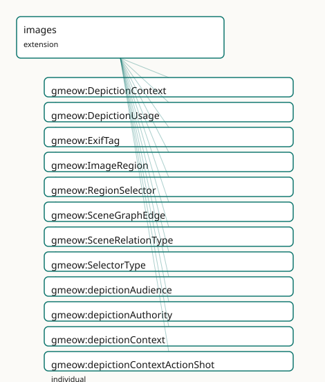

<!-- GENERATED by gmeow ontology-docs. DO NOT EDIT. -->

# GMEOW Images Module

- **IRI:** <https://blackcatinformatics.ca/gmeow/slices/images>
- **Tier:** extension
- **[`Group`](../reference/classes/gmeow-Group.md):** extensions

## What This Slice Covers

This slice owns 64 terms and contributes 20 mapping or projection rows. Use it when its terms match the native fact you want to preserve; use the linkage tables to see how those facts leave GMEOW for consumer vocabularies.

## Dependencies

- [`gmeow:slices/documents`](documents.md)
- [`gmeow:slices/kernel`](kernel.md)
- [`gmeow:slices/observations`](observations.md)
- [`gmeow:slices/temporal`](temporal.md)

## Consumers

- High-fidelity depiction (regions, scene graphs) atop core [`MediaObject`](../reference/classes/gmeow-MediaObject.md); the gmeow-image CLI.

## Local Map

## Terms

### Classes

| Term | Label | Definition |
|---|---|---|
| [`gmeow:DepictionContext`](../reference/classes/gmeow-DepictionContext.md) | Depiction Context | The context in which an image depicts an entity — a VALUE vocabulary (individuals, never subclasses). Work, family, childhood, portrait, candid, formal, and so... |
| [`gmeow:DepictionUsage`](../reference/classes/gmeow-DepictionUsage.md) | Depiction Usage | A reified, context-dependent depiction of an entity by an image — an observation in the universal claim stack: an entity (depictionSubject) is shown in a... |
| [`gmeow:ExifTag`](../reference/classes/gmeow-ExifTag.md) | EXIF Tag | A reified EXIF metadata tag of a media object — a tag identifier ([`gmeow:exifTagId`](../reference/properties/gmeow-exifTagId.md), e.g. 'FNumber'), its value ([`gmeow:exifTagValue`](../reference/properties/gmeow-exifTagValue.md), e.g. 'f/2.0'), and a human-r... |
| [`gmeow:ImageRegion`](../reference/classes/gmeow-ImageRegion.md) | Image Region | A region within an image — a structural part of a [`gmeow:MediaObject`](../reference/classes/gmeow-MediaObject.md), described by a [`gmeow:RegionSelector`](../reference/classes/gmeow-RegionSelector.md) that encodes its boundaries. The counterpart of Conten... |
| [`gmeow:RegionSelector`](../reference/classes/gmeow-RegionSelector.md) | Region Selector | The encoding descriptor for an image region — carries the selector type (a [`gmeow:SelectorType`](../reference/classes/gmeow-SelectorType.md) value) and the raw selector value (SVG path, pixel coordinates, m... |
| [`gmeow:SceneGraphEdge`](../reference/classes/gmeow-SceneGraphEdge.md) | Scene Graph Edge | A reified spatial or semantic relationship between two image regions — a [gufo:Relator](../external/terms.md#gufo-relator) mediating a subject region, an object region, a relation type, and a conf... |
| [`gmeow:SceneRelationType`](../reference/classes/gmeow-SceneRelationType.md) | Scene Relation Type | The spatial or semantic relation in a scene-graph edge — a VALUE vocabulary (individuals, never subclasses). leftOf, rightOf, above, below, inside, touching, n... |
| [`gmeow:SelectorType`](../reference/classes/gmeow-SelectorType.md) | Selector Type | The encoding kind of a region selector — a VALUE vocabulary (individuals, never subclasses). SVG path, pixel rectangle, fractional rectangle, polygon, RLE mask... |

### Properties

| Term | Label | Definition |
|---|---|---|
| [`gmeow:depictionAudience`](../reference/properties/gmeow-depictionAudience.md) | depiction audience | The audience or scope for which the depiction is intended — an Agent, a Group/Family, or a locale community. Range is [`gmeow:Entity`](../reference/classes/gmeow-Entity.md) to admit all of them. Non-fu... |
| [`gmeow:depictionAuthority`](../reference/properties/gmeow-depictionAuthority.md) | depiction authority | The authority behind a depiction usage — the [`gmeow:Agent`](../reference/classes/gmeow-Agent.md) (a photographer, a national archive, a self-asserting individual) that confers or sanctions the depict... |
| [`gmeow:depictionContext`](../reference/properties/gmeow-depictionContext.md) | depiction context | The context in which the image depicts the subject — work, family, childhood, portrait, candid, etc. A [`gmeow:DepictionContext`](../reference/classes/gmeow-DepictionContext.md) value. Functional per relator: on... |
| [`gmeow:depictionImage`](../reference/properties/gmeow-depictionImage.md) | depiction image | The image (MediaObject) that depicts the subject in a depiction usage. Functional per relator: one image per DepictionUsage. |
| [`gmeow:depictionInterval`](../reference/properties/gmeow-depictionInterval.md) | depiction interval | The time interval over which the depiction usage held. A relator carries its period this way (matching [`gmeow:usageInterval`](../reference/properties/gmeow-usageInterval.md), [`gmeow:relationshipInterval`](../reference/properties/gmeow-relationshipInterval.md)) rather... |
| [`gmeow:depictionSubject`](../reference/properties/gmeow-depictionSubject.md) | depiction subject | The entity that is depicted in a depiction usage. Functional per relator: one subject per DepictionUsage. |
| [`gmeow:exifTagId`](../reference/properties/gmeow-exifTagId.md) | EXIF tag id | The EXIF tag identifier — 'FNumber', 'ExposureTime', 'ColorSpace', 'GPSImgDirection'. The machine key; projects to schema:PropertyValue/propertyID. |
| [`gmeow:exifTagValue`](../reference/properties/gmeow-exifTagValue.md) | EXIF tag value | The value of an EXIF tag — 'f/2.0', '1/1595', 'sRGB'. Projects to schema:PropertyValue/value. The human-readable tag name ('Aperture') rides [rdfs:label](http://www.w3.org/2000/01/rdf-schema#label) → schem... |
| [`gmeow:hasExifTag`](../reference/properties/gmeow-hasExifTag.md) | has EXIF tag | Relates a media object to one of its reified EXIF tags. Non-functional: an image carries many tags. Projects to [schema:exifData.](https://schema.org/exifData.) |
| [`gmeow:hasLogo`](../reference/properties/gmeow-hasLogo.md) | has logo | The media object that serves as an entity's logo — its emblematic, identity-bearing image. An organization, software project, dataset, place, or product may ca... |
| [`gmeow:hasRegion`](../reference/properties/gmeow-hasRegion.md) | has region | Relates an image to a region within it. Non-functional: an image may have many regions. Inverse of [`gmeow:regionOf`](../reference/properties/gmeow-regionOf.md). |
| [`gmeow:regionLabel`](../reference/properties/gmeow-regionLabel.md) | region label | A human-readable label for the region — e.g. 'face', 'car', 'building facade'. |
| [`gmeow:regionOf`](../reference/properties/gmeow-regionOf.md) | region of | A region is part of exactly one image. Functional per region: one containing image per ImageRegion. Inverse of [`gmeow:hasRegion`](../reference/properties/gmeow-hasRegion.md). |
| [`gmeow:regionSelector`](../reference/properties/gmeow-regionSelector.md) | region selector | The selector that describes this region's boundaries. Functional per region: one selector per ImageRegion. |
| [`gmeow:sceneConfidence`](../reference/properties/gmeow-sceneConfidence.md) | scene confidence | The confidence of this scene-graph edge, as a decimal in [0.0, 1.0]. Functional: one confidence value per edge. |
| [`gmeow:sceneObject`](../reference/properties/gmeow-sceneObject.md) | scene object | The object region in a scene-graph edge — the region toward which the relation points. Functional per edge: one object per SceneGraphEdge. |
| [`gmeow:sceneRelation`](../reference/properties/gmeow-sceneRelation.md) | scene relation | The spatial or semantic relation of this edge — a [`gmeow:SceneRelationType`](../reference/classes/gmeow-SceneRelationType.md) value. Functional: one relation per edge. |
| [`gmeow:sceneSubject`](../reference/properties/gmeow-sceneSubject.md) | scene subject | The subject region in a scene-graph edge — the region from which the relation originates. Functional per edge: one subject per SceneGraphEdge. |
| [`gmeow:selectorType`](../reference/properties/gmeow-selectorType.md) | selector type | The encoding kind of this selector — a [`gmeow:SelectorType`](../reference/classes/gmeow-SelectorType.md) value. Functional: one kind per selector. |
| [`gmeow:selectorValue`](../reference/properties/gmeow-selectorValue.md) | selector value | The raw selector data — an SVG path string, a pixel rectangle (x,y,w,h), a fractional rectangle, a polygon coordinate list, an RLE-encoded mask string, a DICOM... |

### Individuals

| Term | Label | Definition |
|---|---|---|
| [`gmeow:depictionContextActionShot`](../reference/individuals/gmeow-depictionContextActionShot.md) | action shot | A depiction capturing the subject in motion or performing an activity. |
| [`gmeow:depictionContextCandid`](../reference/individuals/gmeow-depictionContextCandid.md) | candid | An unposed, spontaneous depiction. |
| [`gmeow:depictionContextChildhood`](../reference/individuals/gmeow-depictionContextChildhood.md) | childhood | A depiction from the subject's childhood. |
| [`gmeow:depictionContextEvent`](../reference/individuals/gmeow-depictionContextEvent.md) | event | A depiction at a specific event or occasion. |
| [`gmeow:depictionContextFamily`](../reference/individuals/gmeow-depictionContextFamily.md) | family | A depiction in a family or domestic context. |
| [`gmeow:depictionContextFormal`](../reference/individuals/gmeow-depictionContextFormal.md) | formal | A formal, staged depiction (ceremonial, official, professional). |
| [`gmeow:depictionContextNow`](../reference/individuals/gmeow-depictionContextNow.md) | now / current | A current depiction — the most recent or presently valid image. |
| [`gmeow:depictionContextPortrait`](../reference/individuals/gmeow-depictionContextPortrait.md) | portrait | A posed or formal portrait. |
| [`gmeow:depictionContextProfessional`](../reference/individuals/gmeow-depictionContextProfessional.md) | professional | A depiction in a professional or occupational context. |
| [`gmeow:depictionContextSelfPortrait`](../reference/individuals/gmeow-depictionContextSelfPortrait.md) | self-portrait | A depiction created by the subject of themselves. |
| [`gmeow:depictionContextSocial`](../reference/individuals/gmeow-depictionContextSocial.md) | social | A depiction in a social or recreational context. |
| [`gmeow:depictionContextWork`](../reference/individuals/gmeow-depictionContextWork.md) | work | A depiction in a work or professional context — a headshot, product photo, or institutional portrait. |
| [`gmeow:sceneRelationAbove`](../reference/individuals/gmeow-sceneRelationAbove.md) | above | The subject region is above the object region. |
| [`gmeow:sceneRelationBelow`](../reference/individuals/gmeow-sceneRelationBelow.md) | below | The subject region is below the object region. |
| [`gmeow:sceneRelationEating`](../reference/individuals/gmeow-sceneRelationEating.md) | eating | The subject region is eating the object region. |
| [`gmeow:sceneRelationFarFrom`](../reference/individuals/gmeow-sceneRelationFarFrom.md) | far from | The subject region is far from the object region. |
| [`gmeow:sceneRelationHolding`](../reference/individuals/gmeow-sceneRelationHolding.md) | holding | The subject region is holding the object region. |
| [`gmeow:sceneRelationInside`](../reference/individuals/gmeow-sceneRelationInside.md) | inside | The subject region is inside the object region. |
| [`gmeow:sceneRelationLeftOf`](../reference/individuals/gmeow-sceneRelationLeftOf.md) | left of | The subject region is to the left of the object region. |
| [`gmeow:sceneRelationNear`](../reference/individuals/gmeow-sceneRelationNear.md) | near | The subject region is near the object region. |
| [`gmeow:sceneRelationPartOf`](../reference/individuals/gmeow-sceneRelationPartOf.md) | part of | The subject region is a part of the object region (mereological). |
| [`gmeow:sceneRelationPlaying`](../reference/individuals/gmeow-sceneRelationPlaying.md) | playing | The subject region is playing with the object region. |
| [`gmeow:sceneRelationRiding`](../reference/individuals/gmeow-sceneRelationRiding.md) | riding | The subject region is riding the object region. |
| [`gmeow:sceneRelationRightOf`](../reference/individuals/gmeow-sceneRelationRightOf.md) | right of | The subject region is to the right of the object region. |
| [`gmeow:sceneRelationSameAs`](../reference/individuals/gmeow-sceneRelationSameAs.md) | same as | The subject region depicts the same entity as the object region (co-reference). |
| [`gmeow:sceneRelationTouching`](../reference/individuals/gmeow-sceneRelationTouching.md) | touching | The subject region touches the object region. |
| [`gmeow:sceneRelationWearing`](../reference/individuals/gmeow-sceneRelationWearing.md) | wearing | The subject region is wearing the object region. |
| [`gmeow:selectorTypeCocoRleMask`](../reference/individuals/gmeow-selectorTypeCocoRleMask.md) | COCO RLE mask | A COCO dataset run-length encoded mask. |
| [`gmeow:selectorTypeDicomSegMask`](../reference/individuals/gmeow-selectorTypeDicomSegMask.md) | DICOM-SEG mask | A DICOM Segmentation mask reference. |
| [`gmeow:selectorTypeFractionalRectangle`](../reference/individuals/gmeow-selectorTypeFractionalRectangle.md) | fractional rectangle | A fractional-coordinate rectangle (x, y, width, height) in [0.0, 1.0] relative to image dimensions. |
| [`gmeow:selectorTypePixelMask`](../reference/individuals/gmeow-selectorTypePixelMask.md) | pixel mask | A per-pixel binary or integer mask. |
| [`gmeow:selectorTypePixelRectangle`](../reference/individuals/gmeow-selectorTypePixelRectangle.md) | pixel rectangle | A pixel-coordinate rectangle (x, y, width, height). |
| [`gmeow:selectorTypePolygonPath`](../reference/individuals/gmeow-selectorTypePolygonPath.md) | polygon path | A polygon defined by a list of (x, y) coordinate pairs. |
| [`gmeow:selectorTypeRunLengthEncoded`](../reference/individuals/gmeow-selectorTypeRunLengthEncoded.md) | run-length encoded | A run-length encoded binary mask. |
| [`gmeow:selectorTypeSvgPath`](../reference/individuals/gmeow-selectorTypeSvgPath.md) | SVG path | An SVG path string (W3C Web Annotation [oa:SvgSelector](http://www.w3.org/ns/oa#SvgSelector)). |
| [`gmeow:selectorTypeWebAnnotationFragment`](../reference/individuals/gmeow-selectorTypeWebAnnotationFragment.md) | Web Annotation fragment | A W3C Web Annotation Media Fragment (xywh=..., t=...). |

## Linkages

- **Rows:** 20
- **Projection profiles:** `foaf`, `iiif`, `schema-org`
- **External vocabularies:** `foaf`, `iiif`, `oa`, `rdf`, `schema`, `wd`

| Source | Kind | Profile | Predicate/Relation | Target | Evidence |
|---|---|---|---|---|---|
| [`gmeow:ImageRegion`](../reference/classes/gmeow-ImageRegion.md) | equivalence | `-` | [skos:closeMatch](http://www.w3.org/2004/02/skos/core#closeMatch) | [iiif:Annotation](http://iiif.io/api/presentation/3#Annotation) | `gmeow-images.sssom.tsv`; `gmeow:eqImg063`; confidence 0.8 |
| [`gmeow:ImageRegion`](../reference/classes/gmeow-ImageRegion.md) | equivalence | `-` | [skos:closeMatch](http://www.w3.org/2004/02/skos/core#closeMatch) | [oa:SpecificResource](http://www.w3.org/ns/oa#SpecificResource) | `gmeow-images.sssom.tsv`; `gmeow:eqImg010`; confidence 0.85 |
| [`gmeow:ImageRegion`](../reference/classes/gmeow-ImageRegion.md) | equivalence | `-` | [skos:closeMatch](http://www.w3.org/2004/02/skos/core#closeMatch) | [wd:Q10884](https://www.wikidata.org/wiki/Q10884) | `gmeow-images.sssom.tsv`; `gmeow:eqImg040`; confidence 0.75 |
| [`gmeow:RegionSelector`](../reference/classes/gmeow-RegionSelector.md) | equivalence | `-` | [skos:closeMatch](http://www.w3.org/2004/02/skos/core#closeMatch) | [oa:Selector](http://www.w3.org/ns/oa#Selector) | `gmeow-images.sssom.tsv`; `gmeow:eqImg011`; confidence 0.85 |
| [`gmeow:SceneGraphEdge`](../reference/classes/gmeow-SceneGraphEdge.md) | equivalence | `-` | [skos:closeMatch](http://www.w3.org/2004/02/skos/core#closeMatch) | [wd:Q215032](https://www.wikidata.org/wiki/Q215032) | `gmeow-images.sssom.tsv`; `gmeow:eqImg041`; confidence 0.7 |
| [`gmeow:hasExifTag`](../reference/properties/gmeow-hasExifTag.md) | equivalence | `-` | [skos:closeMatch](http://www.w3.org/2004/02/skos/core#closeMatch) | [schema:exifData](https://schema.org/exifData) | `gmeow-properties.sssom.tsv`; `gmeow:eqProperties093`; confidence 0.9 |
| [`gmeow:hasLogo`](../reference/properties/gmeow-hasLogo.md) | equivalence | `-` | [skos:closeMatch](http://www.w3.org/2004/02/skos/core#closeMatch) | [foaf:logo](http://xmlns.com/foaf/0.1/logo) | `gmeow-properties.sssom.tsv`; `gmeow:eqProperties095`; confidence 0.95 |
| [`gmeow:hasLogo`](../reference/properties/gmeow-hasLogo.md) | equivalence | `-` | [skos:closeMatch](http://www.w3.org/2004/02/skos/core#closeMatch) | [schema:logo](https://schema.org/logo) | `gmeow-properties.sssom.tsv`; `gmeow:eqProperties094`; confidence 0.95 |
| [`gmeow:selectorTypePixelRectangle`](../reference/individuals/gmeow-selectorTypePixelRectangle.md) | equivalence | `-` | [skos:exactMatch](http://www.w3.org/2004/02/skos/core#exactMatch) | [oa:FragmentSelector](http://www.w3.org/ns/oa#FragmentSelector) | `gmeow-images.sssom.tsv`; `gmeow:eqImg012`; confidence 0.9 |
| [`gmeow:selectorTypeSvgPath`](../reference/individuals/gmeow-selectorTypeSvgPath.md) | equivalence | `-` | [skos:exactMatch](http://www.w3.org/2004/02/skos/core#exactMatch) | [oa:SvgSelector](http://www.w3.org/ns/oa#SvgSelector) | `gmeow-images.sssom.tsv`; `gmeow:eqImg013`; confidence 0.95 |
| [`gmeow:ImageRegion`](../reference/classes/gmeow-ImageRegion.md) | projection | `iiif` | projects to / <= | [iiif:Annotation](http://iiif.io/api/presentation/3#Annotation), [oa:FragmentSelector](http://www.w3.org/ns/oa#FragmentSelector), [oa:hasBody](http://www.w3.org/ns/oa#hasBody), [oa:hasTarget](http://www.w3.org/ns/oa#hasTarget), [rdf:type](http://www.w3.org/1999/02/22-rdf-syntax-ns#type), [rdf:value](http://www.w3.org/1999/02/22-rdf-syntax-ns#value) | `gmeow:mapIiifRegionAnnotation`; confidence 0.8; lossy: regionLabel, scene-graph edges, and selector type metadata dropped; only the selector value survives as a fragment |
| [`gmeow:exifTagId`](../reference/properties/gmeow-exifTagId.md) | projection | `schema-org` | projects to / <= | [rdf:type](http://www.w3.org/1999/02/22-rdf-syntax-ns#type), [schema:PropertyValue](https://schema.org/PropertyValue), [schema:exifData](https://schema.org/exifData), [schema:name](https://schema.org/name), [schema:propertyID](https://schema.org/propertyID), [schema:value](https://schema.org/value) | `gmeow:mapSchemaExifData`; confidence 0.95; lossy: none for the tag triple — propertyID/value/name carry the full EXIF tag; the [`gmeow:ExifTag`](../reference/classes/gmeow-ExifTag.md) node is reused as the PropertyValue |
| [`gmeow:exifTagValue`](../reference/properties/gmeow-exifTagValue.md) | projection | `schema-org` | projects to / <= | [rdf:type](http://www.w3.org/1999/02/22-rdf-syntax-ns#type), [schema:PropertyValue](https://schema.org/PropertyValue), [schema:exifData](https://schema.org/exifData), [schema:name](https://schema.org/name), [schema:propertyID](https://schema.org/propertyID), [schema:value](https://schema.org/value) | `gmeow:mapSchemaExifData`; confidence 0.95; lossy: none for the tag triple — propertyID/value/name carry the full EXIF tag; the [`gmeow:ExifTag`](../reference/classes/gmeow-ExifTag.md) node is reused as the PropertyValue |
| [`gmeow:hasExifTag`](../reference/properties/gmeow-hasExifTag.md) | projection | `schema-org` | projects to / <= | [rdf:type](http://www.w3.org/1999/02/22-rdf-syntax-ns#type), [schema:PropertyValue](https://schema.org/PropertyValue), [schema:exifData](https://schema.org/exifData), [schema:name](https://schema.org/name), [schema:propertyID](https://schema.org/propertyID), [schema:value](https://schema.org/value) | `gmeow:mapSchemaExifData`; confidence 0.95; lossy: none for the tag triple — propertyID/value/name carry the full EXIF tag; the [`gmeow:ExifTag`](../reference/classes/gmeow-ExifTag.md) node is reused as the PropertyValue |
| [`gmeow:hasLogo`](../reference/properties/gmeow-hasLogo.md) | projection | `foaf` | projects to / <= | [foaf:logo](http://xmlns.com/foaf/0.1/logo) | `gmeow:mapFoafLogo`; confidence 0.95 |
| [`gmeow:hasLogo`](../reference/properties/gmeow-hasLogo.md) | projection | `schema-org` | projects to / <= | [schema:logo](https://schema.org/logo) | `gmeow:mapSchemaLogo`; confidence 0.95 |
| [`gmeow:regionOf`](../reference/properties/gmeow-regionOf.md) | projection | `iiif` | projects to / <= | [iiif:Annotation](http://iiif.io/api/presentation/3#Annotation), [oa:FragmentSelector](http://www.w3.org/ns/oa#FragmentSelector), [oa:hasBody](http://www.w3.org/ns/oa#hasBody), [oa:hasTarget](http://www.w3.org/ns/oa#hasTarget), [rdf:type](http://www.w3.org/1999/02/22-rdf-syntax-ns#type), [rdf:value](http://www.w3.org/1999/02/22-rdf-syntax-ns#value) | `gmeow:mapIiifRegionAnnotation`; confidence 0.8; lossy: regionLabel, scene-graph edges, and selector type metadata dropped; only the selector value survives as a fragment |
| [`gmeow:regionSelector`](../reference/properties/gmeow-regionSelector.md) | projection | `iiif` | projects to / <= | [iiif:Annotation](http://iiif.io/api/presentation/3#Annotation), [oa:FragmentSelector](http://www.w3.org/ns/oa#FragmentSelector), [oa:hasBody](http://www.w3.org/ns/oa#hasBody), [oa:hasTarget](http://www.w3.org/ns/oa#hasTarget), [rdf:type](http://www.w3.org/1999/02/22-rdf-syntax-ns#type), [rdf:value](http://www.w3.org/1999/02/22-rdf-syntax-ns#value) | `gmeow:mapIiifRegionAnnotation`; confidence 0.8; lossy: regionLabel, scene-graph edges, and selector type metadata dropped; only the selector value survives as a fragment |
| [`gmeow:selectorType`](../reference/properties/gmeow-selectorType.md) | projection | `iiif` | projects to / <= | [iiif:Annotation](http://iiif.io/api/presentation/3#Annotation), [oa:FragmentSelector](http://www.w3.org/ns/oa#FragmentSelector), [oa:hasBody](http://www.w3.org/ns/oa#hasBody), [oa:hasTarget](http://www.w3.org/ns/oa#hasTarget), [rdf:type](http://www.w3.org/1999/02/22-rdf-syntax-ns#type), [rdf:value](http://www.w3.org/1999/02/22-rdf-syntax-ns#value) | `gmeow:mapIiifRegionAnnotation`; confidence 0.8; lossy: regionLabel, scene-graph edges, and selector type metadata dropped; only the selector value survives as a fragment |
| [`gmeow:selectorValue`](../reference/properties/gmeow-selectorValue.md) | projection | `iiif` | projects to / <= | [iiif:Annotation](http://iiif.io/api/presentation/3#Annotation), [oa:FragmentSelector](http://www.w3.org/ns/oa#FragmentSelector), [oa:hasBody](http://www.w3.org/ns/oa#hasBody), [oa:hasTarget](http://www.w3.org/ns/oa#hasTarget), [rdf:type](http://www.w3.org/1999/02/22-rdf-syntax-ns#type), [rdf:value](http://www.w3.org/1999/02/22-rdf-syntax-ns#value) | `gmeow:mapIiifRegionAnnotation`; confidence 0.8; lossy: regionLabel, scene-graph edges, and selector type metadata dropped; only the selector value survives as a fragment |

## Guide

<!-- SPDX-FileCopyrightText: 2026 Blackcat Informatics® Inc. <paudley@blackcatinformatics.ca> -->
<!-- SPDX-License-Identifier: CC-BY-4.0 -->

# Images — contextual depiction, regions, and scene graphs

> **Slice:** `https://blackcatinformatics.ca/gmeow/slices/images` · **tier: extension**
> Who is shown, where in the pixels, and how the parts relate — without a "primary photo".

Most schemas reduce imagery to a `photo` URL field. GMEOW treats depiction the way it
treats naming: as a **contextual, attributed, time-scoped claim**. The flat
[`gmeow:depicts`](../reference/properties/gmeow-depicts.md) shortcut (a subproperty of [`gmeow:isAbout`](../reference/properties/gmeow-isAbout.md), domain [`MediaObject`](../reference/classes/gmeow-MediaObject.md)) covers
the 80 % case; when context, audience, period, or authority must be recorded, promote to
the **[`DepictionUsage`](../reference/classes/gmeow-DepictionUsage.md)** relator — the exact mirror of [`NameUsage`](../reference/classes/gmeow-NameUsage.md). That pairing is
machine-readable: the module asserts [`gmeow:depicts`](../reference/properties/gmeow-depicts.md) [`gmeow:pairsWith`](../reference/properties/gmeow-pairsWith.md) [`gmeow:DepictionUsage`](../reference/classes/gmeow-DepictionUsage.md),
so tooling knows the flat form and the reified form are the same fact at two fidelities.
There is **no primary or preferred depiction** ([Principle 9](https://github.com/Blackcat-Informatics/gmeow-ontology/blob/main/CONSTITUTION.md#principle-9)): co-equal depictions coexist,
and a superseded one is suppressed with [`gmeow:displayable`](../reference/properties/gmeow-displayable.md) false, never deleted
([Principle 10](https://github.com/Blackcat-Informatics/gmeow-ontology/blob/main/CONSTITUTION.md#principle-10)). The slice builds on the WEMI spine — a visual work is a
[`gmeow:Work`](../reference/classes/gmeow-Work.md), the file a [`gmeow:Manifestation`](../reference/classes/gmeow-Manifestation.md)/[`MediaObject`](../reference/classes/gmeow-MediaObject.md) — and exists for its
Principle-15 consumer: **high-fidelity depiction (regions, scene graphs) atop the core
[`MediaObject`](../reference/classes/gmeow-MediaObject.md), driven by the `gmeow-image` CLI **.

## Layer 1 — contextual depiction

### [`gmeow:DepictionUsage`](../reference/classes/gmeow-DepictionUsage.md)

The reified, context-dependent depiction relator — an [`Observation`](../reference/classes/gmeow-Observation.md) in the universal claim
stack. Mint one per *(entity, image, context)* tuple: [`depictionSubject`](../reference/properties/gmeow-depictionSubject.md) (functional),
[`depictionImage`](../reference/properties/gmeow-depictionImage.md) (functional), [`depictionContext`](../reference/properties/gmeow-depictionContext.md), plus optional [`depictionAudience`](../reference/properties/gmeow-depictionAudience.md) and
[`depictionInterval`](../reference/properties/gmeow-depictionInterval.md). Perspectival, never global; paired with the flat [`gmeow:depicts`](../reference/properties/gmeow-depicts.md) via
[`gmeow:pairsWith`](../reference/properties/gmeow-pairsWith.md).

### [`gmeow:depictionAuthority`](../reference/properties/gmeow-depictionAuthority.md)

The [`gmeow:Agent`](../reference/classes/gmeow-Agent.md) that confers or sanctions the depiction in this use — a photographer, an
archive, a self-asserting subject. Deliberately **non-functional**: joint or competing
authorities coexist with no privileged claimant ([Principle 9](https://github.com/Blackcat-Informatics/gmeow-ontology/blob/main/CONSTITUTION.md#principle-9)), each attributable and
confidence-weighted.

### [`gmeow:DepictionContext`](../reference/classes/gmeow-DepictionContext.md)

The open value vocabulary ([Principle 9](https://github.com/Blackcat-Informatics/gmeow-ontology/blob/main/CONSTITUTION.md#principle-9) — individuals, never subclasses) for *how* an image
shows its subject: work, family, childhood, portrait, candid, self-portrait, event, and so
on. A new context is data, not a schema change.

## Layer 2 — region encoding

### [`gmeow:ImageRegion`](../reference/classes/gmeow-ImageRegion.md)

A structural part of an image — the visual counterpart of [`ContentSegment`](../reference/classes/gmeow-ContentSegment.md): a face, a
bounding box, a pixel mask. Belongs to exactly one image ([`gmeow:regionOf`](../reference/properties/gmeow-regionOf.md), functional;
inverse [`gmeow:hasRegion`](../reference/properties/gmeow-hasRegion.md)) and carries a human-readable [`gmeow:regionLabel`](../reference/properties/gmeow-regionLabel.md).

### [`gmeow:RegionSelector`](../reference/classes/gmeow-RegionSelector.md)

The encoding descriptor for a region's boundaries: one [`gmeow:selectorType`](../reference/properties/gmeow-selectorType.md) plus the raw
[`gmeow:selectorValue`](../reference/properties/gmeow-selectorValue.md) literal. The canonical superset of W3C Web [`Annotation`](../reference/classes/gmeow-Annotation.md) selectors,
IIIF selectors, and domain mask formats. Attached via [`gmeow:regionSelector`](../reference/properties/gmeow-regionSelector.md) (functional —
one selector per region).

### [`gmeow:SelectorType`](../reference/classes/gmeow-SelectorType.md)

Open value vocabulary of encoding kinds: SVG path, pixel rectangle, fractional rectangle,
polygon, RLE, COCO RLE, DICOM-SEG, pixel mask, Web [`Annotation`](../reference/classes/gmeow-Annotation.md) fragment. Parsing and
coordinate conversion are **solver-layer work** ([Principle 12](https://github.com/Blackcat-Informatics/gmeow-ontology/blob/main/CONSTITUTION.md#principle-12)) — the graph records which
encoding was used, never re-derives geometry.

## Layer 4 — scene graphs

### [`gmeow:SceneGraphEdge`](../reference/classes/gmeow-SceneGraphEdge.md)

A reified spatial or semantic relationship between two regions — a [`gufo:Relator`](../external/terms.md#gufo-relator)
mediating [`sceneSubject`](../reference/properties/gmeow-sceneSubject.md) and [`sceneObject`](../reference/properties/gmeow-sceneObject.md) (both functional, both [`ImageRegion`](../reference/classes/gmeow-ImageRegion.md)), a
[`sceneRelation`](../reference/properties/gmeow-sceneRelation.md), and an explicit [`gmeow:sceneConfidence`](../reference/properties/gmeow-sceneConfidence.md) decimal in [0.0, 1.0]. Aligns by
reference to Visual Genome and OVSR relation strings.

### [`gmeow:SceneRelationType`](../reference/classes/gmeow-SceneRelationType.md)

The open relation vocabulary for edges — `leftOf`, `inside`, `holding`, `wearing`,
`riding`, `sameAs` (co-reference), [`partOf`](../reference/properties/gmeow-partOf.md) (mereological), and friends. The relation is a
**value, never a subclass** ([Principle 9](https://github.com/Blackcat-Informatics/gmeow-ontology/blob/main/CONSTITUTION.md#principle-9)): a new predicate from a new detector is a fresh
individual.

## Solver layer & projections

The slice models *which* facts hold; computation lives outside the graph ([Principle 12](https://github.com/Blackcat-Informatics/gmeow-ontology/blob/main/CONSTITUTION.md#principle-12)):
mask parsing, coordinate-space conversion, scene-graph inference, and IIIF Presentation
API 3 rendering (Layer 3 of the design is *purely projection* — Canvas/Annotation mapping
adds no ontology terms). Technical metadata ([`pixelWidth`](../reference/properties/gmeow-pixelWidth.md), [`captureDevice`](../reference/properties/gmeow-captureDevice.md), colourspace
via [`gmeow:hasReferenceFrame`](../reference/properties/gmeow-hasReferenceFrame.md)) lives on [`MediaObject`](../reference/classes/gmeow-MediaObject.md) in the documents slice; rights reuse
the facility; provenance reuses [`wasGeneratedBy`](../reference/properties/gmeow-wasGeneratedBy.md)/[`wasDerivedFrom`](../reference/properties/gmeow-wasDerivedFrom.md).

## Alignment & dependencies

All alignments are by reference, never import ([Principle 5](https://github.com/Blackcat-Informatics/gmeow-ontology/blob/main/CONSTITUTION.md#principle-5)): schema.org `ImageObject`,
IIIF, W3C Web [`Annotation`](../reference/classes/gmeow-Annotation.md), W3C EXIF Ontology, XMP, IPTC, and CIDOC-CRM/CRMdig. Depends on
`kernel`, `documents` ([`MediaObject`](../reference/classes/gmeow-MediaObject.md)), `observations` (the claim stack [`DepictionUsage`](../reference/classes/gmeow-DepictionUsage.md) sits
in), and `temporal` (depiction intervals).

## EXIF tags

### [`gmeow:ExifTag`](../reference/classes/gmeow-ExifTag.md) · [`gmeow:hasExifTag`](../reference/properties/gmeow-hasExifTag.md) · [`gmeow:exifTagId`](../reference/properties/gmeow-exifTagId.md) · [`gmeow:exifTagValue`](../reference/properties/gmeow-exifTagValue.md)

A camera's EXIF metadata is an **open, camera-defined** set of tag/value pairs. To carry
it **losslessly** — every tag survives an `index.ttl → GMEOW → index.ttl` round-trip —
each tag is a reified [`gmeow:ExifTag`](../reference/classes/gmeow-ExifTag.md) in the [`schema:PropertyValue`](https://schema.org/PropertyValue) shape:
[`gmeow:exifTagId`](../reference/properties/gmeow-exifTagId.md) (the tag, "FNumber" → [`schema:propertyID`](https://schema.org/propertyID)), [`gmeow:exifTagValue`](../reference/properties/gmeow-exifTagValue.md)
("f/2.0" → [`schema:value`](https://schema.org/value)), and [`rdfs:label`](http://www.w3.org/2000/01/rdf-schema#label) ("Aperture" → [`schema:name`](https://schema.org/name)). Never a fixed
property per tag (P9). The meaningful facts (capture device/time, GPS, colourspace) also
ride their typed properties; the [`ExifTag`](../reference/classes/gmeow-ExifTag.md) set is the complete, faithful carrier, projected
to [`schema:exifData`](https://schema.org/exifData).

## Logo

### [`gmeow:hasLogo`](../reference/properties/gmeow-hasLogo.md)

[`gmeow:hasLogo`](../reference/properties/gmeow-hasLogo.md) links an entity to the **media object that serves as its logo** — its
emblematic, identity-bearing image. An organization, software project, dataset, place, or
product may carry one (domain [`gmeow:Entity`](../reference/classes/gmeow-Entity.md), range [`gmeow:MediaObject`](../reference/classes/gmeow-MediaObject.md)). It is
**deliberately distinct from [`gmeow:depicts`](../reference/properties/gmeow-depicts.md)**: a logo *represents* the entity rather than
*picturing* it (the gmeow-logo.svg does not depict the ontology), so [`hasLogo`](../reference/properties/gmeow-hasLogo.md) is **not** a
subproperty of [`gmeow:isAbout`](../reference/properties/gmeow-isAbout.md) — mirroring why [`schema:logo`](https://schema.org/logo) is separate from [`schema:image`](https://schema.org/image)
upstream. Non-functional: light/dark, wordmark/glyph, and seasonal variants coexist (P9).
Projects to [`schema:logo`](https://schema.org/logo) and [`foaf:logo`](http://xmlns.com/foaf/0.1/logo).
