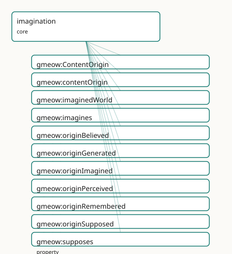

<!-- GENERATED by gmeow ontology-docs. DO NOT EDIT. -->

# GMEOW Imagination Module

- **IRI:** <https://blackcatinformatics.ca/gmeow/slices/imagination>
- **Tier:** core
- **[`Group`](../reference/classes/gmeow-Group.md):** core

## What This Slice Covers

This slice owns 11 terms and contributes 1 mapping or projection rows. Use it when its terms match the native fact you want to preserve; use the linkage tables to see how those facts leave GMEOW for consumer vocabularies.

## Dependencies

- [`gmeow:slices/kernel`](kernel.md)

## Consumers

- Reality-monitoring for the agent-memory flagship ([Principle 14](https://github.com/Blackcat-Informatics/gmeow-ontology/blob/main/CONSTITUTION.md#principle-14)) — store_claim records a [`gmeow:contentOrigin`](../reference/properties/gmeow-contentOrigin.md) ([`gmeow:originPerceived`](../reference/individuals/gmeow-originPerceived.md) / [`originRemembered`](../reference/individuals/gmeow-originRemembered.md) / [`originBelieved`](../reference/individuals/gmeow-originBelieved.md) / [`originImagined`](../reference/individuals/gmeow-originImagined.md) / [`originSupposed`](../reference/individuals/gmeow-originSupposed.md) / [`originGenerated`](../reference/individuals/gmeow-originGenerated.md)) so recall can tell a recalled fact from a confabulated or LLM-generated one, [`gmeow:originGenerated`](../reference/individuals/gmeow-originGenerated.md) being the disciplined hallucination/provenance marker; counterfactual rehearsal and planning rollouts entertain content with [`gmeow:imagines`](../reference/properties/gmeow-imagines.md) / [`gmeow:supposes`](../reference/properties/gmeow-supposes.md) against an imagined [`gmeow:imaginedWorld`](../reference/properties/gmeow-imaginedWorld.md) (logic:, by reference); fiction and narrative interiority are shared licensed imagining bridging [`gmeow:veridicalityLicensedFalsehood`](../reference/individuals/gmeow-veridicalityLicensedFalsehood.md) (deception); abduction entertains candidate explanations as suppositions before any are believed.

## Local Map



## Examples

### Counterfactual Rehearsal

- **Source:** [`slices/core/imagination/examples/counterfactual-rehearsal.ttl`](https://github.com/Blackcat-Informatics/gmeow-ontology/blob/main/slices/core/imagination/examples/counterfactual-rehearsal.ttl)
- **GMEOW terms:** [`gmeow:Agent`](../reference/classes/gmeow-Agent.md), [`gmeow:Proposition`](../reference/classes/gmeow-Proposition.md), [`gmeow:contentOrigin`](../reference/properties/gmeow-contentOrigin.md), [`gmeow:imaginedWorld`](../reference/properties/gmeow-imaginedWorld.md), [`gmeow:imagines`](../reference/properties/gmeow-imagines.md), [`gmeow:originImagined`](../reference/individuals/gmeow-originImagined.md), [`gmeow:originSupposed`](../reference/individuals/gmeow-originSupposed.md), [`gmeow:supposes`](../reference/properties/gmeow-supposes.md)
- **External prefixes:** `logic`

```turtle
# SPDX-FileCopyrightText: 2026 Blackcat Informatics® Inc. <paudley@blackcatinformatics.ca>
# SPDX-License-Identifier: CC-BY-4.0
#
# Worked example — counterfactual rehearsal. An agent SUPPOSES a proposition (a
# what-if premise), opening an imagined gmeow:imaginedWorld (a logic:World, BY
# REFERENCE — no triple is asserted INTO the logic: namespace by the module; the
# example merely instantiates the open-range target), and IMAGINES the scene that
# would obtain in it. The supposed premise and the imagined scene carry their
# reality-monitoring source via gmeow:contentOrigin (originSupposed / originImagined),
# so nothing here is mistaken for a perceived or remembered fact. No truth bit
# anywhere: supposing and imagining assert neither truth nor commitment.

@prefix gmeow: <https://blackcatinformatics.ca/gmeow/> .
@prefix logic: <https://blackcatinformatics.ca/logic/> .
@prefix ex:    <https://blackcatinformatics.ca/gmeow/examples/imagination/> .
@prefix rdfs:  <http://www.w3.org/2000/01/rdf-schema#> .

# --- The agent and the what-if premise she takes on hypothetically.
ex:lillith a gmeow:Agent ;
    gmeow:supposes ex:interestRatesDouble ;   # held AS-IF, not believed
    gmeow:imagines ex:recessionScene .         # the scene she pictures under it

# --- The supposed proposition. Its reality-monitoring source is "supposed": it is
#     entertained for argument, never asserted as a fact.
ex:interestRatesDouble a gmeow:Proposition ;
    rdfs:label "interest rates double next year"@en ;
    gmeow:contentOrigin gmeow:originSupposed .

# --- The imagined counterfactual world the supposition opens. Typed logic:World by
#     reference (the logic slice's counterfactual-world machinery); imagination USES
#     the modal machinery without the slice depending on logic:.
ex:worldRatesDouble a logic:World ;
    rdfs:label "the world where rates double"@en .

# --- The supposition and the imagining are scoped to that imagined world.
ex:interestRatesDouble gmeow:imaginedWorld ex:worldRatesDouble .
ex:recessionScene gmeow:imaginedWorld ex:worldRatesDouble .

# --- The imagined scene. Its source is "imagined": quasi-perceptual content the
#     agent generates, the canonical thing reality-monitoring must NOT later misread
#     as perceived or remembered.
ex:recessionScene a gmeow:Proposition ;
    rdfs:label "shuttered shops on the high street"@en ;
    gmeow:contentOrigin gmeow:originImagined .
```

### Reality Monitoring

- **Source:** [`slices/core/imagination/examples/reality-monitoring.ttl`](https://github.com/Blackcat-Informatics/gmeow-ontology/blob/main/slices/core/imagination/examples/reality-monitoring.ttl)
- **GMEOW terms:** [`gmeow:Agent`](../reference/classes/gmeow-Agent.md), [`gmeow:Proposition`](../reference/classes/gmeow-Proposition.md), [`gmeow:Standpoint`](../reference/classes/gmeow-Standpoint.md), [`gmeow:StandpointClaim`](../reference/classes/gmeow-StandpointClaim.md), [`gmeow:accordingTo`](../reference/properties/gmeow-accordingTo.md), [`gmeow:claimModality`](../reference/properties/gmeow-claimModality.md), [`gmeow:claimVeridicality`](../reference/properties/gmeow-claimVeridicality.md), [`gmeow:contentOrigin`](../reference/properties/gmeow-contentOrigin.md), [`gmeow:methodDirectObservation`](../reference/individuals/gmeow-methodDirectObservation.md), [`gmeow:methodExpertJudgement`](../reference/individuals/gmeow-methodExpertJudgement.md)

```turtle
# SPDX-FileCopyrightText: 2026 Blackcat Informatics® Inc. <paudley@blackcatinformatics.ca>
# SPDX-License-Identifier: CC-BY-4.0
#
# Worked example — reality-monitoring, the flagship. The SAME content (a claimed
# meeting) carries TWO coexisting gmeow:contentOrigin attributions from two vantages:
# the agent recalls it as gmeow:originRemembered, while an auditor reviewing the
# agent's memory marks it gmeow:originGenerated — a confabulation / hallucination
# synthesised by the model, not actually remembered. Neither overwrites the other
# (Principle 9, vantage-indexed; Principle 10, retain-never-delete): both are recorded
# as gmeow:StandpointClaims, whose attribution rides gmeow:vantage. Origin
# (where the content came from) is kept SEPARATE from veridicality (whether it is
# true — gmeow:claimVeridicality, deception slice, by reference) and from authorship
# (gmeow:accordingTo). This is exactly the recalled-vs-confabulated discrimination the
# agent-memory product needs.

@prefix gmeow: <https://blackcatinformatics.ca/gmeow/> .
@prefix ex:    <https://blackcatinformatics.ca/gmeow/examples/imagination/> .
@prefix rdfs:  <http://www.w3.org/2000/01/rdf-schema#> .

# --- The content whose origin is in question.
ex:meetingHappened a gmeow:Proposition ;
    rdfs:label "we agreed the budget at the March meeting"@en .

# --- Vantage 1: the agent, who recalls the content as a memory.
ex:lillith a gmeow:Agent .
ex:lillithView a gmeow:Standpoint ;
    gmeow:sharpens gmeow:universalStandpoint .

ex:agentRecall a gmeow:StandpointClaim ;
    gmeow:vantage ex:lillithView ;
    gmeow:observedFeature ex:meetingHappened ;
    gmeow:observationMethod gmeow:methodDirectObservation ;
    gmeow:claimModality gmeow:probable ;
    gmeow:contentOrigin gmeow:originRemembered .   # the agent takes it as recalled

# --- Vantage 2: an auditor reviewing the agent's memory, who finds no grounding and
#     marks the same content as model-generated (a confabulation). The origin
#     attributions COEXIST; the auditor does not delete the agent's, it adds its own.
ex:auditorView a gmeow:Standpoint ;
    gmeow:sharpens gmeow:universalStandpoint .

ex:auditorAssessment a gmeow:StandpointClaim ;
    gmeow:vantage ex:auditorView ;
    gmeow:observedFeature ex:meetingHappened ;
    gmeow:observationMethod gmeow:methodExpertJudgement ;
    gmeow:claimModality gmeow:refuted ;
    gmeow:contentOrigin gmeow:originGenerated .   # the auditor: synthesised, not remembered
```

## Terms

### Classes

| Term | Label | Definition |
|---|---|---|
| [`gmeow:ContentOrigin`](../reference/classes/gmeow-ContentOrigin.md) | Content Origin | The reality-monitoring source of a piece of content — where it came from in the agent's mental economy: perceived from the world, retrieved from memory, held a... |

### Properties

| Term | Label | Definition |
|---|---|---|
| [`gmeow:contentOrigin`](../reference/properties/gmeow-contentOrigin.md) | content origin | Marks a piece of content with its reality-monitoring source — one of the closed [`gmeow:ContentOrigin`](../reference/classes/gmeow-ContentOrigin.md) value vocabulary. The DOMAIN is left intentionally OPEN: th... |
| [`gmeow:imaginedWorld`](../reference/properties/gmeow-imaginedWorld.md) | imagined world | Relates an imagining or supposition to the imagined / counterfactual WORLD it explores — the reified context within which the as-if content is evaluated. Both... |
| [`gmeow:imagines`](../reference/properties/gmeow-imagines.md) | imagines | An agent entertains content AS-IF — quasi-perceptually, decoupled from current perception and from belief: picturing a scene, an object, or a situation without... |
| [`gmeow:supposes`](../reference/properties/gmeow-supposes.md) | supposes | An agent takes a proposition on HYPOTHETICALLY — for the sake of argument or exploration, in a suppositional mood, without holding it true. The propositional s... |

### Individuals

| Term | Label | Definition |
|---|---|---|
| [`gmeow:originBelieved`](../reference/individuals/gmeow-originBelieved.md) | believed | Content HELD AS BELIEF — taken to be true ([`gmeow:believes`](../reference/properties/gmeow-believes.md), epistemics, by reference), whatever its ultimate source. The doxastic origin, distinct from the perc... |
| [`gmeow:originGenerated`](../reference/individuals/gmeow-originGenerated.md) | generated | Content SYNTHESISED BY A GENERATIVE PROCESS — machine-produced, as when a language model samples its latent space (the AI face of imagination). The disciplined... |
| [`gmeow:originImagined`](../reference/individuals/gmeow-originImagined.md) | imagined | Content GENERATED BY IMAGINING — entertained quasi-perceptually as-if ([`gmeow:imagines`](../reference/properties/gmeow-imagines.md); the occurrent face is a [`gmeow:processImagining`](../reference/individuals/gmeow-processImagining.md), mentation, by reference)... |
| [`gmeow:originPerceived`](../reference/individuals/gmeow-originPerceived.md) | perceived | Content originating in PERCEPTION — registered from the environment (or an internal bodily state) as it occurred. The externally-grounded source, the occurrent... |
| [`gmeow:originRemembered`](../reference/individuals/gmeow-originRemembered.md) | remembered | Content RETRIEVED from memory — recalled into present awareness, not currently perceived (the occurrent face is a [`gmeow:processRecollection`](../reference/individuals/gmeow-processRecollection.md), mentation, by refe... |
| [`gmeow:originSupposed`](../reference/individuals/gmeow-originSupposed.md) | supposed | Content entertained as a SUPPOSITION — taken on hypothetically for argument or exploration ([`gmeow:supposes`](../reference/properties/gmeow-supposes.md)), not asserted. The hypothetical source, characteris... |

## Linkages

- **Rows:** 1
- **Projection profiles:** -
- **External vocabularies:** `prov`

| Source | Kind | Profile | Predicate/Relation | Target | Evidence |
|---|---|---|---|---|---|
| [`gmeow:originGenerated`](../reference/individuals/gmeow-originGenerated.md) | equivalence | `-` | [skos:relatedMatch](http://www.w3.org/2004/02/skos/core#relatedMatch) | [prov:Generation](http://www.w3.org/ns/prov#Generation) | `gmeow-imagination.sssom.tsv`; `gmeow:eqImagination001`; confidence 0.4 |

## Guide

<!--
SPDX-FileCopyrightText: 2026 Blackcat Informatics® Inc. <paudley@blackcatinformatics.ca>
SPDX-License-Identifier: CC-BY-4.0
-->

# Imagination

The **imagination** slice adds the third attitude-flavour of mind. Where the
[epistemics](../epistemics/) slice relates an agent to a [`gmeow:Proposition`](../reference/classes/gmeow-Proposition.md) held
**true** ([`gmeow:believes`](../reference/properties/gmeow-believes.md)) or taken on **pragmatically** ([`gmeow:accepts`](../reference/properties/gmeow-accepts.md)), and the
[inquiry](../inquiry/) slice relates it to a [`gmeow:Question`](../reference/classes/gmeow-Question.md) held **open**,
imagination relates an agent to content entertained **as-if** — quasi-perceptual or
suppositional, decoupled from both belief and current perception. It is the faculty
that actually *uses* the counterfactual worlds of the [logic](../logic/) slice, and
it carries the slice's flagship deliverable: the **content-origin / reality-monitoring**
vocabulary that lets agent memory tell a recalled fact from a confabulated or
machine-generated one.

## The missing as-if attitude

A model of mind that records only belief and acceptance cannot represent *entertaining*
— picturing a scene that is not before you, or supposing a premise to chase its
consequences. Imagining is neither asserting (no mind-to-world fit, unlike belief) nor
committing (no working-premise role, unlike acceptance): it holds content **as-if**.
The imagining *episode* is already modelled in the [mentation](../mentation/) slice as a
[`gmeow:MentalProcess`](../reference/classes/gmeow-MentalProcess.md) with [`gmeow:mentalProcessType`](../reference/properties/gmeow-mentalProcessType.md) [`gmeow:processImagining`](../reference/individuals/gmeow-processImagining.md); this slice
adds the *content / attitude* layer over it — reused by reference, never re-minted
([Principle 6](https://github.com/Blackcat-Informatics/gmeow-ontology/blob/main/CONSTITUTION.md#principle-6)).

## The imagination attitude spine

### [`gmeow:imagines`](../reference/properties/gmeow-imagines.md) · [`gmeow:supposes`](../reference/properties/gmeow-supposes.md)

Two flat agent→content attitudes (domain [`gmeow:Agent`](../reference/classes/gmeow-Agent.md), **OPEN** range, non-functional)
— the cheap 80 % surface ([Principle 4](https://github.com/Blackcat-Informatics/gmeow-ontology/blob/main/CONSTITUTION.md#principle-4) / [Principle 13](https://github.com/Blackcat-Informatics/gmeow-ontology/blob/main/CONSTITUTION.md#principle-13)), mirroring the epistemics doxastic
spine and the inquiry erotetic spine. There is **no** [`rdfs:subPropertyOf`](http://www.w3.org/2000/01/rdf-schema#subPropertyOf) between them:
quasi-perceptual imagining and propositional supposition are two distinct attitudes, not
a hierarchy.

* **[`gmeow:imagines`](../reference/properties/gmeow-imagines.md)** — entertains content quasi-perceptually as-if: picturing a scene,
 an object, a situation, without holding it true. The base imaginative attitude, the
 natural companion of a [`gmeow:processImagining`](../reference/individuals/gmeow-processImagining.md) episode; the home of counterfactual
 rehearsal, planning rollouts, and fiction.
* **[`gmeow:supposes`](../reference/properties/gmeow-supposes.md)** — takes a proposition on hypothetically, for the sake of argument
 or exploration (the antecedent of a conditional, the hypothesis of a reductio). It
 characteristically opens an imagined world ([`gmeow:imaginedWorld`](../reference/properties/gmeow-imaginedWorld.md)) explored under it.

Both are decoupled from [`gmeow:believes`](../reference/properties/gmeow-believes.md) (holds true) and [`gmeow:accepts`](../reference/properties/gmeow-accepts.md) (pragmatic
working commitment); imagining and supposing assert neither truth nor commitment. From
whose vantage content is entertained rides [`gmeow:accordingTo`](../reference/properties/gmeow-accordingTo.md) on the statement, never a
truth bit here.

## Content origin — reality-monitoring (the flagship)

### [`gmeow:ContentOrigin`](../reference/classes/gmeow-ContentOrigin.md) · [`gmeow:contentOrigin`](../reference/properties/gmeow-contentOrigin.md)

[`gmeow:ContentOrigin`](../reference/classes/gmeow-ContentOrigin.md) is a **value vocabulary** ([`gufo:AbstractIndividualType`](../external/terms.md#gufo-abstractindividualtype) ⊑
[`gufo:QualityValue`](../external/terms.md#gufo-qualityvalue)) whose members are individuals, never subclasses ([Principle 9](https://github.com/Blackcat-Informatics/gmeow-ontology/blob/main/CONSTITUTION.md#principle-9), the
[`gmeow:MentalProcessType`](../reference/classes/gmeow-MentalProcessType.md) / [`gmeow:QuestionType`](../reference/classes/gmeow-QuestionType.md) idiom): it records *where a piece of
content came from* in the agent's mental economy. It implements Marcia Johnson's
**source-monitoring framework** (by reference) — the discrimination an agent (or an
auditor) makes between a recalled fact and a confabulated or machine-generated one.

| Individual | Source |
| --- | --- |
| [`gmeow:originPerceived`](../reference/individuals/gmeow-originPerceived.md) | registered from the environment (a [`gmeow:processPerception`](../reference/individuals/gmeow-processPerception.md)) |
| [`gmeow:originRemembered`](../reference/individuals/gmeow-originRemembered.md) | retrieved from memory (a [`gmeow:processRecollection`](../reference/individuals/gmeow-processRecollection.md)) |
| [`gmeow:originBelieved`](../reference/individuals/gmeow-originBelieved.md) | held as belief ([`gmeow:believes`](../reference/properties/gmeow-believes.md)), whatever its ground |
| [`gmeow:originImagined`](../reference/individuals/gmeow-originImagined.md) | generated by imagining ([`gmeow:imagines`](../reference/properties/gmeow-imagines.md)) — the canonical confabulation source |
| [`gmeow:originSupposed`](../reference/individuals/gmeow-originSupposed.md) | entertained as a supposition ([`gmeow:supposes`](../reference/properties/gmeow-supposes.md)), scoped to an imagined world |
| [`gmeow:originGenerated`](../reference/individuals/gmeow-originGenerated.md) | synthesised by a generative process — the AI face: an LLM sampling its latent space |

[`gmeow:contentOrigin`](../reference/properties/gmeow-contentOrigin.md) (open domain, range [`gmeow:ContentOrigin`](../reference/classes/gmeow-ContentOrigin.md)) marks content with its
source. It is **non-functional and vantage-indexed** ([Principle 9](https://github.com/Blackcat-Informatics/gmeow-ontology/blob/main/CONSTITUTION.md#principle-9)): an agent may take
content as [`gmeow:originRemembered`](../reference/individuals/gmeow-originRemembered.md) while an auditor marks the same content
[`gmeow:originGenerated`](../reference/individuals/gmeow-originGenerated.md), and **both coexist** — whose attribution it is rides
[`gmeow:accordingTo`](../reference/properties/gmeow-accordingTo.md), a superseded attribution is suppressed with [`gmeow:displayable`](../reference/properties/gmeow-displayable.md) false
rather than deleted ([Principle 10](https://github.com/Blackcat-Informatics/gmeow-ontology/blob/main/CONSTITUTION.md#principle-10)). The flagship `store_claim` records a
[`gmeow:contentOrigin`](../reference/properties/gmeow-contentOrigin.md) so `recall` can tell a recalled fact from a confabulated one.

**[`gmeow:originGenerated`](../reference/individuals/gmeow-originGenerated.md) marks provenance, not identity.** It records that content was
machine-synthesised *without* asserting that generative sampling **is** imagining; the
human↔machine mapping is a shared faculty with substrate-specific realisations, not an
equivalence (umbrella guardrail). A generated claim later misread as remembered is
exactly the failure this value guards against.

Three axes co-apply and stay separate: **origin** ([`gmeow:contentOrigin`](../reference/properties/gmeow-contentOrigin.md) — where content
came from), **veridicality** ([`gmeow:claimVeridicality`](../reference/properties/gmeow-claimVeridicality.md), [deception](../deception/), by
reference — whether it is true / untrue / licensed-false), and **attribution**
([`gmeow:accordingTo`](../reference/properties/gmeow-accordingTo.md) — who holds it).

## Imagined worlds

### [`gmeow:imaginedWorld`](../reference/properties/gmeow-imaginedWorld.md)

Relates an imagining or supposition to the imagined / counterfactual **world** it
explores. Both domain and range are **OPEN**: the target is a [`logic:World`](https://blackcatinformatics.ca/logic/World) (the
counterfactual-world machinery of the [logic](../logic/) slice), but the link is carried
**by reference** ([Principle 5](https://github.com/Blackcat-Informatics/gmeow-ontology/blob/main/CONSTITUTION.md#principle-5)) — no triple is asserted into the [`logic:`](https://blackcatinformatics.ca/logic/) namespace and
`logic` is **not** a declared dependency, exactly as the [inference](../inference/) slice
references the [`logic:`](https://blackcatinformatics.ca/logic/) strength axes without importing logic. This is the seam at which
imagination *uses* the modal machinery — a supposition opens a counterfactual world and
the imagining explores it — without coupling the slice's import closure to [`logic:`](https://blackcatinformatics.ca/logic/). It
is non-functional: one rehearsal may branch into several imagined worlds.

## Content-mode siblings, no subsumption

Imagined and suppositional content sit **beside** [`gmeow:Proposition`](../reference/classes/gmeow-Proposition.md) (assertoric),
[`gmeow:Goal`](../reference/classes/gmeow-Goal.md) (optative), and [`gmeow:Question`](../reference/classes/gmeow-Question.md) (erotetic) as a *mode of entertaining*,
bridged by reference, never via [`rdfs:subClassOf`](http://www.w3.org/2000/01/rdf-schema#subClassOf) (the direction-of-fit precedent). This
slice therefore mints **no new content class**: the attitude verbs plus the
[`gmeow:originImagined`](../reference/individuals/gmeow-originImagined.md) / [`gmeow:originSupposed`](../reference/individuals/gmeow-originSupposed.md) markers carry the as-if.

## Fiction is licensed imagining

Shared, audience-understood imagining (fiction, pretense, role-play) bridges
[`gmeow:veridicalityLicensedFalsehood`](../reference/individuals/gmeow-veridicalityLicensedFalsehood.md) ([deception](../deception/) slice) — referenced,
not re-minted; licensed falsehood is never deception. Narrative interiority and the music
extension are the downstream consumers.

## SSSOM alignments (`mappings/equivalences.ttl`)

Reality-monitoring source values (Johnson's source-monitoring framework) and the as-if
attitudes (Walton's *mimesis as make-believe*) are academic frameworks with **no stable,
resolvable RDF namespace**, so they are named in prose rather than as `TermEquivalence`
rows. One genuine loose alignment is recorded: [`gmeow:originGenerated`](../reference/individuals/gmeow-originGenerated.md) [`skos:relatedMatch`](http://www.w3.org/2004/02/skos/core#relatedMatch)
[PROV-O](../external/ontologies.md#target-prov)'s [`prov:Generation`](http://www.w3.org/ns/prov#Generation) — content whose origin is a generative activity — a deliberately
low-confidence relatedMatch ([PROV](../external/ontologies.md#target-prov) models activity-provenance, not a content-origin value).

## Dependencies

`sliceDependsOn` lists **only** `kernel` — the single asserted foreign IRI is
[`gmeow:Agent`](../reference/classes/gmeow-Agent.md) (the domain of [`gmeow:imagines`](../reference/properties/gmeow-imagines.md) / [`gmeow:supposes`](../reference/properties/gmeow-supposes.md)). `mentation`
([`gmeow:processImagining`](../reference/individuals/gmeow-processImagining.md)), `logic` ([`logic:World`](https://blackcatinformatics.ca/logic/World)), `deception`
([`gmeow:veridicalityLicensedFalsehood`](../reference/individuals/gmeow-veridicalityLicensedFalsehood.md)), and `epistemics` ([`gmeow:Proposition`](../reference/classes/gmeow-Proposition.md) /
[`gmeow:believes`](../reference/properties/gmeow-believes.md) / [`gmeow:accepts`](../reference/properties/gmeow-accepts.md)) are all consumed **by reference** (prose only, no
asserted triples into those namespaces), so the slice stays DL-clean standalone.

## Verified by construction

`tests/test_imagination.py` pins the term set, the value-vocab discipline (individuals,
never subclasses), the OPEN domains/ranges, the absence of [`rdfs:subPropertyOf`](http://www.w3.org/2000/01/rdf-schema#subPropertyOf) among the
spine, the lang-tag discipline (`@en` on every localizable literal), and the
by-reference discipline (no asserted [`logic:`](https://blackcatinformatics.ca/logic/) triple; `sliceDependsOn` = kernel only).
The two `examples/` graphs — counterfactual rehearsal and reality-monitoring — load and
validate against the merged SHACL shapes.
