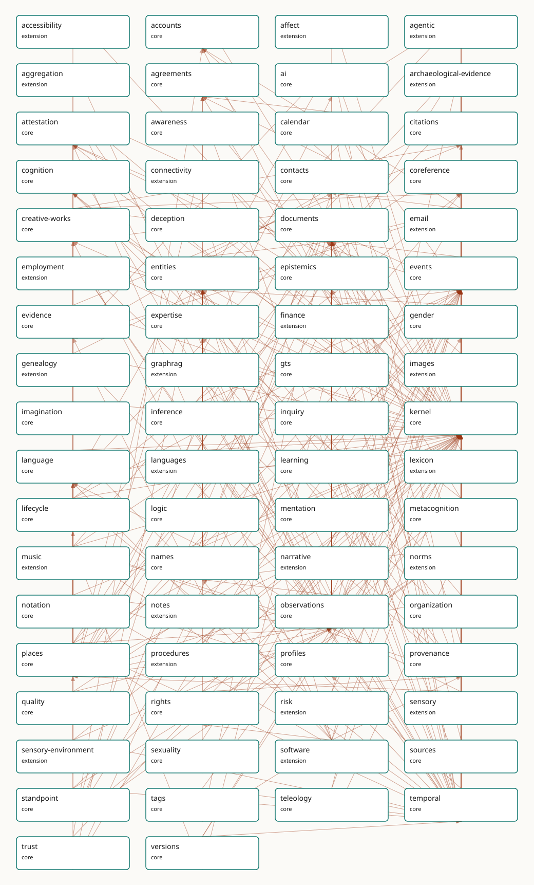

<!-- GENERATED by gmeow ontology-docs. DO NOT EDIT. -->

# Slices

Each slice is a self-contained ontology unit. The manifest is the sole source of identity, tier, dependencies, profiles, and consumers.

| Slice | Tier | Profiles | Dependencies | Consumers |
|---|---|---|---|---|
| [accessibility](accessibility.md) | extension | - | kernel, places | Accessibility facets over places and routes; the schema.org accessibility projection. |
| [accounts](accounts.md) | core | - | kernel | Online accounts for the mail corpus, email delivery, and finance. |
| [affect](affect.md) | extension | narrative | kernel, observations | The lbox principia importer (EPIC: affect/aesthetic annotations) and the narrative arc samples (: sampleState draws on EmotionType by soft reference, never dependency). DELIBERATELY THIN (P15): growth requires a new consumer; the size budget and expansion bar are recorded in docs.md. |
| [agentic](agentic.md) | extension | - | ai, entities, kernel, provenance, sources, temporal | Project Lillith's agentic mode (P15): tool-call trajectories audited in the same provenance graph as the agent's claims. First live producer: the gmeow memory MCP triad records its own store/revise calls as ToolCall provenance. DELIBERATELY THIN: growth requires a new consumer; the size budget is recorded in docs.md. |
| [aggregation](aggregation.md) | extension | - | observations, places | Spatial aggregation (count, density, k-anonymity) in the solver layer over places. |
| [agreements](agreements.md) | core | - | kernel, names | Licences-as-agreements (rights), employment terms, and calendar RSVPs. |
| [ai](ai.md) | core | - | entities, evidence, kernel, observations, provenance | The flagship (P14): the gmeow PyPI client's Memory store, the MCP store/recall/revise triad, the hallucination-resistant KG pattern + gmeow audit, the claim-extraction eval suite, and Project Lillith via extensions/graphrag. |
| [archaeological-evidence](archaeological-evidence.md) | extension | - | events, kernel, language, observations, places, temporal | Inscription readings and find contexts; the languages stress corpus. |
| [attestation](attestation.md) | core | - | events, kernel, observations, provenance, trust | Signed-claim envelopes for trust, software releases (SLSA/Sigstore), and GTS COSE signing. |
| [calendar](calendar.md) | core | - | agreements, events, kernel, temporal | Scheduling atop events: the mail corpus's invitations, the >25%-usage floor (named in). |
| [citations](citations.md) | core | claims, memory | documents, evidence, kernel | The citation/credit dogfood: CITATION.cff projection, slice manifests, scholarly credit. |
| [connectivity](connectivity.md) | extension | - | kernel, places | Network/route topology for places and the virtual-location realm. |
| [contacts](contacts.md) | core | - | accounts, agreements, kernel, observations, places, temporal | The mail corpus's address book; email-address structure (core half of the email split). |
| [coreference](coreference.md) | core | memory | documents, kernel | Authority links from every slice to Wikidata and registries (P5, never [owl:sameAs](http://www.w3.org/2002/07/owl#sameAs)). |
| [creative-works](creative-works.md) | core | - | citations, coreference, documents, kernel | The WEMI spine under documents, software products, citations, and the music slice. |
| [deception](deception.md) | core | - | attestation, events, kernel, observations | Graph-native epistemics of the lie (P16: core by commitment); the claim layer's refutations. |
| [documents](documents.md) | core | - | creative-works, kernel, names, observations, places, standpoint, tags | Creative-works manifestations, the mail corpus attachments, depictions of any entity. |
| [email](email.md) | extension | - | accounts, contacts, documents, entities, events, kernel, temporal, trust | The mail corpus: the dogfooded message model over core contacts/accounts. |
| [employment](employment.md) | extension | - | entities, kernel, observations, organization, temporal | CV/employment claims over organization and agreements; the mail corpus's signatures. |
| [entities](entities.md) | core | - | contacts, documents, kernel, language, names, places, trust | Every slice describing people, organizations, or things; the mail corpus; the identity facets. |
| [events](events.md) | core | memory | documents, kernel, observations, places, provenance, temporal | Participation and life events across slices; the calendar slice; provenance activities. |
| [evidence](evidence.md) | core | claims, memory | citations, kernel | The claim spine's EvidenceSpan; evidential warrant for citations and deception analyses. |
| [expertise](expertise.md) | core | - | entities, kernel, organization, temporal | Cross-cutting proficiency claims (promoted core): skills, credentials, language proficiency. |
| [finance](finance.md) | extension | - | accounts, agreements, documents, events, kernel, observations, places, temporal, trust | Accounts, transactions, REA double-entry over core MonetaryAmount; [FIBO](../external/ontologies.md#target-fibo-fnd-pas-ps) alignment. |
| [gender](gender.md) | core | - | entities, kernel, names, observations, sexuality | Identity facets on persons (P16: core by commitment); the 7-axis orthogonality matrix. |
| [genealogy](genealogy.md) | extension | - | entities, kernel, observations | Kin relationships for the family-history use of the mail corpus; GEDCOM alignment. |
| [graphrag](graphrag.md) | extension | - | ai, entities, kernel, observations, provenance | Project Lillith — a GraphRAG deployment whose corpus, embeddings, indexes, retrievals, and derived entity graph must be auditable provenance, not pipeline internals (P15). |
| [gts](gts.md) | core | - | attestation, creative-works, kernel, provenance, versions | Describing and dogfooding GTS transport artifacts: packages, segments, profiles, chain heads, opaque frames, codecs, and compaction lineage ([`docs/GTS-SPEC.md`](https://github.com/Blackcat-Informatics/gmeow-ontology/blob/main/docs/GTS-SPEC.md)). |
| [images](images.md) | extension | - | documents, kernel, observations, temporal | High-fidelity depiction (regions, scene graphs) atop core MediaObject; the gmeow-image CLI. |
| [kernel](kernel.md) | core | - | - | Every slice: the gUFO-grounded kernel (Entity, Agent, InformationObject, base relations). |
| [language](language.md) | core | - | kernel, names | Every language-tagged literal (private-use-language-tag); names' romanizations; software's languages (P16 slim core). |
| [languages](languages.md) | extension | - | expertise, kernel, language, observations, provenance, temporal | Rich sociolinguistics (proficiency, scripts, varieties, diachrony) extending the core language slim slice. |
| [lexicon](lexicon.md) | extension | - | documents, kernel, language, observations, temporal | Lexical items and attestations for the language family; archaeological readings. |
| [lifecycle](lifecycle.md) | core | - | coreference, events, kernel, temporal | Birth/death and existence events for persons and places across the corpus. |
| [logic](logic.md) | core | - | - | The reasoning layer and every projection consumer: the native `logic:` solver is the reasoning authority, and OWL/Datalog/SHACL/Prolog/N3 reasoners consume generated views of it ([Principle 17](https://github.com/Blackcat-Informatics/gmeow-ontology/blob/main/CONSTITUTION.md#principle-17)). Foundational by [Principle 15](https://github.com/Blackcat-Informatics/gmeow-ontology/blob/main/CONSTITUTION.md#principle-15): it serves every consumer by construction. Pre-implementation, its consumer is the design set in `design/`. |
| [music](music.md) | extension | music | creative-works, documents, events, kernel, language, observations, places, provenance, standpoint, temporal, versions | The GTS music-package single-file format, the MCP analysis-claims surface, and the 19-case stress corpus that closes the Music EPIC. |
| [names](names.md) | core | memory | agreements, contacts, entities, events, kernel, language, observations, places, temporal | Every named entity (P9 anti-colonial naming); the mail corpus; display-safety projections. |
| [narrative](narrative.md) | extension | narrative | documents, events, kernel, observations, places, provenance | Narrative frames and myth tellings for the deception slice's worked examples and creative works. The narrative interior (arc samples ⊑ Observation over positions, scoped roles, motifs riding the seam) serves the lbox foundation-docs importer (EPIC: 16,445 arc samples, 779 role links, 16,002 tags / 669 concepts) ahead of the consumer child. |
| [norms](norms.md) | extension | narrative | citations, documents, events, kernel, names, observations, rights, standpoint, teleology, temporal | The lbox principia importer (EPIC: 4-tier authority hierarchy, special-directive triggers, paradigm precedence) and policy import/export (ODRL round-trip; OPA/Rego, Cedar, XACML down-projection — deferred to the compiler-arc window with the alignment set). The rubrics facility lives in this slice (Rubric ⊑ Norm; the P16 DAG rule bars extension→extension dependencies): consumers are the lm-eval-harness task projection, the principia RLAIF axes/score-anchor import, and LLM-judge score ingestion as vantage-indexed Assessments. The registers & personas facility also lives here (expressesNorm → Norm, activatedIn → Condition; same P16 DAG rationale): consumers are system-prompt assembly (Persona × Norms × StyleGuide — the projection that replaces principia.yaml's Jinja2 role, deferred to the compiler-arc window with the alignment set) and the principia persona_modes/paradigm-activation import. |
| [notation](notation.md) | extension | - | kernel, language, observations, temporal | Symbolic/notation systems for the language family and the music slice's projections. |
| [notes](notes.md) | extension | - | evidence, kernel | PKM annotations over core evidence spans; Web Annotation projection. |
| [observations](observations.md) | core | claims, memory | entities, events, kernel, names, places, temporal | The unified observation stance: every measured, claimed, or sensed value in any slice; the claim layer. |
| [organization](organization.md) | core | - | entities, events, kernel, places | Employers, publishers, registrars across slices; posts and roles; the W3C-ORG projection. |
| [places](places.md) | core | memory | coreference, documents, kernel, lifecycle, observations, rights, temporal | Every located fact: contacts, events, the mail corpus, jurisdiction tenures; the GeoSPARQL projection. |
| [procedures](procedures.md) | extension | - | events, kernel | The universal process/procedure/plan generalization for workflows and recipes. |
| [profiles](profiles.md) | core | - | kernel, places, temporal | The Profile pattern under every reference frame: temporal, spatial, currency, and tuning frames. |
| [provenance](provenance.md) | core | claims, memory | documents, events, kernel | Every attributed fact (P9): statement-layer attribution, import activities, GTS chain-of-custody. |
| [quality](quality.md) | core | - | kernel, observations | Data-quality claims (DQV/ISO 19157) over any slice's instance data; the coverage gates. |
| [rights](rights.md) | core | - | agreements, kernel, observations, provenance | Licensing of every artifact: the ontology's own dual licence, images, software, the mail corpus. |
| [risk](risk.md) | extension | narrative | events, kernel | The lbox principia importer (EPIC: failure_cascades — Trust Collapse and five siblings as named, graded, type-level chains) and threat-model worked examples (D3FEND countermeasures ↔ Mitigation; bowtie barriers ↔ mitigationCounters on CausalLinks). The norms and procedures extensions plug in through Mitigation's deliberately open measure range — no extension→extension dependency exists or may exist (P16 DAG rule). |
| [sensory](sensory.md) | extension | - | kernel, observations, places | Sensory perception observations (the unified stance applied to senses). |
| [sensory-environment](sensory-environment.md) | extension | - | kernel, observations, places, temporal | Environmental sensing context for sensory observations. |
| [sexuality](sexuality.md) | core | - | entities, gender | Identity facets on persons (P16: core by commitment); the 7-axis orthogonality matrix. |
| [software](software.md) | extension | - | attestation, creative-works, entities, events, kernel, language, names, provenance, rights, tags | The five-facet software model: git-as-provenance, verifiable releases, this repo itself. |
| [sources](sources.md) | core | claims, memory | documents | Content-addressed sources under the claim spine and the GTS packages (blake3 digests). |
| [standpoint](standpoint.md) | core | claims, memory | kernel, observations, temporal | Every contested fact and every model disagreement (P9); the statement layer; the deception slice. |
| [tags](tags.md) | core | memory | kernel, temporal | Folksonomy tagging reused by images and software (forced core by dual extension use). |
| [teleology](teleology.md) | core | - | events, kernel, temporal | The agent-memory flagship (an agent recording its own goals across sessions — [Principle 14](https://github.com/Blackcat-Informatics/gmeow-ontology/blob/main/CONSTITUTION.md#principle-14)) and the lbox principia importer (EPIC: 21-goal hierarchy with counter-goals and tier tenure). The norms extension ranges prescribedConduct over Goal. |
| [temporal](temporal.md) | core | memory | kernel, profiles | Every slice carrying time-scoped facts (tenures, residences, validity); the statement layer's validFrom/validUntil; the calendar slice; the mail corpus. |
| [trust](trust.md) | core | - | accounts, kernel | Keys, certifications, and cryptographic signatures used by email wire-auth and attestation. |
| [versions](versions.md) | core | - | kernel, observations, temporal | Version lineage for software, languages, creative works, and the ontology's own releases. |
