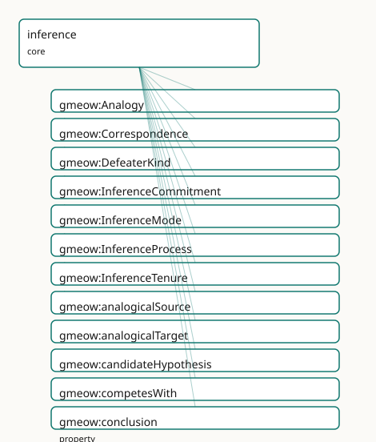

<!-- GENERATED by gmeow ontology-docs. DO NOT EDIT. -->

# GMEOW Inference Module

- **IRI:** <https://blackcatinformatics.ca/gmeow/slices/inference>
- **Tier:** core
- **[`Group`](../reference/classes/gmeow-Group.md):** core

## What This Slice Covers

This slice owns 34 terms and contributes 10 mapping or projection rows. Use it when its terms match the native fact you want to preserve; use the linkage tables to see how those facts leave GMEOW for consumer vocabularies.

## Dependencies

- [`gmeow:slices/events`](events.md)
- [`gmeow:slices/kernel`](kernel.md)
- [`gmeow:slices/mentation`](mentation.md)
- [`gmeow:slices/observations`](observations.md)
- [`gmeow:slices/standpoint`](standpoint.md)
- [`gmeow:slices/temporal`](temporal.md)

## Consumers

- The agent-memory flagship — an LLM stating HOW it reached a claim (deduced / generalized / best-explanation / by-analogy) with its premises, warrant, and defeasibility, then revising belief by suppression rather than deletion. store_claim records [`gmeow:inferredFrom`](../reference/properties/gmeow-inferredFrom.md) + [`gmeow:inferenceMode`](../reference/properties/gmeow-inferenceMode.md) on the claim; recall returns the premises and warrant; the belief-revision audit (a fired defeater closes a [`gmeow:InferenceTenure`](../reference/classes/gmeow-InferenceTenure.md) and sets the conclusion-claim [`gmeow:displayable`](../reference/properties/gmeow-displayable.md) false while retaining the [`gmeow:InferenceCommitment`](../reference/classes/gmeow-InferenceCommitment.md)) is the headline demonstration.

## Local Map



## Examples

### Abduction

- **Source:** [`slices/core/inference/examples/abduction.ttl`](https://github.com/Blackcat-Informatics/gmeow-ontology/blob/main/slices/core/inference/examples/abduction.ttl)
- **GMEOW terms:** [`gmeow:Agent`](../reference/classes/gmeow-Agent.md), [`gmeow:InferenceCommitment`](../reference/classes/gmeow-InferenceCommitment.md), [`gmeow:InferenceProcess`](../reference/classes/gmeow-InferenceProcess.md), [`gmeow:MentalMoment`](../reference/classes/gmeow-MentalMoment.md), [`gmeow:StandpointClaim`](../reference/classes/gmeow-StandpointClaim.md), [`gmeow:candidateHypothesis`](../reference/properties/gmeow-candidateHypothesis.md), [`gmeow:claimModality`](../reference/properties/gmeow-claimModality.md), [`gmeow:competesWith`](../reference/properties/gmeow-competesWith.md), [`gmeow:conceivable`](../reference/individuals/gmeow-conceivable.md), [`gmeow:conclusion`](../reference/properties/gmeow-conclusion.md)
- **External prefixes:** `gufo`, `xsd`

```turtle
# SPDX-FileCopyrightText: 2026 Blackcat Informatics® Inc. <paudley@blackcatinformatics.ca>
# SPDX-License-Identifier: CC-BY-4.0
#
# Worked example — ABDUCTION (inference to the best explanation), the FULL CHAIN.
#
# This example exercises all three fidelity tiers and the endurant/occurrent
# split end to end:
#
#   gmeow:InferenceProcess  --hasInferenceCommitment-->  gmeow:InferenceCommitment
#       (the occurrent reasoning episode)                  (the endurant argument)
#            |                                                   |
#       producesMentalMoment                               conclusion
#            v                                                   v
#       the accepted belief        is the agent's attitude    gmeow:StandpointClaim
#       (gmeow:MentalMoment)        toward the winning ------> (the conclusion content)
#                                   hypothesis
#
# A clinician observes a fever and reasons to its best explanation. Two
# candidate hypotheses compete (gmeow:competesWith); each is scored by a
# solver-layer gmeow:explanatoryScore (Principle 12 — there is no isBest bit).
# The winner's modality is promoted gmeow:conceivable -> gmeow:probable; the
# loser is SUPPRESSED (gmeow:displayable false), never deleted (Principle 10).

@prefix gmeow: <https://blackcatinformatics.ca/gmeow/> .
@prefix ex:    <https://blackcatinformatics.ca/gmeow/examples/inference/> .
@prefix rdfs:  <http://www.w3.org/2000/01/rdf-schema#> .
@prefix xsd:   <http://www.w3.org/2001/XMLSchema#> .

ex:clinician a gmeow:Agent ;
    gmeow:name "Diagnosing clinician"@en .

# --- The explanandum and the observed symptom ------------------------------- #
ex:fever rdfs:label "the patient's fever (38.9 °C)"@en .

ex:symptomObservation a gmeow:StandpointClaim ;
    rdfs:label "Observed: the patient has a fever"@en ;
    gmeow:vantage ex:clinician ;
    gmeow:observedFeature ex:fever ;
    gmeow:observationMethod gmeow:methodInstrumentalReading ;
    gmeow:claimModality gmeow:unequivocal .

# --- Two competing hypotheses (candidate explanations) ---------------------- #
ex:propFlu  rdfs:label "the patient has influenza"@en .
ex:propCold rdfs:label "the patient has a common cold"@en .

# Winner: influenza — best explains the high fever; promoted to probable.
ex:hypInfluenza a gmeow:StandpointClaim ;
    rdfs:label "Hypothesis: influenza"@en ;
    gmeow:vantage ex:clinician ;
    gmeow:observedFeature ex:propFlu ;
    gmeow:observationMethod gmeow:methodExpertJudgement ;
    gmeow:claimModality gmeow:probable ;        # promoted conceivable -> probable (the winner)
    gmeow:explains ex:fever ;                    # solver back-check: would account for the fever
    gmeow:explanatoryScore "0.86"^^xsd:decimal ; # solver-layer (Principle 12)
    gmeow:competesWith ex:hypCold .              # symmetric; irreflexive by SHACL

# Loser: common cold — a weaker explanation of a high fever; SUPPRESSED.
ex:hypCold a gmeow:StandpointClaim ;
    rdfs:label "Hypothesis: common cold (rejected, retained as audit)"@en ;
    gmeow:vantage ex:clinician ;
    gmeow:observedFeature ex:propCold ;
    gmeow:observationMethod gmeow:methodExpertJudgement ;
    gmeow:claimModality gmeow:conceivable ;      # never promoted
    gmeow:explains ex:fever ;
    gmeow:explanatoryScore "0.41"^^xsd:decimal ;
    gmeow:displayable false .                    # Principle 10: suppressed, not erased

# --- The reified argument (endurant relator) -------------------------------- #
ex:abductiveCommitment a gmeow:InferenceCommitment ;
    rdfs:label "Abductive argument: best explanation of the fever"@en ;
    gmeow:inferenceModeOf gmeow:modeAbduction ;
    gmeow:premise ex:symptomObservation ;        # >= 1 premise, != conclusion (SHACL)
    gmeow:explanandum ex:fever ;
    gmeow:candidateHypothesis ex:hypInfluenza , ex:hypCold ;
    gmeow:conclusion ex:hypInfluenza ;           # exactly one conclusion = the winner
    gmeow:warrant "inference to the best explanation: influenza maximises explanatory score"@en .

# --- The occurrent reasoning episode (perdurant) ---------------------------- #
ex:diagnosticReasoning a gmeow:InferenceProcess ;
    rdfs:label "The clinician's diagnostic reasoning episode"@en ;
    gmeow:experiencer ex:clinician ;                          # functional: one episode, one reasoner
    gmeow:mentalProcessType gmeow:processReasoning ;          # the canonical occurrent marker (no eventTypeInference)
    gmeow:eventTime "2026-06-15T10:05:00Z"^^xsd:dateTime ;
    gmeow:eventTemporalFrame gmeow:temporalFrameUTCGregorian ;
    gmeow:hasInferenceCommitment ex:abductiveCommitment ;     # occurrent -> endurant bridge
    gmeow:producesMentalMoment ex:beliefInfluenza .           # production: reasoning creates this new belief (a MentalMoment)

# --- The mental moment the reasoning produces (endurant doxastic mode) ------- #
# Distinct from the StandpointClaim conclusion (ex:hypInfluenza, the content the
# commitment concludes): this is the clinician's NEW belief — a gmeow:MentalMoment,
# the moment the reasoning episode brings into being. Its bearer is the process's
# gmeow:experiencer (ex:clinician); typed without asserting inherence (gufo:inheresIn
# is the alignment target, not an asserted axiom — Principle 5).
ex:beliefInfluenza a gmeow:MentalMoment ;
    rdfs:label "The clinician's belief that the patient has influenza"@en .
```

### Analogy

- **Source:** [`slices/core/inference/examples/analogy.ttl`](https://github.com/Blackcat-Informatics/gmeow-ontology/blob/main/slices/core/inference/examples/analogy.ttl)
- **GMEOW terms:** [`gmeow:Agent`](../reference/classes/gmeow-Agent.md), [`gmeow:Analogy`](../reference/classes/gmeow-Analogy.md), [`gmeow:Correspondence`](../reference/classes/gmeow-Correspondence.md), [`gmeow:InferenceCommitment`](../reference/classes/gmeow-InferenceCommitment.md), [`gmeow:StandpointClaim`](../reference/classes/gmeow-StandpointClaim.md), [`gmeow:analogicalSource`](../reference/properties/gmeow-analogicalSource.md), [`gmeow:analogicalTarget`](../reference/properties/gmeow-analogicalTarget.md), [`gmeow:claimModality`](../reference/properties/gmeow-claimModality.md), [`gmeow:conclusion`](../reference/properties/gmeow-conclusion.md), [`gmeow:correspondingSource`](../reference/properties/gmeow-correspondingSource.md)
- **External prefixes:** `xsd`

```turtle
# SPDX-FileCopyrightText: 2026 Blackcat Informatics® Inc. <paudley@blackcatinformatics.ca>
# SPDX-License-Identifier: CC-BY-4.0
#
# Worked example — ANALOGY (structure-mapping, Gentner).
#
# The Rutherford analogy: the atom is like the solar system. Analogical
# inference transfers relational structure from a familiar SOURCE (the solar
# system) to a TARGET (the atom) via a gmeow:Analogy whose element-pair
# gmeow:Correspondence relations carry the mapping. The mapping is scored by a
# solver-layer gmeow:systematicity (Gentner: deep relational structure beats
# shallow attribute matches). The warrant of the analogical
# gmeow:InferenceCommitment points at the gmeow:Analogy. Not truth-preserving,
# so the conclusion is gmeow:probable.

@prefix gmeow: <https://blackcatinformatics.ca/gmeow/> .
@prefix ex:    <https://blackcatinformatics.ca/gmeow/examples/inference/> .
@prefix rdfs:  <http://www.w3.org/2000/01/rdf-schema#> .
@prefix xsd:   <http://www.w3.org/2001/XMLSchema#> .

ex:physicist a gmeow:Agent ;
    gmeow:name "Rutherford"@en .

# --- The source and target domains ------------------------------------------ #
ex:solarSystem rdfs:label "the solar system (source domain)"@en .
ex:atom        rdfs:label "the atom (target domain)"@en .

ex:sun       rdfs:label "the Sun"@en .
ex:planets   rdfs:label "the planets"@en .
ex:nucleus   rdfs:label "the nucleus"@en .
ex:electrons rdfs:label "the electrons"@en .

# --- The element-pair correspondences --------------------------------------- #
ex:corrCentral a gmeow:Correspondence ;
    rdfs:label "Sun <-> nucleus (central massive body)"@en ;
    gmeow:correspondingSource ex:sun ;            # functional: one source element
    gmeow:correspondingTarget ex:nucleus .        # functional: one target element

ex:corrOrbiting a gmeow:Correspondence ;
    rdfs:label "planets <-> electrons (orbiting lighter bodies)"@en ;
    gmeow:correspondingSource ex:planets ;
    gmeow:correspondingTarget ex:electrons .

# --- The reified analogy (a relator) ---------------------------------------- #
ex:rutherfordAnalogy a gmeow:Analogy ;
    rdfs:label "The atom is like the solar system"@en ;
    gmeow:analogicalSource ex:solarSystem ;
    gmeow:analogicalTarget ex:atom ;
    gmeow:hasCorrespondence ex:corrCentral , ex:corrOrbiting ;
    gmeow:systematicity "0.80"^^xsd:decimal .     # solver-layer (Gentner structural consistency)

# --- The propositions and the analogical inference -------------------------- #
ex:propLighterOrbitsHeavier
    rdfs:label "lighter bodies orbit a central heavier body"@en .
ex:propElectronsOrbitNucleus
    rdfs:label "electrons orbit the nucleus"@en .

ex:premOrbits a gmeow:StandpointClaim ;
    gmeow:vantage ex:physicist ;
    gmeow:observedFeature ex:propLighterOrbitsHeavier ;
    gmeow:observationMethod gmeow:methodDirectObservation ;
    gmeow:claimModality gmeow:unequivocal .

ex:conclElectronsOrbit a gmeow:StandpointClaim ;
    rdfs:label "By analogy: electrons orbit the nucleus"@en ;
    gmeow:vantage ex:physicist ;
    gmeow:observedFeature ex:propElectronsOrbitNucleus ;
    gmeow:observationMethod gmeow:methodExpertJudgement ;
    gmeow:claimModality gmeow:probable ;          # not truth-preserving → probable
    gmeow:inferenceMode gmeow:modeAnalogical ;
    gmeow:inferredFrom ex:premOrbits .

ex:analogicalCommitment a gmeow:InferenceCommitment ;
    rdfs:label "Analogical argument: solar-system structure transferred to the atom"@en ;
    gmeow:inferenceModeOf gmeow:modeAnalogical ;
    gmeow:premise ex:premOrbits ;
    gmeow:conclusion ex:conclElectronsOrbit ;
    gmeow:warrant ex:rutherfordAnalogy .          # the warrant IS the structure-mapping
```

### Belief Revision

- **Source:** [`slices/core/inference/examples/belief-revision.ttl`](https://github.com/Blackcat-Informatics/gmeow-ontology/blob/main/slices/core/inference/examples/belief-revision.ttl)
- **GMEOW terms:** [`gmeow:Agent`](../reference/classes/gmeow-Agent.md), [`gmeow:InferenceCommitment`](../reference/classes/gmeow-InferenceCommitment.md), [`gmeow:InferenceTenure`](../reference/classes/gmeow-InferenceTenure.md), [`gmeow:StandpointClaim`](../reference/classes/gmeow-StandpointClaim.md), [`gmeow:TimeInterval`](../reference/classes/gmeow-TimeInterval.md), [`gmeow:claimModality`](../reference/properties/gmeow-claimModality.md), [`gmeow:conclusion`](../reference/properties/gmeow-conclusion.md), [`gmeow:defeaterKind`](../reference/properties/gmeow-defeaterKind.md), [`gmeow:defeaterUndercutting`](../reference/individuals/gmeow-defeaterUndercutting.md), [`gmeow:displayable`](../reference/properties/gmeow-displayable.md)
- **External prefixes:** `xsd`

```turtle
# SPDX-FileCopyrightText: 2026 Blackcat Informatics® Inc. <paudley@blackcatinformatics.ca>
# SPDX-License-Identifier: CC-BY-4.0
#
# Worked example — BELIEF REVISION as SUPPRESSION (Principle 10), the headline.
#
# An agent inductively concluded "the printer is broken" from "it did not print".
# Later a defeater arrives — "the document was never sent to the queue" — an
# UNDERCUTTING defeater (Pollock): it does not assert the negation, it removes
# the warrant (the failure no longer licenses 'broken'). Revision does NOT delete
# anything:
#   * the conclusion-claim is set gmeow:displayable false (suppressed from view);
#   * the gmeow:InferenceTenure is CLOSED (an gmeow:endedAtTime on its interval);
#   * the gmeow:InferenceCommitment is RETAINED as audit.
# The whole episode remains queryable — how the agent believed, and why it stopped.

@prefix gmeow: <https://blackcatinformatics.ca/gmeow/> .
@prefix ex:    <https://blackcatinformatics.ca/gmeow/examples/inference/> .
@prefix rdfs:  <http://www.w3.org/2000/01/rdf-schema#> .
@prefix xsd:   <http://www.w3.org/2001/XMLSchema#> .

ex:operator a gmeow:Agent ;
    gmeow:name "Office operator"@en .

ex:propDidNotPrint  rdfs:label "the document did not print"@en .
ex:propPrinterBroken rdfs:label "the printer is broken"@en .
ex:propNeverQueued  rdfs:label "the document was never sent to the print queue"@en .

# --- The original premise and conclusion ------------------------------------ #
ex:premDidNotPrint a gmeow:StandpointClaim ;
    gmeow:vantage ex:operator ;
    gmeow:observedFeature ex:propDidNotPrint ;
    gmeow:observationMethod gmeow:methodDirectObservation ;
    gmeow:claimModality gmeow:unequivocal .

# The conclusion — now SUPPRESSED, but retained.
ex:conclPrinterBroken a gmeow:StandpointClaim ;
    rdfs:label "Concluded (then retracted): the printer is broken"@en ;
    gmeow:vantage ex:operator ;
    gmeow:observedFeature ex:propPrinterBroken ;
    gmeow:observationMethod gmeow:methodExpertJudgement ;
    gmeow:claimModality gmeow:probable ;
    gmeow:inferenceMode gmeow:modeInduction ;
    gmeow:inferredFrom ex:premDidNotPrint ;
    gmeow:displayable false .                     # Principle 10: suppressed by the fired defeater

# --- The defeater (an undercutting one) ------------------------------------- #
ex:defeaterNeverQueued a gmeow:StandpointClaim ;
    rdfs:label "Defeater: the document was never queued"@en ;
    gmeow:vantage ex:operator ;
    gmeow:observedFeature ex:propNeverQueued ;
    gmeow:observationMethod gmeow:methodDirectObservation ;
    gmeow:claimModality gmeow:unequivocal ;
    gmeow:defeaterKind gmeow:defeaterUndercutting .  # removes the warrant, not asserts the negation

# --- The reified argument, retained as audit -------------------------------- #
ex:revisedCommitment a gmeow:InferenceCommitment ;
    rdfs:label "Inductive argument: did-not-print therefore broken (defeated)"@en ;
    gmeow:inferenceModeOf gmeow:modeInduction ;
    gmeow:premise ex:premDidNotPrint ;
    gmeow:conclusion ex:conclPrinterBroken ;
    gmeow:hasDefeater ex:defeaterNeverQueued .

# --- The tenure — opened then closed (never deleted) ------------------------ #
ex:brokenBeliefTenure a gmeow:InferenceTenure ;
    rdfs:label "The held interval of the 'printer is broken' conclusion"@en ;
    gmeow:tenureOf ex:revisedCommitment ;
    gmeow:duringInterval ex:tenureInterval .

ex:tenureInterval a gmeow:TimeInterval ;
    gmeow:startedAtTime "2026-06-15T11:00:00Z"^^xsd:dateTime ;
    gmeow:endedAtTime   "2026-06-15T11:18:00Z"^^xsd:dateTime .  # closed when the defeater fired
```

### Deduction

- **Source:** [`slices/core/inference/examples/deduction.ttl`](https://github.com/Blackcat-Informatics/gmeow-ontology/blob/main/slices/core/inference/examples/deduction.ttl)
- **GMEOW terms:** [`gmeow:Agent`](../reference/classes/gmeow-Agent.md), [`gmeow:StandpointClaim`](../reference/classes/gmeow-StandpointClaim.md), [`gmeow:claimModality`](../reference/properties/gmeow-claimModality.md), [`gmeow:inferenceMode`](../reference/properties/gmeow-inferenceMode.md), [`gmeow:inferredFrom`](../reference/properties/gmeow-inferredFrom.md), [`gmeow:methodComputationalModel`](../reference/individuals/gmeow-methodComputationalModel.md), [`gmeow:methodExpertJudgement`](../reference/individuals/gmeow-methodExpertJudgement.md), [`gmeow:modeDeduction`](../reference/individuals/gmeow-modeDeduction.md), [`gmeow:name`](../reference/properties/gmeow-name.md), [`gmeow:observationMethod`](../reference/properties/gmeow-observationMethod.md)

```turtle
# SPDX-FileCopyrightText: 2026 Blackcat Informatics® Inc. <paudley@blackcatinformatics.ca>
# SPDX-License-Identifier: CC-BY-4.0
#
# Worked example — DEDUCTION, the flat spine (the 80% case).
#
# The classic syllogism: All men are mortal; Socrates is a man; therefore
# Socrates is mortal. No reification is needed — the conclusion is an ordinary
# gmeow:StandpointClaim that hangs gmeow:inferenceMode (gmeow:modeDeduction) and
# gmeow:inferredFrom directly on itself. Deduction is truth-preserving under a
# monotonic profile, so the conclusion's modality is gmeow:unequivocal.

@prefix gmeow: <https://blackcatinformatics.ca/gmeow/> .
@prefix ex:    <https://blackcatinformatics.ca/gmeow/examples/inference/> .
@prefix rdfs:  <http://www.w3.org/2000/01/rdf-schema#> .

ex:reasoner a gmeow:Agent ;
    gmeow:name "Aristotle"@en .

# --- The propositions (the observed features of the claims) ----------------- #
ex:propAllMenMortal  rdfs:label "All men are mortal"@en .
ex:propSocratesIsMan rdfs:label "Socrates is a man"@en .
ex:propSocratesMortal rdfs:label "Socrates is mortal"@en .

# --- The premises, asserted as settled claims ------------------------------- #
ex:premMajor a gmeow:StandpointClaim ;
    gmeow:vantage ex:reasoner ;
    gmeow:observedFeature ex:propAllMenMortal ;
    gmeow:observationMethod gmeow:methodExpertJudgement ;
    gmeow:claimModality gmeow:unequivocal .

ex:premMinor a gmeow:StandpointClaim ;
    gmeow:vantage ex:reasoner ;
    gmeow:observedFeature ex:propSocratesIsMan ;
    gmeow:observationMethod gmeow:methodExpertJudgement ;
    gmeow:claimModality gmeow:unequivocal .

# --- The conclusion — flat spine: mode + inferredFrom on the claim itself ---- #
ex:conclSocratesMortal a gmeow:StandpointClaim ;
    rdfs:label "Therefore, Socrates is mortal"@en ;
    gmeow:vantage ex:reasoner ;
    gmeow:observedFeature ex:propSocratesMortal ;
    gmeow:observationMethod gmeow:methodComputationalModel ;  # a logic: proof-trace
    gmeow:claimModality gmeow:unequivocal ;                   # truth-preserving → unequivocal
    gmeow:inferenceMode gmeow:modeDeduction ;
    gmeow:inferredFrom ex:premMajor , ex:premMinor .         # non-functional: two premises
```

### Induction

- **Source:** [`slices/core/inference/examples/induction.ttl`](https://github.com/Blackcat-Informatics/gmeow-ontology/blob/main/slices/core/inference/examples/induction.ttl)
- **GMEOW terms:** [`gmeow:Agent`](../reference/classes/gmeow-Agent.md), [`gmeow:StandpointClaim`](../reference/classes/gmeow-StandpointClaim.md), [`gmeow:claimModality`](../reference/properties/gmeow-claimModality.md), [`gmeow:inferenceMode`](../reference/properties/gmeow-inferenceMode.md), [`gmeow:inferredFrom`](../reference/properties/gmeow-inferredFrom.md), [`gmeow:methodDirectObservation`](../reference/individuals/gmeow-methodDirectObservation.md), [`gmeow:methodExpertJudgement`](../reference/individuals/gmeow-methodExpertJudgement.md), [`gmeow:modeInduction`](../reference/individuals/gmeow-modeInduction.md), [`gmeow:name`](../reference/properties/gmeow-name.md), [`gmeow:observationMethod`](../reference/properties/gmeow-observationMethod.md)
- **External prefixes:** `logic`, `xsd`

```turtle
# SPDX-FileCopyrightText: 2026 Blackcat Informatics® Inc. <paudley@blackcatinformatics.ca>
# SPDX-License-Identifier: CC-BY-4.0
#
# Worked example — INDUCTION, generalisation over a sample.
#
# From many observed white swans, generalise that swans are white. Inductive
# inference is NOT truth-preserving (the black swan refutes it), so the
# conclusion's modality is gmeow:probable, and its strength rides the EXISTING
# logic: axis logic:evidenceStrength (BY REFERENCE — Principle 5, no asserted
# triples into logic:). The flat spine again: gmeow:inferenceMode +
# gmeow:inferredFrom on the conclusion-claim.

@prefix gmeow: <https://blackcatinformatics.ca/gmeow/> .
@prefix logic: <https://blackcatinformatics.ca/logic/> .
@prefix ex:    <https://blackcatinformatics.ca/gmeow/examples/inference/> .
@prefix rdfs:  <http://www.w3.org/2000/01/rdf-schema#> .
@prefix xsd:   <http://www.w3.org/2001/XMLSchema#> .

ex:naturalist a gmeow:Agent ;
    gmeow:name "Field naturalist"@en .

ex:propSwansWhite rdfs:label "Swans are white"@en .

# --- The sample: individual observed instances ------------------------------ #
ex:obsSwan1 a gmeow:StandpointClaim ;
    gmeow:vantage ex:naturalist ; gmeow:observedFeature ex:swanA ;
    gmeow:observationMethod gmeow:methodDirectObservation ;
    gmeow:claimModality gmeow:unequivocal .
ex:obsSwan2 a gmeow:StandpointClaim ;
    gmeow:vantage ex:naturalist ; gmeow:observedFeature ex:swanB ;
    gmeow:observationMethod gmeow:methodDirectObservation ;
    gmeow:claimModality gmeow:unequivocal .
ex:obsSwan3 a gmeow:StandpointClaim ;
    gmeow:vantage ex:naturalist ; gmeow:observedFeature ex:swanC ;
    gmeow:observationMethod gmeow:methodDirectObservation ;
    gmeow:claimModality gmeow:unequivocal .

ex:swanA rdfs:label "a white swan"@en .
ex:swanB rdfs:label "another white swan"@en .
ex:swanC rdfs:label "a third white swan"@en .

# --- The inductive generalisation — probable, defeasible -------------------- #
ex:genSwansWhite a gmeow:StandpointClaim ;
    rdfs:label "Generalisation: swans are white"@en ;
    gmeow:vantage ex:naturalist ;
    gmeow:observedFeature ex:propSwansWhite ;
    gmeow:observationMethod gmeow:methodExpertJudgement ;
    gmeow:claimModality gmeow:probable ;                     # not truth-preserving → probable
    gmeow:inferenceMode gmeow:modeInduction ;
    gmeow:inferredFrom ex:obsSwan1 , ex:obsSwan2 , ex:obsSwan3 ;
    logic:evidenceStrength "0.72"^^xsd:decimal .            # by reference: strength on the logic: axis
```

## Terms

### Classes

| Term | Label | Definition |
|---|---|---|
| [`gmeow:Analogy`](../reference/classes/gmeow-Analogy.md) | Analogy | A reified analogical mapping — the source-to-target structure-mapping (Gentner) that warrants an analogical inference: it mediates a source domain (gmeow:analo... |
| [`gmeow:Correspondence`](../reference/classes/gmeow-Correspondence.md) | Correspondence | A single mapped element-pair within an [`gmeow:Analogy`](../reference/classes/gmeow-Analogy.md) — the reified relation that one source element ([`gmeow:correspondingSource`](../reference/properties/gmeow-correspondingSource.md)) plays the same structural role... |
| [`gmeow:DefeaterKind`](../reference/classes/gmeow-DefeaterKind.md) | Defeater Kind | The Pollock kind of a defeater — a value vocabulary (individuals, never subclasses): [`gmeow:defeaterRebutting`](../reference/individuals/gmeow-defeaterRebutting.md) (attacks the conclusion directly, giving reason to... |
| [`gmeow:InferenceCommitment`](../reference/classes/gmeow-InferenceCommitment.md) | Inference Commitment | The endurant, structured argument relation an inference instantiates — the reified Toulmin/Peircean commitment mediating its premises ([`gmeow:premise`](../reference/properties/gmeow-premise.md)), its sing... |
| [`gmeow:InferenceMode`](../reference/classes/gmeow-InferenceMode.md) | Inference Mode | The Peircean mode of an inference — a closed-but-open value vocabulary (individuals, never subclasses; the [`gmeow:StandpointModality`](../reference/classes/gmeow-StandpointModality.md) idiom): [`gmeow:modeDeduction`](../reference/individuals/gmeow-modeDeduction.md)... |
| [`gmeow:InferenceProcess`](../reference/classes/gmeow-InferenceProcess.md) | Inference Process | The occurrent reasoning episode — inference as it unfolds in time, drawing a conclusion from premises. The perdurant face of inference: a [`gmeow:MentalProcess`](../reference/classes/gmeow-MentalProcess.md) b... |
| [`gmeow:InferenceTenure`](../reference/classes/gmeow-InferenceTenure.md) | Inference Tenure | The reified, time-scoped fact that an [`gmeow:InferenceCommitment`](../reference/classes/gmeow-InferenceCommitment.md)'s conclusion was held over an interval — opened when the conclusion is accepted and closed when... |

### Properties

| Term | Label | Definition |
|---|---|---|
| [`gmeow:analogicalSource`](../reference/properties/gmeow-analogicalSource.md) | analogical source | The source (base) domain of a [`gmeow:Analogy`](../reference/classes/gmeow-Analogy.md) — the familiar structure whose relations are mapped onto the target. NOT functional. |
| [`gmeow:analogicalTarget`](../reference/properties/gmeow-analogicalTarget.md) | analogical target | The target domain of a [`gmeow:Analogy`](../reference/classes/gmeow-Analogy.md) — the less-familiar structure that inherits relations from the source via the correspondences. NOT functional. |
| [`gmeow:candidateHypothesis`](../reference/properties/gmeow-candidateHypothesis.md) | candidate hypothesis | A candidate explanation considered by an abductive [`gmeow:InferenceCommitment`](../reference/classes/gmeow-InferenceCommitment.md) — one of the competing hypotheses ([`gmeow:competesWith`](../reference/properties/gmeow-competesWith.md)) among which the inference s... |
| [`gmeow:competesWith`](../reference/properties/gmeow-competesWith.md) | competes with | Relates two rival [`gmeow:StandpointClaim`](../reference/classes/gmeow-StandpointClaim.md) hypotheses that cannot both be accepted as the best explanation — the competition abductive (and analogical) selection... |
| [`gmeow:conclusion`](../reference/properties/gmeow-conclusion.md) | conclusion | The single conclusion of a reified [`gmeow:InferenceCommitment`](../reference/classes/gmeow-InferenceCommitment.md) — the [`gmeow:StandpointClaim`](../reference/classes/gmeow-StandpointClaim.md) the argument establishes (vantage = the reasoner, observedFeature = th... |
| [`gmeow:correspondingSource`](../reference/properties/gmeow-correspondingSource.md) | corresponding source | The source-domain element of a [`gmeow:Correspondence`](../reference/classes/gmeow-Correspondence.md) — one half of a mapped pair. Functional: a correspondence maps exactly one source element to one target ele... |
| [`gmeow:correspondingTarget`](../reference/properties/gmeow-correspondingTarget.md) | corresponding target | The target-domain element of a [`gmeow:Correspondence`](../reference/classes/gmeow-Correspondence.md) — the other half of a mapped pair. Functional: exactly one target element per correspondence. |
| [`gmeow:defeaterKind`](../reference/properties/gmeow-defeaterKind.md) | defeater kind | The Pollock kind of a defeating [`gmeow:StandpointClaim`](../reference/classes/gmeow-StandpointClaim.md) — [`gmeow:defeaterRebutting`](../reference/individuals/gmeow-defeaterRebutting.md) (attacks the conclusion) or [`gmeow:defeaterUndercutting`](../reference/individuals/gmeow-defeaterUndercutting.md) (attacks the inferential... |
| [`gmeow:explains`](../reference/properties/gmeow-explains.md) | explains | Relates a candidate hypothesis (a [`gmeow:StandpointClaim`](../reference/classes/gmeow-StandpointClaim.md)) to an explanandum it would account for — the explanatory link a solver back-checks (does the hypothesi... |
| [`gmeow:explanandum`](../reference/properties/gmeow-explanandum.md) | explanandum | The fact to be explained by an abductive [`gmeow:InferenceCommitment`](../reference/classes/gmeow-InferenceCommitment.md) — the surprising observation the inference seeks the best explanation of. NOT functional. |
| [`gmeow:explanatoryScore`](../reference/properties/gmeow-explanatoryScore.md) | explanatory score | A solver-computed score of how well a candidate hypothesis explains its explanandum (simplicity, scope, coherence) — the basis on which inference-to-the-best-e... |
| [`gmeow:hasCorrespondence`](../reference/properties/gmeow-hasCorrespondence.md) | has correspondence | Relates a [`gmeow:Analogy`](../reference/classes/gmeow-Analogy.md) to one of its element-pair [`gmeow:Correspondence`](../reference/classes/gmeow-Correspondence.md) relations — the reified mapped pairs whose structural consistency is the analogy's gmeo... |
| [`gmeow:hasDefeater`](../reference/properties/gmeow-hasDefeater.md) | has defeater | Relates a reified [`gmeow:InferenceCommitment`](../reference/classes/gmeow-InferenceCommitment.md) to a defeating [`gmeow:StandpointClaim`](../reference/classes/gmeow-StandpointClaim.md) — a consideration that, once accepted, withdraws support for the conclusion. N... |
| [`gmeow:hasInferenceCommitment`](../reference/properties/gmeow-hasInferenceCommitment.md) | has inference commitment | Relates an occurrent [`gmeow:InferenceProcess`](../reference/classes/gmeow-InferenceProcess.md) (the reasoning episode) to the endurant [`gmeow:InferenceCommitment`](../reference/classes/gmeow-InferenceCommitment.md) (the argument structure) it instantiates — the br... |
| [`gmeow:inferenceMode`](../reference/properties/gmeow-inferenceMode.md) | inference mode | The Peircean mode by which a [`gmeow:StandpointClaim`](../reference/classes/gmeow-StandpointClaim.md) was reached — a [`gmeow:InferenceMode`](../reference/classes/gmeow-InferenceMode.md) value ([`gmeow:modeDeduction`](../reference/individuals/gmeow-modeDeduction.md) / modeInduction / modeAbduction / modeAnalogi... |
| [`gmeow:inferenceModeOf`](../reference/properties/gmeow-inferenceModeOf.md) | inference mode of | The Peircean mode of a reified [`gmeow:InferenceCommitment`](../reference/classes/gmeow-InferenceCommitment.md) — a [`gmeow:InferenceMode`](../reference/classes/gmeow-InferenceMode.md) value. Functional: a commitment has exactly one mode (a step that is both indu... |
| [`gmeow:inferredFrom`](../reference/properties/gmeow-inferredFrom.md) | inferred from | Relates a concluded [`gmeow:StandpointClaim`](../reference/classes/gmeow-StandpointClaim.md) to a premise it was inferred from — the flat, reification-free shortcut (the 80% case). NOT functional: a conclusion... |
| [`gmeow:premise`](../reference/properties/gmeow-premise.md) | premise | A premise of a reified [`gmeow:InferenceCommitment`](../reference/classes/gmeow-InferenceCommitment.md) — an input from which its conclusion is drawn. NOT functional: an argument has one or more premises (SHACL req... |
| [`gmeow:systematicity`](../reference/properties/gmeow-systematicity.md) | systematicity | A solver-computed measure of a [`gmeow:Analogy`](../reference/classes/gmeow-Analogy.md)'s structural consistency (Gentner's systematicity principle: deep, interconnected relational mappings beat shallow... |
| [`gmeow:tenureOf`](../reference/properties/gmeow-tenureOf.md) | tenure of | Relates a [`gmeow:InferenceTenure`](../reference/classes/gmeow-InferenceTenure.md) to the [`gmeow:InferenceCommitment`](../reference/classes/gmeow-InferenceCommitment.md) whose conclusion it time-scopes — opened when the conclusion is accepted, closed (an gmeow:end... |
| [`gmeow:warrant`](../reference/properties/gmeow-warrant.md) | warrant | The warrant of a reified [`gmeow:InferenceCommitment`](../reference/classes/gmeow-InferenceCommitment.md) — the Toulmin licence authorising the step from premises to conclusion. For a deductive commitment it points... |

### Individuals

| Term | Label | Definition |
|---|---|---|
| [`gmeow:defeaterRebutting`](../reference/individuals/gmeow-defeaterRebutting.md) | rebutting | A rebutting defeater (Pollock) — gives positive reason to believe the negation of the conclusion, attacking the conclusion directly. |
| [`gmeow:defeaterUndercutting`](../reference/individuals/gmeow-defeaterUndercutting.md) | undercutting | An undercutting defeater (Pollock) — attacks the inferential link, removing the warrant's support without asserting the conclusion's negation (the premises no... |
| [`gmeow:modeAbduction`](../reference/individuals/gmeow-modeAbduction.md) | abduction | Abductive inference — inference to the best explanation: construct candidate hypotheses ([`gmeow:candidateHypothesis`](../reference/properties/gmeow-candidateHypothesis.md)) for an explanandum, back-check them (gmeow:... |
| [`gmeow:modeAnalogical`](../reference/individuals/gmeow-modeAnalogical.md) | analogical | Analogical inference — source-to-target structure-mapping (Gentner): transfer relational structure from a familiar source to a target via a [`gmeow:Analogy`](../reference/classes/gmeow-Analogy.md), scor... |
| [`gmeow:modeDeduction`](../reference/individuals/gmeow-modeDeduction.md) | deduction | Deductive inference — truth-preserving derivation under a monotonic profile (a logic: proof-trace, Nemo / Scryer): if the premises hold, the conclusion holds.... |
| [`gmeow:modeInduction`](../reference/individuals/gmeow-modeInduction.md) | induction | Inductive inference — generalisation over a sample, warranted by gmeow:evidenceStrength (logic:). Not truth-preserving; defeasible; default modality gmeow:prob... |

## Linkages

- **Rows:** 10
- **Projection profiles:** -
- **External vocabularies:** `crminf`, `prov`, `wd`

| Source | Kind | Profile | Predicate/Relation | Target | Evidence |
|---|---|---|---|---|---|
| [`gmeow:InferenceCommitment`](../reference/classes/gmeow-InferenceCommitment.md) | equivalence | `-` | [skos:closeMatch](http://www.w3.org/2004/02/skos/core#closeMatch) | [crminf:I1_Argumentation](http://www.ics.forth.gr/isl/CRMinf/I1_Argumentation) | `gmeow-inference.sssom.tsv`; `gmeow:eqInference004`; confidence 0.6 |
| [`gmeow:InferenceProcess`](../reference/classes/gmeow-InferenceProcess.md) | equivalence | `-` | [skos:closeMatch](http://www.w3.org/2004/02/skos/core#closeMatch) | [crminf:I5_Inference_Making](http://www.ics.forth.gr/isl/CRMinf/I5_Inference_Making) | `gmeow-inference.sssom.tsv`; `gmeow:eqInference003`; confidence 0.6 |
| [`gmeow:InferenceProcess`](../reference/classes/gmeow-InferenceProcess.md) | equivalence | `-` | [skos:relatedMatch](http://www.w3.org/2004/02/skos/core#relatedMatch) | [prov:Activity](http://www.w3.org/ns/prov#Activity) | `gmeow-inference.sssom.tsv`; `gmeow:eqInference001`; confidence 0.5 |
| [`gmeow:InferenceProcess`](../reference/classes/gmeow-InferenceProcess.md) | equivalence | `-` | [skos:relatedMatch](http://www.w3.org/2004/02/skos/core#relatedMatch) | [wd:Q408386](https://www.wikidata.org/wiki/Q408386) | `gmeow-inference.sssom.tsv`; `gmeow:eqInference009`; confidence 0.6 |
| [`gmeow:hasDefeater`](../reference/properties/gmeow-hasDefeater.md) | equivalence | `-` | [skos:relatedMatch](http://www.w3.org/2004/02/skos/core#relatedMatch) | [wd:Q840067](https://www.wikidata.org/wiki/Q840067) | `gmeow-inference.sssom.tsv`; `gmeow:eqInference010`; confidence 0.5 |
| [`gmeow:inferredFrom`](../reference/properties/gmeow-inferredFrom.md) | equivalence | `-` | [skos:closeMatch](http://www.w3.org/2004/02/skos/core#closeMatch) | [prov:wasDerivedFrom](http://www.w3.org/ns/prov#wasDerivedFrom) | `gmeow-inference.sssom.tsv`; `gmeow:eqInference002`; confidence 0.6 |
| [`gmeow:modeAbduction`](../reference/individuals/gmeow-modeAbduction.md) | equivalence | `-` | [skos:closeMatch](http://www.w3.org/2004/02/skos/core#closeMatch) | [wd:Q308495](https://www.wikidata.org/wiki/Q308495) | `gmeow-inference.sssom.tsv`; `gmeow:eqInference007`; confidence 0.8 |
| [`gmeow:modeAnalogical`](../reference/individuals/gmeow-modeAnalogical.md) | equivalence | `-` | [skos:closeMatch](http://www.w3.org/2004/02/skos/core#closeMatch) | [wd:Q185816](https://www.wikidata.org/wiki/Q185816) | `gmeow-inference.sssom.tsv`; `gmeow:eqInference008`; confidence 0.7 |
| [`gmeow:modeDeduction`](../reference/individuals/gmeow-modeDeduction.md) | equivalence | `-` | [skos:closeMatch](http://www.w3.org/2004/02/skos/core#closeMatch) | [wd:Q484284](https://www.wikidata.org/wiki/Q484284) | `gmeow-inference.sssom.tsv`; `gmeow:eqInference005`; confidence 0.8 |
| [`gmeow:modeInduction`](../reference/individuals/gmeow-modeInduction.md) | equivalence | `-` | [skos:closeMatch](http://www.w3.org/2004/02/skos/core#closeMatch) | [wd:Q484511](https://www.wikidata.org/wiki/Q484511) | `gmeow-inference.sssom.tsv`; `gmeow:eqInference006`; confidence 0.8 |

## Guide

<!-- SPDX-FileCopyrightText: 2026 Blackcat Informatics® Inc. <paudley@blackcatinformatics.ca> -->
<!-- SPDX-License-Identifier: CC-BY-4.0 -->

# inference

> **Slice:** `https://blackcatinformatics.ca/gmeow/slices/inference` · **tier: core**

Peirce's tetrad — **deduction, induction, abduction, and analogy** — modelled as the *epistemic face*
of a [`logic:`](https://blackcatinformatics.ca/logic/) derivation: what an agent believes when it accepts a reasoning step's conclusion. The
conclusion of every inference is an ordinary [`gmeow:StandpointClaim`](../reference/classes/gmeow-StandpointClaim.md) (vantage = the reasoner,
[`observedFeature`](../reference/properties/gmeow-observedFeature.md) = the concluded proposition, [`gmeow:claimModality`](../reference/properties/gmeow-claimModality.md) = the mode's default). The four
modes differ by a **value plus a warrant, never by subsumption** — the deception discipline applied to
reasoning. Strength rides the existing [`logic:`](https://blackcatinformatics.ca/logic/) axes; modality reuses the existing
[`gmeow:StandpointModality`](../reference/classes/gmeow-StandpointModality.md); nothing here re-mints a truth bit ([Principle 6](https://github.com/Blackcat-Informatics/gmeow-ontology/blob/main/CONSTITUTION.md#principle-6)).

## The endurant/occurrent split

The issue body first proposed a single `gmeow:Inference` that was *both* a [`gufo:Relator`](../external/terms.md#gufo-relator) (an
endurant) and a [`gmeow:MentalProcess`](../reference/classes/gmeow-MentalProcess.md) (an occurrent). That double-types a class across [gUFO](../external/ontologies.md#target-gufo)'s master
endurant/occurrent split — the very distinction the mentation program exists to keep clean — so
the design was corrected into two classes joined by a bridge:

- **[`gmeow:InferenceProcess`](../reference/classes/gmeow-InferenceProcess.md)** ⊑ [`gmeow:MentalProcess`](../reference/classes/gmeow-MentalProcess.md) — the **occurrent** reasoning episode (a
 perdurant): the reasoning as it unfolds in time, borne by one [`gmeow:experiencer`](../reference/properties/gmeow-experiencer.md), carrying
 [`gmeow:mentalProcessType`](../reference/properties/gmeow-mentalProcessType.md) [`gmeow:processReasoning`](../reference/individuals/gmeow-processReasoning.md), and [`gmeow:producesMentalMoment`](../reference/properties/gmeow-producesMentalMoment.md) the belief it
 creates. This is the reparenting hook the mentation slice reserves.
- **[`gmeow:InferenceCommitment`](../reference/classes/gmeow-InferenceCommitment.md)** ⊑ [`gufo:Relator`](../external/terms.md#gufo-relator) — the **endurant** structured argument relation
 (premises × conclusion × warrant × defeaters), the reified Toulmin/Peircean commitment.
- **[`gmeow:hasInferenceCommitment`](../reference/properties/gmeow-hasInferenceCommitment.md)** bridges the process to the commitment it instantiates.

[`gufo:Relator`](../external/terms.md#gufo-relator) is reached only via [`rdfs:subClassOf`](http://www.w3.org/2000/01/rdf-schema#subClassOf); the sole [gUFO](../external/ontologies.md#target-gufo) master metaclass on
[`InferenceCommitment`](../reference/classes/gmeow-InferenceCommitment.md) is [`gufo:Kind`](../external/terms.md#gufo-kind) (the [`gmeow:Commitment`](../reference/classes/gmeow-Commitment.md) idiom). This keeps every class to exactly
one master and the two faces of inference ontologically distinct yet linked.

## Three tiers of fidelity

Flat-first, reify on demand ([Principle 4](https://github.com/Blackcat-Informatics/gmeow-ontology/blob/main/CONSTITUTION.md#principle-4)):

1. **Flat spine** (the 80% case) — hang [`gmeow:inferenceMode`](../reference/properties/gmeow-inferenceMode.md) and [`gmeow:inferredFrom`](../reference/properties/gmeow-inferredFrom.md) directly on the
 conclusion [`gmeow:StandpointClaim`](../reference/classes/gmeow-StandpointClaim.md). No reification.
2. **Reified commitment** — a [`gmeow:InferenceCommitment`](../reference/classes/gmeow-InferenceCommitment.md) when the argument structure (premises,
 conclusion, warrant, defeaters) matters.
3. **Occurrent process** — a [`gmeow:InferenceProcess`](../reference/classes/gmeow-InferenceProcess.md) when the reasoning episode joins the agent's
 mental timeline (the mentation spine).

## The four modes

| Mode | substrate | truth-preserving | default modality | defeasible | competing |
|---|---|---|---|---|---|
| [`gmeow:modeDeduction`](../reference/individuals/gmeow-modeDeduction.md) | a [`logic:`](https://blackcatinformatics.ca/logic/) proof-trace under a monotonic profile | yes (rel. premises) | [`gmeow:unequivocal`](../reference/individuals/gmeow-unequivocal.md) | no | no |
| [`gmeow:modeInduction`](../reference/individuals/gmeow-modeInduction.md) | generalisation over a sample; [`logic:evidenceStrength`](https://blackcatinformatics.ca/logic/evidenceStrength) | no | [`gmeow:probable`](../reference/individuals/gmeow-probable.md) | yes | rival generalisation |
| [`gmeow:modeAbduction`](../reference/individuals/gmeow-modeAbduction.md) | inference to the best explanation (IBE) + back-check | no | [`gmeow:conceivable`](../reference/individuals/gmeow-conceivable.md)→[`gmeow:probable`](../reference/individuals/gmeow-probable.md) | yes | **yes** |
| [`gmeow:modeAnalogical`](../reference/individuals/gmeow-modeAnalogical.md) | source→target structure-mapping (Gentner) | no | [`gmeow:conceivable`](../reference/individuals/gmeow-conceivable.md)→[`gmeow:probable`](../reference/individuals/gmeow-probable.md) | yes | rival mappings |

At the [`logic:`](https://blackcatinformatics.ca/logic/) derivation layer the deductive mode is read off the profile and never separately
tagged ([Principle 4](https://github.com/Blackcat-Informatics/gmeow-ontology/blob/main/CONSTITUTION.md#principle-4)); [`gmeow:modeDeduction`](../reference/individuals/gmeow-modeDeduction.md) is the legitimate way to record, at the *epistemic/memory*
layer, that the agent reached a claim by deduction.

## Classes

### [`gmeow:InferenceProcess`](../reference/classes/gmeow-InferenceProcess.md)

The occurrent reasoning episode ([`gufo:EventType ⊑ gmeow:MentalProcess`](http://purl.org/nemo/gufo#EventType ⊑ gmeow:MentalProcess)). Carries [`gmeow:experiencer`](../reference/properties/gmeow-experiencer.md),
[`gmeow:mentalProcessType`](../reference/properties/gmeow-mentalProcessType.md) [`gmeow:processReasoning`](../reference/individuals/gmeow-processReasoning.md), a temporal frame (the events idiom), and
[`gmeow:producesMentalMoment`](../reference/properties/gmeow-producesMentalMoment.md) (the belief created); reaches its argument via [`gmeow:hasInferenceCommitment`](../reference/properties/gmeow-hasInferenceCommitment.md).

### [`gmeow:InferenceCommitment`](../reference/classes/gmeow-InferenceCommitment.md)

The endurant argument relation ([`gufo:Kind ⊑ gufo:Relator`](http://purl.org/nemo/gufo#Kind ⊑ gufo:Relator)). Mediates [`gmeow:premise`](../reference/properties/gmeow-premise.md) (≥1),
[`gmeow:conclusion`](../reference/properties/gmeow-conclusion.md) (exactly 1, a claim), [`gmeow:warrant`](../reference/properties/gmeow-warrant.md), [`gmeow:inferenceModeOf`](../reference/properties/gmeow-inferenceModeOf.md), and
[`gmeow:hasDefeater`](../reference/properties/gmeow-hasDefeater.md). Retained as audit when its conclusion is suppressed.

### [`gmeow:Analogy`](../reference/classes/gmeow-Analogy.md)

A reified structure-mapping ([`gufo:Kind ⊑ gufo:Relator`](http://purl.org/nemo/gufo#Kind ⊑ gufo:Relator)): [`gmeow:analogicalSource`](../reference/properties/gmeow-analogicalSource.md),
[`gmeow:analogicalTarget`](../reference/properties/gmeow-analogicalTarget.md), the element-pair [`gmeow:hasCorrespondence`](../reference/properties/gmeow-hasCorrespondence.md) relations, and a solver-layer
[`gmeow:systematicity`](../reference/properties/gmeow-systematicity.md) score (Gentner). The warrant of an analogical commitment points at an [`Analogy`](../reference/classes/gmeow-Analogy.md).

### [`gmeow:Correspondence`](../reference/classes/gmeow-Correspondence.md)

A single mapped element-pair within an [`Analogy`](../reference/classes/gmeow-Analogy.md) ([`gufo:Kind ⊑ gufo:Relator`](http://purl.org/nemo/gufo#Kind ⊑ gufo:Relator)):
[`gmeow:correspondingSource`](../reference/properties/gmeow-correspondingSource.md) and [`gmeow:correspondingTarget`](../reference/properties/gmeow-correspondingTarget.md), each exactly one.

### [`gmeow:InferenceMode`](../reference/classes/gmeow-InferenceMode.md)

The Peircean mode value vocabulary ([`gufo:AbstractIndividualType ⊑ gufo:QualityValue`](http://purl.org/nemo/gufo#AbstractIndividualType ⊑ gufo:QualityValue)):
[`gmeow:modeDeduction`](../reference/individuals/gmeow-modeDeduction.md), [`gmeow:modeInduction`](../reference/individuals/gmeow-modeInduction.md), [`gmeow:modeAbduction`](../reference/individuals/gmeow-modeAbduction.md), [`gmeow:modeAnalogical`](../reference/individuals/gmeow-modeAnalogical.md).

### [`gmeow:DefeaterKind`](../reference/classes/gmeow-DefeaterKind.md)

The Pollock defeater value vocabulary ([`gufo:AbstractIndividualType ⊑ gufo:QualityValue`](http://purl.org/nemo/gufo#AbstractIndividualType ⊑ gufo:QualityValue)):
[`gmeow:defeaterRebutting`](../reference/individuals/gmeow-defeaterRebutting.md) (attacks the conclusion) and [`gmeow:defeaterUndercutting`](../reference/individuals/gmeow-defeaterUndercutting.md) (attacks the
inferential link).

### [`gmeow:InferenceTenure`](../reference/classes/gmeow-InferenceTenure.md)

The time-scoped fact ([`gufo:SituationType ⊑ gmeow:TimeScopedRelation`](http://purl.org/nemo/gufo#SituationType ⊑ gmeow:TimeScopedRelation)) that a commitment's conclusion
was held over an interval — opened on acceptance, closed when a defeater fires ([`gmeow:tenureOf`](../reference/properties/gmeow-tenureOf.md) names
the commitment; [`gmeow:duringInterval`](../reference/properties/gmeow-duringInterval.md) carries the period).

## Abduction — inference to the best explanation

An abductive [`gmeow:InferenceCommitment`](../reference/classes/gmeow-InferenceCommitment.md) names the fact to explain ([`gmeow:explanandum`](../reference/properties/gmeow-explanandum.md)) and the
competing [`gmeow:candidateHypothesis`](../reference/properties/gmeow-candidateHypothesis.md) claims; each hypothesis [`gmeow:explains`](../reference/properties/gmeow-explains.md) the explanandum (a
solver back-check) and carries a solver-layer [`gmeow:explanatoryScore`](../reference/properties/gmeow-explanatoryScore.md). There is **no `isBest` bit**
([Principle 12](https://github.com/Blackcat-Informatics/gmeow-ontology/blob/main/CONSTITUTION.md#principle-12)): the winner's [`gmeow:claimModality`](../reference/properties/gmeow-claimModality.md) is promoted `conceivable`→`probable`, and the losers
are suppressed ([`gmeow:displayable`](../reference/properties/gmeow-displayable.md) false), never erased. Rivals are linked by the symmetric
[`gmeow:competesWith`](../reference/properties/gmeow-competesWith.md) (irreflexive by SHACL, keeping the DL profile clean).

## Belief revision is suppression

A fired defeater ([`gmeow:hasDefeater`](../reference/properties/gmeow-hasDefeater.md), kinded by [`gmeow:defeaterKind`](../reference/properties/gmeow-defeaterKind.md)) sets the conclusion-claim
[`gmeow:displayable`](../reference/properties/gmeow-displayable.md) false and **closes** the [`gmeow:InferenceTenure`](../reference/classes/gmeow-InferenceTenure.md) (an end on its interval); the
[`gmeow:InferenceCommitment`](../reference/classes/gmeow-InferenceCommitment.md) is retained as audit ([Principle 10](https://github.com/Blackcat-Informatics/gmeow-ontology/blob/main/CONSTITUTION.md#principle-10)). The whole episode — how the agent
believed, and why it stopped — stays queryable. This is the headline demonstration for the
agent-memory consumer ([Principle 15](https://github.com/Blackcat-Informatics/gmeow-ontology/blob/main/CONSTITUTION.md#principle-15)): an LLM stating *how* it reached a claim and revising belief
without deleting history.

## Alignment

By reference only ([Principle 5](https://github.com/Blackcat-Informatics/gmeow-ontology/blob/main/CONSTITUTION.md#principle-5); see `mappings/equivalences.ttl`): [PROV-O](../external/ontologies.md#target-prov) ([`InferenceProcess`](../reference/classes/gmeow-InferenceProcess.md) ⟶
[`prov:Activity`](http://www.w3.org/ns/prov#Activity), [`inferredFrom`](../reference/properties/gmeow-inferredFrom.md) ⟶ [`prov:wasDerivedFrom`](http://www.w3.org/ns/prov#wasDerivedFrom)); [CRMinf](../external/ontologies.md#target-crminf) ([`InferenceProcess`](../reference/classes/gmeow-InferenceProcess.md) ⟶
`I5_Inference_Making`, [`InferenceCommitment`](../reference/classes/gmeow-InferenceCommitment.md) ⟶ `I1_Argumentation`, [`StandpointModality`](../reference/classes/gmeow-StandpointModality.md) ⟶
`I6_Belief_Value`); Wikidata for the four modes (curl-verified). Peirce's original tetrad, Toulmin's
warrant model, Gentner's Structure-Mapping Engine, and Pollock's defeater distinction are referenced
in prose (no stable SSSOM-suitable namespace).
