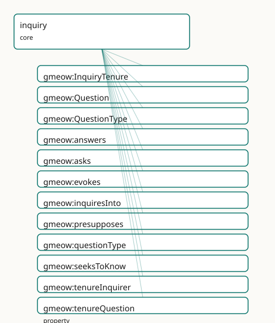

<!-- GENERATED by gmeow ontology-docs. DO NOT EDIT. -->

# GMEOW Inquiry Module

- **IRI:** <https://blackcatinformatics.ca/gmeow/slices/inquiry>
- **Tier:** core
- **[`Group`](../reference/classes/gmeow-Group.md):** core

## What This Slice Covers

This slice owns 18 terms and contributes 2 mapping or projection rows. Use it when its terms match the native fact you want to preserve; use the linkage tables to see how those facts leave GMEOW for consumer vocabularies.

## Dependencies

- [`gmeow:slices/epistemics`](epistemics.md)
- [`gmeow:slices/kernel`](kernel.md)
- [`gmeow:slices/observations`](observations.md)
- [`gmeow:slices/standpoint`](standpoint.md)
- [`gmeow:slices/temporal`](temporal.md)

## Consumers

- [`Agent`](../reference/classes/gmeow-Agent.md) memory of open problems / what it is trying to find out ([Principle 14](https://github.com/Blackcat-Informatics/gmeow-ontology/blob/main/CONSTITUTION.md#principle-14)); recall surfaces open inquiries; abduction answers [`typeWhy`](../reference/individuals/gmeow-typeWhy.md) questions; the metacognition slice's known-unknowns mint Questions; loaded-question detection bridges the deception slice.

## Local Map



## Examples

### Loaded Question

- **Source:** [`slices/core/inquiry/examples/loaded-question.ttl`](https://github.com/Blackcat-Informatics/gmeow-ontology/blob/main/slices/core/inquiry/examples/loaded-question.ttl)
- **GMEOW terms:** [`gmeow:Proposition`](../reference/classes/gmeow-Proposition.md), [`gmeow:Question`](../reference/classes/gmeow-Question.md), [`gmeow:Standpoint`](../reference/classes/gmeow-Standpoint.md), [`gmeow:StandpointClaim`](../reference/classes/gmeow-StandpointClaim.md), [`gmeow:claimModality`](../reference/properties/gmeow-claimModality.md), [`gmeow:methodExpertJudgement`](../reference/individuals/gmeow-methodExpertJudgement.md), [`gmeow:observationMethod`](../reference/properties/gmeow-observationMethod.md), [`gmeow:observedFeature`](../reference/properties/gmeow-observedFeature.md), [`gmeow:presupposes`](../reference/properties/gmeow-presupposes.md), [`gmeow:questionType`](../reference/properties/gmeow-questionType.md)

```turtle
# SPDX-FileCopyrightText: 2026 Blackcat Informatics® Inc. <paudley@blackcatinformatics.ca>
# SPDX-License-Identifier: CC-BY-4.0
#
# Worked example — a LOADED question via the deception bridge, with NO new
# axiom. The classic "have you stopped cheating?" is a polar gmeow:Question that
# gmeow:presupposes a proposition ("you were cheating"). Loadedness is NOT a flag
# on the question: it is a gmeow:StandpointClaim over the presupposed proposition
# carrying gmeow:claimModality gmeow:refuted — a standpoint DENIES the
# presupposition, exposing the question as loaded. This reuses the standpoint /
# deception machinery (P6); there is no isLoaded bit and no truth bit anywhere.

@prefix gmeow: <https://blackcatinformatics.ca/gmeow/> .
@prefix ex:    <https://blackcatinformatics.ca/gmeow/examples/inquiry/> .
@prefix rdfs:  <http://www.w3.org/2000/01/rdf-schema#> .

# --- The polar question and the proposition it takes for granted.
ex:stoppedCheating a gmeow:Question ;
    gmeow:questionType gmeow:typePolar ;
    gmeow:presupposes ex:wasCheating ;
    rdfs:label "have you stopped cheating?"@en .

ex:wasCheating a gmeow:Proposition ;
    rdfs:label "you were cheating"@en .

# --- The frame from which the presupposition is denied.
ex:accused a gmeow:Standpoint ;
    gmeow:sharpens gmeow:universalStandpoint .

# --- The deception bridge: a StandpointClaim over the presupposed proposition
#     carrying gmeow:refuted. From this vantage the presupposition is DENIED, so
#     the question is exposed as loaded. The question STAYS OPEN — loadedness is
#     the refuted presupposition, not a property of the gmeow:Question itself.
ex:denial a gmeow:StandpointClaim ;
    gmeow:vantage ex:accused ;
    gmeow:observedFeature ex:wasCheating ;
    gmeow:observationMethod gmeow:methodExpertJudgement ;
    gmeow:claimModality gmeow:refuted .
```

### Open Question And Resolution

- **Source:** [`slices/core/inquiry/examples/open-question-and-resolution.ttl`](https://github.com/Blackcat-Informatics/gmeow-ontology/blob/main/slices/core/inquiry/examples/open-question-and-resolution.ttl)
- **GMEOW terms:** [`gmeow:Agent`](../reference/classes/gmeow-Agent.md), [`gmeow:Entity`](../reference/classes/gmeow-Entity.md), [`gmeow:Question`](../reference/classes/gmeow-Question.md), [`gmeow:Standpoint`](../reference/classes/gmeow-Standpoint.md), [`gmeow:StandpointClaim`](../reference/classes/gmeow-StandpointClaim.md), [`gmeow:answers`](../reference/properties/gmeow-answers.md), [`gmeow:asks`](../reference/properties/gmeow-asks.md), [`gmeow:believes`](../reference/properties/gmeow-believes.md), [`gmeow:claimModality`](../reference/properties/gmeow-claimModality.md), [`gmeow:knowsThat`](../reference/properties/gmeow-knowsThat.md)

```turtle
# SPDX-FileCopyrightText: 2026 Blackcat Informatics® Inc. <paudley@blackcatinformatics.ca>
# SPDX-License-Identifier: CC-BY-4.0
#
# Worked example — the open→resolved inquiry lifecycle, reusing the epistemics
# spine. An agent asks a Wh-question, holding it OPEN. One vantage answers it
# with a gmeow:StandpointClaim (a kind of Observation): the answer rides
# gmeow:observedFeature / gmeow:observationResult and gmeow:answers the question.
# The agent RESOLVES the question by accepting that answer-claim through the
# epistemics spine — gmeow:knowsThat (which ENTAILS gmeow:believes by the
# keystone). No truth bit anywhere, and no global "answered" flag: resolution
# REUSES the epistemics spine rather than minting a new resolved term (P6).

@prefix gmeow: <https://blackcatinformatics.ca/gmeow/> .
@prefix ex:    <https://blackcatinformatics.ca/gmeow/examples/inquiry/> .
@prefix rdfs:  <http://www.w3.org/2000/01/rdf-schema#> .

# --- The agent and the open Wh-question.
ex:lillith a gmeow:Agent ;
    gmeow:asks ex:whereIsKey .   # the question is held OPEN by lillith

ex:whereIsKey a gmeow:Question ;
    gmeow:questionType gmeow:typeWh ;
    rdfs:label "where is the key?"@en .

# --- The observer whose vantage supplies an answer.
ex:houseObserver a gmeow:Standpoint ;
    gmeow:sharpens gmeow:universalStandpoint .

ex:hookLocation a gmeow:Entity ;
    rdfs:label "the hook by the door"@en .

# --- One vantage's answer: a StandpointClaim that gmeow:answers the question.
#     The answer content rides the Observation spine (observedFeature = the
#     thing observed, observationResult = the located place); the claim is one
#     vantage-indexed answer among possibly many (P9), never THE answer.
ex:keyOnHook a gmeow:StandpointClaim ;
    gmeow:answers ex:whereIsKey ;
    gmeow:vantage ex:houseObserver ;
    gmeow:observedFeature ex:whereIsKey ;
    gmeow:observationResult ex:hookLocation ;
    gmeow:observationMethod gmeow:methodDirectObservation ;
    gmeow:claimModality gmeow:unequivocal .

# --- Resolution: lillith ACCEPTS the answer-claim through the epistemics spine.
#     gmeow:knowsThat ⊑ gmeow:believes (the epistemics keystone): accepting the
#     answer-claim closes the inquiry. The question is now RESOLVED FOR lillith
#     — there is no global "answered" flag; another agent may still hold it open.
ex:lillith gmeow:knowsThat ex:keyOnHook .   # entails gmeow:believes ex:keyOnHook
```

## Terms

### Classes

| Term | Label | Definition |
|---|---|---|
| [`gmeow:InquiryTenure`](../reference/classes/gmeow-InquiryTenure.md) | Inquiry Tenure | The reified, time-scoped fact that an agent held an open question over an interval — an inquiry opened in January and closed by an accepted answer in June is a... |
| [`gmeow:Question`](../reference/classes/gmeow-Question.md) | Question | Erotetic content individuated by its ANSWERHOOD CONDITION — the set of propositions counting as direct answers — not by a truth-condition. Existing by social c... |
| [`gmeow:QuestionType`](../reference/classes/gmeow-QuestionType.md) | Question Type | The erotetic kind of a question — a closed value vocabulary spanning polar (yes/no), alternative (which-of-a-named-set), wh (who/what/where/when), why (explana... |

### Properties

| Term | Label | Definition |
|---|---|---|
| [`gmeow:answers`](../reference/properties/gmeow-answers.md) | answers | Relates a candidate direct answer to the question it answers. The DOMAIN is left intentionally open: an answer is typically a [`gmeow:StandpointClaim`](../reference/classes/gmeow-StandpointClaim.md) or a gmeow:... |
| [`gmeow:asks`](../reference/properties/gmeow-asks.md) | asks | An agent poses / holds a question as open — the base inquiry attitude and the cheap 80% surface. Range is intentionally OPEN: the object may be a gmeow:Questio... |
| [`gmeow:evokes`](../reference/properties/gmeow-evokes.md) | evokes | Relates a declarative or erotetic premise to a question it gives rise to — Wiśniewski's erotetic implication (a question or set of propositions evokes a furthe... |
| [`gmeow:inquiresInto`](../reference/properties/gmeow-inquiresInto.md) | inquires into | An agent actively pursues an answer to a question — the investigative attitude, committing inquiry effort, stronger than merely asking or wondering. Range OPEN... |
| [`gmeow:presupposes`](../reference/properties/gmeow-presupposes.md) | presupposes | Relates a question to a proposition that must hold for the question to have a true answer — its presupposition ('have you stopped X?' presupposes 'you once did... |
| [`gmeow:questionType`](../reference/properties/gmeow-questionType.md) | question type | Classifies a question by its erotetic kind — one of the closed [`gmeow:QuestionType`](../reference/classes/gmeow-QuestionType.md) value vocabulary. NOT functional: a single question may carry several types a... |
| [`gmeow:seeksToKnow`](../reference/properties/gmeow-seeksToKnow.md) | seeks to know | An agent directs its inquiry at an epistemics resolution — pursuing the question specifically so as to [`gmeow:knowsThat`](../reference/properties/gmeow-knowsThat.md) its answer: the goal-directed erotetic a... |
| [`gmeow:tenureInquirer`](../reference/properties/gmeow-tenureInquirer.md) | tenure inquirer | The agent whose open question an inquiry-tenure records. Functional: one tenure, one inquirer; two agents holding the same question open are two tenures sharin... |
| [`gmeow:tenureQuestion`](../reference/properties/gmeow-tenureQuestion.md) | tenure question | The question the tenure records the agent as holding open over its interval. Functional: one tenure, one question; an agent holding five questions open bears f... |
| [`gmeow:wondersWhether`](../reference/properties/gmeow-wondersWhether.md) | wonders whether | An agent entertains a question — typically a polar one — without committing inquiry effort to resolving it: the idle, low-investment erotetic attitude, weaker... |

### Individuals

| Term | Label | Definition |
|---|---|---|
| [`gmeow:typeAlternative`](../reference/individuals/gmeow-typeAlternative.md) | alternative (which-of-a-set) | A which-of-a-named-set question — its answerhood condition is a closed disjunction of named alternatives ('tea or coffee?'). Distinct from a polar question (wh... |
| [`gmeow:typeHow`](../reference/individuals/gmeow-typeHow.md) | how (procedure-seeking) | A procedure-seeking question — its answerhood condition is a set of procedures / methods that achieve an end. Bridges the procedures extension: a typeHow quest... |
| [`gmeow:typePolar`](../reference/individuals/gmeow-typePolar.md) | polar (yes/no) | A yes/no question — its answerhood condition is a proposition and its negation; the direct answers are 'yes' and 'no'. The simplest erotetic kind, the natural... |
| [`gmeow:typeWh`](../reference/individuals/gmeow-typeWh.md) | wh (who/what/where/when) | A who/what/where/when question — its answerhood condition is an open set of instantiations of a variable (the individual filling the wh-slot). The constituent-... |
| [`gmeow:typeWhy`](../reference/individuals/gmeow-typeWhy.md) | why (explanation-seeking) | An explanation-seeking question — its answerhood condition is a set of explanations of a fact (the explanandum). Bridges the abduction tetrad: a typeWhy questi... |

## Linkages

- **Rows:** 2
- **Projection profiles:** -
- **External vocabularies:** `schema`

| Source | Kind | Profile | Predicate/Relation | Target | Evidence |
|---|---|---|---|---|---|
| [`gmeow:Question`](../reference/classes/gmeow-Question.md) | equivalence | `-` | [skos:closeMatch](http://www.w3.org/2004/02/skos/core#closeMatch) | [schema:Question](https://schema.org/Question) | `gmeow-inquiry.sssom.tsv`; `gmeow:eqInq001`; confidence 0.9 |
| [`gmeow:answers`](../reference/properties/gmeow-answers.md) | equivalence | `-` | [skos:closeMatch](http://www.w3.org/2004/02/skos/core#closeMatch) | [schema:answer](https://schema.org/answer) | `gmeow-inquiry.sssom.tsv`; `gmeow:eqInq002`; confidence 0.8 |

## Guide

<!-- SPDX-FileCopyrightText: 2026 Blackcat Informatics® Inc. <paudley@blackcatinformatics.ca> -->
<!-- SPDX-License-Identifier: CC-BY-4.0 -->

# Inquiry

> **Slice:** `https://blackcatinformatics.ca/gmeow/slices/inquiry` · **tier: core**

Erotetic content — what an agent **asks**, as opposed to what it asserts or pursues. The epistemic
stack already lets an agent assert ([`gmeow:Proposition`](../reference/classes/gmeow-Proposition.md), truth-condition) and aim
([`gmeow:Goal`](../reference/classes/gmeow-Goal.md), satisfaction-condition); inquiry supplies the missing third content sibling,
[`gmeow:Question`](../reference/classes/gmeow-Question.md), individuated by its **answerhood condition** — the set of propositions counting as
direct answers. A question is neither true/false nor satisfied: it is **resolved** by an accepted
answer. This minimal core seeds the [`gmeow:Question`](../reference/classes/gmeow-Question.md) class, the closed [`gmeow:QuestionType`](../reference/classes/gmeow-QuestionType.md) value
vocabulary, the presupposition / answer relations, the flat four-verb inquiry-attitude spine, the
solver-layer [`gmeow:evokes`](../reference/properties/gmeow-evokes.md) decoration, and the reified [`gmeow:InquiryTenure`](../reference/classes/gmeow-InquiryTenure.md) half.

## The missing third sibling

The epistemic stack can *assert* and *aim* but not *ask*. [`gmeow:Question`](../reference/classes/gmeow-Question.md) completes the trio of
content modes — three [`gmeow:SocialObject`](../reference/classes/gmeow-SocialObject.md) siblings differing only in **mode of content**:

| Content | Individuated by | Settled by | Genus |
|---|---|---|---|
| [`gmeow:Proposition`](../reference/classes/gmeow-Proposition.md) (assertoric) | truth-condition | being held **true** | [`gmeow:SocialObject`](../reference/classes/gmeow-SocialObject.md) |
| [`gmeow:Goal`](../reference/classes/gmeow-Goal.md) (optative) | satisfaction-condition | being **satisfied** | [`gmeow:SocialObject`](../reference/classes/gmeow-SocialObject.md) |
| [`gmeow:Question`](../reference/classes/gmeow-Question.md) (erotetic) | answerhood-condition | being **resolved** by an accepted answer | [`gmeow:SocialObject`](../reference/classes/gmeow-SocialObject.md) |

The three are **documented siblings, not subsumed**: there is deliberately **no** [`rdfs:subClassOf`](http://www.w3.org/2000/01/rdf-schema#subClassOf)
between them, in either direction. Subsumption would erase the content-mode distinction that is the
whole point — a question shares no truth-condition with a proposition and no satisfaction-condition
with a goal, only the [`gmeow:SocialObject`](../reference/classes/gmeow-SocialObject.md) genus (content existing by social convention). This
extends the [`Proposition`](../reference/classes/gmeow-Proposition.md)/Goal direction-of-fit precedent (a belief and a goal may share the same
proposition yet differ in fit, with no [`Goal`](../reference/classes/gmeow-Goal.md) ⊑ [`Proposition`](../reference/classes/gmeow-Proposition.md) bridge) rather than amending it. The
siblinghood lives in prose and the `tests/test_inquiry.py` no-subsumption guard, never in an axiom.

### [`gmeow:Question`](../reference/classes/gmeow-Question.md)

Erotetic content individuated by its answerhood condition — the set of propositions counting as
direct answers — not by a truth-condition. A [`gmeow:SocialObject`](../reference/classes/gmeow-SocialObject.md) ([`gufo:Kind`](../external/terms.md#gufo-kind)) existing by social
convention like every description, it is neither true nor false (unlike a [`gmeow:Proposition`](../reference/classes/gmeow-Proposition.md)) nor
satisfied (unlike a [`gmeow:Goal`](../reference/classes/gmeow-Goal.md)): it is **resolved** by an accepted answer. Mint it once, classify
it with [`gmeow:questionType`](../reference/properties/gmeow-questionType.md), link its presuppositions with [`gmeow:presupposes`](../reference/properties/gmeow-presupposes.md) and its candidate
answers with [`gmeow:answers`](../reference/properties/gmeow-answers.md), and let several agents hold the one question open and answer it
differently from different vantages ([Principle 9](https://github.com/Blackcat-Informatics/gmeow-ontology/blob/main/CONSTITUTION.md#principle-9)).

## Question types

[`gmeow:QuestionType`](../reference/classes/gmeow-QuestionType.md) is a closed value vocabulary ([`gufo:AbstractIndividualType ⊑ gufo:QualityValue`](http://purl.org/nemo/gufo#AbstractIndividualType ⊑ gufo:QualityValue)),
mirroring the [`gmeow:StandpointModality`](../reference/classes/gmeow-StandpointModality.md) pattern: its members are **individuals, never subclasses**,
and more than one may co-apply to a single question (the property is non-functional).

| Value | Kind | Answerhood condition |
|---|---|---|
| [`gmeow:typePolar`](../reference/individuals/gmeow-typePolar.md) | polar (yes/no) | a proposition and its negation — answers are "yes"/"no" |
| [`gmeow:typeAlternative`](../reference/individuals/gmeow-typeAlternative.md) | alternative (which-of-a-set) | a **closed** disjunction of named alternatives ("tea or coffee?") |
| [`gmeow:typeWh`](../reference/individuals/gmeow-typeWh.md) | wh (who/what/where/when) | an **open** set of instantiations of a variable (the wh-slot filler) |
| [`gmeow:typeWhy`](../reference/individuals/gmeow-typeWhy.md) | why (explanation-seeking) | a set of explanations of a fact — the **explanandum** |
| [`gmeow:typeHow`](../reference/individuals/gmeow-typeHow.md) | how (procedure-seeking) | a set of procedures / methods achieving an end |

Two type values carry **documented routing bridges** (no axiom): a [`gmeow:typeWhy`](../reference/individuals/gmeow-typeWhy.md) question's
explanandum is exactly the **abductive explanandum**, so abduction (the inference tetrad) answers
[`gmeow:typeWhy`](../reference/individuals/gmeow-typeWhy.md) questions; a [`gmeow:typeHow`](../reference/individuals/gmeow-typeHow.md) question is answered by a procedure described in the
**procedures extension**. The bridges are routing for consumers, not entailments.

### [`gmeow:QuestionType`](../reference/classes/gmeow-QuestionType.md) · [`gmeow:questionType`](../reference/properties/gmeow-questionType.md)

[`gmeow:QuestionType`](../reference/classes/gmeow-QuestionType.md) is the closed value vocabulary of erotetic kinds; [`gmeow:questionType`](../reference/properties/gmeow-questionType.md)
(domain [`gmeow:Question`](../reference/classes/gmeow-Question.md), range [`gmeow:QuestionType`](../reference/classes/gmeow-QuestionType.md)) classifies a question by pointing it at one or
more of those values. It is **non-functional** on purpose — a "why … and how" question is both
[`gmeow:typeWhy`](../reference/individuals/gmeow-typeWhy.md) and [`gmeow:typeHow`](../reference/individuals/gmeow-typeHow.md) — so consumers route the explanandum to abduction and the
procedure to the procedures extension off the co-applied values.

## The inquiry attitude spine

Four agent-to-question attitudes form the flat 80% surface ([Principle 4](https://github.com/Blackcat-Informatics/gmeow-ontology/blob/main/CONSTITUTION.md#principle-4)). Each is an
[`owl:ObjectProperty`](http://www.w3.org/2002/07/owl#ObjectProperty) with domain [`gmeow:Agent`](../reference/classes/gmeow-Agent.md), an **open range** (the epistemics doxastic-spine
precedent, [Principle 13](https://github.com/Blackcat-Informatics/gmeow-ontology/blob/main/CONSTITUTION.md#principle-13)), and is **non-functional** — an agent holds many inquiries at once.

| Property | Attitude |
|---|---|
| [`gmeow:asks`](../reference/properties/gmeow-asks.md) | poses / holds a question as open — the base attitude, the cheap 80% surface |
| [`gmeow:wondersWhether`](../reference/properties/gmeow-wondersWhether.md) | idly entertains a question (typically polar) without committing inquiry effort |
| [`gmeow:inquiresInto`](../reference/properties/gmeow-inquiresInto.md) | actively investigates, committing inquiry effort — stronger than asking or wondering |
| [`gmeow:seeksToKnow`](../reference/properties/gmeow-seeksToKnow.md) | directs inquiry at an epistemics resolution — pursues so as to [`gmeow:knowsThat`](../reference/properties/gmeow-knowsThat.md) the answer |

The spine is deliberately **FLAT**: there is **no** [`rdfs:subPropertyOf`](http://www.w3.org/2000/01/rdf-schema#subPropertyOf) among the four — they are
four distinct attitudes, not a hierarchy. This contrasts the doxastic spine's keystone
[`gmeow:knowsThat`](../reference/properties/gmeow-knowsThat.md) ⊑ [`gmeow:believes`](../reference/properties/gmeow-believes.md); inquiry has no analogous keystone subproperty because no inquiry
attitude *entails* another (wondering is not a weaker asking — it is a different stance). The open
range lets the 80% case point cheaply at any [`gmeow:Question`](../reference/classes/gmeow-Question.md) or reified inquiry; whose vantage and
over what interval ride [`gmeow:accordingTo`](../reference/properties/gmeow-accordingTo.md) / [`gmeow:validFrom`](../reference/properties/gmeow-validFrom.md) / [`gmeow:validUntil`](../reference/properties/gmeow-validUntil.md) on the statement.

### [`gmeow:asks`](../reference/properties/gmeow-asks.md) · [`gmeow:wondersWhether`](../reference/properties/gmeow-wondersWhether.md) · [`gmeow:inquiresInto`](../reference/properties/gmeow-inquiresInto.md) · [`gmeow:seeksToKnow`](../reference/properties/gmeow-seeksToKnow.md)

The flat inquiry attitudes, weakest to most directed: [`gmeow:asks`](../reference/properties/gmeow-asks.md) holds a question open;
[`gmeow:wondersWhether`](../reference/properties/gmeow-wondersWhether.md) idly entertains it; [`gmeow:inquiresInto`](../reference/properties/gmeow-inquiresInto.md) actively investigates it; and
[`gmeow:seeksToKnow`](../reference/properties/gmeow-seeksToKnow.md) aims the inquiry at an epistemics resolution. All four share domain [`gmeow:Agent`](../reference/classes/gmeow-Agent.md),
an open range, non-functionality, and no subproperty hierarchy.

**Open vs resolved.** A question is **open** for an agent until that agent [`gmeow:accepts`](../reference/properties/gmeow-accepts.md) or
[`gmeow:knowsThat`](../reference/properties/gmeow-knowsThat.md) an [`gmeow:answers`](../reference/properties/gmeow-answers.md)-claim for it. Resolution **reuses the epistemics doxastic spine**
— there is no new `resolved`, `isAnswered`, or `answerValue` term ([Principle 6](https://github.com/Blackcat-Informatics/gmeow-ontology/blob/main/CONSTITUTION.md#principle-6)). The
[`open-question-and-resolution.ttl`](examples/open-question-and-resolution.ttl) example walks the full
lifecycle: ex:lillith [`gmeow:asks`](../reference/properties/gmeow-asks.md) ex:whereIsKey (a [`gmeow:typeWh`](../reference/individuals/gmeow-typeWh.md) question held open); a house
observer's [`gmeow:StandpointClaim`](../reference/classes/gmeow-StandpointClaim.md) [`gmeow:answers`](../reference/properties/gmeow-answers.md) it (one vantage-indexed answer among possibly
many, riding the [`Observation`](../reference/classes/gmeow-Observation.md) spine); and ex:lillith [`gmeow:knowsThat`](../reference/properties/gmeow-knowsThat.md) that answer-claim resolves the
question **for lillith** — [`gmeow:knowsThat`](../reference/properties/gmeow-knowsThat.md) ⊑ [`gmeow:believes`](../reference/properties/gmeow-believes.md) materialises the belief by the keystone.
Resolution is per-agent, never a global "answered" flag; another agent may still hold the question
open. No truth bit appears anywhere.

## Presupposition & loaded questions

[`gmeow:presupposes`](../reference/properties/gmeow-presupposes.md) (domain [`gmeow:Question`](../reference/classes/gmeow-Question.md), range [`gmeow:Proposition`](../reference/classes/gmeow-Proposition.md), non-functional) records a
proposition that must hold for the question to admit a true answer — "have you stopped X?"
presupposes "you once did X". The presupposition rides as the **subject of the relation**, never
asserted as a fact of the universal standpoint.

A **loaded question** carries **no new axiom and no `isLoaded` flag**. Loadedness is a *contested or
false presupposition*, modelled by reusing the standpoint / deception machinery ([Principle 6](https://github.com/Blackcat-Informatics/gmeow-ontology/blob/main/CONSTITUTION.md#principle-6)): a
[`gmeow:StandpointClaim`](../reference/classes/gmeow-StandpointClaim.md) over the presupposed [`gmeow:Proposition`](../reference/classes/gmeow-Proposition.md) carrying
[`gmeow:claimModality`](../reference/properties/gmeow-claimModality.md) [`gmeow:refuted`](../reference/individuals/gmeow-refuted.md) — a standpoint **denies** the presupposition, exposing the
question as loaded. The [`loaded-question.ttl`](examples/loaded-question.ttl) example shows the
classic "have you stopped cheating?" (a [`gmeow:typePolar`](../reference/individuals/gmeow-typePolar.md) question presupposing "you were cheating"):
the accused standpoint mints a refuted [`gmeow:StandpointClaim`](../reference/classes/gmeow-StandpointClaim.md) over that presupposition. The question
itself **stays open** — loadedness is the refuted presupposition, not a property of the
[`gmeow:Question`](../reference/classes/gmeow-Question.md) — and the deception slice reads the denial off the standpoint layer.

### [`gmeow:presupposes`](../reference/properties/gmeow-presupposes.md)

Relates a question to a proposition it takes for granted. Non-functional (a question may presuppose
several propositions). To mark a loaded question, mint a refuted [`gmeow:StandpointClaim`](../reference/classes/gmeow-StandpointClaim.md) over the
presupposed [`gmeow:Proposition`](../reference/classes/gmeow-Proposition.md) rather than altering the question — the deception-slice bridge, with
no `isLoaded` bit and no truth bit on the question.

## Answers are vantage-indexed

[`gmeow:answers`](../reference/properties/gmeow-answers.md) (range [`gmeow:Question`](../reference/classes/gmeow-Question.md), **open domain**, non-functional) relates a candidate direct
answer — typically a [`gmeow:StandpointClaim`](../reference/classes/gmeow-StandpointClaim.md) or a [`gmeow:Proposition`](../reference/classes/gmeow-Proposition.md) — to the question it answers.
The domain stays open (documented in prose, never an [`owl:unionOf`](http://www.w3.org/2002/07/owl#unionOf)) so the answer surface is not
prematurely closed. Answers are **vantage-indexed** ([Principle 9](https://github.com/Blackcat-Informatics/gmeow-ontology/blob/main/CONSTITUTION.md#principle-9)): different standpoints answer the
same question differently and the answers **coexist** — there is never one global answer. Whose
answer it is rides [`gmeow:accordingTo`](../reference/properties/gmeow-accordingTo.md) on the statement; an agent's acceptance rides the epistemics
spine ([`gmeow:accepts`](../reference/properties/gmeow-accepts.md) / [`gmeow:knowsThat`](../reference/properties/gmeow-knowsThat.md)), never a privileged-winner slot.

### [`gmeow:answers`](../reference/properties/gmeow-answers.md) · [`gmeow:evokes`](../reference/properties/gmeow-evokes.md)

[`gmeow:answers`](../reference/properties/gmeow-answers.md) carries one standpoint's direct answer (open domain, vantage-indexed, non-functional);
[`gmeow:evokes`](../reference/properties/gmeow-evokes.md) (range [`gmeow:Question`](../reference/classes/gmeow-Question.md), open domain, non-functional) records **Wiśniewski's erotetic
implication** — a declarative or erotetic premise giving rise to a further question (a [`gmeow:Proposition`](../reference/classes/gmeow-Proposition.md)
or a [`gmeow:Question`](../reference/classes/gmeow-Question.md) may evoke a question, e.g. "who committed it?" evokes "what was the motive?").
[`gmeow:evokes`](../reference/properties/gmeow-evokes.md) is a **solver-layer decoration** ([Principle 12](https://github.com/Blackcat-Informatics/gmeow-ontology/blob/main/CONSTITUTION.md#principle-12)): it carries **no reasoner / entailment
semantics** in core — the ontology never derives an evoked question and no DL axiom enforces the
relation; whether one question genuinely evokes another is solver work, asserted here only as recorded
structure.

### [`gmeow:InquiryTenure`](../reference/classes/gmeow-InquiryTenure.md) · [`gmeow:tenureInquirer`](../reference/properties/gmeow-tenureInquirer.md) · [`gmeow:tenureQuestion`](../reference/properties/gmeow-tenureQuestion.md)

[`gmeow:InquiryTenure`](../reference/classes/gmeow-InquiryTenure.md) ([`gufo:SituationType ⊑ gmeow:TimeScopedRelation`](http://purl.org/nemo/gufo#SituationType ⊑ gmeow:TimeScopedRelation)) is the reified, time-scoped
fact that an agent held an open question over an interval — the [`gmeow:StandpointTenure`](../reference/classes/gmeow-StandpointTenure.md) idiom applied
to inquiry, minted **on demand** when the opening / closing of an inquiry is itself the fact of
interest (the common case is a bare [`gmeow:asks`](../reference/properties/gmeow-asks.md) with [`gmeow:validFrom`](../reference/properties/gmeow-validFrom.md) / [`gmeow:validUntil`](../reference/properties/gmeow-validUntil.md),
[Principle 4](https://github.com/Blackcat-Informatics/gmeow-ontology/blob/main/CONSTITUTION.md#principle-4)). It carries its interval via [`gmeow:duringInterval`](../reference/properties/gmeow-duringInterval.md) (temporal module) and mediates at
least one question through an EL [`owl:someValuesFrom`](http://www.w3.org/2002/07/owl#someValuesFrom) restriction on [`gmeow:tenureQuestion`](../reference/properties/gmeow-tenureQuestion.md)
(closed-world "exactly one" is SHACL's `gmeow:InquiryTenureShape`). [`gmeow:tenureInquirer`](../reference/properties/gmeow-tenureInquirer.md) (functional,
range [`gmeow:Agent`](../reference/classes/gmeow-Agent.md)) names the one inquirer and [`gmeow:tenureQuestion`](../reference/properties/gmeow-tenureQuestion.md) (functional, range
[`gmeow:Question`](../reference/classes/gmeow-Question.md)) the one question — two agents holding the same question open are **two tenures
sharing one [`gmeow:tenureQuestion`](../reference/properties/gmeow-tenureQuestion.md)**, five open questions are five tenures.

**Reopening, retain-never-delete.** An inquiry opened in January and closed by an accepted answer in
June is an opened-then-closed tenure, never a deletion ([Principle 10](https://github.com/Blackcat-Informatics/gmeow-ontology/blob/main/CONSTITUTION.md#principle-10)). **Reopening** a closed inquiry
suppresses the prior accepted answer with [`gmeow:displayable`](../reference/properties/gmeow-displayable.md) false rather than removing any triple —
the question and its full inquiry history stay queryable.

## SSSOM alignments (`mappings/equivalences.ttl`)

Authored once in `mappings/equivalences.ttl` and compiled to `mappings/gmeow-inquiry.sssom.tsv` by
`gmeow compile-mappings` ([Principle 4](https://github.com/Blackcat-Informatics/gmeow-ontology/blob/main/CONSTITUTION.md#principle-4)); all by reference ([Principle 5](https://github.com/Blackcat-Informatics/gmeow-ontology/blob/main/CONSTITUTION.md#principle-5)) — GMEOW never imports an
external axiom. The match to schema.org's QA vocabulary is deliberately loose ([`skos:closeMatch`](http://www.w3.org/2004/02/skos/core#closeMatch), not
`equivalentClass`).

| GMEOW | Predicate | Target | Note |
|---|---|---|---|
| [`gmeow:Question`](../reference/classes/gmeow-Question.md) | [`skos:closeMatch`](http://www.w3.org/2004/02/skos/core#closeMatch) | [`schema:Question`](https://schema.org/Question) | [schema:Question](https://schema.org/Question) is the QA **speech act / posted question** on a QAPage; [`gmeow:Question`](../reference/classes/gmeow-Question.md) is answerhood-individuated **content** (the third content sibling), neither true/false nor a page |
| [`gmeow:answers`](../reference/properties/gmeow-answers.md) | [`skos:closeMatch`](http://www.w3.org/2004/02/skos/core#closeMatch) | [`schema:answer`](https://schema.org/answer) | [schema:answer](https://schema.org/answer)'s [`schema:acceptedAnswer`](https://schema.org/acceptedAnswer) / [`schema:suggestedAnswer`](https://schema.org/suggestedAnswer) lineage picks **one** accepted answer; [`gmeow:answers`](../reference/properties/gmeow-answers.md) is vantage-indexed and coexisting (P9), acceptance carried on the epistemics spine |

The **speech-act-vs-answerhood-content** distinction is why neither row is `equivalentClass`: the
[schema:acceptedAnswer](https://schema.org/acceptedAnswer) / [schema:suggestedAnswer](https://schema.org/suggestedAnswer) split has no gmeow counterpart and folds into the
standpoint layer. The **competency-question (CQ)** practice familiar from ontology engineering — a
question as a requirement a model must answer — is the natural consumer of this slice but has no
stable IRI vocabulary, so it is referenced in prose only. The [`gmeow:QuestionType`](../reference/classes/gmeow-QuestionType.md) value vocabulary
likewise has no stable external IRI counterpart and is intentionally left unmapped.

## Dependencies

| Slice | Why |
|---|---|
| `kernel` | [`gmeow:SocialObject`](../reference/classes/gmeow-SocialObject.md) (the content-mode genus) and [`gmeow:Agent`](../reference/classes/gmeow-Agent.md) (the inquiry-spine domain) |
| `epistemics` | [`gmeow:Proposition`](../reference/classes/gmeow-Proposition.md) (the presupposition range) and the doxastic spine ([`gmeow:accepts`](../reference/properties/gmeow-accepts.md) / [`gmeow:knowsThat`](../reference/properties/gmeow-knowsThat.md)) that **resolves** inquiries — reused, never re-minted |
| `standpoint` | [`gmeow:StandpointClaim`](../reference/classes/gmeow-StandpointClaim.md) and [`gmeow:claimModality`](../reference/properties/gmeow-claimModality.md) [`gmeow:refuted`](../reference/individuals/gmeow-refuted.md) carry vantage-indexed answers and loaded-question denials |
| `observations` | the Observation spine an answering [`gmeow:StandpointClaim`](../reference/classes/gmeow-StandpointClaim.md) rides ([`gmeow:vantage`](../reference/properties/gmeow-vantage.md), [`gmeow:observedFeature`](../reference/properties/gmeow-observedFeature.md), [`gmeow:observationResult`](../reference/properties/gmeow-observationResult.md)) |
| `temporal` | [`gmeow:TimeScopedRelation`](../reference/classes/gmeow-TimeScopedRelation.md) (the [`gmeow:InquiryTenure`](../reference/classes/gmeow-InquiryTenure.md) parent) and [`gmeow:duringInterval`](../reference/properties/gmeow-duringInterval.md) (its scoping interval) |

## Verified by construction

`tests/test_inquiry.py` pins the load-bearing shape of the slice:

- **Sibling no-subsumption guard** — [`gmeow:Question`](../reference/classes/gmeow-Question.md) is a [`gmeow:SocialObject`](../reference/classes/gmeow-SocialObject.md) ([`gufo:Kind`](../external/terms.md#gufo-kind)) with no
 [`rdfs:subClassOf`](http://www.w3.org/2000/01/rdf-schema#subClassOf) to or from [`gmeow:Proposition`](../reference/classes/gmeow-Proposition.md) / [`gmeow:Goal`](../reference/classes/gmeow-Goal.md) in either direction.
- **Flat, open-range spine** — each of [`gmeow:asks`](../reference/properties/gmeow-asks.md) / [`gmeow:wondersWhether`](../reference/properties/gmeow-wondersWhether.md) / [`gmeow:inquiresInto`](../reference/properties/gmeow-inquiresInto.md) /
 [`gmeow:seeksToKnow`](../reference/properties/gmeow-seeksToKnow.md) is an object property with domain [`gmeow:Agent`](../reference/classes/gmeow-Agent.md), no [`rdfs:range`](http://www.w3.org/2000/01/rdf-schema#range), no
 [`owl:FunctionalProperty`](http://www.w3.org/2002/07/owl#FunctionalProperty), and **no** [`rdfs:subPropertyOf`](http://www.w3.org/2000/01/rdf-schema#subPropertyOf).
- **No truth or resolution bit** — none of `isResolved` / `isAnswered` / `answerValue` / `isTrue` /
 `isFalse` appears in any triple position; resolution reuses the epistemics spine.
- **[`gmeow:answers`](../reference/properties/gmeow-answers.md) / [`gmeow:evokes`](../reference/properties/gmeow-evokes.md) open domain** — both range over [`gmeow:Question`](../reference/classes/gmeow-Question.md) with no asserted
 [`rdfs:domain`](http://www.w3.org/2000/01/rdf-schema#domain), so the answer / evocation surface is never prematurely closed.
- **[`gmeow:InquiryTenure`](../reference/classes/gmeow-InquiryTenure.md) shape** — a [`gufo:SituationType ⊑ gmeow:TimeScopedRelation`](http://purl.org/nemo/gufo#SituationType ⊑ gmeow:TimeScopedRelation) with functional
 [`gmeow:tenureInquirer`](../reference/properties/gmeow-tenureInquirer.md) / [`gmeow:tenureQuestion`](../reference/properties/gmeow-tenureQuestion.md) and the EL [`owl:someValuesFrom`](http://www.w3.org/2002/07/owl#someValuesFrom) mediation restriction
 on [`gmeow:tenureQuestion`](../reference/properties/gmeow-tenureQuestion.md).
- **[`Annotation`](../reference/classes/gmeow-Annotation.md) completeness** ([Principle 8](https://github.com/Blackcat-Informatics/gmeow-ontology/blob/main/CONSTITUTION.md#principle-8)) — all 18 locally-declared terms carry an [`rdfs:label`](http://www.w3.org/2000/01/rdf-schema#label), a
 [`skos:definition`](http://www.w3.org/2004/02/skos/core#definition), and [`rdfs:isDefinedBy`](http://www.w3.org/2000/01/rdf-schema#isDefinedBy) the inquiry slice IRI.
