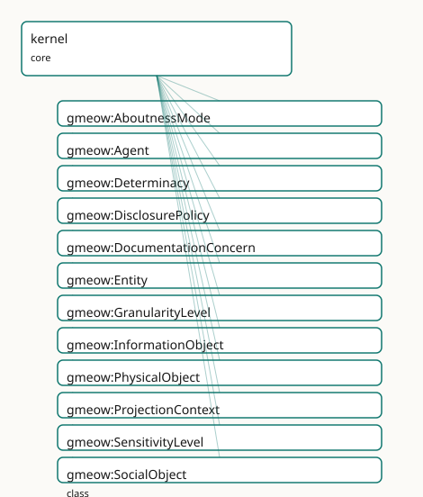

<!-- GENERATED by gmeow ontology-docs. DO NOT EDIT. -->

# GMEOW Core Module

- **IRI:** <https://blackcatinformatics.ca/gmeow/slices/kernel>
- **Tier:** core
- **[`Group`](../reference/classes/gmeow-Group.md):** core

## What This Slice Covers

This slice owns 73 terms and contributes 78 mapping or projection rows. Use it when its terms match the native fact you want to preserve; use the linkage tables to see how those facts leave GMEOW for consumer vocabularies.

## Consumers

- Every slice: the gUFO-grounded kernel ([`Entity`](../reference/classes/gmeow-Entity.md), [`Agent`](../reference/classes/gmeow-Agent.md), [`InformationObject`](../reference/classes/gmeow-InformationObject.md), base relations).

## Local Map

## Terms

### Classes

| Term | Label | Definition |
|---|---|---|
| [`gmeow:AboutnessMode`](../reference/classes/gmeow-AboutnessMode.md) | Aboutness Mode | The rhetorical relation between an information carrier and its subject matter — whether the carrier describes the subject (mention: reporting, quoting, depicti... |
| [`gmeow:Agent`](../reference/classes/gmeow-Agent.md) | Agent | An entity that can act, bear responsibility, and enter into agreements: a person, an organization, or a software agent. |
| [`gmeow:Determinacy`](../reference/classes/gmeow-Determinacy.md) | Determinacy | The model of ontic determinacy or indeterminacy for a value — whether it is inherently crisp, vague, fuzzy, probabilistic, or disputed. Distinct from epistemic... |
| [`gmeow:DisclosurePolicy`](../reference/classes/gmeow-DisclosurePolicy.md) | Disclosure Policy | The disclosure posture of a value or claim — an open value vocabulary of individuals (never subclasses) classifying whether and under what conditions the fact... |
| [`gmeow:DocumentationConcern`](../reference/classes/gmeow-DocumentationConcern.md) | documentation concern | A cross-cutting documentation theme generated into its own guide page. Terms opt into a concern with [`gmeow:docsConcern`](../reference/properties/gmeow-docsConcern.md) so adoption-oriented docs are ontology-b... |
| [`gmeow:Entity`](../reference/classes/gmeow-Entity.md) | Entity | Anything in the GMEOW universe of discourse that persists in time and can bear properties: an agent, a document, a contact point, and so on. |
| [`gmeow:GranularityLevel`](../reference/classes/gmeow-GranularityLevel.md) | Granularity Level | A level of detail / resolution at which a value is expressed — a point on an open, ordered, domain-general axis (spatial: point ≺ address ≺ city ≺ region ≺ cou... |
| [`gmeow:InformationObject`](../reference/classes/gmeow-InformationObject.md) | Information Object | An entity whose nature is to carry information content: a document, dataset, software artifact, online account, or message. The shared parent of the document,... |
| [`gmeow:PhysicalObject`](../reference/classes/gmeow-PhysicalObject.md) | Physical Object | An entity that is a material thing occupying space and time — a device, instrument, vehicle, building, or natural body. Distinct from Agent (which acts and bea... |
| [`gmeow:ProjectionContext`](../reference/classes/gmeow-ProjectionContext.md) | Projection Context | The consumer or audience for which a fact is eligible to be projected — an open value vocabulary of individuals (never subclasses). Names downstream targets su... |
| [`gmeow:SensitivityLevel`](../reference/classes/gmeow-SensitivityLevel.md) | Sensitivity Level | A privacy-sensitivity classification for a value — an open, ordered value vocabulary (public ≺ internal ≺ confidential ≺ restricted ≺ sensitive personal). The... |
| [`gmeow:SocialObject`](../reference/classes/gmeow-SocialObject.md) | Social Object | An entity that exists by virtue of social convention, collective acceptance, or sustained narrative practice — a myth, an urban legend, an agreement, a standpo... |

### Properties

| Term | Label | Definition |
|---|---|---|
| [`gmeow:avoidForConsumer`](../reference/properties/gmeow-avoidForConsumer.md) | avoid for consumer | Term-level advisory metadata naming downstream ProjectionContext individuals for which the annotated ontology construct is normally too detailed, too lossy, or... |
| [`gmeow:avoidWhen`](../reference/properties/gmeow-avoidWhen.md) | avoid when | Term-level advisory metadata naming conditions in which a class, property, individual, or slice-level construct should not be used, or should be promoted to a... |
| [`gmeow:coarsenGuarded`](../reference/properties/gmeow-coarsenGuarded.md) | coarsen guarded | Marks a property as PRECISION-BEARING for disclosure control (CONSTITUTION P10): when a projection branch reads this property of a subject, the mapping c... |
| [`gmeow:coarsenTo`](../reference/properties/gmeow-coarsenTo.md) | coarsen to | Disclosure control: marks a value/relator so that at projection time it is generalized to no finer than the named [`gmeow:GranularityLevel`](../reference/classes/gmeow-GranularityLevel.md) — a coarser ancestor i... |
| [`gmeow:coarserThan`](../reference/properties/gmeow-coarserThan.md) | coarser than | Orders the granularity axis: relates a granularity level to a finer level it generalizes (country [`gmeow:coarserThan`](../reference/properties/gmeow-coarserThan.md) city). Transitive; the partial order that m... |
| [`gmeow:coequalFacet`](../reference/properties/gmeow-coequalFacet.md) | co-equal facet | Marks a property as one co-equal identity-facet axis among peers (CONSTITUTION P9). Every property annotated coequalFacet true is held orthogonal to ever... |
| [`gmeow:connectsTo`](../reference/properties/gmeow-connectsTo.md) | connects to | Universal traversable-link relation: relates any GMEOW thing to another thing it is directly connected to in a graph, network, or path. Intentionally broad; us... |
| [`gmeow:docsConcern`](../reference/properties/gmeow-docsConcern.md) | documentation concern link | Links a term, slice, or documentation-bearing resource to a [`gmeow:DocumentationConcern`](../reference/classes/gmeow-DocumentationConcern.md). Used only by documentation projections; it carries no logical semantics... |
| [`gmeow:eligibleForConsumer`](../reference/properties/gmeow-eligibleForConsumer.md) | eligible for consumer | Relates a value, entity, or claim to the projection consumers it is eligible for — the explicit *who* facet of disclosure control. Domain-free (universal, like... |
| [`gmeow:frameCardinality`](../reference/properties/gmeow-frameCardinality.md) | frame cardinality | Optional cardinality override for a [`gmeow:requiresFrame`](../reference/properties/gmeow-requiresFrame.md) declaration: "exactly-one" or "at-least-one". Absent, the cardinality is derived from the frame propert... |
| [`gmeow:frameRequirementSeverity`](../reference/properties/gmeow-frameRequirementSeverity.md) | frame requirement severity | Optional severity for a [`gmeow:requiresFrame`](../reference/properties/gmeow-requiresFrame.md) declaration: "warning" downgrades the generated frame-relativity shape from sh:Violation to sh:Warning (used while... |
| [`gmeow:generalizesVia`](../reference/properties/gmeow-generalizesVia.md) | generalizes via | Projection-compiler guidance naming the transitive part/whole property to walk when coarsening a value (e.g. [`gmeow:containedInPlace`](../reference/properties/gmeow-containedInPlace.md) for places). Defaults to gm... |
| [`gmeow:guideBlob`](../reference/properties/gmeow-guideBlob.md) | guide blob | Links a slice to the content-addressed digest of its Tier-2 narrative guide as embedded in a GTS package: the guide rides the same file as the ontology,... |
| [`gmeow:hasAboutness`](../reference/properties/gmeow-hasAboutness.md) | has aboutness | Relates an information carrier (a document, span, segment, citation act, exemplar, or statement via the statement layer) to its aboutness mode — the explicit f... |
| [`gmeow:hasDeterminacy`](../reference/properties/gmeow-hasDeterminacy.md) | has determinacy | Relates a value, entity, or claim to its ontic determinacy model — the explicit facet recording whether the value is crisp, vague, fuzzy, probabilistic, or dis... |
| [`gmeow:hasDisclosurePolicy`](../reference/properties/gmeow-hasDisclosurePolicy.md) | has disclosure policy | Relates a value, entity, or claim to its disclosure policy — the explicit *what* facet of disclosure control. Domain-free (universal, like hasGranularity and h... |
| [`gmeow:hasGranularity`](../reference/properties/gmeow-hasGranularity.md) | has granularity | Relates a value, place, period, coordinate or measurement to its own resolution level — the explicit 'no silent precision' facet, queryable independently of an... |
| [`gmeow:hasPart`](../reference/properties/gmeow-hasPart.md) | has part | Universal whole-to-part inverse of [`gmeow:partOf`](../reference/properties/gmeow-partOf.md). Transitive and intentionally broad; specialized component and containment properties remain the authoritative... |
| [`gmeow:hasSensitivity`](../reference/properties/gmeow-hasSensitivity.md) | has sensitivity | Relates a value, entity, or claim to its privacy-sensitivity level — the explicit facet that drives disclosure-control decisions (coarsenTo / displayable) at p... |
| [`gmeow:hasUnit`](../reference/properties/gmeow-hasUnit.md) | has unit | Relates a quantitative value or measurement to its QUDT unit (by reference, never imported). Domain-free: used by temporal measurements, spatial measurements,... |
| [`gmeow:howToUse`](../reference/properties/gmeow-howToUse.md) | how to use | Term-level advisory metadata carrying a short modeling recipe for the HOW facet: the companion properties, relators, statement metadata, or projection checks t... |
| [`gmeow:namingNote`](../reference/properties/gmeow-namingNote.md) | naming note | An explicit justification for a term local name that the primary/preferred/default/main naming lint (CONSTITUTION P9) would otherwise reject. Legitimate... |
| [`gmeow:pairsWith`](../reference/properties/gmeow-pairsWith.md) | pairs with | Links the two halves of a flat-first/reify-on-demand pair — the flat shortcut and the reified relator that carries the same relationship when period, role, con... |
| [`gmeow:partOf`](../reference/properties/gmeow-partOf.md) | part of | Universal part-to-whole relation: relates any GMEOW thing to a larger whole it is part of. Transitive and intentionally broad; use specialized subproperties su... |
| [`gmeow:requiresFrame`](../reference/properties/gmeow-requiresFrame.md) | requires frame | Declares that every instance of the annotated class must carry the named reference-frame property (CONSTITUTION P11): 'a value asserted without its frame... |
| [`gmeow:useForConsumer`](../reference/properties/gmeow-useForConsumer.md) | use for consumer | Term-level advisory metadata naming downstream ProjectionContext individuals for which the annotated ontology construct is normally appropriate. This is docume... |
| [`gmeow:useWhen`](../reference/properties/gmeow-useWhen.md) | use when | Term-level advisory metadata naming the modeling situation in which a class, property, individual, or slice-level construct should be used. A narrower, machine... |

### Individuals

| Term | Label | Definition |
|---|---|---|
| [`gmeow:aboutnessDescribes`](../reference/individuals/gmeow-aboutnessDescribes.md) | describes | The describing (mention) aboutness mode — the carrier reports, quotes, depicts, defines, or analyzes its subject without performing it. Source material about a... |
| [`gmeow:aboutnessEnacts`](../reference/individuals/gmeow-aboutnessEnacts.md) | enacts | The enacting (use) aboutness mode — the carrier performs, demands, exemplifies, or embodies its subject rather than merely reporting it. A style guide whose pr... |
| [`gmeow:concernDisclosure`](../reference/individuals/gmeow-concernDisclosure.md) | disclosure and suppression | Projection-time withholding, coarsening, sensitivity, and display control. |
| [`gmeow:concernFrames`](../reference/individuals/gmeow-concernFrames.md) | frames and units | Reference frames, units, determinacy, granularity, and frame-relative values. |
| [`gmeow:concernGTSPackaging`](../reference/individuals/gmeow-concernGTSPackaging.md) | GTS packaging | The single-file Graph Transport Substrate and bundled documentation distribution. |
| [`gmeow:concernIdentifiersCoreference`](../reference/individuals/gmeow-concernIdentifiersCoreference.md) | identifiers and coreference | External authority links, identifier records, and reference-only bridging. |
| [`gmeow:concernProvenanceEvidence`](../reference/individuals/gmeow-concernProvenanceEvidence.md) | provenance and evidence | Attribution, derivation, confidence, evidence, and source lineage. |
| [`gmeow:concernStandpoints`](../reference/individuals/gmeow-concernStandpoints.md) | standpoints | Perspective-indexed claims without primary, preferred, or winner slots. |
| [`gmeow:concernStatementMetadata`](../reference/individuals/gmeow-concernStatementMetadata.md) | statement metadata | Native RDF 1.2 reifiers, statement annotations, confidence, provenance, and temporal scope. |
| [`gmeow:consumerAgentMemory`](../reference/individuals/gmeow-consumerAgentMemory.md) | agent memory | The consumer is an AI agent's working memory or retrieval store. |
| [`gmeow:consumerFoafExport`](../reference/individuals/gmeow-consumerFoafExport.md) | FOAF export | The consumer is a FOAF/RDF social-graph export. |
| [`gmeow:consumerInternalArchive`](../reference/individuals/gmeow-consumerInternalArchive.md) | internal archive | The consumer is an internal archival system — not publicly visible. |
| [`gmeow:consumerPublicSite`](../reference/individuals/gmeow-consumerPublicSite.md) | public site | The consumer is a public-facing website or application. |
| [`gmeow:consumerResearchQueue`](../reference/individuals/gmeow-consumerResearchQueue.md) | research queue | The consumer is a human-curated research or verification queue. |
| [`gmeow:consumerSchemaOrgJsonLd`](../reference/individuals/gmeow-consumerSchemaOrgJsonLd.md) | schema.org JSON-LD | The consumer is a schema.org JSON-LD markup export. |
| [`gmeow:consumerWikidata`](../reference/individuals/gmeow-consumerWikidata.md) | Wikidata | The consumer is Wikidata — a structured, editable knowledge base. |
| [`gmeow:consumerWikipedia`](../reference/individuals/gmeow-consumerWikipedia.md) | Wikipedia | The consumer is Wikipedia — an encyclopedic article. |
| [`gmeow:determinacyCrisp`](../reference/individuals/gmeow-determinacyCrisp.md) | crisp | The crisp determinacy — a characterization of whether a value is crisp, vague, fuzzy, probabilistic, or disputed ([Principle 9](https://github.com/Blackcat-Informatics/gmeow-ontology/blob/main/CONSTITUTION.md#principle-9)). |
| [`gmeow:determinacyDisputed`](../reference/individuals/gmeow-determinacyDisputed.md) | disputed | The disputed determinacy — a characterization of whether a value is crisp, vague, fuzzy, probabilistic, or disputed ([Principle 9](https://github.com/Blackcat-Informatics/gmeow-ontology/blob/main/CONSTITUTION.md#principle-9)). |
| [`gmeow:determinacyFuzzy`](../reference/individuals/gmeow-determinacyFuzzy.md) | fuzzy | The fuzzy determinacy — a characterization of whether a value is crisp, vague, fuzzy, probabilistic, or disputed ([Principle 9](https://github.com/Blackcat-Informatics/gmeow-ontology/blob/main/CONSTITUTION.md#principle-9)). |
| [`gmeow:determinacyProbabilistic`](../reference/individuals/gmeow-determinacyProbabilistic.md) | probabilistic | The probabilistic determinacy — a characterization of whether a value is crisp, vague, fuzzy, probabilistic, or disputed ([Principle 9](https://github.com/Blackcat-Informatics/gmeow-ontology/blob/main/CONSTITUTION.md#principle-9)). |
| [`gmeow:determinacyVague`](../reference/individuals/gmeow-determinacyVague.md) | vague | The vague determinacy — a characterization of whether a value is crisp, vague, fuzzy, probabilistic, or disputed ([Principle 9](https://github.com/Blackcat-Informatics/gmeow-ontology/blob/main/CONSTITUTION.md#principle-9)). |
| [`gmeow:policyInternalOnly`](../reference/individuals/gmeow-policyInternalOnly.md) | internal only | The fact must never leave internal systems. |
| [`gmeow:policyNeverPublic`](../reference/individuals/gmeow-policyNeverPublic.md) | never public | The fact must never be projected to any public consumer — private-sourced or otherwise restricted. |
| [`gmeow:policyPublicCareful`](../reference/individuals/gmeow-policyPublicCareful.md) | public careful | The fact may be public but warrants caution — check context and consent before projecting. |
| [`gmeow:policyPublicOnlyWithIndependentSource`](../reference/individuals/gmeow-policyPublicOnlyWithIndependentSource.md) | public only with independent source | The fact may be projected to public consumers ONLY when supported by an editorially independent source (resolved against [`gmeow:sourceIndependence`](../reference/properties/gmeow-sourceIndependence.md) in the solver... |
| [`gmeow:policyPublicSafe`](../reference/individuals/gmeow-policyPublicSafe.md) | public safe | The fact is safe for broad public projection without additional review. |
| [`gmeow:policySensitive`](../reference/individuals/gmeow-policySensitive.md) | sensitive | The fact is sensitive and requires case-by-case review before any projection. |
| [`gmeow:sensitivityConfidential`](../reference/individuals/gmeow-sensitivityConfidential.md) | confidential | The confidential sensitivity level — information whose unauthorized disclosure could harm an organization or individual. |
| [`gmeow:sensitivityInternal`](../reference/individuals/gmeow-sensitivityInternal.md) | internal | The internal sensitivity level — information intended for use within an organization or trusted circle. |
| [`gmeow:sensitivityPublic`](../reference/individuals/gmeow-sensitivityPublic.md) | public | The public sensitivity level — information that may be disclosed without restriction. |
| [`gmeow:sensitivityRestricted`](../reference/individuals/gmeow-sensitivityRestricted.md) | restricted | The restricted sensitivity level — information whose access is limited to named individuals or roles under explicit authorization. |
| [`gmeow:sensitivitySensitivePersonal`](../reference/individuals/gmeow-sensitivitySensitivePersonal.md) | sensitive personal | The sensitive personal sensitivity level — information about a person whose disclosure carries elevated risk and may be subject to legal protection or consent... |

### Datatypes

| Term | Label | Definition |
|---|---|---|
| [`gmeow:markdown`](../reference/datatypes/gmeow-markdown.md) | markdown | The CommonMark literal datatype — documentation content carried in the graph is CommonMark, typed with this datatype so the convention is machine-visible (... |

## Linkages

- **Rows:** 78
- **Projection profiles:** `crmarchaeo`, `dcat`, `dcterms`, `geosparql`, `oai_dc`, `schema-org`, `vcard`
- **External vocabularies:** `bfo`, `crm`, `crmarc`, `dc`, `dcat`, `dcmitype`, `dcterms`, `dpv`, `foaf`, `geo`, `gufo`, `ladm`, `odrl`, `om`, `prov`, `qudt`, `rdf`, `schema`, `skos`, `sosa`, `vcard`, `wd`

| Source | Kind | Profile | Predicate/Relation | Target | Evidence |
|---|---|---|---|---|---|
| [`gmeow:Agent`](../reference/classes/gmeow-Agent.md) | equivalence | `-` | [owl:equivalentClass](http://www.w3.org/2002/07/owl#equivalentClass) | [foaf:Agent](http://xmlns.com/foaf/0.1/Agent) | `gmeow-classes.sssom.tsv`; `gmeow:eqClasses007`; confidence 1 |
| [`gmeow:Agent`](../reference/classes/gmeow-Agent.md) | equivalence | `-` | [skos:closeMatch](http://www.w3.org/2004/02/skos/core#closeMatch) | [ladm:LA_Party](http://www.opengis.net/ont/ladm#LA_Party) | `gmeow-places.sssom.tsv`; `gmeow:eqPlaces207`; confidence 0.85 |
| [`gmeow:Agent`](../reference/classes/gmeow-Agent.md) | equivalence | `-` | [owl:equivalentClass](http://www.w3.org/2002/07/owl#equivalentClass) | [prov:Agent](http://www.w3.org/ns/prov#Agent) | `gmeow-classes.sssom.tsv`; `gmeow:eqClasses008`; confidence 0.95 |
| [`gmeow:Agent`](../reference/classes/gmeow-Agent.md) | equivalence | `-` | [skos:relatedMatch](http://www.w3.org/2004/02/skos/core#relatedMatch) | [sosa:Platform](http://www.w3.org/ns/sosa/Platform) | `gmeow-observations.sssom.tsv`; `gmeow:eqObs031`; confidence 0.75 |
| [`gmeow:Agent`](../reference/classes/gmeow-Agent.md) | equivalence | `-` | [skos:broadMatch](http://www.w3.org/2004/02/skos/core#broadMatch) | [sosa:Sensor](http://www.w3.org/ns/sosa/Sensor) | `gmeow-observations.sssom.tsv`; `gmeow:eqObs018`; confidence 0.75 |
| [`gmeow:Agent`](../reference/classes/gmeow-Agent.md) | equivalence | `-` | [skos:closeMatch](http://www.w3.org/2004/02/skos/core#closeMatch) | [wd:Q24229398](https://www.wikidata.org/wiki/Q24229398) | `gmeow-wikidata.sssom.tsv`; `gmeow:eqWikidata053`; confidence 0.7 |
| [`gmeow:Determinacy`](../reference/classes/gmeow-Determinacy.md) | equivalence | `-` | [skos:relatedMatch](http://www.w3.org/2004/02/skos/core#relatedMatch) | [bfo:BFO_0000019](http://purl.obolibrary.org/obo/BFO_0000019) | `gmeow-determinacy.sssom.tsv`; `gmeow:eqDeterminacy002`; confidence 0.5 |
| [`gmeow:Determinacy`](../reference/classes/gmeow-Determinacy.md) | equivalence | `-` | [skos:closeMatch](http://www.w3.org/2004/02/skos/core#closeMatch) | [gufo:QualityValue](../external/terms.md#gufo-qualityvalue) | `gmeow-determinacy.sssom.tsv`; `gmeow:eqDeterminacy001`; confidence 1 |
| [`gmeow:DisclosurePolicy`](../reference/classes/gmeow-DisclosurePolicy.md) | equivalence | `-` | [skos:relatedMatch](http://www.w3.org/2004/02/skos/core#relatedMatch) | [dpv:ProcessingContext](https://w3id.org/dpv#ProcessingContext) | `gmeow-privacy.sssom.tsv`; `gmeow:eqPrivacy018`; confidence 0.75 |
| [`gmeow:DisclosurePolicy`](../reference/classes/gmeow-DisclosurePolicy.md) | equivalence | `-` | [skos:relatedMatch](http://www.w3.org/2004/02/skos/core#relatedMatch) | [odrl:Policy](http://www.w3.org/ns/odrl/2/Policy) | `gmeow-privacy.sssom.tsv`; `gmeow:eqPrivacy019`; confidence 0.7 |
| [`gmeow:Entity`](../reference/classes/gmeow-Entity.md) | equivalence | `-` | [skos:closeMatch](http://www.w3.org/2004/02/skos/core#closeMatch) | [prov:Entity](http://www.w3.org/ns/prov#Entity) | `gmeow-classes.sssom.tsv`; `gmeow:eqClasses046`; confidence 0.7 |
| [`gmeow:PhysicalObject`](../reference/classes/gmeow-PhysicalObject.md) | equivalence | `-` | [skos:closeMatch](http://www.w3.org/2004/02/skos/core#closeMatch) | [crm:E19_Physical_Object](http://www.cidoc-crm.org/cidoc-crm/E19_Physical_Object) | `gmeow-archaeological-evidence.sssom.tsv`; `gmeow:eqArch002`; confidence 0.9 |
| [`gmeow:PhysicalObject`](../reference/classes/gmeow-PhysicalObject.md) | equivalence | `-` | [skos:closeMatch](http://www.w3.org/2004/02/skos/core#closeMatch) | [dcmitype:PhysicalObject](http://purl.org/dc/dcmitype/PhysicalObject) | `gmeow-dublin-core.sssom.tsv`; `gmeow:eqDcType008`; confidence 0.85 |
| [`gmeow:ProjectionContext`](../reference/classes/gmeow-ProjectionContext.md) | equivalence | `-` | [skos:relatedMatch](http://www.w3.org/2004/02/skos/core#relatedMatch) | [dpv:Recipient](https://w3id.org/dpv#Recipient) | `gmeow-privacy.sssom.tsv`; `gmeow:eqPrivacy017`; confidence 0.8 |
| [`gmeow:SensitivityLevel`](../reference/classes/gmeow-SensitivityLevel.md) | equivalence | `-` | [skos:closeMatch](http://www.w3.org/2004/02/skos/core#closeMatch) | [dpv:SensitivityLevel](https://w3id.org/dpv#SensitivityLevel) | `gmeow-privacy.sssom.tsv`; `gmeow:eqPrivacy001`; confidence 0.85 |
| [`gmeow:SensitivityLevel`](../reference/classes/gmeow-SensitivityLevel.md) | equivalence | `-` | [skos:closeMatch](http://www.w3.org/2004/02/skos/core#closeMatch) | [gufo:QualityValue](../external/terms.md#gufo-qualityvalue) | `gmeow-privacy.sssom.tsv`; `gmeow:eqPrivacy002`; confidence 1 |
| [`gmeow:coarsenTo`](../reference/properties/gmeow-coarsenTo.md) | equivalence | `-` | [skos:closeMatch](http://www.w3.org/2004/02/skos/core#closeMatch) | [dpv:Generalisation](https://w3id.org/dpv#Generalisation) | `gmeow-properties.sssom.tsv`; `gmeow:eqProperties055`; confidence 0.8 |
| [`gmeow:coarserThan`](../reference/properties/gmeow-coarserThan.md) | equivalence | `-` | [skos:closeMatch](http://www.w3.org/2004/02/skos/core#closeMatch) | [skos:broader](http://www.w3.org/2004/02/skos/core#broader) | `gmeow-properties.sssom.tsv`; `gmeow:eqProperties056`; confidence 0.8 |
| [`gmeow:consumerWikidata`](../reference/individuals/gmeow-consumerWikidata.md) | equivalence | `-` | [skos:closeMatch](http://www.w3.org/2004/02/skos/core#closeMatch) | [wd:Q2013](https://www.wikidata.org/wiki/Q2013) | `gmeow-privacy.sssom.tsv`; `gmeow:eqPrivacy023`; confidence 1 |
| [`gmeow:consumerWikipedia`](../reference/individuals/gmeow-consumerWikipedia.md) | equivalence | `-` | [skos:closeMatch](http://www.w3.org/2004/02/skos/core#closeMatch) | [wd:Q52](https://www.wikidata.org/wiki/Q52) | `gmeow-privacy.sssom.tsv`; `gmeow:eqPrivacy024`; confidence 1 |
| [`gmeow:determinacyDisputed`](../reference/individuals/gmeow-determinacyDisputed.md) | equivalence | `-` | [skos:closeMatch](http://www.w3.org/2004/02/skos/core#closeMatch) | [wd:Q18912752](https://www.wikidata.org/wiki/Q18912752) | `gmeow-determinacy.sssom.tsv`; `gmeow:eqDeterminacy006`; confidence 0.8 |
| [`gmeow:determinacyFuzzy`](../reference/individuals/gmeow-determinacyFuzzy.md) | equivalence | `-` | [skos:closeMatch](http://www.w3.org/2004/02/skos/core#closeMatch) | [wd:Q1055058](https://www.wikidata.org/wiki/Q1055058) | `gmeow-determinacy.sssom.tsv`; `gmeow:eqDeterminacy003`; confidence 0.9 |
| [`gmeow:determinacyProbabilistic`](../reference/individuals/gmeow-determinacyProbabilistic.md) | equivalence | `-` | [skos:closeMatch](http://www.w3.org/2004/02/skos/core#closeMatch) | [wd:Q9492](https://www.wikidata.org/wiki/Q9492) | `gmeow-determinacy.sssom.tsv`; `gmeow:eqDeterminacy005`; confidence 0.9 |
| [`gmeow:determinacyVague`](../reference/individuals/gmeow-determinacyVague.md) | equivalence | `-` | [skos:closeMatch](http://www.w3.org/2004/02/skos/core#closeMatch) | [wd:Q1411921](https://www.wikidata.org/wiki/Q1411921) | `gmeow-determinacy.sssom.tsv`; `gmeow:eqDeterminacy004`; confidence 0.85 |
|... |... |... |... |... | 54 more rows |

## Guide

<!-- SPDX-FileCopyrightText: 2026 Blackcat Informatics® Inc. <paudley@blackcatinformatics.ca> -->
<!-- SPDX-License-Identifier: CC-BY-4.0 -->

# Kernel — the gUFO-grounded core and the universal axes

> **Slice:** `https://blackcatinformatics.ca/gmeow/slices/kernel` · **tier: core**
> The foundation every slice stands on: the sortal spine, the part/whole and link spines, and the domain-free facet axes.

Every GMEOW class subclasses a [gUFO](../external/ontologies.md#target-gufo) foundational category, and the kernel supplies the top
of that spine plus everything that must exist *before* any domain slice can be honest:
universal mereology and connectivity, the domain-free epistemic facets ([Principle 9](https://github.com/Blackcat-Informatics/gmeow-ontology/blob/main/CONSTITUTION.md#principle-9)), the
withhold-or-coarsen disclosure mechanism ([Principle 10](https://github.com/Blackcat-Informatics/gmeow-ontology/blob/main/CONSTITUTION.md#principle-10)), and the compliance-by-construction
annotations that turn Constitution principles into generated lints. Kernel properties omit
domains and ranges where breadth is the point; heavy computation — reachability,
geomasking, k-anonymity — is solver work ([Principle 12](https://github.com/Blackcat-Informatics/gmeow-ontology/blob/main/CONSTITUTION.md#principle-12)).

## The sortal spine and the universal relations

### [`gmeow:Entity`](../reference/classes/gmeow-Entity.md) · [`gmeow:Agent`](../reference/classes/gmeow-Agent.md) · [`gmeow:InformationObject`](../reference/classes/gmeow-InformationObject.md)

[`Entity`](../reference/classes/gmeow-Entity.md) is the universe of discourse: anything persisting in time that can bear
properties ([`gufo:Endurant`](http://purl.org/nemo/gufo#Endurant)) — what makes the domain-free facets below attachable
anywhere. [`Agent`](../reference/classes/gmeow-Agent.md) acts, bears responsibility, and enters agreements. [`InformationObject`](../reference/classes/gmeow-InformationObject.md)
carries content — the shared parent of the document, software, account, and tag layers.

### [`gmeow:PhysicalObject`](../reference/classes/gmeow-PhysicalObject.md) · [`gmeow:SocialObject`](../reference/classes/gmeow-SocialObject.md)

The material sortal (disjoint with [`Agent`](../reference/classes/gmeow-Agent.md) and [`InformationObject`](../reference/classes/gmeow-InformationObject.md)) and the
convention-sustained one (myths, agreements, standpoints). [`SocialObject`](../reference/classes/gmeow-SocialObject.md) is deliberately
*not* disjoint with [`InformationObject`](../reference/classes/gmeow-InformationObject.md): a myth is both, and asserting false disjointness
would turn benign overlap into inconsistency ([Principle 9](https://github.com/Blackcat-Informatics/gmeow-ontology/blob/main/CONSTITUTION.md#principle-9)).

### [`gmeow:partOf`](../reference/properties/gmeow-partOf.md) · [`gmeow:hasPart`](../reference/properties/gmeow-hasPart.md) · [`gmeow:connectsTo`](../reference/properties/gmeow-connectsTo.md)

The universal transitive part/whole spine and the traversable-link spine.
Domain properties (geographic containment, sub-organizations, spatial links, kinship,
citation edges) keep their exact meanings and specialize these so generic consumers can
ask for parthood or connectivity without collapsing semantics. No domain/range is
asserted; [`connectsTo`](../reference/properties/gmeow-connectsTo.md) is neither symmetric nor transitive, and reachability is solver
work (P12). Unit linkage ([`gmeow:hasUnit`](../reference/properties/gmeow-hasUnit.md), QUDT by reference — [Principle 5](https://github.com/Blackcat-Informatics/gmeow-ontology/blob/main/CONSTITUTION.md#principle-5)) lives here too.

## The domain-free epistemic axes

Four orthogonal, domain-free, non-functional facets may attach to any value,
entity, claim, or carrier. None subsumes another; none bridges to confidence
or standpoint modality ([Principle 9](https://github.com/Blackcat-Informatics/gmeow-ontology/blob/main/CONSTITUTION.md#principle-9)). Together with those two statement-layer
properties they form the six-way matrix every projection consults:

| Axis | Property | Question it answers | Kind |
|---|---|---|---|
| Granularity | [`gmeow:hasGranularity`](../reference/properties/gmeow-hasGranularity.md) | At what resolution is this stated? | resolution |
| Determinacy | [`gmeow:hasDeterminacy`](../reference/properties/gmeow-hasDeterminacy.md) | How inherently defined is the value itself? | ontic |
| Sensitivity | [`gmeow:hasSensitivity`](../reference/properties/gmeow-hasSensitivity.md) | What disclosure risk does it carry? | privacy |
| **Aboutness** | [`gmeow:hasAboutness`](../reference/properties/gmeow-hasAboutness.md) | Does the carrier *describe* its subject or *enact* it? | rhetorical |
| (Confidence) | [`gmeow:confidence`](../reference/properties/gmeow-confidence.md) | How sure is the asserter? | epistemic |
| (Standpoint modality) | [`gmeow:standpointModality`](../reference/properties/gmeow-standpointModality.md) | What belief value does the frame assign? | doxastic |

**Aboutness** is the mention/use distinction made first-class: a chunk
*defining* a trust framework describes trust; a covenant *demanding* trust
enacts it. Text about deception is not text that deceives. A carrier may
describe one subject while enacting another, and vantages may disagree via
the statement layer. Fiction is the licensed case where enactment co-occurs
with non-assertion — see the deception module's
[`veridicalityLicensedFalsehood`](../reference/individuals/gmeow-veridicalityLicensedFalsehood.md) (documented bridge; deliberately no axiom
coupling, so enactment never entails assertion).

External alignment is near-empty by survey, not by omission (search trail
from the parked `wip-aboutness-349` branch, whose mapping set lands with the
compiler-arc work): the one settled Wikidata anchor is **[Q2577553](https://www.wikidata.org/wiki/Q2577553)**
(*use–mention distinction*, analytic philosophy) — a loose `relatedMatch` for
the class, since the QID names the distinction, not a mode vocabulary. [IAO](../external/ontologies.md#target-iao)'s
*is about* (IAO_0000136) is aboutness-as-reference (what a carrier is about),
not aboutness-as-mode (what it does with it) — refused. schema.org, [PROV-O](../external/ontologies.md#target-prov),
[CIDOC-CRM](../external/ontologies.md#target-crm), DOLCE+DnS, and Web [`Annotation`](../reference/classes/gmeow-Annotation.md) carry no mention/use mode property;
the seed individuals have no settled QIDs and stay unaligned rather than
force weak matches ([Principle 5](https://github.com/Blackcat-Informatics/gmeow-ontology/blob/main/CONSTITUTION.md#principle-5)).

### [`gmeow:hasGranularity`](../reference/properties/gmeow-hasGranularity.md) · [`gmeow:hasDeterminacy`](../reference/properties/gmeow-hasDeterminacy.md)

The "no silent precision" axis and the ontic axis. [`gmeow:GranularityLevel`](../reference/classes/gmeow-GranularityLevel.md) values are an
open, *ordered* vocabulary of individuals (never per-level subclasses), ordered by the
transitive [`gmeow:coarserThan`](../reference/properties/gmeow-coarserThan.md) and [`skos:exactMatch`](http://www.w3.org/2004/02/skos/core#exactMatch)-aligned to OWL-Time and ISO 19112.
[`gmeow:Determinacy`](../reference/classes/gmeow-Determinacy.md) records whether a value is inherently crisp, vague, fuzzy,
probabilistic, or disputed — held strictly apart from epistemic confidence. Both are NOT
functional: in a merge competing claims coexist ([Principle 9](https://github.com/Blackcat-Informatics/gmeow-ontology/blob/main/CONSTITUTION.md#principle-9)); fuzzy math is solver (P12).

### [`gmeow:hasSensitivity`](../reference/properties/gmeow-hasSensitivity.md) · [`gmeow:hasAboutness`](../reference/properties/gmeow-hasAboutness.md)

The privacy axis — an open, ordered [`gmeow:SensitivityLevel`](../reference/classes/gmeow-SensitivityLevel.md) vocabulary (public ≺
internal ≺ confidential ≺ restricted ≺ sensitive personal) that drives disclosure control
under a consent guard — and the rhetorical axis ([`gmeow:AboutnessMode`](../reference/classes/gmeow-AboutnessMode.md): describes /
enacts). [`hasAboutness`](../reference/properties/gmeow-hasAboutness.md) is uniquely an [`owl:AnnotationProperty`](http://www.w3.org/2002/07/owl#AnnotationProperty): aboutness is routinely
asserted *about statements*, and the annotation form keeps the generated OWL downcast in
OWL 2 DL ([Principle 3](https://github.com/Blackcat-Informatics/gmeow-ontology/blob/main/CONSTITUTION.md#principle-3)); the subject the mode holds toward is carried by the surrounding
construct, never inferred.

## Disclosure control by projection ([Principle 10](https://github.com/Blackcat-Informatics/gmeow-ontology/blob/main/CONSTITUTION.md#principle-10))

### [`gmeow:coarsenTo`](../reference/properties/gmeow-coarsenTo.md) · [`gmeow:generalizesVia`](../reference/properties/gmeow-generalizesVia.md)

Suppression ([`gmeow:displayable`](../reference/properties/gmeow-displayable.md) false → withhold) and generalization ([`coarsenTo`](../reference/properties/gmeow-coarsenTo.md) → emit
a coarser ancestor, e.g. the enclosing city instead of exact coordinates) are one
mechanism: withhold *or* coarsen at projection time, never by deletion. Coarsening walks
the property named by [`generalizesVia`](../reference/properties/gmeow-generalizesVia.md) (default [`gmeow:partOf`](../reference/properties/gmeow-partOf.md)) up to the target
granularity level; when both marks apply, withhold wins. Geomask math is solver-side (P12).

### [`gmeow:eligibleForConsumer`](../reference/properties/gmeow-eligibleForConsumer.md) · [`gmeow:hasDisclosurePolicy`](../reference/properties/gmeow-hasDisclosurePolicy.md)

The *who* and *what* layers of disclosure control: the [`gmeow:ProjectionContext`](../reference/classes/gmeow-ProjectionContext.md)
targets a fact may reach (internal archive, agent memory, Wikidata, public site, …) and
its [`gmeow:DisclosurePolicy`](../reference/classes/gmeow-DisclosurePolicy.md) release posture. [`policyPublicOnlyWithIndependentSource`](../reference/individuals/gmeow-policyPublicOnlyWithIndependentSource.md)
resolves against the evidence module's [`sourceIndependence`](../reference/properties/gmeow-sourceIndependence.md) in the solver layer (P12).
Both are domain-free and non-functional: competing claims coexist ([Principle 9](https://github.com/Blackcat-Informatics/gmeow-ontology/blob/main/CONSTITUTION.md#principle-9)).

### [`gmeow:coequalFacet`](../reference/properties/gmeow-coequalFacet.md) · [`gmeow:requiresFrame`](../reference/properties/gmeow-requiresFrame.md) · [`gmeow:coarsenGuarded`](../reference/properties/gmeow-coarsenGuarded.md)

Compliance by construction: annotations with no logical semantics that *declare
which invariants the toolchain must generate*. [`coequalFacet`](../reference/properties/gmeow-coequalFacet.md) puts a property under the
[Principle 9](https://github.com/Blackcat-Informatics/gmeow-ontology/blob/main/CONSTITUTION.md#principle-9) orthogonality lint (own range, no bridges between axes, never functional,
jointly disjoint ranges). [`requiresFrame`](../reference/properties/gmeow-requiresFrame.md) generates the [Principle 11](https://github.com/Blackcat-Informatics/gmeow-ontology/blob/main/CONSTITUTION.md#principle-11) frame-relativity
SHACL shape, tunable via [`frameRequirementSeverity`](../reference/properties/gmeow-frameRequirementSeverity.md) and [`frameCardinality`](../reference/properties/gmeow-frameCardinality.md).
[`coarsenGuarded`](../reference/properties/gmeow-coarsenGuarded.md) marks precision-bearing properties so the compiler injects coarsen
guards into every generated projection; [`gmeow:namingNote`](../reference/properties/gmeow-namingNote.md) records the
lint-visible justification for a legitimately primary-style value-vocabulary name.

## Documentation doctrine

### [`gmeow:pairsWith`](../reference/properties/gmeow-pairsWith.md) · [`gmeow:useWhen`](../reference/properties/gmeow-useWhen.md) · [`gmeow:howToUse`](../reference/properties/gmeow-howToUse.md) · [`gmeow:guideBlob`](../reference/properties/gmeow-guideBlob.md)

Docs ship *with* the ontology in three tiers ([Principle 4](https://github.com/Blackcat-Informatics/gmeow-ontology/blob/main/CONSTITUTION.md#principle-4)): term docs are canonical in
the graph; narrative guides are canonical markdown whose `### gmeow:Term` anchors resolve
against the graph or the build fails, riding the GTS package as content-addressed blobs
linked by [`guideBlob`](../reference/properties/gmeow-guideBlob.md) (trustworthy from the hash chain alone — [Principle 7](https://github.com/Blackcat-Informatics/gmeow-ontology/blob/main/CONSTITUTION.md#principle-7)). [`pairsWith`](../reference/properties/gmeow-pairsWith.md)
makes the flat-first/reify-on-demand pairing machine-usable: flat shortcut → reified
relator ([`gmeow:hasTag`](../reference/properties/gmeow-hasTag.md) ↔ [`gmeow:Tagging`](../reference/classes/gmeow-Tagging.md)), rendered by `gmeow describe` from structure,
never a logical bridge ([Principle 12](https://github.com/Blackcat-Informatics/gmeow-ontology/blob/main/CONSTITUTION.md#principle-12)). Documentation literals are CommonMark typed
[`gmeow:markdown`](../reference/datatypes/gmeow-markdown.md); HTML/SGML subsets are rejected.

Advisory term metadata splits generic scope prose into machine-readable WHEN/HOW/WHERE
facets. [`gmeow:useWhen`](../reference/properties/gmeow-useWhen.md) and [`gmeow:avoidWhen`](../reference/properties/gmeow-avoidWhen.md) are narrower [`skos:scopeNote`](http://www.w3.org/2004/02/skos/core#scopeNote)s;
[`gmeow:howToUse`](../reference/properties/gmeow-howToUse.md) carries the short modeling recipe; [`gmeow:useForConsumer`](../reference/properties/gmeow-useForConsumer.md) and
[`gmeow:avoidForConsumer`](../reference/properties/gmeow-avoidForConsumer.md) point to declared [`gmeow:ProjectionContext`](../reference/classes/gmeow-ProjectionContext.md) individuals so
`describe`, generated docs, and projection tooling can say which consumers a construct is
meant for without turning that advice into logical entailment.

The kernel depends on nothing and is depended on by every slice; whatever computation it
names is solver work ([Principle 12](https://github.com/Blackcat-Informatics/gmeow-ontology/blob/main/CONSTITUTION.md#principle-12)) — the kernel models the axes, tooling evaluates them.
