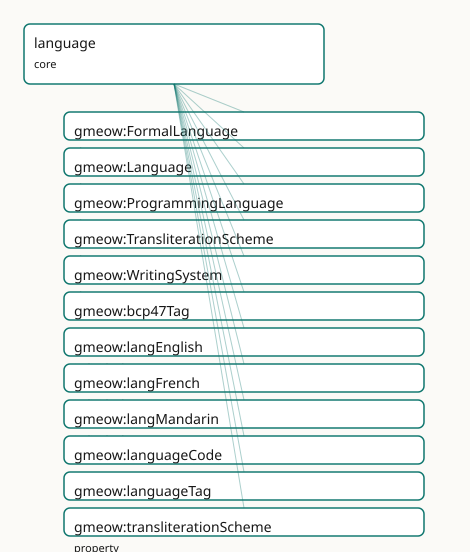

<!-- GENERATED by gmeow ontology-docs. DO NOT EDIT. -->

# GMEOW Language Core Module

- **IRI:** <https://blackcatinformatics.ca/gmeow/slices/language>
- **Tier:** core
- **[`Group`](../reference/classes/gmeow-Group.md):** core

## What This Slice Covers

This slice owns 13 terms and contributes 17 mapping or projection rows. Use it when its terms match the native fact you want to preserve; use the linkage tables to see how those facts leave GMEOW for consumer vocabularies.

## Dependencies

- [`gmeow:slices/kernel`](kernel.md)
- [`gmeow:slices/names`](names.md)

## Consumers

- Every language-tagged literal (private-use-language-tag); names' romanizations; software's languages (P16 slim core).

## Local Map



## Examples

### Multilingual Document

- **Source:** [`slices/core/language/examples/multilingual-document.ttl`](https://github.com/Blackcat-Informatics/gmeow-ontology/blob/main/slices/core/language/examples/multilingual-document.ttl)
- **GMEOW terms:** [`gmeow:InformationObject`](../reference/classes/gmeow-InformationObject.md), [`gmeow:Language`](../reference/classes/gmeow-Language.md), [`gmeow:bcp47Tag`](../reference/properties/gmeow-bcp47Tag.md), [`gmeow:langEnglish`](../reference/individuals/gmeow-langEnglish.md), [`gmeow:languageTag`](../reference/properties/gmeow-languageTag.md), [`gmeow:title`](../reference/properties/gmeow-title.md), [`gmeow:writtenInLanguage`](../reference/properties/gmeow-writtenInLanguage.md)

```turtle
# SPDX-FileCopyrightText: 2026 Blackcat Informatics® Inc. <paudley@blackcatinformatics.ca>
# SPDX-License-Identifier: CC-BY-4.0
#
# Worked example: language as a first-class entity. A gmeow:Language is a
# reified individual carrying its gmeow:bcp47Tag — not a bare string column — so a
# document can be gmeow:writtenInLanguage SEVERAL co-equal languages at once
# (a bilingual manual), with no primary language privileged. The Language objects
# are minted (there is no closed enum of languages); the document is an
# InformationObject, the domain of gmeow:writtenInLanguage.
@prefix gmeow: <https://blackcatinformatics.ca/gmeow/> .
@prefix ex:    <https://blackcatinformatics.ca/gmeow/examples/language/> .
@prefix rdfs:  <http://www.w3.org/2000/01/rdf-schema#> .

# --- Languages: first-class, BCP-47-tagged. English already exists as the core
#     seed gmeow:langEnglish — reused, not re-minted. Japanese has no seed, so it
#     is minted, declaring its internal private-use tag for @lang annotations.
ex:japanese a gmeow:Language ;
    rdfs:label        "Japanese"@en ;
    gmeow:bcp47Tag    "ja" ;
    gmeow:languageTag "ja" .

# --- A bilingual document: two co-equal languages, neither primary. The title is
#     carried as separate co-equal language-tagged literals, one per language.
ex:manual a gmeow:InformationObject ;
    gmeow:title             "Installation Manual"@en , "インストールマニュアル"@ja ;
    gmeow:writtenInLanguage gmeow:langEnglish , ex:japanese .
```

## Terms

### Classes

| Term | Label | Definition |
|---|---|---|
| [`gmeow:FormalLanguage`](../reference/classes/gmeow-FormalLanguage.md) | Formal Language | A grammar-defined language with a machine modality and no human native speakers — programming, markup, query, logic, schema, and configuration languages. A thi... |
| [`gmeow:Language`](../reference/classes/gmeow-Language.md) | Language | A language as a first-class information object with a self-minted IRI: a system of signs/symbols and rules used for communication or computation. Registry-INDE... |
| [`gmeow:ProgrammingLanguage`](../reference/classes/gmeow-ProgrammingLanguage.md) | Programming Language | A formal language for expressing executable computation (Python, Rust, SQL-as-implemented). The first-class target of [`gmeow:writtenInLanguage`](../reference/properties/gmeow-writtenInLanguage.md), by which a softw... |
| [`gmeow:TransliterationScheme`](../reference/classes/gmeow-TransliterationScheme.md) | Transliteration Scheme | A named transliteration/romanization/transcription system (Hepburn, Pinyin, ISO 233, IPA, …). A value carried by [`gmeow:transliterationScheme`](../reference/properties/gmeow-transliterationScheme.md); the major schemes... |
| [`gmeow:WritingSystem`](../reference/classes/gmeow-WritingSystem.md) | Writing System | A first-class system for visually or tactilely representing language — a script: Latin, Han (kanji), Hiragana, Katakana, Arabic, Braille, or a bespoke conlang/... |

### Properties

| Term | Label | Definition |
|---|---|---|
| [`gmeow:bcp47Tag`](../reference/properties/gmeow-bcp47Tag.md) | BCP-47 tag | An OPTIONAL external BCP-47 language tag used only when projecting GMEOW's internal private-use literals into vocabularies that require standard language-tag l... |
| [`gmeow:languageCode`](../reference/properties/gmeow-languageCode.md) | language code | An OPTIONAL registry code for a language (a BCP-47 tag "ja", an ISO 639-3 code "jpn", a Glottocode). A see-also alignment value, NEVER identity — a code-less c... |
| [`gmeow:languageTag`](../reference/properties/gmeow-languageTag.md) | language tag | The internal private-use BCP-47 language tag (e.g., 'ja') used for @lang annotations on string literals representing this language. |
| [`gmeow:transliterationScheme`](../reference/properties/gmeow-transliterationScheme.md) | transliteration scheme | The named transliteration/romanization system that produced an appellation's [`gmeow:romanization`](../reference/properties/gmeow-romanization.md) (Hepburn vs Kunrei for Japanese; Pinyin vs Wade-Giles for Manda... |
| [`gmeow:writtenInLanguage`](../reference/properties/gmeow-writtenInLanguage.md) | written in language | Relates an information object — an expression, a document, a source tree, an inscription reading — to a first-class [`gmeow:Language`](../reference/classes/gmeow-Language.md) it is written in. The regist... |

### Individuals

| Term | Label | Definition |
|---|---|---|
| [`gmeow:langEnglish`](../reference/individuals/gmeow-langEnglish.md) | English | The English language — the seed [`gmeow:Language`](../reference/classes/gmeow-Language.md) individual ([`gmeow:langEnglish`](../reference/individuals/gmeow-langEnglish.md)) anchoring the internal private-use tag en carried by the framework's... |
| [`gmeow:langFrench`](../reference/individuals/gmeow-langFrench.md) | French | The French language — the seed [`gmeow:Language`](../reference/classes/gmeow-Language.md) individual ([`gmeow:langFrench`](../reference/individuals/gmeow-langFrench.md)) anchoring the internal private-use tag fr. Registry codes are alignment... |
| [`gmeow:langMandarin`](../reference/individuals/gmeow-langMandarin.md) | Mandarin Chinese | Mandarin Chinese — the seed [`gmeow:Language`](../reference/classes/gmeow-Language.md) individual ([`gmeow:langMandarin`](../reference/individuals/gmeow-langMandarin.md)) anchoring the internal private-use tag zh. Registry codes are alignmen... |

## Linkages

- **Rows:** 17
- **Projection profiles:** `ontolex`, `schema-org`
- **External vocabularies:** `lime`, `ontolex`, `rdf`, `schema`, `wd`

| Source | Kind | Profile | Predicate/Relation | Target | Evidence |
|---|---|---|---|---|---|
| [`gmeow:FormalLanguage`](../reference/classes/gmeow-FormalLanguage.md) | equivalence | `-` | [skos:closeMatch](http://www.w3.org/2004/02/skos/core#closeMatch) | [wd:Q205892](https://www.wikidata.org/wiki/Q205892) | `gmeow-languages.sssom.tsv`; `gmeow:eqLanguages003`; confidence 0.7 |
| [`gmeow:Language`](../reference/classes/gmeow-Language.md) | equivalence | `-` | [skos:closeMatch](http://www.w3.org/2004/02/skos/core#closeMatch) | [schema:Language](https://schema.org/Language) | `gmeow-languages.sssom.tsv`; `gmeow:eqLanguages001`; confidence 0.9 |
| [`gmeow:Language`](../reference/classes/gmeow-Language.md) | equivalence | `-` | [skos:closeMatch](http://www.w3.org/2004/02/skos/core#closeMatch) | [wd:Q34770](https://www.wikidata.org/wiki/Q34770) | `gmeow-languages.sssom.tsv`; `gmeow:eqLanguages002`; confidence 0.9 |
| [`gmeow:ProgrammingLanguage`](../reference/classes/gmeow-ProgrammingLanguage.md) | equivalence | `-` | [skos:closeMatch](http://www.w3.org/2004/02/skos/core#closeMatch) | [schema:ComputerLanguage](https://schema.org/ComputerLanguage) | `gmeow-languages.sssom.tsv`; `gmeow:eqLanguages004`; confidence 0.8 |
| [`gmeow:ProgrammingLanguage`](../reference/classes/gmeow-ProgrammingLanguage.md) | equivalence | `-` | [skos:closeMatch](http://www.w3.org/2004/02/skos/core#closeMatch) | [wd:Q9143](https://www.wikidata.org/wiki/Q9143) | `gmeow-languages.sssom.tsv`; `gmeow:eqLanguages005`; confidence 0.85 |
| [`gmeow:WritingSystem`](../reference/classes/gmeow-WritingSystem.md) | equivalence | `-` | [skos:closeMatch](http://www.w3.org/2004/02/skos/core#closeMatch) | [wd:Q8192](https://www.wikidata.org/wiki/Q8192) | `gmeow-languages.sssom.tsv`; `gmeow:eqLanguages006`; confidence 0.85 |
| [`gmeow:WritingSystem`](../reference/classes/gmeow-WritingSystem.md) | equivalence | `-` | [skos:closeMatch](http://www.w3.org/2004/02/skos/core#closeMatch) | [wd:Q8192](https://www.wikidata.org/wiki/Q8192) | `gmeow-notation.sssom.tsv`; `gmeow:eqNotation004`; confidence 0.85 |
| [`gmeow:languageCode`](../reference/properties/gmeow-languageCode.md) | equivalence | `-` | [skos:closeMatch](http://www.w3.org/2004/02/skos/core#closeMatch) | [schema:iso6391Code](https://schema.org/iso6391Code) | `gmeow-languages.sssom.tsv`; `gmeow:eqLanguages011`; confidence 0.6 |
| [`gmeow:languageCode`](../reference/properties/gmeow-languageCode.md) | equivalence | `-` | [skos:relatedMatch](http://www.w3.org/2004/02/skos/core#relatedMatch) | [wd:P424](https://www.wikidata.org/wiki/Property:P424) | `gmeow-wikidata.sssom.tsv`; `gmeow:eqWikidata050`; confidence 0.8 |
| [`gmeow:FormalLanguage`](../reference/classes/gmeow-FormalLanguage.md) | projection | `schema-org` | projects to / <= | [schema:alternateName](https://schema.org/alternateName) | `gmeow:mapSchemaBcp47`; confidence 0.8; lossy: Glottocodes excluded; only 2-3 letter primary subtags; transform `gmeow:fnComposeBcp47` |
| [`gmeow:Language`](../reference/classes/gmeow-Language.md) | projection | `schema-org` | projects to / = | [schema:Language](https://schema.org/Language) | `gmeow:mapSchemaLanguage` |
| [`gmeow:Language`](../reference/classes/gmeow-Language.md) | projection | `schema-org` | projects to / <= | [schema:alternateName](https://schema.org/alternateName) | `gmeow:mapSchemaBcp47`; confidence 0.8; lossy: Glottocodes excluded; only 2-3 letter primary subtags; transform `gmeow:fnComposeBcp47` |
| [`gmeow:ProgrammingLanguage`](../reference/classes/gmeow-ProgrammingLanguage.md) | projection | `schema-org` | projects to / = | [schema:ComputerLanguage](https://schema.org/ComputerLanguage) | `gmeow:mapSchemaProgrammingLanguage` |
| [`gmeow:bcp47Tag`](../reference/properties/gmeow-bcp47Tag.md) | projection | `ontolex` | projects to / <= | [lime:language](http://www.w3.org/ns/lemon/lime#language), [ontolex:Form](http://www.w3.org/ns/lemon/ontolex#Form), [ontolex:LexicalEntry](http://www.w3.org/ns/lemon/ontolex#LexicalEntry), [ontolex:lexicalForm](http://www.w3.org/ns/lemon/ontolex#lexicalForm), [ontolex:writtenRep](http://www.w3.org/ns/lemon/ontolex#writtenRep), [rdf:type](http://www.w3.org/1999/02/22-rdf-syntax-ns#type) | `gmeow:mapOntolexName`; lossy: structured name parts, name usage contexts, register/audience |
| [`gmeow:bcp47Tag`](../reference/properties/gmeow-bcp47Tag.md) | projection | `ontolex` | projects to / <= | [lime:language](http://www.w3.org/ns/lemon/lime#language), [ontolex:LexicalEntry](http://www.w3.org/ns/lemon/ontolex#LexicalEntry), [rdf:type](http://www.w3.org/1999/02/22-rdf-syntax-ns#type) | `gmeow:mapOntolexLexicalItem`; lossy: hasLexicalForm links, form representations, etymology |
| [`gmeow:bcp47Tag`](../reference/properties/gmeow-bcp47Tag.md) | projection | `schema-org` | projects to / <= | [schema:inLanguage](https://schema.org/inLanguage) | `gmeow:mapSchemaInLanguage`; confidence 0.9; lossy: the first-class [`gmeow:Language`](../reference/classes/gmeow-Language.md) collapses to its BCP-47 / ISO 639-1 tag string; script and variety detail drop |
| [`gmeow:languageCode`](../reference/properties/gmeow-languageCode.md) | projection | `schema-org` | projects to / <= | [schema:alternateName](https://schema.org/alternateName) | `gmeow:mapSchemaBcp47`; confidence 0.8; lossy: Glottocodes excluded; only 2-3 letter primary subtags; transform `gmeow:fnComposeBcp47` |

## Guide

<!-- SPDX-FileCopyrightText: 2026 Blackcat Informatics® Inc. <paudley@blackcatinformatics.ca> -->
<!-- SPDX-License-Identifier: CC-BY-4.0 -->

# Language — first-class languages, registry-independent by design

> **Slice:** `https://blackcatinformatics.ca/gmeow/slices/language` · **tier: core**
> The slim language foundation every slice depends on: [`Language`](../reference/classes/gmeow-Language.md), [`WritingSystem`](../reference/classes/gmeow-WritingSystem.md),
> the `private-use-language-tag` tag machinery, and the seed languages the framework itself speaks.

The standard pattern — `inLanguage "ja"` — makes a registry code the *identity* of a
language. GMEOW inverts this: a language is a **first-class information object with a
self-minted IRI**, and every registry (BCP-47, ISO 639, Glottolog, Wikidata) is an
*optional alignment*, never identity ([Principle 5](https://github.com/Blackcat-Informatics/gmeow-ontology/blob/main/CONSTITUTION.md#principle-5): bridge by reference). The payoff is
anti-colonial in both directions ([Principle 9](https://github.com/Blackcat-Informatics/gmeow-ontology/blob/main/CONSTITUTION.md#principle-9)): a language is not less real for lacking a
committee-issued code — a conlang, an Indigenous language absent from a Western registry,
or an AI-generated language is exactly as first-class as English — and a richly-coded
language is not flattened to whichever single tag a schema happened to standardize.
[`Language`](../reference/classes/gmeow-Language.md) sits in **core** ([Principle 16](https://github.com/Blackcat-Informatics/gmeow-ontology/blob/main/CONSTITUTION.md#principle-16)) because every GMEOW literal depends on it: this is
the slim half of the slice-dependency doctrine dependency split, with the rich sociolinguistic machinery
(proficiency, varieties, diachronic states, conlang lineage) in the `languages` extension.

Internally, GMEOW's own literals carry **private-use tags** (`@en`, never
`@en`) so that the canonical graph never pretends a registry tag is ground truth; standard
BCP-47 is *reconstructed on projection* ([Principle 4](https://github.com/Blackcat-Informatics/gmeow-ontology/blob/main/CONSTITUTION.md#principle-4): one canonical source, lossy
projections generated outward).

## The classes

### [`gmeow:Language`](../reference/classes/gmeow-Language.md)

A system of signs and rules for communication or computation, under
[`gmeow:InformationObject`](../reference/classes/gmeow-InformationObject.md). Identity is the IRI; codes are data ([`languageCode`](../reference/properties/gmeow-languageCode.md)), registry
coreference is [`skos:exactMatch`](http://www.w3.org/2004/02/skos/core#exactMatch) + [`gmeow:authorityLink`](../reference/properties/gmeow-authorityLink.md). Its names are co-equal
[`gmeow:Appellation`](../reference/classes/gmeow-Appellation.md)s — endonym and exonym, never preferred-vs-alternate (the names
doctrine); the scripts it is written in bind co-equally via the extension's
[`WritingSystemUsage`](../reference/classes/gmeow-WritingSystemUsage.md).

### [`gmeow:WritingSystem`](../reference/classes/gmeow-WritingSystem.md)

A script as a first-class object — Latin, Han, Hiragana, Arabic, Braille, or a bespoke
conlang/AI script — with [`scriptCode`](../reference/properties/gmeow-scriptCode.md) (ISO 15924 *when one exists*), a type, and a text
direction. Declared here (one-defining-slice rule) so names and documents can reference
scripts; bound to languages co-equally and simultaneously through the extension — a
language with three concurrent scripts (Japanese) is the normal case, not an edge case.

## The tag machinery

### [`gmeow:languageTag`](../reference/properties/gmeow-languageTag.md)

The internal **private-use BCP-47 tag** (`"en"`) that anchors `@lang`
annotations on the framework's literals to a first-class [`Language`](../reference/classes/gmeow-Language.md) individual. Functional:
one internal tag per language — this is the join key between literal-space and IRI-space.

### [`gmeow:bcp47Tag`](../reference/properties/gmeow-bcp47Tag.md)

The optional **external** tag (`"en"`, [`xsd:language`](http://www.w3.org/2001/XMLSchema#language)) used only when projecting into
vocabularies that demand standard tags. Non-functional: one language legitimately exposes
several BCP-47 tags across script/region/variant contexts — another reason a single flat
tag was never going to be identity.

### [`gmeow:languageCode`](../reference/properties/gmeow-languageCode.md)

Any registry code — BCP-47 `"ja"`, ISO 639-3 `"jpn"`, a Glottocode — as a see-also
alignment value, **never identity**. Non-functional: a language carries codes in several
registries at once, and a code-less language carries none and loses nothing.

## The seed languages

### [`gmeow:langEnglish`](../reference/individuals/gmeow-langEnglish.md) · [`gmeow:langMandarin`](../reference/individuals/gmeow-langMandarin.md) · [`gmeow:langFrench`](../reference/individuals/gmeow-langFrench.md)

The languages the framework itself speaks — the individuals anchoring `en`,
`zh`, and `fr` on GMEOW's own labels and definitions. They are
ordinary data, not schema: any slice or dataset mints further languages the same way (the
exhaustive reference catalog is the design).

```turtle
ex:langKlingon a gmeow:Language ;            # code-less, fully first-class
    rdfs:label "tlhIngan Hol"@und ;
    gmeow:languageTag "und" ;
    gmeow:languageCode "tlh" .               # alignment, not identity
```

## Formal languages and transliteration

### [`gmeow:FormalLanguage`](../reference/classes/gmeow-FormalLanguage.md) · [`gmeow:ProgrammingLanguage`](../reference/classes/gmeow-ProgrammingLanguage.md)

Grammar-defined languages with machine modality and no native speakers — programming,
markup, query, logic, schema languages. A thin structural split (the sociolinguistic facets
simply don't apply), with [`ProgrammingLanguage`](../reference/classes/gmeow-ProgrammingLanguage.md) as the first-class target of
[`writtenInLanguage`](../reference/properties/gmeow-writtenInLanguage.md) for the software slice's source trees.

### [`gmeow:transliterationScheme`](../reference/properties/gmeow-transliterationScheme.md) · [`gmeow:TransliterationScheme`](../reference/classes/gmeow-TransliterationScheme.md)

*How* a romanization was derived — Hepburn vs Kunrei, Pinyin vs Wade-Giles — attached to a
[`gmeow:Appellation`](../reference/classes/gmeow-Appellation.md) beside its [`gmeow:romanization`](../reference/properties/gmeow-romanization.md). This is the bridge into the names
slice's doctrine that a romanization relates a name only to a transliteration of *itself*;
recording the scheme makes the derivation reproducible. The major schemes are catalogued as
FnO functions in the projection layer (`projections/transforms.fno.ttl`).

### [`gmeow:writtenInLanguage`](../reference/properties/gmeow-writtenInLanguage.md)

The generic written-in relation (FRBR's language-of-expression, domain-wide): any
[`InformationObject`](../reference/classes/gmeow-InformationObject.md) — a document, an expression, a source tree, an inscription reading — is
written in a first-class [`Language`](../reference/classes/gmeow-Language.md) IRI, never a code literal. Non-functional: content
mixes languages, and a codebase uses several. The registry-independent replacement for the
`inLanguage "ja"` anti-pattern GMEOW's own doctrine names.

## Solver and projection notes

[`Tag`](../reference/classes/gmeow-Tag.md) work is computation, not assertion ([Principle 12](https://github.com/Blackcat-Informatics/gmeow-ontology/blob/main/CONSTITUTION.md#principle-12)): reconstructing a standard BCP-47 tag
from [`bcp47Tag`](../reference/properties/gmeow-bcp47Tag.md) (+ script/region context), executing a transliteration scheme, and matching
a name's language to an audience locale all happen in the solver/projection layer — the
canonical graph stores the first-class objects and their alignments, nothing derived.
Projections to schema.org ([`schema:inLanguage`](https://schema.org/inLanguage)), Dublin Core ([`dcterms:language`](http://purl.org/dc/terms/language)), and
Wikidata are downcasts; the private-use-tag discipline is canonical and internal.

## Dependencies

Depends on `kernel` and `names` ([`Appellation`](../reference/classes/gmeow-Appellation.md), romanization). Depended on by effectively
everything: every `private-use-language-tag` literal in every slice resolves here, names' romanizations
cite its schemes, and software's [`writtenInLanguage`](../reference/properties/gmeow-writtenInLanguage.md) targets its classes (P16 slim core).
