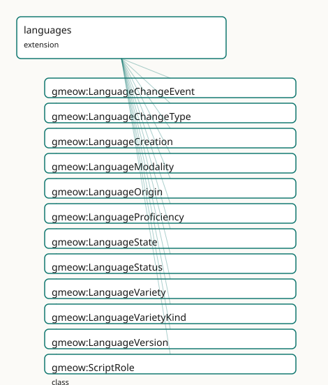

<!-- GENERATED by gmeow ontology-docs. DO NOT EDIT. -->

# GMEOW Languages Module

- **IRI:** <https://blackcatinformatics.ca/gmeow/slices/languages>
- **Tier:** extension
- **[`Group`](../reference/classes/gmeow-Group.md):** extensions

## What This Slice Covers

This slice owns 171 terms and contributes 16 mapping or projection rows. Use it when its terms match the native fact you want to preserve; use the linkage tables to see how those facts leave GMEOW for consumer vocabularies.

## Dependencies

- [`gmeow:slices/expertise`](expertise.md)
- [`gmeow:slices/kernel`](kernel.md)
- [`gmeow:slices/language`](language.md)
- [`gmeow:slices/observations`](observations.md)
- [`gmeow:slices/provenance`](provenance.md)
- [`gmeow:slices/temporal`](temporal.md)

## Consumers

- Rich sociolinguistics (proficiency, scripts, varieties, diachrony) extending the core language slim slice.

## Local Map



## Terms

### Classes

| Term | Label | Definition |
|---|---|---|
| [`gmeow:LanguageChangeEvent`](../reference/classes/gmeow-LanguageChangeEvent.md) | Language Change Event | A historical linguistic change — sound shifts, semantic drift, borrowing, spelling reform, grammatical change, lexical innovation, standardization, language co... |
| [`gmeow:LanguageChangeType`](../reference/classes/gmeow-LanguageChangeType.md) | Language Change Type | The kind of historical linguistic change — a value, never an Entity subclass. Open-ended: new analytical frameworks may introduce further change types without... |
| [`gmeow:LanguageCreation`](../reference/classes/gmeow-LanguageCreation.md) | Language Creation | The activity of creating or generating a language — a conlanger's design work or an AI model's generation run. Linked to its product by [`gmeow:wasGeneratedBy`](../reference/properties/gmeow-wasGeneratedBy.md) (t... |
| [`gmeow:LanguageModality`](../reference/classes/gmeow-LanguageModality.md) | Language Modality | The sensory/transmission channel of a language (spoken, signed, written, whistled, tactile, machine, multimodal). A value carried by [`gmeow:languageModality`](../reference/properties/gmeow-languageModality.md). |
| [`gmeow:LanguageOrigin`](../reference/classes/gmeow-LanguageOrigin.md) | Language Origin | How a language came to be (natural, constructed, AI-generated, formal, pidgin, creole, reconstructed, …). A value, not a Language subclass: origins are open-en... |
| [`gmeow:LanguageProficiency`](../reference/classes/gmeow-LanguageProficiency.md) | Language Proficiency | A reified, leveled proficiency of an agent in a language, in a particular skill modality — the [gufo:Relator](../external/terms.md#gufo-relator) binding {agent} × {language} × {skill modality} × {... |
| [`gmeow:LanguageState`](../reference/classes/gmeow-LanguageState.md) | Language State | A reified, standpoint-scoped claim about the status of a language, variety, or version during a specific interval — the analytic/historical slice of a language... |
| [`gmeow:LanguageStatus`](../reference/classes/gmeow-LanguageStatus.md) | Language Status | The vitality status of a language (living, historical, extinct, dormant, revived, emerging, proposed, constructed-active). A value carried by gmeow:languageSta... |
| [`gmeow:LanguageVariety`](../reference/classes/gmeow-LanguageVariety.md) | Language Variety | A speech variety that carries names, scripts, tags, status, provenance, and alignment metadata exactly as a [`gmeow:Language`](../reference/classes/gmeow-Language.md) does, because it IS a language (a Su... |
| [`gmeow:LanguageVarietyKind`](../reference/classes/gmeow-LanguageVarietyKind.md) | Language Variety Kind | The sociolinguistic classification of a language variety — a value, never an Entity subclass. Standpoint-scoped: 'dialect' according to one authority may be 'l... |
| [`gmeow:LanguageVersion`](../reference/classes/gmeow-LanguageVersion.md) | Language Version | A concrete, dated revision of a language that is itself a fully usable language (Ithkuil 1993 / 2011 / New Ithkuil; an AI language v1 / v2). Subclass of gmeow:... |
| [`gmeow:ScriptRole`](../reference/classes/gmeow-ScriptRole.md) | Script Role | The role a writing system plays within a language's mixed orthography (primary, logographic content, syllabic grammar, loanword, transliteration, liturgical, h... |
| [`gmeow:TextDirection`](../reference/classes/gmeow-TextDirection.md) | Text Direction | The writing direction of a writing system (ltr, rtl, vertical, boustrophedon, non-linear, contextual). A value carried by [`gmeow:textDirection`](../reference/properties/gmeow-textDirection.md). |
| [`gmeow:WritingSystemType`](../reference/classes/gmeow-WritingSystemType.md) | Writing System Type | The structural kind of a writing system (alphabet, abjad, abugida, syllabary, logographic, featural, ideographic, pictographic, non-linear, mixed). A value car... |
| [`gmeow:WritingSystemUsage`](../reference/classes/gmeow-WritingSystemUsage.md) | Writing System Usage | A reified, role- and period-scoped use of a writing system by a language — the [gufo:Relator](../external/terms.md#gufo-relator) binding {language} × {writing system} × {role} × {period}, mirrorin... |

### Properties

| Term | Label | Definition |
|---|---|---|
| [`gmeow:affectedLanguage`](../reference/properties/gmeow-affectedLanguage.md) | affected language | The language(s) or variety(ies) affected by this change event. NON-FUNCTIONAL: language contact and merger events affect multiple languages. |
| [`gmeow:changeType`](../reference/properties/gmeow-changeType.md) | change type | The kind(s) of linguistic change occurring — sound shift, borrowing, standardization, extinction, etc. NON-FUNCTIONAL: a single event may instantiate multiple... |
| [`gmeow:designGoal`](../reference/properties/gmeow-designGoal.md) | design goal | The stated design goal/purpose of an engineered or constructed language (Lojban's syntactic unambiguity, Ithkuil's cognitive precision, an IAL's ease of learni... |
| [`gmeow:knowsLanguage`](../reference/properties/gmeow-knowsLanguage.md) | knows language | Relates an agent to a language it knows. Non-functional. The leveled, per-skill detail is carried by the reified [`gmeow:LanguageProficiency`](../reference/classes/gmeow-LanguageProficiency.md). |
| [`gmeow:languageModality`](../reference/properties/gmeow-languageModality.md) | language modality | The sensory/transmission modality/modalities of a language ([`gmeow:LanguageModality`](../reference/classes/gmeow-LanguageModality.md) individuals). Non-functional — many languages are multimodal (spoken and wri... |
| [`gmeow:languageOrigin`](../reference/properties/gmeow-languageOrigin.md) | language origin | The origin kind(s) of a language ([`gmeow:LanguageOrigin`](../reference/classes/gmeow-LanguageOrigin.md) individuals). Non-functional — a contact language may be both creole and mixed. |
| [`gmeow:languageStatus`](../reference/properties/gmeow-languageStatus.md) | language status | The vitality status of a language (a [`gmeow:LanguageStatus`](../reference/classes/gmeow-LanguageStatus.md) value). Non-functional: source classifications coexist; period carried with gmeow:validFrom/validUnti... |
| [`gmeow:levelScale`](../reference/properties/gmeow-levelScale.md) | level scale | The scale a proficiency-level individual belongs to (e.g. cefrB2 levelScale scaleCEFR). Functional. |
| [`gmeow:nativeLanguage`](../reference/properties/gmeow-nativeLanguage.md) | native language | Relates an agent to a native (mother-tongue / first) language — a specialization of [`gmeow:knowsLanguage`](../reference/properties/gmeow-knowsLanguage.md). Non-functional: a person may have several native langu... |
| [`gmeow:proficiencyAgent`](../reference/properties/gmeow-proficiencyAgent.md) | proficiency agent | The agent whose proficiency a language-proficiency expresses. Functional — constitutive of the proficiency. |
| [`gmeow:proficiencyInterval`](../reference/properties/gmeow-proficiencyInterval.md) | proficiency interval | The interval over which a language-proficiency held (proficiency changes over a life). Lighter cases use gmeow:validFrom/validUntil on the statement. |
| [`gmeow:proficiencyLanguage`](../reference/properties/gmeow-proficiencyLanguage.md) | proficiency language | The language a language-proficiency concerns. Functional — constitutive. |
| [`gmeow:proficiencyLevel`](../reference/properties/gmeow-proficiencyLevel.md) | proficiency level | The attained level of a language-proficiency (a [`gmeow:ProficiencyLevel`](../reference/classes/gmeow-ProficiencyLevel.md) value, e.g. cefrB2, levelNative). Functional. |
| [`gmeow:proficiencyModality`](../reference/properties/gmeow-proficiencyModality.md) | proficiency modality | The skill modality a language-proficiency rates (speaking, listening, reading, writing, signing, comprehension, overall) — a [`gmeow:ProficiencyModality`](../reference/classes/gmeow-ProficiencyModality.md) value. F... |
| [`gmeow:proficiencyScale`](../reference/properties/gmeow-proficiencyScale.md) | proficiency scale | The framework/scale a proficiency level is measured on (CEFR, ILR, ACTFL, self-reported) — a [`gmeow:ProficiencyScale`](../reference/classes/gmeow-ProficiencyScale.md) value. Functional. |
| [`gmeow:scriptCode`](../reference/properties/gmeow-scriptCode.md) | script code | The ISO 15924 script code of a writing system ("Latn", "Hani", "Hira", "Kana", "Arab", "Brai") when one exists, else a bespoke identifier for a conlang/AI scri... |
| [`gmeow:scriptRole`](../reference/properties/gmeow-scriptRole.md) | script role | The functional role a writing system plays for a language in a usage (a [`gmeow:ScriptRole`](../reference/classes/gmeow-ScriptRole.md) value). Functional: one role per usage — a script playing two roles is... |
| [`gmeow:scriptUsageInterval`](../reference/properties/gmeow-scriptUsageInterval.md) | script usage interval | The interval over which a writing-system-usage held — e.g. Turkish-in-Arabic-script until 1928. A relator carries its period this way (matching names' NameUsag... |
| [`gmeow:stateAuthority`](../reference/properties/gmeow-stateAuthority.md) | state authority | The agent or standpoint asserting this language state — a linguist, an institution, a historical reconstruction project. NON-FUNCTIONAL: competing authority cl... |
| [`gmeow:stateInterval`](../reference/properties/gmeow-stateInterval.md) | state interval | The time interval over which this language state is asserted to hold — e.g. Old English 450–1150 CE. A relator carries its period this way (matching VersionMem... |
| [`gmeow:stateLanguage`](../reference/properties/gmeow-stateLanguage.md) | state language | The language, variety, or version whose state is being described. Functional per relator: one subject language per LanguageState. |
| [`gmeow:stateStatusValue`](../reference/properties/gmeow-stateStatusValue.md) | state status value | The vitality status(es) asserted for the language during this state. NON-FUNCTIONAL: different authorities may assign different statuses for the same interval,... |
| [`gmeow:textDirection`](../reference/properties/gmeow-textDirection.md) | text direction | The writing direction(s) of a writing system ([`gmeow:TextDirection`](../reference/classes/gmeow-TextDirection.md) values). Non-functional — Japanese is both vertical-rtl and ltr. |
| [`gmeow:usageLanguage`](../reference/properties/gmeow-usageLanguage.md) | usage language | The language that uses the writing system in a writing-system-usage. Functional — constitutive of the usage (a usage binds exactly one language). |
| [`gmeow:usageWritingSystem`](../reference/properties/gmeow-usageWritingSystem.md) | usage writing system | The writing system used by the language in a writing-system-usage. Functional — constitutive of the usage. |
| [`gmeow:usesWritingSystem`](../reference/properties/gmeow-usesWritingSystem.md) | uses writing system | Relates a language to a writing system it is written in — the direct relation. Non-functional and CO-EQUAL: Japanese uses Han, Hiragana, Katakana and Latin sim... |
| [`gmeow:varietyKind`](../reference/properties/gmeow-varietyKind.md) | variety kind | The sociolinguistic classification(s) of a language variety — dialect, sociolect, register, idiolect, slang, standard, etc. NON-FUNCTIONAL: a single variety ma... |
| [`gmeow:varietyOf`](../reference/properties/gmeow-varietyOf.md) | variety of | The parent language, lineage, or macrolanguage that a variety is considered a variety of. NON-FUNCTIONAL: standpoint-dependent — one standpoint may link Scots... |
| [`gmeow:versionLabel`](../reference/properties/gmeow-versionLabel.md) | version label | The version designation of an entity as a literal ("1993", "2011", "v2.1.0-beta", "3rd Edition"). Domain is [`gmeow:Entity`](../reference/classes/gmeow-Entity.md) so any versioned artifact — a language... |
| [`gmeow:writingSystemType`](../reference/properties/gmeow-writingSystemType.md) | writing system type | The structural kind(s) of a writing system ([`gmeow:WritingSystemType`](../reference/classes/gmeow-WritingSystemType.md) values). Non-functional — a script may be classified plurally. |

### Individuals

| Term | Label | Definition |
|---|---|---|
| [`gmeow:assessedBeginner`](../reference/individuals/gmeow-assessedBeginner.md) | assessed beginner | The assessed beginner proficiency level — a milestone on a scale that describes how well an agent commands a language or skill. |
| [`gmeow:assessedCompetent`](../reference/individuals/gmeow-assessedCompetent.md) | assessed competent | The assessed competent proficiency level — a milestone on a scale that describes how well an agent commands a language or skill. |
| [`gmeow:assessedExpert`](../reference/individuals/gmeow-assessedExpert.md) | assessed expert | The assessed expert proficiency level — a milestone on a scale that describes how well an agent commands a language or skill. |
| [`gmeow:cefrA1`](../reference/individuals/gmeow-cefrA1.md) | CEFR A1 | The a 1 proficiency level — a milestone on a scale that describes how well an agent commands a language or skill. |
| [`gmeow:cefrA2`](../reference/individuals/gmeow-cefrA2.md) | CEFR A2 | The a 2 proficiency level — a milestone on a scale that describes how well an agent commands a language or skill. |
| [`gmeow:cefrB1`](../reference/individuals/gmeow-cefrB1.md) | CEFR B1 | The b 1 proficiency level — a milestone on a scale that describes how well an agent commands a language or skill. |
| [`gmeow:cefrB2`](../reference/individuals/gmeow-cefrB2.md) | CEFR B2 | The b 2 proficiency level — a milestone on a scale that describes how well an agent commands a language or skill. |
| [`gmeow:cefrC1`](../reference/individuals/gmeow-cefrC1.md) | CEFR C1 | The c 1 proficiency level — a milestone on a scale that describes how well an agent commands a language or skill. |
| [`gmeow:cefrC2`](../reference/individuals/gmeow-cefrC2.md) | CEFR C2 | The c 2 proficiency level — a milestone on a scale that describes how well an agent commands a language or skill. |
| [`gmeow:changeBorrowing`](../reference/individuals/gmeow-changeBorrowing.md) | borrowing | The borrowing language change type — a kind of diachronic process that alters a language's form, lexicon, or social standing. |
| [`gmeow:changeExtinction`](../reference/individuals/gmeow-changeExtinction.md) | extinction | The extinction language change type — a kind of diachronic process that alters a language's form, lexicon, or social standing. |
| [`gmeow:changeGrammaticalChange`](../reference/individuals/gmeow-changeGrammaticalChange.md) | grammatical change | The grammatical change language change type — a kind of diachronic process that alters a language's form, lexicon, or social standing. |
| [`gmeow:changeLanguageContact`](../reference/individuals/gmeow-changeLanguageContact.md) | language contact | The language contact language change type — a kind of diachronic process that alters a language's form, lexicon, or social standing. |
| [`gmeow:changeLexicalInnovation`](../reference/individuals/gmeow-changeLexicalInnovation.md) | lexical innovation | The lexical innovation language change type — a kind of diachronic process that alters a language's form, lexicon, or social standing. |
| [`gmeow:changeMerger`](../reference/individuals/gmeow-changeMerger.md) | merger | The merger language change type — a kind of diachronic process that alters a language's form, lexicon, or social standing. |
| [`gmeow:changeRevitalization`](../reference/individuals/gmeow-changeRevitalization.md) | revitalization | The revitalization language change type — a kind of diachronic process that alters a language's form, lexicon, or social standing. |
| [`gmeow:changeRevival`](../reference/individuals/gmeow-changeRevival.md) | revival | The revival language change type — a kind of diachronic process that alters a language's form, lexicon, or social standing. |
| [`gmeow:changeSemanticDrift`](../reference/individuals/gmeow-changeSemanticDrift.md) | semantic drift | The semantic drift language change type — a kind of diachronic process that alters a language's form, lexicon, or social standing. |
| [`gmeow:changeSoundShift`](../reference/individuals/gmeow-changeSoundShift.md) | sound shift | The sound shift language change type — a kind of diachronic process that alters a language's form, lexicon, or social standing. |
| [`gmeow:changeSpellingReform`](../reference/individuals/gmeow-changeSpellingReform.md) | spelling reform | The spelling reform language change type — a kind of diachronic process that alters a language's form, lexicon, or social standing. |
| [`gmeow:changeSplit`](../reference/individuals/gmeow-changeSplit.md) | split | The split language change type — a kind of diachronic process that alters a language's form, lexicon, or social standing. |
| [`gmeow:changeStandardization`](../reference/individuals/gmeow-changeStandardization.md) | standardization | The standardization language change type — a kind of diachronic process that alters a language's form, lexicon, or social standing. |
| [`gmeow:directionBoustrophedon`](../reference/individuals/gmeow-directionBoustrophedon.md) | boustrophedon | The boustrophedon text direction — a convention for ordering glyphs when rendering a writing system. |
| [`gmeow:directionContextual`](../reference/individuals/gmeow-directionContextual.md) | contextual / bidirectional | The contextual text direction — a convention for ordering glyphs when rendering a writing system. |
| [`gmeow:directionLtr`](../reference/individuals/gmeow-directionLtr.md) | left-to-right | The ltr text direction — a convention for ordering glyphs when rendering a writing system. |
| [`gmeow:directionNonLinear`](../reference/individuals/gmeow-directionNonLinear.md) | non-linear | The non linear text direction — a convention for ordering glyphs when rendering a writing system. |
| [`gmeow:directionRtl`](../reference/individuals/gmeow-directionRtl.md) | right-to-left | The rtl text direction — a convention for ordering glyphs when rendering a writing system. |
| [`gmeow:directionVerticalLtr`](../reference/individuals/gmeow-directionVerticalLtr.md) | vertical, columns left-to-right | The vertical ltr text direction — a convention for ordering glyphs when rendering a writing system. |
| [`gmeow:directionVerticalRtl`](../reference/individuals/gmeow-directionVerticalRtl.md) | vertical, columns right-to-left | The vertical rtl text direction — a convention for ordering glyphs when rendering a writing system. |
| [`gmeow:dreyfusAdvancedBeginner`](../reference/individuals/gmeow-dreyfusAdvancedBeginner.md) | Dreyfus advanced beginner | The advanced beginner proficiency level — a milestone on a scale that describes how well an agent commands a language or skill. |
| [`gmeow:dreyfusCompetent`](../reference/individuals/gmeow-dreyfusCompetent.md) | Dreyfus competent | The competent proficiency level — a milestone on a scale that describes how well an agent commands a language or skill. |
| [`gmeow:dreyfusExpert`](../reference/individuals/gmeow-dreyfusExpert.md) | Dreyfus expert | The expert proficiency level — a milestone on a scale that describes how well an agent commands a language or skill. |
| [`gmeow:dreyfusNovice`](../reference/individuals/gmeow-dreyfusNovice.md) | Dreyfus novice | The novice proficiency level — a milestone on a scale that describes how well an agent commands a language or skill. |
| [`gmeow:dreyfusProficient`](../reference/individuals/gmeow-dreyfusProficient.md) | Dreyfus proficient | The proficient proficiency level — a milestone on a scale that describes how well an agent commands a language or skill. |
| [`gmeow:kindCreole`](../reference/individuals/gmeow-kindCreole.md) | creole | The creole language variety kind — a sociolinguistic category that describes the relationship of a variety to its speech community. |
| [`gmeow:kindDialect`](../reference/individuals/gmeow-kindDialect.md) | dialect | The dialect language variety kind — a sociolinguistic category that describes the relationship of a variety to its speech community. |
| [`gmeow:kindIdiolect`](../reference/individuals/gmeow-kindIdiolect.md) | idiolect | The idiolect language variety kind — a sociolinguistic category that describes the relationship of a variety to its speech community. |
| [`gmeow:kindJargon`](../reference/individuals/gmeow-kindJargon.md) | jargon | The jargon language variety kind — a sociolinguistic category that describes the relationship of a variety to its speech community. |
| [`gmeow:kindKoine`](../reference/individuals/gmeow-kindKoine.md) | koine | The koine language variety kind — a sociolinguistic category that describes the relationship of a variety to its speech community. |
| [`gmeow:kindLanguage`](../reference/individuals/gmeow-kindLanguage.md) | language (standpointed classification) | The language language variety kind — a sociolinguistic category that describes the relationship of a variety to its speech community. |
| [`gmeow:kindLinguaFranca`](../reference/individuals/gmeow-kindLinguaFranca.md) | lingua franca | The lingua franca language variety kind — a sociolinguistic category that describes the relationship of a variety to its speech community. |
| [`gmeow:kindLocalizedVariant`](../reference/individuals/gmeow-kindLocalizedVariant.md) | localized variant | The localized variant language variety kind — a sociolinguistic category that describes the relationship of a variety to its speech community. |
| [`gmeow:kindPidgin`](../reference/individuals/gmeow-kindPidgin.md) | pidgin | The pidgin language variety kind — a sociolinguistic category that describes the relationship of a variety to its speech community. |
| [`gmeow:kindRegister`](../reference/individuals/gmeow-kindRegister.md) | register | The register language variety kind — a sociolinguistic category that describes the relationship of a variety to its speech community. |
| [`gmeow:kindSlang`](../reference/individuals/gmeow-kindSlang.md) | slang | The slang language variety kind — a sociolinguistic category that describes the relationship of a variety to its speech community. |
| [`gmeow:kindSociolect`](../reference/individuals/gmeow-kindSociolect.md) | sociolect | The sociolect language variety kind — a sociolinguistic category that describes the relationship of a variety to its speech community. |
| [`gmeow:kindStandard`](../reference/individuals/gmeow-kindStandard.md) | standard | The standard language variety kind — a sociolinguistic category that describes the relationship of a variety to its speech community. |
| [`gmeow:levelHeritage`](../reference/individuals/gmeow-levelHeritage.md) | heritage | The heritage proficiency level — a milestone on a scale that describes how well an agent commands a language or skill. |
| [`gmeow:levelNative`](../reference/individuals/gmeow-levelNative.md) | native | The native proficiency level — a milestone on a scale that describes how well an agent commands a language or skill. |
| [`gmeow:modalityMachine`](../reference/individuals/gmeow-modalityMachine.md) | machine / programmatic | The machine language modality — a channel or medium through which a language is produced or perceived. |
| [`gmeow:modalityMultimodal`](../reference/individuals/gmeow-modalityMultimodal.md) | multimodal | The multimodal language modality — a channel or medium through which a language is produced or perceived. |
| [`gmeow:modalitySigned`](../reference/individuals/gmeow-modalitySigned.md) | signed | The signed language modality — a channel or medium through which a language is produced or perceived. |
| [`gmeow:modalitySpoken`](../reference/individuals/gmeow-modalitySpoken.md) | spoken | The spoken language modality — a channel or medium through which a language is produced or perceived. |
| [`gmeow:modalityTactile`](../reference/individuals/gmeow-modalityTactile.md) | tactile (e.g. Braille, Protactile) | The tactile language modality — a channel or medium through which a language is produced or perceived. |
| [`gmeow:modalityWhistled`](../reference/individuals/gmeow-modalityWhistled.md) | whistled | The whistled language modality — a channel or medium through which a language is produced or perceived. |
| [`gmeow:modalityWritten`](../reference/individuals/gmeow-modalityWritten.md) | written | The written language modality — a channel or medium through which a language is produced or perceived. |
| [`gmeow:nihAdvanced`](../reference/individuals/gmeow-nihAdvanced.md) | NIH advanced | The advanced proficiency level — a milestone on a scale that describes how well an agent commands a language or skill. |
| [`gmeow:nihBeginner`](../reference/individuals/gmeow-nihBeginner.md) | NIH beginner | The beginner proficiency level — a milestone on a scale that describes how well an agent commands a language or skill. |
| [`gmeow:nihExpert`](../reference/individuals/gmeow-nihExpert.md) | NIH expert | The expert proficiency level — a milestone on a scale that describes how well an agent commands a language or skill. |
| [`gmeow:nihIntermediate`](../reference/individuals/gmeow-nihIntermediate.md) | NIH intermediate | The intermediate proficiency level — a milestone on a scale that describes how well an agent commands a language or skill. |
| [`gmeow:originAiGenerated`](../reference/individuals/gmeow-originAiGenerated.md) | AI / machine-generated | The ai generated language origin — a provenance category that explains how a language or variety arose. |
| [`gmeow:originConstructedArtistic`](../reference/individuals/gmeow-originConstructedArtistic.md) | constructed — artistic (e.g. Quenya, Klingon) | The constructed artistic language origin — a provenance category that explains how a language or variety arose. |
| [`gmeow:originConstructedAuxiliary`](../reference/individuals/gmeow-originConstructedAuxiliary.md) | constructed — auxiliary (IAL, e.g. Esperanto) | The constructed auxiliary language origin — a provenance category that explains how a language or variety arose. |
| [`gmeow:originConstructedEngineered`](../reference/individuals/gmeow-originConstructedEngineered.md) | constructed — engineered (e.g. Lojban, Ithkuil) | The constructed engineered language origin — a provenance category that explains how a language or variety arose. |
| [`gmeow:originConstructedRitual`](../reference/individuals/gmeow-originConstructedRitual.md) | constructed — ritual / liturgical | The constructed ritual language origin — a provenance category that explains how a language or variety arose. |
| [`gmeow:originCreole`](../reference/individuals/gmeow-originCreole.md) | creole | The creole language origin — a provenance category that explains how a language or variety arose. |
| [`gmeow:originFormal`](../reference/individuals/gmeow-originFormal.md) | formal (logic / schema) | The formal language origin — a provenance category that explains how a language or variety arose. |
| [`gmeow:originMarkup`](../reference/individuals/gmeow-originMarkup.md) | markup | The markup language origin — a provenance category that explains how a language or variety arose. |
| [`gmeow:originMixed`](../reference/individuals/gmeow-originMixed.md) | mixed / contact language | The mixed language origin — a provenance category that explains how a language or variety arose. |
| [`gmeow:originNatural`](../reference/individuals/gmeow-originNatural.md) | natural | The natural language origin — a provenance category that explains how a language or variety arose. |
| [`gmeow:originPidgin`](../reference/individuals/gmeow-originPidgin.md) | pidgin | The pidgin language origin — a provenance category that explains how a language or variety arose. |
| [`gmeow:originProgramming`](../reference/individuals/gmeow-originProgramming.md) | programming | The programming language origin — a provenance category that explains how a language or variety arose. |
| [`gmeow:originQuery`](../reference/individuals/gmeow-originQuery.md) | query | The query language origin — a provenance category that explains how a language or variety arose. |
| [`gmeow:originReconstructed`](../reference/individuals/gmeow-originReconstructed.md) | reconstructed (proto-language) | The reconstructed language origin — a provenance category that explains how a language or variety arose. |
| [`gmeow:profModalityComprehension`](../reference/individuals/gmeow-profModalityComprehension.md) | comprehension | The comprehension proficiency modality — a specific skill channel (receptive, productive, signing, etc.) on which proficiency is assessed. |
| [`gmeow:profModalityListening`](../reference/individuals/gmeow-profModalityListening.md) | listening | The listening proficiency modality — a specific skill channel (receptive, productive, signing, etc.) on which proficiency is assessed. |
| [`gmeow:profModalityOverall`](../reference/individuals/gmeow-profModalityOverall.md) | overall | The overall proficiency modality — a specific skill channel (receptive, productive, signing, etc.) on which proficiency is assessed. |
| [`gmeow:profModalityReading`](../reference/individuals/gmeow-profModalityReading.md) | reading | The reading proficiency modality — a specific skill channel (receptive, productive, signing, etc.) on which proficiency is assessed. |
| [`gmeow:profModalitySigning`](../reference/individuals/gmeow-profModalitySigning.md) | signing | The signing proficiency modality — a specific skill channel (receptive, productive, signing, etc.) on which proficiency is assessed. |
| [`gmeow:profModalitySpeaking`](../reference/individuals/gmeow-profModalitySpeaking.md) | speaking | The speaking proficiency modality — a specific skill channel (receptive, productive, signing, etc.) on which proficiency is assessed. |
| [`gmeow:profModalityWriting`](../reference/individuals/gmeow-profModalityWriting.md) | writing | The writing proficiency modality — a specific skill channel (receptive, productive, signing, etc.) on which proficiency is assessed. |
| [`gmeow:scaleACTFL`](../reference/individuals/gmeow-scaleACTFL.md) | ACTFL | The actfl proficiency scale — a named framework that defines ordered levels of language or skill competence. |
| [`gmeow:scaleAssessed`](../reference/individuals/gmeow-scaleAssessed.md) | assessed | The assessed proficiency scale — a named framework that defines ordered levels of language or skill competence. |
| [`gmeow:scaleCEFR`](../reference/individuals/gmeow-scaleCEFR.md) | CEFR | The cefr proficiency scale — a named framework that defines ordered levels of language or skill competence. |
| [`gmeow:scaleDreyfus`](../reference/individuals/gmeow-scaleDreyfus.md) | Dreyfus | The dreyfus proficiency scale — a named framework that defines ordered levels of language or skill competence. |
| [`gmeow:scaleILR`](../reference/individuals/gmeow-scaleILR.md) | ILR | The ilr proficiency scale — a named framework that defines ordered levels of language or skill competence. |
| [`gmeow:scaleNIH`](../reference/individuals/gmeow-scaleNIH.md) | NIH | The nih proficiency scale — a named framework that defines ordered levels of language or skill competence. |
| [`gmeow:scaleSelfReported`](../reference/individuals/gmeow-scaleSelfReported.md) | self-reported | The self reported proficiency scale — a named framework that defines ordered levels of language or skill competence. |
| [`gmeow:schemeBGNPCGN`](../reference/individuals/gmeow-schemeBGNPCGN.md) | BGN/PCGN romanization | The bgn/pcgn transliteration scheme — a rule set for converting text from one writing system into another while preserving phonemic or orthographic structure. |
| [`gmeow:schemeHepburn`](../reference/individuals/gmeow-schemeHepburn.md) | Hepburn (Japanese → Latin) | The hepburn transliteration scheme — a rule set for converting text from one writing system into another while preserving phonemic or orthographic structure. |
| [`gmeow:schemeIAST`](../reference/individuals/gmeow-schemeIAST.md) | IAST (Sanskrit/Indic → Latin) | The iast transliteration scheme — a rule set for converting text from one writing system into another while preserving phonemic or orthographic structure. |
| [`gmeow:schemeIPA`](../reference/individuals/gmeow-schemeIPA.md) | IPA phonetic transcription | The ipa transliteration scheme — a rule set for converting text from one writing system into another while preserving phonemic or orthographic structure. |
| [`gmeow:schemeISO15919`](../reference/individuals/gmeow-schemeISO15919.md) | ISO 15919 (Indic → Latin) | The iso 15919 transliteration scheme — a rule set for converting text from one writing system into another while preserving phonemic or orthographic structure. |
| [`gmeow:schemeISO233`](../reference/individuals/gmeow-schemeISO233.md) | ISO 233 (Arabic → Latin) | The iso 233 transliteration scheme — a rule set for converting text from one writing system into another while preserving phonemic or orthographic structure. |
| [`gmeow:schemeKunreiShiki`](../reference/individuals/gmeow-schemeKunreiShiki.md) | Kunrei-shiki (Japanese → Latin) | The kunrei shiki transliteration scheme — a rule set for converting text from one writing system into another while preserving phonemic or orthographic structu... |
| [`gmeow:schemeMcCuneReischauer`](../reference/individuals/gmeow-schemeMcCuneReischauer.md) | McCune-Reischauer (Korean → Latin) | The mc cune reischauer transliteration scheme — a rule set for converting text from one writing system into another while preserving phonemic or orthographic s... |
| [`gmeow:schemeNihonShiki`](../reference/individuals/gmeow-schemeNihonShiki.md) | Nihon-shiki (Japanese → Latin) | The nihon shiki transliteration scheme — a rule set for converting text from one writing system into another while preserving phonemic or orthographic structur... |
| [`gmeow:schemePinyin`](../reference/individuals/gmeow-schemePinyin.md) | Hanyu Pinyin (Mandarin → Latin) | The pinyin transliteration scheme — a rule set for converting text from one writing system into another while preserving phonemic or orthographic structure. |
| [`gmeow:schemeRevisedRomanization`](../reference/individuals/gmeow-schemeRevisedRomanization.md) | Revised Romanization (Korean → Latin) | The revised romanization transliteration scheme — a rule set for converting text from one writing system into another while preserving phonemic or orthographic... |
| [`gmeow:schemeWadeGiles`](../reference/individuals/gmeow-schemeWadeGiles.md) | Wade-Giles (Mandarin → Latin) | The wade giles transliteration scheme — a rule set for converting text from one writing system into another while preserving phonemic or orthographic structure. |
| [`gmeow:scriptRoleDecorative`](../reference/individuals/gmeow-scriptRoleDecorative.md) | decorative | The decorative script role — a function a writing system performs for a particular lexical item or passage. |
| [`gmeow:scriptRoleHistorical`](../reference/individuals/gmeow-scriptRoleHistorical.md) | historical / superseded | The historical script role — a function a writing system performs for a particular lexical item or passage. |
| [`gmeow:scriptRoleLiturgical`](../reference/individuals/gmeow-scriptRoleLiturgical.md) | liturgical | The liturgical script role — a function a writing system performs for a particular lexical item or passage. |
| [`gmeow:scriptRoleLoanword`](../reference/individuals/gmeow-scriptRoleLoanword.md) | loanword / foreign term | The loanword script role — a function a writing system performs for a particular lexical item or passage. |
| [`gmeow:scriptRoleLogographicContent`](../reference/individuals/gmeow-scriptRoleLogographicContent.md) | logographic content | The logographic content script role — a function a writing system performs for a particular lexical item or passage. |
| [`gmeow:scriptRolePrimary`](../reference/individuals/gmeow-scriptRolePrimary.md) | primary | The primary script role — a function a writing system performs for a particular lexical item or passage. |
| [`gmeow:scriptRoleSyllabicGrammar`](../reference/individuals/gmeow-scriptRoleSyllabicGrammar.md) | syllabic grammar / inflection | The syllabic grammar script role — a function a writing system performs for a particular lexical item or passage. |
| [`gmeow:scriptRoleTransliteration`](../reference/individuals/gmeow-scriptRoleTransliteration.md) | transliteration / romanization | The transliteration script role — a function a writing system performs for a particular lexical item or passage. |
| [`gmeow:statusConstructedActive`](../reference/individuals/gmeow-statusConstructedActive.md) | constructed — actively used | The constructed active language status — a vitality or registration stage of a language or constructed language project. |
| [`gmeow:statusDormant`](../reference/individuals/gmeow-statusDormant.md) | dormant | The dormant language status — a vitality or registration stage of a language or constructed language project. |
| [`gmeow:statusEmerging`](../reference/individuals/gmeow-statusEmerging.md) | emerging | The emerging language status — a vitality or registration stage of a language or constructed language project. |
| [`gmeow:statusExtinct`](../reference/individuals/gmeow-statusExtinct.md) | extinct | The extinct language status — a vitality or registration stage of a language or constructed language project. |
| [`gmeow:statusHistorical`](../reference/individuals/gmeow-statusHistorical.md) | historical | The historical language status — a vitality or registration stage of a language or constructed language project. |
| [`gmeow:statusLiving`](../reference/individuals/gmeow-statusLiving.md) | living | The living language status — a vitality or registration stage of a language or constructed language project. |
| [`gmeow:statusProposed`](../reference/individuals/gmeow-statusProposed.md) | proposed | The proposed language status — a vitality or registration stage of a language or constructed language project. |
| [`gmeow:statusRevived`](../reference/individuals/gmeow-statusRevived.md) | revived | The revived language status — a vitality or registration stage of a language or constructed language project. |
| [`gmeow:wsTypeAbjad`](../reference/individuals/gmeow-wsTypeAbjad.md) | abjad | The abjad writing system type — a classification of a script by how its symbols encode language units. |
| [`gmeow:wsTypeAbugida`](../reference/individuals/gmeow-wsTypeAbugida.md) | abugida | The abugida writing system type — a classification of a script by how its symbols encode language units. |
| [`gmeow:wsTypeAlphabet`](../reference/individuals/gmeow-wsTypeAlphabet.md) | alphabet | The alphabet writing system type — a classification of a script by how its symbols encode language units. |
| [`gmeow:wsTypeFeatural`](../reference/individuals/gmeow-wsTypeFeatural.md) | featural | The featural writing system type — a classification of a script by how its symbols encode language units. |
| [`gmeow:wsTypeIdeographic`](../reference/individuals/gmeow-wsTypeIdeographic.md) | ideographic | The ideographic writing system type — a classification of a script by how its symbols encode language units. |
| [`gmeow:wsTypeLogographic`](../reference/individuals/gmeow-wsTypeLogographic.md) | logographic | The logographic writing system type — a classification of a script by how its symbols encode language units. |
| [`gmeow:wsTypeMixed`](../reference/individuals/gmeow-wsTypeMixed.md) | mixed | The mixed writing system type — a classification of a script by how its symbols encode language units. |
| [`gmeow:wsTypeNonLinear`](../reference/individuals/gmeow-wsTypeNonLinear.md) | non-linear (e.g. Ithkuil) | The non linear writing system type — a classification of a script by how its symbols encode language units. |
| [`gmeow:wsTypePictographic`](../reference/individuals/gmeow-wsTypePictographic.md) | pictographic | The pictographic writing system type — a classification of a script by how its symbols encode language units. |
| [`gmeow:wsTypeSyllabary`](../reference/individuals/gmeow-wsTypeSyllabary.md) | syllabary | The syllabary writing system type — a classification of a script by how its symbols encode language units. |

## Linkages

- **Rows:** 16
- **Projection profiles:** `schema-org`
- **External vocabularies:** `doap`, `schema`, `wd`, `wdt`

| Source | Kind | Profile | Predicate/Relation | Target | Evidence |
|---|---|---|---|---|---|
| [`gmeow:knowsLanguage`](../reference/properties/gmeow-knowsLanguage.md) | equivalence | `-` | [skos:closeMatch](http://www.w3.org/2004/02/skos/core#closeMatch) | [schema:knowsLanguage](https://schema.org/knowsLanguage) | `gmeow-languages.sssom.tsv`; `gmeow:eqLanguages008`; confidence 0.9 |
| [`gmeow:knowsLanguage`](../reference/properties/gmeow-knowsLanguage.md) | equivalence | `-` | [skos:closeMatch](http://www.w3.org/2004/02/skos/core#closeMatch) | [wdt:P1412](https://www.wikidata.org/wiki/Property:P1412) | `gmeow-languages.sssom.tsv`; `gmeow:eqLanguages009`; confidence 0.7 |
| [`gmeow:modalitySigned`](../reference/individuals/gmeow-modalitySigned.md) | equivalence | `-` | [skos:closeMatch](http://www.w3.org/2004/02/skos/core#closeMatch) | [wd:Q34228](https://www.wikidata.org/wiki/Q34228) | `gmeow-languages.sssom.tsv`; `gmeow:eqLanguages014`; confidence 0.6 |
| [`gmeow:nativeLanguage`](../reference/properties/gmeow-nativeLanguage.md) | equivalence | `-` | [skos:closeMatch](http://www.w3.org/2004/02/skos/core#closeMatch) | [wdt:P103](https://www.wikidata.org/wiki/Property:P103) | `gmeow-languages.sssom.tsv`; `gmeow:eqLanguages010`; confidence 0.8 |
| [`gmeow:originConstructedEngineered`](../reference/individuals/gmeow-originConstructedEngineered.md) | equivalence | `-` | [skos:closeMatch](http://www.w3.org/2004/02/skos/core#closeMatch) | [wd:Q33215](https://www.wikidata.org/wiki/Q33215) | `gmeow-languages.sssom.tsv`; `gmeow:eqLanguages013`; confidence 0.6 |
| [`gmeow:originNatural`](../reference/individuals/gmeow-originNatural.md) | equivalence | `-` | [skos:closeMatch](http://www.w3.org/2004/02/skos/core#closeMatch) | [wd:Q33742](https://www.wikidata.org/wiki/Q33742) | `gmeow-languages.sssom.tsv`; `gmeow:eqLanguages012`; confidence 0.7 |
| [`gmeow:usesWritingSystem`](../reference/properties/gmeow-usesWritingSystem.md) | equivalence | `-` | [skos:closeMatch](http://www.w3.org/2004/02/skos/core#closeMatch) | [wdt:P282](https://www.wikidata.org/wiki/Property:P282) | `gmeow-languages.sssom.tsv`; `gmeow:eqLanguages007`; confidence 0.8 |
| [`gmeow:versionLabel`](../reference/properties/gmeow-versionLabel.md) | equivalence | `-` | [skos:closeMatch](http://www.w3.org/2004/02/skos/core#closeMatch) | [doap:revision](http://usefulinc.com/ns/doap#revision) | `gmeow-versions.sssom.tsv`; `gmeow:eqVersions002`; confidence 0.85 |
| [`gmeow:versionLabel`](../reference/properties/gmeow-versionLabel.md) | equivalence | `-` | [skos:closeMatch](http://www.w3.org/2004/02/skos/core#closeMatch) | [schema:version](https://schema.org/version) | `gmeow-versions.sssom.tsv`; `gmeow:eqVersions001`; confidence 0.85 |
| [`gmeow:LanguageProficiency`](../reference/classes/gmeow-LanguageProficiency.md) | projection | `schema-org` | projects to / <= | [schema:knowsLanguage](https://schema.org/knowsLanguage) | `gmeow:mapSchemaKnowsLanguageProficiency`; confidence 0.8; lossy: CEFR/ILR/ACTFL level and skill modality dropped; transform `gmeow:fnProficiencyToKnownLanguage` |
| [`gmeow:knowsLanguage`](../reference/properties/gmeow-knowsLanguage.md) | projection | `schema-org` | projects to / <= | [schema:knowsLanguage](https://schema.org/knowsLanguage) | `gmeow:mapSchemaKnowsLanguageFlat` |
| [`gmeow:knowsLanguage`](../reference/properties/gmeow-knowsLanguage.md) | projection | `schema-org` | projects to / <= | [schema:knowsLanguage](https://schema.org/knowsLanguage) | `gmeow:mapSchemaKnowsLanguageProficiency`; confidence 0.8; lossy: CEFR/ILR/ACTFL level and skill modality dropped; transform `gmeow:fnProficiencyToKnownLanguage` |
| [`gmeow:proficiencyAgent`](../reference/properties/gmeow-proficiencyAgent.md) | projection | `schema-org` | projects to / <= | [schema:knowsLanguage](https://schema.org/knowsLanguage) | `gmeow:mapSchemaKnowsLanguageProficiency`; confidence 0.8; lossy: CEFR/ILR/ACTFL level and skill modality dropped; transform `gmeow:fnProficiencyToKnownLanguage` |
| [`gmeow:proficiencyLanguage`](../reference/properties/gmeow-proficiencyLanguage.md) | projection | `schema-org` | projects to / <= | [schema:knowsLanguage](https://schema.org/knowsLanguage) | `gmeow:mapSchemaKnowsLanguageProficiency`; confidence 0.8; lossy: CEFR/ILR/ACTFL level and skill modality dropped; transform `gmeow:fnProficiencyToKnownLanguage` |
| [`gmeow:scriptCode`](../reference/properties/gmeow-scriptCode.md) | projection | `schema-org` | projects to / <= | [schema:alternateName](https://schema.org/alternateName) | `gmeow:mapSchemaBcp47`; confidence 0.8; lossy: Glottocodes excluded; only 2-3 letter primary subtags; transform `gmeow:fnComposeBcp47` |
| [`gmeow:usesWritingSystem`](../reference/properties/gmeow-usesWritingSystem.md) | projection | `schema-org` | projects to / <= | [schema:alternateName](https://schema.org/alternateName) | `gmeow:mapSchemaBcp47`; confidence 0.8; lossy: Glottocodes excluded; only 2-3 letter primary subtags; transform `gmeow:fnComposeBcp47` |

## Guide

<!-- SPDX-FileCopyrightText: 2026 Blackcat Informatics® Inc. <paudley@blackcatinformatics.ca> -->
<!-- SPDX-License-Identifier: CC-BY-4.0 -->

# Languages — modelling & interoperability guide

Most vocabularies treat a language as an opaque tag: `inLanguage "ja"`. That single
assumption — *a language **is** its ISO/BCP-47 code* — structurally excludes the
languages that matter most to a forward-looking model:

| Real case | What an ISO code can't do |
|---|---|
| **Ithkuil** (engineered conlang) | has no ISO 639 code, and several incompatible versions |
| an **AI-minted interlingua** | has no code at all, and a *software* creator |
| an **under-coded sign / minority language** | the registry lags reality |
| **Japanese** orthography | co-mingles four scripts in one sentence |
| a **bespoke / non-linear** conlang script | isn't in ISO 15924 |

GMEOW inverts the assumption, exactly as the names block did for personal names.

## Governing tenet: registry-independent identity

A **[`gmeow:Language`](../reference/classes/gmeow-Language.md) has a self-minted IRI.** Registry codes — BCP-47, ISO 639,
Glottolog, Wikidata — are **optional alignments** ([`gmeow:languageCode`](../reference/properties/gmeow-languageCode.md),
[`gmeow:authorityLink`](../reference/properties/gmeow-authorityLink.md), [`skos:exactMatch`](http://www.w3.org/2004/02/skos/core#exactMatch)), never the primary key. A code-less
conlang or AI-language is therefore a **fully first-class, co-equal** language.
`tests/test_languages.py` enforces that nothing requires a code.

To isolate the GMEOW graph from registry changes and support code-less conlangs, **all internal literals must use private-use BCP-47 tags (e.g. `@en`)** for any GMEOW-namespaced property. The language entity's [`gmeow:languageTag`](../reference/properties/gmeow-languageTag.md) functional property links the entity to its internal tag.

```turtle
@prefix gmeow: <https://blackcatinformatics.ca/gmeow/> .
@prefix ex:    <https://example.org/lang/> .

# First-class language individuals define their private-use tags:
ex:english a gmeow:Language ;
    gmeow:languageTag "en" ;
    gmeow:languageCode "en" .

ex:ithkuil a gmeow:Language ;                          # NO languageCode — and that's fine
    gmeow:languageTag "und" ;
    gmeow:languageOrigin gmeow:originConstructedEngineered ;
    gmeow:designGoal "Maximal cognitive precision with minimal ambiguity." ;
    gmeow:wasAttributedTo ex:quijada ;                 # a human creator…
    gmeow:hasAppellation [
        gmeow:fullName "Ithkuil"@en ;
        gmeow:nameLanguage ex:english ;
        gmeow:namePurpose gmeow:namePurposeGlossonym
    ] .

ex:aiLang a gmeow:Language ;
    gmeow:languageTag "und" ;
    gmeow:languageOrigin gmeow:originAiGenerated ;
    gmeow:wasAttributedTo ex:modelAgent .              # …or a gmeow:SoftwareAgent
```

`★` The registry tag isn't discarded — it's **reconstructed on demand** by the
projection layer (see below), so schema.org consumers still get `ja-Hani` etc.

## Scope: one umbrella, many kinds

[`gmeow:Language`](../reference/classes/gmeow-Language.md) covers natural, constructed (auxiliary / engineered / artistic /
ritual), AI-generated, historical / reconstructed, sign / whistled / tactile, and
formal languages. The single structural split is **[`gmeow:FormalLanguage`](../reference/classes/gmeow-FormalLanguage.md)** →
**[`gmeow:ProgrammingLanguage`](../reference/classes/gmeow-ProgrammingLanguage.md)** (grammar-defined, machine modality, no native
speakers); a software project links to one via [`gmeow:writtenInLanguage`](../reference/properties/gmeow-writtenInLanguage.md).
Everything else is
distinguished by **value vocabularies**: [`languageOrigin`](../reference/properties/gmeow-languageOrigin.md), [`languageModality`](../reference/properties/gmeow-languageModality.md)
(spoken / signed / written / whistled / tactile / machine / multimodal),
[`languageStatus`](../reference/properties/gmeow-languageStatus.md).

## Writing systems are first-class — and co-mingled

A language uses **many co-equal scripts at once**. Japanese interleaves four, each
in a distinct *role* — so "a language has one script" is as wrong as "a person has
one name", and the fix is the same reified-usage relator ([`WritingSystemUsage`](../reference/classes/gmeow-WritingSystemUsage.md),
mirroring names' [`NameUsage`](../reference/classes/gmeow-NameUsage.md)):

| Script | [`scriptCode`](../reference/properties/gmeow-scriptCode.md) | Role ([`scriptRole`](../reference/properties/gmeow-scriptRole.md)) | Example |
|---|---|---|---|
| Han (kanji) | `Hani` | [`scriptRoleLogographicContent`](../reference/individuals/gmeow-scriptRoleLogographicContent.md) | 山田 (content words) |
| Hiragana | `Hira` | [`scriptRoleSyllabicGrammar`](../reference/individuals/gmeow-scriptRoleSyllabicGrammar.md) | は、を (grammar/okurigana) |
| Katakana | `Kana` | [`scriptRoleLoanword`](../reference/individuals/gmeow-scriptRoleLoanword.md) | コンピュータ (loanwords) |
| Rōmaji | `Latn` | [`scriptRoleTransliteration`](../reference/individuals/gmeow-scriptRoleTransliteration.md) | "Yamada" (transliteration) |

```turtle
ex:japanese gmeow:usesWritingSystem ex:wsHan , ex:wsHiragana , ex:wsKatakana , ex:wsRomaji .
ex:wsuJaHan a gmeow:WritingSystemUsage ;
    gmeow:usageLanguage ex:japanese ; gmeow:usageWritingSystem ex:wsHan ;
    gmeow:scriptRole gmeow:scriptRoleLogographicContent .
# …three more usages, one per script + role.
```

The usage also carries a **period** ([`gmeow:scriptUsageInterval`](../reference/properties/gmeow-scriptUsageInterval.md) /
[`validFrom`](../reference/properties/gmeow-validFrom.md)/[`validUntil`](../reference/properties/gmeow-validUntil.md)), so a script change over time is just a closed usage —
Turkish in Arabic script *until 1928*, then Latin. Bespoke and non-linear scripts
(Ithkuil) are first-class: a [`WritingSystem`](../reference/classes/gmeow-WritingSystem.md) may have **no** [`scriptCode`](../reference/properties/gmeow-scriptCode.md) and
[`writingSystemType`](../reference/properties/gmeow-writingSystemType.md) [`gmeow:wsTypeNonLinear`](../reference/individuals/gmeow-wsTypeNonLinear.md).

## Versions are a first-class lineage

A language evolves; AI languages version fast. Each version is itself a usable
[`gmeow:Language`](../reference/classes/gmeow-Language.md) (a [`gmeow:LanguageVersion`](../reference/classes/gmeow-LanguageVersion.md)), linked up to its lineage by
[`gmeow:versionOf`](../reference/properties/gmeow-versionOf.md) and ordered by [`gmeow:supersedes`](../reference/properties/gmeow-supersedes.md) / [`gmeow:wasDerivedFrom`](../reference/properties/gmeow-wasDerivedFrom.md) —
older versions stay first-class.

```turtle
ex:ithkuil2011 a gmeow:LanguageVersion ;
    gmeow:versionOf ex:ithkuil ; gmeow:versionLabel "2011" ;
    gmeow:supersedes ex:ithkuil1993 ; gmeow:wasDerivedFrom ex:ithkuil1993 .
```

## Proficiency — reified, per-skill, leveled

A person knows a language *to a degree*, and differently per skill. GMEOW reifies
this ([`gmeow:LanguageProficiency`](../reference/classes/gmeow-LanguageProficiency.md), again the [`NameUsage`](../reference/classes/gmeow-NameUsage.md) idiom) — mint one per
(agent, language, modality), so "native overall" and "B2 writing" coexist:

| Scale ([`proficiencyScale`](../reference/properties/gmeow-proficiencyScale.md)) | Levels ([`proficiencyLevel`](../reference/properties/gmeow-proficiencyLevel.md)) |
|---|---|
| CEFR | [`cefrA1`](../reference/individuals/gmeow-cefrA1.md)…[`cefrC2`](../reference/individuals/gmeow-cefrC2.md) |
| ILR / ACTFL | added as further individuals |
| (scale-free) | [`levelNative`](../reference/individuals/gmeow-levelNative.md), [`levelHeritage`](../reference/individuals/gmeow-levelHeritage.md) |

```turtle
ex:profDeWriting a gmeow:LanguageProficiency ;
    gmeow:proficiencyAgent ex:learner ; gmeow:proficiencyLanguage ex:german ;
    gmeow:proficiencyModality gmeow:profModalityWriting ;
    gmeow:proficiencyLevel gmeow:cefrB2 ; gmeow:proficiencyScale gmeow:scaleCEFR .
```

The base [`gmeow:knowsLanguage`](../reference/properties/gmeow-knowsLanguage.md) (≈ [`schema:knowsLanguage`](https://schema.org/knowsLanguage)) and [`gmeow:nativeLanguage`](../reference/properties/gmeow-nativeLanguage.md)
relations state *that* an agent knows a language; [`gmeow:LanguageProficiency`](../reference/classes/gmeow-LanguageProficiency.md) adds
the level and the skill.

## Transformations are functions (FnO)

Transliteration, transcription and translation are *functions* — `script→script`
or `language→language` — so GMEOW catalogues them declaratively as
**[`fno:Function`](https://w3id.org/function/ontology#Function)s** (`projections/transforms.fno.ttl`): Hepburn, Kunrei, Pinyin,
Wade-Giles, Revised Romanization, ISO 233 / 15919, IPA transcription, and a generic
translate. This closes a loop in the names block: [`gmeow:romanization`](../reference/properties/gmeow-romanization.md) now **names
the system that produced it** via [`gmeow:transliterationScheme`](../reference/properties/gmeow-transliterationScheme.md), and each scheme
links to its FnO function.

```turtle
ex:yamadaName gmeow:romanization "Yamada Tarō"@und ;
    gmeow:transliterationScheme gmeow:schemeHepburn .   # records HOW, not just WHAT
```

## Language varieties — contested classifications without a winner

Dialect, sociolect, register, idiolect, localized variant, generational slang, standard, creole, pidgin, koine — these are all modeled as **[`gmeow:LanguageVariety`](../reference/classes/gmeow-LanguageVariety.md)**, a [`gufo:SubKind`](../external/terms.md#gufo-subkind) of [`gmeow:Language`](../reference/classes/gmeow-Language.md) that inherits every language property (names, scripts, tags, status, provenance). The classification itself is a **standpointed claim**, not an OWL subclass decision.

> The language-vs-dialect distinction is not an OWL class hierarchy decision. A single [`LanguageVariety`](../reference/classes/gmeow-LanguageVariety.md) entity can carry multiple [`varietyKind`](../reference/properties/gmeow-varietyKind.md) assertions from different standpoints, and none is privileged ([Principle 9](https://github.com/Blackcat-Informatics/gmeow-ontology/blob/main/CONSTITUTION.md#principle-9)).

```turtle
ex:scots a gmeow:LanguageVariety ;
    gmeow:languageTag "sco" ;
    gmeow:varietyKind gmeow:kindLanguage , gmeow:kindDialect ;
    gmeow:varietyOf ex:english .

# Standpoint reifiers — both coexist, neither wins.
ex:ax-scots-language a owl:Axiom ;
    owl:annotatedSource ex:scots ; owl:annotatedProperty gmeow:varietyKind ;
    owl:annotatedTarget gmeow:kindLanguage ;
    gmeow:accordingTo ex:standpoint-snl ; gmeow:confidence 0.85 .

ex:ax-scots-dialect a owl:Axiom ;
    owl:annotatedSource ex:scots ; owl:annotatedProperty gmeow:varietyKind ;
    owl:annotatedTarget gmeow:kindDialect ;
    gmeow:accordingTo ex:standpoint-academic ; gmeow:confidence 0.90 .
```

Querying all [`varietyKind`](../reference/properties/gmeow-varietyKind.md) assertions with their standpoints:

```sparql
SELECT ?variety ?kind ?standpoint ?confidence WHERE {
    ?variety gmeow:varietyKind ?kind .
    OPTIONAL {
        ?ax a owl:Axiom ;
            owl:annotatedSource ?variety ;
            owl:annotatedProperty gmeow:varietyKind ;
            owl:annotatedTarget ?kind ;
            gmeow:accordingTo ?standpoint ;
            gmeow:confidence ?confidence .
    }
}
```

[`varietyKind`](../reference/properties/gmeow-varietyKind.md) and [`varietyOf`](../reference/properties/gmeow-varietyOf.md) are both **non-functional**, so a single variety can hold multiple classifications and multiple parentage claims simultaneously. A superseded classification is suppressed with [`gmeow:displayable`](../reference/properties/gmeow-displayable.md) false ([Principle 10](https://github.com/Blackcat-Informatics/gmeow-ontology/blob/main/CONSTITUTION.md#principle-10)), never erased.

## LanguageVersion vs LanguageState — distinct purposes

| | [`LanguageVersion`](../reference/classes/gmeow-LanguageVersion.md) | [`LanguageState`](../reference/classes/gmeow-LanguageState.md) |
|---|---|---|
| **What** | A named/released artifact | An analytic/historical slice |
| **Examples** | Ithkuil 2011, Python 3.12, an AI interlingua v2 | Old English 450–1150, Middle English 1150–1500 |
| **Standpoint** | Usually authoritative (the creator's release) | Often reconstructed and standpointed |
| **Pattern** | SubKind of Language | Observation + Relator (like VersionMembership) |

A version can have states, and a state can describe a version, but neither is defined as the other:

```turtle
ex:ithkuil2011 a gmeow:LanguageVersion ;
    gmeow:versionOf ex:ithkuil ; gmeow:versionLabel "2011" .

ex:ithkuil2011State a gmeow:LanguageState ;
    gmeow:stateLanguage ex:ithkuil2011 ;
    gmeow:stateStatusValue gmeow:statusConstructedActive ;
    gmeow:stateAuthority ex:standpoint-academic ;
    gmeow:stateInterval ex:modernEnglishInterval .
```

[`LanguageState`](../reference/classes/gmeow-LanguageState.md) follows the [`VersionMembership`](../reference/classes/gmeow-VersionMembership.md) relator pattern: it binds {language} × {status} × {authority} × {interval}, inherits confidence / displayable / temporal scope from [`Observation`](../reference/classes/gmeow-Observation.md), and bridges to the universal claim stack via [`stateLanguage`](../reference/properties/gmeow-stateLanguage.md) ⊑ [`observedFeature`](../reference/properties/gmeow-observedFeature.md) and [`stateAuthority`](../reference/properties/gmeow-stateAuthority.md) ⊑ vantage.

## LanguageChangeEvent — diachronic arcs

Historical linguistic changes are first-class events: sound shifts, borrowing, standardization, extinction, revival, and more.

```turtle
ex:greatVowelShift a gmeow:LanguageChangeEvent ;
    gmeow:changeType gmeow:changeSoundShift ;
    gmeow:affectedLanguage ex:english ;
    gmeow:eventInterval ex:greatVowelShiftInterval .
```

Because [`LanguageState`](../reference/classes/gmeow-LanguageState.md) is an [`Observation`](../reference/classes/gmeow-Observation.md), the existing **bitemporal query** (`slices/core/temporal/queries/tql/bitemporal.rq`) works out of the box: ask "what was the status of English as of 1200 CE?" and receive the Middle English state with its standpoint and confidence.

## Interoperability — the four-layer stack

| Layer | Carries | Artifact |
|---|---|---|
| SSSOM | 1:1 term links (Language ≈ [`schema:Language`](https://schema.org/Language) / [`wd:Q34770`](https://www.wikidata.org/wiki/Q34770); [`knowsLanguage`](../reference/properties/gmeow-knowsLanguage.md) ≈ [`schema:knowsLanguage`](https://schema.org/knowsLanguage)) | `mappings/gmeow-languages.sssom.tsv` |
| EDOAL | complex correspondences (relator→flat, code composition) | `projections/schema-org.edoal.ttl` |
| FnO | the transform functions | `projections/functions.fno.ttl` (+ `transforms.fno.ttl`) |
| CONSTRUCT | executor → pure schema.org | `queries/projections/schema-org.rq` |

The schema.org projection (run `gmeow project`) emits [`schema:Language`](https://schema.org/Language) /
[`schema:ComputerLanguage`](https://schema.org/ComputerLanguage), **both** endonym and exonym as co-equal [`schema:name`](https://schema.org/name)s,
the flattened [`schema:knowsLanguage`](https://schema.org/knowsLanguage), and — via `fnComposeBcp47` — the BCP-47 tag
as [`schema:alternateName`](https://schema.org/alternateName) (`de`+`Latn` → `de-Latn`; Japanese yields `ja-Hani`,
`ja-Hira`, `ja-Kana`, `ja-Latn`). Lossy drops: [`WritingSystemUsage`](../reference/classes/gmeow-WritingSystemUsage.md), origin /
modality / status, version lineage, [`LanguageCreation`](../reference/classes/gmeow-LanguageCreation.md), and the proficiency level.
[`Language`](../reference/classes/gmeow-Language.md) **instances** coreference Lexvo (`http://lexvo.org/id/iso639-3/…`),
Glottolog and Wikidata in data via [`skos:exactMatch`](http://www.w3.org/2004/02/skos/core#exactMatch) + [`gmeow:authorityLink`](../reference/properties/gmeow-authorityLink.md).

## What's deliberately non-standard (and why)

| GMEOW choice | The "standard" alternative | Why we reject it |
|---|---|---|
| Self-minted IRI; codes optional | a language *is* its ISO/BCP-47 code | Excludes code-less conlangs, AI-languages, under-coded sign/minority languages |
| First-class [`WritingSystem`](../reference/classes/gmeow-WritingSystem.md) + co-mingling relator | one `script` subtag | Can't represent Japanese's four roles, script change over time, or bespoke/non-linear scripts |
| Reified per-skill [`LanguageProficiency`](../reference/classes/gmeow-LanguageProficiency.md) | proficiency stuffed in a label | Loses the scale, the skill, and the time |
| Version lineage of first-class languages | a `version` string | An Ithkuil version is itself a usable language with its own scripts/names |
| Transliteration/translation as FnO functions | a bare romanization literal | A romanization should record *how* it was derived (Hepburn vs Kunrei) |
| AI/software creator ([`SoftwareAgent`](../reference/classes/gmeow-SoftwareAgent.md)) | only human authorship | Languages an AI invents are first-class, forward-looking |
