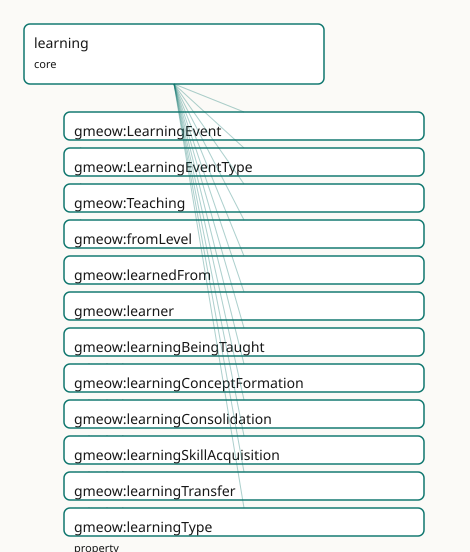

<!-- GENERATED by gmeow ontology-docs. DO NOT EDIT. -->

# GMEOW Learning Module

- **IRI:** <https://blackcatinformatics.ca/gmeow/slices/learning>
- **Tier:** core
- **[`Group`](../reference/classes/gmeow-Group.md):** core

## What This Slice Covers

This slice owns 17 terms and contributes 6 mapping or projection rows. Use it when its terms match the native fact you want to preserve; use the linkage tables to see how those facts leave GMEOW for consumer vocabularies.

## Dependencies

- [`gmeow:slices/cognition`](cognition.md)
- [`gmeow:slices/events`](events.md)
- [`gmeow:slices/expertise`](expertise.md)
- [`gmeow:slices/kernel`](kernel.md)
- [`gmeow:slices/mentation`](mentation.md)
- [`gmeow:slices/sources`](sources.md)
- [`gmeow:slices/temporal`](temporal.md)

## Consumers

- How agent memory GROWS ([Principle 14](https://github.com/Blackcat-Informatics/gmeow-ontology/blob/main/CONSTITUTION.md#principle-14)): when, from whom, and how an agent came to know something — the GTS ai-package belief-acquisition log. A [`gmeow:LearningEvent`](../reference/classes/gmeow-LearningEvent.md) records the transition that raised a [`gmeow:KnowledgeProficiency`](../reference/classes/gmeow-KnowledgeProficiency.md) or [`gmeow:SkillProficiency`](../reference/classes/gmeow-SkillProficiency.md); [`gmeow:learnedFrom`](../reference/properties/gmeow-learnedFrom.md) carries the provenance of acquired knowledge; pedagogy and rubric consumers (the teleology / rubrics slices) read [`gmeow:Teaching`](../reference/classes/gmeow-Teaching.md). Forgetting is suppression (cognition's [`gmeow:remembers`](../reference/properties/gmeow-remembers.md) + [`gmeow:displayable`](../reference/properties/gmeow-displayable.md) false), referenced here, never re-minted.

## Local Map



## Examples

### Skill Acquisition Trajectory

- **Source:** [`slices/core/learning/examples/skill-acquisition-trajectory.ttl`](https://github.com/Blackcat-Informatics/gmeow-ontology/blob/main/slices/core/learning/examples/skill-acquisition-trajectory.ttl)
- **GMEOW terms:** [`gmeow:Agent`](../reference/classes/gmeow-Agent.md), [`gmeow:CreativeWork`](../reference/classes/gmeow-CreativeWork.md), [`gmeow:LearningEvent`](../reference/classes/gmeow-LearningEvent.md), [`gmeow:Skill`](../reference/classes/gmeow-Skill.md), [`gmeow:SkillProficiency`](../reference/classes/gmeow-SkillProficiency.md), [`gmeow:TimeInterval`](../reference/classes/gmeow-TimeInterval.md), [`gmeow:displayable`](../reference/properties/gmeow-displayable.md), [`gmeow:dreyfusAdvancedBeginner`](../reference/individuals/gmeow-dreyfusAdvancedBeginner.md), [`gmeow:dreyfusExpert`](../reference/individuals/gmeow-dreyfusExpert.md), [`gmeow:dreyfusNovice`](../reference/individuals/gmeow-dreyfusNovice.md)
- **External prefixes:** `xsd`

```turtle
# SPDX-FileCopyrightText: 2026 Blackcat Informatics® Inc. <paudley@blackcatinformatics.ca>
# SPDX-License-Identifier: CC-BY-4.0
#
# Worked example: a proficiency RISE as a SEQUENCE of tenures, never a mutation.
# Two gmeow:LearningEvent occurrents raise lillith's cycling skill — a skill
# acquisition (novice → advanced beginner) and a consolidating practice block
# (advanced beginner → expert). Each event gmeow:produces its OWN reified
# gmeow:SkillProficiency relator, scoped by its own interval; the earlier tenure
# is kept with gmeow:displayable false rather than overwritten (Principle 10).
# The trajectory of one event rides gmeow:fromLevel / gmeow:toLevel; the durable
# standing is the proficiency tenure the event produced.

@prefix gmeow: <https://blackcatinformatics.ca/gmeow/> .
@prefix ex:    <https://blackcatinformatics.ca/gmeow/examples/learning/> .
@prefix rdfs:  <http://www.w3.org/2000/01/rdf-schema#> .
@prefix xsd:   <http://www.w3.org/2001/XMLSchema#> .

ex:lillith a gmeow:Agent ;
    rdfs:label "Lillith"@en .

ex:cycling a gmeow:Skill ;
    rdfs:label "riding a bicycle"@en .

ex:textbook a gmeow:CreativeWork ;
    rdfs:label "Cycling: a beginner's manual"@en .

# --- Event 1: skill acquisition, novice → advanced beginner (the spring).
ex:firstLessons a gmeow:LearningEvent ;
    gmeow:experiencer ex:lillith ;
    gmeow:mentalProcessType gmeow:processLearning ;
    gmeow:learningType gmeow:learningSkillAcquisition ;
    gmeow:learnedFrom ex:textbook ;
    gmeow:fromLevel gmeow:dreyfusNovice ;
    gmeow:toLevel gmeow:dreyfusAdvancedBeginner ;
    gmeow:produces ex:profSpring ;
    gmeow:eventTime "2026-03-15T10:00:00Z"^^xsd:dateTime ; # temporal placement — CONSTITUTION P11
    gmeow:eventTemporalFrame gmeow:temporalFrameUTCGregorian ;
    rdfs:label "first cycling lessons"@en .

# The proficiency tenure the first event produced — now SUPERSEDED, kept (not
# deleted) with gmeow:displayable false: the earlier rung of the sequence.
ex:profSpring a gmeow:SkillProficiency ;
    gmeow:skillProficiencyAgent ex:lillith ;
    gmeow:skillProficiencyOf ex:cycling ;
    gmeow:skillProficiencyLevel gmeow:dreyfusAdvancedBeginner ;
    gmeow:skillProficiencyScale gmeow:scaleDreyfus ;
    gmeow:skillProficiencyInterval ex:springInterval ;
    gmeow:displayable false ;
    rdfs:label "cycling proficiency (spring): advanced beginner"@en .

ex:springInterval a gmeow:TimeInterval ;
    gmeow:startedAtTime "2026-03-01T00:00:00Z"^^xsd:dateTime ;
    gmeow:endedAtTime   "2026-05-31T23:59:59Z"^^xsd:dateTime .

# --- Event 2: consolidating practice, advanced beginner → expert (the summer).
#     Two varieties co-apply (P9): it both consolidates and further acquires.
ex:summerPractice a gmeow:LearningEvent ;
    gmeow:experiencer ex:lillith ;
    gmeow:mentalProcessType gmeow:processLearning ;
    gmeow:learningType gmeow:learningConsolidation, gmeow:learningSkillAcquisition ;
    gmeow:fromLevel gmeow:dreyfusAdvancedBeginner ;
    gmeow:toLevel gmeow:dreyfusExpert ;
    gmeow:produces ex:profSummer ;
    gmeow:eventTime "2026-08-15T10:00:00Z"^^xsd:dateTime ; # temporal placement — CONSTITUTION P11
    gmeow:eventTemporalFrame gmeow:temporalFrameUTCGregorian ;
    rdfs:label "a summer of daily practice"@en .

# The current proficiency tenure — a NEW relator, not a mutation of ex:profSpring.
ex:profSummer a gmeow:SkillProficiency ;
    gmeow:skillProficiencyAgent ex:lillith ;
    gmeow:skillProficiencyOf ex:cycling ;
    gmeow:skillProficiencyLevel gmeow:dreyfusExpert ;
    gmeow:skillProficiencyScale gmeow:scaleDreyfus ;
    gmeow:skillProficiencyInterval ex:summerInterval ;
    rdfs:label "cycling proficiency (summer): expert"@en .

ex:summerInterval a gmeow:TimeInterval ;
    gmeow:startedAtTime "2026-06-01T00:00:00Z"^^xsd:dateTime .
```

### Teaching And Being Taught

- **Source:** [`slices/core/learning/examples/teaching-and-being-taught.ttl`](https://github.com/Blackcat-Informatics/gmeow-ontology/blob/main/slices/core/learning/examples/teaching-and-being-taught.ttl)
- **GMEOW terms:** [`gmeow:Agent`](../reference/classes/gmeow-Agent.md), [`gmeow:CognitiveState`](../reference/classes/gmeow-CognitiveState.md), [`gmeow:LearningEvent`](../reference/classes/gmeow-LearningEvent.md), [`gmeow:Skill`](../reference/classes/gmeow-Skill.md), [`gmeow:Teaching`](../reference/classes/gmeow-Teaching.md), [`gmeow:eventTemporalFrame`](../reference/properties/gmeow-eventTemporalFrame.md), [`gmeow:eventTime`](../reference/properties/gmeow-eventTime.md), [`gmeow:experiencer`](../reference/properties/gmeow-experiencer.md), [`gmeow:learnedFrom`](../reference/properties/gmeow-learnedFrom.md), [`gmeow:learner`](../reference/properties/gmeow-learner.md)
- **External prefixes:** `xsd`

```turtle
# SPDX-FileCopyrightText: 2026 Blackcat Informatics® Inc. <paudley@blackcatinformatics.ca>
# SPDX-License-Identifier: CC-BY-4.0
#
# Worked example: the two faces of instruction. A gmeow:Teaching relator reifies
# the instruction relation — one teacher, two learners taught together, one
# subject — making the roles first-class; teacher ≠ learner is enforced by
# gmeow:TeachingShape (SHACL), so an agent never teaches itself. Each learner's
# OWN acquisition is a separate gmeow:LearningEvent of variety
# gmeow:learningBeingTaught that gmeow:learnedFrom the teacher and gmeow:produces
# the cognitive state it settled — the being-taught face of learning, paired with
# the teaching relator the events participate in.

@prefix gmeow: <https://blackcatinformatics.ca/gmeow/> .
@prefix ex:    <https://blackcatinformatics.ca/gmeow/examples/learning/> .
@prefix rdfs:  <http://www.w3.org/2000/01/rdf-schema#> .
@prefix xsd:   <http://www.w3.org/2001/XMLSchema#> .

ex:mentor a gmeow:Agent ;
    rdfs:label "the cycling coach"@en .

ex:lillith a gmeow:Agent ;
    rdfs:label "Lillith"@en .

ex:rowan a gmeow:Agent ;
    rdfs:label "Rowan"@en .

ex:balancing a gmeow:Skill ;
    rdfs:label "balancing on two wheels"@en .

# --- The reified instruction: one teacher, TWO learners taught together, one
#     subject. teacher ≠ learner (gmeow:TeachingShape); co-taught learners share
#     ONE gmeow:Teaching rather than one Teaching each.
ex:lesson a gmeow:Teaching ;
    gmeow:teacher ex:mentor ;
    gmeow:learner ex:lillith, ex:rowan ;
    gmeow:subjectTaught ex:balancing ;
    rdfs:label "a group balancing lesson"@en .

# --- Lillith's own acquisition: a being-taught LearningEvent, learned FROM the
#     teacher, producing the cognitive state it settled.
ex:lillithLearns a gmeow:LearningEvent ;
    gmeow:experiencer ex:lillith ;
    gmeow:mentalProcessType gmeow:processLearning ;
    gmeow:learningType gmeow:learningBeingTaught ;
    gmeow:learnedFrom ex:mentor ;
    gmeow:produces ex:lillithBalances ;
    gmeow:eventTime "2026-06-15T14:00:00Z"^^xsd:dateTime ; # temporal placement — CONSTITUTION P11
    gmeow:eventTemporalFrame gmeow:temporalFrameUTCGregorian ;
    rdfs:label "Lillith learns to balance"@en .

ex:lillithBalances a gmeow:CognitiveState ;
    rdfs:label "Lillith's grasp of balancing"@en .

# --- Rowan's acquisition is a DISTINCT event sharing the one gmeow:Teaching: two
#     learners, two LearningEvents, one instruction relation.
ex:rowanLearns a gmeow:LearningEvent ;
    gmeow:experiencer ex:rowan ;
    gmeow:mentalProcessType gmeow:processLearning ;
    gmeow:learningType gmeow:learningBeingTaught ;
    gmeow:learnedFrom ex:mentor ;
    gmeow:produces ex:rowanBalances ;
    gmeow:eventTime "2026-06-15T14:30:00Z"^^xsd:dateTime ; # temporal placement — CONSTITUTION P11
    gmeow:eventTemporalFrame gmeow:temporalFrameUTCGregorian ;
    rdfs:label "Rowan learns to balance"@en .

ex:rowanBalances a gmeow:CognitiveState ;
    rdfs:label "Rowan's grasp of balancing"@en .
```

## Terms

### Classes

| Term | Label | Definition |
|---|---|---|
| [`gmeow:LearningEvent`](../reference/classes/gmeow-LearningEvent.md) | Learning Event | The occurrent that transitions an agent along the cognition knowledge spectrum or the expertise proficiency scale — learning as it unfolds in time: an acquisit... |
| [`gmeow:LearningEventType`](../reference/classes/gmeow-LearningEventType.md) | Learning Event Type | The variety of a learning event — a value vocabulary spanning concept-formation, skill-acquisition, being-taught, consolidation, transfer, and unlearning: gmeo... |
| [`gmeow:Teaching`](../reference/classes/gmeow-Teaching.md) | Teaching | A reified teaching relation — one teacher, one or more learners, and the subject taught, mediated as a [gufo:Relator](../external/terms.md#gufo-relator) so the roles, period, confidence, and evide... |

### Properties

| Term | Label | Definition |
|---|---|---|
| [`gmeow:fromLevel`](../reference/properties/gmeow-fromLevel.md) | from level | The proficiency or knowledge level an agent held BEFORE a learning event — the start of the trajectory. The RANGE is left intentionally open: the level is a co... |
| [`gmeow:learnedFrom`](../reference/properties/gmeow-learnedFrom.md) | learned from | Relates a learning event to what the agent learned from — the provenance of acquired knowledge. The RANGE is left intentionally open: the source is typically a... |
| [`gmeow:learner`](../reference/properties/gmeow-learner.md) | learner | An agent receiving instruction in a [`gmeow:Teaching`](../reference/classes/gmeow-Teaching.md) relation. NON-functional: several learners may be taught together in one Teaching. Each learner's own acquis... |
| [`gmeow:learningType`](../reference/properties/gmeow-learningType.md) | learning type | Classifies a learning event by its variety — one or more of the [`gmeow:LearningEventType`](../reference/classes/gmeow-LearningEventType.md) value vocabulary. NOT functional: a single event may carry several vari... |
| [`gmeow:produces`](../reference/properties/gmeow-produces.md) | produces | Relates a learning event to the knowledge state it raised or settled — its product. The RANGE is left intentionally open: the product is typically a cognition... |
| [`gmeow:subjectTaught`](../reference/properties/gmeow-subjectTaught.md) | subject taught | The content taught in a [`gmeow:Teaching`](../reference/classes/gmeow-Teaching.md) relation — the topic, skill, or proposition instruction conveyed. The RANGE is left intentionally open: the subject is t... |
| [`gmeow:teacher`](../reference/properties/gmeow-teacher.md) | teacher | The agent providing instruction in a [`gmeow:Teaching`](../reference/classes/gmeow-Teaching.md) relation. Functional: one teaching, one teacher; co-teaching is several [`gmeow:Teaching`](../reference/classes/gmeow-Teaching.md) relators sharing a g... |
| [`gmeow:toLevel`](../reference/properties/gmeow-toLevel.md) | to level | The proficiency or knowledge level an agent reached AFTER a learning event — the end of the trajectory. The RANGE is left intentionally open, exactly as gmeow:... |

### Individuals

| Term | Label | Definition |
|---|---|---|
| [`gmeow:learningBeingTaught`](../reference/individuals/gmeow-learningBeingTaught.md) | being taught | A learning event in which the agent learns through instruction from a teacher — the learner-side face of a [`gmeow:Teaching`](../reference/classes/gmeow-Teaching.md) relator. The teacher and the taught s... |
| [`gmeow:learningConceptFormation`](../reference/individuals/gmeow-learningConceptFormation.md) | concept formation | A learning event in which the agent forms a new concept — acquiring a category, schema, or abstraction it did not previously hold. Bridges the forthcoming conc... |
| [`gmeow:learningConsolidation`](../reference/individuals/gmeow-learningConsolidation.md) | consolidation | A learning event that strengthens or stabilises already-acquired knowledge or skill — rehearsal, practice, or sleep-based memory consolidation — without introd... |
| [`gmeow:learningSkillAcquisition`](../reference/individuals/gmeow-learningSkillAcquisition.md) | skill acquisition | A learning event that raises an agent's procedural competence — moving it up the expertise proficiency scale (e.g. a Dreyfus step from novice toward expert). T... |
| [`gmeow:learningTransfer`](../reference/individuals/gmeow-learningTransfer.md) | transfer | A learning event in which knowledge or skill acquired in one domain is applied to a new domain — analogical transfer. Bridges the inference slice: the source-t... |
| [`gmeow:learningUnlearning`](../reference/individuals/gmeow-learningUnlearning.md) | unlearning | A learning event of revision — the agent retires or supersedes previously-held knowledge or skill as it learns. Unlearning is modelled as suppression of the pr... |

## Linkages

- **Rows:** 6
- **Projection profiles:** -
- **External vocabularies:** `prov`, `schema`

| Source | Kind | Profile | Predicate/Relation | Target | Evidence |
|---|---|---|---|---|---|
| [`gmeow:LearningEvent`](../reference/classes/gmeow-LearningEvent.md) | equivalence | `-` | [skos:closeMatch](http://www.w3.org/2004/02/skos/core#closeMatch) | [prov:Activity](http://www.w3.org/ns/prov#Activity) | `gmeow-learning.sssom.tsv`; `gmeow:eqLrn004`; confidence 0.6 |
| [`gmeow:LearningEvent`](../reference/classes/gmeow-LearningEvent.md) | equivalence | `-` | [skos:closeMatch](http://www.w3.org/2004/02/skos/core#closeMatch) | [schema:LearnAction](https://schema.org/LearnAction) | `gmeow-learning.sssom.tsv`; `gmeow:eqLrn001`; confidence 0.8 |
| [`gmeow:Teaching`](../reference/classes/gmeow-Teaching.md) | equivalence | `-` | [skos:closeMatch](http://www.w3.org/2004/02/skos/core#closeMatch) | [schema:TeachAction](https://schema.org/TeachAction) | `gmeow-learning.sssom.tsv`; `gmeow:eqLrn002`; confidence 0.7 |
| [`gmeow:learnedFrom`](../reference/properties/gmeow-learnedFrom.md) | equivalence | `-` | [skos:closeMatch](http://www.w3.org/2004/02/skos/core#closeMatch) | [prov:wasDerivedFrom](http://www.w3.org/ns/prov#wasDerivedFrom) | `gmeow-learning.sssom.tsv`; `gmeow:eqLrn005`; confidence 0.6 |
| [`gmeow:produces`](../reference/properties/gmeow-produces.md) | equivalence | `-` | [skos:closeMatch](http://www.w3.org/2004/02/skos/core#closeMatch) | [prov:generated](http://www.w3.org/ns/prov#generated) | `gmeow-learning.sssom.tsv`; `gmeow:eqLrn006`; confidence 0.7 |
| [`gmeow:subjectTaught`](../reference/properties/gmeow-subjectTaught.md) | equivalence | `-` | [skos:closeMatch](http://www.w3.org/2004/02/skos/core#closeMatch) | [schema:teaches](https://schema.org/teaches) | `gmeow-learning.sssom.tsv`; `gmeow:eqLrn003`; confidence 0.7 |

## Guide

<!-- SPDX-FileCopyrightText: 2026 Blackcat Informatics® Inc. <paudley@blackcatinformatics.ca> -->
<!-- SPDX-License-Identifier: CC-BY-4.0 -->

# Learning

> **Slice:** `https://blackcatinformatics.ca/gmeow/slices/learning` · **tier: core**

Learning as **process** — the occurrent that transitions an agent along the cognition knowledge
spectrum or the expertise proficiency scale. The cognition slice models the endurant
[`gmeow:KnowledgeProficiency`](../reference/classes/gmeow-KnowledgeProficiency.md) and the expertise slice models the endurant [`gmeow:SkillProficiency`](../reference/classes/gmeow-SkillProficiency.md);
this slice models the **occurrent** [`gmeow:LearningEvent`](../reference/classes/gmeow-LearningEvent.md) that **changes** those states — acquisition,
being-taught, consolidation, transfer, and unlearning. Memory-as-storage (flagship store/recall) is
not learning; learning is the event that grew what an agent knows.

## The occurrent/endurant split

The mentation slice reserves [`gmeow:MentalProcess`](../reference/classes/gmeow-MentalProcess.md) as an umbrella for occurrent mental events.
[`gmeow:LearningEvent`](../reference/classes/gmeow-LearningEvent.md) reparents under it — never re-roots it — inheriting [`gmeow:experiencer`](../reference/properties/gmeow-experiencer.md) and the
unified mental-timeline stream. The split keeps the [gUFO](../external/ontologies.md#target-gufo) ontological partition clean:

| Layer | Class | Mode |
|---|---|---|
| state | [`gmeow:KnowledgeProficiency`](../reference/classes/gmeow-KnowledgeProficiency.md) (cognition) | endurant — what an agent *knows* |
| state | [`gmeow:SkillProficiency`](../reference/classes/gmeow-SkillProficiency.md) (expertise) | endurant — what an agent *can do* |
| event | [`gmeow:LearningEvent`](../reference/classes/gmeow-LearningEvent.md) | occurrent — what *changed* those states |

A [`gmeow:LearningEvent`](../reference/classes/gmeow-LearningEvent.md) links to the enduring states it settled via [`gmeow:produces`](../reference/properties/gmeow-produces.md), to its
start/end levels via [`gmeow:fromLevel`](../reference/properties/gmeow-fromLevel.md) / [`gmeow:toLevel`](../reference/properties/gmeow-toLevel.md), and to its source via [`gmeow:learnedFrom`](../reference/properties/gmeow-learnedFrom.md).

### [`gmeow:LearningEvent`](../reference/classes/gmeow-LearningEvent.md)

The occurrent that transitions an agent along the cognition knowledge spectrum or the expertise
proficiency scale — learning as it unfolds in time. A [`gmeow:MentalProcess`](../reference/classes/gmeow-MentalProcess.md) ([`gufo:EventType`](../external/terms.md#gufo-eventtype)), it is
borne by exactly one [`gmeow:experiencer`](../reference/properties/gmeow-experiencer.md) (inherited) and joins the agent's single occurrent
mental-timeline stream. The **class** asserts that a learning process occurred; the **variety** is a
[`gmeow:LearningEventType`](../reference/classes/gmeow-LearningEventType.md) value carried by [`gmeow:learningType`](../reference/properties/gmeow-learningType.md) ([Principle 9](https://github.com/Blackcat-Informatics/gmeow-ontology/blob/main/CONSTITUTION.md#principle-9), never a subclass).

**Timeline-parity fields — the cross-slice contract.** Like every sibling occurrent on the mental
timeline, a [`gmeow:LearningEvent`](../reference/classes/gmeow-LearningEvent.md) carries:

- [`gmeow:mentalProcessType`](../reference/properties/gmeow-mentalProcessType.md) [`gmeow:processLearning`](../reference/individuals/gmeow-processLearning.md) — the uniform occurrent query handle (it mirrors
 [`gmeow:eventType`](../reference/properties/gmeow-eventType.md)), declared once on the mentation spine, so a timeline query filtering by
 [`gmeow:mentalProcessType`](../reference/properties/gmeow-mentalProcessType.md) surfaces learning episodes exactly as a [`gmeow:InferenceProcess`](../reference/classes/gmeow-InferenceProcess.md) carries
 [`gmeow:processReasoning`](../reference/individuals/gmeow-processReasoning.md). This is the single canonical occurrent marker — no redundant second value
 is minted ([Principle 4](https://github.com/Blackcat-Informatics/gmeow-ontology/blob/main/CONSTITUTION.md#principle-4)); the orthogonal **variety** rides [`gmeow:learningType`](../reference/properties/gmeow-learningType.md).
- a temporal placement — [`gmeow:eventTime`](../reference/properties/gmeow-eventTime.md) (an [`xsd:dateTime`](http://www.w3.org/2001/XMLSchema#dateTime)) **and** `[`gmeow:eventTemporalFrame`](../reference/properties/gmeow-eventTemporalFrame.md)
 [`gmeow:temporalFrameUTCGregorian`](../reference/individuals/gmeow-temporalFrameUTCGregorian.md)` (CONSTITUTION P11: a value asserted without its reference frame is
 ill-formed).

## Learning event types

[`gmeow:LearningEventType`](../reference/classes/gmeow-LearningEventType.md) is an **open** value vocabulary (`[gufo:AbstractIndividualType](../external/terms.md#gufo-abstractindividualtype) ⊑
[gufo:QualityValue](../external/terms.md#gufo-qualityvalue)`) whose members are **individuals, never subclasses** ([Principle 9](https://github.com/Blackcat-Informatics/gmeow-ontology/blob/main/CONSTITUTION.md#principle-9)). More than one
may co-apply to a single event ([`gmeow:learningType`](../reference/properties/gmeow-learningType.md) is non-functional): a transfer that also
consolidates is both [`gmeow:learningTransfer`](../reference/individuals/gmeow-learningTransfer.md) and [`gmeow:learningConsolidation`](../reference/individuals/gmeow-learningConsolidation.md).

| Value | Kind | What it marks |
|---|---|---|
| [`gmeow:learningConceptFormation`](../reference/individuals/gmeow-learningConceptFormation.md) | concept formation | agent forms a new category or abstraction |
| [`gmeow:learningSkillAcquisition`](../reference/individuals/gmeow-learningSkillAcquisition.md) | skill acquisition | agent moves up the expertise proficiency scale |
| [`gmeow:learningBeingTaught`](../reference/individuals/gmeow-learningBeingTaught.md) | being taught | agent learns through instruction from a teacher |
| [`gmeow:learningConsolidation`](../reference/individuals/gmeow-learningConsolidation.md) | consolidation | agent strengthens or stabilises already-acquired knowledge |
| [`gmeow:learningTransfer`](../reference/individuals/gmeow-learningTransfer.md) | transfer | agent applies knowledge from one domain to a new one |
| [`gmeow:learningUnlearning`](../reference/individuals/gmeow-learningUnlearning.md) | unlearning | agent retires or supersedes previously-held knowledge |

Two type values carry **documented routing bridges** (no axiom): [`gmeow:learningTransfer`](../reference/individuals/gmeow-learningTransfer.md) routes to the
inference slice's [`gmeow:Analogy`](../reference/classes/gmeow-Analogy.md) (the source-to-target structure-mapping that warrants the transfer);
[`gmeow:learningConceptFormation`](../reference/individuals/gmeow-learningConceptFormation.md) bridges to the forthcoming concepts slice. Neither carries a
reasoner-enforced relation in core — the bridges are routing for consumers, not entailments.

**Forgetting is suppression, not a new term.** There is deliberately no `gmeow:forgets` /
`gmeow:forgotten` term. Forgetting is the cognition slice's [`gmeow:remembers`](../reference/properties/gmeow-remembers.md) withdrawn by
[`gmeow:displayable`](../reference/properties/gmeow-displayable.md) false; [`gmeow:learningUnlearning`](../reference/individuals/gmeow-learningUnlearning.md) names the revision *event*, not a deletion
construct.

### [`gmeow:LearningEventType`](../reference/classes/gmeow-LearningEventType.md) · [`gmeow:learningType`](../reference/properties/gmeow-learningType.md)

[`gmeow:LearningEventType`](../reference/classes/gmeow-LearningEventType.md) is the open value vocabulary of learning varieties; [`gmeow:learningType`](../reference/properties/gmeow-learningType.md)
(domain [`gmeow:LearningEvent`](../reference/classes/gmeow-LearningEvent.md), range [`gmeow:LearningEventType`](../reference/classes/gmeow-LearningEventType.md)) classifies an event by pointing it
at one or more of those values. Non-functional by design — several varieties may co-apply. Extend
the vocabulary by minting a fresh [`gmeow:LearningEventType`](../reference/classes/gmeow-LearningEventType.md) individual, never by subclassing
[`gmeow:LearningEvent`](../reference/classes/gmeow-LearningEvent.md) ([Principle 9](https://github.com/Blackcat-Informatics/gmeow-ontology/blob/main/CONSTITUTION.md#principle-9)).

## Provenance, trajectory, and product

Three open-range properties carry what the learning came *from*, the levels it moved *between*, and
the state it *produced*. All ranges are left **intentionally open** ([Principle 13](https://github.com/Blackcat-Informatics/gmeow-ontology/blob/main/CONSTITUTION.md#principle-13)): the target
classes are either not yet built (`gmeow:Concept`) or retired (`gmeow:Source`, superseded by
[`gmeow:CreativeWork`](../reference/classes/gmeow-CreativeWork.md) plus a source-role).

### [`gmeow:learnedFrom`](../reference/properties/gmeow-learnedFrom.md)

Relates a [`gmeow:LearningEvent`](../reference/classes/gmeow-LearningEvent.md) to what the agent learned from — the provenance of acquired
knowledge. Open range: typically a [`gmeow:CreativeWork`](../reference/classes/gmeow-CreativeWork.md), a teaching [`gmeow:Agent`](../reference/classes/gmeow-Agent.md), or a body of
evidence, but the surface is never prematurely closed. Non-functional — a learning event may draw on
several sources. Do not revive the retired `gmeow:Source` class; point at a [`gmeow:CreativeWork`](../reference/classes/gmeow-CreativeWork.md)
plus a source-role.

### [`gmeow:fromLevel`](../reference/properties/gmeow-fromLevel.md) · [`gmeow:toLevel`](../reference/properties/gmeow-toLevel.md)

[`gmeow:fromLevel`](../reference/properties/gmeow-fromLevel.md) is the proficiency or knowledge level an agent held **before** a learning event;
[`gmeow:toLevel`](../reference/properties/gmeow-toLevel.md) is the level reached **after**. Both have an open range (a cognition
[`gmeow:KnowledgeLevel`](../reference/classes/gmeow-KnowledgeLevel.md) or an expertise [`gmeow:ProficiencyLevel`](../reference/classes/gmeow-ProficiencyLevel.md) are equally admitted) and are
non-functional. For a consolidation event [`gmeow:toLevel`](../reference/properties/gmeow-toLevel.md) may equal [`gmeow:fromLevel`](../reference/properties/gmeow-fromLevel.md) (the level
is stabilised, not raised).

**[`Trajectory`](../reference/classes/gmeow-Trajectory.md), not mutation ([Principle 10](https://github.com/Blackcat-Informatics/gmeow-ontology/blob/main/CONSTITUTION.md#principle-10)).** [`gmeow:fromLevel`](../reference/properties/gmeow-fromLevel.md) / [`gmeow:toLevel`](../reference/properties/gmeow-toLevel.md) record the
endpoints of one event. An agent's standing over time is a **sequence** of reified
[`gmeow:KnowledgeProficiency`](../reference/classes/gmeow-KnowledgeProficiency.md) / [`gmeow:SkillProficiency`](../reference/classes/gmeow-SkillProficiency.md) tenures, each scoped by its own interval
(the temporal [`gmeow:TimeScopedRelation`](../reference/classes/gmeow-TimeScopedRelation.md) idiom), with the prior tenure kept via `[`gmeow:displayable`](../reference/properties/gmeow-displayable.md)
false` rather than overwritten — never the in-place mutation of one relator.

### [`gmeow:produces`](../reference/properties/gmeow-produces.md)

Relates a [`gmeow:LearningEvent`](../reference/classes/gmeow-LearningEvent.md) to the knowledge state it raised or settled — its product. Open
range: typically a cognition [`gmeow:CognitiveState`](../reference/classes/gmeow-CognitiveState.md) or [`gmeow:KnowledgeProficiency`](../reference/classes/gmeow-KnowledgeProficiency.md), an expertise
[`gmeow:SkillProficiency`](../reference/classes/gmeow-SkillProficiency.md), or (once the concepts slice lands) a `gmeow:Concept`. Non-functional —
one event may settle several states. The occurrent/endurant bridge: the **event** produces the
enduring **state**, keeping the [gUFO](../external/ontologies.md#target-gufo) split clean.

## Teaching — the instruction relator

[`gmeow:Teaching`](../reference/classes/gmeow-Teaching.md) is the [`gmeow:Participation`](../reference/classes/gmeow-Participation.md)-style relator ([`gufo:Relator`](../external/terms.md#gufo-relator)) mediating one teacher,
one or more learners, and the subject taught — the being-taught face of learning. Reifying the
instruction makes the roles, period, confidence, and evidence of teaching first-class. The **80% case**
(learner acquires from a source) is a bare [`gmeow:LearningEvent`](../reference/classes/gmeow-LearningEvent.md) with [`gmeow:learnedFrom`](../reference/properties/gmeow-learnedFrom.md); reach for
[`gmeow:Teaching`](../reference/classes/gmeow-Teaching.md) only when the instruction relation itself is the fact of interest ([Principle 4](https://github.com/Blackcat-Informatics/gmeow-ontology/blob/main/CONSTITUTION.md#principle-4)).

**Teacher must differ from every learner.** An agent cannot teach itself. This is a **closed-world
well-formedness rule** enforced by `gmeow:TeachingShape` (SHACL) — not a DL axiom, keeping the
reasoned profile within OWL 2 EL. The open-world "some teacher, some learner" mediation rides
[`owl:someValuesFrom`](http://www.w3.org/2002/07/owl#someValuesFrom) restrictions in `module.ttl`.

### [`gmeow:Teaching`](../reference/classes/gmeow-Teaching.md)

A reified teaching relation ([`gufo:Relator`](../external/terms.md#gufo-relator), [`gufo:Kind`](../external/terms.md#gufo-kind)) — one teacher, one or more learners, and
the subject taught. Three role properties: [`gmeow:teacher`](../reference/properties/gmeow-teacher.md) (functional, range [`gmeow:Agent`](../reference/classes/gmeow-Agent.md)),
[`gmeow:learner`](../reference/properties/gmeow-learner.md) (non-functional, range [`gmeow:Agent`](../reference/classes/gmeow-Agent.md)), and [`gmeow:subjectTaught`](../reference/properties/gmeow-subjectTaught.md) (non-functional,
open range). Co-teaching is **several [`gmeow:Teaching`](../reference/classes/gmeow-Teaching.md) relators** sharing a subject and learner set,
not one [`Teaching`](../reference/classes/gmeow-Teaching.md) with multiple teachers. Retract a withdrawn role with [`gmeow:displayable`](../reference/properties/gmeow-displayable.md) false,
never deletion ([Principle 10](https://github.com/Blackcat-Informatics/gmeow-ontology/blob/main/CONSTITUTION.md#principle-10)).

### [`gmeow:teacher`](../reference/properties/gmeow-teacher.md) · [`gmeow:learner`](../reference/properties/gmeow-learner.md) · [`gmeow:subjectTaught`](../reference/properties/gmeow-subjectTaught.md)

[`gmeow:teacher`](../reference/properties/gmeow-teacher.md) (functional) names the single [`gmeow:Agent`](../reference/classes/gmeow-Agent.md) giving instruction; [`gmeow:learner`](../reference/properties/gmeow-learner.md)
(non-functional) names each [`gmeow:Agent`](../reference/classes/gmeow-Agent.md) receiving instruction — a class taught together shares one
[`gmeow:Teaching`](../reference/classes/gmeow-Teaching.md). [`gmeow:subjectTaught`](../reference/properties/gmeow-subjectTaught.md) (non-functional, open range) records what a [`Teaching`](../reference/classes/gmeow-Teaching.md)
conveyed — a concept (the forthcoming `gmeow:Concept`), a [`gmeow:Skill`](../reference/classes/gmeow-Skill.md), or a [`gmeow:Proposition`](../reference/classes/gmeow-Proposition.md) are
all admitted. `gmeow:TeachingShape` enforces that no agent is both [`gmeow:teacher`](../reference/properties/gmeow-teacher.md) and [`gmeow:learner`](../reference/properties/gmeow-learner.md)
of the same [`Teaching`](../reference/classes/gmeow-Teaching.md).

## SSSOM alignments (`mappings/equivalences.ttl`)

Authored in `mappings/equivalences.ttl` and compiled to `mappings/gmeow-learning.sssom.tsv` by
`gmeow compile-mappings`. All by reference ([Principle 5](https://github.com/Blackcat-Informatics/gmeow-ontology/blob/main/CONSTITUTION.md#principle-5)) — GMEOW never imports an external axiom.
Alignments are deliberately loose ([`skos:closeMatch`](http://www.w3.org/2004/02/skos/core#closeMatch), not `equivalentClass`): schema.org models the
*act* of learning/teaching, GMEOW models the *cognitive-state-transition event*; [PROV-O](../external/ontologies.md#target-prov) models the
activity / provenance face.

| GMEOW | Predicate | Target | Note |
|---|---|---|---|
| [`gmeow:LearningEvent`](../reference/classes/gmeow-LearningEvent.md) | [`skos:closeMatch`](http://www.w3.org/2004/02/skos/core#closeMatch) | [`schema:LearnAction`](https://schema.org/LearnAction) | [schema:LearnAction](https://schema.org/LearnAction) is the act of gaining knowledge; [`gmeow:LearningEvent`](../reference/classes/gmeow-LearningEvent.md) is the state-transition occurrent carrying trajectory, variety, and product |
| [`gmeow:Teaching`](../reference/classes/gmeow-Teaching.md) | [`skos:closeMatch`](http://www.w3.org/2004/02/skos/core#closeMatch) | [`schema:TeachAction`](https://schema.org/TeachAction) | [schema:TeachAction](https://schema.org/TeachAction) is the act of imparting knowledge; [`gmeow:Teaching`](../reference/classes/gmeow-Teaching.md) is the reified [gufo:Relator](../external/terms.md#gufo-relator) mediating roles |
| [`gmeow:subjectTaught`](../reference/properties/gmeow-subjectTaught.md) | [`skos:closeMatch`](http://www.w3.org/2004/02/skos/core#closeMatch) | [`schema:teaches`](https://schema.org/teaches) | [schema:teaches](https://schema.org/teaches) links a learning resource to a competency; [`gmeow:subjectTaught`](../reference/properties/gmeow-subjectTaught.md) links a reified relator to its content |
| [`gmeow:LearningEvent`](../reference/classes/gmeow-LearningEvent.md) | [`skos:closeMatch`](http://www.w3.org/2004/02/skos/core#closeMatch) | [`prov:Activity`](http://www.w3.org/ns/prov#Activity) | a [`gmeow:LearningEvent`](../reference/classes/gmeow-LearningEvent.md) is a [prov:Activity](http://www.w3.org/ns/prov#Activity) that generates a knowledge entity, with richer trajectory and the [gUFO](../external/ontologies.md#target-gufo) occurrent/endurant split |
| [`gmeow:learnedFrom`](../reference/properties/gmeow-learnedFrom.md) | [`skos:closeMatch`](http://www.w3.org/2004/02/skos/core#closeMatch) | [`prov:wasDerivedFrom`](http://www.w3.org/ns/prov#wasDerivedFrom) | provenance of acquired knowledge vs. entity derivation — closeMatch across the entity/event shift |
| [`gmeow:produces`](../reference/properties/gmeow-produces.md) | [`skos:closeMatch`](http://www.w3.org/2004/02/skos/core#closeMatch) | [`prov:generated`](http://www.w3.org/ns/prov#generated) | both relate a process to its produced entity; [`gmeow:produces`](../reference/properties/gmeow-produces.md) specifies the settled knowledge state |

xAPI (the [`Experience`](../reference/classes/gmeow-Experience.md) API) is the strongest external consumer — learning records keyed by
`<http://adlnet.gov/expapi/verbs/learned>` — but it is a JSON Statement model with no stable OWL
class IRIs, so [`gmeow:LearningEvent`](../reference/classes/gmeow-LearningEvent.md) projects **down** to an xAPI Statement at the projection layer
and is referenced in prose, not mapped as a `gmeow:TermEquivalence`.

## Dependencies

| Slice | Why |
|---|---|
| `kernel` | [`gmeow:Agent`](../reference/classes/gmeow-Agent.md) — the experiencer, teacher, and learner domain |
| `mentation` | [`gmeow:MentalProcess`](../reference/classes/gmeow-MentalProcess.md) (the reparenting hook [`gmeow:LearningEvent`](../reference/classes/gmeow-LearningEvent.md) [rdfs:subClassOf](http://www.w3.org/2000/01/rdf-schema#subClassOf)'s under), the inherited [`gmeow:experiencer`](../reference/properties/gmeow-experiencer.md), and [`gmeow:mentalProcessType`](../reference/properties/gmeow-mentalProcessType.md) / [`gmeow:processLearning`](../reference/individuals/gmeow-processLearning.md) — the mental-timeline marker every [`gmeow:LearningEvent`](../reference/classes/gmeow-LearningEvent.md) carries |
| `events` | [`gmeow:Event`](../reference/classes/gmeow-Event.md) — the superclass [`gmeow:MentalProcess`](../reference/classes/gmeow-MentalProcess.md) (hence [`gmeow:LearningEvent`](../reference/classes/gmeow-LearningEvent.md)) reparents under; the [`gmeow:Participation`](../reference/classes/gmeow-Participation.md) relator idiom mirrored by [`gmeow:Teaching`](../reference/classes/gmeow-Teaching.md) |
| `cognition` | [`gmeow:KnowledgeProficiency`](../reference/classes/gmeow-KnowledgeProficiency.md), [`gmeow:KnowledgeLevel`](../reference/classes/gmeow-KnowledgeLevel.md), and [`gmeow:CognitiveState`](../reference/classes/gmeow-CognitiveState.md) — the knowledge-state targets of [`gmeow:produces`](../reference/properties/gmeow-produces.md) / [`gmeow:fromLevel`](../reference/properties/gmeow-fromLevel.md) / [`gmeow:toLevel`](../reference/properties/gmeow-toLevel.md) |
| `expertise` | [`gmeow:SkillProficiency`](../reference/classes/gmeow-SkillProficiency.md) and [`gmeow:ProficiencyLevel`](../reference/classes/gmeow-ProficiencyLevel.md) — the skill-state targets of the same properties; the [`gmeow:scaleDreyfus`](../reference/individuals/gmeow-scaleDreyfus.md) skill scale and its `gmeow:dreyfus*` levels (expertise being their domain slice) referenced by [`gmeow:fromLevel`](../reference/properties/gmeow-fromLevel.md) / [`gmeow:toLevel`](../reference/properties/gmeow-toLevel.md) |
| `temporal` | [`gmeow:TimeScopedRelation`](../reference/classes/gmeow-TimeScopedRelation.md) (the proficiency-tenure parent) and [`gmeow:duringInterval`](../reference/properties/gmeow-duringInterval.md) for trajectory sequences |
| `sources` | [`gmeow:CreativeWork`](../reference/classes/gmeow-CreativeWork.md) — the primary open-range target of [`gmeow:learnedFrom`](../reference/properties/gmeow-learnedFrom.md) |

## Verified by construction

`gmeow:TeachingShape` (`shapes.ttl`) pins the load-bearing closed-world rules:

- **Exactly one teacher** — `sh:minCount 1; sh:maxCount 1` on [`gmeow:teacher`](../reference/properties/gmeow-teacher.md), class [`gmeow:Agent`](../reference/classes/gmeow-Agent.md).
- **At least one learner, each a [`gmeow:Agent`](../reference/classes/gmeow-Agent.md)** — sh:minCount 1; sh:class [`gmeow:Agent`](../reference/classes/gmeow-Agent.md) on
 [`gmeow:learner`](../reference/properties/gmeow-learner.md) — instruction with no one being taught is not a teaching, and a learner must be an
 agent (matching the [`gmeow:teacher`](../reference/properties/gmeow-teacher.md) constraint and the [`rdfs:range gmeow:Agent`](http://www.w3.org/2000/01/rdf-schema#range gmeow:Agent)).
- **At least one subject taught** — `sh:minCount 1` on [`gmeow:subjectTaught`](../reference/properties/gmeow-subjectTaught.md) — instruction is always
 instruction in something.
- **Teacher ≠ learner** — SPARQL constraint on `gmeow:TeachingShape`: a [`Teaching`](../reference/classes/gmeow-Teaching.md) is violation if any
 [`gmeow:teacher`](../reference/properties/gmeow-teacher.md) IRI also appears as a [`gmeow:learner`](../reference/properties/gmeow-learner.md) of the same node. An agent cannot teach itself.
