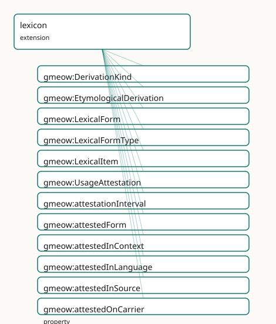

<!-- GENERATED by gmeow ontology-docs. DO NOT EDIT. -->

# GMEOW Lexicon Module

- **IRI:** <https://blackcatinformatics.ca/gmeow/slices/lexicon>
- **Tier:** extension
- **[`Group`](../reference/classes/gmeow-Group.md):** extensions

## What This Slice Covers

This slice owns 43 terms and contributes 13 mapping or projection rows. Use it when its terms match the native fact you want to preserve; use the linkage tables to see how those facts leave GMEOW for consumer vocabularies.

## Dependencies

- [`gmeow:slices/documents`](documents.md)
- [`gmeow:slices/kernel`](kernel.md)
- [`gmeow:slices/language`](language.md)
- [`gmeow:slices/observations`](observations.md)
- [`gmeow:slices/temporal`](temporal.md)

## Consumers

- Lexical items and attestations for the language family; archaeological readings.

## Local Map



## Terms

### Classes

| Term | Label | Definition |
|---|---|---|
| [`gmeow:DerivationKind`](../reference/classes/gmeow-DerivationKind.md) | Derivation Kind | The kind of etymological derivation — a value, never an Entity subclass. Open-ended: new historical-linguistic frameworks may introduce further derivation type... |
| [`gmeow:EtymologicalDerivation`](../reference/classes/gmeow-EtymologicalDerivation.md) | Etymological Derivation | A provenance-rich claim about historical derivation between lexical items or forms. Not a flat property — a full relator carrying standpoint (accordingTo), con... |
| [`gmeow:LexicalForm`](../reference/classes/gmeow-LexicalForm.md) | Lexical Form | A concrete form of a lexical item — written, spoken, signed, rendered, reconstructed, normalized, transliterated, or translated. The surface representation is... |
| [`gmeow:LexicalFormType`](../reference/classes/gmeow-LexicalFormType.md) | Lexical Form Type | The kind of a lexical form — a value, never an Entity subclass. The seed list is an anchor, not a fence; new analytical frameworks may introduce further form t... |
| [`gmeow:LexicalItem`](../reference/classes/gmeow-LexicalItem.md) | Lexical Item | The abstract lexical or constructional object: a word, morpheme, phrase, idiom, symbol, sign, or construction. Carries no surface form itself; forms are linked... |
| [`gmeow:UsageAttestation`](../reference/classes/gmeow-UsageAttestation.md) | Usage Attestation | An evidence node recording that a lexical form, reading, inscription, symbol, construction, or usage was observed in a source or context. Evidence, not truth:... |

### Properties

| Term | Label | Definition |
|---|---|---|
| [`gmeow:attestationInterval`](../reference/properties/gmeow-attestationInterval.md) | attestation interval | The time interval over which the attested usage is asserted to have been observed — e.g. a corpus span, an inscription period, or a community usage era. A rela... |
| [`gmeow:attestedForm`](../reference/properties/gmeow-attestedForm.md) | attested form | The lexical form that a usage attestation observes. Functional per relator: one attested form per UsageAttestation. |
| [`gmeow:attestedInContext`](../reference/properties/gmeow-attestedInContext.md) | attested in context | The corpus, platform, community, dataset, inscription, or broader context in which the attested form was observed. NON-FUNCTIONAL: a form may be attested in mu... |
| [`gmeow:attestedInLanguage`](../reference/properties/gmeow-attestedInLanguage.md) | attested in language | The language, variety, or state in which the attested form was observed. NON-FUNCTIONAL: a multilingual source may attest the same form in multiple language co... |
| [`gmeow:attestedInSource`](../reference/properties/gmeow-attestedInSource.md) | attested in source | The bibliographic or documentary source in which the attested form was observed. NON-FUNCTIONAL: an attestation may be supported by multiple sources, and compe... |
| [`gmeow:attestedOnCarrier`](../reference/properties/gmeow-attestedOnCarrier.md) | attested on carrier | The physical archaeological carrier on which an attested form was observed — a tablet, ostracon, seal, coin, manuscript, or wall. NON-FUNCTIONAL: an attestatio... |
| [`gmeow:derivationEvidence`](../reference/properties/gmeow-derivationEvidence.md) | derivation evidence | The usage attestations, sources, or other evidence supporting a derivation claim. NON-FUNCTIONAL: a derivation may be supported by multiple evidence nodes, and... |
| [`gmeow:derivationKind`](../reference/properties/gmeow-derivationKind.md) | derivation kind | The kind(s) of etymological derivation claimed — borrowing, calque, semantic shift, sound change, etc. NON-FUNCTIONAL: a single derivation may be classified as... |
| [`gmeow:derivationTarget`](../reference/properties/gmeow-derivationTarget.md) | derivation target | The descendant lexical item or form that is derived from the source. Functional per relator: one target per EtymologicalDerivation. |
| [`gmeow:formOf`](../reference/properties/gmeow-formOf.md) | form of | The lexical item that a form is a form of — the inverse of [`gmeow:hasLexicalForm`](../reference/properties/gmeow-hasLexicalForm.md). |
| [`gmeow:formRepresentation`](../reference/properties/gmeow-formRepresentation.md) | form representation | The actual string or value of a lexical form — the written text, IPA transcription, sign notation, or reconstructed string. Functional: one representation per... |
| [`gmeow:formTransliterationScheme`](../reference/properties/gmeow-formTransliterationScheme.md) | form transliteration scheme | The transliteration scheme applied to produce this form, when applicable. NON-FUNCTIONAL: a form may be the product of multiple schemes in different analytical... |
| [`gmeow:formType`](../reference/properties/gmeow-formType.md) | form type | The kind(s) of a lexical form — written, spoken, signed, reconstructed, etc. NON-FUNCTIONAL: a single form may be classified as both spoken and written by diff... |
| [`gmeow:hasLexicalForm`](../reference/properties/gmeow-hasLexicalForm.md) | has lexical form | The concrete form(s) of a lexical item. NON-FUNCTIONAL: a single item may have many forms (written, spoken, reconstructed, etc.), and competing form claims fro... |
| [`gmeow:lexicalItemLanguage`](../reference/properties/gmeow-lexicalItemLanguage.md) | lexical item language | The primary language of a lexical item. Functional: one language per item (polyglot items are modeled as separate items linked by translation). |

### Individuals

| Term | Label | Definition |
|---|---|---|
| [`gmeow:derivationAffixation`](../reference/individuals/gmeow-derivationAffixation.md) | affixation | Formation of a lexical item by attaching a bound morpheme to a stem. |
| [`gmeow:derivationBackFormation`](../reference/individuals/gmeow-derivationBackFormation.md) | back-formation | Creation of a new lexical item by removing a supposed affix from an existing form. |
| [`gmeow:derivationBorrowing`](../reference/individuals/gmeow-derivationBorrowing.md) | borrowing | Adoption of a lexical item from a donor language into a recipient language. |
| [`gmeow:derivationCalque`](../reference/individuals/gmeow-derivationCalque.md) | calque | Loan translation: borrowing of semantic structure mapped onto native morphological material. |
| [`gmeow:derivationClipping`](../reference/individuals/gmeow-derivationClipping.md) | clipping | Shortening of a lexical item by omitting one or more syllables. |
| [`gmeow:derivationCompounding`](../reference/individuals/gmeow-derivationCompounding.md) | compounding | Formation of a lexical item by combining two or more existing lexical items. |
| [`gmeow:derivationFolkEtymology`](../reference/individuals/gmeow-derivationFolkEtymology.md) | folk etymology | Popular reinterpretation of an opaque form as semantically transparent. |
| [`gmeow:derivationInheritance`](../reference/individuals/gmeow-derivationInheritance.md) | inheritance | Direct transmission of a lexical item from an ancestor language without structural change. |
| [`gmeow:derivationReanalysis`](../reference/individuals/gmeow-derivationReanalysis.md) | reanalysis | Reinterpretation of the morphological structure of a lexical item by speakers. |
| [`gmeow:derivationReconstruction`](../reference/individuals/gmeow-derivationReconstruction.md) | reconstruction | Hypothesised ancestral form derived by historical-comparative methods. |
| [`gmeow:derivationSemanticShift`](../reference/individuals/gmeow-derivationSemanticShift.md) | semantic shift | Change in the meaning of a lexical item while its form remains stable. |
| [`gmeow:derivationSoundChange`](../reference/individuals/gmeow-derivationSoundChange.md) | sound change | Systematic phonological alteration affecting a lexical item within a language community. |
| [`gmeow:derivationSpellingChange`](../reference/individuals/gmeow-derivationSpellingChange.md) | spelling change | Orthographic reform or convention shift altering the written form without phonological change. |
| [`gmeow:derivationUnknownOrigin`](../reference/individuals/gmeow-derivationUnknownOrigin.md) | unknown origin | No satisfactory etymological account is available for the lexical item. |
| [`gmeow:formNormalized`](../reference/individuals/gmeow-formNormalized.md) | normalized | Lexical form in a normalised or canonical orthographic shape. |
| [`gmeow:formReconstructed`](../reference/individuals/gmeow-formReconstructed.md) | reconstructed | Lexical form hypothesised by historical-comparative reconstruction. |
| [`gmeow:formRendered`](../reference/individuals/gmeow-formRendered.md) | rendered | Lexical form in a specific rendering or typographic presentation. |
| [`gmeow:formSigned`](../reference/individuals/gmeow-formSigned.md) | signed | Lexical form represented in sign-language or gestural modality. |
| [`gmeow:formSpoken`](../reference/individuals/gmeow-formSpoken.md) | spoken | Lexical form represented in spoken or auditory modality. |
| [`gmeow:formTranslated`](../reference/individuals/gmeow-formTranslated.md) | translated | Lexical form representing a translation equivalent. |
| [`gmeow:formTransliterated`](../reference/individuals/gmeow-formTransliterated.md) | transliterated | Lexical form rendered through a transliteration scheme. |
| [`gmeow:formWritten`](../reference/individuals/gmeow-formWritten.md) | written | Lexical form represented in written modality. |

## Linkages

- **Rows:** 13
- **Projection profiles:** `ontolex`
- **External vocabularies:** `lime`, `ontolex`, `prov`, `rdf`, `wd`

| Source | Kind | Profile | Predicate/Relation | Target | Evidence |
|---|---|---|---|---|---|
| [`gmeow:EtymologicalDerivation`](../reference/classes/gmeow-EtymologicalDerivation.md) | equivalence | `-` | [skos:closeMatch](http://www.w3.org/2004/02/skos/core#closeMatch) | [prov:Derivation](http://www.w3.org/ns/prov#Derivation) | `gmeow-lexicon.sssom.tsv`; `gmeow:eqLexicon007`; confidence 0.75 |
| [`gmeow:LexicalForm`](../reference/classes/gmeow-LexicalForm.md) | equivalence | `-` | [skos:broadMatch](http://www.w3.org/2004/02/skos/core#broadMatch) | [ontolex:Form](http://www.w3.org/ns/lemon/ontolex#Form) | `gmeow-lexicon.sssom.tsv`; `gmeow:eqLexicon002`; confidence 0.85 |
| [`gmeow:LexicalItem`](../reference/classes/gmeow-LexicalItem.md) | equivalence | `-` | [skos:broadMatch](http://www.w3.org/2004/02/skos/core#broadMatch) | [ontolex:LexicalEntry](http://www.w3.org/ns/lemon/ontolex#LexicalEntry) | `gmeow-lexicon.sssom.tsv`; `gmeow:eqLexicon001`; confidence 0.85 |
| [`gmeow:LexicalItem`](../reference/classes/gmeow-LexicalItem.md) | equivalence | `-` | [skos:closeMatch](http://www.w3.org/2004/02/skos/core#closeMatch) | [wd:Q181970](https://www.wikidata.org/wiki/Q181970) | `gmeow-lexicon.sssom.tsv`; `gmeow:eqLexicon009`; confidence 0.7 |
| [`gmeow:UsageAttestation`](../reference/classes/gmeow-UsageAttestation.md) | equivalence | `-` | [skos:closeMatch](http://www.w3.org/2004/02/skos/core#closeMatch) | [prov:Entity](http://www.w3.org/ns/prov#Entity) | `gmeow-lexicon.sssom.tsv`; `gmeow:eqLexicon006`; confidence 0.8 |
| [`gmeow:formRepresentation`](../reference/properties/gmeow-formRepresentation.md) | equivalence | `-` | [skos:closeMatch](http://www.w3.org/2004/02/skos/core#closeMatch) | [ontolex:writtenRep](http://www.w3.org/ns/lemon/ontolex#writtenRep) | `gmeow-lexicon.sssom.tsv`; `gmeow:eqLexicon004`; confidence 0.8 |
| [`gmeow:hasLexicalForm`](../reference/properties/gmeow-hasLexicalForm.md) | equivalence | `-` | [skos:closeMatch](http://www.w3.org/2004/02/skos/core#closeMatch) | [ontolex:lexicalForm](http://www.w3.org/ns/lemon/ontolex#lexicalForm) | `gmeow-lexicon.sssom.tsv`; `gmeow:eqLexicon003`; confidence 0.9 |
| [`gmeow:lexicalItemLanguage`](../reference/properties/gmeow-lexicalItemLanguage.md) | equivalence | `-` | [skos:closeMatch](http://www.w3.org/2004/02/skos/core#closeMatch) | [lime:language](http://www.w3.org/ns/lemon/lime#language) | `gmeow-lexicon.sssom.tsv`; `gmeow:eqLexicon005`; confidence 0.85 |
| [`gmeow:LexicalForm`](../reference/classes/gmeow-LexicalForm.md) | projection | `ontolex` | projects to / <= | [ontolex:Form](http://www.w3.org/ns/lemon/ontolex#Form), [ontolex:writtenRep](http://www.w3.org/ns/lemon/ontolex#writtenRep), [rdf:type](http://www.w3.org/1999/02/22-rdf-syntax-ns#type) | `gmeow:mapOntolexLexicalForm`; lossy: formType, transliteration scheme, spoken/reconstructed form kinds |
| [`gmeow:LexicalItem`](../reference/classes/gmeow-LexicalItem.md) | projection | `ontolex` | projects to / <= | [lime:language](http://www.w3.org/ns/lemon/lime#language), [ontolex:LexicalEntry](http://www.w3.org/ns/lemon/ontolex#LexicalEntry), [rdf:type](http://www.w3.org/1999/02/22-rdf-syntax-ns#type) | `gmeow:mapOntolexLexicalItem`; lossy: hasLexicalForm links, form representations, etymology |
| [`gmeow:formRepresentation`](../reference/properties/gmeow-formRepresentation.md) | projection | `ontolex` | projects to / <= | [ontolex:Form](http://www.w3.org/ns/lemon/ontolex#Form), [ontolex:writtenRep](http://www.w3.org/ns/lemon/ontolex#writtenRep), [rdf:type](http://www.w3.org/1999/02/22-rdf-syntax-ns#type) | `gmeow:mapOntolexLexicalForm`; lossy: formType, transliteration scheme, spoken/reconstructed form kinds |
| [`gmeow:hasLexicalForm`](../reference/properties/gmeow-hasLexicalForm.md) | projection | `ontolex` | projects to / <= | [ontolex:lexicalForm](http://www.w3.org/ns/lemon/ontolex#lexicalForm) | `gmeow:mapOntolexLexicalItemFormLink`; lossy: form representations, etymology |
| [`gmeow:lexicalItemLanguage`](../reference/properties/gmeow-lexicalItemLanguage.md) | projection | `ontolex` | projects to / <= | [lime:language](http://www.w3.org/ns/lemon/lime#language), [ontolex:LexicalEntry](http://www.w3.org/ns/lemon/ontolex#LexicalEntry), [rdf:type](http://www.w3.org/1999/02/22-rdf-syntax-ns#type) | `gmeow:mapOntolexLexicalItem`; lossy: hasLexicalForm links, form representations, etymology |

## Guide

# GMEOW Lexicon Mapping

> **Mapping target:** OntoLex-Lemon, LIME, Lexicog, Morph, FrAC, SKOS/SKOS-XL, [PROV-O](../external/ontologies.md#target-prov), Web [`Annotation`](../reference/classes/gmeow-Annotation.md), [CRMinf](../external/ontologies.md#target-crminf)

GMEOW's lexicon module provides first-class modeling for lexical items, concrete forms, usage attestations, and etymological derivations. It builds on the language-state/variety layer and the universal observation stack.

## LexicalItem & LexicalForm

A [`LexicalItem`](../reference/classes/gmeow-LexicalItem.md) is the abstract lexical or constructional object — a word, morpheme, phrase, idiom, symbol, sign, or construction. It carries no surface form itself; forms are linked via [`hasLexicalForm`](../reference/properties/gmeow-hasLexicalForm.md).

A [`LexicalForm`](../reference/classes/gmeow-LexicalForm.md) is a concrete manifestation: written, spoken, signed, rendered, reconstructed, normalized, transliterated, or translated. The surface representation is [`formRepresentation`](../reference/properties/gmeow-formRepresentation.md); the kind is a [`LexicalFormType`](../reference/classes/gmeow-LexicalFormType.md) value.

```turtle
ex:cat a gmeow:LexicalItem ;
    gmeow:lexicalItemLanguage ex:english ;
    gmeow:hasLexicalForm ex:catWritten, ex:catSpoken, ex:catReconstructed .

ex:catWritten a gmeow:LexicalForm ;
    gmeow:formRepresentation "cat" ;
    gmeow:formType gmeow:formWritten .

ex:catSpoken a gmeow:LexicalForm ;
    gmeow:formRepresentation "/kæt/" ;
    gmeow:formType gmeow:formSpoken .

ex:catReconstructed a gmeow:LexicalForm ;
    gmeow:formRepresentation "*kattōn" ;
    gmeow:formType gmeow:formReconstructed .
```

A single lexical item may have many coexisting forms. None is privileged ([Principle 9](https://github.com/Blackcat-Informatics/gmeow-ontology/blob/main/CONSTITUTION.md#principle-9)). Polyglot items are modeled as separate [`LexicalItem`](../reference/classes/gmeow-LexicalItem.md) instances linked by translation, each with its own [`lexicalItemLanguage`](../reference/properties/gmeow-lexicalItemLanguage.md).

### OntoLex alignment

- [`LexicalItem`](../reference/classes/gmeow-LexicalItem.md) aligns to [`ontolex:LexicalEntry`](http://www.w3.org/ns/lemon/ontolex#LexicalEntry) by reference.
- [`LexicalForm`](../reference/classes/gmeow-LexicalForm.md) aligns to [`ontolex:Form`](http://www.w3.org/ns/lemon/ontolex#Form) by reference.
- [`formRepresentation`](../reference/properties/gmeow-formRepresentation.md) aligns to [`ontolex:writtenRep`](http://www.w3.org/ns/lemon/ontolex#writtenRep) for written forms (lossy for spoken/reconstructed).
- [`hasLexicalForm`](../reference/properties/gmeow-hasLexicalForm.md) aligns to [`ontolex:lexicalForm`](http://www.w3.org/ns/lemon/ontolex#lexicalForm).

The projection layer handles the directional mapping; the ontology module does not import OntoLex axioms ([Principle 5](https://github.com/Blackcat-Informatics/gmeow-ontology/blob/main/CONSTITUTION.md#principle-5)).

## UsageAttestation — evidence, not truth

> **[`Attestation`](../reference/classes/gmeow-Attestation.md) records that a form was observed; it does not assert that a proposed interpretation is correct.**

[`UsageAttestation`](../reference/classes/gmeow-UsageAttestation.md) is an [`Observation`](../reference/classes/gmeow-Observation.md) + Relator that records evidence: a form was seen in a source, a corpus, an inscription, a platform, or a community. It is evidence, not truth ([Principle 12](https://github.com/Blackcat-Informatics/gmeow-ontology/blob/main/CONSTITUTION.md#principle-12)). Interpretation — reading, translation, etymology — lives in the claim layer, not the evidence layer.

```turtle
ex:yeetAttestation a gmeow:UsageAttestation ;
    gmeow:attestedForm ex:yeetSpoken ;
    gmeow:attestedInLanguage ex:english ;
    gmeow:attestedInSource ex:twitterCorpus2020 ;
    gmeow:attestedInContext ex:genZCommunity ;
    gmeow:attestationInterval ex:yeetInterval ;
    gmeow:confidence 0.95 .
```

Because [`UsageAttestation`](../reference/classes/gmeow-UsageAttestation.md) is an [`Observation`](../reference/classes/gmeow-Observation.md), it inherits the universal claim stack: `vantage` (who asserts the attestation), [`observedFeature`](../reference/properties/gmeow-observedFeature.md) (the attested form, via [`attestedForm`](../reference/properties/gmeow-attestedForm.md) ⊑ [`observedFeature`](../reference/properties/gmeow-observedFeature.md)), `confidence`, [`validFrom`](../reference/properties/gmeow-validFrom.md)/[`validUntil`](../reference/properties/gmeow-validUntil.md), and [`assertedAt`](../reference/properties/gmeow-assertedAt.md). Temporal interpretation and evidence evaluation live in the SPARQL/query layer, not the reasoner ([Principle 12](https://github.com/Blackcat-Informatics/gmeow-ontology/blob/main/CONSTITUTION.md#principle-12)).

## Etymology as a claim graph

> **Etymology is not a flat origin string. It is a graph of provenance-rich, standpointed claims.**

[`EtymologicalDerivation`](../reference/classes/gmeow-EtymologicalDerivation.md) is an [`Observation`](../reference/classes/gmeow-Observation.md) + Relator linking a source lexical item/form to a target lexical item/form, carrying:

- [`derivationKind`](../reference/properties/gmeow-derivationKind.md) — borrowing, calque, semantic shift, sound change, compounding, etc.
- [`derivationEvidence`](../reference/properties/gmeow-derivationEvidence.md) — supporting [`UsageAttestation`](../reference/classes/gmeow-UsageAttestation.md) or `Source` nodes
- `confidence`, [`accordingTo`](../reference/properties/gmeow-accordingTo.md), [`validFrom`](../reference/properties/gmeow-validFrom.md)/[`validUntil`](../reference/properties/gmeow-validUntil.md) — inherited from [`Observation`](../reference/classes/gmeow-Observation.md)

Multiple derivations for the same target coexist without privilege ([Principle 9](https://github.com/Blackcat-Informatics/gmeow-ontology/blob/main/CONSTITUTION.md#principle-9)). A superseded derivation is suppressed with `displayable false`, never erased ([Principle 10](https://github.com/Blackcat-Informatics/gmeow-ontology/blob/main/CONSTITUTION.md#principle-10)).

```turtle
ex:derivationAlgebraBorrowing a gmeow:EtymologicalDerivation ;
    gmeow:derivationSource ex:alJabr ;
    gmeow:derivationTarget ex:algebra ;
    gmeow:derivationKind gmeow:derivationBorrowing ;
    gmeow:confidence 0.85 .

ex:ax-derivation-borrowing a owl:Axiom ;
    owl:annotatedSource   ex:derivationAlgebraBorrowing ;
    owl:annotatedProperty gmeow:derivationKind ;
    owl:annotatedTarget   gmeow:derivationBorrowing ;
    gmeow:accordingTo ex:standpoint-etymologist-a ;
    gmeow:confidence 0.85 ;
    gmeow:validFrom "0800-01-01T00:00:00Z"^^xsd:dateTime .
```

## Reconstructed proto-forms

A reconstructed form (e.g. PIE *wódr̥) is a [`LexicalForm`](../reference/classes/gmeow-LexicalForm.md) with [`formType`](../reference/properties/gmeow-formType.md) [`gmeow:formReconstructed`](../reference/individuals/gmeow-formReconstructed.md). Its status as a reconstruction — not a universally accepted truth — is recorded via standpoint-indexed [`owl:Axiom`](http://www.w3.org/2002/07/owl#Axiom) reifiers:

```turtle
ex:pieWaterForm a gmeow:LexicalForm ;
    gmeow:formRepresentation "*wódr̥" ;
    gmeow:formType gmeow:formReconstructed .

ex:ax-reconstruction-claim a owl:Axiom ;
    owl:annotatedSource   ex:pieWaterForm ;
    owl:annotatedProperty gmeow:formType ;
    owl:annotatedTarget   gmeow:formReconstructed ;
    gmeow:accordingTo ex:standpoint-linguist-reconstructionist ;
    gmeow:confidence 0.70 ;
    gmeow:standpointModality gmeow:probable .
```

The reconstruction is a standpointed claim with modality `probable`, not an axiom of the universal standpoint.

## One attestation, multiple readings

A single [`UsageAttestation`](../reference/classes/gmeow-UsageAttestation.md) (an oracle bone inscription) can support two competing [`LexicalForm`](../reference/classes/gmeow-LexicalForm.md) readings. Each reading is a separate standpointed claim via [`wasDerivedFrom`](../reference/properties/gmeow-wasDerivedFrom.md) + [`owl:Axiom`](http://www.w3.org/2002/07/owl#Axiom) reifier:

```turtle
ex:readingA a gmeow:LexicalForm ;
    gmeow:formRepresentation "reading-A (sun)" ;
    gmeow:formType gmeow:formNormalized ;
    gmeow:wasDerivedFrom ex:oracleBoneInscription .

ex:ax-reading-a a owl:Axiom ;
    owl:annotatedSource   ex:readingA ;
    owl:annotatedProperty gmeow:wasDerivedFrom ;
    owl:annotatedTarget   ex:oracleBoneInscription ;
    gmeow:accordingTo ex:standpoint-epigrapher-a ;
    gmeow:confidence 0.80 .
```

The attestation is evidence; the reading is interpretation. The separation is structural, not merely conventional ([Principle 12](https://github.com/Blackcat-Informatics/gmeow-ontology/blob/main/CONSTITUTION.md#principle-12)).

## Projection roadmap

| GMEOW term | Target vocabulary | Status |
|---|---|---|
| [`LexicalItem`](../reference/classes/gmeow-LexicalItem.md) | [`ontolex:LexicalEntry`](http://www.w3.org/ns/lemon/ontolex#LexicalEntry) | Implemented |
| [`LexicalForm`](../reference/classes/gmeow-LexicalForm.md) | [`ontolex:Form`](http://www.w3.org/ns/lemon/ontolex#Form) | Implemented |
| [`formRepresentation`](../reference/properties/gmeow-formRepresentation.md) | [`ontolex:writtenRep`](http://www.w3.org/ns/lemon/ontolex#writtenRep) | Implemented (lossy for non-written) |
| [`hasLexicalForm`](../reference/properties/gmeow-hasLexicalForm.md) | [`ontolex:lexicalForm`](http://www.w3.org/ns/lemon/ontolex#lexicalForm) | Implemented |
| [`lexicalItemLanguage`](../reference/properties/gmeow-lexicalItemLanguage.md) | [`lime:language`](http://www.w3.org/ns/lemon/lime#language) | Implemented |
| [`UsageAttestation`](../reference/classes/gmeow-UsageAttestation.md) | [`prov:Entity`](http://www.w3.org/ns/prov#Entity) / [`oa:Annotation`](http://www.w3.org/ns/oa#Annotation) | Staged |
| [`EtymologicalDerivation`](../reference/classes/gmeow-EtymologicalDerivation.md) | [`prov:Derivation`](http://www.w3.org/ns/prov#Derivation) / [CRMinf](../external/ontologies.md#target-crminf) | Staged |
| [`LexicalFormType`](../reference/classes/gmeow-LexicalFormType.md) | [`skos:Concept`](http://www.w3.org/2004/02/skos/core#Concept) | Staged |
| [`DerivationKind`](../reference/classes/gmeow-DerivationKind.md) | [`skos:Concept`](http://www.w3.org/2004/02/skos/core#Concept) | Staged |
| Frequency data | `frac:Frequency` | Staged |
| Morphological analysis | `morph:Morph` | Staged |
| Lexicographic resources | `lexicog:LexicographicResource` | Staged |

Full Lexicog, Morph, FrAC, SKOS-XL, Web [`Annotation`](../reference/classes/gmeow-Annotation.md), and [CRMinf](../external/ontologies.md#target-crminf) projections are documented but staged for future work.
